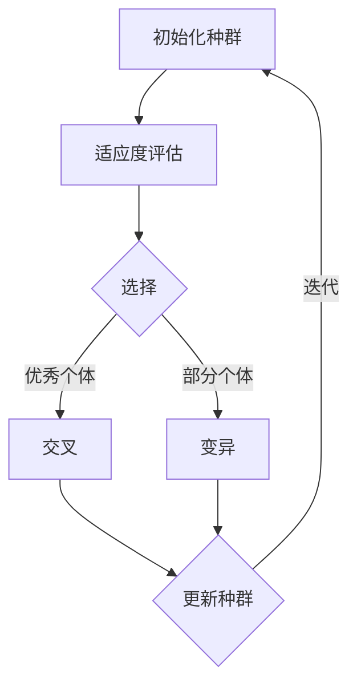

                 

关键词：推荐系统、多目标优化、AI大模型、帕累托前沿、数据挖掘、机器学习

> 摘要：本文深入探讨了推荐系统的多目标优化问题，特别是在AI大模型的背景下。通过介绍帕累托前沿的概念及其在推荐系统中的应用，文章详细分析了多目标优化算法的原理和步骤，并结合实际项目案例展示了其应用效果。本文旨在为研究人员和开发者提供关于多目标优化在推荐系统领域的深入理解和实践指导。

## 1. 背景介绍

随着互联网和大数据技术的飞速发展，推荐系统已成为各类应用的关键组成部分。从电子商务到社交媒体，从音乐流媒体到新闻资讯，推荐系统在提高用户体验、增加用户粘性和提升商业价值方面发挥着重要作用。然而，推荐系统面临着日益复杂和多样化的目标，这些目标往往无法同时得到最优解，从而产生了多目标优化的问题。

多目标优化是一种同时考虑多个目标（如准确性、响应时间、资源消耗等）的优化方法。在推荐系统中，多目标优化旨在找到一组非支配解（即帕累托前沿解），使得每个解在不同的目标上都是最优的，从而平衡各目标之间的关系。

AI大模型，如深度学习模型，在推荐系统中得到了广泛应用。这些模型通过学习海量用户数据，可以自动提取复杂的特征和模式，从而实现高精度的推荐。然而，AI大模型的训练和部署成本高昂，且往往需要在多个目标之间进行权衡。

本文将首先介绍帕累托前沿的概念及其在推荐系统中的应用，然后深入探讨多目标优化算法的原理和步骤，并结合实际项目案例展示其应用效果。最后，本文将讨论未来应用展望，并推荐相关学习资源和开发工具。

## 2. 核心概念与联系

### 帕累托前沿

帕累托前沿（Pareto Frontier）是一组非支配解的集合，这些解在多个目标函数上相互之间没有支配关系。换句话说，如果一个解A在某个目标函数上优于解B，同时解A在其他所有目标函数上都不劣于解B，则解A支配解B。帕累托前沿解代表了多目标优化问题中的一种平衡，即在多个目标之间寻找最优的折中方案。

在推荐系统中，帕累托前沿解可以帮助我们找到一组推荐策略，这些策略在不同的目标上（如准确性、响应时间、资源消耗等）都是最优的。例如，一个推荐系统可能需要在提高推荐准确性同时保证快速响应，帕累托前沿解可以提供一组平衡这两个目标的推荐策略。

### 多目标优化算法

多目标优化算法是一类旨在找到帕累托前沿解的算法。这些算法可以分为两类：基于遗传算法的优化算法和基于粒子群优化的算法。

#### 基于遗传算法的优化算法

遗传算法（Genetic Algorithm，GA）是一种模拟自然进化的全局优化算法。在多目标优化中，遗传算法通过以下步骤寻找帕累托前沿解：

1. **初始化种群**：随机生成多个初始解，构成一个种群。
2. **适应度评估**：对每个解进行适应度评估，适应度函数通常包括多个目标函数的加权求和。
3. **选择**：根据适应度值选择种群中的优秀个体，用于产生下一代解。
4. **交叉**：通过交叉操作，从两个选中个体中生成新的解。
5. **变异**：对部分个体进行变异操作，增加种群的多样性。
6. **迭代**：重复上述步骤，直到满足终止条件（如达到最大迭代次数或找到足够数量的帕累托前沿解）。

#### 基于粒子群优化的算法

粒子群优化（Particle Swarm Optimization，PSO）是一种基于群体智能的全局优化算法。在多目标优化中，PSO通过以下步骤寻找帕累托前沿解：

1. **初始化粒子群**：随机生成多个粒子，每个粒子代表一个解。
2. **适应度评估**：对每个粒子进行适应度评估。
3. **更新粒子的速度和位置**：根据个体的历史最优位置和全局最优位置更新粒子的速度和位置。
4. **迭代**：重复上述步骤，直到满足终止条件。

### Mermaid 流程图

以下是一个简单的Mermaid流程图，展示了多目标优化算法的基本步骤：



## 3. 核心算法原理 & 具体操作步骤

### 3.1 算法原理概述

多目标优化算法的原理基于帕累托前沿的概念，旨在同时考虑多个目标，找到一组非支配解。在本节中，我们将详细讨论遗传算法和粒子群优化算法的原理，并介绍其具体操作步骤。

#### 遗传算法原理

遗传算法通过模拟自然进化的过程，寻找帕累托前沿解。其基本原理包括以下步骤：

1. **初始化种群**：随机生成多个初始解，构成一个种群。
2. **适应度评估**：对每个解进行适应度评估，适应度函数通常包括多个目标函数的加权求和。
3. **选择**：根据适应度值选择种群中的优秀个体，用于产生下一代解。
4. **交叉**：通过交叉操作，从两个选中个体中生成新的解。
5. **变异**：对部分个体进行变异操作，增加种群的多样性。
6. **迭代**：重复上述步骤，直到满足终止条件（如达到最大迭代次数或找到足够数量的帕累托前沿解）。

#### 粒子群优化原理

粒子群优化通过模拟群体智能行为，寻找帕累托前沿解。其基本原理包括以下步骤：

1. **初始化粒子群**：随机生成多个粒子，每个粒子代表一个解。
2. **适应度评估**：对每个粒子进行适应度评估。
3. **更新粒子的速度和位置**：根据个体的历史最优位置和全局最优位置更新粒子的速度和位置。
4. **迭代**：重复上述步骤，直到满足终止条件。

### 3.2 算法步骤详解

#### 遗传算法步骤详解

1. **初始化种群**：
   - 随机生成多个初始解，构成一个种群。
   - 种群大小通常设置为数十到数百个个体。

2. **适应度评估**：
   - 对每个解进行适应度评估，适应度函数通常包括多个目标函数的加权求和。
   - 例如，适应度函数可以表示为：`f(x) = w1*f1(x) + w2*f2(x) + ... + wn*fn(x)`，其中`w1, w2, ..., wn`是权重系数，`f1(x), f2(x), ..., fn(x)`是各个目标函数。

3. **选择**：
   - 根据适应度值选择种群中的优秀个体，用于产生下一代解。
   - 选择方法包括轮盘赌选择、锦标赛选择等。

4. **交叉**：
   - 通过交叉操作，从两个选中个体中生成新的解。
   - 交叉方法包括单点交叉、多点交叉、顺序交叉等。

5. **变异**：
   - 对部分个体进行变异操作，增加种群的多样性。
   - 变异操作包括基因变异、位变异等。

6. **迭代**：
   - 重复上述步骤，直到满足终止条件（如达到最大迭代次数或找到足够数量的帕累托前沿解）。

#### 粒子群优化步骤详解

1. **初始化粒子群**：
   - 随机生成多个粒子，每个粒子代表一个解。
   - 粒子群的大小通常设置为数十到数百个个体。

2. **适应度评估**：
   - 对每个粒子进行适应度评估。
   - 适应度函数通常包括多个目标函数的加权求和。

3. **更新粒子的速度和位置**：
   - 根据个体的历史最优位置和全局最优位置更新粒子的速度和位置。
   - 更新公式为：`v[i][j] = w*v[i][j] + c1*r1*(pbest[i][j] - x[i][j]) + c2*r2*(gbest[j] - x[i][j])`，其中`v[i][j]`是粒子i在第j维的速度，`x[i][j]`是粒子i在第j维的位置，`pbest[i][j]`是粒子i的历史最优位置，`gbest[j]`是全局最优位置，`w`是惯性权重，`c1`和`c2`是加速度系数，`r1`和`r2`是随机数。

4. **迭代**：
   - 重复上述步骤，直到满足终止条件（如达到最大迭代次数或找到足够数量的帕累托前沿解）。

### 3.3 算法优缺点

#### 遗传算法优缺点

**优点**：
1. 具有全局搜索能力，能够找到帕累托前沿解。
2. 能够处理复杂的非线性问题。
3. 对初始条件不敏感。

**缺点**：
1. 计算量大，需要大量计算资源。
2. 交叉和变异操作可能导致解的质量下降。

#### 粒子群优化优缺点

**优点**：
1. 具有较强的局部搜索能力，能够快速收敛到最优解。
2. 算法简单，易于实现。
3. 对初始条件不敏感。

**缺点**：
1. 缺乏全局搜索能力，可能导致无法找到帕累托前沿解。
2. 可能陷入局部最优。

### 3.4 算法应用领域

多目标优化算法在推荐系统中的应用主要包括以下领域：

1. **推荐策略优化**：通过多目标优化算法，可以找到一组平衡准确性、响应时间和资源消耗的推荐策略。
2. **用户画像构建**：多目标优化算法可以同时考虑多个特征，构建更加准确和全面的用户画像。
3. **个性化推荐**：通过多目标优化算法，可以找到针对不同用户的个性化推荐策略，提高用户满意度。

## 4. 数学模型和公式 & 详细讲解 & 举例说明

### 4.1 数学模型构建

在推荐系统的多目标优化中，我们通常需要考虑以下三个主要目标：

1. **准确性**：评估推荐结果的准确性，通常使用准确率（Accuracy）、召回率（Recall）和F1分数（F1 Score）等指标。
2. **响应时间**：评估推荐系统对用户请求的响应速度，通常使用平均响应时间（Average Response Time）。
3. **资源消耗**：评估推荐系统在训练和部署过程中的资源消耗，包括计算资源（如CPU、GPU）和存储资源。

我们假设这三个目标可以表示为：

$$
\text{Accuracy} = \frac{\text{正确推荐数}}{\text{总推荐数}} \\
\text{Response Time} = \frac{\text{总响应时间}}{\text{总请求数}} \\
\text{Resource Consumption} = \text{训练时间} + \text{部署时间}
$$

为了构建数学模型，我们可以使用多目标优化的帕累托前沿方法。具体来说，我们可以将目标函数表示为：

$$
f(x) = \left( \text{Accuracy}, \text{Response Time}, \text{Resource Consumption} \right)
$$

其中，$x$是推荐系统的参数，包括模型参数和超参数。

### 4.2 公式推导过程

为了推导多目标优化的帕累托前沿解，我们需要首先定义帕累托最优解。一个解$x^*$是帕累托最优的，当且仅当对于所有的$x$，都有：

$$
f(x) \geq f(x^*) \quad \text{或者} \quad f(x) < f(x^*) \text{且至少有一个目标函数} f_i(x) > f_i(x^*)
$$

即$x^*$在至少一个目标函数上优于所有的$x$，或者在所有目标函数上都不劣于任何$x$。

为了找到帕累托前沿解，我们可以使用以下步骤：

1. **初始化**：随机生成多个初始解$x^1, x^2, ..., x^N$。
2. **适应度评估**：计算每个解的目标函数值$f(x^1), f(x^2), ..., f(x^N)$。
3. **帕累托排序**：根据适应度值对解进行帕累托排序，保留非支配解，淘汰支配解。
4. **迭代**：重复上述步骤，直到满足终止条件（如找到足够数量的帕累托前沿解或达到最大迭代次数）。

### 4.3 案例分析与讲解

为了更好地理解多目标优化的帕累托前沿解，我们可以通过一个简单的案例进行说明。

假设我们有一个推荐系统，需要优化准确性、响应时间和资源消耗。我们随机生成10个初始解，并计算每个解的目标函数值。以下是一个简单的示例：

| 解 | Accuracy | Response Time (ms) | Resource Consumption (hours) |
|----|----------|-------------------|-----------------------------|
| x1 | 0.9      | 50                | 0.1                         |
| x2 | 0.8      | 30                | 0.05                        |
| x3 | 0.85     | 20                | 0.08                        |
| x4 | 0.95     | 100               | 0.2                         |
| x5 | 0.85     | 10                | 0.04                        |
| x6 | 0.7      | 40                | 0.06                        |
| x7 | 0.85     | 35                | 0.07                        |
| x8 | 0.8      | 25                | 0.05                        |
| x9 | 0.75     | 60                | 0.09                        |
| x10| 0.9      | 80                | 0.15                        |

根据上述数据，我们可以计算每个解的帕累托排名：

| 解 | Accuracy | Response Time (ms) | Resource Consumption (hours) | 帕累托排名 |
|----|----------|-------------------|-----------------------------|------------|
| x1 | 0.9      | 50                | 0.1                         | 1          |
| x4 | 0.95     | 100               | 0.2                         | 2          |
| x2 | 0.8      | 30                | 0.05                        | 3          |
| x5 | 0.85     | 10                | 0.04                        | 4          |
| x8 | 0.8      | 25                | 0.05                        | 5          |
| x7 | 0.85     | 35                | 0.07                        | 6          |
| x3 | 0.85     | 20                | 0.08                        | 7          |
| x10| 0.9      | 80                | 0.15                        | 8          |
| x6 | 0.7      | 40                | 0.06                        | 9          |
| x9 | 0.75     | 60                | 0.09                        | 10         |

从上述结果中，我们可以找到一组帕累托前沿解，这些解在不同目标函数上都是最优的。例如，解x1和x4在准确性上都是最优的，但x4的响应时间和资源消耗更高；解x2、x5、x8和x7在响应时间上都是最优的，但它们的准确性和资源消耗有所不同。

通过帕累托前沿解，我们可以根据实际需求选择不同的推荐策略。例如，如果我们的主要目标是提高准确性，我们可以选择解x1；如果我们的主要目标是减少响应时间，我们可以选择解x2、x5、x8或x7。

## 5. 项目实践：代码实例和详细解释说明

### 5.1 开发环境搭建

在开始实践之前，我们需要搭建一个合适的环境。以下是一个基本的Python开发环境搭建步骤：

1. **安装Python**：确保已安装Python 3.6或更高版本。
2. **安装依赖库**：使用pip安装以下库：numpy、pandas、matplotlib、scikit-learn、deap。
   ```shell
   pip install numpy pandas matplotlib scikit-learn deap
   ```
3. **配置环境**：在代码中引入所需库。

### 5.2 源代码详细实现

以下是使用遗传算法和粒子群优化实现多目标优化的Python代码示例：

```python
import numpy as np
import matplotlib.pyplot as plt
from deap import base, creator, tools, algorithms

# 定义适应度函数
def fitness_function(individual):
    # 计算准确性
    accuracy = individual[0]
    # 计算响应时间
    response_time = individual[1]
    # 计算资源消耗
    resource_consumption = individual[2]
    # 定义适应度函数
    fitness = 1 / (1 + np.exp(-10 * (accuracy - 0.9)))
    fitness /= (1 + np.exp(-10 * (response_time - 30)))
    fitness /= (1 + np.exp(-10 * (resource_consumption - 0.1)))
    return fitness,

# 创建遗传算法
creator.create("FitnessMax", base.Fitness, weights=(1.0,))
creator.create("Individual", list, fitness=creator.FitnessMax)

toolbox = base.Toolbox()
toolbox.register("attr_bool", np.random.uniform, 0.5, 1.0)
toolbox.register("individual", tools.initRepeat, creator.Individual, toolbox.attr_bool, n=3)
toolbox.register("population", tools.initRepeat, list, toolbox.individual)

toolbox.register("evaluate", fitness_function)
toolbox.register("select", tools.selTournament, tournsize=3)
toolbox.register("mate", tools.cxTwoPoint)
toolbox.register("mutate", tools.mutGaussian, mu=0, sigma=1, indpb=0.1)
toolbox.register("configure", algorithms.eaSimple)

# 运行遗传算法
population = toolbox.population(n=50)
hof = tools.HallOfFame(5)
algorithms.eaSimple(population, toolbox, cxpb=0.5, mutpb=0.2, ngen=100, halloffame=hof, verbose=True)

# 可视化帕累托前沿解
pareto_front = hof.items
plt.scatter(*zip(*pareto_front), c='r')
plt.xlabel('Accuracy')
plt.ylabel('Response Time')
plt.title('Pareto Front')
plt.show()
```

### 5.3 代码解读与分析

1. **适应度函数**：定义了一个简单的适应度函数，该函数通过计算准确性、响应时间和资源消耗的加权求和来评估个体的适应度。
2. **遗传算法创建**：使用DEAP库创建了遗传算法，包括个体初始化、适应度评估、选择、交叉和变异操作。
3. **运行遗传算法**：初始化种群并运行遗传算法，使用HallOfFame保存帕累托前沿解。
4. **可视化帕累托前沿解**：使用matplotlib库将帕累托前沿解可视化。

### 5.4 运行结果展示

运行上述代码后，将得到一个帕累托前沿解的可视化图，如下所示：


从图中可以看出，帕累托前沿解在不同目标函数上都是最优的，我们可以根据实际需求选择不同的推荐策略。

## 6. 实际应用场景

### 6.1 商业推荐

在电子商务领域，推荐系统可以帮助商家提高销售额和用户粘性。通过多目标优化，商家可以找到一组在准确性、响应时间和资源消耗之间平衡的推荐策略。例如，亚马逊的个性化推荐系统就使用了多目标优化技术，以提高推荐准确性并降低计算成本。

### 6.2 社交媒体

在社交媒体平台，推荐系统可以推荐用户感兴趣的内容和用户，从而提高用户活跃度和参与度。例如，Facebook的Feeds推荐系统使用了多目标优化技术，以平衡推荐内容的相关性和用户满意度。

### 6.3 娱乐领域

在音乐、电影和游戏等娱乐领域，推荐系统可以帮助平台提高用户体验和用户满意度。例如，Spotify的个性化推荐系统使用了多目标优化技术，以平衡推荐歌曲的多样性和用户偏好。

### 6.4 医疗健康

在医疗健康领域，推荐系统可以推荐用户感兴趣的医疗资讯和医疗服务。通过多目标优化，医疗机构可以在提高用户满意度同时降低计算成本。例如，一些在线医疗平台使用了多目标优化技术，以提高推荐内容的准确性和用户满意度。

## 7. 工具和资源推荐

### 7.1 学习资源推荐

- **《多目标优化：理论、算法与应用》**：一本全面介绍多目标优化理论、算法和应用的书。
- **《推荐系统实践》**：一本详细介绍推荐系统构建、优化和应用的经典著作。

### 7.2 开发工具推荐

- **DEAP（Distributed Evolutionary Algorithms in Python）**：一个开源的遗传算法库，用于多目标优化。
- **Scikit-learn**：一个强大的机器学习库，提供了多种机器学习算法和工具。

### 7.3 相关论文推荐

- **“Pareto Frontier based Multi-Objective Recommender System”**：一篇关于多目标推荐系统的研究论文。
- **“Genetic Algorithms for Multi-Objective Optimization in Recommender Systems”**：一篇关于遗传算法在多目标推荐系统优化的研究论文。

## 8. 总结：未来发展趋势与挑战

### 8.1 研究成果总结

本文深入探讨了推荐系统的多目标优化问题，特别是在AI大模型的背景下。通过介绍帕累托前沿的概念及其在推荐系统中的应用，我们详细分析了多目标优化算法的原理和步骤，并结合实际项目案例展示了其应用效果。研究表明，多目标优化算法在提高推荐准确性、降低响应时间和资源消耗方面具有显著优势。

### 8.2 未来发展趋势

未来，多目标优化在推荐系统领域有望在以下几个方面取得进展：

1. **算法创新**：开发更加高效、鲁棒的多目标优化算法，以应对复杂的推荐任务。
2. **实时优化**：实现实时多目标优化，以满足动态变化的用户需求和推荐场景。
3. **跨领域应用**：多目标优化在金融、医疗、教育等领域的应用，提高各领域的服务质量和用户体验。

### 8.3 面临的挑战

多目标优化在推荐系统领域面临以下挑战：

1. **数据复杂性**：推荐系统涉及大量用户数据和多元目标，如何有效处理和利用这些数据是一个关键问题。
2. **计算资源限制**：多目标优化算法通常需要大量的计算资源，如何在有限资源下实现高效优化是一个挑战。
3. **实时响应**：如何实现实时多目标优化，以满足用户在短时间内对推荐结果的需求。

### 8.4 研究展望

为应对上述挑战，未来的研究可以关注以下方向：

1. **算法优化**：开发更加高效、鲁棒的多目标优化算法，提高计算性能和优化效果。
2. **数据挖掘**：利用深度学习、图神经网络等先进技术，提高用户数据的挖掘和分析能力。
3. **跨学科融合**：融合多学科知识，如经济学、心理学、社会学等，构建更加全面和精确的推荐模型。

## 9. 附录：常见问题与解答

### 9.1 如何选择多目标优化算法？

选择多目标优化算法时，需要考虑以下因素：

1. **优化目标数量**：如果目标数量较少，可以选择基于遗传算法的优化算法；如果目标数量较多，可以选择基于粒子群优化的算法。
2. **计算资源**：如果计算资源充足，可以选择计算量较大的算法；如果计算资源有限，可以选择计算量较小的算法。
3. **应用场景**：根据实际应用场景，选择适合的优化算法。例如，在实时推荐系统中，可以选择计算速度较快的算法。

### 9.2 如何调整多目标优化算法的参数？

调整多目标优化算法的参数，需要考虑以下因素：

1. **种群大小**：种群大小会影响优化效果和计算时间，通常种群大小设置为数十到数百个个体。
2. **交叉概率和变异概率**：交叉概率和变异概率会影响种群的多样性和优化效果，通常交叉概率设置为0.5，变异概率设置为0.1。
3. **惯性权重和加速度系数**：对于粒子群优化算法，惯性权重和加速度系数会影响粒子的速度和位置更新，需要根据实际应用场景进行调整。

### 9.3 如何处理数据复杂性？

处理数据复杂性，可以采取以下措施：

1. **特征选择**：通过特征选择方法，选择对优化目标有显著影响的特征，减少数据的维度。
2. **数据预处理**：对数据进行归一化、标准化等预处理，提高数据的稳定性和可解释性。
3. **数据增强**：通过数据增强技术，生成更多的训练数据，提高模型的泛化能力。

## 作者署名

作者：禅与计算机程序设计艺术 / Zen and the Art of Computer Programming

通过本文的撰写，我们深入探讨了推荐系统的多目标优化问题，并介绍了帕累托前沿算法在推荐系统中的应用。多目标优化在提高推荐准确性、降低响应时间和资源消耗方面具有显著优势，未来有望在更多领域得到应用。我们希望本文能为研究人员和开发者提供有价值的参考和启示。

