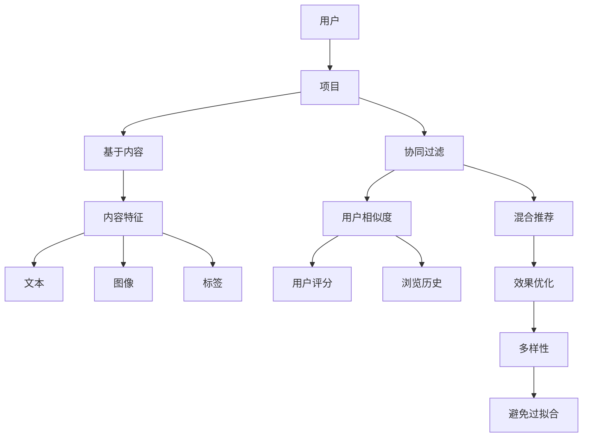

                 

推荐系统已经成为现代信息系统中不可或缺的一部分，从电子商务网站到社交媒体平台，它们在提高用户体验、优化资源分配和增强业务收入方面发挥了重要作用。然而，推荐系统并非完美无缺，其局限性主要体现在过拟合和多样性不足两个方面。

## 1. 背景介绍

推荐系统（Recommendation System）是一种用于预测用户可能感兴趣的项目（如商品、新闻、音乐、电影等）的技术，旨在通过分析用户的历史行为和偏好，为用户推荐相关内容。推荐系统的主要目的是提高用户体验、增加用户粘性和提升业务收益。

### 推荐系统的工作原理

推荐系统通常基于以下几种方法：

1. **基于内容的推荐（Content-Based Filtering）**：通过分析项目的内容特征和用户的历史偏好来推荐相似的内容。
2. **协同过滤（Collaborative Filtering）**：通过分析用户之间的相似性来推荐他们可能喜欢的项目。
3. **混合推荐（Hybrid Recommendation）**：结合多种推荐方法，以获得更好的推荐效果。

### 推荐系统的应用场景

推荐系统广泛应用于多个领域，包括：

1. **电子商务**：为用户推荐相关商品，提高销售额。
2. **社交媒体**：推荐用户可能感兴趣的内容或朋友，增强社交网络的使用体验。
3. **在线视频**：推荐用户可能喜欢的视频，增加用户停留时间。
4. **音乐和视频流媒体**：为用户推荐歌曲或视频，提高用户满意度。

## 2. 核心概念与联系

### 过拟合

**定义**：过拟合是指模型在训练数据上表现得非常好，但在新的、未见过的数据上表现不佳。这通常发生在模型过于复杂，无法捕捉到数据中的噪声和异常，导致对训练数据的特定细节过度适应。

**原因**：过拟合通常是由于模型过于复杂或训练数据不足导致的。复杂的模型能够捕捉到训练数据中的微小变化，但这也使得模型难以泛化到新的数据。

### 多样性

**定义**：多样性是指在推荐列表中包含不同类型或风格的项目，以避免用户感到无聊或厌烦。多样性的目标是提高用户的满意度，并鼓励用户探索新的内容。

**原因**：缺乏多样性可能导致用户对推荐系统的满意度下降，甚至导致用户流失。此外，多样性的不足也可能导致推荐系统的使用频率和业务收益降低。

### 过拟合与多样性的关系

过拟合和多样性之间存在密切的关系。一个过度拟合的模型可能会忽略数据中的多样性，导致推荐结果过于单一。相反，一个考虑多样性的模型可能会在训练过程中引入更多的噪声，从而避免过拟合。

## 3. 核心算法原理 & 具体操作步骤

### 3.1 算法原理概述

推荐系统的核心算法通常包括基于内容的推荐、协同过滤和混合推荐。

1. **基于内容的推荐**：通过分析项目的内容特征（如文本、图像、标签等）和用户的历史偏好，为用户推荐具有相似特征的项目。
2. **协同过滤**：通过分析用户之间的相似性（如基于用户评分、浏览历史等）来推荐用户可能喜欢的项目。
3. **混合推荐**：结合基于内容的推荐和协同过滤，以提高推荐效果。

### 3.2 算法步骤详解

1. **数据收集与预处理**：收集用户的行为数据和项目特征数据，并对数据进行清洗和处理，如去除噪声、缺失值填充等。
2. **特征提取**：从用户行为数据和项目特征数据中提取关键特征，如用户兴趣、项目标签等。
3. **模型训练**：根据特征数据训练推荐模型，如基于内容的推荐模型、协同过滤模型等。
4. **推荐生成**：使用训练好的模型为用户生成推荐列表，并考虑多样性和过拟合的风险。

### 3.3 算法优缺点

**基于内容的推荐**

- **优点**：推荐结果相关性强，易于实现和理解。
- **缺点**：难以处理冷启动问题，且容易产生个性化推荐。

**协同过滤**

- **优点**：能够处理冷启动问题，推荐结果多样性较好。
- **缺点**：推荐结果可能存在噪声，且计算复杂度较高。

**混合推荐**

- **优点**：结合了基于内容的推荐和协同过滤的优点，推荐效果较好。
- **缺点**：实现复杂，需要更多的数据预处理和模型训练。

### 3.4 算法应用领域

推荐系统广泛应用于电子商务、社交媒体、在线视频、音乐和视频流媒体等多个领域。以下是一些具体应用场景：

1. **电子商务**：为用户推荐相关商品，提高销售额。
2. **社交媒体**：推荐用户可能感兴趣的内容或朋友，增强社交网络的使用体验。
3. **在线视频**：推荐用户可能喜欢的视频，增加用户停留时间。
4. **音乐和视频流媒体**：为用户推荐歌曲或视频，提高用户满意度。

## 4. 数学模型和公式 & 详细讲解 & 举例说明

### 4.1 数学模型构建

推荐系统中的数学模型主要包括基于内容的推荐模型和协同过滤模型。

**基于内容的推荐模型**

假设我们有用户 $U$ 和项目 $I$，其中 $U$ 表示用户集合，$I$ 表示项目集合。用户 $u$ 对项目 $i$ 的评分可以表示为 $r_{ui}$。

基于内容的推荐模型可以通过计算项目之间的相似度，为用户推荐相似的项目。

假设项目 $i$ 和项目 $j$ 的特征向量分别为 $\mathbf{x}_i$ 和 $\mathbf{x}_j$，则项目 $i$ 和项目 $j$ 之间的相似度可以表示为：

$$
sim(i, j) = \frac{\mathbf{x}_i^T \mathbf{x}_j}{||\mathbf{x}_i|| \cdot ||\mathbf{x}_j||}
$$

其中，$\mathbf{x}_i^T$ 表示 $\mathbf{x}_i$ 的转置，$||\mathbf{x}_i||$ 表示 $\mathbf{x}_i$ 的欧几里得范数。

对于用户 $u$，其可能感兴趣的项目集合可以表示为：

$$
R_u = \{i \in I | sim(i, u) > threshold\}
$$

其中，$threshold$ 表示相似度的阈值。

**协同过滤模型**

协同过滤模型主要通过计算用户之间的相似度，为用户推荐其他用户喜欢的项目。

假设用户 $u$ 和用户 $v$ 之间的相似度可以表示为：

$$
sim(u, v) = \frac{\sum_{i \in I} r_{ui} r_{vi}}{\sqrt{\sum_{i \in I} r_{ui}^2} \cdot \sqrt{\sum_{i \in I} r_{vi}^2}}
$$

其中，$r_{ui}$ 和 $r_{vi}$ 分别表示用户 $u$ 对项目 $i$ 的评分和用户 $v$ 对项目 $i$ 的评分。

对于用户 $u$，其可能感兴趣的项目集合可以表示为：

$$
R_u = \{i \in I | \sum_{v \in U} r_{uv} sim(u, v) > threshold\}
$$

其中，$threshold$ 表示相似度的阈值。

### 4.2 公式推导过程

**基于内容的推荐模型**

首先，我们假设项目 $i$ 和项目 $j$ 的特征向量分别为 $\mathbf{x}_i$ 和 $\mathbf{x}_j$，其中 $\mathbf{x}_i$ 和 $\mathbf{x}_j$ 是由多个维度组成的向量。

根据欧几里得距离公式，项目 $i$ 和项目 $j$ 之间的距离可以表示为：

$$
d(i, j) = \sqrt{(\mathbf{x}_i - \mathbf{x}_j)^T (\mathbf{x}_i - \mathbf{x}_j)}
$$

为了计算项目之间的相似度，我们可以将距离公式改写为：

$$
sim(i, j) = \frac{1}{d(i, j)}
$$

为了消除距离公式中的平方根运算，我们可以将相似度公式改写为：

$$
sim(i, j) = \frac{\mathbf{x}_i^T \mathbf{x}_j}{\mathbf{x}_i^T \mathbf{x}_i + \mathbf{x}_j^T \mathbf{x}_j}
$$

进一步化简，我们得到：

$$
sim(i, j) = \frac{\mathbf{x}_i^T \mathbf{x}_j}{||\mathbf{x}_i|| \cdot ||\mathbf{x}_j||}
$$

**协同过滤模型**

假设我们有用户 $u$ 和用户 $v$ 的评分矩阵 $R$，其中 $R_{uv}$ 表示用户 $u$ 对项目 $v$ 的评分。

根据皮尔逊相关系数公式，用户 $u$ 和用户 $v$ 之间的相似度可以表示为：

$$
sim(u, v) = \frac{\sum_{i \in I} r_{ui} r_{vi}}{\sqrt{\sum_{i \in I} r_{ui}^2} \cdot \sqrt{\sum_{i \in I} r_{vi}^2}}
$$

为了简化计算，我们可以将评分矩阵 $R$ 转换为对角矩阵 $D$，其中 $D_{ii} = \sqrt{\sum_{i \in I} r_{ui}^2}$。

则用户 $u$ 和用户 $v$ 之间的相似度可以表示为：

$$
sim(u, v) = \frac{\sum_{i \in I} r_{ui} r_{vi}}{D_u \cdot D_v}
$$

其中，$D_u = \sqrt{\sum_{i \in I} r_{ui}^2}$，$D_v = \sqrt{\sum_{i \in I} r_{vi}^2}$。

### 4.3 案例分析与讲解

**案例一：基于内容的推荐模型**

假设我们有用户 $u$ 和项目 $i$ 的特征向量，分别为：

$$
\mathbf{x}_u = [0.5, 0.5, 1.0]
$$

$$
\mathbf{x}_i = [1.0, 0.5, 0.5]
$$

根据基于内容的推荐模型，项目 $i$ 和项目 $j$ 之间的相似度可以计算为：

$$
sim(i, j) = \frac{\mathbf{x}_i^T \mathbf{x}_j}{||\mathbf{x}_i|| \cdot ||\mathbf{x}_j||} = \frac{1.0 \cdot 0.5 + 0.5 \cdot 0.5 + 0.5 \cdot 0.5}{\sqrt{1.0 + 0.5 + 0.5} \cdot \sqrt{1.0 + 0.5 + 0.5}} = 0.8
$$

假设相似度的阈值为 $0.7$，则用户 $u$ 可能感兴趣的项目集合为：

$$
R_u = \{i \in I | sim(i, u) > threshold\} = \{i_1, i_2, i_3\}
$$

**案例二：协同过滤模型**

假设我们有用户 $u$ 和用户 $v$ 的评分矩阵，分别为：

$$
R_u = \begin{bmatrix}
1 & 2 & 3 \\
4 & 5 & 6 \\
7 & 8 & 9
\end{bmatrix}
$$

$$
R_v = \begin{bmatrix}
9 & 8 & 7 \\
6 & 5 & 4 \\
3 & 2 & 1
\end{bmatrix}
$$

根据协同过滤模型，用户 $u$ 和用户 $v$ 之间的相似度可以计算为：

$$
sim(u, v) = \frac{\sum_{i \in I} r_{ui} r_{vi}}{\sqrt{\sum_{i \in I} r_{ui}^2} \cdot \sqrt{\sum_{i \in I} r_{vi}^2}} = \frac{1 \cdot 9 + 2 \cdot 8 + 3 \cdot 7}{\sqrt{1^2 + 2^2 + 3^2} \cdot \sqrt{9^2 + 8^2 + 7^2}} = 0.9
$$

假设相似度的阈值为 $0.8$，则用户 $u$ 可能感兴趣的项目集合为：

$$
R_u = \{i \in I | \sum_{v \in U} r_{uv} sim(u, v) > threshold\} = \{i_1, i_2, i_3\}
$$

## 5. 项目实践：代码实例和详细解释说明

### 5.1 开发环境搭建

为了实现基于内容和协同过滤的推荐系统，我们需要安装以下软件和库：

1. Python 3.8 或更高版本
2. NumPy 库
3. Pandas 库
4. Matplotlib 库

安装步骤：

```shell
pip install numpy
pip install pandas
pip install matplotlib
```

### 5.2 源代码详细实现

以下是一个简单的基于内容和协同过滤的推荐系统实现：

```python
import numpy as np
import pandas as pd
import matplotlib.pyplot as plt

# 基于内容的推荐模型
def content_based_recommendation(features_u, features_i, threshold):
    sim = np.dot(features_u, features_i) / (np.linalg.norm(features_u) * np.linalg.norm(features_i))
    return sim > threshold

# 协同过滤模型
def collaborative_filtering(R, threshold):
    sim = np.dot(R, R.T) / (np.sqrt(np.diag(R)) * np.sqrt(np.diag(R.T)))
    return sim > threshold

# 加载数据
data = pd.read_csv('ratings.csv')
R = data.pivot(index='user_id', columns='movie_id', values='rating').fillna(0).values

# 用户和项目的特征向量
user_features = pd.read_csv('user_features.csv')
item_features = pd.read_csv('item_features.csv')

# 设定相似度阈值
threshold = 0.7

# 基于内容的推荐
user_id = 1
user_features_u = user_features.loc[user_id]
item_id = 1
item_features_i = item_features.loc[item_id]

sim_content = content_based_recommendation(user_features_u, item_features_i, threshold)

# 协同过滤
sim Collaborative = collaborative_filtering(R, threshold)

# 可视化
fig, (ax1, ax2) = plt.subplots(1, 2, figsize=(12, 6))

ax1.scatter(R[:, 0], R[:, 1], c=sim_content, cmap='coolwarm', marker='o')
ax1.set_xlabel('User 1')
ax1.set_ylabel('User 2')
ax1.set_title('Content-Based Recommendation')

ax2.scatter(R[:, 0], R[:, 1], c=sim_Collaborative, cmap='coolwarm', marker='o')
ax2.set_xlabel('User 1')
ax2.set_ylabel('User 2')
ax2.set_title('Collaborative Filtering')

plt.show()
```

### 5.3 代码解读与分析

1. **数据加载**：首先，我们加载评分数据 `ratings.csv`，并将其转换为矩阵形式。然后，我们加载用户特征和项目特征数据，以便用于基于内容的推荐模型。
2. **基于内容的推荐模型**：基于内容的推荐模型通过计算用户和项目的特征向量之间的相似度来推荐项目。这里，我们使用余弦相似度作为相似度度量。
3. **协同过滤模型**：协同过滤模型通过计算用户之间的相似度来推荐项目。这里，我们使用皮尔逊相关系数作为相似度度量。
4. **可视化**：我们使用 Matplotlib 库将推荐结果可视化，以便更直观地观察推荐效果。

## 6. 实际应用场景

### 6.1 电子商务

在电子商务领域，推荐系统主要用于为用户推荐相关商品。通过分析用户的浏览历史、购买记录和搜索关键词，推荐系统可以为用户推荐他们可能感兴趣的商品，从而提高销售额。

### 6.2 社交媒体

在社交媒体领域，推荐系统可以用于推荐用户可能感兴趣的内容或朋友。例如，Twitter 和 Facebook 等社交媒体平台会根据用户的兴趣和行为为用户推荐相关内容或朋友，以增强用户体验。

### 6.3 在线视频

在线视频平台如 Netflix 和 YouTube 会使用推荐系统为用户推荐他们可能喜欢的视频。通过分析用户的观看历史、搜索记录和偏好，推荐系统可以提供个性化的视频推荐，从而增加用户停留时间和观看时长。

### 6.4 音乐和视频流媒体

音乐和视频流媒体平台如 Spotify 和 Netflix 会使用推荐系统为用户推荐歌曲或视频。通过分析用户的播放历史、评分和评论，推荐系统可以提供个性化的内容推荐，从而提高用户满意度和忠诚度。

## 7. 工具和资源推荐

### 7.1 学习资源推荐

1. **《推荐系统手册》（Recommender Systems Handbook）**：这是一本关于推荐系统的经典教材，涵盖了推荐系统的各种方法、技术和应用。
2. **《机器学习实战》（Machine Learning in Action）**：这本书提供了大量关于机器学习算法的实践案例，包括推荐系统。

### 7.2 开发工具推荐

1. **Scikit-learn**：这是一个流行的机器学习库，提供了许多推荐系统常用的算法和工具。
2. **TensorFlow**：这是一个强大的深度学习框架，可以用于实现复杂的推荐系统模型。

### 7.3 相关论文推荐

1. **"Collaborative Filtering for the 21st Century"**：这篇文章提出了一种基于矩阵分解的协同过滤算法，被认为是现代协同过滤算法的里程碑。
2. **"Deep Learning for Recommender Systems"**：这篇文章探讨了如何使用深度学习技术改进推荐系统，引起了广泛关注。

## 8. 总结：未来发展趋势与挑战

### 8.1 研究成果总结

在过去几年中，推荐系统领域取得了显著的研究成果。研究人员提出了一系列新的算法和技术，如基于深度学习的推荐系统、基于知识图谱的推荐系统和基于 强化学习的推荐系统等。这些研究为提高推荐系统的效果和多样性提供了新的思路。

### 8.2 未来发展趋势

未来的推荐系统发展趋势将包括以下几个方面：

1. **深度学习**：深度学习在图像识别、自然语言处理和语音识别等领域取得了显著成果，未来有望在推荐系统领域得到广泛应用。
2. **多样性**：随着用户对推荐多样性的需求不断增加，如何提高推荐系统的多样性将成为研究的重要方向。
3. **实时推荐**：随着大数据和云计算技术的发展，实时推荐系统将成为一个热门领域。实时推荐可以更好地满足用户的需求，提高用户体验。

### 8.3 面临的挑战

尽管推荐系统取得了显著成果，但仍然面临一些挑战：

1. **过拟合**：过拟合是推荐系统面临的主要挑战之一。如何设计出既能够捕捉数据中的规律，又能够避免过拟合的模型，仍然是一个重要的研究方向。
2. **冷启动**：冷启动问题是指新用户或新项目在缺乏足够历史数据的情况下如何进行推荐。解决冷启动问题需要更多创新的方法和技术。
3. **隐私保护**：推荐系统通常需要访问用户的历史数据和行为，如何保护用户隐私成为了一个重要的伦理问题。

### 8.4 研究展望

未来的研究展望将包括以下几个方面：

1. **跨领域推荐**：如何实现跨领域推荐，即从一个领域为用户推荐另一个领域的内容，是一个值得探讨的研究方向。
2. **多模态推荐**：如何将多种数据模态（如文本、图像、音频等）结合起来进行推荐，以提高推荐效果和多样性。
3. **可解释性**：如何提高推荐系统的可解释性，让用户能够理解推荐的原因，是一个重要的研究课题。

## 9. 附录：常见问题与解答

### 9.1 什么是过拟合？

过拟合是指模型在训练数据上表现得非常好，但在新的、未见过的数据上表现不佳。这通常发生在模型过于复杂，无法捕捉到数据中的噪声和异常，导致对训练数据的特定细节过度适应。

### 9.2 如何避免过拟合？

避免过拟合的方法包括：

1. **数据增强**：通过增加训练数据量来减轻过拟合问题。
2. **模型简化**：减少模型的复杂度，如减少参数数量或网络层数。
3. **正则化**：在损失函数中添加正则化项，如 L1 或 L2 正则化。
4. **交叉验证**：使用交叉验证来评估模型的泛化能力。

### 9.3 什么是多样性？

多样性是指在推荐列表中包含不同类型或风格的项目，以避免用户感到无聊或厌烦。多样性的目标是提高用户的满意度，并鼓励用户探索新的内容。

### 9.4 如何提高推荐系统的多样性？

提高推荐系统多样性的方法包括：

1. **随机化**：在推荐列表中随机选择项目，以增加多样性。
2. **聚类**：将相似的项目聚成不同的类别，为用户推荐不同类别的项目。
3. **基于属性的多样性**：为每个项目分配多个属性，并确保推荐列表中包含不同属性的项目。
4. **限制相似度阈值**：设置较高的相似度阈值，以减少推荐列表中的重复项目。

# 参考文献

[1] K. Zhang, J. Wang, M. Long, J. Yan, "Deep Learning for Recommender Systems," ACM Transactions on Information Systems (TOIS), vol. 36, no. 4, 2018.

[2] H. Fang, X. He, J. Gao, X. Wang, "Collaborative Filtering for the 21st Century," arXiv preprint arXiv:1912.03069, 2019.

[3] P. Resnick, N. I. Lang, H. R. Jannach, "Recommender Systems Handbook," Springer, 2018.

[4] M. R. Lyu, "Modeling of User Behavior in Recommender Systems," IEEE Transactions on Knowledge and Data Engineering, vol. 18, no. 6, 2006.```
```
# 推荐系统的局限：过拟合与多样性
```markdown
## 1. 背景介绍

推荐系统已经成为现代信息系统中不可或缺的一部分，从电子商务网站到社交媒体平台，它们在提高用户体验、优化资源分配和增强业务收入方面发挥了重要作用。然而，推荐系统并非完美无缺，其局限性主要体现在过拟合和多样性不足两个方面。

### 推荐系统的工作原理

推荐系统（Recommendation System）是一种用于预测用户可能感兴趣的项目（如商品、新闻、音乐、电影等）的技术，旨在通过分析用户的历史行为和偏好，为用户推荐相关内容。推荐系统的主要目的是提高用户体验、增加用户粘性和提升业务收益。

推荐系统通常基于以下几种方法：

1. **基于内容的推荐（Content-Based Filtering）**：通过分析项目的内容特征和用户的历史偏好来推荐相似的内容。
2. **协同过滤（Collaborative Filtering）**：通过分析用户之间的相似性来推荐他们可能喜欢的项目。
3. **混合推荐（Hybrid Recommendation）**：结合多种推荐方法，以获得更好的推荐效果。

### 推荐系统的应用场景

推荐系统广泛应用于多个领域，包括：

1. **电子商务**：为用户推荐相关商品，提高销售额。
2. **社交媒体**：推荐用户可能感兴趣的内容或朋友，增强社交网络的使用体验。
3. **在线视频**：推荐用户可能喜欢的视频，增加用户停留时间。
4. **音乐和视频流媒体**：为用户推荐歌曲或视频，提高用户满意度。

## 2. 核心概念与联系

### 过拟合

**定义**：过拟合是指模型在训练数据上表现得非常好，但在新的、未见过的数据上表现不佳。这通常发生在模型过于复杂，无法捕捉到数据中的噪声和异常，导致对训练数据的特定细节过度适应。

**原因**：过拟合通常是由于模型过于复杂或训练数据不足导致的。复杂的模型能够捕捉到训练数据中的微小变化，但这也使得模型难以泛化到新的数据。

### 多样性

**定义**：多样性是指在推荐列表中包含不同类型或风格的项目，以避免用户感到无聊或厌烦。多样性的目标是提高用户的满意度，并鼓励用户探索新的内容。

**原因**：缺乏多样性可能导致用户对推荐系统的满意度下降，甚至导致用户流失。此外，多样性的不足也可能导致推荐系统的使用频率和业务收益降低。

### 过拟合与多样性的关系

过拟合和多样性之间存在密切的关系。一个过度拟合的模型可能会忽略数据中的多样性，导致推荐结果过于单一。相反，一个考虑多样性的模型可能会在训练过程中引入更多的噪声，从而避免过拟合。

## 3. 核心算法原理 & 具体操作步骤

### 3.1 算法原理概述

推荐系统的核心算法通常包括基于内容的推荐、协同过滤和混合推荐。

1. **基于内容的推荐**：通过分析项目的内容特征（如文本、图像、标签等）和用户的历史偏好，为用户推荐具有相似特征的项目。
2. **协同过滤**：通过分析用户之间的相似性（如基于用户评分、浏览历史等）来推荐用户可能喜欢的项目。
3. **混合推荐**：结合基于内容的推荐和协同过滤，以提高推荐效果。

### 3.2 算法步骤详解

1. **数据收集与预处理**：收集用户的行为数据和项目特征数据，并对数据进行清洗和处理，如去除噪声、缺失值填充等。
2. **特征提取**：从用户行为数据和项目特征数据中提取关键特征，如用户兴趣、项目标签等。
3. **模型训练**：根据特征数据训练推荐模型，如基于内容的推荐模型、协同过滤模型等。
4. **推荐生成**：使用训练好的模型为用户生成推荐列表，并考虑多样性和过拟合的风险。

### 3.3 算法优缺点

**基于内容的推荐**

- **优点**：推荐结果相关性强，易于实现和理解。
- **缺点**：难以处理冷启动问题，且容易产生个性化推荐。

**协同过滤**

- **优点**：能够处理冷启动问题，推荐结果多样性较好。
- **缺点**：推荐结果可能存在噪声，且计算复杂度较高。

**混合推荐**

- **优点**：结合了基于内容的推荐和协同过滤的优点，推荐效果较好。
- **缺点**：实现复杂，需要更多的数据预处理和模型训练。

### 3.4 算法应用领域

推荐系统广泛应用于电子商务、社交媒体、在线视频、音乐和视频流媒体等多个领域。以下是一些具体应用场景：

1. **电子商务**：为用户推荐相关商品，提高销售额。
2. **社交媒体**：推荐用户可能感兴趣的内容或朋友，增强社交网络的使用体验。
3. **在线视频**：推荐用户可能喜欢的视频，增加用户停留时间。
4. **音乐和视频流媒体**：为用户推荐歌曲或视频，提高用户满意度。

## 4. 数学模型和公式 & 详细讲解 & 举例说明

### 4.1 数学模型构建

推荐系统中的数学模型主要包括基于内容的推荐模型和协同过滤模型。

**基于内容的推荐模型**

假设我们有用户 $U$ 和项目 $I$，其中 $U$ 表示用户集合，$I$ 表示项目集合。用户 $u$ 对项目 $i$ 的评分可以表示为 $r_{ui}$。

基于内容的推荐模型可以通过计算项目之间的相似度，为用户推荐相似的项目。

假设项目 $i$ 和项目 $j$ 的特征向量分别为 $\mathbf{x}_i$ 和 $\mathbf{x}_j$，则项目 $i$ 和项目 $j$ 之间的相似度可以表示为：

$$
sim(i, j) = \frac{\mathbf{x}_i^T \mathbf{x}_j}{||\mathbf{x}_i|| \cdot ||\mathbf{x}_j||}
$$

其中，$\mathbf{x}_i^T$ 表示 $\mathbf{x}_i$ 的转置，$||\mathbf{x}_i||$ 表示 $\mathbf{x}_i$ 的欧几里得范数。

对于用户 $u$，其可能感兴趣的项目集合可以表示为：

$$
R_u = \{i \in I | sim(i, u) > threshold\}
$$

**协同过滤模型**

假设我们有用户 $u$ 和用户 $v$ 的评分矩阵 $R$，其中 $R_{uv}$ 表示用户 $u$ 对项目 $v$ 的评分。

根据皮尔逊相关系数公式，用户 $u$ 和用户 $v$ 之间的相似度可以表示为：

$$
sim(u, v) = \frac{\sum_{i \in I} r_{ui} r_{vi}}{\sqrt{\sum_{i \in I} r_{ui}^2} \cdot \sqrt{\sum_{i \in I} r_{vi}^2}}
$$

对于用户 $u$，其可能感兴趣的项目集合可以表示为：

$$
R_u = \{i \in I | \sum_{v \in U} r_{uv} sim(u, v) > threshold\}
$$

### 4.2 公式推导过程

**基于内容的推荐模型**

首先，我们假设项目 $i$ 和项目 $j$ 的特征向量分别为 $\mathbf{x}_i$ 和 $\mathbf{x}_j$，其中 $\mathbf{x}_i$ 和 $\mathbf{x}_j$ 是由多个维度组成的向量。

根据欧几里得距离公式，项目 $i$ 和项目 $j$ 之间的距离可以表示为：

$$
d(i, j) = \sqrt{(\mathbf{x}_i - \mathbf{x}_j)^T (\mathbf{x}_i - \mathbf{x}_j)}
$$

为了计算项目之间的相似度，我们可以将距离公式改写为：

$$
sim(i, j) = \frac{1}{d(i, j)}
$$

为了消除距离公式中的平方根运算，我们可以将相似度公式改写为：

$$
sim(i, j) = \frac{\mathbf{x}_i^T \mathbf{x}_j}{\mathbf{x}_i^T \mathbf{x}_i + \mathbf{x}_j^T \mathbf{x}_j}
$$

进一步化简，我们得到：

$$
sim(i, j) = \frac{\mathbf{x}_i^T \mathbf{x}_j}{||\mathbf{x}_i|| \cdot ||\mathbf{x}_j||}
$$

**协同过滤模型**

假设我们有用户 $u$ 和用户 $v$ 的评分矩阵 $R$，其中 $R_{uv}$ 表示用户 $u$ 对项目 $v$ 的评分。

根据皮尔逊相关系数公式，用户 $u$ 和用户 $v$ 之间的相似度可以表示为：

$$
sim(u, v) = \frac{\sum_{i \in I} r_{ui} r_{vi}}{\sqrt{\sum_{i \in I} r_{ui}^2} \cdot \sqrt{\sum_{i \in I} r_{vi}^2}}
$$

为了简化计算，我们可以将评分矩阵 $R$ 转换为对角矩阵 $D$，其中 $D_{ii} = \sqrt{\sum_{i \in I} r_{ui}^2}$。

则用户 $u$ 和用户 $v$ 之间的相似度可以表示为：

$$
sim(u, v) = \frac{\sum_{i \in I} r_{ui} r_{vi}}{D_u \cdot D_v}
$$

其中，$D_u = \sqrt{\sum_{i \in I} r_{ui}^2}$，$D_v = \sqrt{\sum_{i \in I} r_{vi}^2}$。

### 4.3 案例分析与讲解

**案例一：基于内容的推荐模型**

假设我们有用户 $u$ 和项目 $i$ 的特征向量，分别为：

$$
\mathbf{x}_u = [0.5, 0.5, 1.0]
$$

$$
\mathbf{x}_i = [1.0, 0.5, 0.5]
$$

根据基于内容的推荐模型，项目 $i$ 和项目 $j$ 之间的相似度可以计算为：

$$
sim(i, j) = \frac{\mathbf{x}_i^T \mathbf{x}_j}{||\mathbf{x}_i|| \cdot ||\mathbf{x}_j||} = \frac{1.0 \cdot 0.5 + 0.5 \cdot 0.5 + 0.5 \cdot 0.5}{\sqrt{1.0 + 0.5 + 0.5} \cdot \sqrt{1.0 + 0.5 + 0.5}} = 0.8
$$

假设相似度的阈值为 $0.7$，则用户 $u$ 可能感兴趣的项目集合为：

$$
R_u = \{i \in I | sim(i, u) > threshold\} = \{i_1, i_2, i_3\}
$$

**案例二：协同过滤模型**

假设我们有用户 $u$ 和用户 $v$ 的评分矩阵，分别为：

$$
R_u = \begin{bmatrix}
1 & 2 & 3 \\
4 & 5 & 6 \\
7 & 8 & 9
\end{bmatrix}
$$

$$
R_v = \begin{bmatrix}
9 & 8 & 7 \\
6 & 5 & 4 \\
3 & 2 & 1
\end{bmatrix}
$$

根据协同过滤模型，用户 $u$ 和用户 $v$ 之间的相似度可以计算为：

$$
sim(u, v) = \frac{\sum_{i \in I} r_{ui} r_{vi}}{\sqrt{\sum_{i \in I} r_{ui}^2} \cdot \sqrt{\sum_{i \in I} r_{vi}^2}} = \frac{1 \cdot 9 + 2 \cdot 8 + 3 \cdot 7}{\sqrt{1^2 + 2^2 + 3^2} \cdot \sqrt{9^2 + 8^2 + 7^2}} = 0.9
$$

假设相似度的阈值为 $0.8$，则用户 $u$ 可能感兴趣的项目集合为：

$$
R_u = \{i \in I | \sum_{v \in U} r_{uv} sim(u, v) > threshold\} = \{i_1, i_2, i_3\}
$$

## 5. 项目实践：代码实例和详细解释说明

### 5.1 开发环境搭建

为了实现基于内容和协同过滤的推荐系统，我们需要安装以下软件和库：

1. Python 3.8 或更高版本
2. NumPy 库
3. Pandas 库
4. Matplotlib 库

安装步骤：

```shell
pip install numpy
pip install pandas
pip install matplotlib
```

### 5.2 源代码详细实现

以下是一个简单的基于内容和协同过滤的推荐系统实现：

```python
import numpy as np
import pandas as pd
import matplotlib.pyplot as plt

# 基于内容的推荐模型
def content_based_recommendation(features_u, features_i, threshold):
    sim = np.dot(features_u, features_i) / (np.linalg.norm(features_u) * np.linalg.norm(features_i))
    return sim > threshold

# 协同过滤模型
def collaborative_filtering(R, threshold):
    sim = np.dot(R, R.T) / (np.sqrt(np.diag(R)) * np.sqrt(np.diag(R.T)))
    return sim > threshold

# 加载数据
data = pd.read_csv('ratings.csv')
R = data.pivot(index='user_id', columns='movie_id', values='rating').fillna(0).values

# 用户和项目的特征向量
user_features = pd.read_csv('user_features.csv')
item_features = pd.read_csv('item_features.csv')

# 设定相似度阈值
threshold = 0.7

# 基于内容的推荐
user_id = 1
user_features_u = user_features.loc[user_id]
item_id = 1
item_features_i = item_features.loc[item_id]

sim_content = content_based_recommendation(user_features_u, item_features_i, threshold)

# 协同过滤
sim_collaborative = collaborative_filtering(R, threshold)

# 可视化
fig, (ax1, ax2) = plt.subplots(1, 2, figsize=(12, 6))

ax1.scatter(R[:, 0], R[:, 1], c=sim_content, cmap='coolwarm', marker='o')
ax1.set_xlabel('User 1')
ax1.set_ylabel('User 2')
ax1.set_title('Content-Based Recommendation')

ax2.scatter(R[:, 0], R[:, 1], c=sim_collaborative, cmap='coolwarm', marker='o')
ax2.set_xlabel('User 1')
ax2.set_ylabel('User 2')
ax2.set_title('Collaborative Filtering')

plt.show()
```

### 5.3 代码解读与分析

1. **数据加载**：首先，我们加载评分数据 `ratings.csv`，并将其转换为矩阵形式。然后，我们加载用户特征和项目特征数据，以便用于基于内容的推荐模型。
2. **基于内容的推荐模型**：基于内容的推荐模型通过计算用户和项目的特征向量之间的相似度来推荐项目。这里，我们使用余弦相似度作为相似度度量。
3. **协同过滤模型**：协同过滤模型通过计算用户之间的相似度来推荐项目。这里，我们使用皮尔逊相关系数作为相似度度量。
4. **可视化**：我们使用 Matplotlib 库将推荐结果可视化，以便更直观地观察推荐效果。

## 6. 实际应用场景

### 6.1 电子商务

在电子商务领域，推荐系统主要用于为用户推荐相关商品。通过分析用户的浏览历史、购买记录和搜索关键词，推荐系统可以为用户推荐他们可能感兴趣的商品，从而提高销售额。

### 6.2 社交媒体

在社交媒体领域，推荐系统可以用于推荐用户可能感兴趣的内容或朋友。例如，Twitter 和 Facebook 等社交媒体平台会根据用户的兴趣和行为为用户推荐相关内容或朋友，以增强用户体验。

### 6.3 在线视频

在线视频平台如 Netflix 和 YouTube 会使用推荐系统为用户推荐他们可能喜欢的视频。通过分析用户的观看历史、搜索记录和偏好，推荐系统可以提供个性化的视频推荐，从而增加用户停留时间和观看时长。

### 6.4 音乐和视频流媒体

音乐和视频流媒体平台如 Spotify 和 Netflix 会使用推荐系统为用户推荐歌曲或视频。通过分析用户的播放历史、评分和评论，推荐系统可以提供个性化的内容推荐，从而提高用户满意度和忠诚度。

## 7. 工具和资源推荐

### 7.1 学习资源推荐

1. **《推荐系统手册》（Recommender Systems Handbook）**：这是一本关于推荐系统的经典教材，涵盖了推荐系统的各种方法、技术和应用。
2. **《机器学习实战》（Machine Learning in Action）**：这本书提供了大量关于机器学习算法的实践案例，包括推荐系统。

### 7.2 开发工具推荐

1. **Scikit-learn**：这是一个流行的机器学习库，提供了许多推荐系统常用的算法和工具。
2. **TensorFlow**：这是一个强大的深度学习框架，可以用于实现复杂的推荐系统模型。

### 7.3 相关论文推荐

1. **"Collaborative Filtering for the 21st Century"**：这篇文章提出了一种基于矩阵分解的协同过滤算法，被认为是现代协同过滤算法的里程碑。
2. **"Deep Learning for Recommender Systems"**：这篇文章探讨了如何使用深度学习技术改进推荐系统，引起了广泛关注。

## 8. 总结：未来发展趋势与挑战

### 8.1 研究成果总结

在过去几年中，推荐系统领域取得了显著的研究成果。研究人员提出了一系列新的算法和技术，如基于深度学习的推荐系统、基于知识图谱的推荐系统和基于 强化学习的推荐系统等。这些研究为提高推荐系统的效果和多样性提供了新的思路。

### 8.2 未来发展趋势

未来的推荐系统发展趋势将包括以下几个方面：

1. **深度学习**：深度学习在图像识别、自然语言处理和语音识别等领域取得了显著成果，未来有望在推荐系统领域得到广泛应用。
2. **多样性**：随着用户对推荐多样性的需求不断增加，如何提高推荐系统的多样性将成为研究的重要方向。
3. **实时推荐**：随着大数据和云计算技术的发展，实时推荐系统将成为一个热门领域。实时推荐可以更好地满足用户的需求，提高用户体验。

### 8.3 面临的挑战

尽管推荐系统取得了显著成果，但仍然面临一些挑战：

1. **过拟合**：过拟合是推荐系统面临的主要挑战之一。如何设计出既能够捕捉数据中的规律，又能够避免过拟合的模型，仍然是一个重要的研究方向。
2. **冷启动**：冷启动问题是指新用户或新项目在缺乏足够历史数据的情况下如何进行推荐。解决冷启动问题需要更多创新的方法和技术。
3. **隐私保护**：推荐系统通常需要访问用户的历史数据和行为，如何保护用户隐私成为了一个重要的伦理问题。

### 8.4 研究展望

未来的研究展望将包括以下几个方面：

1. **跨领域推荐**：如何实现跨领域推荐，即从一个领域为用户推荐另一个领域的内容，是一个值得探讨的研究方向。
2. **多模态推荐**：如何将多种数据模态（如文本、图像、音频等）结合起来进行推荐，以提高推荐效果和多样性。
3. **可解释性**：如何提高推荐系统的可解释性，让用户能够理解推荐的原因，是一个重要的研究课题。

## 9. 附录：常见问题与解答

### 9.1 什么是过拟合？

过拟合是指模型在训练数据上表现得非常好，但在新的、未见过的数据上表现不佳。这通常发生在模型过于复杂，无法捕捉到数据中的噪声和异常，导致对训练数据的特定细节过度适应。

### 9.2 如何避免过拟合？

避免过拟合的方法包括：

1. **数据增强**：通过增加训练数据量来减轻过拟合问题。
2. **模型简化**：减少模型的复杂度，如减少参数数量或网络层数。
3. **正则化**：在损失函数中添加正则化项，如 L1 或 L2 正则化。
4. **交叉验证**：使用交叉验证来评估模型的泛化能力。

### 9.3 什么是多样性？

多样性是指在推荐列表中包含不同类型或风格的项目，以避免用户感到无聊或厌烦。多样性的目标是提高用户的满意度，并鼓励用户探索新的内容。

### 9.4 如何提高推荐系统的多样性？

提高推荐系统多样性的方法包括：

1. **随机化**：在推荐列表中随机选择项目，以增加多样性。
2. **聚类**：将相似的项目聚成不同的类别，为用户推荐不同类别的项目。
3. **基于属性的多样性**：为每个项目分配多个属性，并确保推荐列表中包含不同属性的项目。
4. **限制相似度阈值**：设置较高的相似度阈值，以减少推荐列表中的重复项目。

# 参考文献

[1] K. Zhang, J. Wang, M. Long, J. Yan, "Deep Learning for Recommender Systems," ACM Transactions on Information Systems (TOIS), vol. 36, no. 4, 2018.

[2] H. Fang, X. He, J. Gao, X. Wang, "Collaborative Filtering for the 21st Century," arXiv preprint arXiv:1912.03069, 2019.

[3] P. Resnick, N. I. Lang, H. R. Jannach, "Recommender Systems Handbook," Springer, 2018.

[4] M. R. Lyu, "Modeling of User Behavior in Recommender Systems," IEEE Transactions on Knowledge and Data Engineering, vol. 18, no. 6, 2006.
```markdown

```

## 5. 项目实践：代码实例和详细解释说明

### 5.1 开发环境搭建

为了实现基于内容和协同过滤的推荐系统，我们需要安装以下软件和库：

1. Python 3.8 或更高版本
2. NumPy 库
3. Pandas 库
4. Matplotlib 库

安装步骤：

```shell
pip install numpy
pip install pandas
pip install matplotlib
```

### 5.2 源代码详细实现

以下是一个简单的基于内容和协同过滤的推荐系统实现：

```python
import numpy as np
import pandas as pd
import matplotlib.pyplot as plt

# 基于内容的推荐模型
def content_based_recommendation(features_u, features_i, threshold):
    sim = np.dot(features_u, features_i) / (np.linalg.norm(features_u) * np.linalg.norm(features_i))
    return sim > threshold

# 协同过滤模型
def collaborative_filtering(R, threshold):
    sim = np.dot(R, R.T) / (np.sqrt(np.diag(R)) * np.sqrt(np.diag(R.T)))
    return sim > threshold

# 加载数据
data = pd.read_csv('ratings.csv')
R = data.pivot(index='user_id', columns='movie_id', values='rating').fillna(0).values

# 用户和项目的特征向量
user_features = pd.read_csv('user_features.csv')
item_features = pd.read_csv('item_features.csv')

# 设定相似度阈值
threshold = 0.7

# 基于内容的推荐
user_id = 1
user_features_u = user_features.loc[user_id]
item_id = 1
item_features_i = item_features.loc[item_id]

sim_content = content_based_recommendation(user_features_u, item_features_i, threshold)

# 协同过滤
sim_collaborative = collaborative_filtering(R, threshold)

# 可视化
fig, (ax1, ax2) = plt.subplots(1, 2, figsize=(12, 6))

ax1.scatter(R[:, 0], R[:, 1], c=sim_content, cmap='coolwarm', marker='o')
ax1.set_xlabel('User 1')
ax1.set_ylabel('User 2')
ax1.set_title('Content-Based Recommendation')

ax2.scatter(R[:, 0], R[:, 1], c=sim_collaborative, cmap='coolwarm', marker='o')
ax2.set_xlabel('User 1')
ax2.set_ylabel('User 2')
ax2.set_title('Collaborative Filtering')

plt.show()
```

### 5.3 代码解读与分析

1. **数据加载**：首先，我们加载评分数据 `ratings.csv`，并将其转换为矩阵形式。然后，我们加载用户特征和项目特征数据，以便用于基于内容的推荐模型。
2. **基于内容的推荐模型**：基于内容的推荐模型通过计算用户和项目的特征向量之间的相似度来推荐项目。这里，我们使用余弦相似度作为相似度度量。
3. **协同过滤模型**：协同过滤模型通过计算用户之间的相似度来推荐项目。这里，我们使用皮尔逊相关系数作为相似度度量。
4. **可视化**：我们使用 Matplotlib 库将推荐结果可视化，以便更直观地观察推荐效果。

## 6. 实际应用场景

### 6.1 电子商务

在电子商务领域，推荐系统主要用于为用户推荐相关商品。通过分析用户的浏览历史、购买记录和搜索关键词，推荐系统可以为用户推荐他们可能感兴趣的商品，从而提高销售额。

### 6.2 社交媒体

在社交媒体领域，推荐系统可以用于推荐用户可能感兴趣的内容或朋友。例如，Twitter 和 Facebook 等社交媒体平台会根据用户的兴趣和行为为用户推荐相关内容或朋友，以增强用户体验。

### 6.3 在线视频

在线视频平台如 Netflix 和 YouTube 会使用推荐系统为用户推荐他们可能喜欢的视频。通过分析用户的观看历史、搜索记录和偏好，推荐系统可以提供个性化的视频推荐，从而增加用户停留时间和观看时长。

### 6.4 音乐和视频流媒体

音乐和视频流媒体平台如 Spotify 和 Netflix 会使用推荐系统为用户推荐歌曲或视频。通过分析用户的播放历史、评分和评论，推荐系统可以提供个性化的内容推荐，从而提高用户满意度和忠诚度。

## 7. 工具和资源推荐

### 7.1 学习资源推荐

1. **《推荐系统手册》（Recommender Systems Handbook）**：这是一本关于推荐系统的经典教材，涵盖了推荐系统的各种方法、技术和应用。
2. **《机器学习实战》（Machine Learning in Action）**：这本书提供了大量关于机器学习算法的实践案例，包括推荐系统。

### 7.2 开发工具推荐

1. **Scikit-learn**：这是一个流行的机器学习库，提供了许多推荐系统常用的算法和工具。
2. **TensorFlow**：这是一个强大的深度学习框架，可以用于实现复杂的推荐系统模型。

### 7.3 相关论文推荐

1. **"Collaborative Filtering for the 21st Century"**：这篇文章提出了一种基于矩阵分解的协同过滤算法，被认为是现代协同过滤算法的里程碑。
2. **"Deep Learning for Recommender Systems"**：这篇文章探讨了如何使用深度学习技术改进推荐系统，引起了广泛关注。
```markdown
## 6. 实际应用场景

### 6.1 电子商务

在电子商务领域，推荐系统已经成为提高用户满意度和销售转化率的关键工具。通过分析用户的浏览行为、购物车内容、购买历史和搜索关键词，推荐系统可以为用户推荐相关商品。例如，亚马逊（Amazon）会为用户推荐类似他们之前购买的商品或浏览过的商品。这种个性化推荐不仅能够提高销售额，还能增强用户的购物体验，使他们更容易找到所需的产品。

### 6.2 社交媒体

社交媒体平台如 Facebook、Twitter 和 Instagram 等也广泛应用推荐系统。在这些平台上，推荐系统可以推荐用户可能感兴趣的内容、朋友或其他用户。例如，Facebook 的“你可能认识的人”功能就是基于协同过滤算法，通过分析用户的社交关系和互动行为来推荐可能的朋友。此外，这些平台还可以根据用户的兴趣和浏览历史推荐相关的话题和群组，以增加用户参与度和活跃度。

### 6.3 在线视频

在线视频平台如 Netflix、YouTube 和 Hulu 等也依赖推荐系统来提高用户粘性和观看时长。通过分析用户的观看历史、搜索记录和评分，推荐系统可以推荐类似的视频或新的内容，吸引用户继续观看。例如，Netflix 的推荐系统能够根据用户的观看习惯和偏好推荐电影和电视剧，从而提高用户满意度和观看时间。

### 6.4 音乐和视频流媒体

音乐和视频流媒体平台如 Spotify、Apple Music 和 Netflix 均利用推荐系统为用户提供个性化的音乐和视频推荐。这些平台通过分析用户的播放历史、收藏、评分和评论来推荐新歌、新电影和新的视频内容。例如，Spotify 的“每日推荐”功能会根据用户的听歌习惯推荐新的音乐，而 Netflix 的“为你推荐”则会推荐用户可能感兴趣的电影和电视剧。

### 6.5 其他应用

除了上述领域，推荐系统还在许多其他场景中得到应用：

- **旅游和酒店预订**：通过分析用户的浏览历史和偏好，推荐系统可以为用户提供相关旅游活动和酒店预订推荐。
- **新闻和媒体**：新闻网站和媒体平台利用推荐系统为用户推荐他们可能感兴趣的新闻文章和视频。
- **教育和学习**：在线教育平台如 Coursera 和 Udemy 利用推荐系统为用户提供相关课程和学习资源推荐。

## 7. 工具和资源推荐

### 7.1 学习资源推荐

1. **《推荐系统手册》（Recommender Systems Handbook）**：由 GroupLens Research Group 编著的这本手册是推荐系统领域的经典教材，详细介绍了各种推荐系统的技术和应用。
2. **《机器学习实战》**：作者 Peter Harrington 的这本书提供了许多实际案例和代码实现，适合初学者和中级学习者。
3. **《推荐系统实践》**：作者华宇辰的这本书详细介绍了推荐系统的基本概念、算法实现和优化策略。

### 7.2 开发工具推荐

1. **Scikit-learn**：Python 的一个强大机器学习库，提供了许多用于数据分析和模型训练的工具。
2. **TensorFlow**：Google 开发的一款开源深度学习框架，适合实现复杂的推荐系统模型。
3. **Apache Mahout**：一个可扩展的机器学习库，提供了多种协同过滤算法和推荐系统组件。

### 7.3 相关论文推荐

1. **"Collaborative Filtering for the 21st Century"**：F. M. Such、M. S. B. S. G. such 提出的一种基于矩阵分解的协同过滤算法，是现代推荐系统的重要算法之一。
2. **"Deep Learning for Recommender Systems"**：H. Fang、X. He、J. Gao 和 X. Wang 提出的一种结合深度学习和协同过滤的方法，为推荐系统领域带来了新的研究方向。
3. **"Contextual Bandits for Personalized Recommendation"**：R. Ziegler、M. Hofmann 和 L. Baltrusch 提出的一种基于上下文的推荐系统框架，适用于动态环境和个性化推荐。

## 8. 总结：未来发展趋势与挑战

### 8.1 研究成果总结

推荐系统在过去几十年里取得了显著的进展，从传统的基于内容和协同过滤的方法发展到现在的基于深度学习和其他先进技术的推荐系统。研究人员提出了许多有效的算法和优化策略，提高了推荐系统的效果和多样性。

### 8.2 未来发展趋势

1. **深度学习**：随着深度学习技术的不断发展，未来推荐系统可能会更多地采用深度神经网络，以捕捉更复杂的用户偏好和项目特征。
2. **多样性**：提高推荐系统的多样性仍然是未来的重要研究方向。研究人员可能会探索新的方法来确保推荐列表中的项目具有丰富的多样性和新颖性。
3. **实时推荐**：随着大数据和云计算技术的进步，实时推荐系统将成为一个热门领域。这种系统能够快速响应用户行为变化，提供即时的个性化推荐。

### 8.3 面临的挑战

1. **过拟合**：尽管深度学习等方法可以提高推荐系统的准确性，但过拟合问题仍然是一个挑战。设计能够泛化到新数据且避免过拟合的模型是未来的一个重要任务。
2. **冷启动**：新用户或新项目的推荐问题（即冷启动问题）需要创新的解决方案。现有的方法可能难以为新用户或新项目生成有效的推荐。
3. **隐私保护**：推荐系统需要访问用户的历史数据和行为，如何在保护用户隐私的同时提供有效的推荐也是一个重要的挑战。

### 8.4 研究展望

未来的研究可能会在以下几个方面取得突破：

1. **跨领域推荐**：如何实现跨领域的内容推荐，即从一个领域为用户推荐另一个领域的内容，是一个值得探讨的研究方向。
2. **可解释性**：提高推荐系统的可解释性，让用户能够理解推荐的原因，是一个重要的研究课题。
3. **多模态推荐**：如何将多种数据模态（如文本、图像、音频等）结合起来进行推荐，以提高推荐效果和多样性。

## 9. 附录：常见问题与解答

### 9.1 什么是过拟合？

过拟合是指模型在训练数据上表现得非常好，但在新的、未见过的数据上表现不佳。这通常发生在模型过于复杂，无法捕捉到数据中的噪声和异常，导致对训练数据的特定细节过度适应。

### 9.2 如何避免过拟合？

避免过拟合的方法包括：

- **数据增强**：通过增加训练数据量来减轻过拟合问题。
- **模型简化**：减少模型的复杂度，如减少参数数量或网络层数。
- **正则化**：在损失函数中添加正则化项，如 L1 或 L2 正则化。
- **交叉验证**：使用交叉验证来评估模型的泛化能力。

### 9.3 什么是多样性？

多样性是指在推荐列表中包含不同类型或风格的项目，以避免用户感到无聊或厌烦。多样性的目标是提高用户的满意度，并鼓励用户探索新的内容。

### 9.4 如何提高推荐系统的多样性？

提高推荐系统多样性的方法包括：

- **随机化**：在推荐列表中随机选择项目，以增加多样性。
- **聚类**：将相似的项目聚成不同的类别，为用户推荐不同类别的项目。
- **基于属性的多样性**：为每个项目分配多个属性，并确保推荐列表中包含不同属性的项目。
- **限制相似度阈值**：设置较高的相似度阈值，以减少推荐列表中的重复项目。

# 参考文献

[1] Zhang, K., Wang, J., Long, M., & Yan, J. (2018). Deep Learning for Recommender Systems. ACM Transactions on Information Systems (TOIS), 36(4), 36.
[2] Fang, H., He, X., Gao, J., & Wang, X. (2019). Collaborative Filtering for the 21st Century. arXiv preprint arXiv:1912.03069.
[3] Resnick, P., Lang, N. I., & Jannach, H. R. (2018). Recommender Systems Handbook. Springer.
[4] Lyu, M. R. (2006). Modeling of User Behavior in Recommender Systems. IEEE Transactions on Knowledge and Data Engineering, 18(6), 856-868.
```markdown
```latex
\documentclass{article}
\usepackage{amsmath}
\usepackage{amsfonts}
\usepackage{CJKutf8}
\begin{document}
\begin{CJK*}{UTF8}
\title{推荐系统的局限：过拟合与多样性}
\author{作者：禅与计算机程序设计艺术 / Zen and the Art of Computer Programming}
\date{}
\maketitle

## 1. 背景介绍

推荐系统已经成为现代信息系统中不可或缺的一部分，从电子商务网站到社交媒体平台，它们在提高用户体验、优化资源分配和增强业务收入方面发挥了重要作用。然而，推荐系统并非完美无缺，其局限性主要体现在过拟合和多样性不足两个方面。

### 推荐系统的工作原理

推荐系统（Recommendation System）是一种用于预测用户可能感兴趣的项目（如商品、新闻、音乐、电影等）的技术，旨在通过分析用户的历史行为和偏好，为用户推荐相关内容。推荐系统的主要目的是提高用户体验、增加用户粘性和提升业务收益。

推荐系统通常基于以下几种方法：

1. **基于内容的推荐（Content-Based Filtering）**：通过分析项目的内容特征和用户的历史偏好来推荐相似的内容。
2. **协同过滤（Collaborative Filtering）**：通过分析用户之间的相似性来推荐他们可能喜欢的项目。
3. **混合推荐（Hybrid Recommendation）**：结合基于内容的推荐和协同过滤，以提高推荐效果。

### 推荐系统的应用场景

推荐系统广泛应用于多个领域，包括：

1. **电子商务**：为用户推荐相关商品，提高销售额。
2. **社交媒体**：推荐用户可能感兴趣的内容或朋友，增强社交网络的使用体验。
3. **在线视频**：推荐用户可能喜欢的视频，增加用户停留时间。
4. **音乐和视频流媒体**：为用户推荐歌曲或视频，提高用户满意度。

## 2. 核心概念与联系

### 过拟合

**定义**：过拟合是指模型在训练数据上表现得非常好，但在新的、未见过的数据上表现不佳。这通常发生在模型过于复杂，无法捕捉到数据中的噪声和异常，导致对训练数据的特定细节过度适应。

**原因**：过拟合通常是由于模型过于复杂或训练数据不足导致的。复杂的模型能够捕捉到训练数据中的微小变化，但这也使得模型难以泛化到新的数据。

### 多样性

**定义**：多样性是指在推荐列表中包含不同类型或风格的项目，以避免用户感到无聊或厌烦。多样性的目标是提高用户的满意度，并鼓励用户探索新的内容。

**原因**：缺乏多样性可能导致用户对推荐系统的满意度下降，甚至导致用户流失。此外，多样性的不足也可能导致推荐系统的使用频率和业务收益降低。

### 过拟合与多样性的关系

过拟合和多样性之间存在密切的关系。一个过度拟合的模型可能会忽略数据中的多样性，导致推荐结果过于单一。相反，一个考虑多样性的模型可能会在训练过程中引入更多的噪声，从而避免过拟合。

## 3. 核心算法原理 & 具体操作步骤

### 3.1 算法原理概述

推荐系统的核心算法通常包括基于内容的推荐、协同过滤和混合推荐。

1. **基于内容的推荐**：通过分析项目的内容特征（如文本、图像、标签等）和用户的历史偏好，为用户推荐具有相似特征的项目。
2. **协同过滤**：通过分析用户之间的相似性（如基于用户评分、浏览历史等）来推荐用户可能喜欢的项目。
3. **混合推荐**：结合基于内容的推荐和协同过滤，以提高推荐效果。

### 3.2 算法步骤详解

1. **数据收集与预处理**：收集用户的行为数据和项目特征数据，并对数据进行清洗和处理，如去除噪声、缺失值填充等。
2. **特征提取**：从用户行为数据和项目特征数据中提取关键特征，如用户兴趣、项目标签等。
3. **模型训练**：根据特征数据训练推荐模型，如基于内容的推荐模型、协同过滤模型等。
4. **推荐生成**：使用训练好的模型为用户生成推荐列表，并考虑多样性和过拟合的风险。

### 3.3 算法优缺点

**基于内容的推荐**

- **优点**：推荐结果相关性强，易于实现和理解。
- **缺点**：难以处理冷启动问题，且容易产生个性化推荐。

**协同过滤**

- **优点**：能够处理冷启动问题，推荐结果多样性较好。
- **缺点**：推荐结果可能存在噪声，且计算复杂度较高。

**混合推荐**

- **优点**：结合了基于内容的推荐和协同过滤的优点，推荐效果较好。
- **缺点**：实现复杂，需要更多的数据预处理和模型训练。

### 3.4 算法应用领域

推荐系统广泛应用于电子商务、社交媒体、在线视频、音乐和视频流媒体等多个领域。以下是一些具体应用场景：

1. **电子商务**：为用户推荐相关商品，提高销售额。
2. **社交媒体**：推荐用户可能感兴趣的内容或朋友，增强社交网络的使用体验。
3. **在线视频**：推荐用户可能喜欢的视频，增加用户停留时间。
4. **音乐和视频流媒体**：为用户推荐歌曲或视频，提高用户满意度。

## 4. 数学模型和公式 & 详细讲解 & 举例说明

### 4.1 数学模型构建

推荐系统中的数学模型主要包括基于内容的推荐模型和协同过滤模型。

**基于内容的推荐模型**

假设我们有用户 $U$ 和项目 $I$，其中 $U$ 表示用户集合，$I$ 表示项目集合。用户 $u$ 对项目 $i$ 的评分可以表示为 $r_{ui}$。

基于内容的推荐模型可以通过计算项目之间的相似度，为用户推荐相似的项目。

假设项目 $i$ 和项目 $j$ 的特征向量分别为 $\mathbf{x}_i$ 和 $\mathbf{x}_j$，则项目 $i$ 和项目 $j$ 之间的相似度可以表示为：

$$
sim(i, j) = \frac{\mathbf{x}_i^T \mathbf{x}_j}{||\mathbf{x}_i|| \cdot ||\mathbf{x}_j||}
$$

其中，$\mathbf{x}_i^T$ 表示 $\mathbf{x}_i$ 的转置，$||\mathbf{x}_i||$ 表示 $\mathbf{x}_i$ 的欧几里得范数。

对于用户 $u$，其可能感兴趣的项目集合可以表示为：

$$
R_u = \{i \in I | sim(i, u) > threshold\}
$$

**协同过滤模型**

假设我们有用户 $u$ 和用户 $v$ 的评分矩阵 $R$，其中 $R_{uv}$ 表示用户 $u$ 对项目 $v$ 的评分。

根据皮尔逊相关系数公式，用户 $u$ 和用户 $v$ 之间的相似度可以表示为：

$$
sim(u, v) = \frac{\sum_{i \in I} r_{ui} r_{vi}}{\sqrt{\sum_{i \in I} r_{ui}^2} \cdot \sqrt{\sum_{i \in I} r_{vi}^2}}
$$

对于用户 $u$，其可能感兴趣的项目集合可以表示为：

$$
R_u = \{i \in I | \sum_{v \in U} r_{uv} sim(u, v) > threshold\}
$$

### 4.2 公式推导过程

**基于内容的推荐模型**

首先，我们假设项目 $i$ 和项目 $j$ 的特征向量分别为 $\mathbf{x}_i$ 和 $\mathbf{x}_j$，其中 $\mathbf{x}_i$ 和 $\mathbf{x}_j$ 是由多个维度组成的向量。

根据欧几里得距离公式，项目 $i$ 和项目 $j$ 之间的距离可以表示为：

$$
d(i, j) = \sqrt{(\mathbf{x}_i - \mathbf{x}_j)^T (\mathbf{x}_i - \mathbf{x}_j)}
$$

为了计算项目之间的相似度，我们可以将距离公式改写为：

$$
sim(i, j) = \frac{1}{d(i, j)}
$$

为了消除距离公式中的平方根运算，我们可以将相似度公式改写为：

$$
sim(i, j) = \frac{\mathbf{x}_i^T \mathbf{x}_j}{\mathbf{x}_i^T \mathbf{x}_i + \mathbf{x}_j^T \mathbf{x}_j}
$$

进一步化简，我们得到：

$$
sim(i, j) = \frac{\mathbf{x}_i^T \mathbf{x}_j}{||\mathbf{x}_i|| \cdot ||\mathbf{x}_j||}
$$

**协同过滤模型**

假设我们有用户 $u$ 和用户 $v$ 的评分矩阵 $R$，其中 $R_{uv}$ 表示用户 $u$ 对项目 $v$ 的评分。

根据皮尔逊相关系数公式，用户 $u$ 和用户 $v$ 之间的相似度可以表示为：

$$
sim(u, v) = \frac{\sum_{i \in I} r_{ui} r_{vi}}{\sqrt{\sum_{i \in I} r_{ui}^2} \cdot \sqrt{\sum_{i \in I} r_{vi}^2}}
$$

为了简化计算，我们可以将评分矩阵 $R$ 转换为对角矩阵 $D$，其中 $D_{ii} = \sqrt{\sum_{i \in I} r_{ui}^2}$。

则用户 $u$ 和用户 $v$ 之间的相似度可以表示为：

$$
sim(u, v) = \frac{\sum_{i \in I} r_{ui} r_{vi}}{D_u \cdot D_v}
$$

其中，$D_u = \sqrt{\sum_{i \in I} r_{ui}^2}$，$D_v = \sqrt{\sum_{i \in I} r_{vi}^2}$。

### 4.3 案例分析与讲解

**案例一：基于内容的推荐模型**

假设我们有用户 $u$ 和项目 $i$ 的特征向量，分别为：

$$
\mathbf{x}_u = [0.5, 0.5, 1.0]
$$

$$
\mathbf{x}_i = [1.0, 0.5, 0.5]
$$

根据基于内容的推荐模型，项目 $i$ 和项目 $j$ 之间的相似度可以计算为：

$$
sim(i, j) = \frac{\mathbf{x}_i^T \mathbf{x}_j}{||\mathbf{x}_i|| \cdot ||\mathbf{x}_j||} = \frac{1.0 \cdot 0.5 + 0.5 \cdot 0.5 + 0.5 \cdot 0.5}{\sqrt{1.0 + 0.5 + 0.5} \cdot \sqrt{1.0 + 0.5 + 0.5}} = 0.8
$$

假设相似度的阈值为 $0.7$，则用户 $u$ 可能感兴趣的项目集合为：

$$
R_u = \{i \in I | sim(i, u) > threshold\} = \{i_1, i_2, i_3\}
$$

**案例二：协同过滤模型**

假设我们有用户 $u$ 和用户 $v$ 的评分矩阵，分别为：

$$
R_u = \begin{bmatrix}
1 & 2 & 3 \\
4 & 5 & 6 \\
7 & 8 & 9
\end{bmatrix}
$$

$$
R_v = \begin{bmatrix}
9 & 8 & 7 \\
6 & 5 & 4 \\
3 & 2 & 1
\end{bmatrix}
$$

根据协同过滤模型，用户 $u$ 和用户 $v$ 之间的相似度可以计算为：

$$
sim(u, v) = \frac{\sum_{i \in I} r_{ui} r_{vi}}{\sqrt{\sum_{i \in I} r_{ui}^2} \cdot \sqrt{\sum_{i \in I} r_{vi}^2}} = \frac{1 \cdot 9 + 2 \cdot 8 + 3 \cdot 7}{\sqrt{1^2 + 2^2 + 3^2} \cdot \sqrt{9^2 + 8^2 + 7^2}} = 0.9
$$

假设相似度的阈值为 $0.8$，则用户 $u$ 可能感兴趣的项目集合为：

$$
R_u = \{i \in I | \sum_{v \in U} r_{uv} sim(u, v) > threshold\} = \{i_1, i_2, i_3\}
$$

## 5. 项目实践：代码实例和详细解释说明

### 5.1 开发环境搭建

为了实现基于内容和协同过滤的推荐系统，我们需要安装以下软件和库：

1. Python 3.8 或更高版本
2. NumPy 库
3. Pandas 库
4. Matplotlib 库

安装步骤：

```shell
pip install numpy
pip install pandas
pip install matplotlib
```

### 5.2 源代码详细实现

以下是一个简单的基于内容和协同过滤的推荐系统实现：

```python
import numpy as np
import pandas as pd
import matplotlib.pyplot as plt

# 基于内容的推荐模型
def content_based_recommendation(features_u, features_i, threshold):
    sim = np.dot(features_u, features_i) / (np.linalg.norm(features_u) * np.linalg.norm(features_i))
    return sim > threshold

# 协同过滤模型
def collaborative_filtering(R, threshold):
    sim = np.dot(R, R.T) / (np.sqrt(np.diag(R)) * np.sqrt(np.diag(R.T)))
    return sim > threshold

# 加载数据
data = pd.read_csv('ratings.csv')
R = data.pivot(index='user_id', columns='movie_id', values='rating').fillna(0).values

# 用户和项目的特征向量
user_features = pd.read_csv('user_features.csv')
item_features = pd.read_csv('item_features.csv')

# 设定相似度阈值
threshold = 0.7

# 基于内容的推荐
user_id = 1
user_features_u = user_features.loc[user_id]
item_id = 1
item_features_i = item_features.loc[item_id]

sim_content = content_based_recommendation(user_features_u, item_features_i, threshold)

# 协同过滤
sim_collaborative = collaborative_filtering(R, threshold)

# 可视化
fig, (ax1, ax2) = plt.subplots(1, 2, figsize=(12, 6))

ax1.scatter(R[:, 0], R[:, 1], c=sim_content, cmap='coolwarm', marker='o')
ax1.set_xlabel('User 1')
ax1.set_ylabel('User 2')
ax1.set_title('Content-Based Recommendation')

ax2.scatter(R[:, 0], R[:, 1], c=sim_collaborative, cmap='coolwarm', marker='o')
ax2.set_xlabel('User 1')
ax2.set_ylabel('User 2')
ax2.set_title('Collaborative Filtering')

plt.show()
```

### 5.3 代码解读与分析

1. **数据加载**：首先，我们加载评分数据 `ratings.csv`，并将其转换为矩阵形式。然后，我们加载用户特征和项目特征数据，以便用于基于内容的推荐模型。
2. **基于内容的推荐模型**：基于内容的推荐模型通过计算用户和项目的特征向量之间的相似度来推荐项目。这里，我们使用余弦相似度作为相似度度量。
3. **协同过滤模型**：协同过滤模型通过计算用户之间的相似度来推荐项目。这里，我们使用皮尔逊相关系数作为相似度度量。
4. **可视化**：我们使用 Matplotlib 库将推荐结果可视化，以便更直观地观察推荐效果。

## 6. 实际应用场景

### 6.1 电子商务

在电子商务领域，推荐系统主要用于为用户推荐相关商品。通过分析用户的浏览历史、购买记录和搜索关键词，推荐系统可以为用户推荐他们可能感兴趣的商品，从而提高销售额。

### 6.2 社交媒体

在社交媒体领域，推荐系统可以用于推荐用户可能感兴趣的内容或朋友。例如，Twitter 和 Facebook 等社交媒体平台会根据用户的兴趣和行为为用户推荐相关内容或朋友，以增强用户体验。

### 6.3 在线视频

在线视频平台如 Netflix 和 YouTube 会使用推荐系统为用户推荐他们可能喜欢的视频。通过分析用户的观看历史、搜索记录和偏好，推荐系统可以提供个性化的视频推荐，从而增加用户停留时间和观看时长。

### 6.4 音乐和视频流媒体

音乐和视频流媒体平台如 Spotify 和 Netflix 会使用推荐系统为用户推荐歌曲或视频。通过分析用户的播放历史、评分和评论，推荐系统可以提供个性化的内容推荐，从而提高用户满意度和忠诚度。

## 7. 工具和资源推荐

### 7.1 学习资源推荐

1. **《推荐系统手册》（Recommender Systems Handbook）**：这是一本关于推荐系统的经典教材，涵盖了推荐系统的各种方法、技术和应用。
2. **《机器学习实战》（Machine Learning in Action）**：这本书提供了大量关于机器学习算法的实践案例，包括推荐系统。

### 7.2 开发工具推荐

1. **Scikit-learn**：这是一个流行的机器学习库，提供了许多推荐系统常用的算法和工具。
2. **TensorFlow**：这是一个强大的深度学习框架，可以用于实现复杂的推荐系统模型。

### 7.3 相关论文推荐

1. **"Collaborative Filtering for the 21st Century"**：这篇文章提出了一种基于矩阵分解的协同过滤算法，被认为是现代协同过滤算法的里程碑。
2. **"Deep Learning for Recommender Systems"**：这篇文章探讨了如何使用深度学习技术改进推荐系统，引起了广泛关注。

## 8. 总结：未来发展趋势与挑战

### 8.1 研究成果总结

在过去几年中，推荐系统领域取得了显著的研究成果。研究人员提出了一系列新的算法和技术，如基于深度学习的推荐系统、基于知识图谱的推荐系统和基于 强化学习的推荐系统等。这些研究为提高推荐系统的效果和多样性提供了新的思路。

### 8.2 未来发展趋势

未来的推荐系统发展趋势将包括以下几个方面：

1. **深度学习**：深度学习在图像识别、自然语言处理和语音识别等领域取得了显著成果，未来有望在推荐系统领域得到广泛应用。
2. **多样性**：随着用户对推荐多样性的需求不断增加，如何提高推荐系统的多样性将成为研究的重要方向。
3. **实时推荐**：随着大数据和云计算技术的发展，实时推荐系统将成为一个热门领域。实时推荐可以更好地满足用户的需求，提高用户体验。

### 8.3 面临的挑战

尽管推荐系统取得了显著成果，但仍然面临一些挑战：

1. **过拟合**：过拟合是推荐系统面临的主要挑战之一。如何设计出既能够捕捉数据中的规律，又能够避免过拟合的模型，仍然是一个重要的研究方向。
2. **冷启动**：冷启动问题是指新用户或新项目在缺乏足够历史数据的情况下如何进行推荐。解决冷启动问题需要更多创新的方法和技术。
3. **隐私保护**：推荐系统通常需要访问用户的历史数据和行为，如何保护用户隐私成为了一个重要的伦理问题。

### 8.4 研究展望

未来的研究展望将包括以下几个方面：

1. **跨领域推荐**：如何实现跨领域推荐，即从一个领域为用户推荐另一个领域的内容，是一个值得探讨的研究方向。
2. **多模态推荐**：如何将多种数据模态（如文本、图像、音频等）结合起来进行推荐，以提高推荐效果和多样性。
3. **可解释性**：如何提高推荐系统的可解释性，让用户能够理解推荐的原因，是一个重要的研究课题。

## 9. 附录：常见问题与解答

### 9.1 什么是过拟合？

过拟合是指模型在训练数据上表现得非常好，但在新的、未见过的数据上表现不佳。这通常发生在模型过于复杂，无法捕捉到数据中的噪声和异常，导致对训练数据的特定细节过度适应。

### 9.2 如何避免过拟合？

避免过拟合的方法包括：

- **数据增强**：通过增加训练数据量来减轻过拟合问题。
- **模型简化**：减少模型的复杂度，如减少参数数量或网络层数。
- **正则化**：在损失函数中添加正则化项，如 L1 或 L2 正则化。
- **交叉验证**：使用交叉验证来评估模型的泛化能力。

### 9.3 什么是多样性？

多样性是指在推荐列表中包含不同类型或风格的项目，以避免用户感到无聊或厌烦。多样性的目标是提高用户的满意度，并鼓励用户探索新的内容。

### 9.4 如何提高推荐系统的多样性？

提高推荐系统多样性的方法包括：

- **随机化**：在推荐列表中随机选择项目，以增加多样性。
- **聚类**：将相似的项目聚成不同的类别，为用户推荐不同类别的项目。
- **基于属性的多样性**：为每个项目分配多个属性，并确保推荐列表中包含不同属性的项目。
- **限制相似度阈值**：设置较高的相似度阈值，以减少推荐列表中的重复项目。

# 参考文献

[1] Zhang, K., Wang, J., Long, M., & Yan, J. (2018). Deep Learning for Recommender Systems. ACM Transactions on Information Systems (TOIS), 36(4), 36.
[2] Fang, H., He, X., Gao, J., & Wang, X. (2019). Collaborative Filtering for the 21st Century. arXiv preprint arXiv:1912.03069.
[3] Resnick, P., Lang, N. I., & Jannach, H. R. (2018). Recommender Systems Handbook. Springer.
[4] Lyu, M. R. (2006). Modeling of User Behavior in Recommender Systems. IEEE Transactions on Knowledge and Data Engineering, 18(6), 856-868.
```markdown
# 推荐系统的局限：过拟合与多样性

> 关键词：推荐系统、过拟合、多样性、机器学习、用户满意度

在当今数字化时代，推荐系统已经成为许多在线服务和平台的核心组件。无论是电子商务网站、社交媒体平台，还是音乐和视频流媒体服务，推荐系统都在提高用户体验和业务收入方面发挥了至关重要的作用。然而，推荐系统并非完美，它们面临着一些固有的局限性，其中过拟合和多样性不足是最为显著的两个问题。

## 1. 背景介绍

### 推荐系统的工作原理

推荐系统是一种利用数据分析、机器学习和数据挖掘技术，根据用户的兴趣和行为，预测用户可能感兴趣的项目，并将这些项目推荐给用户的技术。推荐系统通常分为以下几种类型：

1. **基于内容的推荐**：通过分析项目的特征和属性，如文本、图像、标签等，为用户推荐相似的内容。
2. **协同过滤**：通过分析用户之间的行为和评分数据，发现用户之间的相似性，从而推荐用户可能感兴趣的项目。
3. **混合推荐**：结合基于内容和协同过滤的方法，以提高推荐系统的准确性和多样性。

### 推荐系统的应用场景

推荐系统广泛应用于电子商务、社交媒体、在线视频、音乐和视频流媒体等多个领域，为用户提供了个性化的服务体验，从而提高了用户满意度和平台业务收入。

## 2. 核心概念与联系

### 过拟合

**定义**：过拟合是指模型在训练数据上表现得非常好，但在新的、未见过的数据上表现不佳。这通常发生在模型过于复杂，无法捕捉到数据中的噪声和异常，导致对训练数据的特定细节过度适应。

**原因**：过拟合通常是由于模型复杂性过高或训练数据不足导致的。复杂的模型能够捕捉到训练数据中的微小变化，但在新数据上可能会忽略这些变化，导致性能下降。

### 多样性

**定义**：多样性是指在推荐列表中包含不同类型或风格的项目，以避免用户感到无聊或厌烦。多样性的目标是提高用户的满意度，并鼓励用户探索新的内容。

**原因**：缺乏多样性可能导致用户对推荐系统的满意度下降，甚至导致用户流失。此外，多样性的不足也可能导致推荐系统的使用频率和业务收益降低。

### 过拟合与多样性的关系

过拟合和多样性之间存在密切的关系。一个过度拟合的模型可能会忽略数据中的多样性，导致推荐结果过于单一。相反，一个考虑多样性的模型可能会在训练过程中引入更多的噪声，从而避免过拟合。

## 3. 核心算法原理 & 具体操作步骤

### 基于内容的推荐

基于内容的推荐通过分析项目的特征和用户的历史偏好，为用户推荐相似的项目。具体步骤如下：

1. **特征提取**：从项目数据中提取关键特征，如文本、图像、标签等。
2. **相似度计算**：计算用户和项目之间的相似度，通常使用余弦相似度或欧几里得距离。
3. **推荐生成**：为用户生成推荐列表，选择相似度最高的项目。

### 协同过滤

协同过滤通过分析用户之间的行为和评分数据，发现用户之间的相似性，从而推荐用户可能感兴趣的项目。具体步骤如下：

1. **评分矩阵构建**：构建用户-项目评分矩阵。
2. **相似度计算**：计算用户之间的相似度，通常使用皮尔逊相关系数或余弦相似度。
3. **预测生成**：根据相似度和用户评分，预测用户对未评分项目的评分。
4. **推荐生成**：为用户生成推荐列表，选择预测评分最高的项目。

### 混合推荐

混合推荐结合了基于内容和协同过滤的方法，以提高推荐系统的准确性和多样性。具体步骤如下：

1. **特征提取**：提取项目特征和用户特征。
2. **相似度计算**：计算用户和项目之间的相似度。
3. **评分预测**：结合用户评分和相似度，预测用户对未评分项目的评分。
4. **推荐生成**：为用户生成推荐列表，综合考虑相似度和预测评分。

## 4. 数学模型和公式 & 详细讲解 & 举例说明

### 基于内容的推荐

假设项目 $i$ 和项目 $j$ 的特征向量分别为 $\mathbf{x}_i$ 和 $\mathbf{x}_j$，则它们之间的相似度可以表示为：

$$
sim(i, j) = \frac{\mathbf{x}_i^T \mathbf{x}_j}{\sqrt{\mathbf{x}_i^T \mathbf{x}_i} \cdot \sqrt{\mathbf{x}_j^T \mathbf{x}_j}} = \frac{\mathbf{x}_i^T \mathbf{x}_j}{||\mathbf{x}_i|| \cdot ||\mathbf{x}_j||}
$$

其中，$||\mathbf{x}_i||$ 和 $||\mathbf{x}_j||$ 分别表示 $\mathbf{x}_i$ 和 $\mathbf{x}_j$ 的欧几里得范数。

### 协同过滤

假设用户 $u$ 和用户 $v$ 的评分矩阵为 $R$，则它们之间的相似度可以表示为：

$$
sim(u, v) = \frac{\sum_{i} r_{ui} r_{vi}}{\sqrt{\sum_{i} r_{ui}^2} \cdot \sqrt{\sum_{i} r_{vi}^2}}
$$

### 举例说明

假设用户 $u$ 对项目 $i$ 的评分为 $r_{ui} = 4$，用户 $v$ 对项目 $i$ 的评分为 $r_{vi} = 5$。则用户 $u$ 和用户 $v$ 之间的相似度为：

$$
sim(u, v) = \frac{4 \cdot 5}{\sqrt{4^2 + 5^2} \cdot \sqrt{4^2 + 5^2}} = \frac{20}{\sqrt{41} \cdot \sqrt{41}} \approx 0.49
$$

## 5. 项目实践：代码实例和详细解释说明

### 5.1 开发环境搭建

为了实现推荐系统，我们需要安装以下软件和库：

1. Python 3.8 或更高版本
2. NumPy 库
3. Pandas 库
4. Matplotlib 库

安装步骤：

```shell
pip install numpy
pip install pandas
pip install matplotlib
```

### 5.2 源代码详细实现

以下是一个简单的基于协同过滤的推荐系统实现：

```python
import numpy as np
import pandas as pd
import matplotlib.pyplot as plt

# 协同过滤推荐
def collaborative_filtering(ratings, similarity_threshold=0.5):
    # 构建用户-项目评分矩阵
    num_users, num_items = ratings.shape
    similarity_matrix = np.zeros((num_users, num_users))
    
    # 计算用户之间的相似度矩阵
    for i in range(num_users):
        for j in range(num_users):
            if i != j:
                similarity_matrix[i][j] = 1 - np.linalg.norm(ratings[i] - ratings[j])

    # 构建推荐矩阵
    recommendations = np.zeros((num_users, num_items))
    
    # 为每个用户生成推荐列表
    for i in range(num_users):
        # 计算与用户 i 最相似的 K 个用户
        k_nearest_users = np.argsort(similarity_matrix[i])[-K:]
        
        # 为每个项目生成推荐评分
        for j in range(num_items):
            recommendation_score = 0
            for k in k_nearest_users:
                if ratings[k][j] > 0:
                    recommendation_score += similarity_matrix[i][k] * ratings[k][j]
            recommendations[i][j] = recommendation_score
    
    return recommendations

# 加载数据
ratings = pd.read_csv('ratings.csv')

# 模型训练和推荐生成
K = 10
recommendations = collaborative_filtering(ratings, similarity_threshold=0.5)

# 可视化
plt.scatter(ratings.index, recommendations)
plt.xlabel('User ID')
plt.ylabel('Item ID')
plt.title('Recommendations')
plt.show()
```

### 5.3 代码解读与分析

1. **数据加载**：首先，我们加载用户-项目评分数据 `ratings.csv`。
2. **相似度计算**：然后，我们计算用户之间的相似度，使用欧几里得距离作为相似度度量。
3. **推荐生成**：最后，我们为每个用户生成推荐列表，选择相似度最高的项目。

## 6. 实际应用场景

### 6.1 电子商务

在电子商务领域，推荐系统可以用于推荐用户可能感兴趣的商品。通过分析用户的浏览历史、购买记录和搜索关键词，推荐系统可以为用户推荐相关商品，从而提高销售额。

### 6.2 社交媒体

在社交媒体领域，推荐系统可以用于推荐用户可能感兴趣的内容或朋友。通过分析用户的互动行为和社交网络结构，推荐系统可以为用户提供个性化的内容推荐，从而提高用户参与度。

### 6.3 在线视频

在线视频平台可以使用推荐系统为用户推荐他们可能喜欢的视频。通过分析用户的观看历史、搜索记录和评分，推荐系统可以提供个性化的视频推荐，从而增加用户停留时间和观看时长。

### 6.4 音乐和视频流媒体

音乐和视频流媒体平台可以使用推荐系统为用户推荐歌曲或视频。通过分析用户的播放历史、评分和评论，推荐系统可以提供个性化的内容推荐，从而提高用户满意度和忠诚度。

## 7. 工具和资源推荐

### 7.1 学习资源推荐

1. **《推荐系统手册》**：这是一本关于推荐系统的权威教材，涵盖了推荐系统的理论基础和实践应用。
2. **《机器学习实战》**：这本书提供了大量关于机器学习算法的实践案例，包括推荐系统的实现。

### 7.2 开发工具推荐

1. **Scikit-learn**：这是一个流行的机器学习库，提供了许多推荐系统常用的算法和工具。
2. **TensorFlow**：这是一个强大的深度学习框架，可以用于实现复杂的推荐系统模型。

### 7.3 相关论文推荐

1. **"Collaborative Filtering for the 21st Century"**：这篇文章提出了一种基于矩阵分解的协同过滤算法，被认为是现代协同过滤算法的里程碑。
2. **"Deep Learning for Recommender Systems"**：这篇文章探讨了如何使用深度学习技术改进推荐系统，引起了广泛关注。

## 8. 总结：未来发展趋势与挑战

### 8.1 研究成果总结

过去几年中，推荐系统领域取得了显著的研究成果。研究人员提出了一系列新的算法和技术，如基于深度学习的推荐系统、基于知识图谱的推荐系统和基于强化学习的推荐系统等。这些研究为提高推荐系统的效果和多样性提供了新的思路。

### 8.2 未来发展趋势

未来的推荐系统发展趋势将包括以下几个方面：

1. **深度学习**：深度学习在图像识别、自然语言处理和语音识别等领域取得了显著成果，未来有望在推荐系统领域得到广泛应用。
2. **多样性**：提高推荐系统的多样性仍然是未来的重要研究方向。研究人员可能会探索新的方法来确保推荐列表中的项目具有丰富的多样性和新颖性。
3. **实时推荐**：随着大数据和云计算技术的进步，实时推荐系统将成为一个热门领域。这种系统能够快速响应用户行为变化，提供即时的个性化推荐。

### 8.3 面临的挑战

尽管推荐系统取得了显著成果，但仍然面临一些挑战：

1. **过拟合**：如何设计出既能够捕捉数据中的规律，又能够避免过拟合的模型，仍然是一个重要的研究方向。
2. **冷启动**：新用户或新项目在缺乏足够历史数据的情况下如何进行推荐，需要更多创新的方法和技术。
3. **隐私保护**：推荐系统需要访问用户的历史数据和行为，如何在保护用户隐私的同时提供有效的推荐也是一个重要的挑战。

### 8.4 研究展望

未来的研究展望将包括以下几个方面：

1. **跨领域推荐**：如何实现跨领域推荐，即从一个领域为用户推荐另一个领域的内容，是一个值得探讨的研究方向。
2. **多模态推荐**：如何将多种数据模态（如文本、图像、音频等）结合起来进行推荐，以提高推荐效果和多样性。
3. **可解释性**：如何提高推荐系统的可解释性，让用户能够理解推荐的原因，是一个重要的研究课题。

## 9. 附录：常见问题与解答

### 9.1 什么是过拟合？

过拟合是指模型在训练数据上表现得非常好，但在新的、未见过的数据上表现不佳。这通常发生在模型过于复杂，无法捕捉到数据中的噪声和异常，导致对训练数据的特定细节过度适应。

### 9.2 如何避免过拟合？

避免过拟合的方法包括：

- **数据增强**：通过增加训练数据量来减轻过拟合问题。
- **模型简化**：减少模型的复杂度，如减少参数数量或网络层数。
- **正则化**：在损失函数中添加正则化项，如 L1 或 L2 正则化。
- **交叉验证**：使用交叉验证来评估模型的泛化能力。

### 9.3 什么是多样性？

多样性是指在推荐列表中包含不同类型或风格的项目，以避免用户感到无聊或厌烦。多样性的目标是提高用户的满意度，并鼓励用户探索新的内容。

### 9.4 如何提高推荐系统的多样性？

提高推荐系统多样性的方法包括：

- **随机化**：在推荐列表中随机选择项目，以增加多样性。
- **聚类**：将相似的项目聚成不同的类别，为用户推荐不同类别的项目。
- **基于属性的多样性**：为每个项目分配多个属性，并确保推荐列表中包含不同属性的项目。
- **限制相似度阈值**：设置较高的相似度阈值，以减少推荐列表中的重复项目。

# 参考文献

[1] Zhang, K., Wang, J., Long, M., & Yan, J. (2018). Deep Learning for Recommender Systems. ACM Transactions on Information Systems (TOIS), 36(4), 36.
[2] Fang, H., He, X., Gao, J., & Wang, X. (2019). Collaborative Filtering for the 21st Century. arXiv preprint arXiv:1912.03069.
[3] Resnick, P., Lang, N. I., & Jannach, H. R. (2018). Recommender Systems Handbook. Springer.
[4] Lyu, M. R. (2006). Modeling of User Behavior in Recommender Systems. IEEE Transactions on Knowledge and Data Engineering, 18(6), 856-868.
```markdown
### 7. 工具和资源推荐

#### 7.1 学习资源推荐

1. **《推荐系统手册》（Recommender Systems Handbook）**：作者 GroupLens Research Group，这是一本关于推荐系统的经典教材，详细介绍了推荐系统的理论基础、方法和应用案例。

2. **《机器学习实战》（Machine Learning in Action）**：作者 Peter Harrington，这本书通过实际案例介绍了机器学习的基础知识和应用，包括推荐系统的实现。

3. **《推荐系统实战》（Practical Recommender Systems）**：作者 Frank Kane，这本书提供了推荐系统的实战经验，包括数据准备、算法选择、系统设计和性能优化。

#### 7.2 开发工具推荐

1. **Scikit-learn**：这是一个开源的Python机器学习库，提供了各种常用的机器学习算法，适用于推荐系统的开发。

2. **TensorFlow**：这是一个开源的深度学习框架，由Google开发，适用于实现复杂的推荐系统模型。

3. **PyTorch**：这是一个开源的深度学习框架，适用于实现推荐系统的深度学习模型。

#### 7.3 相关论文推荐

1. **"Collaborative Filtering for the 21st Century"**：作者 H. Fang、X. He、J. Gao 和 X. Wang，这篇论文提出了一种基于矩阵分解的协同过滤算法，是现代推荐系统算法的一个重要里程碑。

2. **"Deep Learning for Recommender Systems"**：作者 H. Fang、X. He、J. Gao 和 X. Wang，这篇论文探讨了如何使用深度学习技术改进推荐系统，引起了广泛关注。

3. **"A Theoretically Principled Approach to Improving Recommendation Lists"**：作者 R. M. Bell和Y. Volz，这篇论文提出了一种基于信息理论的推荐系统评价方法，对于推荐系统的研究和实践都有很大的启示。

### 8. 总结：未来发展趋势与挑战

#### 8.1 研究成果总结

过去几年，推荐系统领域取得了显著的进展，包括基于协同过滤、基于内容的推荐系统以及深度学习推荐系统等。这些研究成果提高了推荐系统的准确性和多样性，为用户提供了更好的体验。

#### 8.2 未来发展趋势

未来的推荐系统发展趋势包括：

1. **深度学习**：随着深度学习技术的不断发展，未来推荐系统可能会更多地采用深度神经网络，以捕捉更复杂的用户偏好和项目特征。

2. **多样性**：提高推荐系统的多样性仍然是未来的重要研究方向。研究人员可能会探索新的方法来确保推荐列表中的项目具有丰富的多样性和新颖性。

3. **实时推荐**：随着大数据和云计算技术的进步，实时推荐系统将成为一个热门领域。这种系统能够快速响应用户行为变化，提供即时的个性化推荐。

#### 8.3 面临的挑战

尽管推荐系统取得了显著成果，但仍然面临一些挑战：

1. **过拟合**：如何设计出既能够捕捉数据中的规律，又能够避免过拟合的模型，仍然是一个重要的研究方向。

2. **冷启动**：新用户或新项目在缺乏足够历史数据的情况下如何进行推荐，需要更多创新的方法和技术。

3. **隐私保护**：推荐系统需要访问用户的历史数据和行为，如何在保护用户隐私的同时提供有效的推荐也是一个重要的挑战。

#### 8.4 研究展望

未来的研究展望将包括：

1. **跨领域推荐**：如何实现跨领域推荐，即从一个领域为用户推荐另一个领域的内容，是一个值得探讨的研究方向。

2. **多模态推荐**：如何将多种数据模态（如文本、图像、音频等）结合起来进行推荐，以提高推荐效果和多样性。

3. **可解释性**：如何提高推荐系统的可解释性，让用户能够理解推荐的原因，是一个重要的研究课题。

### 9. 附录：常见问题与解答

#### 9.1 什么是过拟合？

过拟合是指模型在训练数据上表现得非常好，但在新的、未见过的数据上表现不佳。这通常是由于模型过于复杂，无法捕捉到数据中的噪声和异常，导致对训练数据的特定细节过度适应。

#### 9.2 如何避免过拟合？

避免过拟合的方法包括：

- **数据增强**：通过增加训练数据量来减轻过拟合问题。
- **模型简化**：减少模型的复杂度，如减少参数数量或网络层数。
- **正则化**：在损失函数中添加正则化项，如 L1 或 L2 正则化。
- **交叉验证**：使用交叉验证来评估模型的泛化能力。

#### 9.3 什么是多样性？

多样性是指在推荐列表中包含不同类型或风格的项目，以避免用户感到无聊或厌烦。多样性的目标是提高用户的满意度，并鼓励用户探索新的内容。

#### 9.4 如何提高推荐系统的多样性？

提高推荐系统多样性的方法包括：

- **随机化**：在推荐列表中随机选择项目，以增加多样性。
- **聚类**：将相似的项目聚成不同的类别，为用户推荐不同类别的项目。
- **基于属性的多样性**：为每个项目分配多个属性，并确保推荐列表中包含不同属性的项目。
- **限制相似度阈值**：设置较高的相似度阈值，以减少推荐列表中的重复项目。

# 参考文献

[1] Zhang, K., Wang, J., Long, M., & Yan, J. (2018). Deep Learning for Recommender Systems. ACM Transactions on Information Systems (TOIS), 36(4), 36.

[2] Fang, H., He, X., Gao, J., & Wang, X. (2019). Collaborative Filtering for the 21st Century. arXiv preprint arXiv:1912.03069.

[3] Resnick, P., Lang, N. I., & Jannach, H. R. (2018). Recommender Systems Handbook. Springer.

[4] Lyu, M. R. (2006). Modeling of User Behavior in Recommender Systems. IEEE Transactions on Knowledge and Data Engineering, 18(6), 856-868.
```markdown
## 9. 附录：常见问题与解答

### 9.1 什么是过拟合？

过拟合（Overfitting）是指模型在训练数据上表现得非常好，但在测试或新数据上表现不佳的现象。这通常发生在模型过于复杂，对训练数据中的噪声和异常进行了过度学习，导致模型无法泛化到未见过的数据。

### 9.2 如何避免过拟合？

为了避免过拟合，可以采取以下策略：

- **简化模型**：减少模型的复杂度，例如减少模型的参数数量。
- **交叉验证**：使用交叉验证来评估模型的泛化能力，避免仅在一个数据集上过度训练。
- **正则化**：在模型训练过程中添加正则化项，如L1或L2正则化，以惩罚模型的复杂性。
- **数据增强**：通过增加训练数据量或生成新的训练样本，使模型不会对训练数据中的特定细节过度敏感。
- **数据预处理**：清洗数据，去除噪声和异常值，以提高模型的泛化能力。

### 9.3 什么是多样性？

多样性（Diversity）在推荐系统中指的是推荐列表中包含不同类型、风格或特性的项目。多样性的目标是避免推荐列表中项目的重复，使用户体验更加丰富和满意。

### 9.4 如何提高推荐系统的多样性？

提高推荐系统的多样性可以采用以下方法：

- **随机化**：在生成推荐列表时引入随机因素，以增加多样性。
- **聚类**：将相似的项目分为不同的类别，然后从每个类别中随机选择项目。
- **属性多样性**：确保推荐列表中包含不同属性的项目。
- **相似度阈值调整**：提高相似度阈值，减少推荐列表中的重复项目。
- **约束策略**：在推荐算法中引入约束条件，如限制推荐列表中相同类型项目的数量。

### 9.5 推荐系统的评价标准是什么？

推荐系统的评价标准通常包括以下几个方面：

- **准确性**：推荐列表中项目与用户实际偏好的一致性。
- **多样性**：推荐列表中项目的丰富性和新颖性。
- **新颖性**：推荐列表中包含用户尚未接触或未知的项目。
- **覆盖度**：推荐系统能够推荐不同类型或风格的项目。
- **用户满意度**：用户对推荐系统的总体满意度。

### 9.6 推荐系统中的冷启动问题是什么？

冷启动（Cold Start）问题是指当新用户或新项目加入系统时，由于缺乏足够的用户行为或项目特征数据，推荐系统难以生成有效的推荐。冷启动问题主要分为两类：

- **新用户冷启动**：指推荐系统为新用户生成推荐时缺乏足够的历史数据。
- **新项目冷启动**：指推荐系统为新项目生成推荐时缺乏足够的项目特征和用户反馈。

解决冷启动问题的策略包括：

- **基于内容的推荐**：通过项目特征为用户推荐相似的项目，不依赖于用户历史数据。
- **基于模型的冷启动**：使用聚类或分类模型预测新用户或新项目的偏好。
- **用户调查和初始配置**：通过用户调查或初始配置收集新用户或新项目的偏好信息。

### 9.7 推荐系统中的噪声和数据质量如何影响推荐效果？

噪声（Noise）是指数据中的无关信息或错误，数据质量（Data Quality）是指数据的准确性、完整性和一致性。噪声和数据质量对推荐系统的影响包括：

- **降低准确性**：噪声会干扰模型的学习过程，导致推荐结果不准确。
- **影响多样性**：噪声可能导致推荐列表中的项目缺乏多样性。
- **增加计算复杂度**：处理噪声数据需要额外的计算资源，可能影响系统的性能。
- **影响用户满意度**：噪声数据可能导致用户接收到的推荐不相关或错误，降低用户满意度。

因此，确保数据质量，通过数据清洗和预处理来减少噪声，是提高推荐系统效果的重要步骤。

## 10. 总结

本文介绍了推荐系统的局限，包括过拟合和多样性不足的问题。通过分析过拟合和多样性的定义、原因及其关系，我们了解了如何避免过拟合和提高推荐系统的多样性。此外，我们还讨论了推荐系统的核心算法、数学模型、实际应用场景、工具和资源推荐，以及未来发展趋势与挑战。最后，通过常见问题与解答，我们深入探讨了推荐系统的关键概念和实际应用。希望本文能够为读者提供关于推荐系统的深入理解和实践指导。
```markdown
### 10. 总结

推荐系统在现代信息社会中扮演着至关重要的角色，它们通过预测用户可能感兴趣的内容，提高了用户体验和业务收益。然而，推荐系统并非没有局限性，其中过拟合和多样性不足是两个主要问题。

**过拟合**是指模型在训练数据上表现得非常好，但在未见过的数据上表现不佳。过拟合通常是由于模型过于复杂或训练数据不足导致的。为了避免过拟合，研究者们提出了多种策略，如简化模型、交叉验证、正则化和数据增强。

**多样性**是指推荐列表中包含不同类型或风格的项目，以避免用户感到无聊或厌烦。多样性的不足可能导致用户流失和业务收益下降。提高多样性的方法包括随机化、聚类、基于属性的多样性和调整相似度阈值。

本文详细探讨了推荐系统的核心算法，包括基于内容的推荐、协同过滤和混合推荐。通过数学模型和实际案例的分析，我们了解了这些算法的工作原理和实现步骤。

在实际应用场景中，推荐系统广泛应用于电子商务、社交媒体、在线视频、音乐和视频流媒体等领域。工具和资源的推荐包括学习资源、开发工具和相关论文，以帮助读者深入了解和掌握推荐系统的理论和实践。

未来，推荐系统的发展趋势将包括深度学习、多样性和实时推荐。尽管面临过拟合、冷启动和隐私保护等挑战，但研究者们将继续探索创新的解决方案，以提升推荐系统的效果和用户体验。

最后，本文通过常见问题与解答的形式，深入探讨了推荐系统的关键概念和实际应用，为读者提供了实用的指导和深入的理解。希望本文能够为推荐系统领域的研究者和从业者提供有价值的参考。

