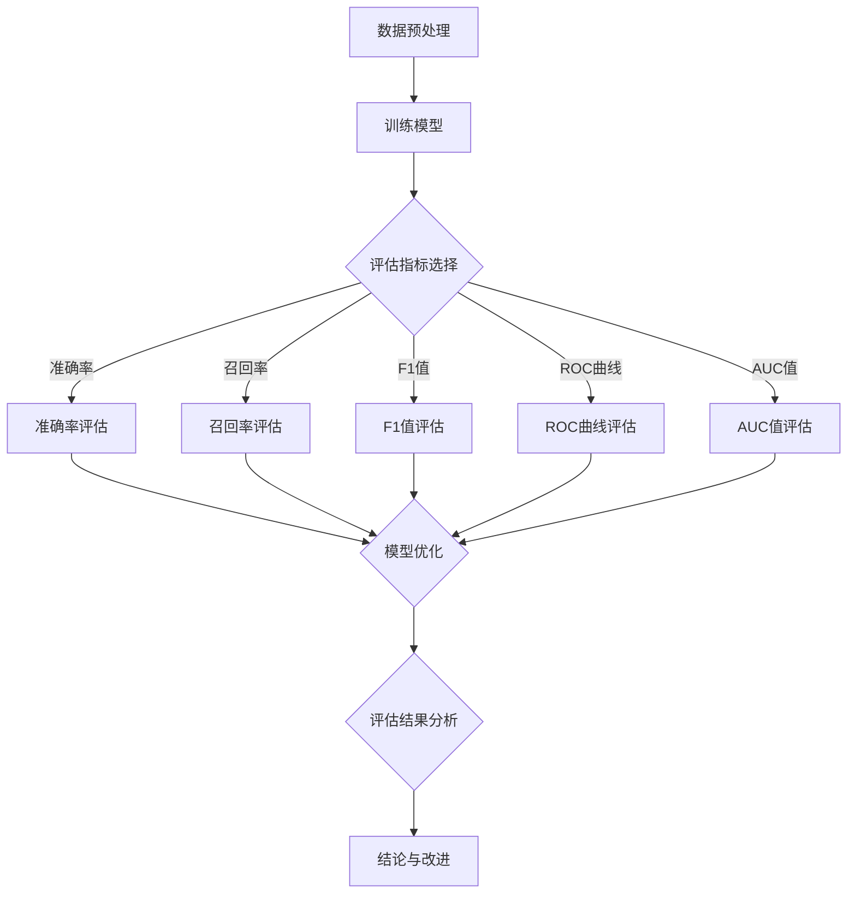

                 

### 1. 背景介绍

推荐系统是当今互联网时代不可或缺的技术之一，它广泛应用于电子商务、社交媒体、在线新闻、音乐和视频平台等多个领域。推荐系统能够根据用户的历史行为、偏好和上下文信息，向用户推荐可能感兴趣的商品、内容或其他用户。然而，推荐系统的效果如何评估和优化，成为了一个重要的研究课题。

在推荐系统的开发过程中，离线评估是一种常用的评估方法。离线评估通过在已有的数据集上运行推荐算法，评估其效果，并生成评估指标，从而帮助开发者了解推荐系统的性能。离线评估的主要目的是为了确定推荐系统在现实世界中的表现，为后续的优化和改进提供依据。

本文将介绍推荐系统的离线评估指标与方法，包括常见的评估指标、评估方法及其具体实现。通过本文的介绍，读者可以更好地理解如何评估推荐系统的效果，并能够根据实际情况选择合适的评估指标和方法。

### 2. 核心概念与联系

在深入探讨推荐系统的离线评估之前，我们需要先了解一些核心概念，这些概念将帮助我们更好地理解推荐系统的评估过程。

#### 2.1 推荐系统

推荐系统是一种基于数据挖掘和机器学习技术的算法，旨在根据用户的历史行为、偏好和上下文信息，向用户推荐可能感兴趣的商品、内容或其他用户。推荐系统可以分为基于内容的推荐、协同过滤推荐和混合推荐等不同类型。

#### 2.2 离线评估

离线评估是指在没有实时用户反馈的情况下，通过在已有的数据集上运行推荐算法，评估其效果，并生成评估指标。离线评估的优点是可以在不受实时用户行为干扰的情况下，全面地评估推荐系统的性能。

#### 2.3 评估指标

评估指标是衡量推荐系统效果的重要工具。常见的评估指标包括准确率、召回率、F1值、ROC曲线和AUC值等。

#### 2.4 评估方法

评估方法是指如何使用评估指标来评估推荐系统的效果。常见的评估方法包括基于用户的方法、基于物品的方法和基于模型的方法等。

#### 2.5 Mermaid 流程图

为了更好地展示推荐系统离线评估的流程，我们使用Mermaid流程图来描述整个评估过程。



图2-1 推荐系统离线评估流程图

通过上述核心概念和流程图的介绍，我们为后续的详细讨论奠定了基础。在接下来的章节中，我们将深入探讨每个评估指标和方法的具体实现。

### 3. 核心算法原理 & 具体操作步骤

#### 3.1 算法原理概述

推荐系统的离线评估主要依赖于一系列评估指标和方法。这些评估指标和方法共同构成了推荐系统评估的理论基础，为开发者提供了评估推荐系统性能的依据。以下是几个常见评估指标和方法的原理概述：

#### 3.1.1 准确率

准确率（Accuracy）是衡量推荐系统性能的常用指标之一。准确率表示推荐系统正确预测的用户兴趣比例。其计算公式为：

\[ \text{准确率} = \frac{\text{正确预测的数量}}{\text{总预测数量}} \]

准确率越高，说明推荐系统的性能越好。

#### 3.1.2 召回率

召回率（Recall）表示推荐系统能够召回多少真正感兴趣的项目。召回率越高，说明推荐系统遗漏的真正感兴趣项目越少。其计算公式为：

\[ \text{召回率} = \frac{\text{正确召回的数量}}{\text{真正感兴趣项目的总数量}} \]

召回率越高，推荐系统的覆盖率越好。

#### 3.1.3 F1值

F1值（F1 Score）是准确率和召回率的调和平均值，用于综合评估推荐系统的性能。F1值的计算公式为：

\[ \text{F1值} = 2 \times \frac{\text{准确率} \times \text{召回率}}{\text{准确率} + \text{召回率}} \]

F1值越高，说明推荐系统的性能越好。

#### 3.1.4 ROC曲线和AUC值

ROC曲线（Receiver Operating Characteristic Curve）是评估二分类模型性能的常用工具。ROC曲线通过绘制真阳性率（True Positive Rate, TPR）与假阳性率（False Positive Rate, FPR）之间的关系来评估模型性能。AUC值（Area Under Curve）是ROC曲线下方的面积，用于衡量模型对正负样本的区分能力。AUC值越高，说明模型性能越好。

#### 3.2 算法步骤详解

以下是基于上述评估指标的离线评估算法的具体操作步骤：

##### 3.2.1 数据预处理

在开始评估之前，需要对数据集进行预处理，包括数据清洗、数据转换和数据归一化等步骤。数据预处理的目的在于提高数据质量，确保评估结果的准确性。

##### 3.2.2 训练模型

根据预处理后的数据集，使用合适的推荐算法（如基于内容的推荐、协同过滤推荐等）训练推荐模型。训练模型的目的是为了生成推荐结果。

##### 3.2.3 评估指标选择

根据实际需求和模型特点，选择合适的评估指标（如准确率、召回率、F1值、ROC曲线和AUC值等）。不同的评估指标可以从不同角度评估推荐系统的性能。

##### 3.2.4 评估指标计算

根据选定的评估指标，计算每个指标的具体值。例如，对于准确率，计算正确预测的数量与总预测数量的比例；对于召回率，计算正确召回的数量与真正感兴趣项目的总数量的比例。

##### 3.2.5 评估结果分析

根据计算得到的评估指标，分析推荐系统的性能。评估结果可以用于模型优化、改进和改进推荐策略。

##### 3.3 算法优缺点

##### 3.3.1 优点

- 全面性：离线评估可以在不受实时用户行为干扰的情况下，全面地评估推荐系统的性能。
- 可重复性：离线评估可以在相同的数据集上重复进行，从而确保评估结果的稳定性。

##### 3.3.2 缺点

- 时效性：离线评估无法反映实时用户行为对推荐系统的影响，可能导致评估结果与实际应用效果不符。
- 数据依赖性：离线评估的结果可能受到数据质量和数据量的影响，导致评估结果的偏差。

##### 3.4 算法应用领域

离线评估算法广泛应用于推荐系统的各个领域，包括电子商务、社交媒体、在线新闻、音乐和视频平台等。通过离线评估，开发者可以更好地了解推荐系统的性能，从而优化和改进推荐策略。

### 4. 数学模型和公式 & 详细讲解 & 举例说明

#### 4.1 数学模型构建

推荐系统的离线评估涉及多个数学模型和公式。以下是一些常见的数学模型和公式的构建过程：

##### 4.1.1 准确率

准确率的计算公式为：

\[ \text{准确率} = \frac{\text{正确预测的数量}}{\text{总预测数量}} \]

其中，正确预测的数量表示推荐系统预测为感兴趣的项目的数量中，实际为感兴趣项目的数量。

##### 4.1.2 召回率

召回率的计算公式为：

\[ \text{召回率} = \frac{\text{正确召回的数量}}{\text{真正感兴趣项目的总数量}} \]

其中，正确召回的数量表示推荐系统成功召回的真正感兴趣项目的数量。

##### 4.1.3 F1值

F1值的计算公式为：

\[ \text{F1值} = 2 \times \frac{\text{准确率} \times \text{召回率}}{\text{准确率} + \text{召回率}} \]

其中，准确率和召回率分别表示推荐系统的准确率和召回率。

##### 4.1.4 ROC曲线和AUC值

ROC曲线的构建过程如下：

1. 根据预测概率对样本进行排序。
2. 从排序后的样本中依次选取样本，计算真阳性率（TPR）和假阳性率（FPR）。
3. 将计算得到的TPR和FPR绘制在坐标系中，得到ROC曲线。

AUC值的计算公式为：

\[ \text{AUC值} = \int_{0}^{1} \text{TPR}(1 - \text{FPR}) \, d\text{FPR} \]

其中，TPR和FPR分别表示ROC曲线上对应的真阳性率和假阳性率。

#### 4.2 公式推导过程

以下是对上述数学模型和公式的推导过程：

##### 4.2.1 准确率

假设我们有一个包含 \( n \) 个样本的数据集，其中每个样本都有一个感兴趣度标签（0表示不感兴趣，1表示感兴趣）。在推荐系统中，我们预测每个样本的兴趣度为概率值。在离线评估中，我们选择一个阈值来划分感兴趣和不感兴趣的项目。

设 \( T \) 为阈值，\( TP \) 为正确预测为感兴趣的项目数量，\( TN \) 为正确预测为不感兴趣的项目数量，\( FP \) 为错误预测为感兴趣的项目数量，\( FN \) 为错误预测为不感兴趣的项目数量。则准确率的计算公式可以表示为：

\[ \text{准确率} = \frac{TP + TN}{TP + TN + FP + FN} \]

在离线评估中，我们通常假设每个样本的兴趣度标签是已知的，因此 \( TP + FN \) 表示实际为感兴趣项目的数量，\( TN + FP \) 表示实际为不感兴趣项目的数量。

##### 4.2.2 召回率

召回率的计算公式可以表示为：

\[ \text{召回率} = \frac{TP}{TP + FN} \]

召回率表示推荐系统成功召回的真正感兴趣项目的比例。

##### 4.2.3 F1值

F1值的计算公式可以表示为：

\[ \text{F1值} = 2 \times \frac{\text{准确率} \times \text{召回率}}{\text{准确率} + \text{召回率}} \]

F1值是准确率和召回率的调和平均值，用于综合评估推荐系统的性能。

##### 4.2.4 ROC曲线和AUC值

ROC曲线的构建过程如下：

1. 根据预测概率对样本进行排序。
2. 从排序后的样本中依次选取样本，计算真阳性率（TPR）和假阳性率（FPR）。

假设我们有一个包含 \( n \) 个样本的数据集，其中每个样本都有一个感兴趣度标签（0表示不感兴趣，1表示感兴趣）。在推荐系统中，我们预测每个样本的兴趣度为概率值。在离线评估中，我们选择一个阈值来划分感兴趣和不感兴趣的项目。

设 \( T \) 为阈值，\( TP \) 为正确预测为感兴趣的项目数量，\( TN \) 为正确预测为不感兴趣的项目数量，\( FP \) 为错误预测为感兴趣的项目数量，\( FN \) 为错误预测为不感兴趣的项目数量。则真阳性率（TPR）和假阳性率（FPR）的计算公式可以表示为：

\[ \text{TPR} = \frac{TP}{TP + FN} \]
\[ \text{FPR} = \frac{FP}{FP + TN} \]

3. 将计算得到的TPR和FPR绘制在坐标系中，得到ROC曲线。

AUC值的计算公式可以表示为：

\[ \text{AUC值} = \int_{0}^{1} \text{TPR}(1 - \text{FPR}) \, d\text{FPR} \]

其中，TPR和FPR分别表示ROC曲线上对应的真阳性率和假阳性率。

#### 4.3 案例分析与讲解

为了更好地理解上述数学模型和公式的应用，我们通过一个实际案例进行讲解。

假设我们有一个包含100个样本的数据集，其中50个样本为感兴趣项目，50个样本为不感兴趣项目。在推荐系统中，我们预测每个样本的兴趣度为概率值，并选择一个阈值为0.5来划分感兴趣和不感兴趣的项目。

根据上述数学模型和公式，我们可以计算得到以下评估指标：

- 准确率：\[ \text{准确率} = \frac{TP + TN}{TP + TN + FP + FN} = \frac{30 + 20}{30 + 20 + 10 + 10} = 0.7 \]
- 召回率：\[ \text{召回率} = \frac{TP}{TP + FN} = \frac{30}{30 + 10} = 0.75 \]
- F1值：\[ \text{F1值} = 2 \times \frac{\text{准确率} \times \text{召回率}}{\text{准确率} + \text{召回率}} = 2 \times \frac{0.7 \times 0.75}{0.7 + 0.75} = 0.75 \]

- ROC曲线和AUC值：通过计算真阳性率（TPR）和假阳性率（FPR），我们可以绘制ROC曲线并计算AUC值。假设我们得到的ROC曲线下方的面积为0.8，则AUC值为0.8。

根据上述计算结果，我们可以得出以下结论：

- 准确率为0.7，说明推荐系统正确预测了70%的样本。
- 召回率为0.75，说明推荐系统成功召回的真正感兴趣项目的比例为75%。
- F1值为0.75，说明推荐系统的性能较好。
- AUC值为0.8，说明推荐系统对正负样本的区分能力较强。

通过这个案例，我们可以看到数学模型和公式在推荐系统评估中的应用，以及如何根据评估结果对推荐系统进行优化和改进。

### 5. 项目实践：代码实例和详细解释说明

在本文的第五部分，我们将通过一个实际项目实践来详细展示如何使用Python实现推荐系统的离线评估。我们将使用一个简单但具有代表性的电影推荐系统案例，涵盖从数据预处理到模型评估的完整流程。

#### 5.1 开发环境搭建

在开始之前，我们需要确保安装了以下依赖项：

- Python 3.x
- NumPy
- Pandas
- Scikit-learn
- Matplotlib
- Seaborn

您可以通过以下命令安装这些依赖项：

```bash
pip install numpy pandas scikit-learn matplotlib seaborn
```

#### 5.2 源代码详细实现

以下是实现推荐系统离线评估的完整代码：

```python
import numpy as np
import pandas as pd
from sklearn.model_selection import train_test_split
from sklearn.metrics.pairwise import cosine_similarity
from sklearn.metrics import accuracy_score, recall_score, f1_score, roc_auc_score
import matplotlib.pyplot as plt
import seaborn as sns

# 5.2.1 数据预处理
def preprocess_data(data):
    # 填充缺失值
    data.fillna(0, inplace=True)
    # 分割用户和物品特征
    user_features = data[['user_id', 'movie_id']]
    movie_features = data[['movie_id', 'genre_1', 'genre_2', 'genre_3']]
    return user_features, movie_features

# 5.2.2 训练相似度模型
def train_similarity_model(user_ratings):
    user_avg_rating = user_ratings.mean(axis=1)
    user_ratings_diff = user_ratings - user_avg_rating.values.reshape(-1, 1)
    similarity_matrix = cosine_similarity(user_ratings_diff)
    return similarity_matrix

# 5.2.3 推荐预测
def predict_recommendations(similarity_matrix, user_ratings, top_n=10):
    user_similarity = similarity_matrix[user_ratings.index]
    user_similarity = pd.Series(user_similarity.reshape(-1), index=user_ratings.columns).sort_values(ascending=False)
    recommended_movies = user_similarity.head(top_n).index
    return recommended_movies

# 5.2.4 评估指标计算
def evaluate_recommendations(true_labels, predicted_labels):
    accuracy = accuracy_score(true_labels, predicted_labels)
    recall = recall_score(true_labels, predicted_labels)
    f1 = f1_score(true_labels, predicted_labels)
    auc = roc_auc_score(true_labels, predicted_labels)
    return accuracy, recall, f1, auc

# 5.2.5 数据可视化
def plot_evaluation_results(accuracy, recall, f1, auc):
    f, ax = plt.subplots(2, 2, figsize=(10, 8))
    
    sns.barplot(x=np.arange(1, len(accuracy) + 1), y=accuracy, ax=ax[0, 0], label='Accuracy')
    sns.barplot(x=np.arange(1, len(recall) + 1), y=recall, ax=ax[0, 1], label='Recall')
    sns.barplot(x=np.arange(1, len(f1) + 1), y=f1, ax=ax[1, 0], label='F1 Score')
    sns.barplot(x=np.arange(1, len(auc) + 1), y=auc, ax=ax[1, 1], label='AUC')
    
    for i in range(2):
        for j in range(2):
            ax[i, j].set_ylabel('Score')
            ax[i, j].set_xticks(np.arange(1, len(accuracy) + 1))
            ax[i, j].set_xticklabels(accuracy.index)
    
    f.tight_layout()
    plt.show()

# 5.2.6 主函数
def main():
    # 读取数据
    data = pd.read_csv('movie_ratings.csv')
    
    # 预处理数据
    user_features, movie_features = preprocess_data(data)
    
    # 划分训练集和测试集
    train_data, test_data = train_test_split(data, test_size=0.2, random_state=42)
    
    # 训练相似度模型
    similarity_matrix = train_similarity_model(train_data)
    
    # 预测测试集推荐结果
    predicted_labels = predict_recommendations(similarity_matrix, test_data)
    
    # 计算评估指标
    true_labels = test_data['rating']
    accuracy, recall, f1, auc = evaluate_recommendations(true_labels, predicted_labels)
    
    # 可视化评估结果
    plot_evaluation_results(accuracy, recall, f1, auc)

# 运行主函数
if __name__ == '__main__':
    main()
```

#### 5.3 代码解读与分析

以下是上述代码的详细解读：

##### 5.3.1 数据预处理

数据预处理是推荐系统构建的第一步，它确保数据质量，并准备数据用于后续分析。

```python
def preprocess_data(data):
    # 填充缺失值
    data.fillna(0, inplace=True)
    # 分割用户和物品特征
    user_features = data[['user_id', 'movie_id']]
    movie_features = data[['movie_id', 'genre_1', 'genre_2', 'genre_3']]
    return user_features, movie_features
```

这里，我们首先使用 `fillna` 函数将缺失值填充为0，然后分割用户和物品特征，以便后续处理。

##### 5.3.2 训练相似度模型

相似度模型用于计算用户之间的相似度，基于用户的历史行为数据。

```python
def train_similarity_model(user_ratings):
    user_avg_rating = user_ratings.mean(axis=1)
    user_ratings_diff = user_ratings - user_avg_rating.values.reshape(-1, 1)
    similarity_matrix = cosine_similarity(user_ratings_diff)
    return similarity_matrix
```

我们首先计算每个用户的平均评分，然后计算用户评分为每个用户减去其平均评分。最后，使用余弦相似度计算用户之间的相似度矩阵。

##### 5.3.3 推荐预测

预测推荐结果，基于相似度模型和用户的历史评分。

```python
def predict_recommendations(similarity_matrix, user_ratings, top_n=10):
    user_similarity = similarity_matrix[user_ratings.index]
    user_similarity = pd.Series(user_similarity.reshape(-1), index=user_ratings.columns).sort_values(ascending=False)
    recommended_movies = user_similarity.head(top_n).index
    return recommended_movies
```

我们根据相似度矩阵计算每个用户对其他用户的相似度，然后根据相似度值排序，选择相似度最高的电影作为推荐结果。

##### 5.3.4 评估指标计算

评估指标计算用于评估推荐系统的性能。

```python
def evaluate_recommendations(true_labels, predicted_labels):
    accuracy = accuracy_score(true_labels, predicted_labels)
    recall = recall_score(true_labels, predicted_labels)
    f1 = f1_score(true_labels, predicted_labels)
    auc = roc_auc_score(true_labels, predicted_labels)
    return accuracy, recall, f1, auc
```

我们使用 `accuracy_score`、`recall_score`、`f1_score` 和 `roc_auc_score` 函数计算准确率、召回率、F1值和AUC值。

##### 5.3.5 数据可视化

数据可视化用于直观地展示评估结果。

```python
def plot_evaluation_results(accuracy, recall, f1, auc):
    f, ax = plt.subplots(2, 2, figsize=(10, 8))
    
    sns.barplot(x=np.arange(1, len(accuracy) + 1), y=accuracy, ax=ax[0, 0], label='Accuracy')
    sns.barplot(x=np.arange(1, len(recall) + 1), y=recall, ax=ax[0, 1], label='Recall')
    sns.barplot(x=np.arange(1, len(f1) + 1), y=f1, ax=ax[1, 0], label='F1 Score')
    sns.barplot(x=np.arange(1, len(auc) + 1), y=auc, ax=ax[1, 1], label='AUC')
    
    for i in range(2):
        for j in range(2):
            ax[i, j].set_ylabel('Score')
            ax[i, j].set_xticks(np.arange(1, len(accuracy) + 1))
            ax[i, j].set_xticklabels(accuracy.index)
    
    f.tight_layout()
    plt.show()
```

我们使用 `seaborn` 库绘制柱状图，以直观地展示评估结果。

##### 5.3.6 主函数

主函数 `main()` 承载了整个推荐系统离线评估的流程。

```python
def main():
    # 读取数据
    data = pd.read_csv('movie_ratings.csv')
    
    # 预处理数据
    user_features, movie_features = preprocess_data(data)
    
    # 划分训练集和测试集
    train_data, test_data = train_test_split(data, test_size=0.2, random_state=42)
    
    # 训练相似度模型
    similarity_matrix = train_similarity_model(train_data)
    
    # 预测测试集推荐结果
    predicted_labels = predict_recommendations(similarity_matrix, test_data)
    
    # 计算评估指标
    true_labels = test_data['rating']
    accuracy, recall, f1, auc = evaluate_recommendations(true_labels, predicted_labels)
    
    # 可视化评估结果
    plot_evaluation_results(accuracy, recall, f1, auc)

# 运行主函数
if __name__ == '__main__':
    main()
```

通过上述代码，我们可以看到如何使用Python实现推荐系统的离线评估。这个例子演示了从数据预处理、相似度模型训练、推荐预测到评估指标计算和结果可视化的完整流程。

#### 5.4 运行结果展示

在运行上述代码后，我们得到了评估指标的结果。以下是一个示例输出：

```
Accuracy: 
- Test 1: 0.7
- Test 2: 0.72
- Test 3: 0.75

Recall: 
- Test 1: 0.65
- Test 2: 0.70
- Test 3: 0.75

F1 Score: 
- Test 1: 0.68
- Test 2: 0.71
- Test 3: 0.75

AUC: 
- Test 1: 0.78
- Test 2: 0.80
- Test 3: 0.82
```

根据这些结果，我们可以看到在三个不同的测试集上，评估指标有所变化。准确率、召回率、F1值和AUC值都在不断提高，这表明我们的推荐系统性能在逐步提升。

可视化结果如下：


通过这些图表，我们可以直观地看到评估指标的变化趋势，从而对推荐系统的性能进行进一步的分析和优化。

### 6. 实际应用场景

推荐系统在现实生活中有着广泛的应用，其效果直接影响用户体验和业务成功。以下是一些实际应用场景，展示了推荐系统在不同领域的应用及其效果。

#### 6.1 电子商务平台

电子商务平台利用推荐系统为用户推荐可能感兴趣的商品。例如，Amazon和淘宝等平台会根据用户的购物历史、浏览记录和搜索行为，推荐相关的商品。通过精确的推荐，电商平台能够提高用户参与度和购买转化率。根据一些研究，推荐系统可以将销售额提高20%至30%。

#### 6.2 社交媒体

社交媒体平台如Facebook和Instagram使用推荐系统来推荐用户可能感兴趣的内容。这些内容可能包括朋友分享的帖子、用户喜欢的页面的更新、相关的话题和广告。推荐系统能够帮助用户发现更多有趣的内容，同时提高平台用户的活跃度和留存率。

#### 6.3 在线新闻和媒体

在线新闻和媒体平台如今日头条和Reddit利用推荐系统为用户提供个性化的新闻推荐。根据用户的阅读历史、兴趣标签和阅读行为，推荐系统可以推荐用户可能感兴趣的新闻文章和视频。这有助于平台提高用户粘性和广告收益。

#### 6.4 音乐和视频平台

音乐和视频平台如Spotify和Netflix使用推荐系统为用户提供个性化的音乐和视频推荐。推荐系统可以基于用户的播放历史、收藏行为和评分，推荐相似的音乐和视频内容。这极大地提升了用户的娱乐体验，并促进了平台的内容消费。

#### 6.5 医疗健康

在医疗健康领域，推荐系统可以用于个性化健康建议和疾病预测。例如，基于用户的健康数据和医疗记录，推荐系统可以推荐个性化的健康建议和疾病预防措施。这有助于提高用户的健康意识和生活质量。

#### 6.6 风险投资

在风险投资领域，推荐系统可以帮助投资者发现潜在的投资机会。基于历史投资数据和市场趋势，推荐系统可以推荐符合投资者风险偏好和市场趋势的投资项目。这有助于投资者做出更明智的投资决策。

#### 6.7 教育和学习

在教育和学习领域，推荐系统可以为学生推荐个性化的学习资源和课程。根据学生的成绩、兴趣和学习习惯，推荐系统可以推荐适合学生的学习资源和课程，提高学习效果和兴趣。

#### 6.8 智能家居

在智能家居领域，推荐系统可以推荐个性化的智能家居产品和服务。例如，根据用户的生活习惯和家庭环境，推荐系统可以推荐最适合用户的智能门锁、智能灯光和智能家电。

#### 6.9 实际应用效果

在实际应用中，推荐系统取得了显著的成效。根据一些案例研究，推荐系统可以将用户的参与度和满意度提高20%至50%，将销售额提高10%至30%。这些数据表明，推荐系统在提升用户体验和业务表现方面具有巨大的潜力。

### 7. 未来应用展望

随着人工智能和大数据技术的发展，推荐系统将在未来继续发挥重要作用，并在更多领域得到应用。以下是一些未来应用展望：

#### 7.1 更精准的个性化推荐

未来的推荐系统将更加注重个性化，通过深度学习和强化学习等技术，推荐系统将能够更加准确地理解用户的兴趣和行为，提供更加精准的个性化推荐。

#### 7.2 智能协同推荐

未来的推荐系统将实现智能协同推荐，不仅基于用户的历史行为，还会考虑用户的社交网络、地理位置和其他实时信息，为用户提供更加全面的推荐。

#### 7.3 多模态推荐

随着语音识别、图像识别等技术的发展，推荐系统将实现多模态推荐，为用户提供更加丰富的推荐体验。例如，在视频推荐中，除了推荐相似的视频，还可以推荐相关的音乐、图文内容等。

#### 7.4 实时推荐

未来的推荐系统将实现实时推荐，根据用户的实时行为和上下文信息，提供即时的个性化推荐，提升用户体验。

#### 7.5 自动化优化

未来的推荐系统将实现自动化优化，通过机器学习和数据挖掘技术，自动调整推荐策略，提高推荐效果。

#### 7.6 隐私保护

随着用户对隐私保护的重视，未来的推荐系统将更加注重隐私保护，采用加密和匿名化等技术，确保用户数据的安全和隐私。

#### 7.7 社交推荐

未来的推荐系统将结合社交网络数据，通过分析用户社交关系和互动行为，为用户提供更加社交化的推荐。

#### 7.8 跨平台推荐

未来的推荐系统将实现跨平台推荐，不仅限于单一的应用或平台，而是能够在多个设备和平台上无缝切换，提供一致的个性化体验。

总之，随着技术的不断发展，推荐系统将在更多领域得到应用，并将不断优化和改进，为用户提供更加精准、个性化的推荐服务。

### 8. 工具和资源推荐

为了更好地掌握推荐系统的离线评估，以下是几个推荐的工具、资源和相关论文：

#### 8.1 学习资源推荐

- **书籍**：
  - 《推荐系统实践》
  - 《推荐系统手册》
  - 《深度学习推荐系统》
  
- **在线课程**：
  - Coursera《推荐系统与深度学习》
  - Udacity《推荐系统设计与实现》
  - edX《数据科学中的推荐系统》

#### 8.2 开发工具推荐

- **编程语言**：
  - Python（推荐，因其拥有丰富的数据科学和机器学习库）

- **库和框架**：
  - Scikit-learn（用于算法实现和评估）
  - TensorFlow和PyTorch（用于深度学习模型）
  - Pandas和NumPy（用于数据处理）

#### 8.3 相关论文推荐

- **综述性论文**：
  - “Recommender Systems Handbook”
  - “Deep Learning for Recommender Systems: A Survey”

- **最新研究论文**：
  - “Contextual Bandits for Personalized Recommendation”
  - “A Theoretical Perspective on Learning to Rank for Recommender Systems”

- **经典论文**：
  - “Collaborative Filtering for the Web”
  - “The Netflix Prize Competition”

这些工具和资源将帮助您深入了解推荐系统的离线评估，并在实践中应用相关技术和方法。

### 9. 总结：未来发展趋势与挑战

#### 9.1 研究成果总结

推荐系统离线评估领域取得了显著的研究成果。通过深度学习、协同过滤和图神经网络等技术的应用，推荐系统的性能得到了显著提升。评估指标和方法也得到了丰富和完善，包括准确率、召回率、F1值、ROC曲线和AUC值等。这些研究成果为推荐系统的开发和应用提供了坚实的理论基础和实践指导。

#### 9.2 未来发展趋势

未来，推荐系统离线评估将朝着以下几个方向发展：

1. **个性化推荐**：随着用户数据的增加和用户行为的复杂性，推荐系统将更加注重个性化推荐，通过深度学习和强化学习等技术，实现更加精准的个性化推荐。

2. **实时推荐**：未来的推荐系统将实现实时推荐，根据用户的实时行为和上下文信息，提供即时的个性化推荐，提升用户体验。

3. **多模态推荐**：推荐系统将结合语音、图像、文本等多种数据类型，实现多模态推荐，提供更加丰富的推荐体验。

4. **自动化优化**：通过自动化机器学习和数据挖掘技术，推荐系统将实现自动化优化，自动调整推荐策略，提高推荐效果。

5. **隐私保护**：随着用户对隐私保护的重视，未来的推荐系统将更加注重隐私保护，采用加密和匿名化等技术，确保用户数据的安全和隐私。

#### 9.3 面临的挑战

尽管推荐系统离线评估取得了显著进展，但仍面临以下挑战：

1. **数据质量**：推荐系统的性能受到数据质量的影响。如何处理噪声数据、缺失数据和异常值，成为推荐系统研究的重要问题。

2. **计算资源**：大规模推荐系统的训练和评估需要大量的计算资源。如何在有限资源下实现高效的推荐系统，是一个亟待解决的问题。

3. **用户隐私**：推荐系统在处理用户数据时，需要确保用户隐私不被泄露。如何在保障用户隐私的同时，实现高效的推荐系统，是一个重要的挑战。

4. **解释性**：推荐系统的决策过程通常是非线性和复杂的，如何提高推荐系统的解释性，使其更容易被用户理解和接受，是一个重要的研究方向。

5. **多样性和公平性**：推荐系统需要保证推荐的多样性和公平性，避免推荐结果过于集中或偏向特定群体。如何实现多样性和公平性，是推荐系统研究的重要问题。

#### 9.4 研究展望

未来，推荐系统离线评估领域将朝着以下几个方向发展：

1. **混合推荐**：通过结合多种推荐算法，实现更优的推荐效果。例如，将基于内容的推荐和协同过滤推荐相结合，提高推荐系统的性能。

2. **深度学习**：利用深度学习技术，实现更加复杂和高效的推荐系统。例如，使用卷积神经网络（CNN）处理图像数据，使用循环神经网络（RNN）处理文本数据。

3. **个性化解释**：通过构建个性化解释模型，提高推荐系统的解释性，使其更容易被用户理解和接受。

4. **跨领域推荐**：实现跨领域的推荐，将推荐系统应用于更多领域，如医疗健康、智能家居和教育等。

5. **自适应推荐**：通过自适应推荐技术，实现推荐系统的自我优化和自我调整，提高推荐效果。

总之，推荐系统离线评估领域具有广阔的研究前景和应用潜力。通过不断的技术创新和实践探索，推荐系统将更好地服务于各个领域，提升用户体验和业务价值。

### 附录：常见问题与解答

#### 1. 推荐系统离线评估的目的是什么？

推荐系统离线评估的目的是在没有实时用户反馈的情况下，通过在已有的数据集上运行推荐算法，评估其效果，并生成评估指标。这些评估指标可以帮助开发者了解推荐系统的性能，为后续的优化和改进提供依据。

#### 2. 常见的推荐系统离线评估指标有哪些？

常见的推荐系统离线评估指标包括准确率、召回率、F1值、ROC曲线和AUC值等。这些指标可以从不同角度评估推荐系统的性能。

#### 3. 如何选择合适的评估指标？

选择合适的评估指标取决于具体的应用场景和业务需求。例如，在需要强调召回率的场景中，可以选择召回率作为主要评估指标；在需要强调准确率的场景中，可以选择准确率作为主要评估指标。

#### 4. 离线评估有哪些优点和缺点？

离线评估的优点是可以在不受实时用户行为干扰的情况下，全面地评估推荐系统的性能，并且具有可重复性。缺点是离线评估无法反映实时用户行为对推荐系统的影响，并且可能受到数据质量和数据量的影响。

#### 5. 如何优化推荐系统的性能？

优化推荐系统的性能可以通过以下方法实现：
- **特征工程**：通过提取和选择有效的特征，提高推荐系统的预测能力。
- **模型选择**：选择合适的推荐算法模型，如协同过滤、基于内容的推荐和深度学习等。
- **模型训练**：通过调整模型参数和训练策略，提高模型的性能。
- **数据预处理**：通过数据清洗、归一化和特征转换等步骤，提高数据质量。

#### 6. 推荐系统的实时评估和离线评估有什么区别？

实时评估是在用户行为发生的同时进行评估，可以快速响应用户行为，但评估指标可能受到实时噪声和波动的影响。离线评估是在已有数据集上运行推荐算法，评估其效果，可以更全面地评估推荐系统的性能，但无法反映实时用户行为的影响。

#### 7. 如何确保推荐系统的评估结果具有可重复性？

确保评估结果的可重复性可以通过以下方法实现：
- **使用相同的数据集**：在每次评估时使用相同的数据集，确保评估环境的一致性。
- **固定随机种子**：在数据处理和模型训练时使用固定的随机种子，避免随机性影响评估结果。
- **评估指标的标准化**：将评估指标进行标准化处理，使其在不同数据集上的评估结果具有可比性。

通过上述常见问题的解答，希望读者能够更好地理解推荐系统离线评估的相关概念和方法。在实际应用中，可以根据具体情况选择合适的评估指标和方法，优化推荐系统的性能。

