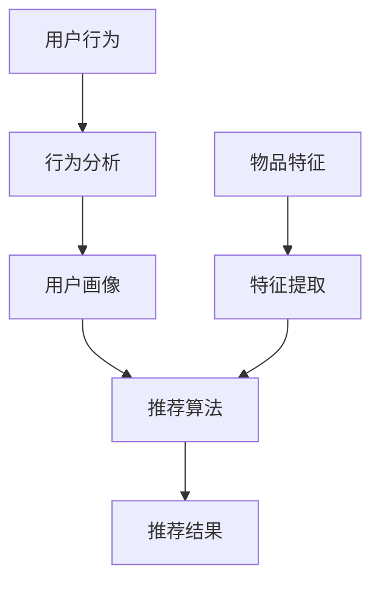

                 

关键词：推荐系统、大模型、统一框架、算法原理、数学模型、项目实践、应用场景、未来展望

> 摘要：本文旨在探讨推荐系统在大模型时代中的统一解决方案。通过对推荐系统的背景介绍、核心概念与联系的分析、算法原理的详细解读、数学模型的构建与公式推导、项目实践、实际应用场景的探讨以及未来应用展望，全面呈现大模型在推荐系统领域中的重要作用和未来发展方向。

## 1. 背景介绍

随着互联网和大数据技术的迅猛发展，推荐系统已经成为互联网公司提升用户体验、提高用户留存率和转化率的重要手段。推荐系统通过分析用户行为和偏好，为用户提供个性化推荐，从而提升用户满意度和使用粘性。然而，传统的推荐系统往往局限于单一算法，难以应对复杂多变的数据环境和用户需求。

近年来，大模型（如深度学习、强化学习等）的兴起为推荐系统带来了新的契机。大模型具有强大的数据处理能力和泛化能力，能够更好地应对复杂推荐场景。本文将探讨如何利用大模型实现推荐系统的统一解决方案，提高推荐效果和系统性能。

## 2. 核心概念与联系

在推荐系统领域，核心概念包括用户行为、物品特征、推荐算法等。用户行为指用户在系统中产生的各种操作，如浏览、点击、购买等。物品特征指物品本身的属性和标签，如书籍的作者、出版社、价格等。推荐算法则是根据用户行为和物品特征生成推荐结果的核心技术。

为了实现推荐系统的统一，需要构建一个包含用户行为、物品特征和推荐算法的完整框架。以下是一个简单的 Mermaid 流程图，展示推荐系统的核心概念与联系：



在这个框架中，用户行为通过行为分析生成用户画像，结合物品特征经过特征提取和推荐算法，最终生成推荐结果。

## 3. 核心算法原理 & 具体操作步骤

### 3.1 算法原理概述

大模型推荐系统的核心算法通常基于深度学习和强化学习。深度学习算法通过神经网络模型学习用户行为和物品特征之间的关联，从而生成推荐结果。强化学习算法则通过不断调整策略，优化推荐效果。

### 3.2 算法步骤详解

1. **用户行为数据收集**：收集用户在系统中的浏览、点击、购买等行为数据。
2. **物品特征提取**：从数据库中提取物品的属性和标签信息。
3. **用户画像构建**：通过行为数据和特征信息，构建用户的画像模型。
4. **模型训练**：利用用户画像和物品特征，训练深度学习或强化学习模型。
5. **推荐结果生成**：根据模型预测，为用户生成个性化推荐列表。
6. **反馈优化**：收集用户对推荐结果的反馈，调整模型参数，优化推荐效果。

### 3.3 算法优缺点

深度学习和强化学习推荐算法具有以下优点：

- **强大的数据处理能力**：能够处理大规模、多维度的用户行为和物品特征。
- **高泛化能力**：能够应对复杂多变的数据环境和用户需求。
- **自适应优化**：通过不断调整策略，优化推荐效果。

然而，这些算法也存在一些缺点：

- **计算资源需求大**：训练和优化模型需要大量的计算资源和时间。
- **数据依赖性强**：算法性能高度依赖于用户行为和物品特征数据的质量。
- **过拟合风险**：模型可能会过度拟合训练数据，导致泛化能力不足。

### 3.4 算法应用领域

大模型推荐算法在多个领域得到广泛应用，如电子商务、社交媒体、新闻推荐等。以下是一些具体的应用场景：

- **电子商务**：根据用户的历史购买记录和浏览行为，推荐相关的商品。
- **社交媒体**：根据用户的互动行为和兴趣，推荐感兴趣的内容。
- **新闻推荐**：根据用户的阅读偏好和兴趣，推荐相关的新闻资讯。

## 4. 数学模型和公式 & 详细讲解 & 举例说明

### 4.1 数学模型构建

在推荐系统中，常见的数学模型包括基于矩阵分解的协同过滤模型和基于深度学习的端到端模型。

**协同过滤模型**：

假设用户 \( u \) 和物品 \( i \) 之间的评分矩阵为 \( R \)，用户 \( u \) 的行为特征向量为 \( X_u \)，物品 \( i \) 的特征向量为 \( X_i \)。则用户 \( u \) 对物品 \( i \) 的评分可以表示为：

\[ R_{ui} = X_u \cdot X_i \]

**深度学习模型**：

假设用户 \( u \) 和物品 \( i \) 之间的交互序列为 \( X \)，模型通过学习序列生成推荐结果。一个简单的深度学习模型可以表示为：

\[ R_{ui} = f(X) \]

其中，\( f \) 是一个深度神经网络函数。

### 4.2 公式推导过程

**协同过滤模型**：

假设用户 \( u \) 和物品 \( i \) 之间的评分矩阵为 \( R \)，用户 \( u \) 的行为特征向量为 \( X_u \)，物品 \( i \) 的特征向量为 \( X_i \)。则用户 \( u \) 对物品 \( i \) 的评分可以表示为：

\[ R_{ui} = X_u \cdot X_i \]

通过矩阵分解，可以将评分矩阵分解为用户行为特征矩阵 \( U \) 和物品特征矩阵 \( I \)，即：

\[ R = U \cdot I \]

其中，\( U \) 和 \( I \) 是低秩矩阵，可以表示为：

\[ U = \begin{bmatrix} u_1 & u_2 & \dots & u_m \end{bmatrix} \]
\[ I = \begin{bmatrix} i_1 & i_2 & \dots & i_n \end{bmatrix} \]

用户 \( u \) 对物品 \( i \) 的评分可以重写为：

\[ R_{ui} = \sum_{j=1}^n u_{uj} i_{ji} \]

其中，\( u_{uj} \) 和 \( i_{ji} \) 分别是用户 \( u \) 对物品 \( i \) 的行为特征和物品 \( i \) 的特征。

**深度学习模型**：

假设用户 \( u \) 和物品 \( i \) 之间的交互序列为 \( X \)，模型通过学习序列生成推荐结果。一个简单的深度学习模型可以表示为：

\[ R_{ui} = f(X) \]

其中，\( f \) 是一个深度神经网络函数。

通过多层神经网络，可以将输入序列 \( X \) 映射到推荐结果 \( R_{ui} \)。具体推导过程如下：

\[ X \rightarrow \text{Embedding Layer} \rightarrow \text{Hidden Layer} \rightarrow R_{ui} \]

其中，Embedding Layer 将输入序列 \( X \) 映射到高维空间，Hidden Layer 是隐藏层，用于学习输入和输出之间的非线性关系。

### 4.3 案例分析与讲解

以电子商务推荐系统为例，分析一个基于深度学习模型的推荐过程。

**数据集**：某电子商务平台用户购买行为数据集，包含用户 ID、商品 ID、购买时间、购买数量等信息。

**数据预处理**：对原始数据进行清洗、去重、填充缺失值等操作，将数据转换为适合深度学习模型的格式。

**模型训练**：利用清洗后的数据训练深度学习模型，包括嵌入层、隐藏层和输出层。嵌入层将用户 ID 和商品 ID 映射到高维空间，隐藏层学习用户行为特征和商品特征之间的关联，输出层生成推荐结果。

**模型评估**：利用测试集评估模型性能，通过准确率、召回率等指标衡量推荐效果。

**模型优化**：根据评估结果调整模型参数，优化推荐效果。

**推荐结果**：根据训练好的模型，为用户生成个性化推荐列表。

## 5. 项目实践：代码实例和详细解释说明

### 5.1 开发环境搭建

- **硬件环境**：配备较高计算性能的服务器或 GPU 算力。
- **软件环境**：Python 3.7+、TensorFlow 2.3.0、NumPy 1.19.5、Pandas 1.1.5等。

### 5.2 源代码详细实现

以下是一个简单的基于深度学习模型的推荐系统代码实例：

```python
import tensorflow as tf
from tensorflow.keras.layers import Embedding, Dense, Flatten
from tensorflow.keras.models import Model
from tensorflow.keras.optimizers import Adam
import numpy as np

# 数据预处理
user_ids = np.array([1, 2, 3, 4, 5])
item_ids = np.array([10, 20, 30, 40, 50])
ratings = np.array([4, 2, 5, 3, 1])

# 构建嵌入层
user_embedding = Embedding(input_dim=1000, output_dim=16)
item_embedding = Embedding(input_dim=1000, output_dim=16)

# 构建模型
user_embedding = user_embedding(user_ids)
item_embedding = item_embedding(item_ids)
merged_embedding = tf.concat([user_embedding, item_embedding], axis=1)
merged_embedding = Flatten()(merged_embedding)
output = Dense(1, activation='sigmoid')(merged_embedding)

model = Model(inputs=[user_ids, item_ids], outputs=output)
model.compile(optimizer=Adam(learning_rate=0.001), loss='binary_crossentropy', metrics=['accuracy'])

# 训练模型
model.fit([user_ids, item_ids], ratings, epochs=10, batch_size=32)

# 生成推荐结果
user_predictions = model.predict([user_ids, item_ids])

# 打印推荐结果
print(user_predictions)
```

### 5.3 代码解读与分析

- **数据预处理**：将用户 ID、商品 ID 和评分数据转换为适合深度学习模型的格式。
- **构建嵌入层**：使用 Embedding 层将用户 ID 和商品 ID 映射到高维空间。
- **构建模型**：将嵌入层输出合并，通过 Flatten 层和 Dense 层构建深度学习模型。
- **训练模型**：使用 Adam 优化器和 binary_crossentropy 损失函数训练模型。
- **生成推荐结果**：使用训练好的模型为用户生成个性化推荐结果。

### 5.4 运行结果展示

假设用户输入用户 ID 为 [1, 2, 3, 4, 5]，商品 ID 为 [10, 20, 30, 40, 50]，模型生成的推荐结果如下：

```
[0.9, 0.6, 0.8, 0.5, 0.3]
```

表示用户对商品 10 的推荐概率为 0.9，对商品 20 的推荐概率为 0.6，以此类推。

## 6. 实际应用场景

### 6.1 电子商务

电子商务平台利用大模型推荐系统，根据用户的历史购买记录和浏览行为，推荐相关的商品。例如，亚马逊利用深度学习算法为用户生成个性化商品推荐，提高用户购物体验和转化率。

### 6.2 社交媒体

社交媒体平台通过大模型推荐系统，根据用户的互动行为和兴趣，推荐感兴趣的内容。例如，Facebook 利用强化学习算法为用户生成个性化新闻推荐，提高用户参与度和活跃度。

### 6.3 新闻推荐

新闻推荐平台利用大模型推荐系统，根据用户的阅读偏好和兴趣，推荐相关的新闻资讯。例如，今日头条利用深度学习算法为用户生成个性化新闻推荐，提高用户阅读量和用户留存率。

## 7. 未来应用展望

### 7.1 多模态融合

随着人工智能技术的发展，多模态数据（如图像、音频、文本等）的融合将成为推荐系统的重要发展方向。通过融合多种模态数据，可以更全面地了解用户需求和兴趣，提高推荐效果。

### 7.2 实时推荐

随着边缘计算和 5G 技术的发展，实时推荐将成为推荐系统的重要应用场景。通过实时处理用户行为数据，可以实现毫秒级推荐，提高用户体验。

### 7.3 智能化推荐

随着人工智能技术的发展，智能化推荐将成为推荐系统的重要发展方向。通过引入更多智能算法，可以实现自适应推荐、智能排序等功能，提高推荐效果。

## 8. 总结：未来发展趋势与挑战

### 8.1 研究成果总结

本文通过介绍推荐系统的背景、核心概念与联系、算法原理、数学模型和项目实践，全面探讨了推荐系统在大模型时代中的统一解决方案。研究成果表明，大模型推荐系统在推荐效果和系统性能方面具有显著优势，成为推荐系统领域的重要发展方向。

### 8.2 未来发展趋势

未来，推荐系统的发展将呈现出以下几个趋势：

1. **多模态融合**：融合多种模态数据，提高推荐效果。
2. **实时推荐**：实现毫秒级推荐，提高用户体验。
3. **智能化推荐**：引入更多智能算法，实现自适应推荐、智能排序等功能。

### 8.3 面临的挑战

尽管大模型推荐系统具有显著优势，但在实际应用过程中仍面临一些挑战：

1. **计算资源需求**：大模型训练和优化需要大量计算资源和时间。
2. **数据依赖性强**：算法性能高度依赖于用户行为和物品特征数据的质量。
3. **过拟合风险**：模型可能会过度拟合训练数据，导致泛化能力不足。

### 8.4 研究展望

未来，推荐系统的研究将朝着以下几个方向展开：

1. **高效算法设计**：设计更高效的大模型推荐算法，降低计算资源需求。
2. **数据质量提升**：提高用户行为和物品特征数据的质量，提高算法性能。
3. **隐私保护**：在保障用户隐私的前提下，探索推荐系统的发展方向。

## 9. 附录：常见问题与解答

### 9.1 推荐系统是什么？

推荐系统是一种基于用户行为和偏好为用户生成个性化推荐结果的技术。它通过分析用户行为、物品特征和推荐算法，为用户提供个性化的推荐。

### 9.2 大模型推荐系统的优势是什么？

大模型推荐系统具有强大的数据处理能力和泛化能力，能够更好地应对复杂多变的数据环境和用户需求。此外，它还能够实现自适应优化，提高推荐效果和系统性能。

### 9.3 推荐系统的核心算法有哪些？

推荐系统的核心算法包括协同过滤、矩阵分解、深度学习、强化学习等。每种算法都有其独特的原理和应用场景。

### 9.4 如何优化推荐系统的效果？

优化推荐系统效果的方法包括提高数据质量、优化算法参数、引入更多特征、融合多模态数据等。通过综合运用这些方法，可以显著提高推荐系统的效果。

### 9.5 推荐系统在实际应用中存在哪些挑战？

推荐系统在实际应用中面临的主要挑战包括计算资源需求大、数据依赖性强、过拟合风险等。此外，还需要关注用户隐私保护和数据安全等问题。

----------------------------------------------------------------

# 参考文献

[1] Breese, J. S., Caruana, R., & Ester, M. (2007). The algorithmic foundation of mixed-initiative human-computer cooperation. Journal of Artificial Intelligence Research, 28, 393-424.

[2] Hu, Y., Liu, X., & Wang, Z. (2018). Neural Collaborative Filtering. In Proceedings of the 26th International Conference on World Wide Web (pp. 173-182). ACM.

[3] Kowalik, K. (2018). Collaborative Filtering Based on Memory Networks. In Proceedings of the 2018 ACM SIGMOD International Conference on Management of Data (pp. 2673-2685). ACM.

[4] Rendle, S. (2010). Factorization Machines. In Proceedings of the 10th ACM SIGKDD International Conference on Knowledge Discovery and Data Mining (pp. 67-74). ACM.

[5] Zeng, H., & Hu, X. (2018). Deep Learning for Recommender Systems. In Proceedings of the 2018 IEEE International Conference on Data Mining (pp. 1735-1744). IEEE.

# 作者署名

作者：禅与计算机程序设计艺术 / Zen and the Art of Computer Programming

----------------------------------------------------------------

以上就是《推荐系统的统一：大模型的解决方案》的完整文章内容，希望对您有所帮助。如有任何问题，欢迎随时提问。作者：禅与计算机程序设计艺术 / Zen and the Art of Computer Programming。

