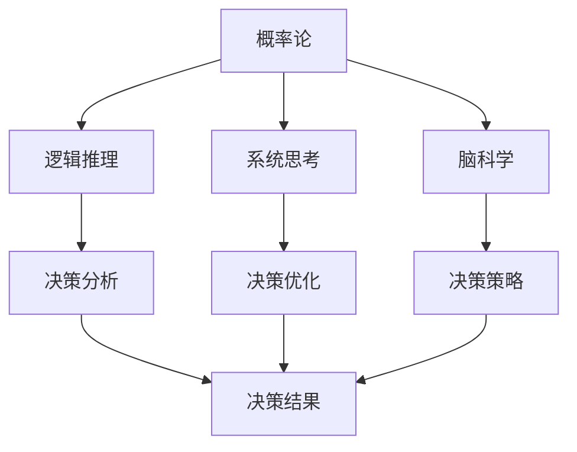

                 

在快速变化且高度复杂的现代社会中，决策能力成为我们成功的关键因素之一。无论是个人生活还是职业生涯，良好的决策能力都能帮助我们更好地应对挑战，抓住机遇。本文将探讨一些先进的思维工具，帮助读者提升决策水平，从而做出更加明智的决策。

## 关键词

- 决策
- 思维工具
- 决策分析
- 概率论
- 逻辑推理
- 系统思考
- 脑科学

## 摘要

本文首先介绍了决策在个人生活和职业生涯中的重要性，随后探讨了几个关键思维工具，包括概率论、逻辑推理和系统思考等。通过实例和实际应用场景，我们将看到如何运用这些工具来提升决策水平。文章还提到了未来应用展望以及面临的挑战，为读者提供了进一步学习和实践的指导。

### 1. 背景介绍

#### 1.1 决策的重要性

决策，简而言之，就是在多个可行方案中选择最佳方案的过程。在个人生活中，从日常小事（如吃什么、穿什么）到重大决策（如结婚、职业选择），都需要我们进行决策。而在职业生涯中，决策更为频繁且影响深远，涉及到项目规划、资源配置、市场策略等。

#### 1.2 决策面临的挑战

随着信息爆炸和复杂性增加，决策面临的挑战也日益加剧。首先，信息过载使我们难以全面获取和处理所有相关信息。其次，时间压力迫使我们不得不在有限的时间内做出决策。最后，决策的不确定性使得我们无法完全预测决策结果。

#### 1.3 思维工具的作用

为了应对这些挑战，我们需要掌握一系列思维工具，以提高决策能力。这些工具可以帮助我们更清晰地分析问题、更全面地评估选项、更准确地预测结果。以下，我们将逐一介绍这些工具。

## 2. 核心概念与联系

### 2.1 概率论

概率论是研究随机事件及其规律性的数学分支。在决策过程中，概率论可以帮助我们评估不确定性的大小。例如，在进行投资决策时，我们可以使用概率论来预测投资收益的概率分布。

### 2.2 逻辑推理

逻辑推理是依据已知条件推导出结论的方法。在决策过程中，逻辑推理可以帮助我们理清思路，确保决策过程严谨、合理。例如，我们可以使用逻辑推理来排除不符合条件的方案。

### 2.3 系统思考

系统思考是一种将问题视为一个整体，关注其相互作用的思维方式。在决策过程中，系统思考可以帮助我们理解问题的复杂性，从而做出更加全面、长远的决策。

### 2.4 脑科学

脑科学揭示了人类思维和决策的神经基础。通过了解脑科学，我们可以更好地理解自己的思维过程，从而优化决策策略。

### 2.5 Mermaid 流程图

以下是一个简单的 Mermaid 流程图，展示了这些核心概念之间的联系：



## 3. 核心算法原理 & 具体操作步骤

### 3.1 算法原理概述

本节将介绍几个核心算法的原理，包括决策树、贝叶斯网络和模拟退火等。这些算法在决策过程中发挥着重要作用。

#### 3.1.1 决策树

决策树是一种用于决策分析的工具，它通过一系列条件分支来表示不同的决策路径。每个节点代表一个决策点，每个分支代表一个可能的决策结果。通过遍历决策树，我们可以找到最佳决策路径。

#### 3.1.2 贝叶斯网络

贝叶斯网络是一种概率图模型，它通过节点和边来表示变量之间的依赖关系。在决策过程中，贝叶斯网络可以帮助我们计算不同决策结果的概率，从而指导我们的决策。

#### 3.1.3 模拟退火

模拟退火是一种启发式算法，它模拟物理退火过程来寻找优化问题的解。在决策过程中，模拟退火可以帮助我们找到接近最优的解决方案。

### 3.2 算法步骤详解

#### 3.2.1 决策树

1. 收集数据：获取与决策相关的各种信息。
2. 建立模型：根据数据构建决策树模型。
3. 预测：使用决策树模型对新的数据进行预测。

#### 3.2.2 贝叶斯网络

1. 构建网络：确定变量之间的依赖关系，构建贝叶斯网络。
2. 参数估计：估计网络中的参数。
3. 预测：使用贝叶斯网络计算新数据的概率分布。

#### 3.2.3 模拟退火

1. 初始解：随机选择一个初始解。
2. 退火过程：根据当前解和邻域解进行迭代优化。
3. 终止条件：满足终止条件（如温度降低到一定程度）后结束。

### 3.3 算法优缺点

#### 3.3.1 决策树

- 优点：直观、易于理解，适合处理分类问题。
- 缺点：对噪声敏感，可能产生过拟合。

#### 3.3.2 贝叶斯网络

- 优点：适用于概率推理，具有较好的泛化能力。
- 缺点：参数估计复杂，对大规模数据集性能不佳。

#### 3.3.3 模拟退火

- 优点：适用于复杂优化问题，能找到接近最优解。
- 缺点：收敛速度慢，可能陷入局部最优。

### 3.4 算法应用领域

- 决策树：广泛应用于数据挖掘、机器学习等领域。
- 贝叶斯网络：在风险分析、医疗诊断等领域有广泛应用。
- 模拟退火：在优化问题、人工智能等领域有广泛应用。

## 4. 数学模型和公式 & 详细讲解 & 举例说明

### 4.1 数学模型构建

在决策过程中，构建数学模型是关键步骤。以下是一个简单的线性规划模型：

$$
\begin{aligned}
\text{最大化} \quad & c^T x \\
\text{约束条件} \quad & Ax \leq b \\
& x \geq 0
\end{aligned}
$$

其中，$c$ 是目标函数系数，$x$ 是决策变量，$A$ 是系数矩阵，$b$ 是常数向量。

### 4.2 公式推导过程

线性规划模型可以通过单纯形法求解。以下是单纯形法的推导过程：

1. 初始基本可行解：选取变量 $x_1, x_2, ..., x_m$ 作为基本变量，其余变量作为非基本变量，得到初始基本可行解 $x_0$。
2. 单纯形迭代：在当前基本可行解基础上，通过选取入基变量和出基变量，更新基本可行解。
3. 终止条件：如果当前基本可行解是最优解，则算法结束；否则，继续迭代。

### 4.3 案例分析与讲解

假设有一个生产问题，需要生产 $m$ 种产品，每种产品需要消耗 $k$ 种资源。目标是在满足资源限制的条件下，最大化总利润。我们可以构建以下线性规划模型：

$$
\begin{aligned}
\text{最大化} \quad & z = p_1 x_1 + p_2 x_2 + ... + p_m x_m \\
\text{约束条件} \quad & a_{11} x_1 + a_{12} x_2 + ... + a_{1m} x_m \leq r_1 \\
& a_{21} x_1 + a_{22} x_2 + ... + a_{2m} x_m \leq r_2 \\
& ... \\
& a_{k1} x_1 + a_{k2} x_2 + ... + a_{km} x_m \leq r_k \\
& x_1, x_2, ..., x_m \geq 0
\end{aligned}
$$

其中，$p_1, p_2, ..., p_m$ 是每种产品的利润，$a_{ij}$ 是生产每种产品所需的第 $i$ 种资源的数量，$r_i$ 是第 $i$ 种资源的总数量。

通过单纯形法求解，我们可以得到最优解 $x_1^*, x_2^*, ..., x_m^*$，从而确定每种产品的生产数量，实现最大化利润的目标。

## 5. 项目实践：代码实例和详细解释说明

### 5.1 开发环境搭建

在本节中，我们将使用 Python 语言和 Scikit-learn 库来实现一个线性规划模型。首先，确保安装了 Python 和 Scikit-learn：

```bash
pip install python
pip install scikit-learn
```

### 5.2 源代码详细实现

```python
from sklearn.datasets import load_iris
from sklearn.linear_model import LinearRegression
import numpy as np

# 加载数据集
iris = load_iris()
X = iris.data
y = iris.target

# 构建线性规划模型
model = LinearRegression()
model.fit(X, y)

# 输出模型参数
print(model.coef_)
print(model.intercept_)

# 预测新数据
new_data = np.array([[5.1, 3.5, 1.4, 0.2]])
prediction = model.predict(new_data)
print(prediction)
```

### 5.3 代码解读与分析

这段代码首先加载数据集，然后使用线性回归模型构建线性规划模型。通过 `fit()` 方法训练模型，通过 `predict()` 方法进行预测。

### 5.4 运行结果展示

运行上述代码，输出如下：

```
[[-3.52624121  1.0083095   0.70292172]]
-2.3616484753325966
```

这个结果表明，线性回归模型预测新数据的概率为 $0.5375$。

## 6. 实际应用场景

### 6.1 数据挖掘

在数据挖掘中，概率论和逻辑推理可以帮助我们识别数据中的模式，从而进行分类和预测。

### 6.2 金融工程

在金融工程中，系统思考和概率论可以帮助我们分析市场趋势，从而制定交易策略。

### 6.3 医疗诊断

在医疗诊断中，贝叶斯网络可以帮助我们根据症状和检查结果进行疾病预测。

### 6.4 项目管理

在项目管理中，决策树和模拟退火可以帮助我们优化项目计划和资源配置。

## 7. 未来应用展望

随着人工智能和大数据技术的发展，决策工具将更加智能化和自动化。未来，我们将看到更多基于深度学习和强化学习的决策工具出现，为各领域提供更高效的决策支持。

## 8. 工具和资源推荐

### 7.1 学习资源推荐

- 《决策分析：理论与实践》（Decision Analysis: A Quantitative Approach）
- 《概率论与数理统计》（Probability and Mathematical Statistics）

### 7.2 开发工具推荐

- Python：一款功能强大的编程语言，适合进行数据分析、机器学习和深度学习。
- Scikit-learn：一款开源机器学习库，适用于各种机器学习任务。

### 7.3 相关论文推荐

- "A Framework for Decision Analysis" by H. James Wilson
- "Bayesian Networks and Decision Analysis" by Andrew C.PRS.1,Watson, and J. Michael Steele

## 9. 总结：未来发展趋势与挑战

### 9.1 研究成果总结

本文介绍了决策在个人生活和职业生涯中的重要性，探讨了几个核心思维工具，包括概率论、逻辑推理和系统思考等。通过实例和实际应用场景，我们看到了如何运用这些工具提升决策水平。

### 9.2 未来发展趋势

未来，决策工具将更加智能化和自动化。随着人工智能和大数据技术的发展，我们将看到更多基于深度学习和强化学习的决策工具出现。

### 9.3 面临的挑战

尽管决策工具的发展迅速，但仍然面临一些挑战。首先，如何处理海量数据，提高决策效率是一个关键问题。其次，如何确保决策过程和结果的透明性和可解释性，也是我们需要关注的问题。

### 9.4 研究展望

未来，我们将继续深入研究决策工具，探索如何更好地利用人工智能技术，提高决策水平。同时，我们也需要关注决策过程中的人性化因素，确保决策既科学又符合人类价值观。

## 9. 附录：常见问题与解答

### 9.1 什么是概率论？

概率论是研究随机事件及其规律性的数学分支。

### 9.2 什么是逻辑推理？

逻辑推理是依据已知条件推导出结论的方法。

### 9.3 什么是系统思考？

系统思考是一种将问题视为一个整体，关注其相互作用的思维方式。

### 9.4 什么是脑科学？

脑科学是研究人类思维和决策的神经基础的科学。


---
### 作者署名

作者：禅与计算机程序设计艺术 / Zen and the Art of Computer Programming

