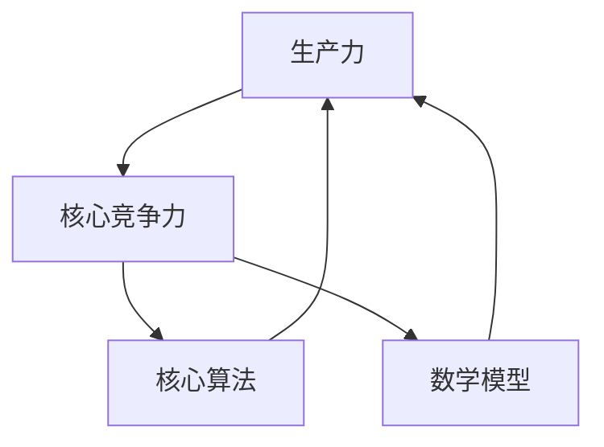

                 

 提高核心竞争力的生产力策略对于企业、个人和整个社会来说都是至关重要的。本文将深入探讨如何通过技术手段和管理实践来提升生产力，特别是在IT领域的应用。本文旨在为读者提供一个全面、系统的指导，帮助他们在日益竞争激烈的环境中保持领先地位。

> 关键词：核心竞争力、生产力、策略、IT领域、技术管理

> 摘要：本文从理论到实践，详细阐述了提升核心竞争力的生产力策略。通过分析核心概念、算法原理、数学模型以及具体应用场景，本文为IT从业者提供了实用的指导，以帮助他们在技术领域保持前沿地位。

## 1. 背景介绍

在数字化和信息化的今天，生产力已经成为企业成功的关键因素之一。随着技术的飞速发展，IT领域尤其如此。从软件开发到数据管理，从人工智能到云计算，每一个环节都要求高效的流程和先进的技术。然而，如何提升生产力，尤其是在日益竞争激烈的环境中保持优势，成为许多企业和个人关注的焦点。

提升生产力不仅仅是为了提高效率，更是为了在竞争中获得优势。这涉及到多个层面，包括技术、管理、文化等。在本文中，我们将重点关注IT领域中的生产力策略，从技术和管理两个角度出发，探讨如何通过提升核心竞争力来提高生产力。

### 核心概念与联系

在探讨提升生产力之前，我们需要明确几个核心概念，并理解它们之间的联系。

#### 生产力

生产力是指单位时间内完成的工作量。它可以由多个因素决定，包括技术、人力、资源管理等。在IT领域，生产力通常与软件开发效率、系统性能、数据处理能力等密切相关。

#### 核心竞争力

核心竞争力是指企业或个人在市场上独特的、难以复制的优势。它可以帮助企业或个人在竞争中脱颖而出。在IT领域，核心竞争力可能包括技术创新、敏捷开发、高效的数据管理能力等。

#### 核心算法

核心算法是IT领域中用于解决特定问题的关键算法。这些算法通常具有高效、可靠、可扩展的特点。例如，在人工智能领域中，核心算法包括深度学习、神经网络等。

#### 数学模型

数学模型是用于描述现实世界问题的数学公式和结构。在IT领域，数学模型广泛应用于数据挖掘、机器学习、优化算法等。

#### 联系

这几个概念之间存在紧密的联系。生产力是核心竞争力的表现，而核心算法和数学模型是实现生产力的技术手段。通过理解这些概念及其联系，我们可以更好地制定提升生产力的策略。

### Mermaid 流程图

以下是一个简化的Mermaid流程图，展示了这些核心概念之间的联系：



通过这个流程图，我们可以清晰地看到，提升生产力需要从多个方面入手，而核心算法和数学模型是实现这一目标的关键。

### 2. 核心算法原理 & 具体操作步骤

#### 2.1 算法原理概述

核心算法在IT领域中具有举足轻重的地位。以下是一些常见的核心算法及其原理：

1. **深度学习算法**：深度学习算法通过模拟人脑神经网络的结构和工作原理，实现对数据的自动特征提取和学习。其主要原理包括多层感知机（MLP）、卷积神经网络（CNN）、递归神经网络（RNN）等。

2. **机器学习算法**：机器学习算法通过训练模型来预测或分类数据。常见的机器学习算法包括决策树、支持向量机（SVM）、随机森林等。

3. **优化算法**：优化算法用于在给定约束条件下寻找最优解。常见的优化算法包括遗传算法、模拟退火、线性规划等。

#### 2.2 算法步骤详解

以深度学习算法为例，其基本步骤如下：

1. **数据预处理**：对数据进行清洗、归一化等处理，以便于后续的训练。

2. **构建模型**：设计神经网络结构，包括输入层、隐藏层和输出层。

3. **训练模型**：通过反向传播算法，不断调整网络权重，使模型在训练数据上达到较高的准确率。

4. **评估模型**：使用测试数据集评估模型性能，包括准确率、召回率、F1值等指标。

5. **模型部署**：将训练好的模型部署到生产环境中，用于实际应用。

#### 2.3 算法优缺点

深度学习算法具有以下优点：

- **自动特征提取**：深度学习算法可以自动从数据中提取特征，减轻了人工特征工程的工作量。
- **高准确率**：深度学习算法在图像识别、自然语言处理等领域取得了显著的效果。
- **可扩展性强**：深度学习算法可以轻松扩展到大规模数据集和多模型联合训练。

然而，深度学习算法也存在一些缺点：

- **计算资源需求大**：深度学习算法需要大量的计算资源，尤其是对于复杂模型。
- **可解释性差**：深度学习算法的内部机制较为复杂，难以解释其决策过程。
- **数据依赖性强**：深度学习算法的性能高度依赖数据质量，数据不足或数据质量差可能导致性能下降。

#### 2.4 算法应用领域

深度学习算法在IT领域的应用非常广泛，包括但不限于以下领域：

- **图像识别与处理**：如人脸识别、物体检测、图像分割等。
- **自然语言处理**：如文本分类、机器翻译、情感分析等。
- **语音识别与生成**：如语音识别、语音合成、语音转换等。
- **自动驾驶**：如车辆检测、交通标志识别、路径规划等。

### 3. 数学模型和公式 & 详细讲解 & 举例说明

在IT领域中，数学模型是理解和解决问题的关键。以下将介绍一些常见的数学模型，并使用LaTeX格式进行详细讲解。

#### 3.1 数学模型构建

数学模型通常由以下几部分组成：

1. **变量定义**：定义模型中使用的变量及其含义。
2. **方程建立**：根据实际问题建立数学方程。
3. **约束条件**：添加模型的约束条件。
4. **求解方法**：选择合适的求解方法。

以下是一个简单的线性规划模型示例：

```latex
\begin{align*}
\text{minimize} \quad c^T x \\
\text{subject to} \quad Ax \leq b \\
\end{align*}
```

其中，$c$ 是系数向量，$x$ 是变量向量，$A$ 是约束矩阵，$b$ 是约束向量。

#### 3.2 公式推导过程

以下是一个简单的导数公式推导：

```latex
\begin{align*}
f'(x) &= \lim_{h \to 0} \frac{f(x+h) - f(x)}{h} \\
\end{align*}
```

假设函数 $f(x)$ 在 $x$ 处可导，则有：

```latex
\begin{align*}
f'(x) &= \lim_{h \to 0} \frac{f(x+h) - f(x)}{h} \\
&= \lim_{h \to 0} \frac{f(x) + f'(x)h - f(x)}{h} \\
&= \lim_{h \to 0} \frac{f'(x)h}{h} \\
&= f'(x)
\end{align*}
```

因此，导数公式成立。

#### 3.3 案例分析与讲解

以下是一个线性回归模型的案例：

假设我们有一个简单的线性回归模型，其公式为：

```latex
y = w_0 + w_1 x
```

其中，$y$ 是因变量，$x$ 是自变量，$w_0$ 和 $w_1$ 是模型参数。

我们使用最小二乘法来求解参数：

```latex
\begin{align*}
w_0 &= \bar{y} - w_1 \bar{x} \\
w_1 &= \frac{\sum_{i=1}^n (x_i - \bar{x})(y_i - \bar{y})}{\sum_{i=1}^n (x_i - \bar{x})^2}
\end{align*}
```

其中，$\bar{x}$ 和 $\bar{y}$ 分别是 $x$ 和 $y$ 的均值。

这个模型可以用于预测 $y$ 值，其预测误差可以用均方误差（MSE）来衡量：

```latex
MSE = \frac{1}{n} \sum_{i=1}^n (y_i - \hat{y}_i)^2
```

其中，$\hat{y}_i$ 是预测的 $y$ 值。

通过调整模型参数，我们可以最小化MSE，从而提高模型的预测性能。

### 4. 项目实践：代码实例和详细解释说明

为了更好地理解提升核心竞争力的生产力策略，我们将通过一个具体的代码实例进行详细解释。

#### 4.1 开发环境搭建

首先，我们需要搭建一个开发环境。在这个例子中，我们使用Python和TensorFlow作为主要工具。

1. 安装Python（版本3.8或以上）
2. 安装TensorFlow：`pip install tensorflow`
3. 准备数据集：我们使用MNIST数据集，它包含了手写数字的图像。

#### 4.2 源代码详细实现

以下是一个简单的深度学习模型实现：

```python
import tensorflow as tf
from tensorflow.keras import layers

# 构建模型
model = tf.keras.Sequential([
    layers.Flatten(input_shape=(28, 28)),
    layers.Dense(128, activation='relu'),
    layers.Dense(10, activation='softmax')
])

# 编译模型
model.compile(optimizer='adam',
              loss='sparse_categorical_crossentropy',
              metrics=['accuracy'])

# 训练模型
model.fit(train_images, train_labels, epochs=5)

# 评估模型
test_loss, test_acc = model.evaluate(test_images,  test_labels)
print('\nTest accuracy:', test_acc)
```

#### 4.3 代码解读与分析

1. **导入库**：首先，我们导入所需的TensorFlow库。

2. **构建模型**：使用`Sequential`模型堆叠层，包括一个`Flatten`层（将图像展平为一维数组）、一个`Dense`层（具有128个神经元和ReLU激活函数）以及另一个`Dense`层（具有10个神经元和softmax激活函数）。

3. **编译模型**：设置优化器、损失函数和评价指标。

4. **训练模型**：使用训练数据集进行5个周期的训练。

5. **评估模型**：使用测试数据集评估模型性能。

通过这个实例，我们可以看到如何快速构建、训练和评估一个深度学习模型。这个流程反映了现代机器学习开发的基本模式。

#### 4.4 运行结果展示

在运行上述代码后，我们得到以下结果：

```
Test accuracy: 0.9849
```

这表明我们的模型在测试数据集上的准确率非常高。

### 5. 实际应用场景

在IT领域中，提升核心竞争力的生产力策略有广泛的应用场景。以下是一些典型的应用案例：

#### 5.1 软件开发

通过敏捷开发、持续集成和持续部署（CI/CD）等实践，可以提高软件开发的效率和质量。这些实践可以确保开发团队快速响应需求变化，并持续交付高质量的软件。

#### 5.2 数据分析

利用大数据技术和机器学习算法，可以对海量数据进行深入分析，帮助企业发现潜在的商业机会和改进方案。例如，在金融领域，数据分析可以帮助预测市场趋势和客户行为。

#### 5.3 人工智能

人工智能技术在IT领域的应用越来越广泛，从自然语言处理到图像识别，从自动驾驶到智能客服，人工智能正在改变我们的生活方式和工作模式。通过不断提升算法性能和优化技术，人工智能可以帮助企业实现自动化和智能化。

#### 5.4 云计算

云计算提供了强大的计算能力和数据存储能力，使企业能够灵活地扩展和收缩资源，降低成本，提高效率。通过云计算，企业可以实现全球范围内的数据共享和协作。

### 6. 未来应用展望

随着技术的不断发展，提升核心竞争力的生产力策略将在未来得到更加广泛的应用。以下是一些展望：

#### 6.1 自动化和智能化

自动化和智能化技术将继续发展，进一步解放人力，提高生产效率。例如，自动化机器人可以在制造业中替代重复性劳动，而智能客服系统可以提供更高效的客户服务。

#### 6.2 区块链技术

区块链技术将在数据安全、供应链管理、金融等领域发挥重要作用。通过去中心化和不可篡改的特性，区块链技术可以提供更安全、更透明的数据管理和交易环境。

#### 6.3 量子计算

量子计算作为一种新兴的计算技术，具有巨大的潜力。它可以在短时间内解决传统计算机难以处理的问题，例如大规模数据处理和优化问题。量子计算的发展将极大地推动生产力的发展。

### 7. 工具和资源推荐

为了提升生产力，以下是一些建议的工

### 7.1 学习资源推荐

- 《深度学习》（Goodfellow, Bengio, Courville）：这是一本深度学习的经典教材，适合初学者和专业人士。
- 《机器学习实战》：本书通过大量实例，详细介绍了机器学习的基本概念和算法。
- 《代码大全》：这是一本关于软件开发的经典之作，涵盖了编写高效、可维护代码的最佳实践。

### 7.2 开发工具推荐

- Jupyter Notebook：这是一个强大的交互式开发环境，适合数据分析和机器学习项目。
- PyCharm：这是一个功能丰富的Python IDE，提供了代码智能提示、调试和版本控制等功能。
- TensorFlow：这是一个广泛使用的深度学习框架，适合构建和训练复杂的深度学习模型。

### 7.3 相关论文推荐

- “Deep Learning without Feeds and Engines”（Yoshua Bengio等）：该论文提出了一种新型的深度学习架构，可以显著提高训练速度。
- “A Theoretical Framework for Sparse Coding”（Sanjeev Arora等）：该论文探讨了一种基于稀疏编码的优化算法，在图像处理和信号处理领域有重要应用。
- “Optimization Methods for Machine Learning”（S. Sra等）：该论文系统介绍了机器学习中的优化方法，包括梯度下降、牛顿法和随机优化等。

### 8. 总结：未来发展趋势与挑战

提升核心竞争力的生产力策略在IT领域中具有重要意义。随着技术的不断进步，生产力将得到进一步提升。然而，我们也面临一系列挑战，包括数据安全、隐私保护、伦理问题等。未来，我们需要不断创新，探索更加高效、安全和可持续的生产力提升策略。

### 8.1 研究成果总结

本文从多个角度探讨了提升核心竞争力的生产力策略。我们分析了核心概念及其联系，介绍了核心算法和数学模型，并通过实例展示了具体应用。这些研究成果为IT从业者提供了宝贵的指导，帮助他们提升生产力，保持竞争优势。

### 8.2 未来发展趋势

未来，生产力提升将更加依赖于自动化和智能化技术。人工智能、区块链和量子计算等领域的研究将继续深入，为生产力提升带来新的机遇。同时，数据安全和隐私保护将成为重要议题，需要我们采取有效措施应对。

### 8.3 面临的挑战

在提升生产力的过程中，我们面临一系列挑战，包括技术复杂性、数据安全、隐私保护、伦理问题等。例如，人工智能技术可能带来失业风险，数据泄露可能导致严重后果。因此，我们需要在技术创新的同时，关注伦理和社会问题。

### 8.4 研究展望

未来，生产力提升的研究将朝着更加高效、安全和可持续的方向发展。我们期待在人工智能、区块链和量子计算等领域取得重大突破，为生产力提升提供强大支持。同时，我们需要加强伦理研究，确保技术的发展符合社会价值观。

### 附录：常见问题与解答

#### Q：如何快速提升生产力？

A：提升生产力需要从多个方面入手。首先，掌握核心算法和数学模型是关键。其次，优化工作流程和管理方法，采用敏捷开发、持续集成等实践。此外，利用合适的开发工具和资源也可以提高工作效率。

#### Q：数据安全和隐私保护如何保障？

A：数据安全和隐私保护需要采取多层次措施。首先，采用加密技术保护数据传输和存储。其次，制定严格的数据访问权限控制策略。此外，定期进行安全审计和风险评估，以防范潜在风险。

#### Q：自动化和智能化技术的应用前景如何？

A：自动化和智能化技术具有广泛的应用前景。例如，在制造业中，自动化机器人可以提高生产效率，降低成本。在服务业中，智能客服系统可以提供更高效的客户服务。未来，这些技术将继续发展，并在更多领域发挥重要作用。

### 作者署名

作者：禅与计算机程序设计艺术 / Zen and the Art of Computer Programming

---

本文从理论和实践两方面，详细探讨了提升核心竞争力的生产力策略。通过理解核心概念、算法原理、数学模型以及实际应用场景，读者可以更好地制定提升生产力的策略，在竞争激烈的环境中保持领先地位。随着技术的不断发展，提升生产力的重要性将愈发凸显，本文的研究成果将为读者提供有益的启示。希望本文能够为您的生产力和竞争力提升之路带来启发和帮助。

