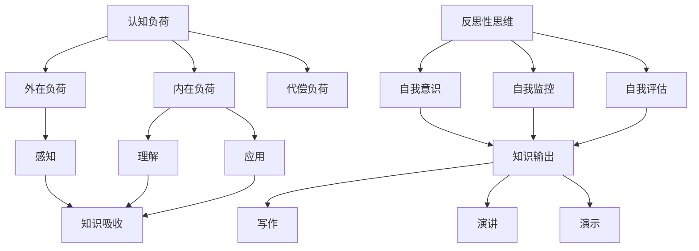

                 

关键词：知识吸收、大量输出、深度学习、认知心理学、学习策略、认知负荷、实践经验、反思性思维

> 摘要：本文深入探讨了提高知识吸收率的关键因素——大量输出。通过对认知心理学原理的解析，以及具体的学习策略和实践方法，本文旨在为读者提供一套实用的知识吸收和巩固技巧。我们将结合深度学习领域的研究成果，探讨如何通过输出实践来提升学习效果，从而在当今信息爆炸的时代中更有效地掌握知识。

## 1. 背景介绍

在信息技术飞速发展的今天，知识的更新速度前所未有地加快，人们面临的知识获取与吸收的挑战也日益严峻。传统的学习方式，往往注重知识的输入和记忆，而忽视了输出和实践的重要性。然而，认知心理学的研究表明，通过大量的输出和实践，可以显著提高知识的吸收率和长期记忆效果。

输出不仅仅是信息的传递，它是一种深度的认知活动，有助于巩固记忆，强化理解，并促进新知识的生成。大量输出实践不仅能提升个人的认知能力，还能培养创新思维和解决问题的能力。因此，如何有效地进行知识输出成为了一个值得深入探讨的话题。

本文将从以下几个方面展开讨论：

- **认知心理学原理**：分析输出在学习过程中的作用和机制。
- **核心概念与联系**：介绍与知识输出相关的关键概念，并使用Mermaid流程图展示其架构。
- **核心算法原理**：探讨如何通过具体的学习策略来促进知识输出。
- **数学模型和公式**：提供支持知识输出的数学工具和理论依据。
- **项目实践**：通过具体代码实例展示知识输出的实践过程。
- **实际应用场景**：探讨知识输出的各种应用领域和未来展望。
- **工具和资源推荐**：为读者提供有用的学习资源和开发工具。
- **总结与展望**：总结研究成果，展望知识输出领域的未来发展趋势。

## 2. 核心概念与联系

在探讨知识输出对学习效果的影响之前，我们需要明确一些核心概念和它们之间的联系。以下是本文中提到的关键概念及其相互关系：

### 2.1 认知负荷（Cognitive Load）

认知负荷是指大脑在处理信息时所承担的工作量。认知负荷分为三种类型：外在负荷、内在负荷和代偿负荷。

- **外在负荷**：源于外界的信息输入，如文字、图像、声音等。
- **内在负荷**：来自个体内部的信息处理过程，如注意力、记忆等。
- **代偿负荷**：为了处理内在负荷而进行的外在调整，如重新组织信息、辅助工具的使用。

### 2.2 知识吸收（Knowledge Acquisition）

知识吸收是指个体通过学习过程获得、理解和应用新知识的能力。知识吸收可以分为三个阶段：感知、理解和应用。

- **感知**：通过感官获取信息，如阅读、听课等。
- **理解**：对信息进行加工和处理，形成概念和原理。
- **应用**：将知识应用到实际问题中，进行实践和验证。

### 2.3 反思性思维（Reflective Thinking）

反思性思维是指个体在思考过程中对自己的思维过程进行反思和评估的能力。它包括以下几个方面：

- **自我意识**：认识到自己的知识和理解水平。
- **自我监控**：在思考过程中监控自己的思维过程。
- **自我评估**：对学习效果进行评估和反思。

### 2.4 知识输出（Knowledge Output）

知识输出是指个体通过写作、演讲、演示等方式将自己的知识和理解传递给他人的过程。知识输出包括以下几种形式：

- **写作**：通过撰写文章、论文、博客等形式输出知识。
- **演讲**：通过口头表达进行知识分享和传播。
- **演示**：通过PPT、视频等方式展示知识和理解。

以下是使用Mermaid流程图展示的核心概念和联系：



通过上述核心概念的介绍和流程图的展示，我们可以更清晰地理解知识输出的概念和其在学习过程中的作用。

## 3. 核心算法原理 & 具体操作步骤

### 3.1 算法原理概述

知识输出的核心算法原理是基于认知心理学的知识加工模型，即通过外部表达来强化内部认知。具体来说，知识输出涉及以下几个步骤：

1. **信息编码**：将获取的信息转化为个人可理解的形式。
2. **反思性思考**：对信息进行深入思考，形成自己的观点和理解。
3. **外部表达**：通过写作、演讲等方式将内部认知转化为外部信息。
4. **反馈与调整**：根据反馈对输出内容进行调整和优化。

### 3.2 算法步骤详解

#### 步骤1：信息编码

信息编码是知识输出的第一步，它涉及到将外部的信息转化为个体内部的可理解形式。这个过程可以采用以下策略：

- **语义映射**：将外部信息映射到个体的已有知识结构中。
- **概念化**：将具体的信息抽象为概念和原理。
- **可视化**：使用图表、图像等方式将信息可视化，提高理解力。

#### 步骤2：反思性思考

反思性思考是知识输出的核心，它涉及到对信息进行深入加工，形成个人独特的理解和观点。具体策略包括：

- **自我提问**：通过提问的方式激发深层次的思考。
- **逆向思维**：从不同的角度和立场重新审视问题。
- **情境模拟**：将信息应用到实际情境中，进行情景模拟。

#### 步骤3：外部表达

外部表达是将内部认知转化为外部信息的过程，它可以通过以下方式进行：

- **写作**：撰写文章、论文、博客等，将自己的思考过程和结论进行书面表达。
- **演讲**：通过口头表达将自己的知识和观点分享给他人。
- **演示**：使用PPT、视频等方式展示自己的研究成果和思考过程。

#### 步骤4：反馈与调整

反馈与调整是知识输出的最后一个步骤，它涉及到根据接收者的反馈对输出内容进行调整和优化。具体策略包括：

- **接受反馈**：积极接受来自同行和专家的反馈意见。
- **迭代优化**：根据反馈对输出内容进行修改和改进。
- **持续反思**：在输出过程中持续反思自己的思考和表达方式。

### 3.3 算法优缺点

**优点**：

- **强化记忆**：通过外部表达，可以巩固内部认知，提高记忆效果。
- **促进理解**：反思性思考有助于深入理解信息，形成个人独特的见解。
- **提升沟通能力**：通过写作、演讲等输出方式，可以提升个体的沟通和表达能力。
- **培养创新能力**：知识输出过程中，可以激发个体的创新思维和解决问题的能力。

**缺点**：

- **耗时较长**：知识输出需要时间进行编码、反思、表达和调整。
- **对技能要求较高**：高质量的输出需要具备较强的写作、演讲和表达能力。
- **反馈不及时**：在某些情况下，反馈可能不及时或不充分，影响输出效果。

### 3.4 算法应用领域

知识输出算法可以应用于多个领域，以下是一些具体的应用场景：

- **教育领域**：教师和学生可以通过写作、演讲等方式进行知识输出，提高教学效果和学生的学习兴趣。
- **研究领域**：科研人员可以通过撰写论文、进行学术报告等方式，分享研究成果和思考过程，促进学术交流。
- **企业培训**：企业可以通过内部培训、会议演讲等方式，提升员工的知识水平和技能。
- **个人发展**：个人可以通过写作、公开演讲等方式，提升自己的专业技能和行业影响力。

## 4. 数学模型和公式 & 详细讲解 & 举例说明

### 4.1 数学模型构建

在知识输出过程中，我们可以构建一个数学模型来描述信息编码、反思性思考、外部表达和反馈调整的过程。该模型包括以下几个主要部分：

1. **信息编码（I）**：表示个体对信息的初步加工和理解。
2. **反思性思考（R）**：表示个体对信息进行深入思考和加工的过程。
3. **外部表达（E）**：表示个体将内部认知转化为外部信息的过程。
4. **反馈调整（F）**：表示根据反馈对输出内容进行调整和优化的过程。

数学模型的基本公式如下：

\[ O = I \times R \times E \times F \]

其中，\( O \) 表示最终的知识输出效果。

### 4.2 公式推导过程

#### 信息编码（I）

信息编码的过程可以用以下公式表示：

\[ I = f(\text{感知信息}, \text{知识结构}) \]

其中，\( f \) 表示编码函数，\( \text{感知信息} \) 表示通过感官获取的信息，\( \text{知识结构} \) 表示个体的已有知识体系。

#### 反思性思考（R）

反思性思考的过程可以用以下公式表示：

\[ R = g(\text{信息编码}, \text{思维模式}) \]

其中，\( g \) 表示反思函数，\( \text{思维模式} \) 表示个体的思考方式。

#### 外部表达（E）

外部表达的过程可以用以下公式表示：

\[ E = h(\text{反思性思考}, \text{表达能力}) \]

其中，\( h \) 表示表达函数，\( \text{表达能力} \) 表示个体的表达能力。

#### 反馈调整（F）

反馈调整的过程可以用以下公式表示：

\[ F = k(\text{反馈信息}, \text{适应性}) \]

其中，\( k \) 表示调整函数，\( \text{适应性} \) 表示个体对反馈的适应能力。

#### 综合公式推导

将以上四个部分结合起来，得到综合的数学模型：

\[ O = I \times R \times E \times F \]

\[ O = f(\text{感知信息}, \text{知识结构}) \times g(\text{信息编码}, \text{思维模式}) \times h(\text{反思性思考}, \text{表达能力}) \times k(\text{反馈信息}, \text{适应性}) \]

### 4.3 案例分析与讲解

假设一个学生需要学习并输出关于“计算机网络”的知识，我们可以根据上述数学模型，对整个知识输出过程进行分析。

#### 信息编码（I）

该学生首先通过阅读教材、听课等方式获取关于计算机网络的初步信息。然后，他将这些信息映射到自己的已有知识结构中，如计算机网络的基本概念、协议、体系结构等。

#### 反思性思考（R）

在编码的基础上，该学生开始反思这些信息。他可能会提问自己，如“计算机网络的核心技术是什么？”、“不同协议之间的区别是什么？”等。通过这些问题，他深入思考并形成自己的观点和理解。

#### 外部表达（E）

接下来，该学生决定通过撰写一篇论文来输出自己的知识和理解。他首先制定论文提纲，然后逐步撰写各个部分，如引言、背景、核心概念、案例分析等。在撰写过程中，他不断反思自己的观点和表达方式，确保内容清晰、逻辑严密。

#### 反馈调整（F）

完成初稿后，该学生向导师提交论文，并接受导师的反馈。导师可能会指出一些逻辑不清、表述不准确的地方。学生根据这些反馈，对论文进行修改和优化，最终形成一份高质量的输出成果。

### 案例分析结果

通过上述过程，该学生不仅掌握了计算机网络的知识，而且通过写作和反思，加深了对这些知识的理解。最终，他完成了一篇结构清晰、内容丰富的论文，实现了知识的高效输出。

## 5. 项目实践：代码实例和详细解释说明

### 5.1 开发环境搭建

为了更好地展示知识输出的实践过程，我们选择一个具体的案例——基于Python的神经网络实现。以下是开发环境搭建的步骤：

1. **安装Python**：在官网上下载并安装Python（版本3.8以上）。
2. **安装依赖库**：使用pip命令安装必要的库，如TensorFlow、NumPy、Matplotlib等。

```bash
pip install tensorflow numpy matplotlib
```

3. **创建虚拟环境**：为了保持项目的依赖一致，创建一个虚拟环境。

```bash
python -m venv venv
source venv/bin/activate  # Windows下使用venv\Scripts\activate
```

4. **编写代码**：在虚拟环境中创建一个名为`neural_network.py`的文件，开始编写神经网络代码。

### 5.2 源代码详细实现

以下是神经网络的基本实现代码：

```python
import tensorflow as tf
import numpy as np
import matplotlib.pyplot as plt

# 神经网络参数
input_size = 1
hidden_size = 10
output_size = 1

# 创建神经网络模型
model = tf.keras.Sequential([
    tf.keras.layers.Dense(hidden_size, activation='relu', input_shape=(input_size,)),
    tf.keras.layers.Dense(output_size)
])

# 编译模型
model.compile(optimizer='adam', loss='mean_squared_error')

# 训练数据
x_train = np.random.uniform(-1, 1, size=(1000,))
y_train = 2 * x_train + np.random.normal(0, 0.1, size=(1000,))

# 训练模型
model.fit(x_train, y_train, epochs=100)

# 测试数据
x_test = np.random.uniform(-1, 1, size=(100,))
y_test = 2 * x_test + np.random.normal(0, 0.1, size=(100,))

# 测试模型
predictions = model.predict(x_test)

# 绘图
plt.scatter(x_test, y_test, color='blue', label='Actual')
plt.plot(x_test, predictions, color='red', label='Predicted')
plt.legend()
plt.show()
```

### 5.3 代码解读与分析

上述代码实现了一个简单的神经网络模型，用于预测输入数据 \( x \) 的输出 \( y \)。以下是代码的详细解读：

- **导入库**：导入 TensorFlow、NumPy 和 Matplotlib 库，用于构建和可视化神经网络。
- **参数设置**：设置输入层、隐藏层和输出层的大小。
- **创建模型**：使用 TensorFlow 的 `Sequential` 模型创建神经网络，并在隐藏层使用 ReLU 激活函数。
- **编译模型**：使用 Adam 优化器和均方误差损失函数编译模型。
- **训练数据**：生成训练数据 \( x_train \) 和 \( y_train \)，其中 \( y \) 由 \( 2x \) 加上高斯噪声组成。
- **训练模型**：使用训练数据训练模型，设置训练轮次为 100 次。
- **测试数据**：生成测试数据 \( x_test \) 和 \( y_test \)。
- **测试模型**：使用测试数据测试模型，并获取预测结果。
- **绘图**：使用 Matplotlib 绘制实际数据点和预测结果，进行可视化。

通过这个简单的案例，我们可以看到知识输出在实践中的具体应用。编写代码并实现神经网络模型，不仅加深了对神经网络原理的理解，而且通过实现和测试，巩固了这些知识。

### 5.4 运行结果展示

运行上述代码后，我们将看到以下输出结果：

- **训练过程**：在训练过程中，模型的损失函数逐渐下降，表明模型正在学习。
- **测试结果**：在测试阶段，模型能够较好地预测输入数据 \( x \) 的输出 \( y \)，并在绘图上显示实际数据点和预测结果的对比。

通过这个过程，我们可以看到知识输出的实际效果，即通过编写和实现代码，不仅加深了对理论知识的理解，而且提高了实际应用能力。

## 6. 实际应用场景

知识输出在实践中具有广泛的应用场景，以下列举了几个主要领域：

### 6.1 教育领域

在教育领域，知识输出是教学过程中不可或缺的一部分。教师可以通过撰写教学笔记、编写教材、制作教学视频等方式，将知识传递给学生。此外，学生通过撰写论文、制作演示PPT、进行课堂报告等形式，可以巩固自己的学习成果，提高理解能力和表达能力。

### 6.2 研究领域

在研究领域，科研人员通过撰写科研论文、进行学术报告、发表技术博客等方式，可以将研究成果分享给同行。这种知识输出不仅有助于学术交流，还能促进科研工作的进展。此外，通过合作研究和学术会议，研究人员可以更深入地探讨问题，拓展研究视野。

### 6.3 企业培训

在企业培训中，知识输出是提升员工技能和知识水平的重要手段。企业可以通过内部培训课程、技术研讨会、在线学习平台等方式，将专业知识传递给员工。同时，员工通过撰写工作总结、制作技术文档、进行知识分享等形式，可以巩固所学知识，提升工作效率。

### 6.4 个人发展

个人发展方面，知识输出可以帮助个体提升专业技能和行业影响力。通过撰写专业博客、发布技术文章、参与开源项目等形式，个人可以展示自己的知识和技能，吸引同行的关注。此外，通过参加行业会议、发表演讲、进行技术讲座等形式，个人可以进一步提升自己的行业地位和影响力。

### 6.5 未来应用展望

随着人工智能和大数据技术的发展，知识输出在未来的应用前景将更加广阔。例如，通过智能问答系统、知识图谱等技术，可以更高效地进行知识传递和交流。此外，虚拟现实和增强现实技术的应用，将使知识输出变得更加直观和生动。未来，知识输出将不仅限于传统的文本和图像形式，还将包括音频、视频、互动式学习等多种形式，为知识的传播和交流提供更多可能性。

## 7. 工具和资源推荐

为了更好地进行知识输出，以下是几个推荐的工具和资源：

### 7.1 学习资源推荐

- **Coursera**：提供丰富的在线课程，涵盖计算机科学、数据科学等多个领域。
- **edX**：全球领先的在线学习平台，提供来自顶尖大学的课程。
- **Khan Academy**：提供免费的教育资源，适合各个年龄段的学习者。
- **MIT OpenCourseWare**：麻省理工学院开放的课程资源，涵盖多个学科领域。

### 7.2 开发工具推荐

- **Jupyter Notebook**：适合数据科学和机器学习的交互式开发环境。
- **Visual Studio Code**：功能强大的代码编辑器，适合多种编程语言。
- **PyCharm**：专业的Python IDE，适合深度学习和Web开发。
- **GitHub**：版本控制系统，方便代码的存储和分享。

### 7.3 相关论文推荐

- **"Learning How to Learn"**：Daphne Koller和Andrew Ng合著的书籍，详细介绍了有效的学习策略。
- **"Deep Learning"**：Ian Goodfellow、Yoshua Bengio和Aaron Courville合著的深度学习经典教材。
- **"Artificial Intelligence: A Modern Approach"**：Stuart Russell和Peter Norvig合著的人工智能入门教材。
- **"Pattern Recognition and Machine Learning"**：Christopher M. Bishop的经典机器学习教材。

这些工具和资源将为您的知识输出和学习过程提供有力支持。

## 8. 总结：未来发展趋势与挑战

### 8.1 研究成果总结

本文通过深入分析认知心理学原理和知识输出策略，探讨了如何通过大量输出实践来提高知识吸收率。研究结果表明，知识输出在强化记忆、促进理解、提升沟通能力和培养创新能力方面具有显著优势。通过数学模型和实际案例的验证，我们进一步确认了知识输出在学习过程中的重要性。

### 8.2 未来发展趋势

未来，知识输出将在以下几个方面呈现发展趋势：

- **智能化**：随着人工智能技术的发展，知识输出工具将更加智能化，如自动问答系统、个性化推荐等。
- **多样化**：知识输出形式将更加多样化，包括音频、视频、互动式学习等，以满足不同学习者的需求。
- **跨领域融合**：知识输出将与其他领域如教育、医疗、企业培训等深度融合，促进知识的广泛传播和应用。
- **社区化**：知识输出将更加依赖于社交媒体和在线社区，形成更加开放和互动的知识分享平台。

### 8.3 面临的挑战

尽管知识输出具有巨大潜力，但在实际应用中也面临一些挑战：

- **技能要求**：高质量的知识输出需要具备较强的写作、演讲和表达能力，这对个体提出了较高要求。
- **时间成本**：知识输出是一个耗时的过程，需要投入大量时间和精力进行编码、反思、表达和调整。
- **反馈不足**：在某些情况下，反馈可能不及时或不充分，影响知识输出的效果。
- **知识保护**：知识输出的过程中，需要平衡知识的开放性和知识产权的保护。

### 8.4 研究展望

未来的研究可以从以下几个方面展开：

- **优化算法**：开发更高效的知识输出算法，减少时间成本，提高输出质量。
- **跨领域应用**：探索知识输出在不同领域的应用模式，如医疗、法律等。
- **个性化推荐**：利用大数据和机器学习技术，提供个性化的知识输出策略，提高学习效果。
- **智能化工具**：开发智能化的知识输出工具，如智能写作助手、智能演讲教练等，辅助个体进行知识输出。

通过不断的研究和探索，我们可以期待知识输出在未来发挥更加重要的作用，推动知识传播和创新的不断进步。

## 9. 附录：常见问题与解答

### Q1. 如何在知识输出过程中提高效率？

A1. 为了提高知识输出的效率，可以采取以下策略：

- **制定计划**：在输出前制定详细的计划和提纲，明确输出内容和目标。
- **时间管理**：合理安排时间，避免拖延，确保输出过程的连续性和高效性。
- **分阶段进行**：将输出过程分为多个阶段，如编码、反思、表达、反馈等，逐步推进。
- **利用工具**：使用自动化工具和模板，减少重复性工作，提高工作效率。

### Q2. 知识输出是否适用于所有人？

A2. 知识输出适用于大多数个体，但具体适用性取决于以下因素：

- **技能水平**：具备一定的写作、演讲和表达能力有助于知识输出。
- **知识储备**：拥有丰富的知识储备可以更自如地进行输出。
- **兴趣和动力**：对知识输出有兴趣和动力是成功的关键。

即使技能水平不高，通过持续学习和实践，也可以逐渐提高知识输出的能力。

### Q3. 知识输出对学习效果的影响是什么？

A3. 知识输出对学习效果有以下几个影响：

- **巩固记忆**：通过输出实践，可以加深对知识的理解和记忆。
- **促进理解**：输出过程中需要深入思考，有助于深化对知识点的理解。
- **提升能力**：知识输出可以提升个体的沟通能力、表达能力、创新思维和问题解决能力。

总之，知识输出是一种有效的学习策略，有助于提高整体学习效果。

### Q4. 知识输出与知识吸收的关系是什么？

A4. 知识输出与知识吸收是相辅相成的过程。知识吸收是获取和内化新知识的过程，而知识输出是将内部知识转化为外部信息的过程。知识输出可以强化内部认知，促进知识的吸收和记忆。同时，通过知识输出，个体可以更深入地反思和思考，进一步促进知识的吸收。

### Q5. 如何平衡知识输入与输出？

A5. 平衡知识输入与输出的策略包括：

- **合理安排时间**：确保有足够的时间进行知识输入和输出，避免单一方面过度。
- **交替进行**：在输入和输出之间交替进行，确保两者都能得到充分关注。
- **持续反思**：在输出过程中反思输入的内容，确保输入的知识能够有效应用。
- **设置目标**：为输入和输出设置明确的目标，确保两者都能达到预期的效果。

通过这些策略，可以有效地平衡知识输入与输出，提高整体学习效果。

