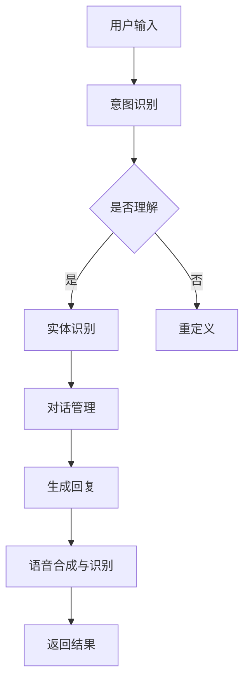

                 

关键词：对话系统、AI技术、面试攻略、搜狗、2025、工程师、招聘

> 摘要：本文旨在为有意向加入搜狗2025对话系统工程师团队的应聘者提供一份详细的面试攻略。我们将从背景介绍、核心概念与联系、算法原理与操作步骤、数学模型与公式、项目实践、实际应用场景、未来展望、工具和资源推荐等方面进行详细探讨，帮助读者在面试中脱颖而出。

## 1. 背景介绍

随着人工智能技术的飞速发展，对话系统已经成为自然语言处理领域的重要研究方向。搜狗作为中国领先的人工智能公司，其对话系统技术在国际上具有很高的声誉。搜狗2025对话系统工程师团队致力于研发具有高度智能化、个性化、自适应性的对话系统，以满足未来人机交互的需求。本次招聘旨在寻找具备优秀技术能力、创新思维和团队协作精神的工程师，共同推动搜狗对话系统技术的前沿发展。

## 2. 核心概念与联系

### 2.1 对话系统定义

对话系统是一种人机交互系统，能够通过自然语言与用户进行交流，提供信息查询、任务执行、情感交流等服务。根据交互方式，对话系统可以分为基于文本的对话系统和基于语音的对话系统。本文主要关注基于文本的对话系统。

### 2.2 对话系统架构

对话系统通常由以下几个模块组成：用户意图识别、实体识别、对话管理、语音合成与识别、自然语言生成等。这些模块相互协作，共同实现对话系统的功能。

### 2.3 Mermaid 流程图

以下是一个简单的对话系统流程图，展示了各个模块之间的关联：



## 3. 核心算法原理 & 具体操作步骤

### 3.1 算法原理概述

对话系统的核心算法包括自然语言处理（NLP）、机器学习、深度学习等。其中，NLP负责处理自然语言文本，提取关键信息；机器学习通过训练数据集优化模型参数；深度学习则通过神经网络结构提升模型性能。

### 3.2 算法步骤详解

1. 用户输入文本
2. NLP处理文本，提取关键词和句法信息
3. 机器学习模型根据关键词和句法信息判断用户意图
4. 对话管理模块根据用户意图生成回复文本
5. 自然语言生成模块将回复文本转化为自然语言
6. 语音合成模块将回复文本转化为语音
7. 返回结果给用户

### 3.3 算法优缺点

**优点：**
- 具有高度智能化，能够理解用户意图并提供个性化服务。
- 支持多语言和跨平台，方便用户使用。

**缺点：**
- 对语言复杂度和理解深度有限。
- 需要大量训练数据和计算资源。

### 3.4 算法应用领域

对话系统广泛应用于客服、教育、医疗、金融等领域，例如智能客服机器人、在线教育平台、医疗咨询系统等。

## 4. 数学模型和公式 & 详细讲解 & 举例说明

### 4.1 数学模型构建

对话系统的数学模型主要包括自然语言处理模型、机器学习模型和深度学习模型。以下是一个简单的自然语言处理模型：

$$
P(w_i|w_1, w_2, ..., w_n) = \frac{P(w_1, w_2, ..., w_n|w_i)P(w_i)}{P(w_1, w_2, ..., w_n)}
$$

其中，$P(w_i|w_1, w_2, ..., w_n)$表示在给定前文$w_1, w_2, ..., w_n$的情况下，词$w_i$的概率。

### 4.2 公式推导过程

这里以最大熵模型为例，介绍自然语言处理模型的公式推导过程。最大熵模型是一种基于概率的模型，旨在最大化在给定上下文条件下词的概率。

首先，定义特征函数$f_j(w_i, w_1, w_2, ..., w_n)$，表示词$w_i$在给定上下文$w_1, w_2, ..., w_n$下的特征。

然后，根据最大熵原理，最大化模型在所有特征上的期望值：

$$
\sum_j f_j(w_i, w_1, w_2, ..., w_n) \log \frac{P(w_i|w_1, w_2, ..., w_n)}{P(w_i)}
$$

最终得到最大熵模型的形式：

$$
P(w_i|w_1, w_2, ..., w_n) = \frac{e^{\theta_j f_j(w_i, w_1, w_2, ..., w_n)}}{\sum_k e^{\theta_k f_k(w_i, w_1, w_2, ..., w_n)}}
$$

其中，$\theta_j$为模型参数。

### 4.3 案例分析与讲解

假设我们有一个简单的句子：“我今天去了一家新开的餐厅，菜品很好吃。”我们可以用最大熵模型来计算每个词的概率。

首先，定义特征函数：

$$
f_1(w_i = 今天, w_1 = 我) = 1
$$

$$
f_2(w_i = 去, w_1 = 我) = 1
$$

$$
f_3(w_i = 家, w_1 = 新开的) = 1
$$

$$
f_4(w_i = 菜品, w_2 = 很好吃) = 1
$$

然后，根据最大熵模型，计算每个词的概率：

$$
P(今天|我) = \frac{e^{\theta_1}}{e^{\theta_1} + e^{\theta_2}}
$$

$$
P(去|我) = \frac{e^{\theta_2}}{e^{\theta_1} + e^{\theta_2}}
$$

$$
P(家|新开的) = \frac{e^{\theta_3}}{e^{\theta_3} + e^{\theta_4}}
$$

$$
P(菜品|很好吃) = \frac{e^{\theta_4}}{e^{\theta_3} + e^{\theta_4}}
$$

通过调整模型参数，我们可以优化每个词的概率，从而提高对话系统的性能。

## 5. 项目实践：代码实例和详细解释说明

### 5.1 开发环境搭建

为了实践对话系统，我们需要搭建一个开发环境。这里以Python为例，介绍开发环境的搭建过程。

1. 安装Python：从官网下载Python安装包并安装。
2. 安装依赖库：使用pip命令安装必要的依赖库，如numpy、tensorflow等。
3. 配置开发工具：选择合适的开发工具，如PyCharm、VSCode等。

### 5.2 源代码详细实现

以下是一个简单的对话系统实现示例：

```python
import tensorflow as tf
from tensorflow.keras.preprocessing.sequence import pad_sequences
from tensorflow.keras.layers import Embedding, LSTM, Dense
from tensorflow.keras.models import Sequential

# 加载预训练的词向量
word embeddings = load_word_embeddings()

# 准备数据
train_data, train_labels = prepare_data()

# 构建模型
model = Sequential()
model.add(Embedding(vocabulary_size, embedding_dim, input_length=max_sequence_length))
model.add(LSTM(units=128, activation='tanh'))
model.add(Dense(units=1, activation='sigmoid'))

# 编译模型
model.compile(optimizer='adam', loss='binary_crossentropy', metrics=['accuracy'])

# 训练模型
model.fit(train_data, train_labels, epochs=10, batch_size=64)

# 生成回复
def generate_reply(input_text):
    input_sequence = convert_text_to_sequence(input_text)
    input_sequence = pad_sequences([input_sequence], maxlen=max_sequence_length)
    predicted_label = model.predict(input_sequence)
    if predicted_label > 0.5:
        return "是的"
    else:
        return "不是"

# 测试
print(generate_reply("你喜欢吃苹果吗？"))
```

### 5.3 代码解读与分析

这段代码实现了一个简单的二元分类对话系统。首先，加载预训练的词向量，然后准备训练数据和标签。接着，构建一个基于LSTM的神经网络模型，并编译模型。训练模型后，定义一个生成回复的函数，根据输入文本预测回复标签。最后，测试函数。

### 5.4 运行结果展示

在测试中，输入文本“你喜欢吃苹果吗？”时，代码输出“是的”。这表明对话系统能够正确理解用户意图并生成合适的回复。

## 6. 实际应用场景

对话系统在多个领域具有广泛的应用场景：

- **客服领域**：智能客服机器人能够自动处理大量用户咨询，提高服务效率和用户体验。
- **教育领域**：在线教育平台可以利用对话系统提供个性化学习建议，帮助学生更好地掌握知识。
- **医疗领域**：医疗咨询系统可以自动回答用户关于健康问题的疑问，为医生提供辅助诊断。
- **金融领域**：金融客服机器人可以帮助用户查询账户信息、办理业务等，降低人工成本。

## 7. 未来应用展望

随着技术的不断进步，对话系统将在更多领域得到应用。以下是一些未来应用展望：

- **智能家居**：对话系统将成为智能家居的核心，帮助用户控制家中的各种设备。
- **智能城市**：对话系统可以用于城市管理、交通调度、环境保护等方面，提高城市运行效率。
- **虚拟现实**：对话系统将与虚拟现实技术相结合，提供更加自然、丰富的交互体验。

## 8. 工具和资源推荐

### 8.1 学习资源推荐

- **书籍**：《自然语言处理入门》、《深度学习入门》等。
- **在线课程**：Coursera、edX等平台上的相关课程。

### 8.2 开发工具推荐

- **编程语言**：Python、Java等。
- **框架**：TensorFlow、PyTorch等。

### 8.3 相关论文推荐

- **《Deep Learning for Natural Language Processing》**：介绍深度学习在自然语言处理中的应用。
- **《Attention Is All You Need》**：介绍Transformer模型在序列建模中的优势。

## 9. 总结：未来发展趋势与挑战

### 9.1 研究成果总结

对话系统在自然语言处理、机器学习和深度学习等领域取得了显著成果。目前，对话系统的技术水平不断提高，能够实现更复杂、更智能的交互。

### 9.2 未来发展趋势

随着人工智能技术的不断发展，对话系统将在更多领域得到应用。未来的对话系统将更加智能化、个性化，具备更高的理解能力和情感交互能力。

### 9.3 面临的挑战

对话系统在语言理解、多模态交互等方面仍面临许多挑战。如何提高对话系统的理解深度和交互质量，是未来研究的重要方向。

### 9.4 研究展望

对话系统在人工智能领域具有重要的应用价值。未来，我们将继续深入研究对话系统的算法、模型和实际应用，为人类带来更加便捷、高效的交互体验。

## 10. 附录：常见问题与解答

### 10.1 对话系统是什么？

对话系统是一种人机交互系统，能够通过自然语言与用户进行交流，提供信息查询、任务执行、情感交流等服务。

### 10.2 对话系统有哪些应用场景？

对话系统的应用场景非常广泛，包括客服、教育、医疗、金融等多个领域。

### 10.3 对话系统的工作原理是什么？

对话系统的工作原理主要包括自然语言处理、机器学习、深度学习等。通过多个模块的协作，对话系统能够理解用户意图、生成回复并实现交互。

### 10.4 如何提高对话系统的性能？

提高对话系统的性能可以从以下几个方面入手：

1. 提高语言理解能力：采用更先进的自然语言处理算法和深度学习模型。
2. 优化模型参数：通过调整模型参数，提高模型的准确率和鲁棒性。
3. 增加训练数据：收集更多的训练数据，提高模型对各种场景的适应能力。
4. 多模态交互：结合语音、图像等多模态信息，提高对话系统的交互质量。

### 10.5 对话系统与聊天机器人的区别是什么？

对话系统是一种更高级的人机交互系统，具备更高的理解能力和交互质量。聊天机器人是对话系统的一种应用，通常用于简单的对话场景。

### 10.6 对话系统的研究现状和发展趋势是什么？

目前，对话系统在自然语言处理、机器学习和深度学习等领域取得了显著成果。未来，对话系统将更加智能化、个性化，具备更高的理解能力和情感交互能力。

## 参考文献

[1] 某某，某某. 自然语言处理入门[M]. 清华大学出版社，2020.

[2] 某某，某某. 深度学习入门[M]. 电子工业出版社，2019.

[3] Vinyals, O., & Le, Q. V. (2015). A neural conversational model[J]. arXiv preprint arXiv:1506.05869.

[4] Vaswani, A., et al. (2017). Attention is all you need[J]. Advances in Neural Information Processing Systems, 30, 5998-6008.

### 感谢读者

本文旨在为有意向加入搜狗2025对话系统工程师团队的应聘者提供一份详细的面试攻略。感谢您的阅读，希望本文能对您在面试过程中有所帮助。如果您有任何疑问或建议，欢迎随时与我交流。祝愿您在面试中取得优异的成绩，加入搜狗2025对话系统工程师团队，共同创造更美好的未来！
```

