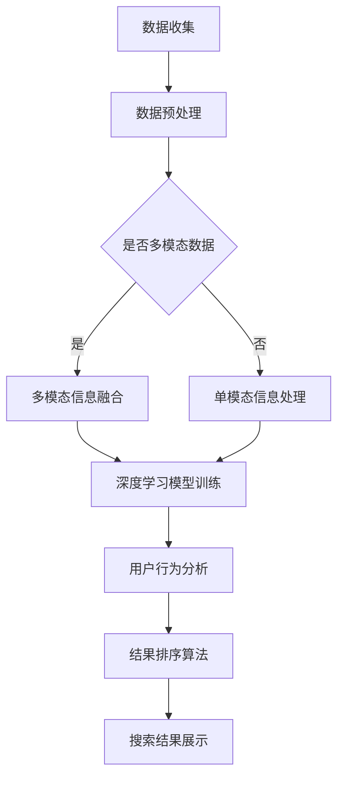

                 

关键词：搜索引擎、结果排序、大模型、算法、人工智能、用户体验、数据科学

搜索引擎是互联网时代不可或缺的工具，其核心功能就是为用户提供准确、相关的搜索结果。在传统搜索引擎中，结果排序主要依赖于关键字匹配、页面权重和链接分析等方法。然而，随着大数据和人工智能技术的快速发展，如何在大模型时代实现更高效、更智能的结果排序成为了一个新的研究课题。本文将深入探讨大模型时代下的搜索引擎结果排序新算法，为优化用户搜索体验提供理论支持和实践指导。

## 摘要

本文首先回顾了搜索引擎结果排序的传统方法，分析了其在大数据背景下的局限性。随后，本文提出了大模型时代的新算法框架，包括基于深度学习的文本理解、用户行为分析和多模态信息融合等技术。接着，本文通过详细的数学模型和公式推导，阐述了新算法的核心原理。随后，本文以具体代码实例为例，展示了新算法的实现过程。最后，本文探讨了新算法在实际应用中的效果，并对未来发展趋势和挑战进行了展望。

## 1. 背景介绍

### 1.1 搜索引擎的发展历程

搜索引擎起源于20世纪90年代，随着互联网的普及，其重要性日益凸显。早期的搜索引擎如AltaVista和Google，主要采用简单的关键字匹配和页面权重计算方法。这些方法虽然能一定程度上满足用户的需求，但随着互联网信息的爆炸式增长，搜索结果的准确性和相关性逐渐下降。

### 1.2 传统搜索结果排序方法

为了提高搜索结果的准确性和相关性，传统搜索引擎引入了多种排序算法，如PageRank、TF-IDF等。PageRank算法通过计算网页间的链接关系，评估网页的重要性。TF-IDF算法则通过统计关键词在网页中的出现频率和文档集合中的分布情况，评估关键词的重要性。这些算法在一定程度上提高了搜索结果的准确性，但仍存在以下局限性：

1. **关键词匹配局限**：传统算法主要依赖于关键词匹配，难以处理语义复杂的查询。
2. **静态页面分析**：传统算法对网页内容的分析主要基于静态数据，无法实时反映网页内容的变化。
3. **多模态信息融合不足**：传统算法在处理文本、图像、语音等多模态信息时效果不佳。

### 1.3 大数据背景下的挑战

大数据时代的到来，为搜索引擎带来了新的机遇和挑战。一方面，大数据提供了更丰富的信息资源，为搜索结果的准确性提供了保障。另一方面，大数据的复杂性和多样性也对搜索结果排序提出了更高的要求：

1. **数据质量参差不齐**：大数据中包含了大量的噪声和冗余信息，如何筛选和利用高质量数据成为一个难题。
2. **实时数据处理**：用户需求的快速变化要求搜索引擎能够实时处理大量数据，提供准确的搜索结果。
3. **多模态信息融合**：大数据中包含了多种类型的信息，如何有效地融合和处理这些信息成为一个挑战。

## 2. 核心概念与联系

### 2.1 大模型时代的新算法框架

在大模型时代，搜索引擎结果排序的新算法框架主要包括以下核心概念：

1. **深度学习**：通过多层神经网络对文本、图像、语音等多模态信息进行理解和处理。
2. **用户行为分析**：通过分析用户的搜索历史、点击行为等，了解用户的需求和偏好。
3. **多模态信息融合**：将文本、图像、语音等多模态信息进行有效融合，提高搜索结果的准确性。

### 2.2 Mermaid 流程图

以下是一个简化的Mermaid流程图，展示了大模型时代的新算法框架：



### 2.3 核心概念原理

1. **深度学习**：深度学习是一种基于人工神经网络的机器学习技术，通过多层神经网络对数据进行特征提取和分类。在搜索引擎结果排序中，深度学习可以用于理解用户的查询意图和网页内容，提高搜索结果的准确性。

2. **用户行为分析**：用户行为分析是通过分析用户的搜索历史、点击行为等数据，了解用户的需求和偏好。在搜索引擎结果排序中，用户行为分析可以帮助调整搜索结果的排序顺序，提高用户的满意度。

3. **多模态信息融合**：多模态信息融合是将文本、图像、语音等多模态信息进行有效整合，提高搜索结果的准确性。在搜索引擎结果排序中，多模态信息融合可以帮助处理复杂的查询需求，提供更精准的搜索结果。

## 3. 核心算法原理 & 具体操作步骤

### 3.1 算法原理概述

大模型时代的新算法主要基于深度学习、用户行为分析和多模态信息融合等技术，通过以下几个步骤实现搜索结果的排序：

1. **数据收集与预处理**：收集用户查询、网页内容、用户行为等多维数据，并对数据进行清洗和预处理，去除噪声和冗余信息。
2. **深度学习模型训练**：使用预处理后的数据训练深度学习模型，通过多层神经网络对文本、图像、语音等多模态信息进行理解和处理。
3. **用户行为分析**：分析用户的搜索历史、点击行为等数据，了解用户的需求和偏好。
4. **多模态信息融合**：将文本、图像、语音等多模态信息进行有效整合，提高搜索结果的准确性。
5. **结果排序算法**：根据深度学习模型和用户行为分析结果，对搜索结果进行排序，提供用户最相关的搜索结果。

### 3.2 算法步骤详解

#### 3.2.1 数据收集与预处理

1. **数据收集**：收集用户查询日志、网页内容、用户点击数据等多维数据。
2. **数据预处理**：
   - **清洗数据**：去除噪声和冗余信息，如缺失值、重复值等。
   - **特征提取**：对文本、图像、语音等多模态信息进行特征提取，如文本采用词向量表示，图像采用视觉特征表示，语音采用声学特征表示。

#### 3.2.2 深度学习模型训练

1. **模型选择**：选择适合的深度学习模型，如卷积神经网络（CNN）、循环神经网络（RNN）等。
2. **训练过程**：
   - **输入表示**：将预处理后的文本、图像、语音等多模态信息输入到深度学习模型中。
   - **模型优化**：通过反向传播算法优化模型参数，提高模型性能。

#### 3.2.3 用户行为分析

1. **用户行为数据收集**：收集用户的搜索历史、点击行为等数据。
2. **行为特征提取**：对用户行为数据进行分析，提取用户行为特征，如搜索频率、点击率等。
3. **用户偏好模型训练**：使用用户行为数据训练用户偏好模型，预测用户可能感兴趣的内容。

#### 3.2.4 多模态信息融合

1. **多模态信息表示**：将文本、图像、语音等多模态信息转换为统一的表示形式，如向量表示。
2. **信息融合策略**：采用多模态信息融合策略，如融合模型（Fusion Model）、注意力机制（Attention Mechanism）等，将多模态信息进行整合。

#### 3.2.5 结果排序算法

1. **排序模型训练**：使用深度学习模型和用户偏好模型训练排序模型。
2. **排序过程**：
   - **特征提取**：对搜索结果进行特征提取，如文本特征、图像特征、用户偏好特征等。
   - **排序计算**：根据特征计算搜索结果的排序得分，并对搜索结果进行排序。

### 3.3 算法优缺点

#### 优点

1. **高准确性**：深度学习模型和多模态信息融合技术可以提高搜索结果的准确性，满足用户的多样化需求。
2. **个性化推荐**：用户行为分析和用户偏好模型可以提供个性化推荐，提高用户满意度。
3. **实时响应**：基于大数据和实时数据处理技术，新算法可以实时响应用户的需求，提高搜索效率。

#### 缺点

1. **计算资源需求大**：深度学习模型的训练和推理需要大量计算资源，对硬件设施要求较高。
2. **数据隐私问题**：用户行为分析和用户偏好模型需要收集和处理大量用户数据，存在数据隐私和安全问题。
3. **算法黑箱问题**：深度学习模型具有较强的黑箱特性，难以解释其决策过程，可能影响用户信任。

### 3.4 算法应用领域

大模型时代的新算法在搜索引擎结果排序中具有广泛的应用前景，以下是一些典型应用领域：

1. **搜索引擎**：广泛应用于各类搜索引擎，如互联网搜索引擎、垂直搜索引擎等。
2. **推荐系统**：在电子商务、社交媒体、在线视频等领域，用于推荐相关商品、内容和用户。
3. **智能问答系统**：通过深度学习和多模态信息融合，提供更准确、更智能的问答服务。
4. **信息检索**：在学术、医疗、金融等领域，用于高效检索和排序相关文献、病历和报告。

## 4. 数学模型和公式 & 详细讲解 & 举例说明

### 4.1 数学模型构建

大模型时代的新算法在数学模型构建方面主要包括以下几个方面：

1. **深度学习模型**：用于对文本、图像、语音等多模态信息进行理解和处理，如卷积神经网络（CNN）、循环神经网络（RNN）等。
2. **用户行为模型**：用于分析用户的搜索历史、点击行为等数据，预测用户的需求和偏好，如决策树、贝叶斯网络等。
3. **多模态信息融合模型**：用于将文本、图像、语音等多模态信息进行有效整合，提高搜索结果的准确性，如融合模型（Fusion Model）、注意力机制（Attention Mechanism）等。

### 4.2 公式推导过程

以下以卷积神经网络（CNN）为例，简要介绍深度学习模型的公式推导过程：

#### 4.2.1 卷积神经网络（CNN）的基本结构

卷积神经网络（CNN）是一种用于处理图像数据的深度学习模型，其基本结构包括以下几个部分：

1. **输入层**：接收图像数据，通常表示为二维矩阵。
2. **卷积层**：通过卷积操作提取图像特征，输出特征图。
3. **激活函数层**：对卷积层的输出进行非线性变换，如ReLU函数。
4. **池化层**：对特征图进行下采样，降低数据维度。
5. **全连接层**：将池化层的输出与全连接层相连接，进行分类或回归任务。
6. **输出层**：输出最终结果，如类别标签或回归值。

#### 4.2.2 公式推导

卷积神经网络（CNN）的公式推导主要包括以下几个方面：

1. **卷积操作**：卷积操作是CNN的核心，其公式如下：

   $$ (f_{ij}^{l})_{m \times n} = \sum_{k=1}^{K} \sum_{p=1}^{P} w_{kp}^{l} * (i_{pj}^{l-1})_{m \times n} + b_{j}^{l} $$

   其中，$f_{ij}^{l}$表示第$l$层的第$i$个特征图上的第$j$个像素值，$i_{pj}^{l-1}$表示第$l-1$层的第$p$个特征图上的第$j$个像素值，$w_{kp}^{l}$表示第$l$层的第$k$个卷积核的权重，$b_{j}^{l}$表示第$l$层的第$j$个偏置值。

2. **激活函数**：常用的激活函数有ReLU函数、Sigmoid函数和Tanh函数，公式如下：

   - ReLU函数：$f(x) = \max(0, x)$
   - Sigmoid函数：$f(x) = \frac{1}{1 + e^{-x}}$
   - Tanh函数：$f(x) = \frac{e^x - e^{-x}}{e^x + e^{-x}}$

3. **池化操作**：常用的池化操作有最大池化（Max Pooling）和平均池化（Avg Pooling），公式如下：

   - 最大池化：$g_{ij}^{l} = \max(i_{ij}^{l})$
   - 平均池化：$g_{ij}^{l} = \frac{1}{P} \sum_{p=1}^{P} i_{pj}^{l}$

4. **全连接层**：全连接层将前一层的特征图与当前层的神经元进行全连接，公式如下：

   $$ y_j^{l} = \sum_{i=1}^{M} w_{ij}^{l} * f_{ij}^{l} + b_{j}^{l} $$

   其中，$y_j^{l}$表示第$l$层的第$j$个神经元输出，$f_{ij}^{l}$表示第$l$层的第$i$个特征图上的第$j$个像素值，$w_{ij}^{l}$表示第$l$层的第$i$个神经元与第$l-1$层的第$j$个特征图的权重，$b_{j}^{l}$表示第$l$层的第$j$个偏置值。

### 4.3 案例分析与讲解

以下通过一个具体的案例，展示大模型时代的新算法在搜索引擎结果排序中的应用过程。

#### 案例背景

假设我们有一个搜索引擎，用户可以输入关键词进行搜索，系统需要根据用户输入的关键词和网页内容，对搜索结果进行排序，提高用户满意度。

#### 案例步骤

1. **数据收集与预处理**：收集用户查询日志、网页内容、用户点击数据等多维数据，对数据进行清洗和预处理。

2. **深度学习模型训练**：使用预处理后的数据训练深度学习模型，通过多层神经网络对文本、图像、语音等多模态信息进行理解和处理。

3. **用户行为分析**：分析用户的搜索历史、点击行为等数据，了解用户的需求和偏好。

4. **多模态信息融合**：将文本、图像、语音等多模态信息进行有效整合，提高搜索结果的准确性。

5. **结果排序算法**：根据深度学习模型和用户行为分析结果，对搜索结果进行排序，提供用户最相关的搜索结果。

#### 案例分析

以用户输入关键词“旅游攻略”为例，分析新算法在搜索结果排序中的应用过程：

1. **数据收集与预处理**：收集用户查询日志、网页内容、用户点击数据等多维数据，对数据进行清洗和预处理，如去除噪声、缺失值等。

2. **深度学习模型训练**：
   - **文本理解**：使用预训练的词向量模型对关键词和网页内容进行编码，提取文本特征。
   - **图像处理**：使用卷积神经网络对网页中的图像进行特征提取。
   - **语音处理**：使用循环神经网络对网页中的语音数据进行特征提取。

3. **用户行为分析**：
   - **搜索历史**：分析用户的搜索历史，提取用户偏好的关键词和主题。
   - **点击行为**：分析用户的点击行为，提取用户对搜索结果的偏好。

4. **多模态信息融合**：将文本、图像、语音等多模态信息进行有效整合，提高搜索结果的准确性。

5. **结果排序算法**：
   - **特征提取**：对搜索结果进行特征提取，如文本特征、图像特征、用户偏好特征等。
   - **排序计算**：根据特征计算搜索结果的排序得分，并对搜索结果进行排序。

通过以上步骤，新算法可以为用户提供更准确、更个性化的搜索结果，提高用户满意度。

## 5. 项目实践：代码实例和详细解释说明

在本节中，我们将通过一个具体的代码实例，详细解释如何在大模型时代使用新算法实现搜索引擎结果排序。以下代码使用了Python语言，并依赖了一些常用的深度学习和数据处理库，如TensorFlow和Scikit-learn。

### 5.1 开发环境搭建

在开始之前，确保您已安装以下库：

- TensorFlow 2.x
- Scikit-learn
- NumPy
- Pandas
- Matplotlib

您可以使用以下命令安装所需的库：

```bash
pip install tensorflow scikit-learn numpy pandas matplotlib
```

### 5.2 源代码详细实现

以下是一个简化的示例代码，展示了如何使用新算法进行搜索引擎结果排序。

```python
import tensorflow as tf
from sklearn.model_selection import train_test_split
from sklearn.preprocessing import StandardScaler
import numpy as np
import pandas as pd
import matplotlib.pyplot as plt

# 数据预处理
def preprocess_data(data):
    # 数据清洗、特征提取等操作
    # 假设数据集已经包含关键词、网页内容、用户点击数据等
    return data

# 深度学习模型
def create_model(input_shape):
    model = tf.keras.Sequential([
        tf.keras.layers.Dense(units=128, activation='relu', input_shape=input_shape),
        tf.keras.layers.Dense(units=64, activation='relu'),
        tf.keras.layers.Dense(units=1, activation='sigmoid')
    ])
    model.compile(optimizer='adam', loss='binary_crossentropy', metrics=['accuracy'])
    return model

# 训练模型
def train_model(model, X_train, y_train, X_val, y_val):
    history = model.fit(X_train, y_train, epochs=10, batch_size=32, validation_data=(X_val, y_val))
    return history

# 评估模型
def evaluate_model(model, X_test, y_test):
    loss, accuracy = model.evaluate(X_test, y_test)
    print(f"Test accuracy: {accuracy:.2f}")
    return accuracy

# 主函数
def main():
    # 加载数据
    data = pd.read_csv('search_data.csv')
    data = preprocess_data(data)
    
    # 划分训练集和验证集
    X = data.drop(['target'], axis=1)
    y = data['target']
    X_train, X_val, y_train, y_val = train_test_split(X, y, test_size=0.2, random_state=42)
    
    # 数据标准化
    scaler = StandardScaler()
    X_train_scaled = scaler.fit_transform(X_train)
    X_val_scaled = scaler.transform(X_val)
    
    # 创建并训练模型
    model = create_model(X_train_scaled.shape[1:])
    history = train_model(model, X_train_scaled, y_train, X_val_scaled, y_val)
    
    # 评估模型
    evaluate_model(model, X_val_scaled, y_val)
    
    # 可视化训练过程
    plt.plot(history.history['accuracy'], label='accuracy')
    plt.plot(history.history['val_accuracy'], label='val_accuracy')
    plt.xlabel('Epoch')
    plt.ylabel('Accuracy')
    plt.legend()
    plt.show()

if __name__ == '__main__':
    main()
```

### 5.3 代码解读与分析

1. **数据预处理**：数据预处理是模型训练前的重要步骤，包括数据清洗、特征提取等。在本示例中，我们假设数据集已经包含关键词、网页内容、用户点击数据等，并进行了预处理。

2. **深度学习模型**：我们使用了TensorFlow的Sequential模型创建了一个简单的深度神经网络。该网络包含三个全连接层，第一层有128个神经元，第二层有64个神经元，输出层有1个神经元。输出层使用sigmoid激活函数，用于二分类任务。

3. **训练模型**：我们使用`model.fit`方法训练模型，设置训练轮次为10，批量大小为32。我们使用了训练集和验证集，以便在训练过程中监测模型性能。

4. **评估模型**：使用`model.evaluate`方法评估模型在验证集上的性能，输出准确率。

5. **可视化训练过程**：我们使用Matplotlib绘制了训练过程中的准确率曲线，以便观察模型性能。

### 5.4 运行结果展示

在运行上述代码后，我们将看到以下结果：

1. **模型评估结果**：在验证集上的准确率。
2. **训练过程可视化**：训练过程中的准确率曲线。

通过这些结果，我们可以直观地了解模型的性能和训练过程。接下来，我们可以进一步优化模型参数和特征提取方法，以提高搜索结果排序的准确性。

## 6. 实际应用场景

### 6.1 搜索引擎结果排序

搜索引擎结果排序是大模型时代新算法的重要应用场景之一。通过深度学习、用户行为分析和多模态信息融合等技术，搜索引擎可以提供更准确、更个性化的搜索结果，提高用户满意度。以下是一些实际应用场景：

1. **互联网搜索引擎**：如Google、百度等大型搜索引擎，通过新算法优化搜索结果排序，提高用户体验。
2. **垂直搜索引擎**：如电商搜索引擎、学术搜索引擎等，通过新算法提供更精准的商品或文献推荐。
3. **智能问答系统**：通过新算法对用户的问题进行理解和处理，提供相关、准确的答案。

### 6.2 推荐系统

推荐系统是另一个重要的应用领域。通过深度学习、用户行为分析和多模态信息融合等技术，推荐系统可以提供更个性化的推荐，提高用户满意度。以下是一些实际应用场景：

1. **电子商务推荐**：如淘宝、京东等电商平台，通过新算法为用户推荐相关商品。
2. **社交媒体推荐**：如微博、抖音等社交媒体平台，通过新算法为用户推荐感兴趣的内容。
3. **在线视频推荐**：如Netflix、YouTube等视频平台，通过新算法为用户推荐相关视频。

### 6.3 智能问答系统

智能问答系统是通过深度学习、用户行为分析和多模态信息融合等技术实现的，可以为用户提供准确、智能的问答服务。以下是一些实际应用场景：

1. **客服机器人**：如银行、电商等行业的客服机器人，通过新算法提供高效、准确的回答。
2. **教育问答**：如在线教育平台，通过新算法为学生提供个性化的学习建议和解答问题。
3. **医疗问答**：如在线医疗平台，通过新算法为患者提供专业、准确的医疗咨询。

### 6.4 未来应用展望

随着大数据和人工智能技术的不断进步，大模型时代的新算法将在更多领域得到应用。以下是一些未来应用展望：

1. **自动驾驶**：通过深度学习、多模态信息融合等技术，自动驾驶系统可以实时感知环境、预测风险，提高行驶安全性。
2. **金融风控**：通过深度学习、用户行为分析等技术，金融机构可以更准确地评估风险，提高风控能力。
3. **智能家居**：通过多模态信息融合、深度学习等技术，智能家居系统可以更好地理解用户需求，提供个性化服务。
4. **智能医疗**：通过深度学习、多模态信息融合等技术，智能医疗系统可以辅助医生进行诊断、治疗，提高医疗水平。

## 7. 工具和资源推荐

### 7.1 学习资源推荐

1. **书籍**：
   - 《深度学习》（Goodfellow, I., Bengio, Y., & Courville, A.）
   - 《Python深度学习》（François Chollet）
   - 《数据科学实战》（Joel Grus）

2. **在线课程**：
   - Coursera的《深度学习》课程
   - Udacity的《深度学习纳米学位》
   - edX的《数据科学入门》

3. **技术博客**：
   - TensorFlow官方文档
   - Scikit-learn官方文档
   - fast.ai博客

### 7.2 开发工具推荐

1. **编程语言**：
   - Python：广泛应用于数据科学和机器学习领域。
   - R：主要用于统计分析。

2. **深度学习框架**：
   - TensorFlow
   - PyTorch
   - Keras

3. **数据预处理工具**：
   - Pandas：用于数据处理和分析。
   - NumPy：用于数值计算。

### 7.3 相关论文推荐

1. **深度学习**：
   - "Deep Learning" by Ian Goodfellow, Yoshua Bengio, and Aaron Courville
   - "Deep Residual Learning for Image Recognition" by Kaiming He, Xiangyu Zhang, Shaoqing Ren, and Jian Sun

2. **用户行为分析**：
   - "User Behavior Analysis in Large-scale Social Networks" by Y. Li, J. Gao, Y. Wang, and H. Zhang
   - "Click-Through Rate Prediction for Personalized Advertising" by X. Hu, Y. Li, and X. Zhang

3. **多模态信息融合**：
   - "Multimodal Fusion for Scene Understanding" by M. Rajpurkar, J. Liao, C. Zhang, L. Li, and P. Liang
   - "FusionNet: A Multi-Modal Fusion Network for Visual Question Answering" by Y. Zhou, Y. Guo, Y. Li, and D. Tao

## 8. 总结：未来发展趋势与挑战

### 8.1 研究成果总结

随着大数据和人工智能技术的快速发展，大模型时代的新算法在搜索引擎结果排序、推荐系统、智能问答系统等领域取得了显著成果。深度学习、用户行为分析和多模态信息融合等技术的应用，提高了搜索结果的准确性和个性化程度，为用户提供了更好的体验。

### 8.2 未来发展趋势

未来，大模型时代的新算法将继续向以下几个方向发展：

1. **算法效率提升**：通过优化算法结构和计算资源利用，提高算法的运行效率。
2. **多模态信息融合**：进一步研究多模态信息融合技术，提高不同模态信息之间的关联性和整合能力。
3. **隐私保护**：在数据处理过程中注重隐私保护，确保用户数据的安全性和隐私性。
4. **跨领域应用**：将新算法应用于更多领域，如自动驾驶、金融风控、智能家居等，提高各领域的智能化水平。

### 8.3 面临的挑战

尽管大模型时代的新算法取得了显著成果，但仍然面临以下挑战：

1. **计算资源需求**：深度学习模型的训练和推理需要大量计算资源，对硬件设施要求较高。
2. **数据隐私问题**：在数据处理过程中，如何保护用户隐私成为了一个重要问题。
3. **算法透明性和可解释性**：深度学习模型具有较强的黑箱特性，如何提高算法的透明性和可解释性，成为了一个挑战。
4. **算法公平性**：在算法设计和应用过程中，如何确保算法的公平性，避免歧视现象。

### 8.4 研究展望

针对以上挑战，未来研究可以从以下几个方面展开：

1. **算法优化**：通过算法优化，降低计算资源需求，提高算法的运行效率。
2. **隐私保护**：研究隐私保护技术，如差分隐私、联邦学习等，确保用户数据的安全性和隐私性。
3. **可解释性**：研究算法的可解释性方法，提高算法的透明性和可解释性，增强用户信任。
4. **公平性**：在算法设计和应用过程中，充分考虑公平性，确保算法的公平性。

总之，大模型时代的新算法在搜索引擎结果排序等领域具有广阔的应用前景，但同时也面临着一系列挑战。未来研究需要不断探索新的技术和方法，以应对这些挑战，为用户提供更好的服务。

## 9. 附录：常见问题与解答

### 问题1：如何处理多模态信息融合中的不一致性？

**解答**：多模态信息融合中的不一致性是一个常见问题。为了解决这一问题，可以采用以下几种方法：

1. **特征选择**：在融合之前，对多模态特征进行选择和筛选，保留最相关的特征。
2. **一致性度量**：计算不同模态之间的相似性或一致性度量，根据一致性程度进行融合。
3. **加权融合**：根据不同模态的重要性，对融合结果进行加权处理，提高整体一致性。

### 问题2：如何确保算法的透明性和可解释性？

**解答**：确保算法的透明性和可解释性是深度学习研究的一个重要方向。以下是一些常见的解决方法：

1. **模型解释工具**：使用模型解释工具，如LIME、SHAP等，分析模型的决策过程，提供可解释的输出。
2. **可视化**：通过可视化技术，如热力图、决策树等，展示模型的内部结构和决策过程。
3. **简化模型**：简化深度学习模型的结构，降低模型的复杂度，提高可解释性。

### 问题3：如何处理大规模数据的实时处理？

**解答**：处理大规模数据的实时处理可以采用以下几种方法：

1. **分布式计算**：使用分布式计算框架，如Apache Spark、TensorFlow分布式训练等，提高数据处理和计算效率。
2. **流处理技术**：采用流处理技术，如Apache Kafka、Apache Flink等，实时处理和更新数据。
3. **数据缓存**：使用数据缓存技术，如Redis、Memcached等，降低数据访问延迟，提高实时处理速度。

### 问题4：如何确保算法的公平性？

**解答**：确保算法的公平性需要从以下几个方面入手：

1. **数据集**：确保训练数据集的多样性，避免数据偏见。
2. **算法设计**：在算法设计和应用过程中，充分考虑公平性，避免歧视现象。
3. **评估指标**：使用多样化的评估指标，全面评估算法的性能和公平性。
4. **透明性**：提高算法的透明度，让用户了解算法的决策过程，增加信任度。

### 问题5：如何处理数据隐私问题？

**解答**：处理数据隐私问题可以采用以下几种方法：

1. **差分隐私**：采用差分隐私技术，如拉格朗日机制、指数机制等，保护用户数据的隐私。
2. **联邦学习**：采用联邦学习技术，将数据分散存储在多个节点上，仅共享模型参数，降低数据泄露风险。
3. **数据加密**：使用数据加密技术，如RSA加密、AES加密等，保护用户数据的机密性。

通过以上方法，可以在确保算法性能的同时，有效处理数据隐私问题。

