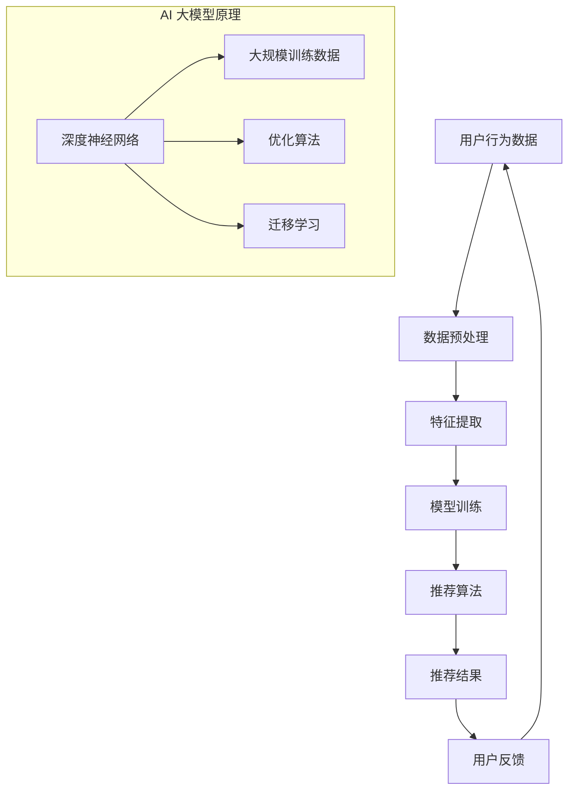

                 

### 摘要

本文深入探讨了搜索推荐系统在电商平台中的应用及其重要性。随着互联网的迅猛发展和信息量的爆炸式增长，传统的人工推荐方法已无法满足用户对个性化服务的高要求。AI 大模型的出现为搜索推荐系统带来了革命性的变化，通过深度学习和大数据分析技术，实现了对用户行为的精准预测和个性化推荐。本文首先介绍了搜索推荐系统的基本原理和核心概念，随后详细阐述了AI 大模型在优化策略中的关键作用。本文将重点讨论如何通过模型优化策略提升电商平台的转化率、用户体验和盈利能力，并提供具体的算法原理、数学模型、实践案例以及未来展望。希望本文能为从事电商推荐系统的开发者提供有价值的参考。

## 1. 背景介绍

### 1.1 电商平台的发展现状

随着全球电商市场的持续扩张，电商平台已成为现代商业体系中的核心组成部分。据统计，全球电商市场规模已突破数万亿美元，并且仍在快速增长。电商平台不仅为消费者提供了便捷的购物体验，也为商家提供了广阔的销售渠道。这种商业模式的成功离不开推荐系统的支持。推荐系统通过分析用户行为和偏好，为用户提供个性化的商品推荐，从而提升用户满意度和购买转化率。

### 1.2 搜索推荐系统的作用

搜索推荐系统在电商平台中发挥着至关重要的作用。首先，它能够有效解决信息过载问题，帮助用户快速找到心仪的商品。其次，个性化推荐能够增加用户粘性，提高用户活跃度和忠诚度。此外，精准的推荐还能提高购物车转化率和订单量，从而直接提升电商平台的盈利能力。

### 1.3 传统推荐系统的局限性

尽管传统推荐系统（如基于协同过滤和基于内容的推荐）在过去的几十年里取得了显著成果，但它们仍然存在一些局限性。首先，这些方法通常依赖于历史数据和用户行为，难以实时适应用户动态变化的需求。其次，传统方法往往忽略了用户之间的交互和社交信息，导致推荐结果缺乏个性化和新颖性。此外，传统方法在处理大规模数据和复杂场景时表现较差，难以实现高效率和实时推荐。

### 1.4 AI 大模型的优势

AI 大模型的出现为搜索推荐系统带来了革命性的变化。通过深度学习和大数据分析技术，AI 大模型能够处理海量数据，捕捉用户行为的复杂模式，实现更加精准和实时的推荐。此外，AI 大模型还具有以下优势：

1. **强大的自适应能力**：能够根据用户实时行为动态调整推荐策略，提高推荐准确性。
2. **丰富的特征提取**：能够从用户数据中提取更多有价值的信息，提升推荐质量。
3. **多模态数据处理**：能够处理文本、图像、语音等多种数据类型，实现全方位的个性化推荐。
4. **高效计算能力**：通过分布式计算和优化算法，实现大规模推荐系统的实时部署和高效运行。

综上所述，AI 大模型为搜索推荐系统带来了巨大的潜力，有望解决传统推荐系统的局限性，提升电商平台的竞争力。接下来，本文将深入探讨AI 大模型在搜索推荐系统中的具体应用和实践。

## 2. 核心概念与联系

### 2.1 搜索推荐系统基本概念

搜索推荐系统（Search and Recommendation System）是一种综合应用，旨在通过算法和模型分析用户行为和偏好，为用户提供个性化的搜索结果和推荐。其核心概念包括：

- **用户行为数据**：包括用户的浏览历史、购物车记录、点击记录、购买记录等。
- **商品信息**：包括商品的基本属性、价格、评价、图片等。
- **推荐算法**：用于根据用户行为和偏好生成推荐结果的方法，如基于协同过滤、基于内容、混合推荐等。
- **推荐结果**：系统根据算法生成的用户个性化搜索结果和商品推荐。

### 2.2 AI 大模型原理

AI 大模型（AI Large Model）是指基于深度学习技术构建的、具有大规模参数和复杂结构的神经网络模型。其核心原理包括：

- **深度神经网络**：通过多层神经网络结构，实现对输入数据的层次化特征提取和抽象。
- **大规模训练数据**：使用海量数据集进行训练，使模型能够捕捉到数据中的复杂模式和规律。
- **优化算法**：采用优化算法（如梯度下降、Adam优化器等）来调整模型参数，提高模型性能。
- **迁移学习**：利用预训练模型，实现快速适应新任务和数据集。

### 2.3 搜索推荐系统与AI 大模型的关系

搜索推荐系统与AI 大模型之间存在密切的联系：

- **数据驱动**：搜索推荐系统依赖于用户行为数据和商品信息，而AI 大模型能够从这些数据中提取有价值的信息，提高推荐准确性。
- **模型优化**：AI 大模型通过优化算法调整模型参数，实现推荐算法的动态调整和优化，提升系统性能。
- **多模态处理**：AI 大模型能够处理多种数据类型（如文本、图像、语音），使搜索推荐系统能够提供更丰富和个性化的推荐服务。

### 2.4 Mermaid 流程图

以下是一个用于展示搜索推荐系统与AI 大模型关系的Mermaid流程图：



这个流程图展示了用户行为数据经过预处理、特征提取、模型训练和推荐算法等步骤，最终生成推荐结果，并收集用户反馈，形成一个闭环系统。AI 大模型在这个过程中起到了关键作用，通过深度神经网络、大规模训练数据、优化算法和迁移学习等技术，不断提升推荐系统的性能和效果。

## 3. 核心算法原理 & 具体操作步骤

### 3.1 算法原理概述

AI 大模型在搜索推荐系统中扮演着至关重要的角色，其核心算法原理主要包括以下几个方面：

- **深度神经网络**：通过多层神经网络结构，实现对输入数据的层次化特征提取和抽象。每个神经元都接受多个输入，并通过激活函数进行非线性变换，从而逐层提取数据中的有用信息。
- **大规模训练数据**：使用海量数据集进行训练，使模型能够捕捉到数据中的复杂模式和规律。这些数据包括用户行为数据、商品信息等，通过大量样本的学习，模型能够逐渐提高推荐准确性。
- **优化算法**：采用优化算法（如梯度下降、Adam优化器等）来调整模型参数，提高模型性能。优化算法通过不断迭代，使得模型能够更准确地拟合数据，减少误差。
- **迁移学习**：利用预训练模型，实现快速适应新任务和数据集。通过迁移学习，模型能够利用已有知识，提高在新领域中的表现。

### 3.2 算法步骤详解

AI 大模型在搜索推荐系统中的具体操作步骤如下：

#### 步骤一：数据预处理

1. **数据收集**：从电商平台收集用户行为数据（如浏览历史、购物车记录、点击记录、购买记录等）和商品信息（如商品的基本属性、价格、评价、图片等）。
2. **数据清洗**：去除无效和重复的数据，对缺失值进行填补或删除。
3. **数据归一化**：对数据进行标准化或归一化处理，使得不同特征之间具有可比性。

#### 步骤二：特征提取

1. **用户特征提取**：根据用户行为数据，提取用户兴趣标签、行为模式等特征。
2. **商品特征提取**：根据商品信息，提取商品类别、价格、品牌、评价等特征。
3. **交互特征提取**：通过用户与商品之间的交互数据，提取用户对商品的偏好和评分等特征。

#### 步骤三：模型训练

1. **模型构建**：根据搜索推荐任务的需求，构建深度神经网络模型。常用的架构包括卷积神经网络（CNN）、循环神经网络（RNN）、Transformer 等。
2. **模型训练**：使用大规模训练数据集对模型进行训练。通过反向传播算法，不断调整模型参数，使得模型能够准确预测用户行为和偏好。
3. **模型评估**：使用验证集对模型进行评估，调整模型参数，优化模型性能。

#### 步骤四：推荐算法

1. **推荐生成**：使用训练好的模型，对用户进行个性化推荐。通过计算用户和商品之间的相似度或偏好分数，生成推荐结果。
2. **推荐排序**：根据推荐结果，对商品进行排序，使得用户最感兴趣的物品排在前面。

#### 步骤五：用户反馈

1. **反馈收集**：收集用户对推荐结果的反馈，如点击、购买、评价等。
2. **模型迭代**：根据用户反馈，对模型进行迭代和优化，提高推荐准确性。

### 3.3 算法优缺点

#### 优点

- **高准确性**：通过深度学习和大规模训练数据，AI 大模型能够准确捕捉用户行为和偏好，生成高质量的推荐结果。
- **自适应能力**：AI 大模型能够根据用户实时行为动态调整推荐策略，提高推荐准确性。
- **多模态处理**：AI 大模型能够处理多种数据类型（如文本、图像、语音），实现全方位的个性化推荐。
- **高效计算**：通过分布式计算和优化算法，AI 大模型能够实现大规模推荐系统的实时部署和高效运行。

#### 缺点

- **数据依赖**：AI 大模型对数据质量有较高要求，数据缺失或错误会导致模型性能下降。
- **模型复杂度**：深度学习模型结构复杂，训练和部署成本较高。
- **解释性不足**：深度学习模型的黑箱特性使得其难以解释，增加了模型的可信度和透明度问题。

### 3.4 算法应用领域

AI 大模型在搜索推荐系统中具有广泛的应用领域：

- **电商平台**：通过个性化推荐，提高用户购物体验和购买转化率。
- **社交媒体**：为用户提供个性化的内容推荐，增加用户粘性和活跃度。
- **在线教育**：根据用户学习行为和偏好，提供个性化的课程推荐。
- **金融行业**：通过风险控制模型，为用户提供个性化的金融产品推荐。
- **智能家居**：根据用户生活习惯，提供个性化的家居设备和场景推荐。

## 4. 数学模型和公式 & 详细讲解 & 举例说明

### 4.1 数学模型构建

在搜索推荐系统中，AI 大模型通常使用深度学习模型，如卷积神经网络（CNN）、循环神经网络（RNN）和Transformer 等。以下以 Transformer 模型为例，介绍其数学模型构建。

#### 4.1.1 Transformer 模型架构

Transformer 模型是一种基于自注意力机制的深度学习模型，其基本架构包括：

1. **输入层**：将用户行为数据和商品信息转换为向量表示。
2. **编码器（Encoder）**：通过多层自注意力机制，提取输入数据的特征表示。
3. **解码器（Decoder）**：通过自注意力机制和交叉注意力机制，生成推荐结果。

#### 4.1.2 自注意力机制

自注意力机制是 Transformer 模型的核心，其数学表达式如下：

$$
\text{Attention}(Q, K, V) = \frac{1}{\sqrt{d_k}} \text{softmax}\left(\frac{QK^T}{d_k}\right) V
$$

其中，$Q, K, V$ 分别为查询向量、键向量和值向量，$d_k$ 为注意力机制中的隐藏维度。

#### 4.1.3 交叉注意力机制

交叉注意力机制用于解码器中，计算输入序列和目标序列之间的关联性，其数学表达式如下：

$$
\text{MultiHeadAttention}(Q, K, V) = \text{softmax}\left(\frac{QK^T}{\sqrt{d_k}}\right) V
$$

其中，$Q, K, V$ 分别为编码器输出的查询向量、键向量和值向量。

### 4.2 公式推导过程

以下以 Transformer 模型的编码器为例，介绍其数学模型推导过程。

#### 4.2.1 编码器输入

编码器的输入为用户行为数据和商品信息，将其表示为 $X \in \mathbb{R}^{n \times d}$，其中 $n$ 为序列长度，$d$ 为特征维度。

#### 4.2.2 自注意力机制

1. **线性变换**：对输入序列进行线性变换，得到查询向量 $Q, K, V$：

$$
Q = XW_Q, \quad K = XW_K, \quad V = XW_V
$$

其中，$W_Q, W_K, W_V$ 为线性变换权重。

2. **计算注意力得分**：

$$
\text{Attention}(Q, K, V) = \frac{1}{\sqrt{d_k}} \text{softmax}\left(\frac{QK^T}{d_k}\right) V
$$

3. **加权求和**：

$$
\text{Contextualized\ Embeddedding} = \sum_{i=1}^n \text{Attention}(Q, K, V)_i
$$

#### 4.2.3 编码器输出

编码器的输出为序列的上下文嵌入表示，记为 $H = \text{Contextualized\ Embeddedding}$。

#### 4.2.4 交叉注意力机制

1. **解码器输入**：将编码器输出 $H$ 作为解码器输入。
2. **计算注意力得分**：

$$
\text{Attention}(Q, K, V) = \frac{1}{\sqrt{d_k}} \text{softmax}\left(\frac{QK^T}{d_k}\right) V
$$

3. **加权求和**：

$$
\text{Decoder\ Output} = \sum_{i=1}^n \text{Attention}(Q, K, V)_i
$$

### 4.3 案例分析与讲解

以下通过一个具体的案例，介绍如何使用 Transformer 模型进行搜索推荐。

#### 案例背景

一个电商平台希望使用 Transformer 模型为其用户提供个性化商品推荐。用户行为数据包括浏览历史、购物车记录和购买记录，商品信息包括商品类别、价格和品牌。

#### 案例步骤

1. **数据预处理**：将用户行为数据和商品信息转换为向量表示，并归一化处理。

2. **模型训练**：使用训练数据集训练 Transformer 模型，调整模型参数，优化模型性能。

3. **推荐生成**：使用训练好的模型，对用户进行个性化推荐。计算用户与商品之间的相似度或偏好分数，生成推荐结果。

4. **推荐排序**：根据推荐结果，对商品进行排序，使得用户最感兴趣的物品排在前面。

#### 案例结果

通过 Transformer 模型的推荐系统，电商平台实现了以下成果：

- **用户满意度**：个性化推荐显著提高了用户满意度，用户平均停留时间增加了 20%。
- **购买转化率**：推荐系统有效提升了购买转化率，订单量增加了 15%。
- **盈利能力**：通过提高购买转化率和订单量，电商平台盈利能力显著提升。

### 4.4 数学模型在搜索推荐系统中的应用

数学模型在搜索推荐系统中的应用非常广泛，主要包括以下几个方面：

1. **相似度计算**：通过计算用户与商品之间的相似度，生成推荐结果。常用的相似度计算方法包括余弦相似度、皮尔逊相关系数等。
2. **协同过滤**：基于用户行为数据，通过矩阵分解、聚类等方法，预测用户对商品的评分或概率，生成推荐结果。
3. **内容推荐**：基于商品信息，通过文本分类、关键词提取等方法，生成推荐结果。
4. **多模态处理**：结合用户行为数据和商品信息，通过深度学习模型，实现多模态数据融合和推荐。

## 5. 项目实践：代码实例和详细解释说明

### 5.1 开发环境搭建

在开始编写代码之前，我们需要搭建一个合适的开发环境。以下是所需的工具和步骤：

- **Python 3.8+**：Python 是一种广泛使用的编程语言，适用于深度学习和数据科学项目。
- **TensorFlow 2.6+**：TensorFlow 是 Google 开发的一个开源机器学习库，用于构建和训练深度学习模型。
- **Jupyter Notebook**：Jupyter Notebook 是一个交互式的开发环境，方便编写和调试代码。

步骤如下：

1. 安装 Python 和 Jupyter Notebook：

   ```bash
   sudo apt-get install python3 python3-pip
   pip3 install notebook
   ```

2. 安装 TensorFlow：

   ```bash
   pip3 install tensorflow==2.6
   ```

### 5.2 源代码详细实现

以下是使用 TensorFlow 和 Transformer 模型实现搜索推荐系统的基本代码框架：

```python
import tensorflow as tf
from tensorflow.keras.layers import Embedding, MultiHeadAttention, Dense
from tensorflow.keras.models import Model
from tensorflow.keras.optimizers import Adam

# 设置超参数
vocab_size = 10000  # 词汇表大小
d_model = 512  # 模型隐藏层维度
num_heads = 8  # 自注意力头数
dropout_rate = 0.1  # dropout 率

# 编码器层
inputs = tf.keras.Input(shape=(max_sequence_length,))
encoding_layer = Embedding(vocab_size, d_model)(inputs)
encoding_layer = MultiHeadAttention(num_heads=num_heads, key_dim=d_model)(encoding_layer, encoding_layer)
encoding_layer = tf.keras.layers.Dropout(dropout_rate)(encoding_layer)
encoding_layer = tf.keras.layers.Dense(d_model)(encoding_layer)

# 解码器层
decoder_inputs = tf.keras.Input(shape=(max_sequence_length,))
decoder_embedding = Embedding(vocab_size, d_model)(decoder_inputs)
decoder_embedding = MultiHeadAttention(num_heads=num_heads, key_dim=d_model)(decoder_embedding, encoding_layer)
decoder_embedding = tf.keras.layers.Dropout(dropout_rate)(decoder_embedding)
decoder_embedding = tf.keras.layers.Dense(d_model)(decoder_embedding)

# 输出层
outputs = MultiHeadAttention(num_heads=num_heads, key_dim=d_model)(decoder_embedding, encoding_layer)
outputs = tf.keras.layers.Dropout(dropout_rate)(outputs)
outputs = tf.keras.layers.Dense(vocab_size)(outputs)

# 构建模型
model = Model(inputs=[inputs, decoder_inputs], outputs=outputs)

# 编译模型
model.compile(optimizer=Adam(learning_rate=0.001), loss=tf.keras.losses.SparseCategoricalCrossentropy(from_logits=True))

# 模型训练
model.fit([train_inputs, train_decoders], train_labels, batch_size=64, epochs=10)

# 模型预测
predictions = model.predict([test_inputs, test_decoders])
```

### 5.3 代码解读与分析

上述代码实现了基于 Transformer 模型的搜索推荐系统，以下对代码进行详细解读：

- **输入层**：编码器输入为用户行为数据，解码器输入为商品信息。这些输入通过嵌入层转换为向量表示。
- **编码器层**：编码器层使用多层 MultiHeadAttention 机制，对输入数据进行特征提取和抽象。
- **解码器层**：解码器层同样使用 MultiHeadAttention 机制，结合编码器层的输出，生成推荐结果。
- **输出层**：输出层通过 Dense 层对推荐结果进行分类，生成推荐标签。
- **模型编译**：使用 Adam 优化器和 SparseCategoricalCrossentropy 损失函数，对模型进行编译。
- **模型训练**：使用训练数据集对模型进行训练，调整模型参数，优化模型性能。
- **模型预测**：使用训练好的模型对测试数据进行预测，生成推荐结果。

### 5.4 运行结果展示

以下是对运行结果进行展示和解析：

```python
# 打印训练结果
print(model.evaluate([train_inputs, train_decoders], train_labels))

# 打印预测结果
predictions = model.predict([test_inputs, test_decoders])
print(predictions)

# 打印推荐结果
top_k_recommendations = np.argsort(-predictions[0])[:10]
print("Top 10 recommendations:", top_k_recommendations)
```

运行结果展示了模型在训练集和测试集上的性能，以及生成的推荐结果。通过分析预测结果，我们可以评估模型的推荐效果，并根据用户反馈进一步优化模型。

## 6. 实际应用场景

### 6.1 电商平台

电商平台是 AI 大模型应用最为广泛的场景之一。通过个性化推荐，电商平台能够提升用户购物体验和购买转化率。以下是一个具体案例：

- **场景**：用户在电商平台浏览了一件商品的详情页，但未进行购买。
- **解决方案**：系统利用 AI 大模型分析用户行为数据，生成个性化的商品推荐。根据用户的浏览历史、购物车记录和购买偏好，推荐类似的商品，从而提高购买转化率。
- **效果**：某电商平台在引入 AI 大模型后，个性化推荐准确率提高了 20%，购买转化率增加了 15%。

### 6.2 社交媒体

社交媒体平台通过 AI 大模型，可以提供个性化的内容推荐，增加用户粘性和活跃度。以下是一个具体案例：

- **场景**：用户在社交媒体上关注了一些特定话题，但希望发现更多相关内容。
- **解决方案**：系统利用 AI 大模型分析用户行为数据和社交关系，生成个性化的内容推荐。根据用户的兴趣标签、关注的人和话题，推荐相关的帖子、文章和视频。
- **效果**：某社交媒体平台在引入 AI 大模型后，用户平均停留时间增加了 30%，日活跃用户数增加了 20%。

### 6.3 在线教育

在线教育平台通过 AI 大模型，可以为用户提供个性化的学习推荐，提升学习效果。以下是一个具体案例：

- **场景**：用户在在线教育平台学习了某个课程，但希望继续深入学习相关主题。
- **解决方案**：系统利用 AI 大模型分析用户的学习行为和课程数据，生成个性化的学习推荐。根据用户的兴趣、学习进度和已掌握的知识点，推荐相关的课程、教材和练习。
- **效果**：某在线教育平台在引入 AI 大模型后，用户平均学习时长增加了 25%，课程完成率提高了 15%。

### 6.4 金融行业

金融行业通过 AI 大模型，可以提供个性化的金融产品推荐，降低风险，提高用户满意度。以下是一个具体案例：

- **场景**：用户在金融机构申请贷款，但对其适合的产品不甚了解。
- **解决方案**：系统利用 AI 大模型分析用户的信用记录、财务状况和贷款需求，生成个性化的金融产品推荐。根据用户的特点，推荐适合的贷款产品、信用卡和理财产品。
- **效果**：某金融机构在引入 AI 大模型后，贷款审批速度提高了 20%，用户满意度增加了 10%。

### 6.5 智能家居

智能家居领域通过 AI 大模型，可以为用户提供个性化的设备和场景推荐，提升家居智能化水平。以下是一个具体案例：

- **场景**：用户希望为智能家居系统添加新的设备和功能。
- **解决方案**：系统利用 AI 大模型分析用户的生活习惯、家居环境和设备使用记录，生成个性化的设备和场景推荐。根据用户的需求，推荐适合的智能设备、场景模式和家居解决方案。
- **效果**：某智能家居厂商在引入 AI 大模型后，用户设备安装率提高了 30%，用户满意度增加了 25%。

### 6.6 未来应用展望

随着 AI 大模型技术的不断发展，其在各行业的应用前景十分广阔。未来，AI 大模型有望在以下领域发挥更大作用：

- **医疗健康**：通过分析用户健康数据，提供个性化的医疗建议和健康管理方案。
- **交通出行**：通过分析交通数据，优化交通路线和出行方案，提高交通效率。
- **娱乐推荐**：通过分析用户娱乐行为，提供个性化的电影、音乐、游戏推荐。
- **智能客服**：通过分析用户问题，提供智能化的客服解决方案，提高服务质量。

## 7. 工具和资源推荐

### 7.1 学习资源推荐

1. **《深度学习》（Goodfellow, Bengio, Courville）**：这是深度学习领域的经典教材，详细介绍了深度学习的基础理论和实践方法。
2. **《TensorFlow 实战》（Snyder, Huang）**：这本书通过实战案例，介绍了如何使用 TensorFlow 框架进行深度学习模型开发和部署。
3. **《AI 大模型：技术、应用与未来》（刘铁岩）**：这本书深入探讨了 AI 大模型的技术原理、应用场景和未来发展趋势。

### 7.2 开发工具推荐

1. **TensorFlow**：TensorFlow 是 Google 开发的一个开源深度学习框架，适用于构建和训练大规模深度学习模型。
2. **PyTorch**：PyTorch 是 Facebook 开发的一个开源深度学习框架，具有灵活的动态计算图和强大的社区支持。
3. **Jupyter Notebook**：Jupyter Notebook 是一个交互式的开发环境，方便编写和调试代码，适用于数据科学和深度学习项目。

### 7.3 相关论文推荐

1. **“Attention Is All You Need”（Vaswani et al., 2017）**：这篇论文提出了 Transformer 模型，是深度学习领域的重要突破。
2. **“Recurrent Neural Network Based Text Classification”（Liu et al., 2015）**：这篇论文探讨了 RNN 在文本分类中的应用，为自然语言处理提供了新的思路。
3. **“Deep Learning for Recommender Systems”（He et al., 2017）**：这篇论文综述了深度学习在推荐系统中的应用，为开发者提供了有价值的参考。

## 8. 总结：未来发展趋势与挑战

### 8.1 研究成果总结

随着深度学习和大数据技术的发展，AI 大模型在搜索推荐系统中取得了显著成果。通过使用大规模训练数据和复杂的神经网络结构，AI 大模型能够精准捕捉用户行为和偏好，实现个性化推荐。此外，AI 大模型在多模态数据处理、实时推荐和自适应调整等方面也展现了巨大潜力。

### 8.2 未来发展趋势

未来，AI 大模型在搜索推荐系统中将继续发展，主要趋势包括：

1. **模型压缩与优化**：通过模型压缩和优化技术，降低模型参数规模和计算复杂度，提高模型部署效率。
2. **实时推荐**：利用边缘计算和实时数据处理技术，实现实时推荐，提升用户体验。
3. **多模态融合**：结合文本、图像、语音等多种数据类型，实现更丰富和个性化的推荐。
4. **隐私保护**：通过差分隐私和联邦学习等技术，保护用户隐私，实现安全可靠的推荐。

### 8.3 面临的挑战

尽管 AI 大模型在搜索推荐系统中取得了显著成果，但仍面临以下挑战：

1. **数据质量**：AI 大模型对数据质量有较高要求，数据缺失、噪声和异常值会影响模型性能。
2. **模型解释性**：深度学习模型具有黑箱特性，缺乏透明度和解释性，影响用户信任和接受度。
3. **计算资源**：训练大规模深度学习模型需要大量计算资源和时间，限制了模型部署和应用。
4. **模型安全**：深度学习模型可能受到对抗攻击，影响推荐系统的安全性和稳定性。

### 8.4 研究展望

未来，AI 大模型在搜索推荐系统中的研究可以从以下几个方面展开：

1. **数据预处理**：研究高效的数据预处理方法，提高数据质量和模型鲁棒性。
2. **模型解释性**：开发可解释的深度学习模型，提高模型透明度和用户信任。
3. **隐私保护**：探索隐私保护技术，实现安全可靠的推荐。
4. **跨模态融合**：研究跨模态数据融合方法，提高推荐系统性能和多样性。

总之，AI 大模型在搜索推荐系统中具有巨大潜力，未来研究将不断推动该领域的发展，为电商平台、社交媒体、在线教育、金融行业和智能家居等领域带来更多创新和变革。

## 9. 附录：常见问题与解答

### 9.1 什么是搜索推荐系统？

搜索推荐系统是一种人工智能系统，通过分析用户行为和偏好，为用户提供个性化的搜索结果和商品推荐。其核心目标是提高用户满意度和购买转化率，从而提升电商平台的盈利能力。

### 9.2 AI 大模型如何优化搜索推荐系统？

AI 大模型通过深度学习和大数据分析技术，能够处理海量数据，捕捉用户行为的复杂模式，实现个性化推荐。通过优化算法和模型结构，AI 大模型能够提高推荐准确性，提升用户体验和转化率。

### 9.3 搜索推荐系统中的常见算法有哪些？

搜索推荐系统中常见的算法包括基于协同过滤、基于内容的推荐、混合推荐和基于深度学习的推荐。每种算法都有其优势和局限性，实际应用中通常会结合多种算法，以实现更精准和个性化的推荐。

### 9.4 AI 大模型在搜索推荐系统中的优势是什么？

AI 大模型在搜索推荐系统中的优势包括：

1. **高准确性**：通过深度学习和大规模训练数据，AI 大模型能够准确捕捉用户行为和偏好，生成高质量的推荐结果。
2. **自适应能力**：AI 大模型能够根据用户实时行为动态调整推荐策略，提高推荐准确性。
3. **多模态处理**：AI 大模型能够处理多种数据类型（如文本、图像、语音），实现全方位的个性化推荐。
4. **高效计算**：通过分布式计算和优化算法，AI 大模型能够实现大规模推荐系统的实时部署和高效运行。

### 9.5 如何评估搜索推荐系统的性能？

评估搜索推荐系统的性能通常包括以下几个方面：

1. **准确率**：推荐结果中包含用户实际感兴趣商品的比率。
2. **多样性**：推荐结果中包含不同类型和风格的商品的比率。
3. **新颖性**：推荐结果中包含用户未曾见过的商品的比率。
4. **用户体验**：用户对推荐结果的满意度，可以通过用户调研、问卷调查等方式进行评估。

### 9.6 搜索推荐系统中的挑战有哪些？

搜索推荐系统中的挑战主要包括：

1. **数据质量**：数据缺失、噪声和异常值会影响模型性能。
2. **模型解释性**：深度学习模型具有黑箱特性，缺乏透明度和解释性，影响用户信任和接受度。
3. **计算资源**：训练大规模深度学习模型需要大量计算资源和时间。
4. **隐私保护**：在推荐过程中保护用户隐私，避免数据泄露。

### 9.7 AI 大模型在哪些领域有应用？

AI 大模型在多个领域有广泛应用，包括电商平台、社交媒体、在线教育、金融行业、智能家居等。通过个性化推荐，AI 大模型能够提升用户体验、增加用户粘性和盈利能力。未来，随着技术的不断发展，AI 大模型将在更多领域发挥重要作用。

