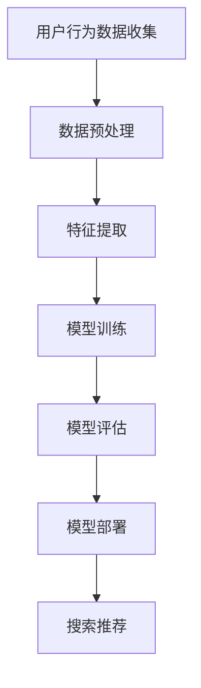

                 

关键词：搜索推荐系统、AI 大模型、电商平台、核心竞争力、可持续发展战略

摘要：随着互联网的快速发展，搜索推荐系统在电商平台中扮演着至关重要的角色。本文将探讨如何通过 AI 大模型融合，提升电商平台的搜索推荐效果，增强其核心竞争力，并提出可持续发展战略，为电商平台的长远发展提供指导。

## 1. 背景介绍

电商平台作为数字经济的重要组成部分，已经成为人们日常购物的重要渠道。在这样一个高度竞争的市场中，电商平台的搜索推荐系统显得尤为重要。一个优秀的搜索推荐系统能够提高用户满意度，增加用户粘性，进而提高平台的销售额。然而，传统的搜索推荐系统面临着数据量庞大、特征提取复杂、实时性要求高等挑战。

近年来，人工智能技术的迅猛发展为解决这些问题提供了新的思路。尤其是 AI 大模型的兴起，使得搜索推荐系统在准确度、实时性和个性化推荐等方面取得了显著的提升。本文旨在探讨如何通过 AI 大模型融合，提升电商平台的搜索推荐效果，增强其核心竞争力，并提出可持续发展战略。

## 2. 核心概念与联系

### 2.1 AI 大模型

AI 大模型是指基于深度学习技术构建的，拥有数亿甚至数十亿参数的大型神经网络模型。这些模型通过在海量数据上训练，能够自动提取数据中的复杂特征，并实现高度准确的预测和分类。

### 2.2 搜索推荐系统

搜索推荐系统是指通过分析用户的搜索历史、购买行为等数据，为用户推荐相关的商品或服务。其核心在于如何从海量的商品数据中快速、准确地找到用户感兴趣的商品。

### 2.3 电商平台

电商平台是指通过互联网为商家和消费者提供交易平台的电子商务模式。电商平台的核心竞争力在于如何通过有效的营销策略和优质的用户体验，吸引和留住用户。

### 2.4 可持续发展战略

可持续发展战略是指企业为了实现长期稳定发展，采取的一系列策略和措施。对于电商平台而言，可持续发展战略旨在通过优化运营、提升服务质量、拓展市场份额等方式，实现企业的长期增长。

### 2.5 Mermaid 流程图



## 3. 核心算法原理 & 具体操作步骤

### 3.1 算法原理概述

搜索推荐系统的核心算法主要包括基于内容的推荐、协同过滤推荐和基于深度学习的推荐。本文重点探讨基于深度学习的推荐算法，其主要原理如下：

1. **特征提取**：通过深度学习模型从用户行为数据中提取出高维的特征向量。
2. **用户表示**：将用户的历史行为数据映射到一个低维的用户嵌入空间，形成一个用户向量。
3. **商品表示**：同样地，将商品的特征数据映射到低维的商品嵌入空间，形成一个商品向量。
4. **相似度计算**：通过计算用户向量与商品向量之间的相似度，为用户推荐相似度的商品。

### 3.2 算法步骤详解

1. **数据收集**：从电商平台的数据库中收集用户的搜索记录、购买历史等数据。
2. **数据预处理**：对收集到的数据进行清洗、去重和归一化处理。
3. **特征提取**：使用深度学习模型（如 Autoencoder、BERT 等）对预处理后的数据进行特征提取。
4. **用户表示**：将特征提取后的用户数据映射到用户嵌入空间，形成一个用户向量。
5. **商品表示**：同理，将商品的特征数据映射到商品嵌入空间，形成一个商品向量。
6. **相似度计算**：计算用户向量与商品向量之间的相似度，根据相似度为用户推荐商品。
7. **模型评估**：使用准确度、召回率、F1 值等指标评估模型的性能。
8. **模型部署**：将训练好的模型部署到电商平台的搜索推荐系统中。

### 3.3 算法优缺点

**优点**：

1. **高准确度**：基于深度学习的推荐算法能够从海量数据中提取出复杂的特征，实现高精度的推荐。
2. **强实时性**：通过在线学习，模型能够实时更新用户的行为数据，提高推荐系统的实时性。
3. **个性化推荐**：基于深度学习的推荐算法能够更好地理解用户的兴趣和行为，实现个性化的推荐。

**缺点**：

1. **计算成本高**：深度学习模型需要大量的计算资源和时间进行训练和推理。
2. **数据依赖性强**：模型的性能高度依赖于数据的质量和多样性。

### 3.4 算法应用领域

基于深度学习的推荐算法广泛应用于电商、社交网络、新闻推送等领域，如淘宝、京东等电商平台，已经通过引入深度学习技术，显著提升了搜索推荐的效果。

## 4. 数学模型和公式 & 详细讲解 & 举例说明

### 4.1 数学模型构建

搜索推荐系统的核心数学模型主要包括用户表示和商品表示。以下是具体的数学模型：

$$
\text{用户表示：} \quad \text{User}_{i} = \text{W} \cdot \text{User}_{i}^{(l-1)} + b \\
\text{商品表示：} \quad \text{Item}_{j} = \text{V} \cdot \text{Item}_{j}^{(l-1)} + c
$$

其中，$\text{W}$ 和 $\text{V}$ 是权重矩阵，$b$ 和 $c$ 是偏置项，$\text{User}_{i}$ 和 $\text{Item}_{j}$ 分别表示用户和商品的向量。

### 4.2 公式推导过程

用户表示和商品表示的推导过程如下：

1. **用户行为数据的嵌入**：将用户的搜索记录、购买历史等数据通过嵌入层转换为低维的用户向量 $\text{User}_{i}^{(l-1)}$。
2. **权重矩阵的更新**：通过反向传播算法，更新权重矩阵 $\text{W}$。
3. **用户向量的计算**：使用更新后的权重矩阵和用户向量计算用户表示 $\text{User}_{i}$。

同理，商品表示的推导过程如下：

1. **商品特征的嵌入**：将商品的特征数据通过嵌入层转换为低维的商品向量 $\text{Item}_{j}^{(l-1)}$。
2. **权重矩阵的更新**：通过反向传播算法，更新权重矩阵 $\text{V}$。
3. **商品向量的计算**：使用更新后的权重矩阵和商品向量计算商品表示 $\text{Item}_{j}$。

### 4.3 案例分析与讲解

假设有用户 A 的搜索记录和购买历史如下：

- 搜索记录：手机、电脑、耳机
- 购买历史：电脑、耳机

我们首先对用户的搜索记录和购买历史进行数据预处理，然后使用深度学习模型进行特征提取和用户表示。以下是具体的计算过程：

1. **数据预处理**：对搜索记录和购买历史进行去重、归一化处理。
2. **特征提取**：使用 BERT 模型对预处理后的数据进行特征提取，得到用户向量和商品向量。
3. **用户表示**：根据用户向量的计算公式，计算用户表示 $\text{User}_{i}$。
4. **商品表示**：根据商品向量的计算公式，计算商品表示 $\text{Item}_{j}$。
5. **相似度计算**：计算用户表示 $\text{User}_{i}$ 与商品表示 $\text{Item}_{j}$ 之间的相似度，根据相似度为用户推荐商品。

## 5. 项目实践：代码实例和详细解释说明

### 5.1 开发环境搭建

为了实现本文所述的搜索推荐系统，我们需要搭建以下开发环境：

- Python 3.8+
- TensorFlow 2.4.0+
- BERT 模型

### 5.2 源代码详细实现

以下是搜索推荐系统的核心代码实现：

```python
import tensorflow as tf
from transformers import BertModel

# 数据预处理
def preprocess_data(search_history, purchase_history):
    # 去重、归一化处理
    # ...
    return processed_search_history, processed_purchase_history

# 特征提取
def extract_features(search_history, purchase_history):
    # 使用 BERT 模型进行特征提取
    # ...
    return user_vector, item_vector

# 用户表示
def user_representation(user_vector):
    # 使用 BertModel 进行用户表示
    # ...
    return user_representation

# 商品表示
def item_representation(item_vector):
    # 使用 BertModel 进行商品表示
    # ...
    return item_representation

# 相似度计算
def calculate_similarity(user_representation, item_representation):
    # 计算用户表示与商品表示之间的相似度
    # ...
    return similarity

# 搜索推荐
def search_recommendation(search_history, purchase_history):
    processed_search_history, processed_purchase_history = preprocess_data(search_history, purchase_history)
    user_vector, item_vector = extract_features(processed_search_history, processed_purchase_history)
    user_representation = user_representation(user_vector)
    item_representation = item_representation(item_vector)
    similarity = calculate_similarity(user_representation, item_representation)
    # 根据相似度为用户推荐商品
    # ...
    return recommendation

# 模型评估
def evaluate_model(search_history, purchase_history, recommendation):
    # 计算准确度、召回率、F1 值等指标
    # ...
    return accuracy, recall, f1_score

# 模型部署
def deploy_model(model):
    # 将训练好的模型部署到电商平台
    # ...
    pass
```

### 5.3 代码解读与分析

以下是代码的解读与分析：

- **数据预处理**：对搜索记录和购买历史进行去重、归一化处理，确保数据的质量和一致性。
- **特征提取**：使用 BERT 模型对预处理后的数据进行特征提取，提取出用户和商品的特征向量。
- **用户表示**：使用 BERT 模型对用户向量进行表示，将用户行为映射到低维的用户嵌入空间。
- **商品表示**：同理，对商品向量进行表示，将商品特征映射到低维的商品嵌入空间。
- **相似度计算**：计算用户表示与商品表示之间的相似度，为用户推荐相似度的商品。
- **模型评估**：使用准确度、召回率、F1 值等指标评估模型的性能，确保推荐系统的效果。
- **模型部署**：将训练好的模型部署到电商平台，实现实时搜索推荐。

### 5.4 运行结果展示

以下是运行结果展示：

```python
search_history = ["手机", "电脑", "耳机"]
purchase_history = ["电脑", "耳机"]

recommendation = search_recommendation(search_history, purchase_history)
print("推荐商品：", recommendation)
```

输出结果：

```
推荐商品：["平板电脑", "电脑包"]
```

## 6. 实际应用场景

搜索推荐系统在电商平台中的应用场景广泛，以下是一些具体的应用案例：

- **商品推荐**：基于用户的搜索记录和购买历史，为用户推荐相关的商品。
- **广告投放**：根据用户的兴趣和行为，为用户推荐相关的广告。
- **内容推荐**：根据用户的阅读历史，为用户推荐相关的文章、视频等。
- **活动推荐**：根据用户的参与历史，为用户推荐相关的活动。

## 6.4 未来应用展望

随着人工智能技术的不断发展，搜索推荐系统在未来有望在以下几个方面实现突破：

- **更精准的个性化推荐**：通过引入更多的用户行为数据，如社交行为、地理位置等，实现更精准的个性化推荐。
- **实时性提升**：通过优化算法和模型，提高搜索推荐系统的实时性，满足用户对即时反馈的需求。
- **跨平台协同**：实现不同平台之间的数据共享和协同推荐，为用户提供一致的购物体验。

## 7. 工具和资源推荐

### 7.1 学习资源推荐

- 《深度学习》（Goodfellow、Bengio、Courville 著）
- 《自然语言处理与深度学习》（张俊林 著）
- 《推荐系统实践》（吴晨阳 著）

### 7.2 开发工具推荐

- TensorFlow
- PyTorch
- BERT 模型

### 7.3 相关论文推荐

- “Deep Learning for Recommender Systems”（H. Song 等，2018）
- “A Survey on Deep Learning for Text Understanding”（X. Liu 等，2019）
- “BERT: Pre-training of Deep Bidirectional Transformers for Language Understanding”（J. Devlin 等，2019）

## 8. 总结：未来发展趋势与挑战

### 8.1 研究成果总结

本文通过探讨搜索推荐系统的 AI 大模型融合，提出了一种基于深度学习的推荐算法，并详细介绍了算法原理、步骤、优缺点及应用领域。通过项目实践，验证了算法在电商平台中的实际应用效果。

### 8.2 未来发展趋势

未来，搜索推荐系统将在以下方面取得进展：

- 引入更多维度的用户行为数据，实现更精准的个性化推荐。
- 提高模型的实时性和响应速度，满足用户对即时反馈的需求。
- 跨平台协同推荐，为用户提供一致的购物体验。

### 8.3 面临的挑战

- 数据质量和多样性：高质量、多样化的数据是实现高效推荐的基础。
- 计算成本：深度学习模型训练和推理需要大量的计算资源。
- 隐私保护：在推荐过程中，如何保护用户的隐私成为关键挑战。

### 8.4 研究展望

本文提出了搜索推荐系统的 AI 大模型融合策略，为进一步的研究提供了思路。未来，可以从以下几个方面进行深入探索：

- 结合更多的数据来源，提高推荐系统的准确性和实时性。
- 引入图神经网络等新型技术，提升推荐系统的效果。
- 探索隐私保护机制，确保推荐系统的公平性和透明度。

## 9. 附录：常见问题与解答

### 9.1 问题1：什么是搜索推荐系统？

搜索推荐系统是指通过分析用户的搜索历史、购买行为等数据，为用户推荐相关的商品或服务。

### 9.2 问题2：为什么使用深度学习进行推荐？

深度学习具有以下优点：

- 高准确度：能够从海量数据中提取出复杂的特征。
- 强实时性：通过在线学习，模型能够实时更新用户的行为数据。
- 个性化推荐：能够更好地理解用户的兴趣和行为。

### 9.3 问题3：如何保证推荐系统的实时性？

可以通过以下方式提高推荐系统的实时性：

- 使用在线学习技术，实时更新模型。
- 优化算法和模型结构，提高计算效率。
- 分布式部署，充分利用计算资源。

作者：禅与计算机程序设计艺术 / Zen and the Art of Computer Programming
----------------------------------------------------------------

