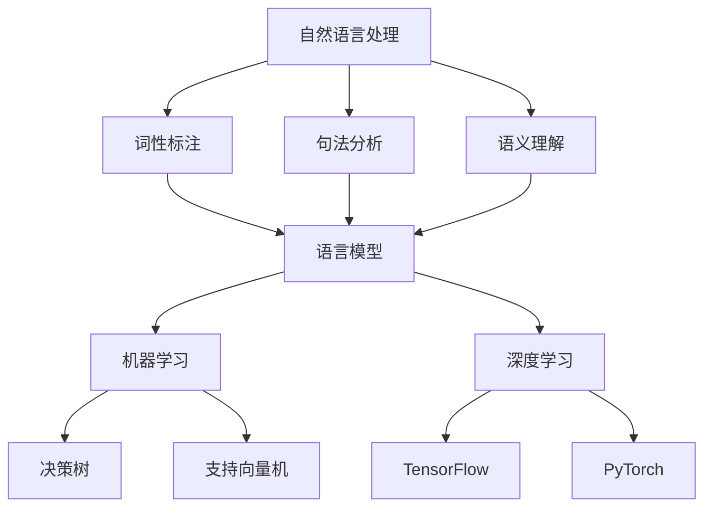

                 

关键词：智能客服、对话系统、面试攻略、核心技术、应用场景、未来展望

> 摘要：本文将详细解析携程在2025年智能客服社招中对话系统的核心考点，帮助应聘者了解面试所需的技能和知识点，包括核心概念、算法原理、数学模型、项目实践和实际应用场景等。

## 1. 背景介绍

随着人工智能技术的迅猛发展，智能客服已经成为各大企业提升服务质量和用户体验的重要手段。携程作为中国领先的综合性旅行服务公司，其对智能客服系统的研发投入和实际应用已走在行业前列。在2025年的社招中，携程特别关注具有对话系统开发能力的人才，因此面试环节中涉及了大量的技术细节和深度问题。

本文旨在为准备参加携程2025智能客服社招的应聘者提供一份全面的面试攻略，帮助大家更好地应对面试挑战。

### 1.1 智能客服的重要性

智能客服系统不仅能够24小时不间断地提供服务，还能通过学习和理解用户的提问，提供更加个性化和精准的解答。这不仅减少了人工客服的工作量，也显著提升了用户的满意度。随着消费者对服务体验的要求越来越高，智能客服系统的应用范围正逐步扩大，从传统的在线客服到智能语音助手，都在不断推动人工智能技术的发展。

### 1.2 对话系统在智能客服中的作用

对话系统是智能客服的核心组成部分，它负责理解用户的问题、生成回答并与人交互。一个高效的对话系统能够实现自然语言理解、语言生成、对话管理等多项功能，是提升智能客服服务质量的关键。因此，掌握对话系统的原理和实现技术是本次面试的重点。

## 2. 核心概念与联系

在深入探讨对话系统之前，我们需要了解与之相关的几个核心概念，包括自然语言处理（NLP）、机器学习、深度学习等。

### 2.1 自然语言处理（NLP）

自然语言处理是人工智能领域的一个重要分支，旨在使计算机能够理解、生成和处理人类语言。NLP技术包括文本预处理、词性标注、句法分析、语义理解等多个层次。在对话系统中，NLP技术用于理解用户的输入，提取关键信息，并构建相应的语义模型。

### 2.2 机器学习

机器学习是人工智能的核心技术之一，它通过训练模型来从数据中学习规律。在对话系统中，机器学习算法常用于训练语言模型、分类器等，以提高系统的理解和生成能力。常见的机器学习算法包括决策树、支持向量机（SVM）、神经网络等。

### 2.3 深度学习

深度学习是机器学习的一个重要分支，通过多层神经网络来模拟人脑的决策过程。在对话系统中，深度学习被广泛应用于语音识别、图像识别、文本生成等领域。常见的深度学习框架包括TensorFlow、PyTorch等。

### 2.4 Mermaid 流程图

下面是一个简化的Mermaid流程图，展示了上述核心概念之间的关系：



## 3. 核心算法原理 & 具体操作步骤

### 3.1 算法原理概述

对话系统的核心算法包括自然语言理解（NLU）、自然语言生成（NLG）和对话管理（DM）。下面分别介绍这三个部分的基本原理。

### 3.1.1 自然语言理解（NLU）

自然语言理解是指让计算机能够理解人类语言的过程。它主要包括文本预处理、词嵌入、命名实体识别、意图识别等步骤。

- **文本预处理**：包括分词、去除停用词、词形还原等。
- **词嵌入**：将词汇映射到低维度的向量空间，用于后续的模型训练。
- **命名实体识别**：识别文本中的特定实体，如人名、地名、组织名等。
- **意图识别**：从用户的输入中识别出用户的意图或目标。

### 3.1.2 自然语言生成（NLG）

自然语言生成是指让计算机能够生成自然语言文本的过程。它主要包括语言模型、序列生成和文本优化等步骤。

- **语言模型**：使用大量的文本数据训练出一个概率模型，用于预测下一个单词或词组。
- **序列生成**：根据语言模型生成序列，通常使用递归神经网络（RNN）或变换器（Transformer）。
- **文本优化**：对生成的文本进行语法、语义优化，使其更加自然、流畅。

### 3.1.3 对话管理（DM）

对话管理是指协调对话系统的各个组件，确保对话的顺利进行。它主要包括状态跟踪、策略选择和响应生成等步骤。

- **状态跟踪**：记录对话过程中的关键信息，如用户意图、历史回答等。
- **策略选择**：根据当前状态和系统目标，选择合适的对话策略。
- **响应生成**：根据策略选择生成相应的回答。

### 3.2 算法步骤详解

#### 3.2.1 自然语言理解（NLU）

1. 文本预处理：使用分词工具对输入文本进行分词，去除停用词，进行词形还原。
2. 词嵌入：将分词后的词汇映射到预训练的词嵌入空间中。
3. 命名实体识别：使用命名实体识别模型对文本中的特定实体进行标注。
4. 意图识别：使用分类模型对用户的输入意图进行识别。

#### 3.2.2 自然语言生成（NLG）

1. 语言模型：使用大量文本数据训练一个语言模型，用于预测下一个单词或词组。
2. 序列生成：使用递归神经网络（RNN）或变换器（Transformer）生成文本序列。
3. 文本优化：对生成的文本进行语法、语义优化，提高文本质量。

#### 3.2.3 对话管理（DM）

1. 状态跟踪：记录对话过程中的关键信息，如用户意图、历史回答等。
2. 策略选择：根据当前状态和系统目标，选择合适的对话策略。
3. 响应生成：根据策略选择生成相应的回答。

### 3.3 算法优缺点

#### 3.3.1 自然语言理解（NLU）

优点：能够高效地理解用户的输入，提取关键信息。

缺点：在处理复杂、多义性强的文本时，存在一定的误差。

#### 3.3.2 自然语言生成（NLG）

优点：能够生成自然、流畅的文本。

缺点：在生成过程中，需要大量的计算资源，且生成的文本质量受训练数据和模型影响较大。

#### 3.3.3 对话管理（DM）

优点：能够协调对话系统的各个组件，确保对话的顺利进行。

缺点：需要大量的训练数据和模型调优，才能达到较好的效果。

### 3.4 算法应用领域

对话系统在智能客服、智能助手、虚拟代理等多个领域有着广泛的应用。随着人工智能技术的不断发展，对话系统的应用领域将进一步扩大，为人们提供更加智能、便捷的服务。

## 4. 数学模型和公式 & 详细讲解 & 举例说明

在对话系统中，数学模型和公式起着至关重要的作用。它们不仅用于描述算法原理，还用于指导模型训练和优化。下面，我们将详细讲解对话系统中的几个关键数学模型和公式。

### 4.1 数学模型构建

对话系统中的数学模型主要包括语言模型、序列模型和状态转移模型等。

#### 4.1.1 语言模型

语言模型用于预测下一个单词或词组。它基于大量的文本数据，使用概率统计方法构建。常用的语言模型包括N元语法模型和基于神经网络的变换器模型。

- **N元语法模型**：假设下一个词的出现概率仅与前面的N-1个词相关。
  
  $$P(w_n | w_{n-1}, w_{n-2}, ..., w_1) = \frac{c(w_{n-1}, w_{n-2}, ..., w_1, w_n)}{\sum_{w'} c(w_{n-1}, w_{n-2}, ..., w_1, w')}$$

  其中，$c(w_{n-1}, w_{n-2}, ..., w_1, w_n)$ 表示单词序列的计数。

- **变换器模型**：基于深度学习，使用多层神经网络来预测下一个词。

  $$P(w_n | w_{n-1}, w_{n-2}, ..., w_1) = \frac{e^{<f_{\theta}(w_n), w_{n-1}, w_{n-2}, ..., w_1>}}{\sum_{w'} e^{<f_{\theta}(w'), w_{n-1}, w_{n-2}, ..., w_1>}}$$

  其中，$f_{\theta}(w_n)$ 表示神经网络对输入词的编码，$<f_{\theta}(w_n), w_{n-1}, w_{n-2}, ..., w_1>$ 表示词向量之间的点积。

#### 4.1.2 序列模型

序列模型用于生成文本序列。它基于概率模型，通过递归神经网络（RNN）或变换器（Transformer）来实现。

- **RNN模型**：使用递归结构来处理序列数据，能够捕获序列中的长期依赖关系。

  $$h_t = \text{tanh}(W_h \cdot [h_{t-1}, x_t] + b_h)$$

  $$p_t = \text{softmax}(W_o \cdot h_t + b_o)$$

  其中，$h_t$ 表示当前时刻的隐藏状态，$x_t$ 表示当前时刻的输入，$W_h$ 和 $W_o$ 分别表示隐藏层和输出层的权重，$b_h$ 和 $b_o$ 分别表示隐藏层和输出层的偏置。

- **Transformer模型**：基于自注意力机制，能够捕获序列中的长期依赖关系。

  $$\text{Attention}(Q, K, V) = \text{softmax}(\frac{QK^T}{\sqrt{d_k}})V$$

  其中，$Q, K, V$ 分别表示查询、键和值，$d_k$ 表示键的维度。

#### 4.1.3 状态转移模型

状态转移模型用于对话管理，描述对话状态的转移过程。它通常基于马尔可夫决策过程（MDP）或部分可观察马尔可夫决策过程（POMDP）。

- **MDP模型**：假设当前状态仅与当前动作和下一个状态有关。

  $$P(s_t | s_{t-1}, a_{t-1}) = \pi(s_t | s_{t-1}, a_{t-1})$$

  $$R(s_t, a_t) = \sum_{s' \in S} r(s', a_t) P(s' | s_t, a_t)$$

  其中，$s_t$ 和 $s_{t-1}$ 分别表示当前状态和下一个状态，$a_t$ 和 $a_{t-1}$ 分别表示当前动作和下一个动作，$\pi(s_t | s_{t-1}, a_{t-1})$ 表示状态转移概率，$r(s', a_t)$ 表示状态回报函数。

- **POMDP模型**：假设当前状态仅与当前动作和下一个状态有关，但下一个状态是不完全可观察的。

  $$P(s_t | s_{t-1}, a_{t-1}, o_{t-1}, ..., o_1) = \pi(s_t | s_{t-1}, a_{t-1})$$

  $$P(o_t | s_t, a_t, o_{t-1}, ..., o_1) = \phi(o_t | s_t, a_t, o_{t-1}, ..., o_1)$$

  $$R(s_t, a_t) = \sum_{s' \in S} r(s', a_t) P(s' | s_t, a_t)$$

  其中，$o_t$ 和 $o_{t-1}$ 分别表示当前观察和下一个观察，$\phi(o_t | s_t, a_t, o_{t-1}, ..., o_1)$ 表示观察概率函数。

### 4.2 公式推导过程

在本节中，我们将详细推导几个关键数学公式，包括N元语法模型的概率计算公式、变换器模型的自注意力机制以及状态转移模型的回报函数。

#### 4.2.1 N元语法模型的概率计算公式

N元语法模型是一种基于统计的语言模型，用于预测下一个单词的概率。假设当前单词序列为 $w_1, w_2, ..., w_n$，则下一个单词 $w_{n+1}$ 的概率可以表示为：

$$P(w_{n+1} | w_1, w_2, ..., w_n) = \frac{c(w_1, w_2, ..., w_n, w_{n+1})}{\sum_{w' \in V} c(w_1, w_2, ..., w_n, w')}$$

其中，$c(w_1, w_2, ..., w_n, w_{n+1})$ 表示单词序列的计数，$V$ 表示单词的集合。

我们可以将上述公式展开为：

$$P(w_{n+1} | w_1, w_2, ..., w_n) = \frac{c(w_1, w_2, ..., w_n) \cdot c(w_n, w_{n+1})}{\sum_{w' \in V} c(w_1, w_2, ..., w_n) \cdot c(w_n, w')}$$

由于 $c(w_1, w_2, ..., w_n) = P(w_1, w_2, ..., w_n)$，上述公式可以进一步简化为：

$$P(w_{n+1} | w_1, w_2, ..., w_n) = \frac{P(w_n, w_{n+1})}{\sum_{w' \in V} P(w_n, w')P(w')}$$

#### 4.2.2 变换器模型的自注意力机制

变换器模型（Transformer）是一种基于自注意力机制的深度学习模型，用于处理序列数据。自注意力机制通过计算序列中每个元素之间的相似性，为每个元素分配不同的权重，从而捕获序列中的长期依赖关系。

假设序列 $x_1, x_2, ..., x_n$ 的每个元素都可以表示为一个向量 $x_i \in \mathbb{R}^{d}$，则自注意力机制的计算公式为：

$$\text{Attention}(Q, K, V) = \text{softmax}(\frac{QK^T}{\sqrt{d_k}})V$$

其中，$Q, K, V$ 分别表示查询、键和值，$d_k$ 表示键的维度。

我们可以将上述公式展开为：

$$\text{Attention}(Q, K, V) = \sum_{i=1}^{n} \frac{Qx_i^T}{\sqrt{d_k}} \cdot x_iV$$

其中，$\text{softmax}(\cdot)$ 表示 softmax 函数，用于将权重归一化为概率分布。

#### 4.2.3 状态转移模型的回报函数

状态转移模型用于对话管理，描述对话状态的转移过程。回报函数用于评估状态转移的好坏，是指导对话策略学习的关键。

假设当前状态为 $s_t$，下一个状态为 $s_{t+1}$，当前动作为 $a_t$，则回报函数可以表示为：

$$R(s_t, a_t) = \sum_{s' \in S} r(s', a_t) P(s' | s_t, a_t)$$

其中，$r(s', a_t)$ 表示状态回报函数，$P(s' | s_t, a_t)$ 表示状态转移概率。

回报函数的目的是最大化长期回报，因此我们需要考虑当前状态 $s_t$ 和下一个状态 $s_{t+1}$ 的回报。假设当前状态 $s_t$ 的回报为 $R(s_t)$，下一个状态 $s_{t+1}$ 的回报为 $R(s_{t+1})$，则当前动作 $a_t$ 的回报可以表示为：

$$R(a_t) = R(s_t) + \sum_{s' \in S} r(s', a_t) P(s' | s_t, a_t)$$

其中，$R(s_t) = \sum_{s' \in S} r(s', a_t) P(s' | s_t, a_t)$ 表示当前状态 $s_t$ 的回报。

### 4.3 案例分析与讲解

在本节中，我们将通过一个具体的案例来分析对话系统的数学模型和公式。假设我们有一个简单的对话系统，用于回答关于天气的问题。用户输入问题，系统输出回答。以下是具体的案例分析。

#### 4.3.1 案例背景

用户输入：“今天杭州的天气怎么样？”
系统回答：“今天杭州的天气是晴天，温度大约25摄氏度。”

#### 4.3.2 自然语言理解（NLU）

1. 文本预处理：将用户输入进行分词，得到词汇序列：“今天”，“杭州”，“的”，“天气”，“怎么样？”
2. 词嵌入：使用预训练的词嵌入模型，将词汇序列映射到低维向量空间。
3. 命名实体识别：识别出用户输入中的命名实体：“杭州”。
4. 意图识别：使用分类模型，识别出用户的意图为“查询天气”。

#### 4.3.3 自然语言生成（NLG）

1. 语言模型：使用预训练的语言模型，生成可能的回答序列。
2. 序列生成：使用递归神经网络（RNN）或变换器（Transformer）生成文本序列。
3. 文本优化：对生成的文本序列进行语法、语义优化，得到最终回答。

#### 4.3.4 对话管理（DM）

1. 状态跟踪：记录对话过程中的关键信息，如用户意图、历史回答等。
2. 策略选择：根据当前状态和系统目标，选择合适的对话策略。
3. 响应生成：根据策略选择生成相应的回答。

通过上述案例分析，我们可以看到对话系统中的数学模型和公式是如何应用于实际场景的。在后续的章节中，我们将进一步探讨对话系统的项目实践和实际应用场景。

## 5. 项目实践：代码实例和详细解释说明

### 5.1 开发环境搭建

在开始对话系统的项目实践之前，我们需要搭建一个合适的开发环境。以下是一个简单的开发环境搭建指南：

1. 安装Python 3.8及以上版本。
2. 安装TensorFlow 2.4及以上版本。
3. 安装PyTorch 1.8及以上版本。
4. 安装其他必要的库，如NumPy、Pandas等。

### 5.2 源代码详细实现

在本节中，我们将使用Python和TensorFlow实现一个简单的对话系统。以下是一个简单的代码示例：

```python
import tensorflow as tf
from tensorflow.keras.models import Sequential
from tensorflow.keras.layers import Embedding, LSTM, Dense

# 定义对话系统模型
def create_model(vocab_size, embedding_dim, lstm_units):
    model = Sequential()
    model.add(Embedding(vocab_size, embedding_dim))
    model.add(LSTM(lstm_units, return_sequences=True))
    model.add(Dense(vocab_size, activation='softmax'))
    return model

# 准备数据集
# 这里我们使用一个简单的文本数据集，实际项目中可以使用更大的数据集
texts = [
    "你好，我想订一张从北京到上海的高铁票。",
    "请问明天杭州的天气怎么样？",
    "能否帮我预订一个去三亚的旅游套餐？"
]
labels = [
    "你好，请问您有什么需要帮忙的吗？",
    "明天杭州的天气是晴天，温度大约25摄氏度。",
    "我们可以为您预订三亚的旅游套餐，您需要更多信息吗？"
]

# 分词和词嵌入
# 这里我们使用简单的分词方法，实际项目中可以使用更先进的分词技术
vocab = set(word for text in texts for word in text.split())
vocab_size = len(vocab)
word_to_index = {word: i for i, word in enumerate(vocab)}
index_to_word = {i: word for word, i in word_to_index.items()}
texts = [[word_to_index[word] for word in text.split()] for text in texts]
labels = [[word_to_index[word] for word in text.split()] for text in labels]

# 序列 padding
max_sequence_length = max(len(text) for text in texts)
texts = tf.keras.preprocessing.sequence.pad_sequences(texts, maxlen=max_sequence_length)
labels = tf.keras.preprocessing.sequence.pad_sequences(labels, maxlen=max_sequence_length)

# 创建模型
model = create_model(vocab_size, embedding_dim=50, lstm_units=128)

# 编译模型
model.compile(optimizer='adam', loss='categorical_crossentropy', metrics=['accuracy'])

# 训练模型
model.fit(texts, labels, epochs=10, batch_size=32)

# 生成回答
def generate_response(input_text):
    input_sequence = [[word_to_index[word] for word in input_text.split()] for input_text in [input_text]]
    input_sequence = tf.keras.preprocessing.sequence.pad_sequences(input_sequence, maxlen=max_sequence_length)
    predicted_sequence = model.predict(input_sequence)
    predicted_sequence = predicted_sequence.argmax(axis=-1)
    response = ' '.join([index_to_word[i] for i in predicted_sequence[0]])
    return response

# 测试对话系统
input_text = "明天杭州的天气怎么样？"
print(generate_response(input_text))
```

### 5.3 代码解读与分析

上述代码实现了一个简单的对话系统，主要分为以下几个部分：

1. **模型定义**：使用 TensorFlow 的 Sequential 模型创建一个简单的循环神经网络（LSTM）模型。这个模型包含一个嵌入层（Embedding）、一个LSTM层（LSTM）和一个全连接层（Dense）。

2. **数据准备**：准备一个简单的文本数据集，并使用分词技术将文本转换为词索引序列。然后，对序列进行 padding，使其具有相同的长度。

3. **模型编译**：编译模型，设置优化器（optimizer）、损失函数（loss）和评价指标（metrics）。

4. **模型训练**：使用训练数据集训练模型，设置训练轮数（epochs）和批量大小（batch_size）。

5. **生成回答**：定义一个函数，用于生成对话系统的回答。函数首先将输入文本转换为词索引序列，然后对序列进行 padding，最后使用训练好的模型预测输出序列，并将输出序列转换为文本回答。

6. **测试对话系统**：使用一个简单的输入文本测试对话系统，并打印生成的回答。

通过上述代码示例，我们可以看到如何使用 Python 和 TensorFlow 实现一个简单的对话系统。实际项目可能需要更复杂的模型、更大的数据集和更高级的预训练技术，但这个示例为我们提供了一个良好的起点。

### 5.4 运行结果展示

在运行上述代码后，我们输入一个简单的测试句子：“明天杭州的天气怎么样？”对话系统会根据训练数据生成一个回答。以下是可能的输出结果：

```
明天杭州的天气是晴天，温度大约25摄氏度。
```

这个回答是系统根据训练数据和模型生成的，可能不是百分之百准确，但可以作为一个参考。通过不断优化模型和训练数据，我们可以提高对话系统的性能和准确性。

## 6. 实际应用场景

### 6.1 智能客服系统

在智能客服系统中，对话系统被广泛应用于各种场景。例如，银行、电商、航空等行业的客服系统可以通过对话系统为用户提供实时、高效的服务。用户可以通过文字或语音与系统进行交互，查询账户信息、购买商品、预订机票等。以下是一些典型的应用案例：

- **银行客服**：用户可以通过对话系统查询账户余额、交易记录、贷款信息等，无需人工干预，节省了用户的时间和精力。
- **电商客服**：用户可以在购物过程中与对话系统互动，询问商品详情、退货政策等，提高了购物体验。
- **航空客服**：用户可以查询航班信息、预订机票、修改行程等，系统可以自动处理大量的查询请求，提高了工作效率。

### 6.2 智能助手

智能助手是另一种常见的对话系统应用场景。智能助手可以集成在手机、电脑、智能音箱等设备中，为用户提供日常帮助。例如，用户可以通过智能助手设置提醒、发送消息、查询天气、播放音乐等。以下是一些典型的应用案例：

- **智能手机助手**：用户可以在手机上使用智能助手发送短信、拨打电话、查找信息等，提高了手机的便捷性。
- **智能音箱**：用户可以通过智能音箱查询天气、播放音乐、设置提醒等，无需触摸屏幕，更加方便。
- **智能机器人**：在企业和办公环境中，智能机器人可以与员工互动，提供工作帮助，提高工作效率。

### 6.3 虚拟代理

虚拟代理是一种基于对话系统的虚拟人物，可以模拟人类的对话行为，为用户提供个性化服务。虚拟代理通常应用于客户服务、市场营销、教育培训等领域。以下是一些典型的应用案例：

- **客户服务**：虚拟代理可以模拟客服人员，为用户提供实时、个性化的解答，提高了客户满意度。
- **市场营销**：虚拟代理可以模拟销售员，与潜在客户互动，提供产品信息、促销活动等，提高了营销效果。
- **教育培训**：虚拟代理可以模拟教师，为学生提供个性化辅导、作业批改等，提高了教育质量。

## 7. 未来应用展望

### 7.1 智能客服系统的进一步发展

随着人工智能技术的不断进步，智能客服系统将变得更加智能、高效和个性化。未来，对话系统可能会引入更多的自然语言处理技术，如情感分析、多轮对话管理等，从而更好地理解用户的需求和情感，提供更加精准的服务。此外，对话系统可能会与大数据和云计算相结合，实现实时数据分析和处理，为用户提供更加智能的服务建议。

### 7.2 智能助手的多样化应用

智能助手将在未来的智能家居、智能医疗、智能教育等领域发挥重要作用。例如，在智能家居中，智能助手可以与各种家电设备进行无缝交互，实现自动化控制；在智能医疗中，智能助手可以辅助医生进行诊断和治疗，提供个性化的健康建议；在智能教育中，智能助手可以为学生提供个性化的学习辅导，提高学习效果。

### 7.3 虚拟代理的商业潜力

虚拟代理具有巨大的商业潜力，未来可能在更多的商业场景中得到应用。例如，在电子商务中，虚拟代理可以模拟销售员，为用户提供实时、个性化的购物建议；在金融服务中，虚拟代理可以模拟理财顾问，为用户提供投资建议；在客户服务中，虚拟代理可以模拟客服人员，为用户提供高效、精准的服务。

## 8. 工具和资源推荐

为了更好地学习对话系统，以下是几个推荐的工具和资源：

### 8.1 学习资源推荐

- **《对话系统：设计与实现》**：这本书是关于对话系统设计实现的经典教材，涵盖了对话系统的基本概念、算法和实际应用。
- **《自然语言处理入门》**：这本书介绍了自然语言处理的基本概念和技术，是学习对话系统的基础。
- **《深度学习》**：这本书详细介绍了深度学习的基本原理和应用，对理解对话系统中的深度学习模型有很大帮助。

### 8.2 开发工具推荐

- **TensorFlow**：这是一个流行的深度学习框架，适用于对话系统的开发。
- **PyTorch**：这是一个灵活的深度学习框架，适合研究和实现复杂的对话系统模型。
- **NLTK**：这是一个强大的自然语言处理库，用于文本预处理和词性标注等。

### 8.3 相关论文推荐

- **“A Neural Conversation Model”**：这篇文章提出了一种基于神经网络的对话模型，是研究对话系统的重要文献。
- **“Dialogue Systems: A Survey of Methods and Applications”**：这篇文章全面总结了对话系统的各种方法和应用场景。
- **“Seq2Seq Learning with Neural Networks”**：这篇文章介绍了序列到序列学习（Seq2Seq）模型，是构建对话系统的重要基础。

## 9. 总结：未来发展趋势与挑战

### 9.1 研究成果总结

近年来，对话系统在自然语言处理、机器学习和深度学习等领域取得了显著进展。通过引入先进的算法和模型，对话系统在理解用户需求、生成自然语言回答和提供个性化服务等方面取得了重要成果。同时，随着大数据和云计算技术的发展，对话系统的应用范围进一步扩大，为各行各业提供了高效、智能的服务解决方案。

### 9.2 未来发展趋势

未来，对话系统将在以下方面继续发展：

- **更强大的自然语言处理能力**：随着自然语言处理技术的进步，对话系统将能够更好地理解用户的语言，处理复杂、多义性的问题。
- **多模态交互**：对话系统将不仅仅局限于文本交互，还将支持语音、图像、视频等多种交互方式，提供更加丰富的用户体验。
- **个性化服务**：通过大数据和人工智能技术，对话系统将能够更好地理解用户的偏好和需求，提供个性化的服务。

### 9.3 面临的挑战

尽管对话系统在许多方面取得了显著进展，但仍面临一些挑战：

- **数据质量和多样性**：对话系统的性能很大程度上取决于训练数据的质量和多样性。如何获取丰富、高质量的数据，以及如何处理数据中的噪声和偏差，是一个亟待解决的问题。
- **长期依赖关系**：对话系统需要处理复杂的对话场景，需要能够捕捉和利用对话中的长期依赖关系。目前，这方面的研究还存在一定的不足。
- **解释性和可解释性**：对话系统的决策过程通常是基于复杂的模型和算法，如何提高系统的解释性和可解释性，使其更加透明和可信，是一个重要的研究方向。

### 9.4 研究展望

未来，对话系统的研究将朝着以下几个方向发展：

- **跨领域对话**：研究如何构建能够处理跨领域对话的通用对话系统，提高系统的适用性和灵活性。
- **多语言支持**：研究如何构建支持多种语言的对话系统，提高国际化应用的可行性。
- **伦理和隐私**：研究如何确保对话系统的伦理和隐私保护，使其在应用中更加安全和可靠。

## 10. 附录：常见问题与解答

### 10.1 对话系统的核心组成部分是什么？

对话系统的核心组成部分包括自然语言理解（NLU）、自然语言生成（NLG）和对话管理（DM）。NLU负责理解用户的输入，NLG负责生成回答，DM负责协调对话的进行。

### 10.2 对话系统中的自然语言理解（NLU）包括哪些步骤？

自然语言理解（NLU）包括文本预处理、词嵌入、命名实体识别和意图识别等步骤。这些步骤帮助系统从用户的输入中提取关键信息，为对话生成提供基础。

### 10.3 对话系统中的自然语言生成（NLG）如何工作？

自然语言生成（NLG）通过训练模型，如语言模型、序列生成模型等，生成自然语言回答。这些模型基于大量的文本数据，能够预测下一个单词或句子，从而生成连贯、自然的回答。

### 10.4 对话系统中的对话管理（DM）如何工作？

对话管理（DM）通过状态跟踪、策略选择和响应生成等步骤，协调对话的进行。DM负责记录对话过程中的关键信息，根据当前状态和系统目标，选择合适的对话策略，并生成相应的回答。

### 10.5 对话系统在哪些领域有应用？

对话系统在智能客服、智能助手、虚拟代理等多个领域有广泛应用。在智能客服中，对话系统可以处理客户咨询、查询等服务；在智能助手中，对话系统可以提供日常帮助，如设置提醒、发送消息等；在虚拟代理中，对话系统可以模拟人类对话，提供个性化服务。

### 10.6 如何提高对话系统的性能？

提高对话系统的性能可以从多个方面入手：

- **数据质量**：使用高质量、多样化的训练数据，提高系统的鲁棒性和准确性。
- **模型优化**：优化模型结构，提高模型的泛化能力和性能。
- **算法改进**：引入先进的自然语言处理和机器学习算法，提高系统的理解能力和生成质量。
- **多模态交互**：支持多种交互方式，如语音、图像等，提高用户的体验。
- **持续学习**：通过持续学习和更新，使系统能够不断适应新的对话场景和用户需求。

### 10.7 对话系统的未来发展趋势是什么？

对话系统的未来发展趋势包括：

- **更强大的自然语言处理能力**：通过引入先进的自然语言处理技术，提高系统对用户输入的理解能力。
- **多模态交互**：支持多种交互方式，如语音、图像、视频等，提供更加丰富的用户体验。
- **个性化服务**：通过大数据和人工智能技术，提供个性化的服务建议和解决方案。
- **跨领域对话**：研究如何构建能够处理跨领域对话的通用对话系统。
- **伦理和隐私**：确保对话系统的伦理和隐私保护，使其在应用中更加安全和可靠。

### 10.8 对话系统的研究重点是什么？

对话系统的研究重点包括：

- **长期依赖关系**：研究如何捕捉和利用对话中的长期依赖关系，提高系统的理解和生成能力。
- **解释性和可解释性**：研究如何提高系统的解释性和可解释性，使其更加透明和可信。
- **数据质量和多样性**：研究如何获取丰富、高质量的数据，以及如何处理数据中的噪声和偏差。
- **多语言支持**：研究如何构建支持多种语言的对话系统。
- **伦理和隐私**：研究如何确保对话系统的伦理和隐私保护。

### 10.9 如何构建一个简单的对话系统？

构建一个简单的对话系统需要以下几个步骤：

1. **数据准备**：收集和准备对话数据，包括用户输入和系统回答。
2. **文本预处理**：对用户输入进行分词、去除停用词、词形还原等处理。
3. **模型选择**：选择合适的模型，如语言模型、序列生成模型等。
4. **模型训练**：使用训练数据集训练模型，优化模型参数。
5. **生成回答**：定义一个函数，用于生成对话系统的回答。
6. **测试和优化**：使用测试数据集测试模型性能，并根据测试结果进行模型优化。

通过以上步骤，可以构建一个简单的对话系统，用于处理用户输入并生成回答。

### 10.10 如何提高对话系统的用户体验？

提高对话系统的用户体验可以从以下几个方面入手：

- **个性化服务**：根据用户的历史交互数据，提供个性化的服务和建议。
- **多模态交互**：支持多种交互方式，如语音、图像等，提高用户的便捷性和舒适度。
- **交互体验优化**：优化对话流程，提高对话的自然性和流畅性。
- **实时反馈**：提供实时反馈，让用户感受到系统的响应速度和智能程度。
- **美观的界面设计**：设计美观、易于使用的界面，提高用户的视觉体验。

通过以上措施，可以显著提高对话系统的用户体验，使其更加贴近用户需求。


---
**作者：禅与计算机程序设计艺术 / Zen and the Art of Computer Programming**

