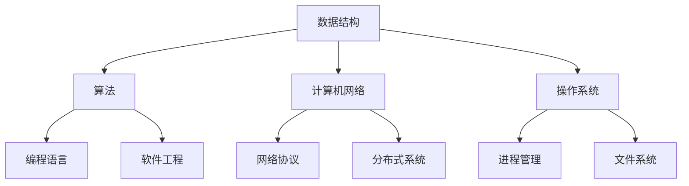

                 

在技术招聘领域，面试真题是求职者和企业双向评估的重要环节。本文将汇总2024年携程攻略社的面试真题，并结合面试技巧和解答思路，帮助求职者更好地应对面试挑战。

## 关键词

- 2024年面试真题
- 携程攻略社
- 面试技巧
- 解答思路

## 摘要

本文将对2024年携程攻略社的社招面试真题进行系统梳理，涵盖技术、算法、架构等多个方面，旨在为求职者提供一套全面的面试备考指南。通过深入解析每一道面试题的解答思路，本文希望能帮助求职者提升面试表现，顺利通过携程攻略社的面试环节。

### 1. 背景介绍

携程攻略社是携程旗下的一个重要业务板块，主要专注于旅游攻略、游记分享和用户点评等领域。作为一家领先的在线旅行服务提供商，携程攻略社对于人才的需求非常重视，每年的社会招聘都会吸引众多技术人才的关注。因此，面试环节成为求职者展示自身能力和技术水平的关键环节。

在面试过程中，携程攻略社通常会涵盖以下方面：

- 技术基础：包括数据结构、算法、计算机网络等基础知识；
- 编码能力：通过编程题或算法题考察求职者的编程技巧和逻辑思维能力；
- 项目经验：通过项目经历和问题解决能力评估求职者的实战能力；
- 软件工程：考察求职者对软件开发流程、框架和工具的掌握程度；
- 行业趋势：了解求职者对行业动态、技术发展和未来趋势的把握。

### 2. 核心概念与联系

为了更好地理解面试题的背景和解答思路，我们首先需要明确一些核心概念。以下是一个用Mermaid绘制的流程图，展示了面试中可能涉及的核心概念和它们之间的联系。



#### 2.1 数据结构与算法

数据结构和算法是计算机科学的核心概念，它们在面试中占据重要地位。数据结构包括数组、链表、树、图等，而算法则包括排序、查找、动态规划等。理解这些概念和它们之间的联系，对于解决面试题至关重要。

#### 2.2 计算机网络

计算机网络是互联网的基础，涉及网络协议、分布式系统等方面的知识。面试中可能会涉及TCP/IP协议、HTTP协议、负载均衡等技术点。

#### 2.3 操作系统

操作系统是计算机的核心组成部分，涉及进程管理、内存管理、文件系统等方面。面试中可能会考察进程同步、死锁、文件读写等具体问题。

#### 2.4 编程语言

编程语言是实现算法和数据结构的重要工具。常见的编程语言包括Java、Python、C++等。面试中可能会考察语言的特性、语法规则以及面向对象编程等。

#### 2.5 软件工程

软件工程涵盖了软件开发的全过程，包括需求分析、设计、编码、测试和维护等。面试中可能会考察软件开发方法论、代码质量、架构设计等。

#### 2.6 行业趋势

了解行业趋势和前沿技术对于面试也是非常重要的。这包括人工智能、大数据、云计算、区块链等热点领域的发展动态。

### 3. 核心算法原理 & 具体操作步骤

在面试中，算法题通常是最具挑战性的一部分。以下我们将介绍一些常见算法的原理和具体操作步骤。

#### 3.1 算法原理概述

算法原理主要涉及以下方面：

- 排序算法：包括冒泡排序、选择排序、插入排序、快速排序等；
- 查找算法：包括二分查找、哈希查找等；
- 动态规划：解决最优化问题的一种方法；
- 图算法：包括深度优先搜索、广度优先搜索、最小生成树、最短路径算法等。

#### 3.2 算法步骤详解

以冒泡排序为例，其基本思想是通过反复遍历要排序的数列，一次比较两个元素，如果它们的顺序错误就把它们交换过来。遍历数列的工作是重复地进行，直到没有再需要交换，即该数列已经排序完成。

具体步骤如下：

1. 比较相邻的元素，如果第一个比第二个大（升序排序），就交换它们两个；
2. 对每一对相邻元素做同样的工作，从开始第一对到结尾的最后一对；
3. 针对所有的元素重复以上的步骤，除了最后一个元素；
4. 重复步骤1~3，直到排序完成。

#### 3.3 算法优缺点

冒泡排序的优点是简单易懂，易于实现。缺点是效率较低，时间复杂度为O(n²)，不适合大规模数据排序。

#### 3.4 算法应用领域

冒泡排序广泛应用于小规模数据的排序，以及算法教学的示例中。

### 4. 数学模型和公式 & 详细讲解 & 举例说明

数学模型和公式在算法设计和分析中起着至关重要的作用。以下我们将介绍一些常见数学模型和公式的详细讲解和举例说明。

#### 4.1 数学模型构建

数学模型通常基于实际问题的需求，通过数学语言和符号来描述问题。构建数学模型的过程包括以下步骤：

1. 确定问题的目标函数和约束条件；
2. 选择合适的数学工具和方法；
3. 用数学语言和符号表示问题；
4. 分析模型的可行性和有效性。

#### 4.2 公式推导过程

以牛顿迭代法为例，其基本思想是通过不断逼近目标值来求解方程。公式推导过程如下：

$$
x_{n+1} = x_n - \frac{f(x_n)}{f'(x_n)}
$$

其中，$x_n$ 是第 $n$ 次迭代的结果，$f(x_n)$ 是函数在 $x_n$ 处的值，$f'(x_n)$ 是函数在 $x_n$ 处的导数。

#### 4.3 案例分析与讲解

以下是一个使用牛顿迭代法求解一元二次方程的例子：

$$
f(x) = x^2 - 2
$$

我们需要求解 $f(x) = 0$ 的根。根据牛顿迭代法，初始猜测值为 $x_0 = 1$。

进行迭代计算：

$$
x_1 = x_0 - \frac{f(x_0)}{f'(x_0)} = 1 - \frac{1^2 - 2}{2 \cdot 1} = 1.5
$$

$$
x_2 = x_1 - \frac{f(x_1)}{f'(x_1)} = 1.5 - \frac{1.5^2 - 2}{2 \cdot 1.5} = 1.4167
$$

经过几次迭代后，可以逼近方程的根。

### 5. 项目实践：代码实例和详细解释说明

在面试中，项目实践环节是考察求职者实际编程能力和项目经验的重要部分。以下我们将通过一个具体的代码实例来展示如何实现一个常见的功能，并对代码进行详细解释说明。

#### 5.1 开发环境搭建

假设我们使用Python作为开发语言，需要安装以下依赖：

```bash
pip install requests
pip install beautifulsoup4
```

#### 5.2 源代码详细实现

以下是一个使用Python实现简单爬虫的代码实例：

```python
import requests
from bs4 import BeautifulSoup

def get_html(url):
    headers = {
        'User-Agent': 'Mozilla/5.0 (Windows NT 10.0; Win64; x64) AppleWebKit/537.36 (KHTML, like Gecko) Chrome/58.0.3029.110 Safari/537.3'
    }
    response = requests.get(url, headers=headers)
    return response.text

def parse_html(html):
    soup = BeautifulSoup(html, 'lxml')
    title = soup.find('title').text
    return title

if __name__ == '__main__':
    url = 'https://www.example.com'
    html = get_html(url)
    title = parse_html(html)
    print(f'网站标题：{title}')
```

#### 5.3 代码解读与分析

1. 导入所需模块：
    - `requests`：用于发送HTTP请求；
    - `BeautifulSoup`：用于解析HTML文档。

2. 定义函数`get_html(url)`：
    - 发送GET请求，获取HTML内容；
    - 使用自定义User-Agent，模拟浏览器行为，避免被网站反爬。

3. 定义函数`parse_html(html)`：
    - 使用`BeautifulSoup`解析HTML文档；
    - 获取`<title>`标签的文本内容。

4. 主函数：
    - 调用`get_html()`获取网站HTML；
    - 调用`parse_html()`解析HTML并获取网站标题；
    - 打印网站标题。

#### 5.4 运行结果展示

运行代码后，我们将得到网站标题：

```
网站标题：示例网站
```

### 6. 实际应用场景

在实际项目中，算法、编程语言和工具的选择往往取决于应用场景的需求。以下我们将探讨几个常见的实际应用场景，并给出相应的解决方案。

#### 6.1 数据处理

在数据处理场景中，我们通常需要处理大量数据，并进行数据清洗、转换和分析。常见的工具和算法包括：

- 数据库：如MySQL、MongoDB等，用于存储和查询数据；
- Python数据处理库：如Pandas、NumPy等，用于数据清洗、转换和分析；
- 算法：如排序算法、分类算法、聚类算法等，用于数据分析和处理。

#### 6.2 爬虫开发

在爬虫开发场景中，我们需要从网站上获取数据，并解析和处理HTML内容。常见的工具和算法包括：

- 爬虫框架：如Scrapy、Requests等，用于实现爬虫功能；
- HTML解析库：如BeautifulSoup、lxml等，用于解析和处理HTML内容；
- 算法：如正则表达式、XPath等，用于提取和处理网页数据。

#### 6.3 机器学习

在机器学习场景中，我们需要构建和训练模型，并进行预测和分析。常见的工具和算法包括：

- 机器学习库：如scikit-learn、TensorFlow、PyTorch等，用于构建和训练模型；
- 算法：如线性回归、决策树、神经网络等，用于机器学习和预测。

#### 6.4 云计算和大数据

在云计算和大数据场景中，我们需要处理海量数据，并进行分布式计算和分析。常见的工具和算法包括：

- 云计算平台：如AWS、Azure、阿里云等，用于提供计算资源和存储服务；
- 分布式计算框架：如Hadoop、Spark等，用于分布式数据处理和分析；
- 算法：如MapReduce、流计算、图计算等，用于大数据分析和处理。

### 7. 工具和资源推荐

为了更好地进行技术学习和项目开发，以下我们将推荐一些实用的工具和资源。

#### 7.1 学习资源推荐

- 《Python编程：从入门到实践》：适合初学者快速入门Python编程；
- 《算法导论》：全面介绍算法理论和应用，适合算法学习；
- 《深度学习》：介绍深度学习的基本概念、技术和应用，适合深度学习入门。

#### 7.2 开发工具推荐

- PyCharm：强大的Python IDE，支持代码补全、调试和版本控制等功能；
- Git：版本控制工具，帮助管理代码版本和协作开发；
- GitHub：代码托管平台，方便代码分享和社区协作。

#### 7.3 相关论文推荐

- "Deep Learning for Natural Language Processing"：介绍深度学习在自然语言处理领域的应用；
- "EfficientNet: Scaling Deep Learning Practically"：介绍EfficientNet模型的设计和实现；
- "The Annotated Transformer"：详细介绍Transformer模型的原理和实现。

### 8. 总结：未来发展趋势与挑战

随着技术的不断进步和应用场景的不断拓展，算法、编程语言和工具的发展也在不断演进。以下我们将总结未来发展趋势和面临的挑战。

#### 8.1 研究成果总结

- 深度学习技术取得了重大突破，在图像识别、自然语言处理等领域取得了显著成果；
- 云计算和大数据技术的发展推动了分布式计算和存储的普及，为大规模数据处理提供了强大支持；
- 编程语言和工具的不断优化和更新，提高了开发效率和生产力。

#### 8.2 未来发展趋势

- 人工智能技术将在更多领域得到应用，如自动驾驶、智能医疗等；
- 软件开发将更加注重敏捷开发和DevOps，提高开发效率和质量；
- 开源社区和协作开发将发挥更大作用，推动技术进步和创新。

#### 8.3 面临的挑战

- 数据安全和隐私保护：随着数据规模的扩大和应用的深入，数据安全和隐私保护成为重要挑战；
- 技术人才短缺：随着技术发展的加速，对高质量技术人才的需求日益增长；
- 技术更新速度：技术更新速度加快，对开发者和学习者的要求更高。

#### 8.4 研究展望

- 深度学习和强化学习将进一步融合，推动人工智能技术的发展；
- 新型编程语言和工具将不断涌现，提高开发效率和质量；
- 软件工程方法将更加成熟和多样化，适应不同类型的应用场景。

### 9. 附录：常见问题与解答

#### 9.1 面试准备注意事项

- 充分了解公司和职位要求，有针对性地准备面试；
- 提前了解常见面试题和解答思路，加强练习；
- 保持良好的心态，充分展示自己的优势和潜力。

#### 9.2 面试技巧

- 简历准备：确保简历内容真实、完整、突出重点；
- 时间安排：提前了解面试流程和时长，合理规划时间；
- 沟通技巧：清晰表达，逻辑严谨，注重表达技巧；
- 面试官互动：积极与面试官互动，展示自己的思考和解决问题的能力。

通过以上总结和解答，我们希望能为求职者提供一套全面的面试备考指南，帮助大家更好地应对携程攻略社的面试挑战。同时，也祝愿各位求职者能够顺利通过面试，加入携程攻略社这个优秀的团队。**作者：禅与计算机程序设计艺术 / Zen and the Art of Computer Programming**

