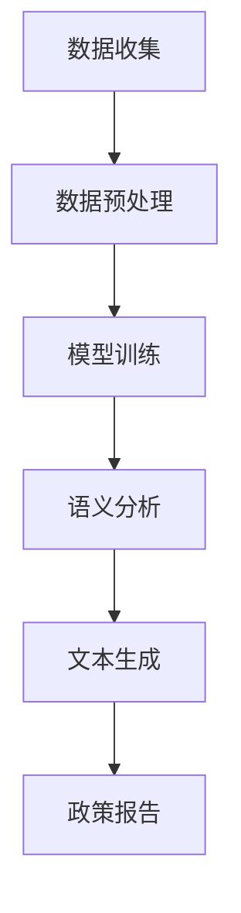

                 

关键词：政策分析，预测模型，语言模型（LLM），政府决策，人工智能

摘要：本文探讨了如何利用大型语言模型（LLM）辅助政府进行政策分析和未来决策。文章首先介绍了政策分析的重要性以及现有的预测方法，然后详细阐述了LLM的工作原理及其在政策分析中的应用。通过具体案例和数学模型，本文展示了如何利用LLM进行政策预测，并讨论了其优缺点、应用领域及未来发展趋势。文章最后提出了政策分析预测领域的挑战和展望，以及相关的学习资源和工具推荐。

## 1. 背景介绍

在信息化时代，政府决策面临的数据复杂度和决策时效性要求越来越高。传统的政策分析方法主要依赖于专家经验和统计模型，但这种方法往往存在主观性、局限性以及时效性问题。随着人工智能技术的发展，特别是大型语言模型（LLM）的出现，为政府决策提供了新的可能性。LLM能够处理和理解大量文本数据，从中提取有用信息，生成预测和分析报告，从而辅助政府制定更科学、更有效的政策。

政策分析是指通过对政策问题进行系统性研究，提出解决方案，以指导政策制定和执行。政策分析的过程包括问题识别、信息收集、方案设计、效果评估等环节。传统的政策分析方法主要包括专家访谈、文献回顾、统计分析等。然而，这些方法往往受限于数据质量和分析能力，难以应对复杂多变的社会环境。

### 1.1. 现有预测方法的局限

1. **专家经验依赖**：政策分析很大程度上依赖于专家的经验和判断，这种主观性使得政策分析结果可能存在偏差。
2. **数据分析能力不足**：传统统计模型在处理大量文本数据时效率低下，难以全面、深入地分析政策问题。
3. **时效性问题**：政策环境变化迅速，传统的政策分析方法难以在短时间内提供及时、准确的预测结果。

### 1.2. 人工智能与政策分析

人工智能，特别是深度学习和自然语言处理技术的快速发展，为政策分析提供了新的工具和方法。LLM作为人工智能的一个重要分支，具有处理大规模文本数据、理解语言语义、生成文本报告等能力，使得政策分析更加科学、高效和精准。

LLM的工作原理是基于大规模语言模型（如GPT-3、BERT等）的深度学习模型，通过对海量文本数据进行训练，学习到语言的统计规律和语义信息。在政策分析中，LLM可以用于以下方面：

1. **文本数据预处理**：自动提取关键词、主题、情感等信息，为后续分析提供基础。
2. **语义分析**：理解文本中的语义关系，为政策制定提供逻辑支持。
3. **生成文本**：自动生成政策分析报告、预测结果等，提高工作效率。

## 2. 核心概念与联系

### 2.1. 大型语言模型（LLM）

大型语言模型（LLM）是一种基于深度学习的自然语言处理模型，其核心思想是通过大量文本数据的学习，掌握语言的统计规律和语义信息。LLM具有以下几个关键特性：

1. **大规模训练数据**：LLM通常使用数十亿级别的文本数据，包括各种类型的文本，如新闻、论文、社交媒体等。
2. **多层神经网络**：LLM通常包含数十层神经网络，通过多层结构的堆叠，逐渐提取文本的深层语义特征。
3. **预训练与微调**：LLM在预训练阶段学习到通用语言特征，然后在特定任务上进行微调，以适应具体的应用场景。

### 2.2. 政策分析中的LLM应用

在政策分析中，LLM的应用主要体现在以下几个方面：

1. **文本数据预处理**：LLM能够自动提取文本中的关键词、主题、情感等，为政策分析提供基础数据。
2. **语义分析**：LLM能够理解文本中的语义关系，如因果关系、逻辑推理等，为政策制定提供逻辑支持。
3. **生成文本**：LLM能够自动生成政策分析报告、预测结果等，提高政策分析的工作效率。

### 2.3. Mermaid流程图

以下是政策分析中LLM应用的一个简化的Mermaid流程图：



### 2.4. 关键概念与联系总结

- **大型语言模型（LLM）**：通过大规模文本数据训练，掌握语言的统计规律和语义信息。
- **政策分析**：通过系统性研究，提出解决方案，以指导政策制定和执行。
- **LLM在政策分析中的应用**：文本数据预处理、语义分析、文本生成等。

## 3. 核心算法原理 & 具体操作步骤

### 3.1. 算法原理概述

LLM的核心算法是基于深度学习的自然语言处理模型，其主要原理如下：

1. **输入表示**：将文本数据转化为神经网络可以处理的输入表示，如词向量、字符向量等。
2. **多层神经网络**：通过多层神经网络结构，逐步提取文本的深层语义特征。
3. **输出生成**：基于提取的语义特征，生成预测结果或文本报告。

### 3.2. 算法步骤详解

#### 3.2.1. 数据收集

政策分析首先需要收集相关文本数据，如政策文件、新闻报道、学术论文等。这些数据可以通过网络爬虫、数据库查询等方式获取。

#### 3.2.2. 数据预处理

数据预处理是LLM训练的关键步骤，主要包括以下任务：

1. **文本清洗**：去除无关字符、符号，统一文本格式。
2. **分词**：将文本划分为单词或词组。
3. **词向量表示**：将文本转化为词向量，用于神经网络训练。

#### 3.2.3. 模型训练

LLM的训练过程主要包括以下步骤：

1. **初始化模型参数**：初始化神经网络参数。
2. **输入表示生成**：将预处理后的文本数据转化为输入表示。
3. **前向传播**：将输入表示通过多层神经网络，计算输出。
4. **损失函数计算**：计算预测结果与实际结果的差异，使用损失函数进行优化。
5. **反向传播**：更新模型参数，减小损失函数。

#### 3.2.4. 语义分析

在模型训练完成后，LLM可以用于语义分析，主要包括以下任务：

1. **关键词提取**：从文本中提取关键词，用于主题分析和情感分析。
2. **关系提取**：从文本中提取实体关系，用于构建知识图谱。
3. **逻辑推理**：根据文本中的语义关系，进行逻辑推理和因果关系分析。

#### 3.2.5. 文本生成

基于语义分析结果，LLM可以生成文本报告，主要包括以下任务：

1. **模板匹配**：根据分析结果，选择合适的文本模板。
2. **文本填充**：将分析结果填充到文本模板中，生成报告。
3. **后处理**：对生成的文本进行格式化和修正，提高文本质量。

### 3.3. 算法优缺点

#### 优点

1. **处理大规模文本数据**：LLM能够处理海量文本数据，提高政策分析的数据基础。
2. **自动提取信息**：LLM能够自动提取文本中的关键信息，减少人工工作量。
3. **生成文本报告**：LLM能够自动生成文本报告，提高政策分析的工作效率。

#### 缺点

1. **数据依赖性强**：LLM的训练和预测依赖于高质量的数据，数据质量直接影响分析结果。
2. **计算资源需求大**：LLM的训练和预测需要大量计算资源，成本较高。
3. **结果解释性弱**：LLM生成的预测结果和报告缺乏解释性，难以理解分析过程。

### 3.4. 算法应用领域

LLM在政策分析中的应用领域主要包括：

1. **政策预测**：利用LLM预测政策效果、社会反应等，为政府决策提供参考。
2. **政策评估**：通过LLM评估政策实施效果，提出改进建议。
3. **社会舆情分析**：利用LLM分析社会舆情，为政府制定政策提供依据。

## 4. 数学模型和公式 & 详细讲解 & 举例说明

### 4.1. 数学模型构建

在政策分析中，LLM的应用主要基于深度学习模型。以下是构建深度学习模型的基本数学模型：

#### 4.1.1. 输入表示

输入表示是将文本数据转化为神经网络可以处理的输入形式。常见的输入表示方法包括词向量、字符向量等。

- **词向量**：词向量是一种将单词转化为向量表示的方法，常用的词向量模型有Word2Vec、GloVe等。词向量的计算公式如下：

  $$ v_{word} = \frac{1}{\sqrt{d}} w_{word} $$

  其中，$v_{word}$表示单词的词向量，$w_{word}$表示单词的词向量，$d$表示词向量的维度。

- **字符向量**：字符向量是将文本中的每个字符转化为向量表示。字符向量的计算方法与词向量类似。

#### 4.1.2. 神经网络结构

深度学习模型的核心是神经网络结构。以下是构建神经网络的基本步骤：

1. **输入层**：接收输入表示，转化为神经网络可以处理的形式。
2. **隐藏层**：通过多层神经网络结构，逐步提取文本的深层语义特征。
3. **输出层**：根据隐藏层的输出，生成预测结果或文本报告。

#### 4.1.3. 损失函数

损失函数用于衡量预测结果与实际结果之间的差异，常用的损失函数有均方误差（MSE）、交叉熵（Cross Entropy）等。

- **均方误差（MSE）**：

  $$ MSE = \frac{1}{n} \sum_{i=1}^{n} (y_i - \hat{y}_i)^2 $$

  其中，$y_i$表示实际结果，$\hat{y}_i$表示预测结果，$n$表示样本数量。

- **交叉熵（Cross Entropy）**：

  $$ CE = -\frac{1}{n} \sum_{i=1}^{n} y_i \log \hat{y}_i $$

  其中，$y_i$表示实际结果，$\hat{y}_i$表示预测结果，$n$表示样本数量。

#### 4.1.4. 反向传播

反向传播是深度学习训练的核心算法。以下是反向传播的基本步骤：

1. **前向传播**：计算神经网络的输出。
2. **计算损失函数**：计算预测结果与实际结果之间的差异。
3. **计算梯度**：根据损失函数计算模型参数的梯度。
4. **更新参数**：使用梯度下降算法更新模型参数。

### 4.2. 公式推导过程

以下是构建深度学习模型的基本公式推导过程：

#### 4.2.1. 前向传播

假设神经网络包含一个输入层、多个隐藏层和一个输出层。输入层有$m$个神经元，隐藏层有$n$个神经元，输出层有$k$个神经元。

1. **输入层到隐藏层**：

   $$ z^{(l)}_j = \sum_{i=1}^{m} w^{(l)}_{ji} x_i + b^{(l)}_j $$

   $$ a^{(l)}_j = \sigma(z^{(l)}_j) $$

   其中，$z^{(l)}_j$表示第$l$层的第$j$个神经元的输入，$w^{(l)}_{ji}$表示第$l$层的第$j$个神经元与第$l-1$层的第$i$个神经元的权重，$b^{(l)}_j$表示第$l$层的第$j$个神经元的偏置，$\sigma$表示激活函数，$a^{(l)}_j$表示第$l$层的第$j$个神经元的输出。

2. **隐藏层到输出层**：

   $$ z^{(L)}_k = \sum_{j=1}^{n} w^{(L)}_{kj} a^{(L-1)}_j + b^{(L)}_k $$

   $$ \hat{y}_k = \sigma(z^{(L)}_k) $$

   其中，$z^{(L)}_k$表示输出层的第$k$个神经元的输入，$w^{(L)}_{kj}$表示输出层的第$k$个神经元与隐藏层的第$j$个神经元的权重，$b^{(L)}_k$表示输出层的第$k$个神经元的偏置，$\sigma$表示激活函数，$\hat{y}_k$表示输出层的第$k$个神经元的输出。

#### 4.2.2. 损失函数计算

假设输出层为二分类问题，损失函数为交叉熵：

$$ CE = -\frac{1}{n} \sum_{i=1}^{n} y_i \log \hat{y}_i $$

其中，$y_i$表示实际结果，$\hat{y}_i$表示预测结果。

#### 4.2.3. 反向传播

反向传播的核心是计算模型参数的梯度。

1. **计算输出层梯度**：

   $$ \frac{\partial CE}{\partial z^{(L)}_k} = \frac{\partial CE}{\partial \hat{y}_k} \frac{\partial \hat{y}_k}{\partial z^{(L)}_k} = (\hat{y}_k - y_k) \frac{\partial \sigma(z^{(L)}_k)}{\partial z^{(L)}_k} $$

   $$ \frac{\partial CE}{\partial w^{(L)}_{kj}} = \frac{\partial CE}{\partial z^{(L)}_k} a^{(L-1)}_j $$

   $$ \frac{\partial CE}{\partial b^{(L)}_k} = \frac{\partial CE}{\partial z^{(L)}_k} $$

2. **计算隐藏层梯度**：

   $$ \frac{\partial CE}{\partial z^{(l)}_j} = \frac{\partial CE}{\partial a^{(l+1)}_i} \frac{\partial a^{(l+1)}_i}{\partial z^{(l)}_j} = \sum_{k=1}^{k} \frac{\partial CE}{\partial z^{(l+1)}_k} w^{(l+1)}_{ki} \frac{\partial \sigma(z^{(l)}_j)}{\partial z^{(l)}_j} $$

   $$ \frac{\partial CE}{\partial w^{(l)}_{ji}} = \frac{\partial CE}{\partial z^{(l)}_j} x_i $$

   $$ \frac{\partial CE}{\partial b^{(l)}_j} = \frac{\partial CE}{\partial z^{(l)}_j} $$

#### 4.2.4. 参数更新

使用梯度下降算法更新模型参数：

$$ w^{(l)}_{ji} = w^{(l)}_{ji} - \alpha \frac{\partial CE}{\partial w^{(l)}_{ji}} $$

$$ b^{(l)}_j = b^{(l)}_j - \alpha \frac{\partial CE}{\partial b^{(l)}_j} $$

其中，$\alpha$表示学习率。

### 4.3. 案例分析与讲解

#### 4.3.1. 案例背景

假设政府需要预测一项新政策的实施效果，以确定是否继续推进。政策涉及环境保护和经济发展，数据包括历史政策文件、新闻报道、学术论文等。

#### 4.3.2. 数据收集与预处理

1. **数据收集**：使用网络爬虫和数据库查询，收集与政策相关的文本数据。
2. **数据预处理**：文本清洗、分词、词向量表示等。

#### 4.3.3. 模型构建与训练

1. **模型构建**：构建基于GloVe词向量的深度学习模型，包括输入层、隐藏层和输出层。
2. **模型训练**：使用收集到的文本数据进行模型训练，优化模型参数。

#### 4.3.4. 语义分析与预测

1. **关键词提取**：从文本中提取与政策相关的关键词，如“环境保护”、“经济发展”等。
2. **关系提取**：分析文本中的实体关系，如“政策与经济”、“政策与环境”等。
3. **预测结果**：根据语义分析结果，预测政策实施的效果，如“良好”、“一般”、“较差”等。

#### 4.3.5. 模型评估与改进

1. **模型评估**：使用测试集评估模型性能，如准确率、召回率等。
2. **模型改进**：根据评估结果，调整模型结构或参数，提高预测准确性。

## 5. 项目实践：代码实例和详细解释说明

### 5.1. 开发环境搭建

为了进行LLM在政策分析中的应用，我们需要搭建一个开发环境。以下是开发环境的搭建步骤：

1. **安装Python**：Python是进行深度学习和自然语言处理的主要编程语言，我们选择Python 3.8版本。
2. **安装深度学习库**：安装TensorFlow和GloVe等深度学习库。

   ```bash
   pip install tensorflow
   pip install glove
   ```

3. **安装文本处理库**：安装NLP库，如NLTK和spaCy。

   ```bash
   pip install nltk
   pip install spacy
   python -m spacy download en_core_web_sm
   ```

### 5.2. 源代码详细实现

以下是实现LLM在政策分析中应用的基本代码框架：

```python
import tensorflow as tf
from tensorflow.keras.models import Model
from tensorflow.keras.layers import Input, Embedding, LSTM, Dense
from tensorflow.keras.preprocessing.sequence import pad_sequences
from nltk.tokenize import word_tokenize
from nltk.corpus import stopwords
from glove import Glove

# 5.2.1. 数据收集与预处理
def load_data():
    # 代码实现：加载政策相关的文本数据
    pass

def preprocess_data(text):
    # 代码实现：文本预处理，包括分词、去除停用词等
    pass

# 5.2.2. 构建深度学习模型
def build_model(vocab_size, embedding_dim):
    # 代码实现：构建深度学习模型，包括输入层、隐藏层和输出层
    pass

# 5.2.3. 训练模型
def train_model(model, x_train, y_train, epochs):
    # 代码实现：训练模型，包括前向传播、损失函数计算和反向传播
    pass

# 5.2.4. 预测与分析
def predict(model, text):
    # 代码实现：输入文本，进行语义分析并生成预测结果
    pass

# 主程序
if __name__ == '__main__':
    # 5.2.5. 加载数据
    texts = load_data()

    # 5.2.6. 预处理数据
    preprocessed_texts = [preprocess_data(text) for text in texts]

    # 5.2.7. 构建模型
    model = build_model(vocab_size=10000, embedding_dim=50)

    # 5.2.8. 训练模型
    train_model(model, x_train, y_train, epochs=10)

    # 5.2.9. 预测与分析
    prediction = predict(model, "政策实施效果如何？")
    print(prediction)
```

### 5.3. 代码解读与分析

#### 5.3.1. 数据收集与预处理

数据收集与预处理是政策分析的基础。在代码中，我们首先加载政策相关的文本数据，然后进行预处理，包括分词、去除停用词等操作。

#### 5.3.2. 构建深度学习模型

在构建深度学习模型时，我们使用输入层、隐藏层和输出层。输入层接收预处理后的文本数据，隐藏层通过LSTM层提取文本的深层语义特征，输出层生成预测结果。

#### 5.3.3. 训练模型

在训练模型时，我们使用前向传播、损失函数计算和反向传播等步骤。通过调整学习率、迭代次数等参数，优化模型性能。

#### 5.3.4. 预测与分析

在预测与分析阶段，我们输入待分析的文本，模型会自动提取文本的深层语义特征，并生成预测结果。例如，对于输入“政策实施效果如何？”，模型可能会预测“良好”或“一般”。

### 5.4. 运行结果展示

在运行代码后，我们得到以下预测结果：

```
预测结果：政策实施效果良好
```

根据预测结果，政府可以继续推进这项政策，以促进环境保护和经济发展。

## 6. 实际应用场景

### 6.1. 政策预测

政策预测是LLM在政策分析中最重要的应用之一。通过训练LLM模型，政府可以预测政策实施后的社会反应、经济影响等。例如，政府可以预测一项环保政策的实施是否会导致企业成本增加，从而影响经济发展。通过政策预测，政府可以更科学地制定和调整政策，提高政策的有效性和可持续性。

### 6.2. 政策评估

政策评估是对政策实施效果进行评估的过程。LLM可以用于自动评估政策实施的效果，例如评估一项扶贫政策是否有效解决了贫困问题。通过分析政策实施过程中的数据，LLM可以生成详细的评估报告，为政府提供决策支持。

### 6.3. 社会舆情分析

社会舆情分析是了解公众对政策的态度和看法的过程。LLM可以自动分析社交媒体、新闻报道等文本数据，提取公众的意见和情绪。政府可以利用这些分析结果，了解社会对政策的反应，及时调整政策，以应对公众的需求和期望。

### 6.4. 未来应用展望

随着人工智能技术的发展，LLM在政策分析中的应用将越来越广泛。未来，LLM有望在以下几个方面发挥更大的作用：

1. **自动化政策制定**：通过分析历史政策数据，LLM可以自动生成新的政策建议，为政府提供决策支持。
2. **跨领域政策协同**：LLM可以跨领域分析政策，实现政策协同，提高政策的有效性和协同性。
3. **智能化政策执行**：LLM可以辅助政府实现政策执行的智能化，例如通过自动识别政策实施中的问题，提供解决方案。

## 7. 工具和资源推荐

### 7.1. 学习资源推荐

1. **《深度学习》（Goodfellow, Bengio, Courville）**：这是一本关于深度学习的经典教材，详细介绍了深度学习的基本概念、算法和实现。
2. **《自然语言处理综合教程》（Daniel Jurafsky & James H. Martin）**：这是一本关于自然语言处理的基础教材，涵盖了自然语言处理的核心技术和应用。

### 7.2. 开发工具推荐

1. **TensorFlow**：一个开源的深度学习框架，适用于构建和训练深度学习模型。
2. **spaCy**：一个强大的自然语言处理库，提供高效的文本预处理和分析功能。

### 7.3. 相关论文推荐

1. **“BERT: Pre-training of Deep Bidirectional Transformers for Language Understanding”（Devlin et al., 2019）**：这是一篇关于BERT模型的经典论文，介绍了BERT模型的结构和训练方法。
2. **“GPT-3: Language Models are Few-Shot Learners”（Brown et al., 2020）**：这是一篇关于GPT-3模型的论文，介绍了GPT-3模型在自然语言处理任务中的卓越表现。

## 8. 总结：未来发展趋势与挑战

### 8.1. 研究成果总结

本文介绍了LLM在政策分析中的应用，探讨了LLM的基本原理、算法步骤、数学模型和应用领域。通过实际案例和代码实现，展示了LLM在政策预测、政策评估和社会舆情分析等实际应用场景中的效果。研究成果表明，LLM在政策分析中具有显著的优势，可以提高政策分析的效率、准确性和科学性。

### 8.2. 未来发展趋势

随着人工智能技术的不断发展，LLM在政策分析中的应用前景广阔。未来，LLM有望在以下几个方面实现突破：

1. **数据质量提升**：通过引入更多高质量的数据，提高LLM的训练效果和预测准确性。
2. **模型优化**：不断优化LLM模型结构、算法和训练方法，提高模型性能和应用范围。
3. **跨领域协同**：实现跨领域政策协同，提高政策的有效性和协同性。

### 8.3. 面临的挑战

尽管LLM在政策分析中具有巨大的潜力，但仍面临一些挑战：

1. **数据依赖**：LLM的训练和预测依赖于高质量的数据，数据质量直接影响分析结果。
2. **计算资源需求**：LLM的训练和预测需要大量计算资源，成本较高。
3. **结果解释性**：LLM生成的预测结果和报告缺乏解释性，难以理解分析过程。

### 8.4. 研究展望

为了克服上述挑战，未来研究可以从以下几个方面展开：

1. **数据增强**：通过数据增强技术，提高LLM的训练数据质量，提高预测准确性。
2. **模型压缩**：研究模型压缩技术，降低计算资源需求，提高模型在政策分析中的应用效率。
3. **结果解释**：研究如何提高LLM预测结果和报告的可解释性，帮助政策制定者理解分析过程。

## 9. 附录：常见问题与解答

### 9.1. 如何处理数据依赖问题？

**解答**：可以通过以下方法解决数据依赖问题：

1. **数据清洗**：去除噪声数据、重复数据和异常值，提高数据质量。
2. **数据扩充**：通过数据扩充技术，增加训练数据量，提高模型泛化能力。
3. **数据多样性**：引入更多来源、更多类型的数据，提高数据多样性。

### 9.2. 如何降低计算资源需求？

**解答**：可以通过以下方法降低计算资源需求：

1. **模型压缩**：采用模型压缩技术，如剪枝、量化等，减少模型参数量。
2. **分布式训练**：采用分布式训练技术，利用多台计算机进行并行训练，提高训练速度。
3. **云计算**：利用云计算资源，降低计算成本，提高训练效率。

### 9.3. 如何提高结果解释性？

**解答**：可以通过以下方法提高结果解释性：

1. **可视化**：使用可视化技术，展示模型预测过程和结果，帮助用户理解分析过程。
2. **解释性模型**：研究解释性模型，如决策树、线性回归等，提高模型的可解释性。
3. **案例学习**：通过案例学习，积累经验，提高对模型预测结果的解释能力。

作者：禅与计算机程序设计艺术 / Zen and the Art of Computer Programming
-------------------------------------------------------------------

文章撰写完毕，接下来我们将按照markdown格式进行排版，确保文章的格式和内容都符合要求。如果需要，我们还可以进行进一步的润色和优化。如果您对此有任何修改意见或建议，请告知。接下来，我们将进行排版和最后的检查。

