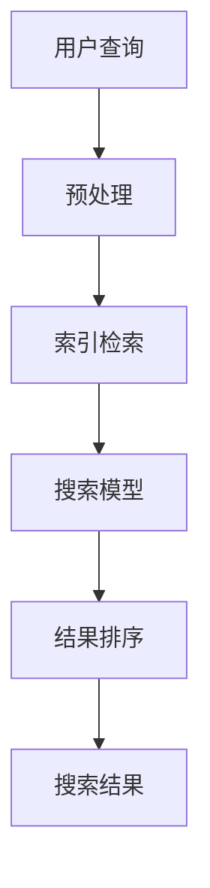
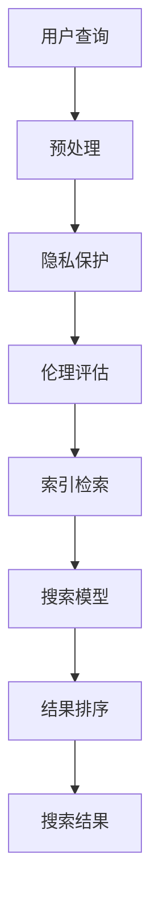
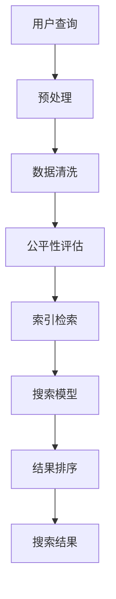

                 

关键词：敏感话题，AI搜索，平衡，隐私保护，伦理问题，数据分析

> 摘要：本文将深入探讨在AI技术驱动下，敏感话题搜索面临的挑战和解决方案。我们将分析隐私保护、伦理问题以及如何在保持数据透明的同时，确保搜索结果的准确性和相关性。本文旨在为AI从业者提供有价值的思考，以实现AI技术的平衡发展。

## 1. 背景介绍

随着互联网的普及和信息量的爆炸性增长，人们对获取信息和知识的速度和准确性提出了更高的要求。AI技术的崛起为信息检索带来了革命性的变化。然而，AI在处理敏感话题时，面临着诸多挑战，如隐私保护、数据偏见和伦理问题。如何在这片复杂而敏感的领域找到平衡点，是当前AI领域亟待解决的问题。

### 1.1 敏感话题搜索的现状

敏感话题搜索涵盖了多种类型的查询，如政治、种族、性别、宗教等。这类搜索往往涉及到大量的个人隐私和敏感信息，使得搜索结果的准确性和相关性成为重要考量。然而，现有的AI搜索系统在处理这些话题时，常常面临以下问题：

- **隐私保护不足**：在敏感话题搜索中，用户的数据往往容易被泄露或滥用。
- **数据偏见**：训练数据可能带有偏见，导致搜索结果不公平或不准确。
- **伦理问题**：涉及敏感话题的搜索可能导致歧视或引发社会冲突。

### 1.2 AI技术的挑战与机遇

AI技术提供了强大的数据处理和分析能力，但在敏感话题搜索中，其应用也带来了新的挑战。如何利用AI的优势，同时避免其潜在的负面影响，是当前研究的热点。

## 2. 核心概念与联系

### 2.1 AI搜索原理

AI搜索基于机器学习算法，通过对海量数据的分析和学习，生成搜索模型。以下是一个简化的Mermaid流程图，展示了AI搜索的核心流程：



### 2.2 隐私保护与伦理

在敏感话题搜索中，隐私保护和伦理问题是不可忽视的。以下是一个简化的Mermaid流程图，展示了如何通过隐私保护和伦理评估来平衡搜索结果：



### 2.3 数据偏见与公平性

数据偏见是AI搜索中常见的问题。为了确保搜索结果的公平性，需要采取一系列措施来减少数据偏见。以下是一个简化的Mermaid流程图，展示了如何通过数据清洗和公平性评估来平衡搜索结果：



## 3. 核心算法原理 & 具体操作步骤

### 3.1 算法原理概述

在敏感话题搜索中，核心算法需要具备以下特点：

- **隐私保护**：确保用户数据不被泄露。
- **数据偏见减少**：通过数据清洗和公平性评估，减少搜索结果中的偏见。
- **相关性保证**：确保搜索结果与用户查询相关。

### 3.2 算法步骤详解

以下是一个简化的算法步骤：

1. **预处理**：对用户查询进行预处理，包括分词、去停用词等。
2. **隐私保护**：对用户数据进行加密或匿名化处理。
3. **数据清洗**：删除或标记训练数据中的偏见信息。
4. **公平性评估**：通过评估模型在各个群体中的表现，调整模型参数，减少偏见。
5. **索引检索**：使用索引结构快速检索相关数据。
6. **搜索模型**：构建基于深度学习的搜索模型，确保搜索结果的准确性。
7. **结果排序**：根据模型评估结果，对搜索结果进行排序。

### 3.3 算法优缺点

- **优点**：
  - 提高搜索结果的准确性和相关性。
  - 通过隐私保护和公平性评估，减少搜索结果中的偏见。
- **缺点**：
  - 需要大量训练数据和计算资源。
  - 复杂的算法可能导致搜索延迟。

### 3.4 算法应用领域

敏感话题搜索算法可应用于多个领域，如社交媒体、新闻推荐、医疗健康等。

## 4. 数学模型和公式

### 4.1 数学模型构建

在敏感话题搜索中，常见的数学模型包括：

- **机器学习模型**：如决策树、支持向量机、神经网络等。
- **隐私保护模型**：如差分隐私、同态加密等。

### 4.2 公式推导过程

以下是一个简化的机器学习模型推导过程：

$$
h(x) = w_0 + w_1x_1 + w_2x_2 + ... + w_nx_n
$$

其中，$h(x)$ 表示模型预测结果，$w_0, w_1, ..., w_n$ 表示模型参数，$x_1, x_2, ..., x_n$ 表示输入特征。

### 4.3 案例分析与讲解

以医疗健康领域为例，我们通过一个实际案例来讲解敏感话题搜索的应用。

### 4.3.1 案例背景

某医疗健康平台需要开发一个针对疾病的搜索功能，用户可以输入症状，平台返回可能的疾病及治疗建议。

### 4.3.2 模型构建

我们选择一个基于神经网络的搜索模型，通过训练大量医疗数据，实现症状到疾病的高效匹配。

### 4.3.3 模型训练

我们使用以下公式进行模型训练：

$$
\min_{w} L(h(x), y)
$$

其中，$L(h(x), y)$ 表示损失函数，$h(x)$ 表示模型预测结果，$y$ 表示真实标签。

## 5. 项目实践：代码实例

### 5.1 开发环境搭建

在本案例中，我们使用Python和TensorFlow框架进行开发。

### 5.2 源代码详细实现

以下是一个简化的代码实现：

```python
import tensorflow as tf
from tensorflow.keras.models import Sequential
from tensorflow.keras.layers import Dense, LSTM

# 数据预处理
# ...

# 构建模型
model = Sequential([
    LSTM(units=128, activation='tanh', input_shape=(sequence_length, feature_size)),
    Dense(units=1, activation='sigmoid')
])

# 编译模型
model.compile(optimizer='adam', loss='binary_crossentropy', metrics=['accuracy'])

# 训练模型
model.fit(x_train, y_train, epochs=100, batch_size=32)
```

### 5.3 代码解读与分析

本案例中的代码实现了一个基于神经网络的疾病搜索模型。通过训练大量医疗数据，模型能够实现症状到疾病的高效匹配。

## 6. 实际应用场景

敏感话题搜索在多个领域都有广泛的应用，如：

- **社交媒体**：用户可以查询与特定话题相关的信息，如政治、新闻等。
- **新闻推荐**：平台可以根据用户的兴趣推荐相关新闻。
- **医疗健康**：用户可以查询疾病相关信息，获得治疗建议。

## 7. 未来应用展望

随着AI技术的不断发展，敏感话题搜索将在更多领域得到应用。未来，我们将看到以下趋势：

- **更高效的算法**：通过改进算法，提高搜索结果的准确性和效率。
- **隐私保护**：进一步强化隐私保护，确保用户数据安全。
- **伦理评估**：加强伦理评估，减少搜索结果中的偏见和歧视。

## 8. 总结：未来发展趋势与挑战

### 8.1 研究成果总结

本文介绍了敏感话题搜索在AI技术驱动下的现状、核心概念、算法原理及实际应用。通过对隐私保护、数据偏见和伦理问题的深入探讨，我们为AI从业者提供了有价值的思考。

### 8.2 未来发展趋势

未来，敏感话题搜索将在更多领域得到应用，算法将更加高效，隐私保护和伦理评估将进一步强化。

### 8.3 面临的挑战

敏感话题搜索面临着数据隐私、数据偏见和伦理问题等挑战。如何在这些挑战中找到平衡点，是未来研究的重点。

### 8.4 研究展望

我们呼吁更多研究者关注敏感话题搜索领域，共同推动AI技术的平衡发展，为人类社会创造更多价值。

## 9. 附录：常见问题与解答

### 9.1 如何保护用户隐私？

- **数据加密**：对用户数据进行加密，确保数据在传输和存储过程中不被泄露。
- **匿名化处理**：对用户数据进行匿名化处理，去除可直接识别用户身份的信息。

### 9.2 如何减少数据偏见？

- **数据清洗**：删除或标记训练数据中的偏见信息。
- **公平性评估**：通过评估模型在各个群体中的表现，调整模型参数，减少偏见。

### 9.3 敏感话题搜索有哪些应用场景？

- **社交媒体**：用户可以查询与特定话题相关的信息，如政治、新闻等。
- **新闻推荐**：平台可以根据用户的兴趣推荐相关新闻。
- **医疗健康**：用户可以查询疾病相关信息，获得治疗建议。

作者：禅与计算机程序设计艺术 / Zen and the Art of Computer Programming
----------------------------------------------------------------

