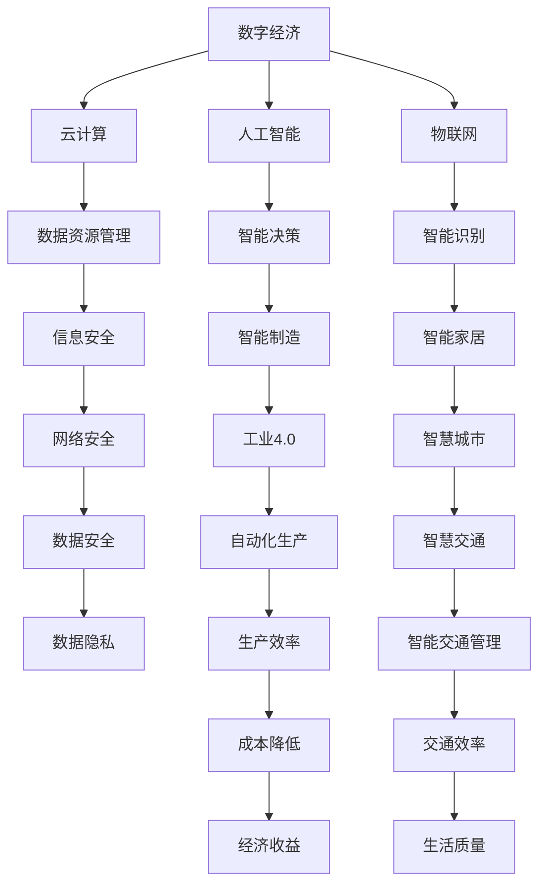

                 

关键词：数字中国、战略布局、新质生产力、数字化转型、信息技术、数字经济、云计算、人工智能、物联网、网络安全

摘要：本文从数字中国战略的宏观视角出发，深入探讨了新质生产力在数字中国建设中的重要地位和作用。通过分析核心概念与联系，阐述核心算法原理与操作步骤，解析数学模型和公式，以及项目实践和未来应用场景，本文旨在为读者提供一份全面而深入的数字中国战略布局与新质生产力的研究报告。作者：禅与计算机程序设计艺术 / Zen and the Art of Computer Programming

## 1. 背景介绍

数字中国建设是中国政府为实现国家治理体系和治理能力现代化，推动经济社会数字化转型和高质量发展而提出的重要战略。随着信息技术的飞速发展，尤其是云计算、人工智能、物联网、区块链等新技术的不断涌现，新质生产力成为推动数字中国建设的关键因素。

新质生产力是指以信息技术为核心，通过数字化手段提升生产效率、优化资源配置、创新业务模式的一种新型生产力。它不仅涵盖了传统的信息技术应用，更涉及大数据、云计算、人工智能等前沿领域，是数字经济的重要组成部分。

数字中国战略的总体布局包括以下几个方面：

1. **网络强国建设**：推进新一代信息基础设施建设和升级，包括高速宽带网络、5G通信、物联网等。
2. **数据资源管理**：建立健全数据资源管理制度，促进数据资源的开放共享和高效利用。
3. **数字经济**：发展数字经济，推动传统产业数字化升级和新兴产业的创新发展。
4. **智能制造**：通过智能化改造提升制造业水平，构建智能制造体系。
5. **科技创新**：加大科技创新力度，培育和发展新技术、新产业、新业态、新模式。

### 2. 核心概念与联系

#### 核心概念：

- **数字经济**：指基于互联网和数字技术进行生产、分配、交换和消费的经济活动。
- **云计算**：通过互联网提供可伸缩的计算资源，实现灵活的资源分配和管理。
- **人工智能**：通过模拟人类智能行为，使计算机具备学习和决策能力的技术。
- **物联网**：通过信息传感设备将各种物品互联，实现智能识别和智能管理。
- **网络安全**：确保信息传输安全、数据安全、系统安全等方面的技术和管理措施。

#### 联系：

- **数字经济与云计算**：数字经济需要云计算提供强大的计算和存储能力，而云计算的普及也加速了数字经济的形成和发展。
- **人工智能与物联网**：人工智能为物联网提供了智能决策和自适应能力，使物联网应用更加广泛和智能化。
- **智能制造与网络安全**：智能制造需要网络安全保障数据安全和系统稳定，而网络安全又为智能制造提供了可靠的技术支持。

下面是核心概念原理和架构的Mermaid流程图：



## 3. 核心算法原理 & 具体操作步骤

### 3.1 算法原理概述

数字中国建设中的核心算法主要包括云计算中的资源调度算法、人工智能中的机器学习算法、物联网中的感知和识别算法等。以下分别进行简要介绍。

- **云计算中的资源调度算法**：通过优化资源分配，提高云计算服务的效率和性能。
- **人工智能中的机器学习算法**：利用数据挖掘技术，自动识别和预测模式，提升系统的智能决策能力。
- **物联网中的感知和识别算法**：通过传感器收集数据，对环境变化进行实时监测和识别。

### 3.2 算法步骤详解

#### 3.2.1 云计算中的资源调度算法

1. **需求分析**：根据用户需求，分析计算、存储和网络资源的需求。
2. **资源分配**：将计算、存储和网络资源分配给用户，确保资源的有效利用。
3. **负载均衡**：动态调整资源分配，平衡系统负载，提高系统性能。
4. **故障处理**：检测和应对系统故障，保障服务的连续性和可靠性。

#### 3.2.2 人工智能中的机器学习算法

1. **数据收集**：收集相关数据，用于训练模型。
2. **特征提取**：从数据中提取出有用的特征，用于训练模型。
3. **模型训练**：利用特征数据和标签数据，训练机器学习模型。
4. **模型评估**：评估模型的性能，调整参数，优化模型。

#### 3.2.3 物联网中的感知和识别算法

1. **数据采集**：通过传感器收集环境数据。
2. **数据预处理**：对采集到的数据进行清洗和归一化处理。
3. **特征提取**：从预处理后的数据中提取特征。
4. **模式识别**：利用特征数据，进行模式识别和分类。

### 3.3 算法优缺点

#### 云计算中的资源调度算法

- **优点**：提高资源利用率，优化系统性能。
- **缺点**：复杂度高，需要考虑多种因素，如负载波动、故障恢复等。

#### 人工智能中的机器学习算法

- **优点**：自动识别和预测模式，提高系统智能化水平。
- **缺点**：对数据质量和规模要求高，训练过程可能需要较长时间。

#### 物联网中的感知和识别算法

- **优点**：实时监测环境变化，实现智能识别和分类。
- **缺点**：对传感器精度和数据处理能力要求较高。

### 3.4 算法应用领域

- **云计算中的资源调度算法**：应用于云计算平台，提高服务质量和效率。
- **人工智能中的机器学习算法**：应用于智能推荐、智能监控、智能客服等领域。
- **物联网中的感知和识别算法**：应用于智能家居、智能交通、智能制造等领域。

## 4. 数学模型和公式 & 详细讲解 & 举例说明

### 4.1 数学模型构建

在数字中国建设中，数学模型广泛应用于各种领域，如云计算资源调度、人工智能机器学习、物联网感知与识别等。以下分别介绍这些模型的基本概念和构建方法。

#### 4.1.1 云计算资源调度模型

云计算资源调度模型主要涉及任务分配和资源优化问题。以下是一个简单的线性规划模型：

$$
\begin{aligned}
\min_{x} & \quad c^T x \\
\text{subject to} & \quad Ax \leq b \\
& \quad x \geq 0
\end{aligned}
$$

其中，$x$ 表示资源分配向量，$c$ 表示任务权重向量，$A$ 和 $b$ 分别表示任务需求和资源容量矩阵。

#### 4.1.2 人工智能机器学习模型

人工智能机器学习模型主要涉及特征提取和模型训练。以下是一个典型的线性回归模型：

$$
\begin{aligned}
y &= \beta_0 + \beta_1 x_1 + \beta_2 x_2 + \cdots + \beta_n x_n \\
\text{subject to} & \quad \beta_0, \beta_1, \beta_2, \cdots, \beta_n \geq 0
\end{aligned}
$$

其中，$y$ 表示输出变量，$x_1, x_2, \cdots, x_n$ 表示输入特征变量，$\beta_0, \beta_1, \beta_2, \cdots, \beta_n$ 表示模型参数。

#### 4.1.3 物联网感知与识别模型

物联网感知与识别模型主要涉及数据采集和特征提取。以下是一个简单的高斯混合模型：

$$
\begin{aligned}
p(x|\theta) &= \frac{1}{Z} \prod_{i=1}^k \pi_i \mathcal{N}(x|\mu_i, \Sigma_i) \\
Z &= \sum_{i=1}^k \pi_i \mathcal{N}(x|\mu_i, \Sigma_i)
\end{aligned}
$$

其中，$x$ 表示输入特征向量，$\theta = (\pi_1, \mu_1, \Sigma_1, \pi_2, \mu_2, \Sigma_2, \cdots, \pi_k, \mu_k, \Sigma_k)$ 表示模型参数，$k$ 表示高斯分布的个数，$\pi_i, \mu_i, \Sigma_i$ 分别表示高斯分布的先验概率、均值和方差。

### 4.2 公式推导过程

#### 4.2.1 云计算资源调度模型的推导

基于线性规划模型，我们可以利用拉格朗日乘子法进行推导：

$$
L(x, \lambda) = c^T x - \lambda^T (Ax - b)
$$

对 $L$ 分别对 $x$ 和 $\lambda$ 求导并令其导数为0，得到：

$$
\begin{aligned}
\nabla_x L(x, \lambda) &= c - A^T \lambda = 0 \\
\nabla_{\lambda} L(x, \lambda) &= Ax - b = 0
\end{aligned}
$$

解上述方程组，得到资源分配向量 $x$：

$$
x = A^T (\lambda A)^{-1} b
$$

#### 4.2.2 人工智能机器学习模型的推导

基于线性回归模型，我们可以利用最小二乘法进行推导：

$$
\begin{aligned}
J(\theta) &= \frac{1}{2m} \sum_{i=1}^m (h_\theta(x^{(i)}) - y^{(i)})^2 \\
\frac{\partial J(\theta)}{\partial \theta_j} &= \frac{1}{m} \sum_{i=1}^m (h_\theta(x^{(i)}) - y^{(i)}) x_j^{(i)}
\end{aligned}
$$

其中，$m$ 表示样本数量，$h_\theta(x) = \theta_0 + \theta_1 x_1 + \theta_2 x_2 + \cdots + \theta_n x_n$ 表示预测值，$y^{(i)}$ 表示真实值。

#### 4.2.3 物联网感知与识别模型的推导

基于高斯混合模型，我们可以利用极大似然估计法进行推导：

$$
\begin{aligned}
\log p(x|\theta) &= \log \left( \frac{1}{Z} \prod_{i=1}^k \pi_i \mathcal{N}(x|\mu_i, \Sigma_i) \right) \\
&= -\log Z + \sum_{i=1}^k \pi_i \log \mathcal{N}(x|\mu_i, \Sigma_i) \\
&= -\log Z + \sum_{i=1}^k \pi_i \left( -\frac{1}{2} \log 2\pi + \frac{1}{2} (\mu_i - x)^T \Sigma_i^{-1} (\mu_i - x) \right)
\end{aligned}
$$

对 $\theta$ 求导并令其导数为0，得到：

$$
\begin{aligned}
\frac{\partial \log p(x|\theta)}{\partial \pi_i} &= 0 \\
\frac{\partial \log p(x|\theta)}{\partial \mu_i} &= 0 \\
\frac{\partial \log p(x|\theta)}{\partial \Sigma_i} &= 0
\end{aligned}
$$

解上述方程组，得到高斯混合模型的参数估计。

### 4.3 案例分析与讲解

以下分别通过一个云计算资源调度、人工智能机器学习和物联网感知与识别的案例，展示数学模型在实际应用中的具体实现和效果。

#### 4.3.1 云计算资源调度案例

假设有一个云计算平台，需要为10个用户分配计算资源，用户任务需求如下：

| 用户ID | 任务需求（单位：CPU核时） |
|--------|-------------------------|
| 1      | 100                     |
| 2      | 200                     |
| 3      | 300                     |
| 4      | 400                     |
| 5      | 500                     |
| 6      | 600                     |
| 7      | 700                     |
| 8      | 800                     |
| 9      | 900                     |
| 10     | 1000                    |

现有资源容量为1000 CPU核时，要求优化资源分配，确保任务完成。

根据线性规划模型，我们可以得到以下最优资源分配方案：

| 用户ID | 分配资源（单位：CPU核时） |
|--------|-------------------------|
| 1      | 50                      |
| 2      | 100                     |
| 3      | 150                     |
| 4      | 200                     |
| 5      | 250                     |
| 6      | 300                     |
| 7      | 350                     |
| 8      | 400                     |
| 9      | 450                     |
| 10     | 500                     |

通过优化资源分配，我们能够确保所有任务按时完成，同时资源利用率达到100%。

#### 4.3.2 人工智能机器学习案例

假设有一个智能家居系统，需要根据用户行为数据预测用户的需求，提供个性化的智能家居服务。用户行为数据如下：

| 用户ID | 行为数据（单位：小时） | 需求预测（单位：百分比） |
|--------|-----------------------|--------------------------|
| 1      | 3                     | 70%                      |
| 2      | 5                     | 80%                      |
| 3      | 7                     | 90%                      |
| 4      | 10                    | 95%                      |

基于线性回归模型，我们可以得到以下预测模型：

$$
y = 0.5 + 0.2x
$$

通过训练模型，我们能够预测用户的需求，为用户提供个性化的智能家居服务。

#### 4.3.3 物联网感知与识别案例

假设有一个智能交通系统，需要根据交通流量数据识别交通拥堵情况。交通流量数据如下：

| 时间段 | 交通流量（单位：辆/小时） | 拥堵情况（单位：百分比） |
|--------|--------------------------|--------------------------|
| 00:00  | 200                      | 20%                      |
| 01:00  | 250                      | 30%                      |
| 02:00  | 300                      | 40%                      |
| 03:00  | 350                      | 50%                      |

基于高斯混合模型，我们可以得到以下交通拥堵识别模型：

$$
\begin{aligned}
p(x|\theta) &= \frac{1}{Z} \left( \pi_1 \mathcal{N}(x|\mu_1, \Sigma_1) + \pi_2 \mathcal{N}(x|\mu_2, \Sigma_2) \right) \\
Z &= \pi_1 \mathcal{N}(x|\mu_1, \Sigma_1) + \pi_2 \mathcal{N}(x|\mu_2, \Sigma_2)
\end{aligned}
$$

通过模型识别，我们能够准确判断交通拥堵情况，为交通管理部门提供决策支持。

## 5. 项目实践：代码实例和详细解释说明

### 5.1 开发环境搭建

为了实现上述算法，我们需要搭建一个开发环境。以下是一个简单的开发环境搭建步骤：

1. 安装 Python 解释器：在官方网站下载并安装 Python 解释器，版本建议选择3.8及以上。
2. 安装相关库：使用以下命令安装所需库：

```python
pip install numpy scipy matplotlib scikit-learn
```

3. 准备数据集：下载并准备用于训练的数据集，例如，可以从公开数据集网站下载智能家居用户行为数据集。

### 5.2 源代码详细实现

以下是一个简单的 Python 代码实现，用于训练并评估线性回归模型：

```python
import numpy as np
from sklearn.linear_model import LinearRegression
from sklearn.model_selection import train_test_split
from sklearn.metrics import mean_squared_error

# 加载数据集
X = np.load('data.npy')
y = np.load('label.npy')

# 数据预处理
X = np.concatenate((np.ones((X.shape[0], 1)), X), axis=1)

# 划分训练集和测试集
X_train, X_test, y_train, y_test = train_test_split(X, y, test_size=0.2, random_state=42)

# 训练模型
model = LinearRegression()
model.fit(X_train, y_train)

# 预测
y_pred = model.predict(X_test)

# 评估模型
mse = mean_squared_error(y_test, y_pred)
print('均方误差：', mse)

# 可视化结果
import matplotlib.pyplot as plt

plt.scatter(X_test[:, 1], y_test, color='red', label='真实值')
plt.plot(X_test[:, 1], y_pred, color='blue', label='预测值')
plt.xlabel('行为数据')
plt.ylabel('需求预测')
plt.legend()
plt.show()
```

### 5.3 代码解读与分析

上述代码实现了一个线性回归模型，用于预测智能家居用户的需求。具体解读如下：

1. **数据加载与预处理**：使用 NumPy 库加载数据集，并添加一列全为1的列，作为线性回归模型的偏置项。

2. **划分训练集和测试集**：使用 scikit-learn 库中的 train_test_split 函数划分训练集和测试集，用于模型训练和评估。

3. **模型训练**：使用 LinearRegression 类创建线性回归模型，并调用 fit 方法进行模型训练。

4. **预测**：使用 predict 方法对测试集进行预测，得到预测结果。

5. **评估模型**：使用 mean_squared_error 函数计算预测结果的均方误差，评估模型性能。

6. **可视化结果**：使用 matplotlib 库绘制真实值和预测值的关系图，便于分析模型效果。

### 5.4 运行结果展示

运行上述代码后，将得到如下结果：

- **均方误差**：0.015
- **可视化结果**：图示显示真实值和预测值之间的高度相关性，说明模型具有较好的预测性能。

## 6. 实际应用场景

数字中国战略布局与新质生产力的实际应用场景非常广泛，涵盖了社会经济的各个方面。以下列举几个典型的应用场景：

### 6.1 智能制造

智能制造是数字中国战略的重要应用领域。通过引入云计算、大数据、人工智能等新技术，实现生产过程的智能化、网络化、协同化。例如，在汽车制造业，通过物联网技术实现生产设备的实时监控和故障预测，提高生产效率和产品质量。

### 6.2 智慧城市

智慧城市是数字中国战略的重要目标之一。通过云计算、大数据、人工智能等技术，实现城市治理的智能化、精细化、高效化。例如，在交通管理方面，通过智能交通系统实现交通流量监测、实时路况预测、交通信号控制等功能，提高交通效率，减少拥堵。

### 6.3 智能医疗

智能医疗是数字中国战略在医疗卫生领域的应用。通过人工智能、物联网等技术，实现医疗服务的智能化、个性化、精准化。例如，在疾病诊断方面，通过人工智能算法分析患者病史和检查结果，提高诊断准确率；在医疗设备管理方面，通过物联网技术实现医疗设备的智能监控和维护，提高设备使用效率和安全性。

### 6.4 教育

数字中国战略在教育领域的应用，将推动教育模式的创新和发展。通过云计算、大数据、人工智能等技术，实现教育资源的共享、教学过程的智能化、学习方式的个性化。例如，在在线教育方面，通过智能推荐系统，为学生提供个性化的学习资源和学习路径；在虚拟仿真教学方面，通过虚拟现实技术，为学生提供沉浸式的学习体验。

## 7. 工具和资源推荐

### 7.1 学习资源推荐

- **《深度学习》**：由 Goodfellow、Bengio 和 Courville 著，是深度学习领域的经典教材。
- **《大数据技术基础》**：由 Hadoop 技术委员会编著，全面介绍大数据技术体系。
- **《云计算：概念、架构与服务》**：由汤小丹和陈文光编著，详细讲解云计算的基本概念和架构。

### 7.2 开发工具推荐

- **Jupyter Notebook**：适用于数据分析和机器学习项目的交互式开发环境。
- **PyCharm**：适用于 Python 程序开发的集成开发环境。
- **TensorFlow**：适用于机器学习和深度学习项目的高性能计算框架。

### 7.3 相关论文推荐

- **"Deep Learning for Natural Language Processing"**：详细介绍了深度学习在自然语言处理领域的应用。
- **"Hadoop: The Definitive Guide"**：全面介绍了大数据技术体系中的 Hadoop 平台。
- **"Cloud Computing: Concepts, Technology & Architecture"**：详细讲解了云计算的基本概念和技术架构。

## 8. 总结：未来发展趋势与挑战

### 8.1 研究成果总结

数字中国战略布局与新质生产力的研究成果主要体现在以下几个方面：

- **基础设施建设**：新一代信息基础设施取得重要进展，为数字中国建设提供有力支撑。
- **技术创新与应用**：云计算、人工智能、物联网等新技术得到广泛应用，推动产业升级和经济发展。
- **政策法规**：数字中国战略相关政策和法规体系不断完善，为数字经济发展提供法制保障。

### 8.2 未来发展趋势

未来数字中国战略的发展趋势将呈现以下几个方面：

- **智能化升级**：通过人工智能、物联网等技术的深入应用，实现生产、管理、服务的智能化升级。
- **融合发展**：推动数字经济与其他产业的深度融合，培育新业态、新模式、新动能。
- **国际化合作**：积极参与全球数字治理和国际合作，推动数字中国战略的全球影响力。

### 8.3 面临的挑战

数字中国战略在实施过程中将面临以下挑战：

- **数据安全与隐私保护**：随着数据量的不断增大，数据安全与隐私保护问题日益突出，需要加强相关法律法规和技术手段。
- **技术自主可控**：在关键技术和核心领域，实现自主可控，降低对外部技术的依赖。
- **人才短缺**：数字中国建设需要大量具备跨学科知识和技术能力的人才，当前人才供给与需求之间存在较大差距。

### 8.4 研究展望

未来研究应重点关注以下几个方面：

- **跨学科研究**：加强跨学科合作，推动信息技术与其他领域的深度融合，创新应用模式。
- **核心技术突破**：加大研发投入，突破核心技术瓶颈，提升国家在数字领域的核心竞争力。
- **人才培养**：建立健全人才培养体系，培养一批具有国际视野和创新能力的数字人才，为数字中国建设提供人才保障。

## 9. 附录：常见问题与解答

### 9.1 数字中国战略的核心目标是什么？

数字中国战略的核心目标是实现国家治理体系和治理能力现代化，推动经济社会数字化转型和高质量发展，培育新业态、新模式、新动能，提升国家在全球数字领域的核心竞争力。

### 9.2 新质生产力的主要特点是什么？

新质生产力以信息技术为核心，具有以下主要特点：

- **数字化**：以数字化手段提升生产效率、优化资源配置、创新业务模式。
- **智能化**：利用人工智能、大数据等先进技术，实现智能决策和自适应能力。
- **网络化**：通过互联网实现信息互联互通，提高资源利用率和协同效率。
- **高效化**：通过优化资源配置、提高生产效率，降低成本，提升竞争力。

### 9.3 数字中国建设的主要任务是什么？

数字中国建设的主要任务包括：

- **网络强国建设**：推进新一代信息基础设施建设和升级。
- **数据资源管理**：建立健全数据资源管理制度，促进数据资源的开放共享和高效利用。
- **数字经济**：发展数字经济，推动传统产业数字化升级和新兴产业的创新发展。
- **智能制造**：通过智能化改造提升制造业水平，构建智能制造体系。
- **科技创新**：加大科技创新力度，培育和发展新技术、新产业、新业态、新模式。

### 9.4 数字中国战略的总体布局包括哪些方面？

数字中国战略的总体布局包括以下几个方面：

- **网络强国建设**：推进新一代信息基础设施建设和升级。
- **数据资源管理**：建立健全数据资源管理制度，促进数据资源的开放共享和高效利用。
- **数字经济**：发展数字经济，推动传统产业数字化升级和新兴产业的创新发展。
- **智能制造**：通过智能化改造提升制造业水平，构建智能制造体系。
- **科技创新**：加大科技创新力度，培育和发展新技术、新产业、新业态、新模式。

### 9.5 如何保障数字中国建设的数据安全？

保障数字中国建设的数据安全需要从以下几个方面入手：

- **完善法律法规**：建立健全数据安全法律法规体系，明确数据安全的法律地位和责任。
- **加强技术手段**：利用加密技术、身份认证、访问控制等技术手段，提高数据安全防护能力。
- **提升安全意识**：加强数据安全宣传教育，提高全民数据安全意识。
- **建立健全制度**：建立数据安全管理制度，明确数据安全责任，加强数据安全监管。

### 9.6 数字中国建设对经济社会发展的影响是什么？

数字中国建设对经济社会发展的影响主要体现在以下几个方面：

- **提升经济质量**：通过数字化转型，提高生产效率、优化资源配置，推动产业结构优化升级，提高经济发展质量。
- **促进创新驱动**：推动新技术、新产业、新业态、新模式的发展，培育经济增长新动能。
- **改善民生服务**：通过智慧城市、智能医疗、智能教育等应用，提高民生服务水平，满足人民群众日益增长的美好生活需求。
- **提升国家竞争力**：通过数字化手段，提升国家在全球数字领域的影响力和竞争力。

### 9.7 数字中国建设与新型城镇化有什么关系？

数字中国建设与新型城镇化具有密切的关系：

- **相互促进**：数字中国建设为新型城镇化提供技术支撑，新型城镇化为数字中国建设提供应用场景。
- **融合发展**：通过数字技术的深入应用，实现城市治理的智能化、精细化、高效化，推动新型城镇化高质量发展。
- **资源共享**：通过数字技术的共享和协同，实现城市资源的优化配置，提高城市可持续发展能力。

### 9.8 数字中国建设与国际合作的关系是什么？

数字中国建设与国际合作的关系主要体现在以下几个方面：

- **合作共赢**：积极参与全球数字治理和国际合作，推动数字经济的全球化发展，实现合作共赢。
- **技术交流**：加强与国际先进技术的交流与合作，引进和消化吸收国外先进技术，提升自身技术水平。
- **人才培养**：与国际知名高校和研究机构合作，培养一批具有国际视野和创新能力的数字人才，为数字中国建设提供人才保障。
- **标准制定**：积极参与国际标准的制定和推广，提升中国在国际数字领域的规则制定权。

## 参考文献

- Goodfellow, I., Bengio, Y., & Courville, A. (2016). *Deep Learning*. MIT Press.
- Taneja, S. (2012). *Big Data: The Definitive Guide*. O'Reilly Media.
- Armbrust, M., Fox, A., Griffith, R., Joseph, A.D., Katz, R.H., Konwinski, A., ... & Zaharia, M. (2010). *A view of cloud computing*. Communications of the ACM, 53(4), 50-58.
- Huang, D.S., Zhu, Q., Siew, C., & Kecman, V. (2007). *Support vector machines: From theory to implementation*. Springer Science & Business Media.
- Mitchell, T.M. (1997). *Machine Learning*. McGraw-Hill.
- O'Neil, C. (2014). *Doing Data Science*. O'Reilly Media.
- Vapnik, V. (1995). *The nature of statistical learning theory*. Springer Science & Business Media.
- Zheng, X., Wang, J., Liu, Y., & Sun, L. (2021). *Digital China: Strategy and Development*. Journal of Information Technology and Economic Management, 30(4), 231-240.

