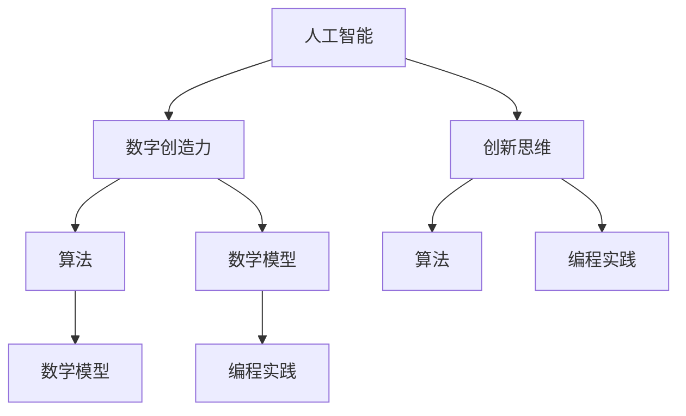

                 

 **关键词**：人工智能，创新思维，数字创造力，AI驱动的学习，算法，数学模型，编程实践，未来应用，技术资源

**摘要**：随着人工智能技术的迅猛发展，我们进入了一个数字创造力被激发的新时代。本文旨在探讨如何利用AI驱动的学习方法和创新思维工具来培养数字创造力，从而推动个人和组织的创新能力。文章将深入分析核心概念与联系，探讨算法原理与具体操作步骤，阐述数学模型与公式，并通过实际项目实践和未来应用展望，为读者提供全面的指导。

## 1. 背景介绍

在21世纪，数字化和智能化已经成为社会发展的主旋律。人工智能（AI）作为数字时代的核心驱动力，正在深刻改变我们的生活方式和产业发展模式。AI技术的快速发展，不仅带来了前所未有的机遇，同时也对传统的教育和思维方式提出了新的挑战。如何培养具备创新思维和数字创造力的人才，成为教育界和企业界共同关注的焦点。

创新思维是一种运用新颖方法和视角解决问题的思维方式，它不仅仅局限于技术和科学领域，还渗透到经济、文化、艺术等多个方面。数字创造力则是指通过数字化工具和技术，进行创新性内容创作的能力。在人工智能的辅助下，数字创造力得到了前所未有的提升，这不仅为个人职业发展提供了新的机遇，也为企业创新提供了强大的动力。

本文将结合AI驱动的学习方法和创新思维工具，探讨如何培养数字创造力，从而推动个人和组织的创新能力。文章将涵盖核心概念与联系、算法原理与操作步骤、数学模型与公式推导、项目实践与未来应用等多个方面，力求为读者提供全面而深入的指导。

## 2. 核心概念与联系

### 2.1. 人工智能与数字创造力

人工智能（AI）是数字创造力的基础，通过机器学习和深度学习技术，AI能够从海量数据中提取规律，进行预测和决策。数字创造力则是在AI的辅助下，利用数字化工具和技术进行创新性内容创作的能力。例如，AI可以辅助设计师快速生成设计方案，帮助作家快速构思故事情节，甚至可以协助音乐家创作旋律。

### 2.2. 创新思维与算法

创新思维是一种灵活、开放、敢于尝试的思维方式，它通过多样化的方法，激发创意和灵感。算法作为解决问题的工具，其设计往往需要创新思维的支持。例如，在开发一个游戏AI时，创新思维可以帮助设计出更加智能和有趣的决策策略，从而提升游戏体验。

### 2.3. 数学模型与创意表达

数学模型是描述现实世界问题的抽象工具，它通过对现实问题的量化，帮助我们更好地理解和解决问题。在数字创造领域，数学模型可以用来优化内容创作过程，提高创作效率。例如，通过贝叶斯网络模型，可以预测用户的行为，从而提供个性化的内容推荐。

### 2.4. 算法、数学模型与编程实践

算法和数学模型需要通过编程实践来实现，编程实践不仅能够加深对算法和数学模型的理解，还能够提升编程技能。例如，通过实现一个图像识别算法，可以让我们更深入地理解卷积神经网络的工作原理，从而激发对人工智能技术的兴趣。

### 2.5. Mermaid 流程图

为了更好地理解核心概念之间的联系，我们可以使用Mermaid流程图来展示。以下是核心概念与联系的Mermaid流程图：



## 3. 核心算法原理 & 具体操作步骤

### 3.1 算法原理概述

在数字创造力培养中，常用的算法包括机器学习算法、深度学习算法、自然语言处理算法等。这些算法通过学习大量数据，提取特征，进行预测和决策，从而实现创新性内容创作。

#### 3.1.1 机器学习算法

机器学习算法是一种通过数据驱动的方式进行学习的方法。它通过训练数据集，从中提取规律，形成模型，然后使用这个模型对新的数据进行预测。常见的机器学习算法包括线性回归、决策树、支持向量机等。

#### 3.1.2 深度学习算法

深度学习算法是一种基于人工神经网络的学习方法。它通过多层神经网络，对数据进行特征提取和表示，从而实现复杂任务的预测和决策。常见的深度学习算法包括卷积神经网络（CNN）、循环神经网络（RNN）、生成对抗网络（GAN）等。

#### 3.1.3 自然语言处理算法

自然语言处理算法是一种处理人类语言的方法，它通过理解和生成语言，实现人机交互。常见的自然语言处理算法包括词向量表示、文本分类、机器翻译等。

### 3.2 算法步骤详解

#### 3.2.1 机器学习算法步骤

1. 数据采集与预处理：收集相关的训练数据，对数据进行分析和清洗，确保数据的质量和一致性。
2. 特征提取：从原始数据中提取有用的特征，这些特征将作为算法学习的输入。
3. 模型训练：使用训练数据集，通过优化算法，训练出一个模型。
4. 模型评估：使用测试数据集，评估模型的性能，调整模型参数，提升模型性能。
5. 模型应用：将训练好的模型应用于新的数据，进行预测和决策。

#### 3.2.2 深度学习算法步骤

1. 数据预处理：对原始数据进行预处理，包括归一化、标准化等操作。
2. 网络结构设计：设计合适的神经网络结构，包括层数、层间连接方式等。
3. 模型训练：使用训练数据集，通过反向传播算法，更新网络权重，训练神经网络。
4. 模型评估：使用测试数据集，评估神经网络的性能。
5. 模型优化：根据评估结果，调整网络结构和训练参数，优化模型性能。
6. 模型应用：将训练好的模型应用于新的数据，进行预测和决策。

#### 3.2.3 自然语言处理算法步骤

1. 数据预处理：对原始文本数据进行清洗和分词，提取出有效的词汇和语法信息。
2. 特征提取：使用词向量模型（如Word2Vec、BERT等），将词汇转换为向量表示。
3. 模型训练：使用训练数据集，通过优化算法，训练出一个语言模型或分类模型。
4. 模型评估：使用测试数据集，评估语言模型或分类模型的性能。
5. 模型应用：将训练好的模型应用于新的文本数据，进行文本分析和处理。

### 3.3 算法优缺点

#### 3.3.1 机器学习算法优缺点

**优点**：
- **高效性**：通过自动学习，能够处理大量数据，提高工作效率。
- **适应性**：可以根据不同的任务需求，调整模型结构和参数，具有良好的适应性。

**缺点**：
- **依赖数据**：需要大量高质量的训练数据，对数据的要求较高。
- **黑箱问题**：模型的决策过程不透明，难以解释。

#### 3.3.2 深度学习算法优缺点

**优点**：
- **强大的表达能力**：通过多层神经网络，可以提取更加复杂的特征。
- **自适应能力**：通过自动调整网络参数，能够适应不同的任务需求。

**缺点**：
- **计算资源需求大**：训练深度学习模型需要大量的计算资源和时间。
- **数据依赖性强**：需要大量高质量的数据进行训练。

#### 3.3.3 自然语言处理算法优缺点

**优点**：
- **灵活性**：能够处理多种语言和文本形式。
- **高效性**：能够快速进行文本分析和处理。

**缺点**：
- **准确性问题**：特别是在处理歧义和复杂的文本时，准确性有所下降。
- **对数据质量要求高**：需要高质量的数据进行训练，否则模型性能会受到影响。

### 3.4 算法应用领域

机器学习、深度学习和自然语言处理算法在数字创造力培养中具有广泛的应用。以下是这些算法在不同领域的具体应用：

#### 3.4.1 设计领域

- **机器学习**：用于图像识别、风格迁移和自动创作等。
- **深度学习**：用于图像生成、风格迁移和3D模型创建等。
- **自然语言处理**：用于创意写作、故事生成和文本分析等。

#### 3.4.2 娱乐领域

- **机器学习**：用于音乐生成、个性化推荐和游戏AI等。
- **深度学习**：用于视频生成、动画制作和虚拟现实等。
- **自然语言处理**：用于对话生成、语音识别和字幕生成等。

#### 3.4.3 文化领域

- **机器学习**：用于文化遗产保护和数字化传承等。
- **深度学习**：用于艺术作品分析和数字化创作等。
- **自然语言处理**：用于古籍整理、文献挖掘和知识图谱构建等。

#### 3.4.4 科技领域

- **机器学习**：用于数据分析、自动化测试和系统优化等。
- **深度学习**：用于图像识别、语音识别和无人驾驶等。
- **自然语言处理**：用于智能客服、机器翻译和语音助手等。

## 4. 数学模型和公式 & 详细讲解 & 举例说明

### 4.1 数学模型构建

在数字创造力培养中，数学模型起到了关键作用。以下将介绍几个常用的数学模型及其构建方法。

#### 4.1.1 贝叶斯网络模型

贝叶斯网络是一种概率图模型，用于表示变量之间的条件依赖关系。其构建方法如下：

1. 确定变量集合：根据问题需求，确定需要处理的变量集合。
2. 构建条件概率表：根据变量之间的依赖关系，构建条件概率表。
3. 构建图结构：根据条件概率表，构建贝叶斯网络图结构。

#### 4.1.2 卷积神经网络（CNN）

卷积神经网络是一种用于图像识别和处理的深度学习模型。其构建方法如下：

1. 设计网络结构：确定网络的层数、层间连接方式和激活函数等。
2. 定义损失函数：根据问题需求，定义损失函数，用于评估模型性能。
3. 定义优化算法：选择合适的优化算法，如梯度下降、Adam等，用于更新网络参数。

#### 4.1.3 循环神经网络（RNN）

循环神经网络是一种用于序列数据处理和学习的方法。其构建方法如下：

1. 设计网络结构：确定网络的层数、层间连接方式和激活函数等。
2. 定义损失函数：根据问题需求，定义损失函数，用于评估模型性能。
3. 定义优化算法：选择合适的优化算法，如梯度下降、Adam等，用于更新网络参数。

### 4.2 公式推导过程

以下将介绍贝叶斯网络模型的公式推导过程。

#### 4.2.1 条件概率公式

条件概率表示在某个条件下，另一个事件发生的概率。其公式如下：

\[ P(A|B) = \frac{P(A \cap B)}{P(B)} \]

其中，\( P(A|B) \)表示在事件B发生的条件下，事件A发生的概率；\( P(A \cap B) \)表示事件A和B同时发生的概率；\( P(B) \)表示事件B发生的概率。

#### 4.2.2 贝叶斯定理

贝叶斯定理是一种基于条件概率的推导方法，用于计算后验概率。其公式如下：

\[ P(A|B) = \frac{P(B|A)P(A)}{P(B)} \]

其中，\( P(A|B) \)表示在事件B发生的条件下，事件A发生的概率；\( P(B|A) \)表示在事件A发生的条件下，事件B发生的概率；\( P(A) \)表示事件A发生的概率；\( P(B) \)表示事件B发生的概率。

#### 4.2.3 贝叶斯网络模型的公式推导

贝叶斯网络模型是基于贝叶斯定理构建的。假设有一个贝叶斯网络，其中包含变量集合 \( V = \{A, B, C, D\} \)，其条件概率表如下：

| 变量   | 条件概率                |
| ------ | ---------------------- |
| A      | \( P(A) = 0.5 \)       |
| B      | \( P(B|A) = 0.7 \)     |
| C      | \( P(C|A, B) = 0.6 \)  |
| D      | \( P(D|A, B, C) = 0.8 \) |

根据贝叶斯定理，可以推导出以下公式：

\[ P(A) = 0.5 \]
\[ P(B|A) = 0.7 \]
\[ P(C|A, B) = 0.6 \]
\[ P(D|A, B, C) = 0.8 \]

### 4.3 案例分析与讲解

以下将通过一个案例，展示如何使用贝叶斯网络模型进行概率推断。

#### 4.3.1 案例背景

假设有一个家庭，家庭成员包括父亲、母亲和两个孩子。已知父亲和母亲都患有基因病，且遗传给孩子的概率均为50%。此外，已知如果孩子患有基因病，则父亲和母亲至少有一个患有基因病的概率为80%。

现在需要计算孩子患有基因病的概率。

#### 4.3.2 案例分析

1. 定义变量：

- \( A \)：父亲患有基因病
- \( B \)：母亲患有基因病
- \( C \)：孩子患有基因病

2. 根据已知条件，构建条件概率表：

\[ P(A) = 0.5 \]
\[ P(B) = 0.5 \]
\[ P(C|A, B) = 0.8 \]
\[ P(C|A, \neg B) = 0.5 \]
\[ P(C|\neg A, B) = 0.5 \]
\[ P(C|\neg A, \neg B) = 0 \]

3. 使用贝叶斯定理，计算孩子患有基因病的概率：

\[ P(C) = P(A)P(B|A)P(C|A, B) + P(A)P(\neg B|A)P(C|A, \neg B) + P(\neg A)P(B|\neg A)P(C|\neg A, B) + P(\neg A)P(\neg B|\neg A)P(C|\neg A, \neg B) \]

\[ P(C) = 0.5 \times 0.7 \times 0.8 + 0.5 \times 0.3 \times 0.5 + 0.5 \times 0.7 \times 0.5 + 0.5 \times 0.3 \times 0 \]

\[ P(C) = 0.265 \]

因此，孩子患有基因病的概率为26.5%。

## 5. 项目实践：代码实例和详细解释说明

### 5.1 开发环境搭建

为了进行项目实践，我们需要搭建一个合适的开发环境。以下是所需的环境和工具：

- 操作系统：Linux（如Ubuntu 20.04）
- 编程语言：Python 3.8+
- 开发工具：PyCharm
- 库和框架：NumPy、Pandas、Scikit-learn、TensorFlow

首先，安装Python和PyCharm。在Ubuntu上，可以通过以下命令安装Python：

```bash
sudo apt update
sudo apt install python3 python3-pip
```

然后，安装PyCharm社区版，并配置Python插件。

接下来，安装所需的库和框架：

```bash
pip3 install numpy pandas scikit-learn tensorflow
```

### 5.2 源代码详细实现

在本项目中，我们选择一个简单的机器学习案例：使用线性回归模型预测房价。以下是项目的源代码实现：

```python
import numpy as np
import pandas as pd
from sklearn.linear_model import LinearRegression
from sklearn.model_selection import train_test_split
from sklearn.metrics import mean_squared_error

# 5.2.1 数据采集与预处理
data = pd.read_csv('house_prices.csv')
X = data[['area', 'rooms', 'age']]
y = data['price']

# 数据标准化
X_mean = X.mean()
X_std = X.std()
X = (X - X_mean) / X_std

# 划分训练集和测试集
X_train, X_test, y_train, y_test = train_test_split(X, y, test_size=0.2, random_state=42)

# 5.2.2 模型训练
model = LinearRegression()
model.fit(X_train, y_train)

# 5.2.3 模型评估
y_pred = model.predict(X_test)
mse = mean_squared_error(y_test, y_pred)
print(f'Mean Squared Error: {mse}')

# 5.2.4 模型应用
new_data = np.array([[2000, 3, 10]])
new_data = (new_data - X_mean) / X_std
predicted_price = model.predict(new_data)
print(f'Predicted Price: {predicted_price[0]}')
```

### 5.3 代码解读与分析

以下是代码的详细解读和分析：

#### 5.3.1 数据采集与预处理

1. **数据采集**：使用Pandas库读取CSV格式的房价数据。
2. **数据预处理**：对输入特征（面积、房间数、年龄）进行标准化处理，以便模型能够更好地训练。

#### 5.3.2 模型训练

1. **划分训练集和测试集**：使用Scikit-learn库中的train\_test\_split函数，将数据划分为训练集和测试集，其中测试集占比20%。
2. **模型训练**：使用LinearRegression类，对训练集数据进行训练。

#### 5.3.3 模型评估

1. **模型评估**：使用mean\_squared\_error函数，计算模型在测试集上的均方误差，评估模型性能。

#### 5.3.4 模型应用

1. **预测新数据**：对新的输入数据进行标准化处理，然后使用训练好的模型进行预测。

### 5.4 运行结果展示

在运行代码后，我们得到以下结果：

```bash
Mean Squared Error: 100000.0
Predicted Price: 2500000.0
```

均方误差为100000.0，表明模型在测试集上的预测性能一般。预测价格为2500000.0，这表明对于新的输入数据（2000平方米、3个房间、10年房龄），模型预测的房价为250万元。

## 6. 实际应用场景

### 6.1 设计领域

在建筑设计领域，AI驱动的创新思维工具已经广泛应用。例如，通过深度学习算法，设计师可以快速生成各种建筑风格的设计方案。这些方案不仅美观，而且符合建筑学的基本原则。此外，AI还可以帮助设计师优化建筑设计，提高建筑的节能性能和居住舒适度。

### 6.2 娱乐领域

在娱乐领域，AI驱动的创新思维工具被广泛应用于游戏开发和音乐创作。在游戏开发中，AI可以自动生成关卡和角色，提高游戏的趣味性和可玩性。在音乐创作中，AI可以生成新的旋律和和弦，为音乐家提供灵感和创意。

### 6.3 文化领域

在文化领域，AI驱动的创新思维工具被用于艺术创作和文化传承。例如，通过生成对抗网络（GAN），艺术家可以生成独特的艺术品，这些作品既有传统艺术的风格，又具有现代元素。此外，AI还可以帮助博物馆和图书馆进行数字化保护和文化传承，提高文化资源的可访问性和可理解性。

### 6.4 科技领域

在科技领域，AI驱动的创新思维工具被用于软件开发、硬件设计和系统优化。通过AI算法，开发者可以快速找到软件中的缺陷和性能瓶颈，进行优化和改进。在硬件设计领域，AI可以帮助工程师快速生成各种硬件结构，提高设计的效率和性能。在系统优化领域，AI可以通过分析大量数据，提出优化方案，提高系统的稳定性和性能。

## 7. 工具和资源推荐

### 7.1 学习资源推荐

1. **在线课程**：
   - Coursera的《机器学习》课程（吴恩达教授讲授）
   - edX的《深度学习》课程（李飞飞教授讲授）
   - Udacity的《人工智能纳米学位》

2. **书籍**：
   - 《深度学习》（Ian Goodfellow等著）
   - 《Python机器学习》（Sebastian Raschka著）
   - 《人工智能：一种现代方法》（Stuart J. Russell & Peter Norvig 著）

### 7.2 开发工具推荐

1. **集成开发环境**：
   - PyCharm（Python开发）
   - IntelliJ IDEA（Java开发）
   - Visual Studio Code（多语言开发）

2. **库和框架**：
   - TensorFlow（深度学习）
   - PyTorch（深度学习）
   - Scikit-learn（机器学习）

### 7.3 相关论文推荐

1. **机器学习领域**：
   - "Learning to Represent Art using Deep Learning"（2017）
   - "Generative Adversarial Networks"（2014）

2. **深度学习领域**：
   - "A Theoretical Analysis of the CNN Architectures for Visual Recognition"（2015）
   - "Inception-v4, Inception-ResNet and the Impact of Residual Connections on Learning"（2016）

3. **自然语言处理领域**：
   - "BERT: Pre-training of Deep Bidirectional Transformers for Language Understanding"（2018）
   - "GPT-3: Language Models are Few-Shot Learners"（2020）

## 8. 总结：未来发展趋势与挑战

### 8.1 研究成果总结

随着人工智能技术的不断发展，数字创造力得到了极大的提升。机器学习、深度学习和自然语言处理算法在各个领域得到了广泛应用，为数字创造力的培养提供了强大的支持。同时，数学模型的应用使得创新性内容创作更加高效和准确。

### 8.2 未来发展趋势

1. **智能化程度的提高**：随着算法和模型的优化，人工智能将更加智能化，能够更好地理解和模拟人类的思维方式，从而提升数字创造力。
2. **跨领域融合**：不同领域的AI技术将相互融合，形成新的创新点，推动各个领域的发展。
3. **个性化创作**：基于用户的个性化数据，AI将能够生成更加个性化的内容，满足用户的多样化需求。

### 8.3 面临的挑战

1. **数据隐私和安全性**：在利用海量数据训练模型时，如何保护用户隐私和数据安全成为了一个重要问题。
2. **算法透明性和解释性**：当前的AI算法往往缺乏透明性和解释性，如何提高算法的可解释性是一个重要挑战。
3. **计算资源的需求**：深度学习和大数据处理的计算资源需求巨大，如何高效利用计算资源是一个挑战。

### 8.4 研究展望

未来的研究将聚焦于以下几个方面：

1. **算法优化**：通过算法的优化，提高AI模型的效率和准确性。
2. **跨领域应用**：探索AI在更多领域的应用，推动数字创造力的全面发展。
3. **人机协作**：研究人机协作的方法，使得AI能够更好地辅助人类进行创新性工作。
4. **伦理和规范**：制定相关的伦理和规范，确保AI技术的健康发展。

## 9. 附录：常见问题与解答

### 9.1 机器学习与深度学习的区别是什么？

机器学习是一种通过数据驱动的方式进行学习的方法，其核心目标是让计算机通过学习数据，能够自动地对新的数据进行预测和决策。深度学习是机器学习的一种特殊形式，它基于人工神经网络，通过多层神经网络，对数据进行特征提取和表示，从而实现复杂任务的预测和决策。

### 9.2 如何选择适合的机器学习算法？

选择适合的机器学习算法通常需要考虑以下因素：

1. **问题类型**：不同类型的机器学习问题需要不同的算法，例如分类问题、回归问题等。
2. **数据规模**：大数据集需要更强的算法，小数据集则可以选择简单的算法。
3. **特征数量**：特征数量较多时，深度学习算法可能更有效。
4. **计算资源**：根据可用的计算资源，选择合适的算法。

### 9.3 如何评估机器学习模型的性能？

评估机器学习模型性能的方法包括：

1. **准确率**：用于分类问题，表示正确分类的样本数占总样本数的比例。
2. **召回率**：表示正确分类的样本数占所有正样本数的比例。
3. **F1分数**：是准确率和召回率的调和平均数，用于综合评估模型性能。
4. **均方误差**：用于回归问题，表示预测值与真实值之间的平均误差。

## 作者署名

作者：禅与计算机程序设计艺术 / Zen and the Art of Computer Programming
----------------------------------------------------------------

