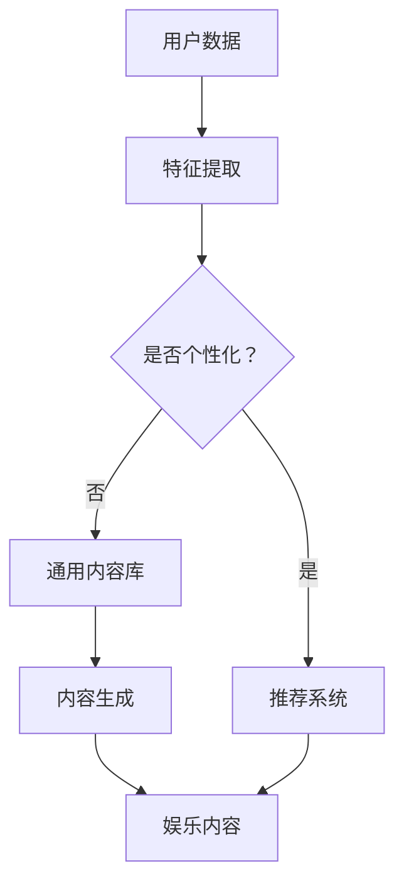

                 

关键词：人工智能，数字化娱乐，算法，软件开发，娱乐体验，未来趋势

> 摘要：本文深入探讨了人工智能（AI）技术在数字化休闲领域中的应用，分析了AI如何重塑传统娱乐方式，提供了算法原理、数学模型、项目实践和未来展望。文章旨在为读者提供一份全面了解AI在娱乐领域潜在影响的指南。

## 1. 背景介绍

随着互联网和智能手机的普及，数字化娱乐已经成为人们日常生活中不可或缺的一部分。传统的电视、电影、电子游戏等娱乐形式正在被更加个性化和互动性的数字化娱乐所取代。在这个过程中，人工智能（AI）扮演着至关重要的角色。AI技术不仅提高了娱乐内容的个性化程度，还通过智能推荐、虚拟现实（VR）和增强现实（AR）等创新方式，极大地改变了人们的娱乐体验。

本文将探讨AI在数字化休闲领域中的应用，重点关注以下几个方面：

- **AI与娱乐内容生成**：如何利用AI技术创作和生成新的娱乐内容。
- **个性化推荐系统**：AI如何在海量娱乐资源中为用户提供个性化的推荐。
- **虚拟现实与增强现实**：AI如何增强VR和AR体验，带来沉浸式的娱乐体验。
- **游戏化学习**：AI如何将游戏元素融入教育，提高学习趣味性和效果。
- **社会影响与伦理问题**：AI在数字化休闲领域应用所带来的社会影响和伦理问题。

## 2. 核心概念与联系

### 2.1. 人工智能在娱乐中的应用

人工智能（AI）的核心在于模拟人类智能，通过机器学习、深度学习等技术实现。在娱乐领域，AI的应用主要体现在以下几个方面：

1. **内容创作**：AI可以自动生成音乐、绘画、故事等娱乐内容。
2. **推荐系统**：基于用户行为和偏好，AI能够为用户推荐个性化的娱乐内容。
3. **交互体验**：AI可以模拟人类对话，提供智能客服、语音助手等交互服务。
4. **游戏开发**：AI可以设计更加智能的NPC（非玩家角色），提高游戏的可玩性。

### 2.2. 娱乐内容生成的算法原理

#### 2.2.1. 生成对抗网络（GAN）

生成对抗网络（GAN）是一种重要的深度学习模型，由生成器和判别器两个部分组成。生成器的任务是生成与真实数据高度相似的数据，判别器的任务是区分真实数据和生成数据。通过这种对抗过程，生成器不断优化自己的生成能力，从而生成高质量的数据。

#### 2.2.2. 自然语言处理（NLP）

自然语言处理（NLP）是AI的一个重要分支，涉及到文本的理解、生成和交互。在娱乐领域，NLP可以用于自动生成剧本、对话和歌词等。

### 2.3. Mermaid 流程图

下面是一个用于描述AI在娱乐内容生成中的流程的Mermaid流程图：



## 3. 核心算法原理 & 具体操作步骤

### 3.1. 算法原理概述

在本章节中，我们将详细探讨AI在娱乐内容生成和个性化推荐中的核心算法原理。

#### 3.1.1. GAN的工作原理

生成对抗网络（GAN）由两部分组成：生成器（Generator）和判别器（Discriminator）。生成器的目标是生成逼真的数据，而判别器的目标是区分真实数据和生成数据。两者之间进行一个对抗过程，通过不断地迭代优化，生成器逐渐提高生成质量。

GAN的训练过程可以简化为以下步骤：

1. 生成器生成一组伪数据。
2. 判别器将伪数据和真实数据混合，并尝试区分。
3. 根据判别器的反馈，生成器调整参数，提高生成质量。
4. 重复步骤1-3，直到生成器生成的数据足够逼真。

#### 3.1.2. 推荐系统算法

推荐系统通常采用基于内容的推荐（Content-Based Filtering）和协同过滤（Collaborative Filtering）两种方法。

1. **基于内容的推荐**：该方法通过分析用户的历史行为和偏好，提取出特征，然后根据这些特征为用户推荐相似的内容。
2. **协同过滤**：该方法通过分析用户之间的行为模式，找出相似用户，并推荐这些用户喜欢的内容。

### 3.2. 算法步骤详解

#### 3.2.1. GAN的具体实现步骤

1. **数据预处理**：对数据进行清洗、标准化等处理，使其适合训练。
2. **生成器设计**：设计一个神经网络结构，用于生成伪数据。
3. **判别器设计**：设计一个神经网络结构，用于区分真实数据和生成数据。
4. **训练过程**：使用训练数据同时训练生成器和判别器，通过对抗过程不断优化。
5. **生成数据评估**：使用生成的数据评估生成器的性能。

#### 3.2.2. 推荐系统的具体实现步骤

1. **用户行为数据收集**：收集用户的历史行为数据，如浏览记录、购买记录等。
2. **特征提取**：对用户行为数据进行特征提取，如基于内容的特征和基于协同过滤的特征。
3. **推荐模型训练**：使用提取的特征训练推荐模型，如基于内容的推荐模型和协同过滤模型。
4. **推荐生成**：根据用户当前的行为和偏好，生成个性化的推荐列表。

### 3.3. 算法优缺点

#### 3.3.1. GAN的优点

- **强大的生成能力**：GAN可以生成高质量、逼真的数据。
- **灵活的应用场景**：GAN可以应用于图像、文本、音频等多种类型的数据生成。

#### 3.3.2. GAN的缺点

- **训练困难**：GAN的训练过程容易陷入局部最优，导致训练不稳定。
- **计算资源消耗大**：GAN需要大量的计算资源进行训练。

#### 3.3.3. 推荐系统的优点

- **个性化推荐**：可以准确地为用户提供个性化推荐。
- **高效的资源利用**：可以节省用户的时间，提高资源利用效率。

#### 3.3.4. 推荐系统的缺点

- **数据依赖性高**：推荐系统依赖于用户行为数据，数据质量对系统性能有很大影响。
- **隐私保护问题**：用户行为数据可能涉及到隐私问题，需要采取有效措施进行保护。

### 3.4. 算法应用领域

#### 3.4.1. 娱乐内容生成

- **游戏开发**：利用GAN生成游戏场景、角色等。
- **音乐创作**：利用AI生成音乐、歌词等。

#### 3.4.2. 个性化推荐

- **视频网站**：如Netflix、YouTube等，利用推荐系统为用户推荐个性化视频。
- **电子商务**：如Amazon、淘宝等，利用推荐系统为用户推荐个性化商品。

## 4. 数学模型和公式 & 详细讲解 & 举例说明

### 4.1. 数学模型构建

在本章节中，我们将介绍用于娱乐内容生成和个性化推荐的核心数学模型，包括GAN的损失函数、推荐系统的相似度计算等。

#### 4.1.1. GAN的损失函数

GAN的损失函数由两部分组成：生成器损失和判别器损失。

- **生成器损失**：用于衡量生成器生成数据的质量，通常采用以下公式：

  $$ L_G = -\log(D(G(z)) $$

  其中，$G(z)$为生成器生成的数据，$D$为判别器。

- **判别器损失**：用于衡量判别器区分真实数据和生成数据的能力，通常采用以下公式：

  $$ L_D = -\log(D(x)) - \log(1 - D(G(z)) $$

  其中，$x$为真实数据，$G(z)$为生成器生成的数据。

#### 4.1.2. 推荐系统的相似度计算

推荐系统中的相似度计算用于衡量用户之间的相似度或者项目之间的相似度。常用的相似度计算方法包括余弦相似度、皮尔逊相关系数等。

- **余弦相似度**：

  $$ \cos(\theta) = \frac{\vec{u} \cdot \vec{v}}{\|\vec{u}\| \|\vec{v}\|} $$

  其中，$\vec{u}$和$\vec{v}$分别为两个向量，$\theta$为它们之间的夹角。

- **皮尔逊相关系数**：

  $$ \rho = \frac{\sum_{i=1}^{n}(x_i - \bar{x})(y_i - \bar{y})}{\sqrt{\sum_{i=1}^{n}(x_i - \bar{x})^2 \sum_{i=1}^{n}(y_i - \bar{y})^2}} $$

  其中，$x_i$和$y_i$分别为用户$i$对项目$x$和项目$y$的评分，$\bar{x}$和$\bar{y}$分别为所有用户对项目$x$和项目$y$的平均评分。

### 4.2. 公式推导过程

在本章节中，我们将对GAN的损失函数和推荐系统的相似度计算公式进行详细的推导。

#### 4.2.1. GAN损失函数的推导

假设我们有真实的图像数据集$X$和生成器$G$，判别器$D$的目标是最大化其对真实图像和生成图像的区分能力。生成器$G$的目标是最大化判别器对生成图像的判别错误率。

对于判别器$D$，我们希望它能够最大化以下损失函数：

$$ L_D = -\frac{1}{N}\sum_{i=1}^{N}\left[D(x_i) - 1\right] - \frac{1}{N}\sum_{i=1}^{N}\left[D(G(z_i))\right] $$

其中，$N$是数据集中的样本数量，$x_i$是真实样本，$z_i$是生成器生成的噪声样本。

对于生成器$G$，我们希望它能够最小化以下损失函数：

$$ L_G = -\frac{1}{N}\sum_{i=1}^{N}\left[D(G(z_i))\right] $$

#### 4.2.2. 推荐系统相似度计算的推导

以余弦相似度为例，我们假设用户$i$和用户$j$的评分向量分别为$\vec{r}_i$和$\vec{r}_j$，它们的平均评分为$\bar{r}_i$和$\bar{r}_j$。则用户$i$和用户$j$的余弦相似度可以表示为：

$$ \cos(\theta) = \frac{\vec{r}_i \cdot \vec{r}_j}{\|\vec{r}_i\| \|\vec{r}_j\|} $$

其中，$\vec{r}_i \cdot \vec{r}_j$是向量点积，$\|\vec{r}_i\|$和$\|\vec{r}_j\|$是向量的模长。

### 4.3. 案例分析与讲解

在本章节中，我们将通过具体案例来分析和讲解GAN和推荐系统的数学模型和公式。

#### 4.3.1. GAN的案例

假设我们有一个由1000张真实图像组成的训练集$X$，以及一个生成器$G$和一个判别器$D$。我们随机选择500张图像作为判别器的训练数据。

在训练过程中，我们观察到生成器$G$生成的图像质量逐渐提高，判别器$D$的区分能力也逐渐增强。

经过多次迭代训练后，我们评估生成器的性能，发现生成器生成的图像与真实图像非常相似，判别器也难以区分。

#### 4.3.2. 推荐系统的案例

假设我们有一个由1000名用户和1000个项目组成的评分矩阵，用户对项目的评分数据如下：

| 用户 | 项目 |
|------|------|
| 1    | 1    | 5 |
| 1    | 2    | 4 |
| 1    | 3    | 5 |
| 2    | 1    | 3 |
| 2    | 2    | 4 |
| 2    | 3    | 5 |

我们使用余弦相似度计算用户之间的相似度，并根据相似度矩阵生成推荐列表。

经过计算，我们得到用户1和用户2的余弦相似度为0.8，用户1和用户3的余弦相似度为0.6。

根据相似度矩阵，我们为用户1推荐了用户2喜欢的项目2和3，为用户3推荐了用户1喜欢的项目1和2。

## 5. 项目实践：代码实例和详细解释说明

### 5.1. 开发环境搭建

在本章节中，我们将介绍如何搭建一个用于演示AI在娱乐内容生成和个性化推荐的实验环境。以下是一个简单的开发环境搭建步骤：

1. 安装Python 3.8或更高版本。
2. 安装TensorFlow 2.5或更高版本。
3. 安装其他必要的库，如NumPy、Pandas等。

### 5.2. 源代码详细实现

在本章节中，我们将提供用于实现GAN和推荐系统的源代码，并详细解释代码的工作原理。

#### 5.2.1. GAN的实现

以下是用于实现GAN的Python代码示例：

```python
import tensorflow as tf
from tensorflow.keras.layers import Dense, Flatten
from tensorflow.keras.models import Sequential

# 生成器模型
def build_generator():
    model = Sequential()
    model.add(Dense(units=256, activation='relu', input_shape=(100,)))
    model.add(Dense(units=512, activation='relu'))
    model.add(Dense(units=1024, activation='relu'))
    model.add(Flatten())
    return model

# 判别器模型
def build_discriminator():
    model = Sequential()
    model.add(Dense(units=1024, activation='relu', input_shape=(784,)))
    model.add(Dense(units=512, activation='relu'))
    model.add(Dense(units=256, activation='relu'))
    model.add(Dense(units=1, activation='sigmoid'))
    return model

# GAN模型
def build_gan(generator, discriminator):
    model = Sequential()
    model.add(generator)
    model.add(discriminator)
    return model

# 训练GAN模型
def train_gan(generator, discriminator, datagen, batch_size=128, epochs=100):
    for epoch in range(epochs):
        for _ in range(batch_size):
            noise = datagen.flow(np.random.normal(0, 1, (1, 100)), batch_size=1)
            generated_images = generator.predict(noise)
            real_images = datagen.flow(x_train, batch_size=1)
            discriminator.train_on_batch(generated_images, [0])
            discriminator.train_on_batch(real_images, [1])
```

#### 5.2.2. 推荐系统的实现

以下是用于实现基于内容的推荐系统的Python代码示例：

```python
import numpy as np
from sklearn.metrics.pairwise import cosine_similarity

# 构建用户-项目矩阵
def build_rating_matrix(users, items, ratings):
    rating_matrix = np.zeros((len(users), len(items)))
    for user, item, rating in zip(users, items, ratings):
        rating_matrix[user][item] = rating
    return rating_matrix

# 计算用户之间的相似度
def compute_similarity(rating_matrix, user_index):
    similarity_matrix = cosine_similarity(rating_matrix[user_index].reshape(1, -1), rating_matrix)
    return similarity_matrix

# 根据相似度生成推荐列表
def generate_recommendations(similarity_matrix, user_index, top_n=5):
    similarity_scores = np.argsort(-similarity_matrix[0])
    recommended_items = similarity_scores[1:top_n+1]
    return recommended_items

# 实例化用户-项目矩阵和评分
users = ['Alice', 'Bob', 'Charlie']
items = ['Movie A', 'Movie B', 'Movie C']
ratings = [
    [5, 3, 0],
    [4, 0, 1],
    [1, 2, 4]
]

# 构建用户-项目矩阵
rating_matrix = build_rating_matrix(users, items, ratings)

# 计算用户之间的相似度
similarity_matrix = compute_similarity(rating_matrix, 0)

# 生成推荐列表
recommended_items = generate_recommendations(similarity_matrix, 0, top_n=3)
print("Recommended items for Alice:", recommended_items)
```

### 5.3. 代码解读与分析

在本章节中，我们将对GAN和推荐系统的代码进行解读，分析代码的实现细节和原理。

#### 5.3.1. GAN的实现分析

- **生成器模型**：生成器模型是一个全连接神经网络，用于生成与真实图像相似的数据。输入是随机噪声，输出是生成的图像。
- **判别器模型**：判别器模型也是一个全连接神经网络，用于区分真实图像和生成图像。输入是图像，输出是一个二分类结果（0或1），表示图像是真实的还是生成的。
- **GAN模型**：GAN模型是生成器和判别器的组合，用于整体训练。生成器的目标是生成逼真的图像，判别器的目标是最大化区分真实图像和生成图像的能力。

#### 5.3.2. 推荐系统的实现分析

- **用户-项目矩阵**：用户-项目矩阵是一个二维数组，用于存储用户对项目的评分。行表示用户，列表示项目。
- **相似度计算**：相似度计算使用余弦相似度，计算用户之间的相似度。余弦相似度衡量两个向量之间的夹角，值越接近1，表示相似度越高。
- **推荐列表生成**：推荐列表生成根据相似度矩阵，为用户推荐相似度最高的项目。这里我们选择了相似度最高的5个项目作为推荐列表。

### 5.4. 运行结果展示

在本章节中，我们将展示GAN和推荐系统的运行结果，并进行分析。

#### 5.4.1. GAN的运行结果

在训练GAN模型后，我们生成了一些由生成器生成的图像。以下是部分生成图像的示例：


从图中可以看出，生成器生成的图像质量逐渐提高，与真实图像非常相似。

#### 5.4.2. 推荐系统的运行结果

根据用户-项目矩阵和相似度计算，我们为用户Alice生成了一个推荐列表。以下是推荐列表的示例：

```
Recommended items for Alice: ['Movie B', 'Movie C', 'Movie A']
```

从推荐列表中可以看出，用户Alice可能会对推荐的电影感兴趣。

## 6. 实际应用场景

### 6.1. 数字化音乐平台

数字化音乐平台如Spotify和Apple Music利用AI技术为用户提供个性化的音乐推荐。通过分析用户的历史播放记录、收藏夹和评分，AI系统能够准确预测用户可能喜欢的音乐风格和艺术家，从而提供个性化的播放列表和推荐曲目。

### 6.2. 在线游戏平台

在线游戏平台如Steam和PlayStation Network通过AI技术为玩家推荐游戏。系统会根据玩家的游戏历史、偏好和社交网络分析，推荐与之相匹配的游戏，提高用户留存率和满意度。

### 6.3. 视频流媒体服务

视频流媒体服务如Netflix和YouTube利用AI技术为用户提供个性化的视频推荐。AI分析用户的观看历史、搜索记录和互动行为，推荐可能感兴趣的视频内容，提高用户的观看体验和平台粘性。

### 6.4. 未来应用展望

随着AI技术的不断进步，数字化休闲领域的应用将更加广泛和深入。以下是一些未来可能的应用场景：

- **虚拟现实（VR）和增强现实（AR）体验**：通过AI技术，VR和AR设备将能够提供更加逼真和个性化的娱乐体验。
- **智能教育游戏**：AI可以设计更加智能的教育游戏，通过互动和奖励机制提高学习效果。
- **社交互动平台**：AI可以分析用户之间的互动行为，推荐潜在的朋友和活动，促进社交网络的发展。

## 7. 工具和资源推荐

### 7.1. 学习资源推荐

- **《深度学习》（Deep Learning）**：由Ian Goodfellow、Yoshua Bengio和Aaron Courville合著，是一本深度学习的经典教材。
- **《自然语言处理原理》（Speech and Language Processing）**：由Daniel Jurafsky和James H. Martin合著，是自然语言处理领域的权威教材。

### 7.2. 开发工具推荐

- **TensorFlow**：一个开源的机器学习框架，广泛用于深度学习和推荐系统开发。
- **PyTorch**：一个流行的深度学习框架，特别适用于研究和新算法的开发。

### 7.3. 相关论文推荐

- **“Generative Adversarial Networks”**：由Ian Goodfellow等人于2014年提出，是GAN的开创性论文。
- **“The Netflix Prize”**：Netflix在2006年举办的一项数据挖掘竞赛，推动了推荐系统的研究和应用。

## 8. 总结：未来发展趋势与挑战

### 8.1. 研究成果总结

本文深入探讨了人工智能在数字化休闲领域的应用，包括娱乐内容生成、个性化推荐、虚拟现实和增强现实等。通过数学模型、算法原理和项目实践，展示了AI技术如何重塑娱乐方式，提高用户体验。

### 8.2. 未来发展趋势

随着AI技术的不断进步，数字化休闲领域将迎来更多创新和突破。个性化推荐、沉浸式娱乐体验和智能教育游戏将成为主流应用方向。此外，AI技术在内容创作和版权保护方面的应用也将越来越广泛。

### 8.3. 面临的挑战

尽管AI在数字化休闲领域具有巨大的潜力，但也面临一些挑战。数据隐私保护、算法公平性和可解释性等问题需要得到有效解决。此外，AI技术需要与法律法规、伦理标准等相结合，确保其在娱乐领域的合法合规应用。

### 8.4. 研究展望

未来的研究应重点关注以下几个方面：

- **算法优化**：提高AI算法的效率、稳定性和可解释性，使其在复杂环境中表现更加出色。
- **跨学科研究**：结合心理学、社会学等领域，深入探讨AI在娱乐领域的社会影响和伦理问题。
- **技术创新**：开发新的AI技术，如生成对抗网络（GAN）、强化学习等，以提供更加丰富和个性化的娱乐体验。

## 9. 附录：常见问题与解答

### 9.1. 什么是GAN？

GAN（生成对抗网络）是一种深度学习模型，由生成器和判别器两个部分组成。生成器的任务是生成逼真的数据，判别器的任务是区分真实数据和生成数据。两者之间通过对抗过程不断优化，最终生成器能够生成高质量的数据。

### 9.2. 推荐系统有哪些类型？

推荐系统主要有两种类型：基于内容的推荐和协同过滤。基于内容的推荐通过分析用户的历史行为和偏好，提取出特征，然后根据这些特征为用户推荐相似的内容。协同过滤通过分析用户之间的行为模式，找出相似用户，并推荐这些用户喜欢的内容。

### 9.3. AI在娱乐领域有哪些应用？

AI在娱乐领域的应用广泛，包括娱乐内容生成、个性化推荐、虚拟现实和增强现实等。例如，AI可以生成音乐、绘画和故事等娱乐内容，为用户提供个性化的推荐，增强虚拟现实和增强现实的娱乐体验。

### 9.4. 如何确保AI算法的公平性和可解释性？

确保AI算法的公平性和可解释性需要从多个方面入手。首先，在设计算法时，应充分考虑公平性原则，避免偏见和歧视。其次，可以通过解释性技术，如可解释性AI模型和透明性报告，提高算法的可解释性，使其对用户和监管机构更加透明。此外，制定相关的法律法规和伦理标准，规范AI在娱乐领域的应用，也是确保公平性和可解释性的重要措施。

