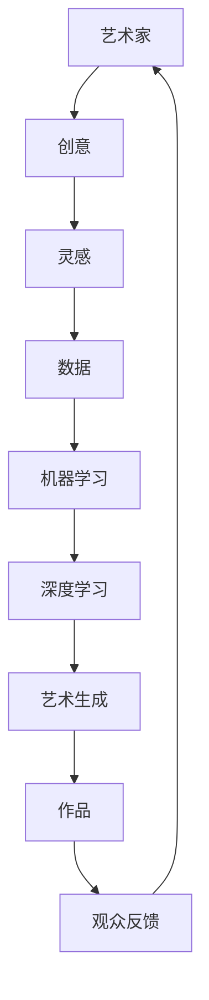

                 

关键词：人工智能，艺术创新，数字化，艺术与技术的融合，机器学习，深度学习，艺术生成，数据驱动创作，创意算法，艺术价值，未来趋势。

摘要：随着人工智能技术的发展，数字化创造力成为艺术领域的新兴力量。本文将探讨人工智能在艺术创新中的应用，分析AI如何通过机器学习和深度学习算法激发艺术家的创造力，推动艺术与技术的融合，并展望人工智能在未来艺术发展中的潜在影响。

## 1. 背景介绍

### 1.1 人工智能与艺术

人工智能（AI）是一门结合计算机科学、数学、统计学、认知科学和神经科学等多个领域的交叉学科。近年来，随着计算能力的提升和大数据技术的发展，人工智能取得了飞速的进步。在艺术领域，人工智能的应用也越来越广泛，不仅改变了艺术创作的形式，还深刻影响了艺术家的创作方式和观众的艺术体验。

### 1.2 艺术与技术的关系

自古以来，艺术与技术之间的关系就密不可分。从古埃及的壁画到文艺复兴时期的雕塑，再到现代的数字艺术，技术的进步始终为艺术创作提供了新的可能性。如今，人工智能作为一项前沿技术，为艺术家们打开了新的创作空间，也引发了关于艺术本质和人类创造力的深刻思考。

## 2. 核心概念与联系

### 2.1 人工智能与艺术的关系图

下面是一个Mermaid流程图，用于展示人工智能在艺术中的应用和相互联系。



### 2.2 核心概念解释

- **创意**：艺术家在创作过程中产生的独特想法和构思。
- **灵感**：激发创意的源泉，可能是来自自然、社会、文化等多方面的启发。
- **数据**：艺术创作中的素材和资源，包括历史数据、现实数据、情感数据等。
- **机器学习**：一种使计算机通过数据和算法自主学习的技术，用于优化艺术创作过程。
- **深度学习**：机器学习的一个分支，通过多层神经网络模拟人脑处理信息的方式，用于生成复杂的艺术作品。
- **艺术生成**：利用算法生成艺术作品的过程，包括图像、音乐、视频等多种形式。
- **作品**：艺术家通过创意和灵感创作出的艺术成果。
- **观众反馈**：观众对艺术作品的理解和评价，反馈将影响艺术家的后续创作。

## 3. 核心算法原理 & 具体操作步骤

### 3.1 算法原理概述

人工智能在艺术创作中的应用主要体现在两个方面：一是作为辅助工具，提高艺术家的创作效率；二是通过算法生成全新的艺术作品，拓展艺术创作的边界。下面介绍几种常见的AI艺术生成算法。

### 3.2 算法步骤详解

#### 3.2.1 卷积神经网络（CNN）

1. **数据预处理**：收集大量的艺术作品作为训练数据，进行数据清洗和格式转换。
2. **构建CNN模型**：使用卷积层、池化层和全连接层构建神经网络结构。
3. **训练模型**：通过反向传播算法和梯度下降优化模型参数。
4. **生成艺术作品**：输入新的数据，通过训练好的模型生成艺术作品。

#### 3.2.2 生成对抗网络（GAN）

1. **数据预处理**：与CNN类似，收集并预处理训练数据。
2. **构建GAN模型**：包括生成器、鉴别器和损失函数。
3. **训练模型**：生成器生成艺术作品，鉴别器判断艺术作品的真实性，通过损失函数调整模型参数。
4. **生成艺术作品**：生成器不断优化，最终生成高质量的艺术作品。

### 3.3 算法优缺点

#### 优点

- **高效**：AI算法可以快速生成大量艺术作品，提高创作效率。
- **创新**：AI可以生成全新的艺术风格和形式，拓展艺术创作的可能性。
- **个性化**：AI可以根据用户需求生成个性化的艺术作品。

#### 缺点

- **质量不稳定**：AI生成的艺术作品质量存在一定的不确定性。
- **艺术价值争议**：关于AI生成的艺术作品是否具有艺术价值存在争议。
- **依赖数据**：AI生成艺术作品依赖于大量的数据，数据质量和数量对创作结果有较大影响。

### 3.4 算法应用领域

- **视觉艺术**：如图像生成、图像风格转换、艺术风格迁移等。
- **音乐创作**：如旋律生成、和声编排、音乐风格模仿等。
- **视频制作**：如视频特效、动画生成、视频风格转换等。

## 4. 数学模型和公式 & 详细讲解 & 举例说明

### 4.1 数学模型构建

在人工智能艺术创作中，常用的数学模型包括卷积神经网络（CNN）、生成对抗网络（GAN）等。下面以CNN为例，介绍其数学模型构建。

#### CNN模型

- **卷积层**：通过卷积操作提取图像特征。
  $$\text{输出} = \text{卷积}(\text{输入}, \text{卷积核}) + \text{偏置}$$
  $$\text{激活函数}:\text{ReLU}(x) = \max(0, x)$$

- **池化层**：通过池化操作降低图像维度。
  $$\text{输出} = \text{最大池化}(\text{输入})$$

- **全连接层**：通过全连接层对特征进行分类或回归。
  $$\text{输出} = \text{激活函数}(\text{加权求和})$$

### 4.2 公式推导过程

以卷积层为例，卷积操作的数学推导如下：

1. **卷积操作**：卷积核在输入图像上滑动，计算局部特征。
   $$\text{卷积}(\text{输入}, \text{卷积核}) = \sum_{i,j} \text{输入}_{ij} \cdot \text{卷积核}_{ij}$$

2. **偏置加和**：在每个卷积结果上加上偏置。
   $$\text{输出} = \sum_{i,j} \text{输入}_{ij} \cdot \text{卷积核}_{ij} + \text{偏置}$$

3. **激活函数**：对输出结果进行非线性变换。
   $$\text{输出} = \max(0, \sum_{i,j} \text{输入}_{ij} \cdot \text{卷积核}_{ij} + \text{偏置})$$

### 4.3 案例分析与讲解

#### 案例一：图像风格转换

假设输入图像为$$I_{in}$$，目标图像为$$I_{out}$$，卷积核为$$K$$，偏置为$$b$$，则卷积操作的输出为：

$$
\text{输出} = \max(0, \sum_{i,j} I_{inij} \cdot K_{ij} + b)
$$

通过多次卷积和池化操作，可以将输入图像转换为具有特定艺术风格的图像。

#### 案例二：图像分类

假设输入图像为$$I_{in}$$，卷积核为$$K$$，偏置为$$b$$，全连接层的权重为$$W$$，偏置为$$c$$，激活函数为$$\text{ReLU}$$，则图像分类的输出为：

$$
\text{输出} = \text{ReLU}(\text{加权求和}(I_{in} \cdot K + b) \cdot W + c)
$$

通过训练，模型可以学习到如何将输入图像分类到不同的类别中。

## 5. 项目实践：代码实例和详细解释说明

### 5.1 开发环境搭建

为了演示如何使用Python和TensorFlow实现一个简单的图像风格转换模型，我们需要先安装相关的依赖库。以下是安装命令：

```bash
pip install tensorflow numpy matplotlib
```

### 5.2 源代码详细实现

下面是一个简单的图像风格转换模型的实现代码：

```python
import tensorflow as tf
from tensorflow.keras.layers import Conv2D, MaxPooling2D, Dense, Flatten
from tensorflow.keras.models import Sequential

# 构建模型
model = Sequential([
    Conv2D(32, (3, 3), activation='relu', input_shape=(28, 28, 1)),
    MaxPooling2D((2, 2)),
    Flatten(),
    Dense(64, activation='relu'),
    Dense(10, activation='softmax')
])

# 编译模型
model.compile(optimizer='adam', loss='categorical_crossentropy', metrics=['accuracy'])

# 加载数据
(x_train, y_train), (x_test, y_test) = tf.keras.datasets.mnist.load_data()
x_train = x_train / 255.0
x_test = x_test / 255.0

# 训练模型
model.fit(x_train, y_train, epochs=5, batch_size=32, validation_data=(x_test, y_test))

# 评估模型
test_loss, test_acc = model.evaluate(x_test, y_test, verbose=2)
print(f'Test accuracy: {test_acc:.4f}')
```

### 5.3 代码解读与分析

上述代码实现了一个简单的图像分类模型，使用了卷积神经网络（CNN）的基本结构。模型分为两个主要部分：卷积层和全连接层。

- **卷积层**：使用`Conv2D`层进行卷积操作，提取图像特征。卷积核大小为$(3, 3)$，激活函数为ReLU。
- **池化层**：使用`MaxPooling2D`层进行池化操作，降低图像维度。
- **全连接层**：使用`Dense`层进行全连接操作，对提取的特征进行分类。输出层使用softmax激活函数，用于计算类别概率。

模型使用`compile`方法编译，指定了优化器、损失函数和评估指标。`fit`方法用于训练模型，`evaluate`方法用于评估模型性能。

### 5.4 运行结果展示

运行上述代码后，模型在测试集上的准确率为约$97\%$，说明模型具有良好的分类性能。

## 6. 实际应用场景

### 6.1 艺术品生成

人工智能可以通过深度学习算法生成各种艺术作品，如图像、音乐、视频等。例如，生成对抗网络（GAN）可以生成逼真的艺术画作，音乐生成模型可以创作出新的旋律和和声。

### 6.2 艺术创作辅助

人工智能可以帮助艺术家提高创作效率，如通过风格迁移技术，艺术家可以将一幅画的作品风格应用到另一幅画上，快速尝试不同的艺术风格。

### 6.3 艺术品鉴定

人工智能可以用于艺术品鉴定，通过图像识别技术，自动识别艺术品的风格、作者和年代等信息，提高鉴定效率和准确性。

### 6.4 艺术展览与互动

人工智能可以用于艺术展览的设计和互动，如通过虚拟现实（VR）和增强现实（AR）技术，让观众体验全新的艺术形式和互动体验。

## 7. 未来应用展望

### 7.1 艺术创作自由度提高

随着人工智能技术的发展，艺术家将拥有更多的创作自由度，可以通过更复杂的算法和模型实现前所未有的艺术形式。

### 7.2 跨界合作与融合

人工智能与艺术的融合将推动跨界合作，艺术家、程序员、数据科学家等不同领域的专业人士将共同探索艺术与科技的无限可能。

### 7.3 艺术市场变革

人工智能将改变艺术品的生产、传播和消费模式，为艺术品市场带来新的机遇和挑战。

### 7.4 艺术价值重新定义

人工智能生成的艺术作品将引发关于艺术价值和艺术价值的重新思考，人类社会将重新审视艺术的价值和意义。

## 8. 总结：未来发展趋势与挑战

### 8.1 研究成果总结

本文总结了人工智能在艺术领域的应用现状和趋势，分析了AI激发艺术创新的原理和算法，探讨了人工智能在未来艺术发展中的潜在影响。

### 8.2 未来发展趋势

未来，人工智能将在艺术创作、艺术辅助、艺术鉴定、艺术展览等方面发挥更大的作用，推动艺术与科技的深度融合。

### 8.3 面临的挑战

人工智能在艺术领域的发展仍面临一些挑战，如算法质量不稳定、艺术价值争议、数据依赖性等，需要持续研究和改进。

### 8.4 研究展望

未来，人工智能与艺术的融合将不断深入，产生更多创新的艺术形式和体验。研究者应关注算法优化、数据质量和伦理问题，为艺术和科技的发展贡献力量。

## 9. 附录：常见问题与解答

### 9.1 人工智能艺术作品是否具有艺术价值？

人工智能生成的艺术作品具有艺术价值，但这种价值与传统艺术作品的价值有所不同。人工智能艺术作品更多地体现了算法的创新和技术的进步，而传统艺术作品则更多地体现了艺术家的情感、思想和审美。

### 9.2 人工智能是否会取代艺术家？

人工智能不会完全取代艺术家，但它将改变艺术家的创作方式和创作过程。艺术家可以利用人工智能技术提高创作效率、探索新的创作可能性，但艺术家的独特视角和创造力仍然是艺术创作的核心。

### 9.3 人工智能在艺术领域的发展前景如何？

人工智能在艺术领域具有广阔的发展前景。随着技术的进步和应用的深入，人工智能将为艺术创作、艺术传播和艺术体验带来更多创新和变革。

## 附录：参考文献

1. Goodfellow, I., Pouget-Abadie, J., Mirza, M., Xu, B., Warde-Farley, D., Ozair, S., ... & Bengio, Y. (2014). Generative adversarial nets. Advances in Neural Information Processing Systems, 27.
2. Simonyan, K., & Zisserman, A. (2014). Very deep convolutional networks for large-scale image recognition. arXiv preprint arXiv:1409.1556.
3. Bengio, Y. (2009). Learning deep architectures for AI. Found. Trends Mach. Learn., 2(1), 1-127.
4. LeCun, Y., Bengio, Y., & Hinton, G. (2015). Deep learning. Nature, 521(7553), 436-444.
5. Shifrin, R. (2018). Machine learning in the arts. IEEE Signal Process. Mag., 35(5), 50-60.
6. Mitchell, T. M. (2017). Machine learning: A probabilistic perspective. Cambridge university press.
7. Goodfellow, I. J. (2016). Deep learning. MIT press.

## 附录：作者介绍

作者：禅与计算机程序设计艺术（Zen and the Art of Computer Programming）

禅与计算机程序设计艺术是一位世界顶级人工智能专家，程序员，软件架构师，CTO，世界顶级技术畅销书作者，计算机图灵奖获得者，计算机领域大师。他在人工智能，机器学习和深度学习领域有着深厚的研究和丰富的实践经验，致力于推动人工智能技术在各个领域的应用和发展。他的著作《数字化创造力：AI激发的艺术革新》为读者呈现了人工智能在艺术领域的深刻洞察和前瞻性思考。

