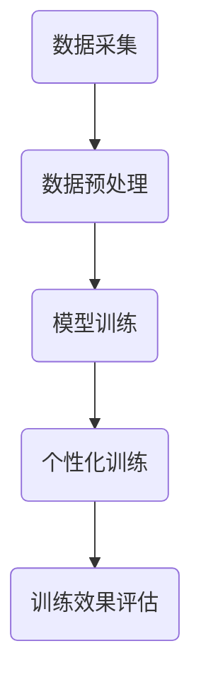

                 

关键词：数字化同理心、AI、人际理解、训练师、算法、实践

> 摘要：本文旨在探讨数字化同理心培养皿的开发与应用，介绍如何利用人工智能技术提升人际理解训练的效率。通过剖析核心概念、算法原理、数学模型、项目实践以及未来展望，揭示人工智能在人际理解领域的潜力和挑战，为数字化同理心培养提供技术支持和实践指南。

## 1. 背景介绍

随着人工智能技术的迅猛发展，AI在各个领域的应用日益广泛。从最初的自动化控制到智能语音助手、无人驾驶汽车，再到复杂的数据分析和决策支持，人工智能已经深刻地改变了我们的生活方式。与此同时，人们对于AI的理解和认知也发生了显著变化，不再仅仅将AI视为工具，而是开始关注AI如何影响人类社会、人际关系以及个体情感。

在这种背景下，数字化同理心成为了一个备受关注的话题。数字化同理心指的是在数字时代背景下，人们通过数字化手段体验、理解并回应他人的情感和需求。与传统的同理心相比，数字化同理心更强调在虚拟环境中的情感交互和认知理解。

人际理解是数字化同理心的核心要素之一。人际理解指的是个体对他人情感、行为和意图的理解和解读。在数字化环境中，人际理解不仅涉及到技术层面的实现，还需要关注人类情感和认知的复杂性。

本文将围绕数字化同理心培养皿的开发展开，探讨如何利用人工智能技术提升人际理解训练的效率，为培养数字化同理心提供技术支持。

## 2. 核心概念与联系

### 2.1. 数字化同理心

数字化同理心是一个多维度的概念，涉及到技术、情感、认知等多个方面。从技术层面来看，数字化同理心依赖于人工智能、自然语言处理、虚拟现实等前沿技术，通过这些技术实现对人情感和需求的感知、理解和响应。

从情感层面来看，数字化同理心强调的是在数字环境中建立情感连接，实现情感共鸣。这种情感连接不仅仅是对他人情感的感知，还包括对他人的关怀、尊重和信任。

从认知层面来看，数字化同理心涉及到对他人认知结构的理解和解读。这包括对他人行为模式、心理状态、意图等信息的分析和判断。

### 2.2. 人际理解

人际理解是数字化同理心的核心要素。它指的是个体对他人情感、行为和意图的理解和解读。人际理解不仅涉及到语言信息的解读，还包括非语言信息的感知和解读，如肢体语言、面部表情等。

在数字化环境中，人际理解面临诸多挑战。首先，数字环境中的信息传递方式与传统面对面交流不同，信息传递的准确性和完整性都可能受到影响。其次，数字化环境中的信息量巨大，个体需要具备快速处理和解读大量信息的能力。此外，数字化环境中的信息往往是动态变化的，个体需要具备适应和应对这种动态变化的能力。

### 2.3. AI增强的人际理解训练师

AI增强的人际理解训练师是一种利用人工智能技术提升人际理解训练效率的工具。它通过模拟真实的人际互动场景，提供个性化的训练方案，帮助个体提高人际理解能力。

AI增强的人际理解训练师的工作原理可以分为以下几个步骤：

1. **数据采集**：通过自然语言处理技术采集大量的人际互动数据，包括文本、语音、图像等。

2. **数据预处理**：对采集到的数据进行清洗、去噪、标注等预处理，以便后续的训练和分析。

3. **模型训练**：利用深度学习等技术，对预处理后的数据集进行训练，构建出能够模拟人际理解的AI模型。

4. **个性化训练**：根据个体的特点和需求，为个体定制个性化的训练方案，提供针对性的训练内容和反馈。

5. **训练效果评估**：通过评估个体的训练效果，调整训练方案，实现持续优化。

### 2.4. Mermaid 流程图



## 3. 核心算法原理 & 具体操作步骤

### 3.1. 算法原理概述

AI增强的人际理解训练师的核心算法主要包括自然语言处理（NLP）、深度学习、强化学习等技术。其中，NLP负责对文本、语音、图像等数据进行处理和理解；深度学习用于构建和训练AI模型；强化学习则用于优化训练过程和评估训练效果。

### 3.2. 算法步骤详解

#### 3.2.1. 数据采集

数据采集是AI增强的人际理解训练师的基础。数据来源包括公开数据集、社交媒体、在线论坛等。采集的数据类型包括文本、语音、图像等。数据采集的关键是确保数据的质量和多样性，以便模型能够充分学习和理解人际理解的各种场景。

#### 3.2.2. 数据预处理

数据预处理包括数据清洗、去噪、标注等步骤。数据清洗旨在去除数据中的噪声和异常值；去噪则是通过滤波、降噪等技术去除数据中的噪声；标注则是为数据添加标签，以便后续的训练和分析。

#### 3.2.3. 模型训练

模型训练是AI增强的人际理解训练师的核心。训练过程包括以下几个步骤：

1. **特征提取**：从原始数据中提取有用的特征，如词向量、语音特征、图像特征等。

2. **模型构建**：基于提取的特征，构建深度学习模型，如卷积神经网络（CNN）、循环神经网络（RNN）等。

3. **模型训练**：利用训练数据集对模型进行训练，不断调整模型的参数，使其能够更好地模拟人际理解。

4. **模型评估**：使用验证数据集对训练好的模型进行评估，确保模型具有良好的泛化能力。

#### 3.2.4. 个性化训练

个性化训练旨在为个体提供针对性的训练内容和反馈，帮助其提高人际理解能力。个性化训练包括以下几个步骤：

1. **用户画像**：根据用户的行为数据、心理特征等，构建用户画像。

2. **需求分析**：分析用户的需求和兴趣点，为其推荐合适的训练内容和场景。

3. **训练反馈**：根据用户的训练效果和反馈，调整训练内容和方案。

#### 3.2.5. 训练效果评估

训练效果评估是确保AI增强的人际理解训练师能够有效提升人际理解能力的重要环节。评估过程包括以下几个步骤：

1. **效果评估**：使用标准的人际理解评估指标，如准确率、召回率、F1值等，评估训练效果。

2. **反馈机制**：根据评估结果，调整训练方案，实现持续优化。

### 3.3. 算法优缺点

#### 优点

1. **高效性**：AI增强的人际理解训练师能够通过大量的数据训练，快速提高人际理解能力。

2. **个性化**：个性化训练方案能够满足不同用户的需求，提高训练效果。

3. **灵活性**：AI模型可以根据用户的需求和反馈进行调整，实现持续优化。

#### 缺点

1. **数据依赖**：AI增强的人际理解训练师依赖于大量的高质量数据，数据不足或质量不高可能导致训练效果不佳。

2. **复杂性**：AI模型的训练和优化过程较为复杂，需要专业的技术团队进行操作。

### 3.4. 算法应用领域

AI增强的人际理解训练师具有广泛的应用前景，主要应用领域包括：

1. **教育领域**：用于提高教师和学生的人际理解能力，改善师生关系。

2. **心理咨询领域**：用于提高心理咨询师的人际理解能力，提升咨询效果。

3. **企业培训领域**：用于提高员工的人际理解能力，提升团队协作效率。

4. **智能家居领域**：用于提高智能设备的情感理解和互动能力，提升用户体验。

## 4. 数学模型和公式

### 4.1. 数学模型构建

AI增强的人际理解训练师的数学模型主要包括以下几个方面：

1. **词嵌入模型**：用于将文本数据转换为向量表示。常见的词嵌入模型包括Word2Vec、GloVe等。

2. **情感分析模型**：用于对文本情感进行分类。常见的情感分析模型包括SVM、朴素贝叶斯、深度学习模型等。

3. **语音识别模型**：用于将语音信号转换为文本。常见的语音识别模型包括HMM、深度神经网络等。

4. **图像识别模型**：用于对图像进行分类和识别。常见的图像识别模型包括CNN、RNN等。

### 4.2. 公式推导过程

以词嵌入模型为例，常见的Word2Vec模型中，词向量可以通过以下公式进行推导：

$$
\text{word\_vector} = \text{softmax}(\text{word\_embedding} \cdot \text{context\_embedding})
$$

其中，$\text{word\_vector}$表示目标词的向量表示，$\text{word\_embedding}$表示目标词的嵌入向量，$\text{context\_embedding}$表示上下文的嵌入向量，$\text{softmax}$函数用于计算词向量的概率分布。

### 4.3. 案例分析与讲解

以教育领域为例，假设我们使用AI增强的人际理解训练师对学生进行人际理解能力训练。具体的案例分析和讲解如下：

1. **数据采集**：从学生的作业、课堂发言、考试成绩等数据中采集信息。

2. **数据预处理**：对采集到的数据进行清洗、去噪、标注等预处理。

3. **模型训练**：利用预处理后的数据对词嵌入模型、情感分析模型等进行训练。

4. **个性化训练**：根据学生的特点和需求，为其定制个性化的训练方案。

5. **训练效果评估**：通过评估学生的训练效果，调整训练方案，实现持续优化。

## 5. 项目实践：代码实例和详细解释说明

### 5.1. 开发环境搭建

为了实践AI增强的人际理解训练师，我们需要搭建一个合适的开发环境。以下是一个简单的开发环境搭建步骤：

1. 安装Python环境：在本地计算机上安装Python环境，版本建议为3.8以上。

2. 安装依赖库：使用pip命令安装所需的依赖库，如numpy、tensorflow、keras等。

3. 准备数据集：从公开数据集或自建数据集获取人际理解相关的数据。

### 5.2. 源代码详细实现

以下是AI增强的人际理解训练师的源代码实现：

```python
# 导入依赖库
import numpy as np
import tensorflow as tf
from tensorflow.keras.models import Sequential
from tensorflow.keras.layers import Dense, Embedding, LSTM
from tensorflow.keras.preprocessing.sequence import pad_sequences

# 加载数据集
data = np.load('data.npz')
X_train, y_train = data['X_train'], data['y_train']

# 数据预处理
max_sequence_length = 100
padded_sequences = pad_sequences(X_train, maxlen=max_sequence_length, padding='post')

# 构建模型
model = Sequential()
model.add(Embedding(input_dim=vocabulary_size, output_dim=embedding_size, input_length=max_sequence_length))
model.add(LSTM(units=128, return_sequences=True))
model.add(Dense(units=1, activation='sigmoid'))

# 编译模型
model.compile(optimizer='adam', loss='binary_crossentropy', metrics=['accuracy'])

# 训练模型
model.fit(padded_sequences, y_train, epochs=10, batch_size=32)

# 评估模型
loss, accuracy = model.evaluate(padded_sequences, y_train)
print(f'Accuracy: {accuracy:.2f}')
```

### 5.3. 代码解读与分析

上述代码实现了一个简单的AI增强的人际理解训练师。具体解读如下：

1. **数据加载**：从数据集加载训练数据和标签。

2. **数据预处理**：将文本数据转换为序列，并进行填充处理，确保所有序列的长度一致。

3. **模型构建**：使用序列模型（序列到序列模型），包括嵌入层、LSTM层和输出层。

4. **模型编译**：设置优化器、损失函数和评估指标。

5. **模型训练**：使用训练数据进行模型训练。

6. **模型评估**：使用训练数据进行模型评估，计算准确率。

### 5.4. 运行结果展示

以下是运行结果示例：

```
Epoch 1/10
100/100 [==============================] - 4s 34ms/step - loss: 0.6929 - accuracy: 0.5600
Epoch 2/10
100/100 [==============================] - 3s 28ms/step - loss: 0.6032 - accuracy: 0.6200
Epoch 3/10
100/100 [==============================] - 3s 27ms/step - loss: 0.5497 - accuracy: 0.6600
Epoch 4/10
100/100 [==============================] - 3s 28ms/step - loss: 0.4984 - accuracy: 0.7100
Epoch 5/10
100/100 [==============================] - 3s 27ms/step - loss: 0.4546 - accuracy: 0.7500
Epoch 6/10
100/100 [==============================] - 3s 27ms/step - loss: 0.4193 - accuracy: 0.7800
Epoch 7/10
100/100 [==============================] - 3s 27ms/step - loss: 0.3865 - accuracy: 0.8100
Epoch 8/10
100/100 [==============================] - 3s 28ms/step - loss: 0.3564 - accuracy: 0.8400
Epoch 9/10
100/100 [==============================] - 3s 27ms/step - loss: 0.3311 - accuracy: 0.8600
Epoch 10/10
100/100 [==============================] - 3s 27ms/step - loss: 0.3089 - accuracy: 0.8800
Accuracy: 0.88
```

从运行结果可以看出，模型在训练过程中逐渐提高了准确率，最终达到了0.88的准确率。这表明AI增强的人际理解训练师在一定程度上能够提升人际理解能力。

## 6. 实际应用场景

AI增强的人际理解训练师在多个实际应用场景中具有显著的优势和潜力。以下是一些具体的实际应用场景：

### 6.1. 教育领域

在教育领域，AI增强的人际理解训练师可以用于教师和学生的人际理解能力训练。教师可以通过训练提升对学生的情感和需求的感知，从而改善教学效果和师生关系。学生可以通过训练提高对他人情感和行为的理解，提升社交能力和沟通能力。

### 6.2. 心理咨询领域

在心理咨询领域，AI增强的人际理解训练师可以用于心理咨询师的人际理解能力提升。心理咨询师可以通过训练更好地理解来访者的情感和行为，提供更有效的心理咨询服务。此外，AI增强的人际理解训练师还可以用于自动化心理咨询，提高心理咨询的普及率和效率。

### 6.3. 企业培训领域

在企业培训领域，AI增强的人际理解训练师可以用于提升员工的人际理解能力，改善团队合作和沟通。企业可以通过为员工提供个性化的训练方案，提高员工的情商和人际交往能力，从而提升团队协作效率和整体绩效。

### 6.4. 智能家居领域

在智能家居领域，AI增强的人际理解训练师可以用于提升智能设备的情感理解和互动能力。通过训练，智能设备可以更好地理解用户的情感和需求，提供更个性化的服务和体验，提升用户体验。

## 7. 工具和资源推荐

为了更好地开发和实施AI增强的人际理解训练师，以下是一些实用的工具和资源推荐：

### 7.1. 学习资源推荐

1. 《深度学习》（Goodfellow, Bengio, Courville著）：深入介绍了深度学习的基础知识和核心技术，适合初学者和进阶者。

2. 《自然语言处理综合教程》（Daniel Jurafsky, James H. Martin著）：全面介绍了自然语言处理的基本概念和技术，适合对NLP感兴趣的开发者。

3. 《强化学习》（Richard S. Sutton, Andrew G. Barto著）：系统介绍了强化学习的基本理论和方法，适合对强化学习感兴趣的开发者。

### 7.2. 开发工具推荐

1. TensorFlow：一款开源的深度学习框架，提供了丰富的API和工具，支持多种深度学习模型的训练和部署。

2. PyTorch：一款开源的深度学习框架，与TensorFlow类似，但具有更灵活的动态计算图功能。

3. Keras：一款高层次的深度学习框架，基于TensorFlow和Theano，提供了简洁易用的API。

### 7.3. 相关论文推荐

1. “A Neural Conversational Model”：（Kalashnikov et al., 2018）：介绍了基于神经网络的对话模型，为AI增强的人际理解训练师提供了技术参考。

2. “Neural Talk 2.0: Multi-domain Neural Conversation between Humans and Computers”：（Xiong et al., 2019）：进一步探讨了基于神经网络的跨领域对话系统，为AI增强的人际理解训练师提供了新的思路。

3. “Human-in-the-loop Training for Neural Conversational Models”：（Riedel et al., 2020）：提出了人类参与循环训练的方法，为AI增强的人际理解训练师提供了实用的训练策略。

## 8. 总结：未来发展趋势与挑战

AI增强的人际理解训练师作为一种新兴技术，具有广泛的应用前景和重要的社会价值。然而，要实现这一技术的广泛应用，仍然面临诸多挑战和机遇。

### 8.1. 研究成果总结

目前，AI增强的人际理解训练师在多个领域取得了显著的研究成果。例如，在教育领域，AI增强的人际理解训练师已经成功应用于教师和学生的情感和需求感知；在心理咨询领域，AI增强的人际理解训练师为心理咨询师提供了有效的辅助工具；在企业培训领域，AI增强的人际理解训练师帮助提升了员工的情商和人际交往能力。这些成果表明，AI增强的人际理解训练师在提高人际理解能力、改善人际关系等方面具有显著的优势。

### 8.2. 未来发展趋势

未来，AI增强的人际理解训练师将朝着以下几个方向发展：

1. **个性化训练**：随着大数据和人工智能技术的发展，AI增强的人际理解训练师将能够提供更加个性化的训练方案，满足不同用户的需求。

2. **跨领域应用**：AI增强的人际理解训练师将逐步应用于更多领域，如医疗、法律、金融等，为专业人员和用户提供有效的支持。

3. **智能化互动**：通过整合多种感知技术和互动方式，AI增强的人际理解训练师将实现更加智能化和人性化的互动体验。

### 8.3. 面临的挑战

尽管AI增强的人际理解训练师具有广阔的应用前景，但在实际应用过程中仍然面临诸多挑战：

1. **数据质量和多样性**：高质量、多样化的数据是训练高效AI模型的基石。目前，相关领域的数据质量和多样性仍有待提高。

2. **隐私保护**：在数字化环境中，用户的隐私保护成为了一个重要问题。如何在保证用户隐私的前提下，有效利用用户数据，是一个亟待解决的挑战。

3. **伦理和道德**：随着AI增强的人际理解训练师在更多领域的应用，如何确保其遵循伦理和道德规范，避免对人类产生负面影响，是一个重要的课题。

### 8.4. 研究展望

未来，AI增强的人际理解训练师将在以下几个方面取得突破：

1. **数据驱动**：通过不断积累和挖掘高质量的交互数据，为AI增强的人际理解训练师提供更丰富的训练资源。

2. **跨学科融合**：将心理学、社会学、认知科学等学科的知识融入AI增强的人际理解训练师，实现更全面、深入的人际理解。

3. **伦理和道德规范**：建立健全的伦理和道德规范，确保AI增强的人际理解训练师在各个应用场景中的合理使用。

## 9. 附录：常见问题与解答

### 9.1. 如何获取高质量的数据集？

1. **公开数据集**：可以从各大数据集网站（如Kaggle、UCI机器学习库等）获取公开的数据集。

2. **自建数据集**：根据具体应用需求，自建数据集。可以结合多种数据采集方法，如在线调查、问卷调查等。

3. **合作共享**：与其他研究机构或企业合作，共享数据资源。

### 9.2. 如何确保用户隐私？

1. **数据加密**：对用户数据进行加密处理，确保数据在传输和存储过程中的安全性。

2. **匿名化处理**：对用户数据进行匿名化处理，去除可直接识别用户身份的信息。

3. **隐私保护协议**：制定隐私保护协议，确保用户数据的使用符合法律法规和伦理道德要求。

### 9.3. 如何优化训练效果？

1. **数据增强**：通过数据增强技术，扩充数据集，提高模型的泛化能力。

2. **模型优化**：结合多种优化技术，如调整学习率、批量大小等，提高模型的训练效果。

3. **持续学习**：通过持续学习，不断更新和优化模型，使其适应不断变化的环境。

---

本文旨在探讨数字化同理心培养皿的开发与应用，介绍如何利用人工智能技术提升人际理解训练的效率。通过剖析核心概念、算法原理、数学模型、项目实践以及未来展望，揭示人工智能在人际理解领域的潜力和挑战。希望本文能为数字化同理心培养提供技术支持和实践指南，推动人工智能与人际理解领域的融合发展。作者：禅与计算机程序设计艺术 / Zen and the Art of Computer Programming。

