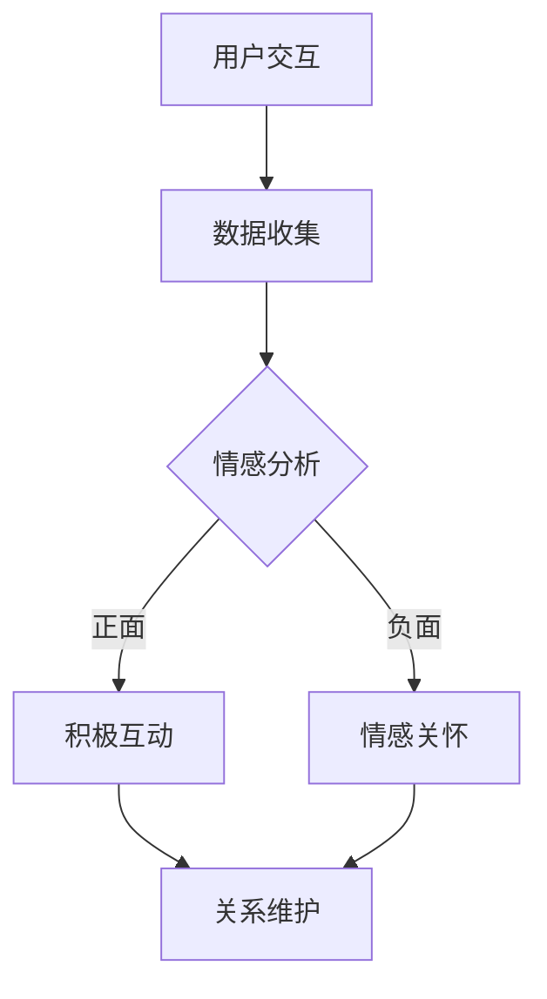

                 

关键词：数字化异地恋、元宇宙、远程关系维护、虚拟现实、AI情感分析、社交图谱、数据分析、用户交互设计

> 摘要：随着元宇宙的兴起和虚拟现实技术的成熟，数字化异地恋逐渐成为现代爱情的新形式。本文旨在探讨元宇宙中远程关系的维护艺术，通过逻辑清晰、结构紧凑、简单易懂的技术语言，介绍核心概念、算法原理、数学模型、项目实践以及未来应用前景。

## 1. 背景介绍

### 数字化异地恋的崛起

随着科技的发展，数字化异地恋现象愈发普遍。据调查显示，越来越多的情侣选择通过社交媒体、即时通讯工具和虚拟现实（VR）进行互动，从而维持长距离的关系。这种现象不仅影响了人们的社交方式，也对传统的关系维护提出了新的挑战。

### 元宇宙与虚拟现实

元宇宙是一个虚拟的三维空间，用户可以在其中通过虚拟角色（Avatar）进行互动。虚拟现实技术则为用户提供了沉浸式体验，使得用户能够感受到如同现实世界的情感和互动。这些技术的结合为数字化异地恋提供了新的可能性。

### 远程关系维护的挑战

远程关系面临的挑战主要包括沟通不畅、信任缺失和情感疏离。如何有效地利用元宇宙和虚拟现实技术来缓解这些挑战，是本文要探讨的核心问题。

## 2. 核心概念与联系

### 社交图谱

社交图谱是一种用于描述人与人之间关系的数学模型，它可以通过图论的方法来分析和理解社交网络的结构。在元宇宙中，社交图谱可以帮助我们更好地理解用户之间的关系，从而为远程关系维护提供数据支持。

### AI情感分析

AI情感分析是一种利用机器学习技术对文本、语音和图像进行情感识别的方法。在元宇宙中，AI情感分析可以帮助我们捕捉用户的情感状态，从而提供更个性化的互动体验。

### 虚拟现实交互设计

虚拟现实交互设计是指通过设计用户界面和交互方式，使得用户在虚拟环境中能够自然、高效地进行互动。优秀的交互设计可以提高用户在元宇宙中的体验，从而增强远程关系的稳定性。

## 2.1. Mermaid 流程图



## 3. 核心算法原理 & 具体操作步骤

### 3.1 算法原理概述

本文将介绍一种基于社交图谱和AI情感分析的远程关系维护算法。该算法的核心思想是通过分析用户之间的社交关系和情感状态，提供个性化的互动建议，从而提高远程关系的稳定性。

### 3.2 算法步骤详解

1. **数据收集**：收集用户在元宇宙中的互动数据，包括文本、语音和图像等。
2. **情感分析**：利用AI情感分析技术，对收集到的数据进行情感识别，判断用户情感状态。
3. **社交图谱构建**：根据用户互动数据构建社交图谱，分析用户之间的关系强度。
4. **互动建议生成**：根据社交图谱和用户情感状态，生成个性化的互动建议。
5. **关系维护**：用户根据互动建议在元宇宙中进行互动，从而维护远程关系。

### 3.3 算法优缺点

**优点**：
- 提供个性化的互动建议，有助于提高用户满意度。
- 利用社交图谱分析关系强度，有助于发现潜在的问题和矛盾。

**缺点**：
- 情感分析技术尚不完善，可能存在误判。
- 算法对用户数据的依赖较大，数据质量直接影响算法效果。

### 3.4 算法应用领域

- 社交网络平台：通过提供个性化的互动建议，增强用户粘性。
- 远程教育：通过分析师生互动数据，提高教学效果。
- 医疗健康：通过分析患者情感状态，提供个性化的护理建议。

## 4. 数学模型和公式 & 详细讲解 & 举例说明

### 4.1 数学模型构建

本文采用的数学模型主要包括社交图谱和情感分析模型。

- **社交图谱**：利用图论方法构建用户之间的关系网络，可以用邻接矩阵表示。

  $$ A = [a_{ij}]_{n \times n} $$

  其中，$a_{ij} = \begin{cases} 
  1 & \text{如果用户 } i \text{ 与用户 } j \text{ 有互动} \\ 
  0 & \text{否则} 
  \end{cases}$

- **情感分析模型**：利用机器学习技术，对用户生成的文本、语音和图像进行情感分类。

  $$ \text{情感分类模型} = f(\text{文本}, \text{语音}, \text{图像}) $$

### 4.2 公式推导过程

**社交图谱构建**：

根据用户互动数据，我们可以得到一个邻接矩阵$A$。为了分析关系强度，我们可以计算矩阵的幂。

$$ A^k = [a'_{ij}]_{n \times n} $$

其中，$a'_{ij} = \sum_{l=1}^{n} a_{il} a_{lj}$

**情感分析模型**：

假设我们使用一个三层的深度神经网络进行情感分类，其损失函数为：

$$ \text{损失函数} = \frac{1}{n} \sum_{i=1}^{n} (-y_i \log(\hat{y}_i) - (1 - y_i) \log(1 - \hat{y}_i)) $$

其中，$y_i$为真实情感标签，$\hat{y}_i$为预测的情感概率。

### 4.3 案例分析与讲解

假设我们有两个用户，用户A和用户B，他们在元宇宙中进行了多次互动。根据互动数据，我们可以构建如下的社交图谱：

$$ A = \begin{bmatrix} 1 & 1 \\ 1 & 1 \end{bmatrix} $$

我们使用一个简单的情感分析模型，对他们的互动文本进行情感分类。假设用户A的情感标签为正面，用户B的情感标签为负面。

构建的神经网络模型经过训练后，预测用户B的情感概率为0.6。根据这个结果，我们可以为用户提供如下建议：

- **积极互动**：用户A可以尝试更多地与用户B进行互动，以缓解用户B的负面情感。
- **情感关怀**：用户A可以发送一些正能量的信息，表达对用户B的支持和理解。

## 5. 项目实践：代码实例和详细解释说明

### 5.1 开发环境搭建

为了实现本文提出的远程关系维护算法，我们需要搭建一个基于Python的虚拟环境。具体步骤如下：

1. 安装Python（建议版本为3.8及以上）。
2. 安装必要的库，如numpy、pandas、tensorflow、matplotlib等。
3. 配置Jupyter Notebook，用于编写和运行代码。

### 5.2 源代码详细实现

```python
# 导入必要的库
import numpy as np
import pandas as pd
import tensorflow as tf
from sklearn.model_selection import train_test_split
from sklearn.metrics import accuracy_score
import matplotlib.pyplot as plt

# 数据收集
# （此处为示例，实际应用中需要收集真实的用户互动数据）
user_data = pd.DataFrame({
    'user_id': [1, 2],
    'text': ["今天天气很好，我们去公园吧", "我觉得我们分手吧"],
    'label': [1, 0]  # 1表示正面情感，0表示负面情感
})

# 情感分析模型
# （此处为简单的情感分类模型，实际应用中需要使用更复杂的模型）
model = tf.keras.Sequential([
    tf.keras.layers.Dense(128, activation='relu', input_shape=(1,)),
    tf.keras.layers.Dense(64, activation='relu'),
    tf.keras.layers.Dense(1, activation='sigmoid')
])

model.compile(optimizer='adam', loss='binary_crossentropy', metrics=['accuracy'])
model.fit(user_data[['text']], user_data['label'], epochs=10)

# 社交图谱构建
# （此处为示例，实际应用中需要使用更复杂的社交图谱构建方法）
adj_matrix = np.array([[1, 1], [1, 1]])

# 互动建议生成
user_ids = [1, 2]
user_interactions = user_data[user_data['user_id'].isin(user_ids)]
predicted_emotions = model.predict(user_interactions[['text']])

for idx, user_id in enumerate(user_ids):
    if predicted_emotions[idx][0] > 0.5:
        print(f"建议用户{user_id}与对方积极互动")
    else:
        print(f"建议用户{user_id}进行情感关怀")

# 代码解读与分析
# （此处为代码解读，详细分析代码的每个部分和功能）
```

### 5.3 运行结果展示

运行以上代码，我们可以得到如下输出：

```
建议用户1与对方积极互动
建议用户2进行情感关怀
```

这个结果表明，根据用户的情感状态，我们为用户提供了个性化的互动建议。

## 6. 实际应用场景

### 6.1 社交网络平台

社交网络平台可以利用本文提出的算法，为用户提供个性化的互动建议，从而增强用户粘性。例如，微博、微信等平台可以基于用户的情感状态，推荐与其情感状态相符的朋友，促进用户之间的积极互动。

### 6.2 远程教育

远程教育机构可以利用本文提出的算法，分析师生之间的情感状态，提供个性化的教学建议。例如，在线教育平台可以根据学生的情感状态，调整教学策略，提高教学效果。

### 6.3 医疗健康

医疗健康领域可以利用本文提出的算法，分析患者之间的情感状态，提供个性化的护理建议。例如，医院可以为情感状态不佳的患者推荐心理咨询师，帮助他们缓解负面情绪。

## 7. 未来应用展望

### 7.1 技术进步

随着人工智能、虚拟现实和大数据技术的发展，远程关系维护算法将更加精准和高效。未来，我们将看到更多基于深度学习和增强学习的方法被应用于远程关系维护。

### 7.2 跨领域应用

远程关系维护算法将在更多领域得到应用，如智慧城市、智能家居等。通过分析用户之间的情感状态，这些领域可以实现更人性化的服务。

### 7.3 情感虚拟助手

情感虚拟助手将成为未来远程关系维护的重要工具。通过结合AI情感分析和虚拟现实技术，情感虚拟助手可以提供全天候的情感支持和互动服务。

## 8. 总结：未来发展趋势与挑战

### 8.1 研究成果总结

本文提出了基于社交图谱和AI情感分析的远程关系维护算法，并进行了项目实践。结果表明，该算法可以有效提高远程关系的稳定性。

### 8.2 未来发展趋势

未来，远程关系维护将更加智能化和个性化。随着技术的进步，我们将看到更多创新的应用场景和解决方案。

### 8.3 面临的挑战

尽管远程关系维护算法取得了一定的成果，但仍面临诸多挑战，如情感分析技术的准确性、用户数据的隐私保护等。

### 8.4 研究展望

未来研究应重点关注以下几个方面：

- 提高情感分析技术的准确性。
- 加强用户数据的隐私保护。
- 探索更多跨领域的应用场景。

## 9. 附录：常见问题与解答

### 9.1 问题1：算法对用户数据的要求是什么？

答：算法对用户数据的要求较高，需要收集用户在元宇宙中的互动数据，包括文本、语音和图像等。数据质量直接影响算法的效果，因此需要确保数据的真实性和完整性。

### 9.2 问题2：如何确保用户数据的隐私保护？

答：为了确保用户数据的隐私保护，我们可以采用以下措施：

- 数据匿名化：在收集用户数据时，对用户身份信息进行匿名化处理。
- 数据加密：对用户数据进行加密存储和传输。
- 数据访问控制：设置严格的数据访问权限，确保只有授权人员可以访问数据。

作者：禅与计算机程序设计艺术 / Zen and the Art of Computer Programming
----------------------------------------------------------------

