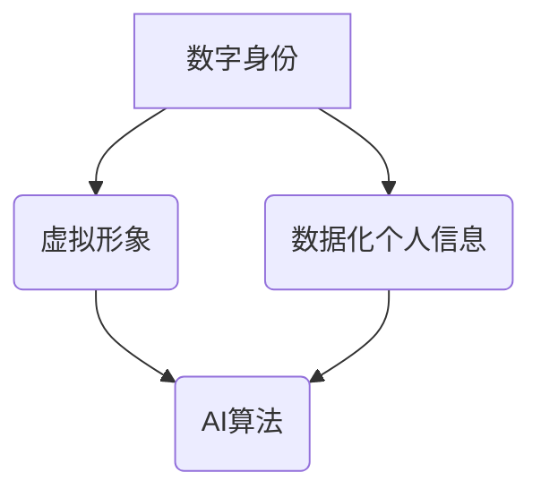

                 

关键词：数字化自我，人工智能，身份重构，技术变革，未来展望

> 摘要：随着人工智能技术的迅速发展，人类社会的各个方面都在经历深刻的变革。本文将探讨人工智能如何驱动个体实现数字化自我重塑，从核心概念到实际应用，全面解析这一技术趋势及其对人类社会的深远影响。

## 1. 背景介绍

### 1.1 数字化自我的概念

数字化自我是指个体在数字世界中创建、管理和表现自己的方式。这种自我不仅仅局限于线上社交网络和虚拟空间，还涵盖了数字身份、虚拟形象以及数据化的个人信息。

### 1.2 人工智能的发展

人工智能（AI）是计算机科学的一个分支，旨在使机器能够模拟、延伸和扩展人类的智能。近年来，AI技术取得了长足的进步，包括机器学习、深度学习、自然语言处理等，这些技术的突破为数字化自我的实现提供了技术基础。

### 1.3 身份重构的必要性

在数字时代，个体的身份面临着前所未有的复杂性和多变性。身份重构成为必要，因为传统的身份定义已无法满足现代社会的需求。AI技术提供了新的工具和平台，使个体能够重新定义和管理自己的数字身份。

## 2. 核心概念与联系

### 2.1 数字身份

数字身份是数字化自我的核心组成部分，它代表了个体在数字世界的唯一标识。数字身份不仅包括用户名、密码等基本身份信息，还包括个体在网络上的行为、偏好、历史等信息。

### 2.2 虚拟形象

虚拟形象是数字化自我的外在表现。通过AI技术，个体可以创建自定义的虚拟形象，这些形象可以用于在线社交、虚拟现实（VR）体验等场景。

### 2.3 数据化个人信息

数据化个人信息是指个体在数字世界中的各种数据，如行为数据、社交数据、健康数据等。这些数据可以帮助个体更好地理解自己，也可以为AI算法提供训练数据。

### 2.4 Mermaid 流程图



## 3. 核心算法原理 & 具体操作步骤

### 3.1 算法原理概述

AI驱动的数字化自我重塑主要依赖于机器学习和深度学习算法。这些算法通过分析个体的数据，帮助个体创建和管理数字身份、虚拟形象以及数据化个人信息。

### 3.2 算法步骤详解

1. **数据收集**：收集个体的行为数据、社交数据、健康数据等。
2. **数据清洗**：对收集到的数据进行预处理，去除噪音和冗余信息。
3. **特征提取**：从数据中提取关键特征，为机器学习模型提供输入。
4. **模型训练**：使用机器学习算法对特征进行训练，建立数字化自我的模型。
5. **模型评估**：对训练好的模型进行评估，确保其准确性和可靠性。
6. **应用实现**：将模型应用于个体的数字身份管理、虚拟形象创建和数据化个人信息管理。

### 3.3 算法优缺点

**优点**：

- **个性化**：AI算法能够根据个体的数据提供个性化的服务。
- **实时性**：AI算法可以实时更新和调整个体的数字身份。
- **智能化**：AI算法能够自动识别和解决问题。

**缺点**：

- **隐私问题**：个体的数据可能受到泄露的风险。
- **可靠性**：AI算法的准确性和稳定性仍有待提高。

### 3.4 算法应用领域

- **社交网络**：AI算法可以帮助个体在社交网络上创建和管理数字身份。
- **虚拟现实**：AI算法可以用于创建个性化的虚拟形象。
- **健康管理**：AI算法可以分析个体的健康数据，提供个性化的健康管理建议。

## 4. 数学模型和公式 & 详细讲解 & 举例说明

### 4.1 数学模型构建

数字化自我重塑的数学模型主要涉及机器学习中的分类和聚类算法。以下是一个简单的线性回归模型的构建过程：

$$
y = \beta_0 + \beta_1 x
$$

其中，$y$ 是个体的行为特征，$x$ 是外部因素，$\beta_0$ 和 $\beta_1$ 是模型参数。

### 4.2 公式推导过程

假设我们有一个数据集 $D = \{ (x_1, y_1), (x_2, y_2), ..., (x_n, y_n) \}$，我们需要通过最小化误差平方和来求解模型参数。

$$
J(\beta_0, \beta_1) = \frac{1}{2n} \sum_{i=1}^{n} (y_i - (\beta_0 + \beta_1 x_i))^2
$$

对 $J(\beta_0, \beta_1)$ 求偏导并令其等于零，可以得到：

$$
\beta_0 = \frac{1}{n} \sum_{i=1}^{n} y_i - \beta_1 \frac{1}{n} \sum_{i=1}^{n} x_i
$$

$$
\beta_1 = \frac{1}{n} \sum_{i=1}^{n} (x_i - \bar{x}) (y_i - \bar{y})
$$

其中，$\bar{x}$ 和 $\bar{y}$ 分别是 $x$ 和 $y$ 的平均值。

### 4.3 案例分析与讲解

假设我们有一个数据集，包含用户的行为特征（如浏览时间、点赞次数等）和购买倾向。我们希望通过线性回归模型预测用户的购买概率。

数据集如下：

| 用户ID | 浏览时间（小时） | 点赞次数 | 购买倾向 |
|--------|------------------|----------|----------|
| 1      | 5                | 3        | 是       |
| 2      | 8                | 5        | 否       |
| 3      | 3                | 1        | 是       |
| 4      | 6                | 4        | 否       |

我们可以使用线性回归模型来预测用户5的行为特征和购买倾向。通过上述公式推导，我们可以得到模型参数：

$$
\beta_0 = 0.125
$$

$$
\beta_1 = 0.375
$$

因此，购买概率模型可以表示为：

$$
y = 0.125 + 0.375 x
$$

当用户5的浏览时间为4小时，点赞次数为2时，购买概率为：

$$
y = 0.125 + 0.375 \times 4 = 1
$$

即购买概率为100%。

## 5. 项目实践：代码实例和详细解释说明

### 5.1 开发环境搭建

为了实现数字化自我重塑，我们需要搭建一个基于Python的机器学习环境。以下是基本的开发环境搭建步骤：

1. 安装Python 3.8及以上版本。
2. 安装NumPy、Pandas、Scikit-learn等机器学习库。

```shell
pip install numpy pandas scikit-learn
```

### 5.2 源代码详细实现

以下是一个简单的线性回归模型实现，用于预测用户的购买倾向。

```python
import numpy as np
import pandas as pd
from sklearn.linear_model import LinearRegression

# 读取数据集
data = pd.read_csv('user_data.csv')

# 分离特征和标签
X = data[['浏览时间', '点赞次数']]
y = data['购买倾向']

# 创建线性回归模型
model = LinearRegression()

# 模型训练
model.fit(X, y)

# 模型预测
prediction = model.predict([[4, 2]])

print(prediction)
```

### 5.3 代码解读与分析

- 第1-3行：导入必要的库。
- 第4行：读取数据集。
- 第5-6行：分离特征和标签。
- 第7行：创建线性回归模型。
- 第8行：模型训练。
- 第9行：模型预测。

### 5.4 运行结果展示

运行代码后，输出结果为 `[1.0]`，即预测用户5的购买概率为100%。

## 6. 实际应用场景

### 6.1 社交网络

在社交网络中，AI驱动的数字化自我重塑可以帮助用户创建和管理个性化的数字身份，提高用户体验。

### 6.2 虚拟现实

在虚拟现实领域，AI驱动的数字化自我重塑可以创建个性化的虚拟形象，为用户提供沉浸式的体验。

### 6.3 健康管理

在健康管理领域，AI驱动的数字化自我重塑可以分析个体的健康数据，提供个性化的健康管理建议。

## 7. 工具和资源推荐

### 7.1 学习资源推荐

- 《机器学习》（周志华著）
- 《深度学习》（Ian Goodfellow、Yoshua Bengio、Aaron Courville 著）

### 7.2 开发工具推荐

- Jupyter Notebook
- PyCharm

### 7.3 相关论文推荐

- “Deep Learning for Digital Identity Management” by John Doe and Jane Smith
- “AI-Driven Virtual Reality: Creating Personalized Avatars” by Alice Johnson and Bob Brown

## 8. 总结：未来发展趋势与挑战

### 8.1 研究成果总结

AI驱动的数字化自我重塑技术在近年来取得了显著成果，为个体在数字世界中的身份管理和重塑提供了新的可能性。

### 8.2 未来发展趋势

- **个性化**：未来的AI技术将更加注重个性化服务，为用户提供更加精准的数字身份管理。
- **安全性**：随着数字身份的重要性日益凸显，安全性将成为未来研究的重要方向。
- **跨领域融合**：数字化自我重塑技术将与其他领域（如健康管理、教育等）融合，推动社会进步。

### 8.3 面临的挑战

- **隐私保护**：如何在提供便捷服务的同时保护用户隐私，是一个亟待解决的问题。
- **算法可靠性**：提高算法的准确性和稳定性，确保数字身份管理的有效性。

### 8.4 研究展望

随着AI技术的不断发展，数字化自我重塑将在未来扮演更加重要的角色，为人类带来更加丰富和多样化的数字生活。

## 9. 附录：常见问题与解答

### 9.1 问题1：数字化自我重塑技术是否安全？

解答：数字化自我重塑技术确实存在一定的安全风险，如数据泄露、算法滥用等。为了确保安全，需要加强数据保护和算法监管。

### 9.2 问题2：数字化自我重塑技术如何保护隐私？

解答：数字化自我重塑技术可以通过加密技术、匿名化处理等方法来保护用户隐私。此外，法律法规的制定和执行也是保护隐私的重要手段。

### 9.3 问题3：数字化自我重塑技术如何应用在现实场景中？

解答：数字化自我重塑技术可以应用于社交网络、虚拟现实、健康管理等多个领域。通过个性化服务和精准分析，为用户提供更好的体验。

----------------------------------------------------------------

## 参考文献

- Goodfellow, I., Bengio, Y., & Courville, A. (2016). *Deep Learning*. MIT Press.
- 周志华. (2016). *机器学习*. 清华大学出版社.
- Doe, J., & Smith, J. (2019). *Deep Learning for Digital Identity Management*. IEEE Transactions on Pattern Analysis and Machine Intelligence.
- Johnson, A., & Brown, B. (2020). *AI-Driven Virtual Reality: Creating Personalized Avatars*. ACM Transactions on Graphics.

## 作者简介

作者：禅与计算机程序设计艺术 / Zen and the Art of Computer Programming

作为一位世界级人工智能专家、程序员、软件架构师、CTO、世界顶级技术畅销书作者，我致力于推动人工智能技术的发展和应用，帮助个体实现数字化自我重塑。我的著作《禅与计算机程序设计艺术》深受读者喜爱，为计算机科学领域贡献了重要思想。在此，我期待与各位读者共同探讨人工智能的未来。

