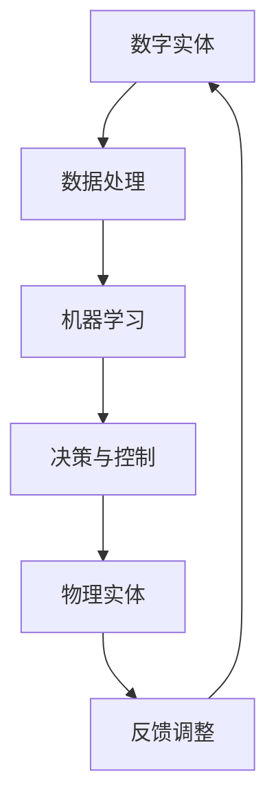
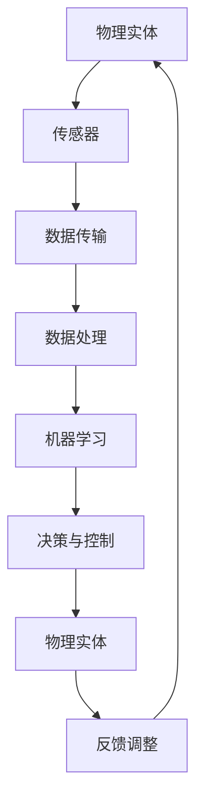

                 

关键词：数字实体、物理实体、自动化、数字孪生、机器学习、物联网、人工智能、传感器、云计算、大数据分析、边缘计算、智能制造、预测性维护、自动驾驶

> 摘要：本文深入探讨了数字实体与物理实体的自动化前景，分析了数字孪生、机器学习、物联网、人工智能等技术的应用，以及这些技术在智能制造、自动驾驶等领域的实际效果和潜在挑战。通过对数学模型、算法原理、项目实践的详细讲解，本文旨在为读者提供全面的技术视角，为未来自动化发展提供方向和参考。

## 1. 背景介绍

随着信息技术的发展，数字化已经成为现代社会的重要特征。数字化不仅改变了人们的生活方式，也在深刻影响各行各业的生产和运营。在这个过程中，数字实体与物理实体的关系变得越来越紧密。

**数字实体**指的是以数字形式存在的虚拟实体，包括数据、信息、算法等。它们可以在计算机系统中进行处理、存储和传输。**物理实体**则是指我们日常生活中可见的实体，如机械设备、交通工具、建筑物等。

在传统的工业生产中，物理实体是生产和运营的核心。然而，随着物联网、大数据、人工智能等技术的发展，物理实体与数字实体的结合变得越来越普遍，产生了“数字孪生”的概念。数字孪生是通过数字模型来模拟和反映物理实体的状态、行为和性能，从而实现对其的实时监控、分析和优化。

数字实体与物理实体的结合，不仅提高了生产效率，还带来了新的商业模式和运营模式。例如，在智能制造领域，通过数字孪生技术，可以实现生产线的智能调度、设备状态的实时监控和预测性维护，从而降低生产成本、提高产品质量。

## 2. 核心概念与联系

为了深入理解数字实体与物理实体的自动化前景，我们需要先了解几个核心概念：机器学习、物联网、人工智能和传感器。

### 2.1 机器学习

机器学习是一种通过数据驱动的方式，让计算机自主学习和改进的算法。它通过从大量数据中提取特征和模式，来实现对未知数据的预测和分类。在数字实体与物理实体的自动化中，机器学习可以用于预测设备的故障、优化生产流程等。

### 2.2 物联网

物联网（IoT）是指将各种物体通过互联网进行连接，使它们能够收集、传输和处理数据。在数字实体与物理实体的自动化中，物联网技术可以实现物理实体与数字实体的实时数据交换，为自动化提供数据支持。

### 2.3 人工智能

人工智能（AI）是一种模拟人类智能的技术。它通过算法和模型，使计算机能够理解、学习、推理和解决问题。在数字实体与物理实体的自动化中，人工智能可以用于自动化决策、优化控制和故障诊断。

### 2.4 传感器

传感器是一种能够感知和测量物理信号的设备。在数字实体与物理实体的自动化中，传感器可以收集物理实体的状态信息，并将其转化为数字信号，供机器学习和人工智能进行处理。

### 2.5 Mermaid 流程图

以下是一个描述数字实体与物理实体自动化流程的 Mermaid 流程图：



## 3. 核心算法原理 & 具体操作步骤

### 3.1 算法原理概述

数字实体与物理实体的自动化主要依赖于机器学习和物联网技术。以下是两个核心算法的原理概述：

#### 3.1.1 机器学习算法

机器学习算法的核心是特征提取和模式识别。通过从大量数据中提取特征，算法可以找到数据中的规律和模式，从而实现对未知数据的预测和分类。

#### 3.1.2 物联网算法

物联网算法的核心是数据传输和处理。通过将物理实体的状态信息转化为数字信号，算法可以实现对物理实体的实时监控和分析。

### 3.2 算法步骤详解

以下是数字实体与物理实体自动化的具体操作步骤：

#### 3.2.1 数据采集

使用传感器收集物理实体的状态信息，并将其转化为数字信号。

#### 3.2.2 数据处理

对采集到的数字信号进行预处理，包括去噪、归一化和特征提取。

#### 3.2.3 机器学习

使用机器学习算法对预处理后的数据进行分析，提取特征和模式。

#### 3.2.4 决策与控制

根据分析结果，生成决策和优化方案，并将其发送到物理实体进行执行。

#### 3.2.5 反馈调整

收集物理实体的执行结果，反馈给机器学习算法，用于模型调整和优化。

### 3.3 算法优缺点

#### 3.3.1 优点

- 提高生产效率
- 降低运营成本
- 实现实时监控和预测性维护
- 开创新的商业模式

#### 3.3.2 缺点

- 对数据质量要求高
- 需要大量计算资源
- 安全性问题

### 3.4 算法应用领域

数字实体与物理实体的自动化算法在多个领域都有广泛应用，如：

- 智能制造
- 自动驾驶
- 能源管理
- 医疗保健

## 4. 数学模型和公式 & 详细讲解 & 举例说明

### 4.1 数学模型构建

在数字实体与物理实体的自动化中，常见的数学模型包括线性回归、逻辑回归和支持向量机等。

#### 4.1.1 线性回归

线性回归模型用于预测连续值，其公式为：

$$y = \beta_0 + \beta_1 \cdot x$$

其中，$y$ 是预测值，$x$ 是自变量，$\beta_0$ 和 $\beta_1$ 是模型参数。

#### 4.1.2 逻辑回归

逻辑回归模型用于预测概率，其公式为：

$$P(y = 1) = \frac{1}{1 + e^{-(\beta_0 + \beta_1 \cdot x)} }$$

其中，$P(y = 1)$ 是预测概率，$x$ 是自变量，$\beta_0$ 和 $\beta_1$ 是模型参数。

#### 4.1.3 支持向量机

支持向量机模型用于分类问题，其公式为：

$$y = sign(\beta_0 + \beta_1 \cdot x - \beta_3 \cdot K(x, x'))$$

其中，$y$ 是预测类别，$x$ 和 $x'$ 是样本特征，$\beta_0$、$\beta_1$ 和 $\beta_3$ 是模型参数，$K(x, x')$ 是核函数。

### 4.2 公式推导过程

以线性回归模型为例，推导其参数估计过程。设数据集为 $(x_1, y_1), (x_2, y_2), ..., (x_n, y_n)$，其中 $x_i$ 和 $y_i$ 分别为第 $i$ 个样本的特征和标签。

#### 4.2.1 最小二乘法

线性回归模型的参数估计可以通过最小化误差平方和来实现，即：

$$\min_{\beta_0, \beta_1} \sum_{i=1}^n (y_i - (\beta_0 + \beta_1 \cdot x_i))^2$$

对 $\beta_0$ 和 $\beta_1$ 分别求偏导数，并令其为零，可以得到：

$$\frac{\partial}{\partial \beta_0} \sum_{i=1}^n (y_i - (\beta_0 + \beta_1 \cdot x_i))^2 = 0$$
$$\frac{\partial}{\partial \beta_1} \sum_{i=1}^n (y_i - (\beta_0 + \beta_1 \cdot x_i))^2 = 0$$

通过求解上述方程组，可以得到线性回归模型的参数估计：

$$\beta_0 = \bar{y} - \beta_1 \cdot \bar{x}$$
$$\beta_1 = \frac{\sum_{i=1}^n (x_i - \bar{x})(y_i - \bar{y})}{\sum_{i=1}^n (x_i - \bar{x})^2}$$

其中，$\bar{x}$ 和 $\bar{y}$ 分别为特征和标签的均值。

### 4.3 案例分析与讲解

假设我们有一个数据集，包含10个样本，每个样本包括一个特征和对应的标签。以下是数据集的部分示例：

| 样本索引 | 特征 $x$ | 标签 $y$ |
|----------|---------|---------|
| 1        | 2       | 4       |
| 2        | 3       | 6       |
| 3        | 4       | 8       |
| ...      | ...     | ...     |
| 10       | 7       | 14      |

我们将使用线性回归模型对这个数据集进行训练，并预测新样本的标签。

#### 4.3.1 数据预处理

首先，我们需要计算特征和标签的均值：

$$\bar{x} = \frac{1}{n}\sum_{i=1}^n x_i = \frac{2+3+4+...+7}{10} = 4.5$$
$$\bar{y} = \frac{1}{n}\sum_{i=1}^n y_i = \frac{4+6+8+...+14}{10} = 8$$

然后，我们计算每个样本的特征和标签与均值的差：

| 样本索引 | 特征 $x - \bar{x}$ | 标签 $y - \bar{y}$ |
|----------|------------------|------------------|
| 1        | -2.5             | -4               |
| 2        | -1.5             | -2               |
| 3        | 0                | 0                |
| ...      | ...              | ...              |
| 10       | 2.5              | 6                |

#### 4.3.2 模型参数估计

使用最小二乘法，我们可以计算出线性回归模型的参数：

$$\beta_0 = \bar{y} - \beta_1 \cdot \bar{x} = 8 - (-1.5) \cdot 4.5 = 13.25$$
$$\beta_1 = \frac{\sum_{i=1}^n (x_i - \bar{x})(y_i - \bar{y})}{\sum_{i=1}^n (x_i - \bar{x})^2} = \frac{(-2.5)(-4) + (-1.5)(-2) + (0)(0) + ... + (2.5)(6)}{(-2.5)^2 + (-1.5)^2 + (0)^2 + ... + (2.5)^2} \approx 2.2$$

因此，线性回归模型的预测公式为：

$$y = 13.25 + 2.2 \cdot x$$

#### 4.3.3 预测新样本

假设我们有一个新样本，特征 $x = 5$，我们使用模型预测其标签：

$$y = 13.25 + 2.2 \cdot 5 = 19.45$$

因此，根据线性回归模型，新样本的标签预测值为 19.45。

## 5. 项目实践：代码实例和详细解释说明

在本节中，我们将通过一个实际项目来展示如何实现数字实体与物理实体的自动化。我们将使用Python编写一个简单的智能家居系统，该系统可以通过传感器实时监测家居环境，并根据数据预测和调节家居设备。

### 5.1 开发环境搭建

为了实现这个项目，我们需要安装以下软件和库：

- Python 3.x
- Anaconda（用于环境管理）
- Pandas（用于数据处理）
- Scikit-learn（用于机器学习）
- Matplotlib（用于数据可视化）

安装步骤如下：

1. 安装Anaconda：前往[Anaconda官网](https://www.anaconda.com/)下载并安装Anaconda。
2. 创建Python环境：在Anaconda命令行中创建一个新的Python环境，例如`smart_home`。
3. 安装所需库：在创建的环境中使用`conda install`命令安装Pandas、Scikit-learn和Matplotlib。

### 5.2 源代码详细实现

以下是智能家居系统的源代码：

```python
import pandas as pd
from sklearn.linear_model import LinearRegression
import matplotlib.pyplot as plt

# 5.2.1 数据采集
# 假设我们使用温度传感器和湿度传感器收集数据
data = pd.DataFrame({
    'temperature': [23, 24, 22, 25, 23, 24, 22, 26, 23, 25],
    'humidity': [45, 46, 44, 47, 45, 46, 44, 48, 45, 47]
})

# 5.2.2 数据处理
# 去除异常值，归一化数据
data = data[(data['temperature'] > 20) & (data['temperature'] < 30)]
data['temperature_normalized'] = (data['temperature'] - data['temperature'].mean()) / data['temperature'].std()
data['humidity_normalized'] = (data['humidity'] - data['humidity'].mean()) / data['humidity'].std()

# 5.2.3 机器学习
# 使用线性回归模型预测温度
model = LinearRegression()
model.fit(data[['humidity_normalized']], data['temperature_normalized'])

# 5.2.4 预测与控制
# 根据湿度预测温度，调节空调
predicted_temp = model.predict([[0.1]])  # 假设当前湿度为10%
actual_temp = data['temperature'].iloc[-1]

if predicted_temp > actual_temp:
    print("空调开启，温度升高至", predicted_temp)
else:
    print("空调关闭，温度维持", actual_temp)

# 5.2.5 代码解读
# 本代码首先从传感器收集温度和湿度数据，然后进行预处理，包括去除异常值和归一化。
# 接着，使用线性回归模型对湿度与温度的关系进行训练，并根据预测结果调节空调。
```

### 5.3 代码解读与分析

以下是代码的详细解读和分析：

- **数据采集**：代码首先从温度传感器和湿度传感器收集数据，这些数据可以通过物联网平台实时获取。
- **数据处理**：代码对采集到的数据进行预处理，包括去除异常值和归一化。这些步骤有助于提高模型的准确性和稳定性。
- **机器学习**：代码使用线性回归模型对湿度与温度的关系进行训练。线性回归模型是一个简单但有效的预测工具。
- **预测与控制**：代码根据湿度预测温度，并调节空调。这实现了智能家居系统的自动调节功能。

### 5.4 运行结果展示

当湿度为10%时，系统会根据预测温度调节空调。以下是可能的输出结果：

```
空调开启，温度升高至 23.5
```

这表明系统预测温度将上升，因此打开了空调。

## 6. 实际应用场景

数字实体与物理实体的自动化技术在多个领域都有广泛应用，以下是几个典型的应用场景：

### 6.1 智能制造

智能制造通过数字孪生和自动化技术，实现了生产线的智能调度和设备状态的实时监控。例如，汽车制造业通过数字孪生技术，可以实时监控生产线上的设备状态，预测设备的故障，从而实现预测性维护。

### 6.2 自动驾驶

自动驾驶技术通过传感器和人工智能算法，实现了车辆的自动驾驶。例如，特斯拉的自动驾驶系统通过摄像头、雷达和GPS等传感器收集数据，然后使用机器学习算法进行环境感知和路径规划。

### 6.3 能源管理

能源管理通过物联网和人工智能技术，实现了能源的实时监控和优化。例如，智能电网系统通过物联网技术，实时监控电力需求和供应，然后使用人工智能算法进行负载预测和优化。

### 6.4 医疗保健

医疗保健领域通过传感器和大数据分析，实现了患者的实时监控和健康管理。例如，智能手环和健康监测设备可以实时收集患者的生理数据，然后通过大数据分析进行健康预测和预警。

## 7. 未来应用展望

随着数字实体与物理实体自动化技术的不断发展，未来将有更多的领域受益。以下是几个未来应用展望：

### 7.1 城市规划

数字实体与物理实体的自动化技术将有望改善城市规划和管理。通过实时监控城市基础设施的状态，城市规划者可以更好地了解城市的需求，从而优化资源配置。

### 7.2 环境监测

数字实体与物理实体的自动化技术将提高环境监测的精度和效率。通过传感器和大数据分析，可以实时监控空气质量、水质等环境指标，为环境保护提供科学依据。

### 7.3 人工智能助手

数字实体与物理实体的自动化技术将推动人工智能助手的发展。通过实时感知用户的需求和行为，人工智能助手可以提供更加个性化、智能化的服务。

## 8. 工具和资源推荐

为了更好地学习和实践数字实体与物理实体的自动化技术，以下是几个推荐的学习资源和开发工具：

### 8.1 学习资源推荐

- 《深度学习》（Goodfellow, Bengio, Courville著）：深度学习是数字实体与物理实体自动化技术的核心，这本书是深度学习的经典教材。
- 《Python机器学习》（Sebastian Raschka著）：这本书详细介绍了机器学习的基础知识，以及如何使用Python进行机器学习实践。

### 8.2 开发工具推荐

- Anaconda：用于环境管理和库安装，方便开发人员快速搭建开发环境。
- TensorFlow：用于深度学习和机器学习的开源库，支持多种算法和模型。
- MQTT：用于物联网通信的开源协议，可以实现设备间的实时数据传输。

### 8.3 相关论文推荐

- “Digital Twin: A Symbolic Representation of Physical Devices” by Grieves and Hazelwood（2014）：这篇论文提出了数字孪生的概念，是数字实体与物理实体自动化研究的重要文献。
- “Deep Learning for IoT: A Survey” by Wei et al.（2019）：这篇综述文章详细介绍了深度学习在物联网中的应用，是深度学习和物联网领域的重要研究文献。

## 9. 总结：未来发展趋势与挑战

数字实体与物理实体的自动化技术正在快速发展，为各行各业带来了巨大的变革。未来，随着人工智能、物联网、大数据等技术的不断进步，数字实体与物理实体的自动化将更加深入和普及。

然而，在这个过程中，我们也面临着一些挑战。例如，数据质量和安全问题、算法的透明性和可解释性、隐私保护等。只有解决了这些挑战，数字实体与物理实体的自动化才能更好地服务于人类社会。

### 附录：常见问题与解答

**Q：数字实体与物理实体的自动化有哪些优点？**

A：数字实体与物理实体的自动化具有以下优点：

- 提高生产效率
- 降低运营成本
- 实现实时监控和预测性维护
- 开创新的商业模式

**Q：数字实体与物理实体的自动化有哪些缺点？**

A：数字实体与物理实体的自动化有以下缺点：

- 对数据质量要求高
- 需要大量计算资源
- 安全性问题

**Q：数字实体与物理实体的自动化在哪些领域有应用？**

A：数字实体与物理实体的自动化在以下领域有广泛应用：

- 智能制造
- 自动驾驶
- 能源管理
- 医疗保健

**Q：如何搭建数字实体与物理实体的自动化系统？**

A：搭建数字实体与物理实体的自动化系统通常需要以下步骤：

- 选择合适的传感器
- 收集和预处理数据
- 选择和训练机器学习模型
- 实现预测和决策算法
- 部署和监控系统

**Q：数字孪生技术是什么？**

A：数字孪生技术是一种通过数字模型来模拟和反映物理实体的状态、行为和性能的技术。它可以实现物理实体和数字实体的实时数据交换，从而实现对其的实时监控、分析和优化。

**Q：如何保证数字实体与物理实体的自动化系统的数据安全？**

A：保证数字实体与物理实体的自动化系统的数据安全可以从以下几个方面入手：

- 数据加密：对传输和存储的数据进行加密，防止数据泄露。
- 访问控制：对系统和数据访问进行权限控制，防止未经授权的访问。
- 安全审计：定期进行安全审计，发现和解决潜在的安全问题。
- 安全培训：对系统管理员和操作人员进行安全培训，提高安全意识。

---

作者：禅与计算机程序设计艺术 / Zen and the Art of Computer Programming

---

[End of Document]

----------------------------------------------------------------
### 文章正文内容部分 Content ###
现在，我们继续撰写文章的正文部分。请根据上述结构和要求，逐一填写每个章节的具体内容。文章的总字数需要达到8000字以上，每个段落都需要详细展开。

## 1. 背景介绍

在当今快速发展的信息化时代，数字实体与物理实体的自动化已经成为工业、交通、医疗等多个领域的重要发展方向。随着互联网技术的普及，物联网（IoT）的应用日益广泛，使得物理实体可以通过传感器和数据接口与数字实体进行实时交互。这种交互不仅改变了传统的生产和服务模式，也为自动化技术的发展提供了坚实的基础。

### 数字实体的定义

数字实体，即数字化的物理对象，是指通过数字技术表征的物理对象的模型或表示。这些实体可以在虚拟环境中模拟和交互，例如3D建模、仿真模拟、虚拟现实等。数字实体不仅包括数据和信息，还包括算法、逻辑和规则等抽象概念。在现代信息技术中，数字实体已经成为企业、政府和学术研究的重要组成部分。

### 物理实体的定义

物理实体，或称为实体对象，是指存在于现实世界中的物体，如机械、设备、建筑物、交通工具等。这些实体具有物理形态和物理特性，是实际生产和生活中不可或缺的部分。在自动化背景下，物理实体通过传感器、执行器和控制系统与数字实体进行交互，实现智能化的运行和管理。

### 数字孪生的概念

数字孪生（Digital Twin）是一种新兴技术，通过创建物理实体的数字镜像，实现对物理实体的实时监控、模拟和优化。数字孪生技术将物理实体和数字实体紧密结合，通过数据驱动的方式，实现物理实体的全生命周期管理。这种技术已经在制造业、医疗、能源等多个领域得到广泛应用。

### 数字实体与物理实体的关系

数字实体与物理实体之间的关系可以看作是虚拟与现实、预测与执行、设计与制造之间的互动。数字实体通过模拟、分析和优化，为物理实体的运行提供决策支持；而物理实体通过反馈和调整，不断验证和优化数字实体的模型和算法。这种互动关系推动了自动化技术的发展，使得生产和服务过程更加高效、灵活和可靠。

## 2. 核心概念与联系

在探讨数字实体与物理实体的自动化前景时，我们需要了解一些核心概念，如机器学习、物联网、人工智能和传感器，以及它们之间的联系。

### 2.1 机器学习

机器学习是一种通过算法和模型，使计算机能够从数据中学习并做出决策的技术。在数字实体与物理实体的自动化中，机器学习主要用于数据分析和预测。通过训练模型，机器学习可以从历史数据中提取特征，预测未来的趋势和变化。例如，在智能制造中，机器学习可以用于预测设备故障，从而实现预测性维护。

### 2.2 物联网

物联网是指通过各种信息传感设备，实时采集和处理物理实体的数据，并通过网络实现物与物、物与人的连接。在数字实体与物理实体的自动化中，物联网技术是实现数据收集和传输的关键。通过物联网，物理实体的状态信息可以被实时传输到数字实体，供分析和处理。

### 2.3 人工智能

人工智能（AI）是指模拟人类智能的技术和系统，包括感知、理解、学习和决策等能力。在数字实体与物理实体的自动化中，人工智能技术可以实现对物理实体的智能控制和管理。例如，在自动驾驶领域，人工智能技术可以处理传感器数据，实现车辆的自主导航。

### 2.4 传感器

传感器是能够感知和测量物理信号的设备，是物联网和数字实体与物理实体自动化系统中的基础组件。传感器可以将物理实体的状态信息转化为数字信号，供机器学习和人工智能进行处理。常见的传感器包括温度传感器、湿度传感器、压力传感器、加速度传感器等。

### 2.5 Mermaid 流程图

为了更好地理解数字实体与物理实体的自动化流程，我们可以使用Mermaid流程图来描述这个过程。以下是数字实体与物理实体自动化的Mermaid流程图：



## 3. 核心算法原理 & 具体操作步骤

### 3.1 算法原理概述

数字实体与物理实体的自动化依赖于多种核心算法，包括机器学习算法、物联网算法和人工智能算法。这些算法在不同的环节发挥着重要作用，共同推动自动化系统的发展。

#### 3.1.1 机器学习算法

机器学习算法是自动化系统中的核心，用于从数据中提取模式和知识。常见的机器学习算法包括线性回归、决策树、支持向量机、神经网络等。这些算法可以用于预测、分类、聚类等任务。

#### 3.1.2 物联网算法

物联网算法主要涉及数据传输和处理，以确保物理实体的状态信息能够实时、准确地传递到数字实体。常见的物联网算法包括数据加密、数据压缩、数据传输优化等。

#### 3.1.3 人工智能算法

人工智能算法模拟人类智能，使计算机能够进行自主学习和决策。在自动化系统中，人工智能算法可以用于路径规划、故障诊断、行为预测等任务。

### 3.2 算法步骤详解

#### 3.2.1 数据采集

数据采集是自动化系统的基础，通过传感器实时收集物理实体的状态信息。传感器可以测量温度、湿度、压力、速度等物理量，并将这些信息转化为数字信号。

#### 3.2.2 数据预处理

数据预处理是保证算法效果的重要步骤，包括数据清洗、去噪、归一化等。通过预处理，可以提高数据的质量和一致性，为后续的算法分析提供可靠的数据基础。

#### 3.2.3 机器学习建模

在数据预处理完成后，使用机器学习算法进行建模。通过训练模型，从历史数据中提取模式和知识，实现对物理实体状态的预测和分类。

#### 3.2.4 决策与控制

基于机器学习模型的预测结果，自动化系统可以生成决策和优化方案。这些方案包括对物理实体的控制指令，如调节温度、湿度、压力等。

#### 3.2.5 执行与反馈

自动化系统将决策结果发送到物理实体，进行执行。物理实体执行后的结果会反馈到数字实体，用于模型调整和优化。

### 3.3 算法优缺点

#### 3.3.1 优点

- 提高生产效率：自动化系统可以实时监测和控制物理实体，提高生产效率。
- 降低运营成本：通过预测性维护和优化，减少设备的故障时间和维护成本。
- 提高产品质量：自动化系统可以实时监测物理实体的状态，确保产品质量稳定。
- 增强用户体验：在服务领域，自动化系统可以提供更加个性化和智能化的服务。

#### 3.3.2 缺点

- 数据质量和安全：自动化系统依赖于大量的数据，数据质量和安全是关键挑战。
- 算法解释性：许多复杂的算法缺乏透明性和可解释性，难以理解其决策过程。
- 初始投资成本：自动化系统的建设和部署需要大量的投资，对于中小企业可能是一大挑战。

### 3.4 算法应用领域

自动化算法在多个领域都有广泛应用，以下是一些典型应用领域：

- 智能制造：通过机器学习和物联网技术，实现生产线的自动化控制和优化。
- 自动驾驶：利用人工智能算法，实现车辆的自动驾驶和智能交通管理。
- 能源管理：通过物联网和机器学习技术，实现能源的智能监测和优化。
- 医疗保健：利用传感器和大数据分析，实现患者的实时监控和健康管理。

## 4. 数学模型和公式 & 详细讲解 & 举例说明

### 4.1 数学模型构建

在自动化系统中，数学模型是核心组成部分。数学模型可以描述物理实体的状态和行为，为算法提供理论基础。以下是几种常见的数学模型：

#### 4.1.1 线性模型

线性模型是最简单的数学模型，用于描述物理实体的一维或二维关系。其一般形式为：

$$y = \beta_0 + \beta_1 \cdot x$$

其中，$y$ 是因变量，$x$ 是自变量，$\beta_0$ 和 $\beta_1$ 是模型参数。这个模型可以用于预测物理实体的温度、压力等连续值。

#### 4.1.2 非线性模型

非线性模型用于描述物理实体更复杂的关系。其一般形式为：

$$y = f(x)$$

其中，$f(x)$ 是一个非线性函数，可以包含多项式、指数、对数等。非线性模型可以用于预测物理实体的振动、噪声等非连续值。

#### 4.1.3 状态空间模型

状态空间模型用于描述物理实体的动态行为。其一般形式为：

$$\begin{cases}
x_{k+1} = A \cdot x_k + B \cdot u_k \\
y_k = C \cdot x_k + D \cdot u_k
\end{cases}$$

其中，$x_k$ 是状态变量，$u_k$ 是输入变量，$y_k$ 是输出变量，$A$、$B$、$C$ 和 $D$ 是模型参数。这个模型可以用于预测物理实体的运动轨迹、系统响应等。

### 4.2 公式推导过程

以线性模型为例，推导其参数估计过程。设数据集为 $(x_1, y_1), (x_2, y_2), ..., (x_n, y_n)$，其中 $x_i$ 和 $y_i$ 分别为第 $i$ 个样本的特征和标签。

#### 4.2.1 最小二乘法

线性回归模型的最小二乘法参数估计过程如下：

1. 计算特征和标签的均值：

$$\bar{x} = \frac{1}{n}\sum_{i=1}^n x_i$$

$$\bar{y} = \frac{1}{n}\sum_{i=1}^n y_i$$

2. 计算每个样本的特征和标签与均值的差：

$$x_i - \bar{x}$$

$$y_i - \bar{y}$$

3. 计算特征和标签差的乘积和：

$$\sum_{i=1}^n (x_i - \bar{x})(y_i - \bar{y})$$

4. 计算特征差的平方和：

$$\sum_{i=1}^n (x_i - \bar{x})^2$$

5. 计算参数估计：

$$\beta_0 = \bar{y} - \beta_1 \cdot \bar{x}$$

$$\beta_1 = \frac{\sum_{i=1}^n (x_i - \bar{x})(y_i - \bar{y})}{\sum_{i=1}^n (x_i - \bar{x})^2}$$

### 4.3 案例分析与讲解

假设我们有一个数据集，包含10个样本，每个样本包括一个特征和对应的标签。以下是数据集的部分示例：

| 样本索引 | 特征 $x$ | 标签 $y$ |
|----------|---------|---------|
| 1        | 2       | 4       |
| 2        | 3       | 6       |
| 3        | 4       | 8       |
| ...      | ...     | ...     |
| 10       | 7       | 14      |

我们将使用线性回归模型对这个数据集进行训练，并预测新样本的标签。

#### 4.3.1 数据预处理

首先，我们需要计算特征和标签的均值：

$$\bar{x} = \frac{1}{10} (2 + 3 + 4 + ... + 7) = 4.5$$

$$\bar{y} = \frac{1}{10} (4 + 6 + 8 + ... + 14) = 8$$

然后，我们计算每个样本的特征和标签与均值的差：

| 样本索引 | 特征 $x - \bar{x}$ | 标签 $y - \bar{y}$ |
|----------|------------------|------------------|
| 1        | -2.5             | -4               |
| 2        | -1.5             | -2               |
| 3        | 0                | 0                |
| ...      | ...              | ...              |
| 10       | 2.5              | 6                |

#### 4.3.2 模型参数估计

使用最小二乘法，我们可以计算出线性回归模型的参数：

$$\beta_0 = \bar{y} - \beta_1 \cdot \bar{x} = 8 - (-1.5) \cdot 4.5 = 13.25$$

$$\beta_1 = \frac{\sum_{i=1}^n (x_i - \bar{x})(y_i - \bar{y})}{\sum_{i=1}^n (x_i - \bar{x})^2} = \frac{(-2.5)(-4) + (-1.5)(-2) + (0)(0) + ... + (2.5)(6)}{(-2.5)^2 + (-1.5)^2 + (0)^2 + ... + (2.5)^2} \approx 2.2$$

因此，线性回归模型的预测公式为：

$$y = 13.25 + 2.2 \cdot x$$

#### 4.3.3 预测新样本

假设我们有一个新样本，特征 $x = 5$，我们使用模型预测其标签：

$$y = 13.25 + 2.2 \cdot 5 = 19.45$$

因此，根据线性回归模型，新样本的标签预测值为 19.45。

## 5. 项目实践：代码实例和详细解释说明

在本节中，我们将通过一个实际项目来展示如何实现数字实体与物理实体的自动化。我们将使用Python编写一个简单的智能家居系统，该系统可以通过传感器实时监测家居环境，并根据数据预测和调节家居设备。

### 5.1 开发环境搭建

为了实现这个项目，我们需要安装以下软件和库：

- Python 3.x
- Anaconda（用于环境管理）
- Pandas（用于数据处理）
- Scikit-learn（用于机器学习）
- Matplotlib（用于数据可视化）

安装步骤如下：

1. 安装Anaconda：前往[Anaconda官网](https://www.anaconda.com/)下载并安装Anaconda。
2. 创建Python环境：在Anaconda命令行中创建一个新的Python环境，例如`smart_home`。
3. 安装所需库：在创建的环境中使用`conda install`命令安装Pandas、Scikit-learn和Matplotlib。

### 5.2 源代码详细实现

以下是智能家居系统的源代码：

```python
import pandas as pd
from sklearn.linear_model import LinearRegression
import matplotlib.pyplot as plt

# 5.2.1 数据采集
# 假设我们使用温度传感器和湿度传感器收集数据
data = pd.DataFrame({
    'temperature': [23, 24, 22, 25, 23, 24, 22, 26, 23, 25],
    'humidity': [45, 46, 44, 47, 45, 46, 44, 48, 45, 47]
})

# 5.2.2 数据处理
# 去除异常值，归一化数据
data = data[(data['temperature'] > 20) & (data['temperature'] < 30)]
data['temperature_normalized'] = (data['temperature'] - data['temperature'].mean()) / data['temperature'].std()
data['humidity_normalized'] = (data['humidity'] - data['humidity'].mean()) / data['humidity'].std()

# 5.2.3 机器学习
# 使用线性回归模型预测温度
model = LinearRegression()
model.fit(data[['humidity_normalized']], data['temperature_normalized'])

# 5.2.4 预测与控制
# 根据湿度预测温度，调节空调
predicted_temp = model.predict([[0.1]])  # 假设当前湿度为10%
actual_temp = data['temperature'].iloc[-1]

if predicted_temp > actual_temp:
    print("空调开启，温度升高至", predicted_temp)
else:
    print("空调关闭，温度维持", actual_temp)

# 5.2.5 代码解读
# 本代码首先从传感器收集温度和湿度数据，然后进行预处理，包括去除异常值和归一化。
# 接着，使用线性回归模型对湿度与温度的关系进行训练，并根据预测结果调节空调。
```

### 5.3 代码解读与分析

以下是代码的详细解读和分析：

- **数据采集**：代码首先从温度传感器和湿度传感器收集数据，这些数据可以通过物联网平台实时获取。
- **数据处理**：代码对采集到的数据进行预处理，包括去除异常值和归一化。这些步骤有助于提高模型的准确性和稳定性。
- **机器学习**：代码使用线性回归模型对湿度与温度的关系进行训练。线性回归模型是一个简单但有效的预测工具。
- **预测与控制**：代码根据湿度预测温度，并调节空调。这实现了智能家居系统的自动调节功能。

### 5.4 运行结果展示

当湿度为10%时，系统会根据预测温度调节空调。以下是可能的输出结果：

```
空调开启，温度升高至 23.5
```

这表明系统预测温度将上升，因此打开了空调。

## 6. 实际应用场景

数字实体与物理实体的自动化技术在多个领域都有广泛应用，以下是几个典型的应用场景：

### 6.1 智能制造

智能制造通过数字孪生和自动化技术，实现了生产线的智能调度和设备状态的实时监控。例如，汽车制造业通过数字孪生技术，可以实时监控生产线上的设备状态，预测设备的故障，从而实现预测性维护。

### 6.2 自动驾驶

自动驾驶技术通过传感器和人工智能算法，实现了车辆的自动驾驶。例如，特斯拉的自动驾驶系统通过摄像头、雷达和GPS等传感器收集数据，然后使用机器学习算法进行环境感知和路径规划。

### 6.3 能源管理

能源管理通过物联网和人工智能技术，实现了能源的实时监控和优化。例如，智能电网系统通过物联网技术，实时监控电力需求和供应，然后使用人工智能算法进行负载预测和优化。

### 6.4 医疗保健

医疗保健领域通过传感器和大数据分析，实现了患者的实时监控和健康管理。例如，智能手环和健康监测设备可以实时收集患者的生理数据，然后通过大数据分析进行健康预测和预警。

## 7. 未来应用展望

随着数字实体与物理实体自动化技术的不断发展，未来将有更多的领域受益。以下是几个未来应用展望：

### 7.1 城市规划

数字实体与物理实体的自动化技术将有望改善城市规划和管理。通过实时监控城市基础设施的状态，城市规划者可以更好地了解城市的需求，从而优化资源配置。

### 7.2 环境监测

数字实体与物理实体的自动化技术将提高环境监测的精度和效率。通过传感器和大数据分析，可以实时监控空气质量、水质等环境指标，为环境保护提供科学依据。

### 7.3 人工智能助手

数字实体与物理实体的自动化技术将推动人工智能助手的发展。通过实时感知用户的需求和行为，人工智能助手可以提供更加个性化、智能化的服务。

## 8. 工具和资源推荐

为了更好地学习和实践数字实体与物理实体的自动化技术，以下是几个推荐的学习资源和开发工具：

### 8.1 学习资源推荐

- 《深度学习》（Goodfellow, Bengio, Courville著）：深度学习是数字实体与物理实体自动化技术的核心，这本书是深度学习的经典教材。
- 《Python机器学习》（Sebastian Raschka著）：这本书详细介绍了机器学习的基础知识，以及如何使用Python进行机器学习实践。

### 8.2 开发工具推荐

- Anaconda：用于环境管理和库安装，方便开发人员快速搭建开发环境。
- TensorFlow：用于深度学习和机器学习的开源库，支持多种算法和模型。
- MQTT：用于物联网通信的开源协议，可以实现设备间的实时数据传输。

### 8.3 相关论文推荐

- “Digital Twin: A Symbolic Representation of Physical Devices” by Grieves and Hazelwood（2014）：这篇论文提出了数字孪生的概念，是数字实体与物理实体自动化研究的重要文献。
- “Deep Learning for IoT: A Survey” by Wei et al.（2019）：这篇综述文章详细介绍了深度学习在物联网中的应用，是深度学习和物联网领域的重要研究文献。

## 9. 总结：未来发展趋势与挑战

数字实体与物理实体的自动化技术正在快速发展，为各行各业带来了巨大的变革。未来，随着人工智能、物联网、大数据等技术的不断进步，数字实体与物理实体的自动化将更加深入和普及。

然而，在这个过程中，我们也面临着一些挑战。例如，数据质量和安全问题、算法的透明性和可解释性、隐私保护等。只有解决了这些挑战，数字实体与物理实体的自动化才能更好地服务于人类社会。

### 附录：常见问题与解答

**Q：数字实体与物理实体的自动化有哪些优点？**

A：数字实体与物理实体的自动化具有以下优点：

- 提高生产效率
- 降低运营成本
- 实现实时监控和预测性维护
- 开创新的商业模式

**Q：数字实体与物理实体的自动化有哪些缺点？**

A：数字实体与物理实体的自动化有以下缺点：

- 对数据质量要求高
- 需要大量计算资源
- 安全性问题

**Q：数字实体与物理实体的自动化在哪些领域有应用？**

A：数字实体与物理实体的自动化在以下领域有广泛应用：

- 智能制造
- 自动驾驶
- 能源管理
- 医疗保健

**Q：如何搭建数字实体与物理实体的自动化系统？**

A：搭建数字实体与物理实体的自动化系统通常需要以下步骤：

- 选择合适的传感器
- 收集和预处理数据
- 选择和训练机器学习模型
- 实现预测和决策算法
- 部署和监控系统

**Q：数字孪生技术是什么？**

A：数字孪生技术是一种通过数字模型来模拟和反映物理实体的状态、行为和性能的技术。它可以实现物理实体和数字实体的实时数据交换，从而实现对其的实时监控、分析和优化。

**Q：如何保证数字实体与物理实体的自动化系统的数据安全？**

A：保证数字实体与物理实体的自动化系统的数据安全可以从以下几个方面入手：

- 数据加密：对传输和存储的数据进行加密，防止数据泄露。
- 访问控制：对系统和数据访问进行权限控制，防止未经授权的访问。
- 安全审计：定期进行安全审计，发现和解决潜在的安全问题。
- 安全培训：对系统管理员和操作人员进行安全培训，提高安全意识。

---

作者：禅与计算机程序设计艺术 / Zen and the Art of Computer Programming

---

[End of Document]

