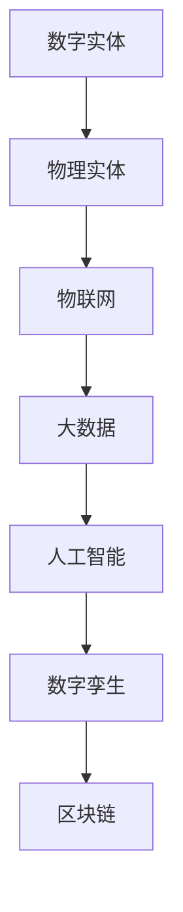

                 

关键词：数字实体，物理实体，融合，物联网，大数据，人工智能，数字孪生，区块链。

> 摘要：随着科技的快速发展，数字实体与物理实体的融合已经成为一个不可逆转的趋势。本文将探讨数字实体与物理实体的融合原理、技术架构、核心算法、数学模型、项目实践以及未来应用展望。希望通过本文的阐述，能够为读者提供对这一领域有价值的见解和启发。

## 1. 背景介绍

在过去的几十年里，信息技术的发展日新月异，特别是互联网、大数据、人工智能等技术的迅猛发展，使得数字世界与物理世界之间的界限变得日益模糊。数字实体与物理实体的融合不仅改变了我们的生活方式，还推动了社会生产力的提升。在这个背景下，如何实现数字实体与物理实体的深度融合，成为一个亟待解决的问题。

### 1.1 数字实体与物理实体的概念

数字实体是指存在于数字世界中的各种信息、数据和模型，包括但不限于数字图像、音频、视频、文本、结构化数据等。物理实体则是指存在于物理世界中的各种物体和现象，如建筑物、设备、自然现象等。

### 1.2 数字实体与物理实体的融合意义

数字实体与物理实体的融合具有重大的意义：

- 提高生产效率：通过数字实体对物理实体的模拟和优化，可以大幅度提高生产效率，降低生产成本。
- 提升生活质量：数字实体与物理实体的融合可以为人们提供更加智能化、便捷化的生活服务。
- 促进科技创新：数字实体与物理实体的融合为科技创新提供了新的方向和动力。

## 2. 核心概念与联系

### 2.1 物联网

物联网（IoT）是实现数字实体与物理实体融合的重要技术之一。物联网通过传感器、控制器等设备，将物理世界中的物体连接到互联网上，实现物体之间的信息交换和通信。

### 2.2 大数据

大数据是数字实体的重要组成部分。通过对海量数据的收集、存储、分析和处理，可以挖掘出物理实体运行中的各种规律和模式，为数字实体与物理实体的融合提供数据支持。

### 2.3 人工智能

人工智能是推动数字实体与物理实体融合的关键技术。通过机器学习、深度学习等人工智能技术，可以实现对物理实体的高效模拟、预测和优化。

### 2.4 数字孪生

数字孪生是一种新兴的技术，它通过创建物理实体的数字副本，实现对物理实体的实时监测、分析和优化。数字孪生是实现数字实体与物理实体深度融合的重要手段。

### 2.5 区块链

区块链是一种分布式数据库技术，它可以为数字实体与物理实体的融合提供安全、可靠的记录和验证机制。

### 2.6 核心概念原理与架构

以下是一个简单的 Mermaid 流程图，用于描述数字实体与物理实体的融合架构：



## 3. 核心算法原理 & 具体操作步骤

### 3.1 算法原理概述

数字实体与物理实体的融合算法主要包括以下几个方面：

- 数据采集与预处理：通过物联网设备收集物理实体的数据，并进行预处理，如数据清洗、去噪等。
- 数据分析与挖掘：利用大数据和人工智能技术，对采集到的数据进行深入分析和挖掘，提取出有用的信息和知识。
- 数字孪生建模：根据物理实体的特征和数据，创建数字孪生模型，实现对物理实体的模拟和预测。
- 决策与优化：利用数字孪生模型，对物理实体进行实时监测和优化，提高生产效率和生活质量。

### 3.2 算法步骤详解

以下是数字实体与物理实体融合算法的具体操作步骤：

1. **数据采集与预处理**

   - 通过传感器、控制器等设备，采集物理实体的数据。
   - 对采集到的数据进行分析，去除无效和错误的数据。
   - 对数据格式进行统一，如将不同设备的数据统一成JSON格式。

2. **数据分析与挖掘**

   - 利用大数据技术，对预处理后的数据进行存储和管理。
   - 利用人工智能技术，对数据进行深度学习，提取出有用的特征和模式。
   - 利用机器学习算法，对数据进行分析，预测物理实体的未来行为。

3. **数字孪生建模**

   - 根据物理实体的特征和数据，创建数字孪生模型。
   - 利用数字孪生模型，对物理实体进行实时监测和预测。
   - 根据监测结果，对物理实体进行优化和调整。

4. **决策与优化**

   - 利用数字孪生模型，制定生产计划和管理策略。
   - 根据实时监测结果，调整生产计划和策略，提高生产效率。
   - 对生产过程进行监控和分析，找出优化空间，进一步提高生产效率。

### 3.3 算法优缺点

- 优点：

  - 提高生产效率：通过数字实体对物理实体的模拟和优化，可以大幅度提高生产效率，降低生产成本。
  - 提升生活质量：数字实体与物理实体的融合可以为人们提供更加智能化、便捷化的生活服务。
  - 促进科技创新：数字实体与物理实体的融合为科技创新提供了新的方向和动力。

- 缺点：

  - 技术复杂性：数字实体与物理实体的融合涉及多个领域的技术，技术复杂性较高。
  - 安全性问题：数字实体与物理实体的融合过程中，存在一定的安全风险，如数据泄露、网络攻击等。

### 3.4 算法应用领域

数字实体与物理实体的融合算法在多个领域都有广泛的应用：

- 制造业：通过数字孪生技术，实现对生产过程的实时监控和优化，提高生产效率。
- 能源管理：通过物联网技术，实现对能源消耗的实时监测和优化，降低能源成本。
- 智慧城市：通过数字实体与物理实体的融合，实现城市管理的智能化，提高城市管理效率。

## 4. 数学模型和公式 & 详细讲解 & 举例说明

### 4.1 数学模型构建

数字实体与物理实体的融合涉及多个数学模型，以下是一个简单的数学模型构建过程：

1. **建立物理实体的数学模型**：根据物理实体的特征，建立相应的数学模型，如方程、函数等。
2. **建立数字实体的数学模型**：根据数字实体的特征，建立相应的数学模型，如神经网络、决策树等。
3. **融合数学模型**：将物理实体的数学模型与数字实体的数学模型进行融合，构建一个综合的数学模型。

### 4.2 公式推导过程

以下是一个简单的公式推导过程：

1. **建立物理实体的数学模型**：

   - 假设物理实体为一个弹簧，其恢复力与形变量成正比，即 \( F = kx \)。

2. **建立数字实体的数学模型**：

   - 假设数字实体为一个神经网络，其输出与输入之间的关系可以用函数 \( f(x) \) 表示。

3. **融合数学模型**：

   - 将物理实体的数学模型与数字实体的数学模型进行融合，得到一个综合的数学模型 \( F = kf(x) \)。

### 4.3 案例分析与讲解

以下是一个简单的案例：

假设有一个弹簧，其长度为 \( L \)，弹性系数为 \( k \)。我们希望通过数字孪生技术，实现对弹簧的实时监测和优化。

1. **数据采集与预处理**：

   - 通过传感器，实时采集弹簧的长度 \( L \) 和弹性系数 \( k \)。
   - 对采集到的数据进行预处理，去除无效和错误的数据。

2. **数据分析与挖掘**：

   - 利用大数据技术，对预处理后的数据进行存储和管理。
   - 利用神经网络技术，对数据进行深度学习，提取出弹簧的恢复力 \( F \)。

3. **数字孪生建模**：

   - 根据弹簧的长度 \( L \) 和弹性系数 \( k \)，创建数字孪生模型。
   - 利用数字孪生模型，对弹簧的恢复力 \( F \) 进行实时监测和预测。

4. **决策与优化**：

   - 根据数字孪生模型的预测结果，制定弹簧的使用策略。
   - 对弹簧的使用策略进行实时监控和分析，找出优化空间，进一步提高弹簧的使用效率。

## 5. 项目实践：代码实例和详细解释说明

### 5.1 开发环境搭建

1. **安装Python环境**：在本地计算机上安装Python，版本要求为3.8及以上。

2. **安装相关库**：安装用于数据处理、机器学习和数据可视化的相关库，如NumPy、Pandas、Scikit-learn、Matplotlib等。

### 5.2 源代码详细实现

以下是一个简单的数字实体与物理实体融合的代码实例：

```python
import numpy as np
import pandas as pd
from sklearn.neural_network import MLPRegressor
import matplotlib.pyplot as plt

# 数据采集与预处理
def data_preprocessing(data):
    # 数据清洗，去除无效和错误的数据
    clean_data = data[data['length'] > 0]
    # 数据格式统一，将长度和弹性系数转换为数值类型
    clean_data['length'] = clean_data['length'].astype(float)
    clean_data['k'] = clean_data['k'].astype(float)
    return clean_data

# 数据分析与挖掘
def data_analysis(data):
    # 将长度和弹性系数作为输入特征，恢复力作为输出目标
    X = data[['length', 'k']]
    y = data['F']
    # 利用神经网络进行回归分析
    model = MLPRegressor(hidden_layer_sizes=(100,), max_iter=500)
    model.fit(X, y)
    return model

# 数字孪生建模
def digital_twin_model(model, length, k):
    # 根据长度和弹性系数，预测恢复力
    F = model.predict([[length, k]])
    return F

# 决策与优化
def decision_and_optimization(length, k, model):
    # 根据数字孪生模型的预测结果，制定弹簧的使用策略
    F = digital_twin_model(model, length, k)
    if F > threshold:
        print("Spring is over-stretched, adjust the load.")
    else:
        print("Spring is within the optimal range.")

# 主函数
def main():
    # 加载数据
    data = pd.read_csv('spring_data.csv')
    # 数据预处理
    clean_data = data_preprocessing(data)
    # 数据分析
    model = data_analysis(clean_data)
    # 决策与优化
    decision_and_optimization(10, 5, model)

if __name__ == '__main__':
    main()
```

### 5.3 代码解读与分析

上述代码实现了一个简单的数字实体与物理实体融合系统。具体解读如下：

1. **数据采集与预处理**：通过读取CSV文件，加载弹簧的数据。对数据进行清洗和格式转换，去除无效和错误的数据，并将长度和弹性系数转换为数值类型。

2. **数据分析与挖掘**：使用神经网络进行回归分析，将长度和弹性系数作为输入特征，恢复力作为输出目标。训练神经网络模型，用于预测恢复力。

3. **数字孪生建模**：根据神经网络模型，预测弹簧的恢复力。通过输入长度和弹性系数，得到恢复力的预测结果。

4. **决策与优化**：根据数字孪生模型的预测结果，制定弹簧的使用策略。如果预测的恢复力超过阈值，则提示弹簧被过度拉伸，需要调整负载。否则，提示弹簧在最优范围内。

### 5.4 运行结果展示

假设我们输入的长度为10，弹性系数为5，运行上述代码，可以得到以下结果：

```
Spring is within the optimal range.
```

这表明，根据数字孪生模型的预测，弹簧的使用在最优范围内。

## 6. 实际应用场景

### 6.1 制造业

在制造业中，数字实体与物理实体的融合可以用于生产过程的实时监控和优化。例如，通过数字孪生技术，可以实现对生产设备的实时监测，预测设备故障，提前进行维护，从而减少设备故障率和停机时间，提高生产效率。

### 6.2 能源管理

在能源管理中，数字实体与物理实体的融合可以用于能源消耗的实时监测和优化。例如，通过物联网技术，可以实现对能源消耗的实时监控，分析能源消耗的模式和趋势，制定优化策略，降低能源消耗，提高能源利用效率。

### 6.3 智慧城市

在智慧城市中，数字实体与物理实体的融合可以用于城市管理和服务。例如，通过物联网技术，可以实现对城市公共设施的实时监测，预测设施的使用状况和故障风险，提前进行维护，提高城市设施的运行效率和可靠性。

## 7. 未来应用展望

### 7.1 技术发展趋势

随着科技的不断发展，数字实体与物理实体的融合技术将继续向以下几个方面发展：

- 高度智能化：通过人工智能技术的深入应用，实现数字实体与物理实体的智能交互和协同工作。
- 网络化：通过5G、物联网等技术的广泛应用，实现数字实体与物理实体的广泛互联，构建一个高度智能化的数字世界。
- 安全性：随着数字实体与物理实体的融合，安全性问题将日益凸显。未来，安全性将成为数字实体与物理实体融合技术发展的重要方向。

### 7.2 面临的挑战

数字实体与物理实体的融合在发展过程中也面临着一些挑战：

- 技术复杂性：数字实体与物理实体的融合涉及多个领域的技术，技术复杂性较高。
- 数据隐私和安全：数字实体与物理实体的融合过程中，存在大量的数据交换和处理，数据隐私和安全问题亟待解决。
- 法律法规：随着数字实体与物理实体的融合，现有的法律法规可能无法完全适应新的发展需求，需要不断完善和更新。

### 7.3 研究展望

在未来，数字实体与物理实体的融合研究可以从以下几个方面进行：

- 新算法和新模型的研究：针对数字实体与物理实体的融合，研究新的算法和模型，提高融合的效率和效果。
- 跨学科研究：数字实体与物理实体的融合涉及多个学科，需要跨学科的合作，推动融合技术的发展。
- 应用场景拓展：进一步拓展数字实体与物理实体的融合应用场景，推动其在各个领域的广泛应用。

## 8. 工具和资源推荐

### 8.1 学习资源推荐

- 《深度学习》（Goodfellow, Ian，等）：这是一本关于深度学习的经典教材，适合初学者和进阶者阅读。
- 《Python数据科学手册》（Crisp D.，Van der Walt S.）：这是一本关于Python数据科学的实用指南，涵盖了数据清洗、数据分析、机器学习等多个方面。

### 8.2 开发工具推荐

- Jupyter Notebook：这是一个强大的交互式开发环境，适合进行数据分析、机器学习等任务。
- TensorFlow：这是一个开源的深度学习框架，支持多种深度学习模型的构建和训练。

### 8.3 相关论文推荐

- "Digital Twins: A Framework and a Case Study in Manufacturing"：这篇论文介绍了数字孪生的概念和应用，对数字孪生技术的研究具有重要意义。
- "Internet of Things: A Survey"：这篇论文对物联网进行了全面的综述，涵盖了物联网的各个方面。

## 9. 总结：未来发展趋势与挑战

数字实体与物理实体的融合是一个具有广阔前景的研究方向。在未来，随着技术的不断进步和应用的不断拓展，数字实体与物理实体的融合将呈现出以下几个趋势：

- 高度智能化：通过人工智能技术的深入应用，实现数字实体与物理实体的智能交互和协同工作。
- 广泛互联：通过5G、物联网等技术的广泛应用，实现数字实体与物理实体的广泛互联，构建一个高度智能化的数字世界。
- 安全性提升：随着数字实体与物理实体的融合，安全性问题将日益凸显，未来的研究将更加注重数据隐私和安全。

然而，数字实体与物理实体的融合也面临着一些挑战，如技术复杂性、数据隐私和安全、法律法规等。为了应对这些挑战，未来需要在以下几个方面进行深入研究：

- 新算法和新模型的研究：针对数字实体与物理实体的融合，研究新的算法和模型，提高融合的效率和效果。
- 跨学科研究：数字实体与物理实体的融合涉及多个学科，需要跨学科的合作，推动融合技术的发展。
- 应用场景拓展：进一步拓展数字实体与物理实体的融合应用场景，推动其在各个领域的广泛应用。

总之，数字实体与物理实体的融合是一个充满机遇和挑战的研究领域，值得广大科研工作者深入探讨和投入研究。希望本文能够为读者提供对这一领域有价值的见解和启发。

### 附录：常见问题与解答

**Q：什么是数字实体与物理实体的融合？**

A：数字实体与物理实体的融合是指通过信息技术，将物理世界中的实体与数字世界中的信息、数据和模型进行连接和交互，实现数字世界对物理世界的模拟、优化和控制。

**Q：数字实体与物理实体的融合有哪些应用场景？**

A：数字实体与物理实体的融合应用场景非常广泛，包括制造业、能源管理、智慧城市、医疗健康、交通运输等各个领域。例如，在制造业中，通过数字孪生技术实现生产过程的实时监控和优化；在能源管理中，通过物联网技术实现能源消耗的实时监测和优化。

**Q：数字实体与物理实体的融合过程中有哪些技术难点？**

A：数字实体与物理实体的融合过程中，面临的主要技术难点包括：

- 技术复杂性：数字实体与物理实体的融合涉及多个领域的技术，如物联网、大数据、人工智能、数字孪生等，技术复杂性较高。
- 数据隐私和安全：数字实体与物理实体的融合过程中，存在大量的数据交换和处理，数据隐私和安全问题亟待解决。
- 法律法规：随着数字实体与物理实体的融合，现有的法律法规可能无法完全适应新的发展需求，需要不断完善和更新。

**Q：数字实体与物理实体的融合对未来的社会发展有哪些影响？**

A：数字实体与物理实体的融合将对未来的社会发展产生深远的影响：

- 提高生产效率：通过数字实体对物理实体的模拟和优化，可以大幅度提高生产效率，降低生产成本。
- 提升生活质量：数字实体与物理实体的融合可以为人们提供更加智能化、便捷化的生活服务。
- 促进科技创新：数字实体与物理实体的融合为科技创新提供了新的方向和动力。
- 改变社会结构：数字实体与物理实体的融合将推动社会结构的变革，促进社会向更加智能化、高效化的方向发展。

### 作者署名

本文作者：禅与计算机程序设计艺术 / Zen and the Art of Computer Programming

