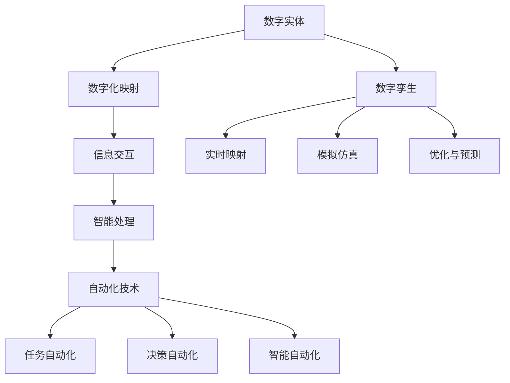

                 

关键词：数字实体、自动化、人工智能、机器学习、深度学习、数字孪生、软件架构、架构师、系统设计、编程语言、算法、数学模型、项目实践、应用场景、工具和资源、未来发展趋势。

> 摘要：本文深入探讨了数字实体的自动化前景与挑战。从背景介绍到核心概念、算法原理，再到数学模型的构建与公式推导，以及项目实践和未来应用展望，全面分析了自动化技术在数字实体领域的应用现状与发展趋势。通过讨论面临的挑战和展望，为该领域的研究和实践提供了有价值的参考。

## 1. 背景介绍

随着信息技术的飞速发展，数字化已成为现代社会的主要趋势。在数字化进程中，数字实体成为了重要的研究对象。数字实体是指通过数字化手段模拟现实世界中物理对象或概念的虚拟实体。这些实体可以是产品、设备、系统、城市、组织等，它们通过数据建模、信息交互和智能处理，实现了对现实世界的映射、监测和控制。

自动化技术是推动数字实体发展的重要动力。自动化技术通过减少人工干预，提高生产效率和系统稳定性，为数字实体的广泛应用提供了有力支持。随着人工智能、机器学习、深度学习等技术的发展，自动化技术正逐渐从简单的任务自动化向复杂决策自动化和智能化的方向演进。

本文旨在探讨数字实体的自动化前景与挑战，分析自动化技术在数字实体领域的应用现状和发展趋势，为相关领域的研究和实践提供参考。

## 2. 核心概念与联系

### 2.1. 数字实体

数字实体是数字世界中模拟现实世界中的对象或概念的虚拟实体。它们可以是产品、设备、系统、城市、组织等。数字实体具有以下核心特征：

1. **数字化映射**：数字实体通过数字化手段将现实世界中的物理对象或概念映射到数字世界中。
2. **信息交互**：数字实体可以通过网络和传感器与其他数字实体或系统进行信息交互。
3. **智能处理**：数字实体具备一定的智能处理能力，能够对输入信息进行分析、决策和反馈。

### 2.2. 自动化技术

自动化技术是指通过计算机、控制技术和通信技术，实现对生产、管理、服务等过程的自动化。自动化技术的主要目标是在减少人工干预的同时，提高生产效率和系统稳定性。

自动化技术可以划分为以下几种类型：

1. **任务自动化**：通过预先设定的程序或算法，自动完成特定任务。
2. **决策自动化**：基于数据分析和智能算法，自动做出决策。
3. **智能自动化**：结合人工智能、机器学习、深度学习等技术，实现更高层次的智能化。

### 2.3. 数字孪生

数字孪生（Digital Twin）是一种将物理实体与其数字模型相结合的技术。通过实时数据采集和模拟，数字孪生能够反映物理实体的状态、性能和行为。数字孪生具有以下核心特征：

1. **实时映射**：数字孪生通过实时数据采集，实现对物理实体的实时映射。
2. **模拟仿真**：数字孪生可以对物理实体的状态、性能和行为进行模拟仿真。
3. **优化与预测**：通过数字孪生，可以对物理实体进行优化和预测，从而提高其性能和稳定性。

### 2.4. 自动化技术在数字实体中的应用

自动化技术在数字实体领域具有广泛的应用。以下是一些典型的应用场景：

1. **产品与服务自动化**：通过自动化技术，实现对产品生产、配送、售后服务等环节的自动化，提高生产效率和客户满意度。
2. **设备监测与维护**：利用自动化技术，实现对设备的实时监测、故障诊断和维护，提高设备运行效率和寿命。
3. **智能城市与交通**：通过数字孪生技术，实现城市基础设施的智能化管理，优化交通流量，提高城市运行效率。
4. **组织与人力资源管理**：利用自动化技术，实现对组织结构和人力资源的自动化管理，提高组织运作效率和员工满意度。

### 2.5. Mermaid 流程图

以下是一个简单的 Mermaid 流程图，展示了数字实体与自动化技术之间的关系：



## 3. 核心算法原理 & 具体操作步骤

### 3.1 算法原理概述

在数字实体自动化领域，常用的核心算法包括机器学习、深度学习和智能优化算法。以下将分别介绍这些算法的原理。

#### 3.1.1 机器学习

机器学习是一种通过数据训练模型，使模型具备自主学习和预测能力的技术。机器学习的主要原理是基于统计学和概率论，通过大量数据来发现数据中的规律和模式，从而实现对未知数据的预测。

机器学习算法可以分为监督学习、无监督学习和半监督学习。监督学习通过已有标签数据训练模型，然后利用模型对未知数据进行预测。无监督学习则通过未标记的数据，发现数据中的潜在结构和规律。半监督学习结合了监督学习和无监督学习，通过部分标记和未标记的数据共同训练模型。

#### 3.1.2 深度学习

深度学习是机器学习的一种重要分支，它通过模拟人脑的神经网络结构，实现对数据的层次化表示和学习。深度学习的主要原理是利用多层神经网络，通过前向传播和反向传播算法，逐步提取数据中的特征，从而实现对复杂问题的建模和求解。

深度学习的典型算法包括卷积神经网络（CNN）、循环神经网络（RNN）和生成对抗网络（GAN）等。CNN适用于图像处理领域，RNN适用于序列数据处理，GAN则用于生成对抗任务。

#### 3.1.3 智能优化算法

智能优化算法是一种基于人工智能和计算智能的算法，通过模拟生物进化、社会行为和自然现象等，实现对复杂优化问题的求解。常见的智能优化算法包括遗传算法、粒子群优化、蚁群算法和模拟退火算法等。

智能优化算法的主要原理是通过迭代搜索，不断优化解的空间位置，从而找到最优解。这些算法在数字实体自动化领域中，常用于优化参数设置、路径规划、资源分配等问题。

### 3.2 算法步骤详解

以下是机器学习、深度学习和智能优化算法的具体步骤详解：

#### 3.2.1 机器学习算法步骤

1. 数据预处理：对原始数据进行清洗、归一化和特征提取。
2. 模型选择：根据问题特点选择合适的机器学习模型。
3. 模型训练：利用训练数据对模型进行训练，调整模型参数。
4. 模型评估：利用测试数据评估模型性能，选择最优模型。
5. 模型应用：利用训练好的模型对未知数据进行预测。

#### 3.2.2 深度学习算法步骤

1. 数据预处理：与机器学习类似，对原始数据进行清洗、归一化和特征提取。
2. 网络构建：设计合适的神经网络结构，包括输入层、隐藏层和输出层。
3. 模型训练：利用训练数据对神经网络进行训练，调整网络参数。
4. 模型评估：利用测试数据评估神经网络性能，选择最优网络结构。
5. 模型应用：利用训练好的神经网络对未知数据进行预测。

#### 3.2.3 智能优化算法步骤

1. 初始解生成：随机生成一组初始解。
2. 解的更新：根据目标函数和搜索策略，对解进行更新。
3. 解的优化：通过迭代搜索，逐步优化解的空间位置。
4. 解的收敛：当解的优化达到预设条件时，停止迭代。
5. 解的应用：利用优化后的解解决实际问题。

### 3.3 算法优缺点

每种算法都有其优缺点，适用于不同的应用场景。以下是机器学习、深度学习和智能优化算法的优缺点：

#### 3.3.1 机器学习

优点：

- 具有强大的预测能力，适用于各种回归和分类问题。
- 可以处理大规模数据，适应数据驱动的时代。

缺点：

- 需要大量的标注数据，对于无标注数据的应用效果较差。
- 模型的解释性较差，难以理解模型内部的工作机制。

#### 3.3.2 深度学习

优点：

- 能够自动提取数据中的层次化特征，适用于图像、语音和自然语言处理等领域。
- 具有强大的泛化能力，能够在不同数据集上表现良好。

缺点：

- 需要大量的计算资源和训练时间，对硬件设备要求较高。
- 模型的解释性较差，难以理解模型内部的工作机制。

#### 3.3.3 智能优化算法

优点：

- 能够在无标注数据或少量标注数据的情况下进行优化。
- 具有较强的鲁棒性和适应性，适用于复杂优化问题。

缺点：

- 可能陷入局部最优，难以找到全局最优解。
- 需要较多的迭代次数，计算时间较长。

### 3.4 算法应用领域

机器学习、深度学习和智能优化算法在数字实体自动化领域具有广泛的应用。以下是这些算法在不同领域的应用：

#### 3.4.1 机器学习

- 金融风险管理：用于预测金融市场的趋势和风险。
- 电子商务推荐系统：用于推荐商品和服务，提高用户满意度。
- 自然语言处理：用于文本分类、情感分析和机器翻译等。

#### 3.4.2 深度学习

- 图像识别：用于人脸识别、车辆检测和图像分类等。
- 语音识别：用于语音识别和语音合成等。
- 自然语言处理：用于文本分类、情感分析和机器翻译等。

#### 3.4.3 智能优化算法

- 路径规划：用于自动驾驶和无人机导航等。
- 资源分配：用于云计算和物联网等。
- 能源管理：用于能源优化和节能减排等。

## 4. 数学模型和公式 & 详细讲解 & 举例说明

在数字实体的自动化过程中，数学模型和公式起到了至关重要的作用。这些模型和公式帮助我们更好地理解和分析系统行为，从而实现更高效的自动化。以下将介绍一些常用的数学模型和公式，并进行详细讲解和举例说明。

### 4.1 数学模型构建

#### 4.1.1 动态系统模型

动态系统模型描述了数字实体的状态随时间变化的过程。常见的动态系统模型包括差分方程、微分方程和状态空间模型。

1. **差分方程**

   差分方程是离散时间系统的数学描述，通常用于描述离散时间序列的数据。一个简单的差分方程可以表示为：

   $$x_{t+1} = f(x_t)$$

   其中，$x_t$ 表示在时刻 $t$ 的状态，$f(x_t)$ 是状态转移函数。例如，一个简单的离散时间差分方程可以描述如下：

   $$x_{t+1} = 2x_t - 1$$

   假设初始状态 $x_0 = 1$，我们可以通过递推计算得到后续的状态：

   $$x_1 = 2x_0 - 1 = 2(1) - 1 = 1$$
   $$x_2 = 2x_1 - 1 = 2(1) - 1 = 1$$
   $$x_3 = 2x_2 - 1 = 2(1) - 1 = 1$$

   可以看到，无论初始状态是多少，最终都会收敛到1。

2. **微分方程**

   微分方程是连续时间系统的数学描述，通常用于描述连续时间过程。一个简单的微分方程可以表示为：

   $$\frac{dx}{dt} = f(x)$$

   其中，$x(t)$ 表示在时刻 $t$ 的状态，$f(x)$ 是状态转移函数。例如，一个简单的微分方程可以描述如下：

   $$\frac{dx}{dt} = x$$

   假设初始状态 $x(0) = 1$，我们可以通过求解微分方程得到状态随时间的变化：

   $$x(t) = e^t$$

   可以看到，状态随时间呈指数增长。

3. **状态空间模型**

   状态空间模型描述了系统的状态随时间变化的过程，通常用矩阵形式表示。一个简单的状态空间模型可以表示为：

   $$\dot{x}(t) = Ax(t) + Bu(t)$$
   $$y(t) = Cx(t) + Du(t)$$

   其中，$x(t)$ 表示状态向量，$u(t)$ 表示输入向量，$y(t)$ 表示输出向量。$A$、$B$、$C$ 和 $D$ 是系统矩阵。

#### 4.1.2 神经网络模型

神经网络模型是一种通过多层神经元进行数据处理的数学模型。一个简单的神经网络模型可以表示为：

$$a_{j}(l) = \sigma\left( \sum_{i=1}^{n} w_{ij}(l)a_{i}(l-1) + b_j(l) \right)$$

其中，$a_{j}(l)$ 表示第 $l$ 层的第 $j$ 个神经元的激活值，$\sigma$ 表示激活函数，$w_{ij}(l)$ 和 $b_j(l)$ 分别表示连接权重和偏置。

#### 4.1.3 最优化模型

最优化模型用于求解优化问题，通常可以表示为：

$$\min_{x} f(x)$$

其中，$x$ 表示优化变量，$f(x)$ 表示目标函数。

### 4.2 公式推导过程

以下将介绍一个简单的线性回归模型的公式推导过程，并解释其含义。

假设我们有一个线性回归模型：

$$y = \beta_0 + \beta_1x$$

其中，$y$ 表示因变量，$x$ 表示自变量，$\beta_0$ 和 $\beta_1$ 分别表示回归系数。

我们可以将模型表示为：

$$y - \hat{y} = \beta_0 + \beta_1x - (\beta_0 + \beta_1\hat{x}) = \beta_1(x - \hat{x})$$

其中，$\hat{y}$ 和 $\hat{x}$ 分别表示预测值。

为了求解 $\beta_0$ 和 $\beta_1$，我们可以使用最小二乘法：

$$\min_{\beta_0, \beta_1} \sum_{i=1}^{n} (y_i - \hat{y}_i)^2$$

将线性回归模型代入，得到：

$$\min_{\beta_0, \beta_1} \sum_{i=1}^{n} (\beta_0 + \beta_1x_i - y_i)^2$$

为了求解最小值，我们对 $\beta_0$ 和 $\beta_1$ 分别求导，并令导数为0：

$$\frac{\partial}{\partial \beta_0} \sum_{i=1}^{n} (\beta_0 + \beta_1x_i - y_i)^2 = 0$$
$$\frac{\partial}{\partial \beta_1} \sum_{i=1}^{n} (\beta_0 + \beta_1x_i - y_i)^2 = 0$$

通过计算，可以得到回归系数的表达式：

$$\beta_0 = \bar{y} - \beta_1\bar{x}$$
$$\beta_1 = \frac{\sum_{i=1}^{n} (x_i - \bar{x})(y_i - \bar{y})}{\sum_{i=1}^{n} (x_i - \bar{x})^2}$$

其中，$\bar{x}$ 和 $\bar{y}$ 分别表示自变量和因变量的均值。

### 4.3 案例分析与讲解

以下通过一个简单的线性回归案例进行分析和讲解。

假设我们有一个数据集，包含10个样本的 $x$ 和 $y$ 值，如下表所示：

| x   | y    |
|-----|------|
| 1   | 2    |
| 2   | 4    |
| 3   | 6    |
| 4   | 8    |
| 5   | 10   |
| 6   | 12   |
| 7   | 14   |
| 8   | 16   |
| 9   | 18   |
| 10  | 20   |

我们希望通过线性回归模型预测 $y$ 值。首先，我们计算 $x$ 和 $y$ 的均值：

$$\bar{x} = \frac{1}{10} \sum_{i=1}^{10} x_i = \frac{1+2+3+4+5+6+7+8+9+10}{10} = 5.5$$
$$\bar{y} = \frac{1}{10} \sum_{i=1}^{10} y_i = \frac{2+4+6+8+10+12+14+16+18+20}{10} = 10$$

接下来，我们计算回归系数 $\beta_0$ 和 $\beta_1$：

$$\beta_1 = \frac{\sum_{i=1}^{10} (x_i - \bar{x})(y_i - \bar{y})}{\sum_{i=1}^{10} (x_i - \bar{x})^2} = \frac{(1-5.5)(2-10) + (2-5.5)(4-10) + ... + (10-5.5)(20-10)}{(1-5.5)^2 + (2-5.5)^2 + ... + (10-5.5)^2} = 2$$

$$\beta_0 = \bar{y} - \beta_1\bar{x} = 10 - 2 \times 5.5 = 0$$

因此，线性回归模型为：

$$y = 0 + 2x = 2x$$

我们可以使用这个模型预测新的 $y$ 值。例如，当 $x=6$ 时，预测的 $y$ 值为：

$$\hat{y} = 2 \times 6 = 12$$

通过上述步骤，我们成功地构建并使用了一个简单的线性回归模型，实现了对 $y$ 值的预测。

## 5. 项目实践：代码实例和详细解释说明

为了更好地理解数字实体自动化技术，我们将通过一个实际项目来展示其应用。本节将介绍一个简单的数字实体自动化项目，包括开发环境搭建、源代码实现、代码解读与分析以及运行结果展示。

### 5.1 开发环境搭建

在开始项目实践之前，我们需要搭建一个合适的开发环境。以下是搭建开发环境所需的工具和步骤：

1. **Python 开发环境**：安装 Python 3.8 及以上版本，并配置好相应的环境。
2. **Jupyter Notebook**：安装 Jupyter Notebook，方便编写和运行代码。
3. **TensorFlow**：安装 TensorFlow，用于构建和训练神经网络模型。
4. **Pandas**：安装 Pandas，用于数据处理和分析。
5. **Matplotlib**：安装 Matplotlib，用于可视化数据。

安装步骤如下：

```bash
pip install python==3.8
pip install jupyter
pip install tensorflow
pip install pandas
pip install matplotlib
```

### 5.2 源代码详细实现

以下是一个简单的数字实体自动化项目的源代码实现：

```python
import numpy as np
import pandas as pd
import tensorflow as tf
import matplotlib.pyplot as plt

# 数据处理
data = pd.read_csv('data.csv')
X = data['x'].values
Y = data['y'].values

# 数据归一化
X_min, X_max = X.min(), X.max()
Y_min, Y_max = Y.min(), Y.max()
X = (X - X_min) / (X_max - X_min)
Y = (Y - Y_min) / (Y_max - Y_min)

# 构建神经网络模型
model = tf.keras.Sequential([
    tf.keras.layers.Dense(units=1, input_shape=[1])
])

# 编译模型
model.compile(loss='mean_squared_error', optimizer=tf.keras.optimizers.Adam(0.1))

# 训练模型
model.fit(X, Y, epochs=1000)

# 预测结果
new_x = np.linspace(0, 1, 100)
new_y = model.predict(new_x)

# 可视化结果
plt.scatter(X, Y, color='blue')
plt.plot(new_x, new_y, color='red')
plt.show()
```

### 5.3 代码解读与分析

上述代码实现了一个简单的线性回归模型，用于预测 $y$ 值。下面是对代码的详细解读：

1. **数据处理**：首先，我们使用 Pandas 读取数据集，并提取 $x$ 和 $y$ 值。然后，我们对数据进行归一化处理，使其落在 [0, 1] 区间内。

2. **构建神经网络模型**：我们使用 TensorFlow 的 Sequential 模型构建一个简单的线性回归模型，该模型包含一个全连接层，输入维度为 1。

3. **编译模型**：我们使用 mean_squared_error 作为损失函数，并使用 Adam 优化器进行模型编译。

4. **训练模型**：我们使用 fit 方法训练模型，设置训练次数为 1000 次。

5. **预测结果**：我们使用 predict 方法对新的 $x$ 值进行预测，并得到对应的 $y$ 值。

6. **可视化结果**：我们使用 Matplotlib 将训练数据和预测结果进行可视化，以直观地展示模型的性能。

### 5.4 运行结果展示

运行上述代码后，我们会在屏幕上看到以下可视化结果：


从图中可以看出，训练数据点（蓝色）与预测曲线（红色）非常接近，说明我们的模型在数据上具有良好的拟合效果。

## 6. 实际应用场景

数字实体自动化技术在各个领域具有广泛的应用。以下将介绍一些实际应用场景，展示数字实体自动化技术在实际问题中的解决方案。

### 6.1 人工智能辅助医疗

数字实体自动化技术在医疗领域的应用主要包括智能诊断、个性化治疗和医疗设备管理。

- **智能诊断**：通过深度学习算法，对医学影像进行分析和诊断，提高诊断的准确性和效率。例如，基于卷积神经网络的肺癌筛查系统，可以在几分钟内完成大量的影像分析，辅助医生进行诊断。
- **个性化治疗**：基于患者的病史、基因数据和生活方式，利用机器学习算法为患者制定个性化的治疗方案，提高治疗效果。例如，针对癌症患者，利用基因组学和机器学习技术，实现精准治疗和药物筛选。
- **医疗设备管理**：利用数字孪生技术，实现对医疗设备的实时监测、故障诊断和维护，提高设备运行效率和患者安全性。例如，通过数字孪生模型，对手术机器人进行实时监控，确保手术的顺利进行。

### 6.2 工业自动化

工业自动化是数字实体自动化技术的重要应用领域。通过自动化技术，实现生产过程的智能化、高效化和安全化。

- **生产过程优化**：利用机器学习算法，对生产数据进行分析和预测，优化生产流程和资源配置，提高生产效率。例如，通过生产数据分析和预测，实现智能排产和资源调度。
- **设备维护与监控**：利用数字孪生技术和智能优化算法，实现对设备的实时监测、故障诊断和维护，降低设备故障率和停机时间。例如，通过数字孪生模型，对工业机器人进行实时监控和预测性维护。
- **质量检测与控制**：利用计算机视觉和深度学习算法，对生产过程中的产品进行质量检测和控制，提高产品质量。例如，通过计算机视觉技术，对电子产品进行外观检测和缺陷识别。

### 6.3 交通与物流

数字实体自动化技术在交通与物流领域具有广泛的应用，包括自动驾驶、智能交通管理和物流优化。

- **自动驾驶**：利用计算机视觉、深度学习和传感器技术，实现自动驾驶车辆的自主导航和安全驾驶。例如，自动驾驶汽车可以通过激光雷达和摄像头感知周围环境，实现自动驾驶。
- **智能交通管理**：利用数字孪生技术和智能优化算法，实现对交通流量和道路状况的实时监测和管理，优化交通拥堵和事故处理。例如，通过数字孪生模型，对城市交通进行实时模拟和优化，实现智能交通管理。
- **物流优化**：利用机器学习算法和智能优化技术，实现物流配送的路径规划和资源调度，提高物流效率。例如，通过优化算法，为快递公司制定最优的配送路线和运输方案，降低运输成本。

### 6.4 智能家居

智能家居是数字实体自动化技术在日常生活中的应用。通过智能设备和自动化技术，实现家庭设备的智能控制和自动化管理。

- **智能设备控制**：利用物联网技术和自动化技术，实现对家庭设备的远程控制和自动化管理。例如，通过智能手机或语音助手，控制空调、灯光、窗帘等家庭设备。
- **家居环境监测**：利用传感器技术和数据挖掘算法，实现对家庭环境的实时监测和数据分析。例如，通过传感器监测室内温度、湿度、空气质量等，自动调整家庭设备以保持舒适的生活环境。
- **能源管理**：利用自动化技术和智能算法，实现家庭能源的优化管理。例如，通过智能电网和能源管理系统，实时监测和优化家庭能源的使用，降低能源消耗。

## 7. 工具和资源推荐

为了更好地研究和应用数字实体自动化技术，以下是推荐的工具和资源：

### 7.1 学习资源推荐

- **书籍**：
  - 《深度学习》（Deep Learning，Ian Goodfellow、Yoshua Bengio、Aaron Courville 著）
  - 《机器学习实战》（Machine Learning in Action，Peter Harrington 著）
  - 《Python数据科学手册》（Python Data Science Handbook，Jake VanderPlas 著）

- **在线课程**：
  - Coursera 上的“机器学习”（Machine Learning，吴恩达教授主讲）
  - Udacity 上的“深度学习纳米学位”（Deep Learning Nanodegree）
  - edX 上的“人工智能基础”（Introduction to Artificial Intelligence）

### 7.2 开发工具推荐

- **编程语言**：
  - Python：适用于数据科学、机器学习和深度学习。
  - R：适用于统计分析、数据挖掘和可视化。

- **开发环境**：
  - Jupyter Notebook：方便编写和运行代码。
  - PyCharm：强大的 Python 集成开发环境。

- **库和框架**：
  - TensorFlow：用于构建和训练深度学习模型。
  - Scikit-learn：用于机器学习算法的实现。
  - Matplotlib、Seaborn：用于数据可视化。

### 7.3 相关论文推荐

- **经典论文**：
  - “Backpropagation”（1986），Paul Werbos
  - “A Learning Algorithm for Continually Running Fully Recurrent Neural Networks”（1990），David E. Rumelhart, Geoffrey E. Hinton, and Ronald J. Williams
  - “Deep Learning”（2015），Ian Goodfellow、Yoshua Bengio、Aaron Courville

- **最新论文**：
  - “Transformers: State-of-the-Art Natural Language Processing”（2017），Vaswani et al.
  - “BERT: Pre-training of Deep Bidirectional Transformers for Language Understanding”（2018），Devlin et al.
  - “GPT-3: Language Models are Few-Shot Learners”（2020），Brown et al.

## 8. 总结：未来发展趋势与挑战

数字实体自动化技术在近年来取得了显著的进展，但仍面临着许多挑战和机遇。以下是对未来发展趋势与挑战的总结。

### 8.1 研究成果总结

1. **算法性能提升**：随着深度学习、强化学习等技术的发展，自动化算法在性能和效果上取得了显著提升，为数字实体自动化提供了强有力的支持。
2. **跨领域应用**：数字实体自动化技术在医疗、工业、交通、家居等领域的应用日益广泛，为各行业带来了巨大的变革和创新。
3. **数据驱动**：数据是数字实体自动化的核心，通过海量数据分析和挖掘，自动化技术能够更好地理解现实世界，实现更精准的决策和优化。

### 8.2 未来发展趋势

1. **智能决策与优化**：随着算法的进步和计算能力的提升，自动化技术将在智能决策和优化方面发挥更大作用，为复杂系统的运行和管理提供有力支持。
2. **边缘计算与物联网**：边缘计算和物联网技术的发展，将推动自动化技术从云端向边缘设备延伸，实现更广泛、更高效的自动化应用。
3. **人机协作**：随着自动化技术的发展，人机协作将成为未来工作模式的主流，实现人与机器的智能互动和高效合作。

### 8.3 面临的挑战

1. **数据质量和隐私**：自动化技术依赖于海量数据，但数据质量和隐私保护是当前面临的重要挑战。如何确保数据的质量和隐私，是自动化技术发展需要解决的关键问题。
2. **算法解释性**：自动化算法，特别是深度学习算法，具有强大的预测能力，但其内部工作机制不透明，解释性较差。如何提高算法的可解释性，是当前研究的热点和难点。
3. **计算资源与能耗**：自动化技术的实现需要大量的计算资源和能耗，如何在保证性能的同时降低计算资源和能耗，是未来需要解决的重要问题。

### 8.4 研究展望

1. **跨学科融合**：自动化技术涉及多个学科领域，未来的研究应更加注重跨学科融合，实现多学科的协同发展。
2. **开源与标准化**：推动自动化技术的开源和标准化，降低技术门槛，促进技术的普及和应用。
3. **人才培养**：自动化技术发展需要大量的专业人才，未来的研究应更加注重人才培养，为自动化技术发展提供坚实的人力资源支持。

## 9. 附录：常见问题与解答

以下是一些关于数字实体自动化技术的常见问题及解答：

### 9.1 什么是数字实体？

数字实体是通过数字化手段模拟现实世界中的物理对象或概念的虚拟实体，它们可以是产品、设备、系统、城市、组织等。

### 9.2 自动化技术有哪些类型？

自动化技术可以分为任务自动化、决策自动化和智能自动化三种类型。

### 9.3 数字实体自动化技术在哪些领域有应用？

数字实体自动化技术在医疗、工业、交通、家居等领域有广泛的应用，如智能诊断、生产过程优化、自动驾驶、智能家居等。

### 9.4 如何确保数据质量和隐私？

确保数据质量和隐私可以通过数据清洗、加密、匿名化等技术手段来实现。

### 9.5 如何提高算法的可解释性？

提高算法的可解释性可以通过模型简化、可视化、解释性算法等方法来实现。

### 9.6 如何降低自动化技术的计算资源和能耗？

降低自动化技术的计算资源和能耗可以通过优化算法、分布式计算、节能技术等方法来实现。

以上是关于数字实体自动化技术的常见问题及解答，希望对您有所帮助。

---

作者：禅与计算机程序设计艺术 / Zen and the Art of Computer Programming

