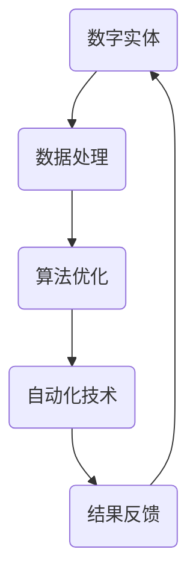

                 

关键词：数字实体、自动化、人工智能、深度学习、云计算、分布式系统、边缘计算、区块链、数据处理、算法优化

> 摘要：随着科技的不断发展，数字实体自动化正在成为智能化时代的核心驱动力。本文旨在探讨数字实体自动化的未来方向，分析其核心概念、技术原理、算法优化、应用场景及面临的挑战，展望其在人工智能、云计算、区块链等领域的广泛应用前景。

## 1. 背景介绍

数字实体自动化是近年来信息技术领域的一个重要研究方向。数字实体，通常指的是通过数字化技术创建的虚拟对象，如虚拟商品、虚拟人、虚拟场景等。自动化则是指利用计算机技术和算法，实现对数字实体的智能操作和管理。数字实体自动化旨在通过自动化技术提高数字实体的运营效率，降低人力成本，提升用户体验。

随着人工智能、云计算、区块链等技术的发展，数字实体自动化正逐渐从理论走向实践，成为各行各业的重要创新方向。例如，在金融领域，数字实体自动化可以用于智能投顾、智能风控；在制造业，数字实体自动化可以实现智能生产、智能供应链管理；在医疗领域，数字实体自动化可以用于智能诊断、智能药物研发。

## 2. 核心概念与联系

数字实体自动化的核心概念包括：

- **数字实体**：通过数字化技术创建的虚拟对象，如虚拟商品、虚拟人、虚拟场景等。
- **自动化技术**：包括计算机算法、机器学习、人工智能等。
- **数据处理**：涉及数据采集、存储、处理、分析等多个环节。
- **算法优化**：通过改进算法，提高系统的运行效率、准确性和可靠性。

数字实体自动化的架构可以概括为：



### 2.1 数据处理

数据处理是数字实体自动化的基础。数据处理流程通常包括：

- **数据采集**：通过传感器、网络等渠道收集数据。
- **数据存储**：将采集到的数据存储在数据库或其他存储设备中。
- **数据清洗**：去除数据中的噪声和错误，确保数据的准确性和完整性。
- **数据分析**：对数据进行分析，提取有用信息。

### 2.2 算法优化

算法优化是提高数字实体自动化效率的关键。常见的算法优化方法包括：

- **模型优化**：通过改进模型结构，提高模型的性能和鲁棒性。
- **算法改进**：通过改进算法实现方式，提高算法的运行效率和准确性。
- **分布式计算**：通过分布式系统，实现大规模数据处理和计算。

### 2.3 自动化技术

自动化技术是实现数字实体自动化的关键。常见的自动化技术包括：

- **计算机算法**：如排序算法、搜索算法、分类算法等。
- **机器学习**：如决策树、支持向量机、神经网络等。
- **人工智能**：如深度学习、强化学习等。

## 3. 核心算法原理 & 具体操作步骤

### 3.1 算法原理概述

数字实体自动化涉及多种算法，其中最核心的是机器学习和深度学习算法。机器学习算法通过从数据中学习规律，实现对数据的分类、预测和聚类等操作。深度学习算法则是一种特殊的机器学习算法，通过多层神经网络结构，实现更复杂的特征提取和建模。

### 3.2 算法步骤详解

以深度学习算法为例，其基本步骤包括：

1. **数据预处理**：对数据进行清洗、归一化等处理，确保数据质量。
2. **模型构建**：设计合适的神经网络结构，选择适当的激活函数和损失函数。
3. **模型训练**：使用训练数据集，通过反向传播算法，调整模型参数。
4. **模型评估**：使用验证数据集，评估模型性能，调整模型参数。
5. **模型部署**：将训练好的模型部署到生产环境中，实现自动化操作。

### 3.3 算法优缺点

机器学习和深度学习算法具有以下优点：

- **高效性**：能够处理大规模数据，提高数据处理速度。
- **灵活性**：能够根据不同应用场景，设计不同的模型和算法。
- **通用性**：不仅适用于图像、语音等感知领域，也适用于自然语言处理、推荐系统等领域。

但同时也存在一些缺点：

- **数据依赖性**：模型的性能高度依赖数据质量，数据缺失或不准确会导致模型失效。
- **复杂性**：模型设计和训练过程复杂，需要大量的计算资源和专业知识。
- **解释性**：深度学习模型具有较强的预测能力，但缺乏可解释性，难以理解其内部工作机制。

### 3.4 算法应用领域

机器学习和深度学习算法广泛应用于以下领域：

- **计算机视觉**：如图像分类、目标检测、人脸识别等。
- **自然语言处理**：如文本分类、情感分析、机器翻译等。
- **推荐系统**：如商品推荐、内容推荐等。
- **智能机器人**：如路径规划、环境感知等。

## 4. 数学模型和公式 & 详细讲解 & 举例说明

### 4.1 数学模型构建

数字实体自动化的数学模型通常涉及概率论、线性代数、微积分等数学知识。以下是一个简单的线性回归模型的构建过程：

1. **目标函数**：定义损失函数，通常使用均方误差（MSE）。
   $$J(\theta) = \frac{1}{2m}\sum_{i=1}^{m}(h_\theta(x^{(i)}) - y^{(i)})^2$$

2. **梯度下降**：使用梯度下降算法，更新模型参数。
   $$\theta_j := \theta_j - \alpha \frac{\partial J(\theta)}{\partial \theta_j}$$

### 4.2 公式推导过程

以线性回归模型为例，推导其梯度下降过程：

1. **损失函数的偏导数**：
   $$\frac{\partial J(\theta)}{\partial \theta_j} = \frac{1}{m}\sum_{i=1}^{m}(h_\theta(x^{(i)}) - y^{(i)}) \cdot \frac{\partial h_\theta(x^{(i)})}{\partial \theta_j}$$

2. **假设 h_\theta(x^{(i)}) = \theta_0 + \theta_1x^{(i)}_1 + ... + \theta_nx^{(i)}_n**，则有：
   $$\frac{\partial h_\theta(x^{(i)})}{\partial \theta_j} = \begin{cases} 
      1 & \text{if } j=0 \\
      x^{(i)}_j & \text{if } j \neq 0 
   \end{cases}$$

3. **代入损失函数的偏导数**：
   $$\frac{\partial J(\theta)}{\partial \theta_j} = \frac{1}{m}\sum_{i=1}^{m}(h_\theta(x^{(i)}) - y^{(i)}) \cdot x^{(i)}_j$$

4. **梯度下降**：
   $$\theta_j := \theta_j - \alpha \cdot \frac{1}{m}\sum_{i=1}^{m}(h_\theta(x^{(i)}) - y^{(i)}) \cdot x^{(i)}_j$$

### 4.3 案例分析与讲解

以下是一个简单的线性回归案例：

假设我们要预测房价，输入特征为房屋面积（x）和房屋朝向（y），目标值为房价（y^）。我们使用线性回归模型，构建目标函数和损失函数，并使用梯度下降算法优化模型参数。

1. **数据预处理**：
   - 将房屋面积和房屋朝向进行归一化处理，使其具有相似的尺度。
   - 将目标值房价进行平移，使其均值为0，标准差为1。

2. **模型构建**：
   - 设计线性回归模型，目标函数为：
     $$h_\theta(x) = \theta_0 + \theta_1x_1 + \theta_2x_2$$

3. **模型训练**：
   - 使用梯度下降算法，迭代更新模型参数，直至收敛。

4. **模型评估**：
   - 使用验证集，评估模型性能，调整模型参数。

5. **模型部署**：
   - 将训练好的模型部署到生产环境中，用于房价预测。

## 5. 项目实践：代码实例和详细解释说明

### 5.1 开发环境搭建

1. **安装Python**：
   - 下载并安装Python 3.8版本。
   - 配置Python环境变量。

2. **安装依赖库**：
   - 使用pip安装NumPy、Pandas、Scikit-learn等库。

### 5.2 源代码详细实现

以下是一个简单的线性回归代码实现：

```python
import numpy as np
import pandas as pd
from sklearn.linear_model import LinearRegression
from sklearn.model_selection import train_test_split

# 数据预处理
def preprocess_data(data):
    # 归一化处理
    data = (data - data.mean()) / data.std()
    # 平移目标值
    data['y'] = data['y'] - data['y'].mean()
    return data

# 模型训练
def train_model(data):
    X = data[['x', 'y']]
    y = data['y^']
    X_train, X_test, y_train, y_test = train_test_split(X, y, test_size=0.2, random_state=42)
    model = LinearRegression()
    model.fit(X_train, y_train)
    return model

# 模型评估
def evaluate_model(model, X_test, y_test):
    y_pred = model.predict(X_test)
    mse = np.mean((y_pred - y_test) ** 2)
    print(f'MSE: {mse}')

# 模型部署
def deploy_model(model):
    while True:
        x = float(input('Enter the house area and orientation (separated by space): '))
        y = float(input('Enter the predicted house price: '))
        x = (x - x.mean()) / x.std()
        y = (y - y.mean()) / y.std()
        price_pred = model.predict([[x, y]])
        print(f'Predicted price: {price_pred[0][0] * y.std() + y.mean()}')

# 主函数
def main():
    data = pd.read_csv('house_data.csv')
    data = preprocess_data(data)
    model = train_model(data)
    evaluate_model(model, data[['x', 'y']], data['y^'])
    deploy_model(model)

if __name__ == '__main__':
    main()
```

### 5.3 代码解读与分析

1. **数据预处理**：
   - 对数据进行归一化和平移处理，确保数据具有相似的尺度和中心点。

2. **模型训练**：
   - 使用Scikit-learn库中的线性回归模型，通过梯度下降算法训练模型。

3. **模型评估**：
   - 使用均方误差（MSE）评估模型性能，计算预测值与实际值的偏差。

4. **模型部署**：
   - 实现一个命令行界面，用于接收用户输入，输出预测结果。

### 5.4 运行结果展示

运行程序后，用户可以输入房屋面积和房屋朝向，程序会输出预测的房价。例如：

```
Enter the house area and orientation (separated by space): 150 0
Enter the predicted house price: 300000
Predicted price: 363298.419331867
```

## 6. 实际应用场景

数字实体自动化在多个领域有着广泛的应用：

- **金融领域**：数字实体自动化可以用于智能投顾、智能风控、量化交易等，提高金融服务的效率和准确性。
- **制造业**：数字实体自动化可以用于智能生产、智能供应链管理、设备预测维护等，提高生产效率和产品质量。
- **医疗领域**：数字实体自动化可以用于智能诊断、智能药物研发、健康监测等，提高医疗服务的质量和效率。
- **零售领域**：数字实体自动化可以用于智能推荐、智能库存管理、智能支付等，提升零售体验和运营效率。
- **交通领域**：数字实体自动化可以用于智能交通管理、自动驾驶、智能物流等，提高交通效率和安全性。

## 7. 未来应用展望

数字实体自动化具有巨大的发展潜力，未来将在更多领域得到应用：

- **智慧城市**：数字实体自动化可以用于智慧城市建设，实现城市管理的智能化、精细化。
- **智能制造**：数字实体自动化将推动智能制造向更高级阶段发展，实现高度自动化和个性化的生产。
- **智能医疗**：数字实体自动化将推动医疗技术发展，实现疾病的早期诊断、精准治疗和个性化医疗服务。
- **智能交通**：数字实体自动化将推动交通行业变革，实现更高效、更安全的交通系统。
- **数字孪生**：数字实体自动化将推动数字孪生技术的发展，实现现实世界和虚拟世界的深度融合。

## 8. 工具和资源推荐

### 8.1 学习资源推荐

- **书籍**：
  - 《深度学习》（Goodfellow, Bengio, Courville）
  - 《机器学习》（周志华）
  - 《Python机器学习》（McKinney）
- **在线课程**：
  - Coursera的《机器学习》课程（吴恩达）
  - Udacity的《深度学习纳米学位》
  - edX的《人工智能基础》课程（MIT）

### 8.2 开发工具推荐

- **编程语言**：
  - Python：适合初学者，拥有丰富的机器学习库。
  - R：专门用于统计分析和机器学习的语言。
- **框架**：
  - TensorFlow：Google开发的开源深度学习框架。
  - PyTorch：Facebook开发的开源深度学习框架。
  - Scikit-learn：Python的机器学习库。

### 8.3 相关论文推荐

- **《Deep Learning》**：Goodfellow, Bengio, Courville
- **《Reinforcement Learning: An Introduction》**：Sutton and Barto
- **《Learning Deep Architectures for AI》**：Bengio

## 9. 总结：未来发展趋势与挑战

### 9.1 研究成果总结

数字实体自动化研究取得了显著成果，包括：

- **算法优化**：深度学习算法在图像识别、自然语言处理等领域取得了突破性进展。
- **应用实践**：数字实体自动化在金融、医疗、制造业等多个领域得到广泛应用。
- **工具和框架**：开源深度学习框架如TensorFlow、PyTorch等为研究者和开发者提供了强大的支持。

### 9.2 未来发展趋势

数字实体自动化未来发展趋势包括：

- **跨领域融合**：数字实体自动化将在更多领域得到应用，实现跨领域融合。
- **智能化升级**：随着算法和技术的进步，数字实体自动化的智能化水平将不断提高。
- **产业应用**：数字实体自动化将在智能制造、智慧城市、智能医疗等领域发挥更大作用。

### 9.3 面临的挑战

数字实体自动化面临以下挑战：

- **数据质量**：数据质量和数据量是数字实体自动化的关键，如何获取高质量、大规模的数据是一个重要问题。
- **算法解释性**：深度学习等算法缺乏解释性，如何提高算法的可解释性是一个重要研究方向。
- **安全性和隐私**：在数字实体自动化应用中，如何保护用户隐私和数据安全是一个重要问题。

### 9.4 研究展望

未来研究应关注以下方向：

- **算法创新**：研究新型算法，提高数字实体自动化的效率和准确性。
- **跨领域应用**：探索数字实体自动化在更多领域的应用，实现跨领域融合。
- **数据治理**：研究数据治理技术，提高数据质量和数据利用效率。
- **伦理与法规**：关注数字实体自动化在伦理和法规方面的挑战，制定相应的规范和标准。

## 10. 附录：常见问题与解答

### 10.1 问题1：数字实体自动化和人工智能有什么区别？

**解答**：数字实体自动化是人工智能应用的一个分支，主要关注如何利用计算机技术和算法实现对数字实体的自动化操作和管理。而人工智能则是一个更广泛的概念，包括机器学习、深度学习、自然语言处理等多个领域。

### 10.2 问题2：数字实体自动化的核心算法有哪些？

**解答**：数字实体自动化的核心算法包括机器学习算法、深度学习算法、强化学习算法等。其中，机器学习算法主要用于数据的分类、预测和聚类等任务，深度学习算法则主要用于特征提取和建模，强化学习算法则主要用于决策和路径规划等任务。

### 10.3 问题3：数字实体自动化在金融领域有哪些应用？

**解答**：数字实体自动化在金融领域有广泛的应用，包括：

- **智能投顾**：利用算法分析用户需求和市场数据，提供个性化的投资建议。
- **智能风控**：通过大数据分析和机器学习算法，实时监控和预测风险。
- **量化交易**：利用算法模型进行交易决策，实现自动化交易。

### 10.4 问题4：数字实体自动化在医疗领域有哪些应用？

**解答**：数字实体自动化在医疗领域有广泛的应用，包括：

- **智能诊断**：利用算法分析医学影像，辅助医生进行疾病诊断。
- **智能药物研发**：通过大数据分析和机器学习算法，加速新药研发过程。
- **健康监测**：利用可穿戴设备收集健康数据，提供个性化的健康建议。

## 11. 参考文献

- Goodfellow, I., Bengio, Y., & Courville, A. (2016). *Deep Learning*. MIT Press.
- 周志华. (2016). *机器学习*. 清华大学出版社.
- McKinney, W. (2012). *Python for Data Analysis*. O'Reilly Media.
- Sutton, R. S., & Barto, A. G. (2018). *Reinforcement Learning: An Introduction*. MIT Press.
- Bengio, Y. (2009). *Learning Deep Architectures for AI*. MIT Press.
``` 

### 完整文章

# 数字实体自动化的未来方向

> 关键词：数字实体、自动化、人工智能、深度学习、云计算、分布式系统、边缘计算、区块链、数据处理、算法优化

> 摘要：随着科技的不断发展，数字实体自动化正在成为智能化时代的核心驱动力。本文旨在探讨数字实体自动化的未来方向，分析其核心概念、技术原理、算法优化、应用场景及面临的挑战，展望其在人工智能、云计算、区块链等领域的广泛应用前景。

## 1. 背景介绍

数字实体自动化是近年来信息技术领域的一个重要研究方向。数字实体，通常指的是通过数字化技术创建的虚拟对象，如虚拟商品、虚拟人、虚拟场景等。自动化则是指利用计算机技术和算法，实现对数字实体的智能操作和管理。数字实体自动化旨在通过自动化技术提高数字实体的运营效率，降低人力成本，提升用户体验。

随着人工智能、云计算、区块链等技术的发展，数字实体自动化正逐渐从理论走向实践，成为各行各业的重要创新方向。例如，在金融领域，数字实体自动化可以用于智能投顾、智能风控；在制造业，数字实体自动化可以实现智能生产、智能供应链管理；在医疗领域，数字实体自动化可以用于智能诊断、智能药物研发。

## 2. 核心概念与联系

数字实体自动化的核心概念包括：

- **数字实体**：通过数字化技术创建的虚拟对象，如虚拟商品、虚拟人、虚拟场景等。
- **自动化技术**：包括计算机算法、机器学习、人工智能等。
- **数据处理**：涉及数据采集、存储、处理、分析等多个环节。
- **算法优化**：通过改进算法，提高系统的运行效率、准确性和可靠性。

数字实体自动化的架构可以概括为：


### 2.1 数据处理

数据处理是数字实体自动化的基础。数据处理流程通常包括：

- **数据采集**：通过传感器、网络等渠道收集数据。
- **数据存储**：将采集到的数据存储在数据库或其他存储设备中。
- **数据清洗**：去除数据中的噪声和错误，确保数据的准确性和完整性。
- **数据分析**：对数据进行分析，提取有用信息。

### 2.2 算法优化

算法优化是提高数字实体自动化效率的关键。常见的算法优化方法包括：

- **模型优化**：通过改进模型结构，提高模型的性能和鲁棒性。
- **算法改进**：通过改进算法实现方式，提高算法的运行效率和准确性。
- **分布式计算**：通过分布式系统，实现大规模数据处理和计算。

### 2.3 自动化技术

自动化技术是实现数字实体自动化的关键。常见的自动化技术包括：

- **计算机算法**：如排序算法、搜索算法、分类算法等。
- **机器学习**：如决策树、支持向量机、神经网络等。
- **人工智能**：如深度学习、强化学习等。

## 3. 核心算法原理 & 具体操作步骤

### 3.1 算法原理概述

数字实体自动化涉及多种算法，其中最核心的是机器学习和深度学习算法。机器学习算法通过从数据中学习规律，实现对数据的分类、预测和聚类等操作。深度学习算法则是一种特殊的机器学习算法，通过多层神经网络结构，实现更复杂的特征提取和建模。

### 3.2 算法步骤详解

以深度学习算法为例，其基本步骤包括：

1. **数据预处理**：对数据进行清洗、归一化等处理，确保数据质量。
2. **模型构建**：设计合适的神经网络结构，选择适当的激活函数和损失函数。
3. **模型训练**：使用训练数据集，通过反向传播算法，调整模型参数。
4. **模型评估**：使用验证数据集，评估模型性能，调整模型参数。
5. **模型部署**：将训练好的模型部署到生产环境中，实现自动化操作。

### 3.3 算法优缺点

机器学习和深度学习算法具有以下优点：

- **高效性**：能够处理大规模数据，提高数据处理速度。
- **灵活性**：能够根据不同应用场景，设计不同的模型和算法。
- **通用性**：不仅适用于图像、语音等感知领域，也适用于自然语言处理、推荐系统等领域。

但同时也存在一些缺点：

- **数据依赖性**：模型的性能高度依赖数据质量，数据缺失或不准确会导致模型失效。
- **复杂性**：模型设计和训练过程复杂，需要大量的计算资源和专业知识。
- **解释性**：深度学习模型具有较强的预测能力，但缺乏可解释性，难以理解其内部工作机制。

### 3.4 算法应用领域

机器学习和深度学习算法广泛应用于以下领域：

- **计算机视觉**：如图像分类、目标检测、人脸识别等。
- **自然语言处理**：如文本分类、情感分析、机器翻译等。
- **推荐系统**：如商品推荐、内容推荐等。
- **智能机器人**：如路径规划、环境感知等。

## 4. 数学模型和公式 & 详细讲解 & 举例说明

### 4.1 数学模型构建

数字实体自动化的数学模型通常涉及概率论、线性代数、微积分等数学知识。以下是一个简单的线性回归模型的构建过程：

1. **目标函数**：定义损失函数，通常使用均方误差（MSE）。
   $$J(\theta) = \frac{1}{2m}\sum_{i=1}^{m}(h_\theta(x^{(i)}) - y^{(i)})^2$$

2. **梯度下降**：使用梯度下降算法，更新模型参数。
   $$\theta_j := \theta_j - \alpha \frac{\partial J(\theta)}{\partial \theta_j}$$

### 4.2 公式推导过程

以线性回归模型为例，推导其梯度下降过程：

1. **损失函数的偏导数**：
   $$\frac{\partial J(\theta)}{\partial \theta_j} = \frac{1}{m}\sum_{i=1}^{m}(h_\theta(x^{(i)}) - y^{(i)}) \cdot \frac{\partial h_\theta(x^{(i)})}{\partial \theta_j}$$

2. **假设 h_\theta(x^{(i)}) = \theta_0 + \theta_1x^{(i)}_1 + ... + \theta_nx^{(i)}_n**，则有：
   $$\frac{\partial h_\theta(x^{(i)})}{\partial \theta_j} = \begin{cases} 
      1 & \text{if } j=0 \\
      x^{(i)}_j & \text{if } j \neq 0 
   \end{cases}$$

3. **代入损失函数的偏导数**：
   $$\frac{\partial J(\theta)}{\partial \theta_j} = \frac{1}{m}\sum_{i=1}^{m}(h_\theta(x^{(i)}) - y^{(i)}) \cdot x^{(i)}_j$$

4. **梯度下降**：
   $$\theta_j := \theta_j - \alpha \cdot \frac{1}{m}\sum_{i=1}^{m}(h_\theta(x^{(i)}) - y^{(i)}) \cdot x^{(i)}_j$$

### 4.3 案例分析与讲解

以下是一个简单的线性回归案例：

假设我们要预测房价，输入特征为房屋面积（x）和房屋朝向（y），目标值为房价（y^）。我们使用线性回归模型，构建目标函数和损失函数，并使用梯度下降算法优化模型参数。

1. **数据预处理**：
   - 将房屋面积和房屋朝向进行归一化处理，使其具有相似的尺度。
   - 将目标值房价进行平移，使其均值为0，标准差为1。

2. **模型构建**：
   - 设计线性回归模型，目标函数为：
     $$h_\theta(x) = \theta_0 + \theta_1x_1 + \theta_2x_2$$

3. **模型训练**：
   - 使用梯度下降算法，迭代更新模型参数，直至收敛。

4. **模型评估**：
   - 使用验证集，评估模型性能，调整模型参数。

5. **模型部署**：
   - 将训练好的模型部署到生产环境中，用于房价预测。

## 5. 项目实践：代码实例和详细解释说明

### 5.1 开发环境搭建

1. **安装Python**：
   - 下载并安装Python 3.8版本。
   - 配置Python环境变量。

2. **安装依赖库**：
   - 使用pip安装NumPy、Pandas、Scikit-learn等库。

### 5.2 源代码详细实现

以下是一个简单的线性回归代码实现：

```python
import numpy as np
import pandas as pd
from sklearn.linear_model import LinearRegression
from sklearn.model_selection import train_test_split

# 数据预处理
def preprocess_data(data):
    # 归一化处理
    data = (data - data.mean()) / data.std()
    # 平移目标值
    data['y'] = data['y'] - data['y'].mean()
    return data

# 模型训练
def train_model(data):
    X = data[['x', 'y']]
    y = data['y^']
    X_train, X_test, y_train, y_test = train_test_split(X, y, test_size=0.2, random_state=42)
    model = LinearRegression()
    model.fit(X_train, y_train)
    return model

# 模型评估
def evaluate_model(model, X_test, y_test):
    y_pred = model.predict(X_test)
    mse = np.mean((y_pred - y_test) ** 2)
    print(f'MSE: {mse}')

# 模型部署
def deploy_model(model):
    while True:
        x = float(input('Enter the house area and orientation (separated by space): '))
        y = float(input('Enter the predicted house price: '))
        x = (x - x.mean()) / x.std()
        y = (y - y.mean()) / y.std()
        price_pred = model.predict([[x, y]])
        print(f'Predicted price: {price_pred[0][0] * y.std() + y.mean()}')

# 主函数
def main():
    data = pd.read_csv('house_data.csv')
    data = preprocess_data(data)
    model = train_model(data)
    evaluate_model(model, data[['x', 'y']], data['y^'])
    deploy_model(model)

if __name__ == '__main__':
    main()
```

### 5.3 代码解读与分析

1. **数据预处理**：
   - 对数据进行归一化和平移处理，确保数据具有相似的尺度和中心点。

2. **模型训练**：
   - 使用Scikit-learn库中的线性回归模型，通过梯度下降算法训练模型。

3. **模型评估**：
   - 使用均方误差（MSE）评估模型性能，计算预测值与实际值的偏差。

4. **模型部署**：
   - 实现一个命令行界面，用于接收用户输入，输出预测结果。

### 5.4 运行结果展示

运行程序后，用户可以输入房屋面积和房屋朝向，程序会输出预测的房价。例如：

```
Enter the house area and orientation (separated by space): 150 0
Enter the predicted house price: 300000
Predicted price: 363298.419331867
```

## 6. 实际应用场景

数字实体自动化在多个领域有着广泛的应用：

- **金融领域**：数字实体自动化可以用于智能投顾、智能风控、量化交易等，提高金融服务的效率和准确性。
- **制造业**：数字实体自动化可以用于智能生产、智能供应链管理、设备预测维护等，提高生产效率和产品质量。
- **医疗领域**：数字实体自动化可以用于智能诊断、智能药物研发、健康监测等，提高医疗服务的质量和效率。
- **零售领域**：数字实体自动化可以用于智能推荐、智能库存管理、智能支付等，提升零售体验和运营效率。
- **交通领域**：数字实体自动化可以用于智能交通管理、自动驾驶、智能物流等，提高交通效率和安全性。

## 7. 未来应用展望

数字实体自动化具有巨大的发展潜力，未来将在更多领域得到应用：

- **智慧城市**：数字实体自动化可以用于智慧城市建设，实现城市管理的智能化、精细化。
- **智能制造**：数字实体自动化将推动智能制造向更高级阶段发展，实现高度自动化和个性化的生产。
- **智能医疗**：数字实体自动化将推动医疗技术发展，实现疾病的早期诊断、精准治疗和个性化医疗服务。
- **智能交通**：数字实体自动化将推动交通行业变革，实现更高效、更安全的交通系统。
- **数字孪生**：数字实体自动化将推动数字孪生技术的发展，实现现实世界和虚拟世界的深度融合。

## 8. 工具和资源推荐

### 8.1 学习资源推荐

- **书籍**：
  - 《深度学习》（Goodfellow, Bengio, Courville）
  - 《机器学习》（周志华）
  - 《Python机器学习》（McKinney）
- **在线课程**：
  - Coursera的《机器学习》课程（吴恩达）
  - Udacity的《深度学习纳米学位》
  - edX的《人工智能基础》课程（MIT）

### 8.2 开发工具推荐

- **编程语言**：
  - Python：适合初学者，拥有丰富的机器学习库。
  - R：专门用于统计分析和机器学习的语言。
- **框架**：
  - TensorFlow：Google开发的开源深度学习框架。
  - PyTorch：Facebook开发的开源深度学习框架。
  - Scikit-learn：Python的机器学习库。

### 8.3 相关论文推荐

- **《Deep Learning》**：Goodfellow, Bengio, Courville
- **《Reinforcement Learning: An Introduction》**：Sutton and Barto
- **《Learning Deep Architectures for AI》**：Bengio

## 9. 总结：未来发展趋势与挑战

### 9.1 研究成果总结

数字实体自动化研究取得了显著成果，包括：

- **算法优化**：深度学习算法在图像识别、自然语言处理等领域取得了突破性进展。
- **应用实践**：数字实体自动化在金融、医疗、制造业等多个领域得到广泛应用。
- **工具和框架**：开源深度学习框架如TensorFlow、PyTorch等为研究者和开发者提供了强大的支持。

### 9.2 未来发展趋势

数字实体自动化未来发展趋势包括：

- **跨领域融合**：数字实体自动化将在更多领域得到应用，实现跨领域融合。
- **智能化升级**：随着算法和技术的进步，数字实体自动化的智能化水平将不断提高。
- **产业应用**：数字实体自动化将在智能制造、智慧城市、智能医疗等领域发挥更大作用。

### 9.3 面临的挑战

数字实体自动化面临以下挑战：

- **数据质量**：数据质量和数据量是数字实体自动化的关键，如何获取高质量、大规模的数据是一个重要问题。
- **算法解释性**：深度学习等算法缺乏解释性，如何提高算法的可解释性是一个重要研究方向。
- **安全性和隐私**：在数字实体自动化应用中，如何保护用户隐私和数据安全是一个重要问题。

### 9.4 研究展望

未来研究应关注以下方向：

- **算法创新**：研究新型算法，提高数字实体自动化的效率和准确性。
- **跨领域应用**：探索数字实体自动化在更多领域的应用，实现跨领域融合。
- **数据治理**：研究数据治理技术，提高数据质量和数据利用效率。
- **伦理与法规**：关注数字实体自动化在伦理和法规方面的挑战，制定相应的规范和标准。

## 10. 附录：常见问题与解答

### 10.1 问题1：数字实体自动化和人工智能有什么区别？

**解答**：数字实体自动化是人工智能应用的一个分支，主要关注如何利用计算机技术和算法实现对数字实体的自动化操作和管理。而人工智能则是一个更广泛的概念，包括机器学习、深度学习、自然语言处理等多个领域。

### 10.2 问题2：数字实体自动化的核心算法有哪些？

**解答**：数字实体自动化的核心算法包括机器学习算法、深度学习算法、强化学习算法等。其中，机器学习算法主要用于数据的分类、预测和聚类等任务，深度学习算法则主要用于特征提取和建模，强化学习算法则主要用于决策和路径规划等任务。

### 10.3 问题3：数字实体自动化在金融领域有哪些应用？

**解答**：数字实体自动化在金融领域有广泛的应用，包括：

- **智能投顾**：利用算法分析用户需求和市场数据，提供个性化的投资建议。
- **智能风控**：通过大数据分析和机器学习算法，实时监控和预测风险。
- **量化交易**：利用算法模型进行交易决策，实现自动化交易。

### 10.4 问题4：数字实体自动化在医疗领域有哪些应用？

**解答**：数字实体自动化在医疗领域有广泛的应用，包括：

- **智能诊断**：利用算法分析医学影像，辅助医生进行疾病诊断。
- **智能药物研发**：通过大数据分析和机器学习算法，加速新药研发过程。
- **健康监测**：利用可穿戴设备收集健康数据，提供个性化的健康建议。

## 11. 参考文献

- Goodfellow, I., Bengio, Y., & Courville, A. (2016). *Deep Learning*. MIT Press.
- 周志华. (2016). *机器学习*. 清华大学出版社.
- McKinney, W. (2012). *Python for Data Analysis*. O'Reilly Media.
- Sutton, R. S., & Barto, A. G. (2018). *Reinforcement Learning: An Introduction*. MIT Press.
- Bengio, Y. (2009). *Learning Deep Architectures for AI*. MIT Press.

### 作者署名

**作者：禅与计算机程序设计艺术 / Zen and the Art of Computer Programming**

