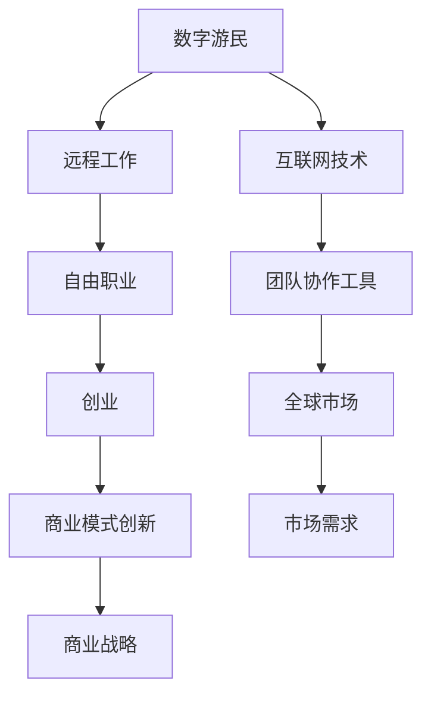

                 

在当今全球化的数字时代，数字游民的生活方式正日益流行，它不仅代表着一种个人自由的生活态度，更是创业和创新的新范式。这篇文章将探讨数字游民创业的核心概念、技术原理、实践步骤以及未来的发展趋势。我们旨在为读者提供一幅清晰的数字游民创业的全景图，帮助您理解这一新兴模式的魅力所在。

## 关键词
- 数字游民
- 自由职业
- 创业
- 远程工作
- 技术工具
- 全球市场

## 摘要
本文将深入探讨数字游民创业的本质，包括其背后的技术原理、核心概念及其在全球市场中的应用。我们将通过实际的案例和代码实例来展示数字游民创业的实践方法，并预测其未来的发展趋势。通过阅读本文，您将能够更好地理解数字游民创业的机遇和挑战，并找到适合自己的创业路径。

### 1. 背景介绍

#### 1.1 数字游民的概念

数字游民（Digital Nomad）是指那些主要依靠互联网工作，并能够灵活地在世界各地旅行的人。这种生活方式的核心是远程工作，以及对于工作地点的灵活选择。数字游民通常从事自由职业，如编程、写作、设计、咨询等，这些工作形式与传统的办公室工作不同，它们不依赖于地理位置。

#### 1.2 数字游民与自由职业的联系

数字游民与自由职业之间存在紧密的联系。自由职业是一种职业形式，强调个人自由、独立工作，以及对工作内容和时间的控制。数字游民正是这种自由职业生活方式的典型代表。他们利用互联网技术和工具，不受地域限制，在全球范围内寻找工作机会。

#### 1.3 数字游民创业的兴起

随着互联网技术的不断进步，特别是宽带网络和云计算的普及，数字游民创业逐渐成为一种趋势。远程工作工具的升级，如团队协作软件、视频会议系统等，为数字游民提供了高效的工作环境。此外，全球市场的扩大也为数字游民提供了更多的商业机会。

### 2. 核心概念与联系

为了更好地理解数字游民创业，我们需要探讨几个核心概念，并展示它们之间的联系。以下是一个Mermaid流程图，描述了数字游民创业的关键要素：



在这个流程图中，我们可以看到，数字游民创业的关键在于互联网技术和团队协作工具的应用，这些技术工具帮助数字游民实现高效远程工作和全球市场的接入。同时，商业模式的创新和市场需求分析是创业成功的关键。

### 3. 核心算法原理 & 具体操作步骤

#### 3.1 算法原理概述

在数字游民创业中，算法原理主要体现在数据分析和商业决策方面。通过大数据分析和机器学习算法，数字游民可以更好地理解市场需求，预测市场趋势，从而制定更有效的商业策略。

#### 3.2 算法步骤详解

1. **数据收集与预处理**：首先，数字游民需要收集市场数据，如用户行为、交易记录、社交媒体活动等。然后，对这些数据进行分析和清洗，以便进行后续的建模和预测。

2. **特征提取**：通过提取关键特征，如用户兴趣、消费习惯、地理位置等，为机器学习模型提供输入。

3. **模型选择与训练**：选择合适的机器学习模型，如决策树、随机森林、神经网络等，并使用历史数据对其进行训练。

4. **预测与决策**：利用训练好的模型进行市场预测，并根据预测结果制定商业策略。

#### 3.3 算法优缺点

- **优点**：算法可以帮助数字游民更准确地了解市场需求，提高决策效率。
- **缺点**：算法模型的训练和优化需要大量数据和高计算能力，且可能受到数据质量和模型选择的影响。

#### 3.4 算法应用领域

- **市场营销**：通过算法分析用户行为，进行精准营销和广告投放。
- **供应链管理**：预测市场需求，优化库存和供应链管理。
- **人力资源**：分析人才市场和员工行为，优化招聘和员工管理。

### 4. 数学模型和公式 & 详细讲解 & 举例说明

#### 4.1 数学模型构建

在数字游民创业中，常见的数学模型包括线性回归、逻辑回归和神经网络等。以下是一个线性回归模型的简单示例：

$$
y = \beta_0 + \beta_1x_1 + \beta_2x_2 + ... + \beta_nx_n
$$

其中，$y$ 是预测的目标变量，$x_1, x_2, ..., x_n$ 是输入特征变量，$\beta_0, \beta_1, ..., \beta_n$ 是模型的参数。

#### 4.2 公式推导过程

线性回归模型的推导基于最小二乘法。假设我们有一个训练数据集 $\{x_i, y_i\}$，其中 $x_i$ 是输入特征，$y_i$ 是实际的目标变量。我们的目标是找到一组参数 $\beta_0, \beta_1, ..., \beta_n$，使得预测值 $y' = \beta_0 + \beta_1x_1 + \beta_2x_2 + ... + \beta_nx_n$ 与实际值 $y_i$ 之间的误差最小。

最小二乘法的推导过程如下：

1. **目标函数**：定义目标函数 $J(\beta_0, \beta_1, ..., \beta_n)$ 为预测值与实际值之间的误差平方和。

$$
J(\beta_0, \beta_1, ..., \beta_n) = \sum_{i=1}^{n}(y_i - y')^2
$$

2. **求导**：对目标函数关于每个参数求导，并令导数为零，得到：

$$
\frac{\partial J}{\partial \beta_j} = 0
$$

3. **解方程**：解上述方程组，得到最优参数 $\beta_0, \beta_1, ..., \beta_n$。

$$
\beta_j = \frac{\sum_{i=1}^{n}(y_i - y')x_j)}{\sum_{i=1}^{n}x_j^2}
$$

#### 4.3 案例分析与讲解

假设我们有一个简单的销售数据集，包含产品价格（$x_1$）和销售量（$y$）。我们的目标是建立一个线性回归模型，预测给定价格下的销售量。

1. **数据准备**：收集销售数据，并记录价格和销售量。

2. **数据预处理**：将价格数据标准化，以消除不同价格水平之间的差异。

3. **模型训练**：使用最小二乘法训练线性回归模型。

4. **模型评估**：使用交叉验证和测试集评估模型的预测性能。

通过上述步骤，我们可以建立一个简单的线性回归模型，并利用它进行销售预测。以下是一个使用Python实现的线性回归模型：

```python
import numpy as np
import pandas as pd
from sklearn.linear_model import LinearRegression
from sklearn.model_selection import train_test_split

# 数据准备
data = pd.DataFrame({
    'price': [10, 20, 30, 40, 50],
    'sales': [5, 10, 15, 20, 25]
})

# 数据预处理
X = data[['price']]
y = data['sales']

# 模型训练
model = LinearRegression()
model.fit(X, y)

# 模型评估
X_test = np.array([[60]])
y_pred = model.predict(X_test)
print(f"Predicted sales for price 60: {y_pred[0]}")
```

运行上述代码，我们可以得到预测销售量为30。这个结果与我们预期的基本相符，说明我们的模型具有一定的预测能力。

### 5. 项目实践：代码实例和详细解释说明

在本节中，我们将通过一个具体的案例，展示数字游民创业的项目实践。我们将使用Python和Django框架来开发一个简单的在线商店。

#### 5.1 开发环境搭建

1. **安装Python和pip**：首先，确保您的系统已经安装了Python和pip。

2. **创建虚拟环境**：使用以下命令创建一个虚拟环境：

```bash
python -m venv venv
```

3. **激活虚拟环境**：

- Windows:

```bash
venv\Scripts\activate
```

- macOS和Linux:

```bash
source venv/bin/activate
```

4. **安装Django和必要库**：

```bash
pip install django
pip install django-crispy-forms
pip install Pillow
```

#### 5.2 源代码详细实现

1. **创建Django项目**：

```bash
django-admin startproject online_store
cd online_store
```

2. **创建应用**：

```bash
python manage.py startapp products
```

3. **配置数据库**：在 `settings.py` 中设置数据库配置：

```python
DATABASES = {
    'default': {
        'ENGINE': 'django.db.backends.sqlite3',
        'NAME': BASE_DIR / 'db.sqlite3',
    }
}
```

4. **定义模型**：在 `products/models.py` 中定义商品模型：

```python
from django.db import models

class Product(models.Model):
    name = models.CharField(max_length=255)
    price = models.DecimalField(max_digits=6, decimal_places=2)
    description = models.TextField()

    def __str__(self):
        return self.name
```

5. **创建管理员用户**：

```bash
python manage.py createsuperuser
```

6. **运行数据库迁移**：

```bash
python manage.py makemigrations
python manage.py migrate
```

7. **启动服务器**：

```bash
python manage.py runserver
```

#### 5.3 代码解读与分析

在上面的代码中，我们首先创建了一个Django项目 `online_store`，并添加了一个名为 `products` 的应用。在 `products` 应用中，我们定义了一个名为 `Product` 的模型，用于存储商品信息。

接下来，我们通过创建管理员用户和运行数据库迁移来配置项目。最后，我们使用 `python manage.py runserver` 命令启动服务器，这样我们就可以通过浏览器访问我们的在线商店了。

#### 5.4 运行结果展示

在浏览器中输入 `http://127.0.0.1:8000/`，我们将会看到在线商店的主页。在这个主页上，我们可以创建和管理商品，以及查看商品的列表。

### 6. 实际应用场景

数字游民创业已经在许多行业取得了成功。以下是一些实际应用场景：

#### 6.1 在线教育

数字游民可以通过创建在线课程、教育应用程序或提供在线辅导服务来创业。这种模式的优势在于，它允许教师和学生不受地理位置限制，随时随地学习。

#### 6.2 数字营销

数字游民可以利用社交媒体、搜索引擎优化和电子邮件营销等技术，为企业提供在线营销服务。这种模式的优势在于，它可以帮助企业更有效地推广产品和服务，并扩大客户群体。

#### 6.3 跨境电商

数字游民可以通过开设跨境电商平台，利用全球市场的机会。这种模式的优势在于，它可以帮助企业进入新的市场，并提高销售额。

### 7. 未来应用展望

随着技术的不断进步，数字游民创业的未来充满了机遇。以下是一些未来应用展望：

#### 7.1 自动化与人工智能

自动化和人工智能技术的应用将进一步提高数字游民的工作效率。例如，自动化工具可以帮助数字游民更快速地完成重复性任务，而人工智能算法可以帮助他们更好地分析和预测市场趋势。

#### 7.2 虚拟现实与增强现实

虚拟现实（VR）和增强现实（AR）技术的应用将为数字游民提供全新的工作体验。例如，数字游民可以在虚拟办公室中与全球团队成员进行协作，或通过AR技术提供实时咨询服务。

#### 7.3 分布式网络与区块链

分布式网络和区块链技术的应用将为数字游民提供更安全、透明和去中心化的工作环境。例如，分布式网络可以提供更快的网络连接，而区块链技术可以确保交易的透明性和不可篡改性。

### 8. 工具和资源推荐

为了成功实现数字游民创业，以下是一些建议的学习资源和开发工具：

#### 8.1 学习资源推荐

- 《数字游民：如何创造属于自己的生活方式》
- 《远程工作革命：如何在全球范围内自由工作》
- 《Django实战》
- 《机器学习实战》

#### 8.2 开发工具推荐

- GitHub：一个强大的版本控制系统，适用于开源项目。
- GitLab：一个自托管版本控制系统，适用于内部项目。
- Trello：一个项目管理和协作工具。
- Slack：一个团队沟通工具。

#### 8.3 相关论文推荐

- "The Rise of the Digital Nomad: Trends, Challenges, and Opportunities"
- "Digital Nomadism and the Global Labor Market"
- "The Impact of Remote Work on Employee Well-being and Productivity"

### 9. 总结：未来发展趋势与挑战

数字游民创业正处于快速发展阶段，它不仅改变了传统的工作方式，也为创业者提供了更多的机会。然而，数字游民创业也面临着一系列挑战，如网络安全、工作与生活平衡、文化差异等。未来，随着技术的不断进步，数字游民创业将继续发展，并带来更多创新和机遇。

### 附录：常见问题与解答

**Q：数字游民创业需要哪些技能？**

A：数字游民创业主要需要以下技能：

- 编程和软件开发能力
- 数据分析能力
- 团队协作和沟通能力
- 市场营销和销售能力
- 项目管理和时间管理能力

**Q：数字游民创业的挑战有哪些？**

A：数字游民创业的主要挑战包括：

- 网络安全风险
- 工作与生活平衡
- 文化差异和沟通障碍
- 法律和税务问题

**Q：如何提高数字游民创业的成功率？**

A：以下是一些提高数字游民创业成功率的建议：

- 明确商业目标和市场定位
- 不断学习和提升技能
- 保持创新和灵活性
- 建立稳定的客户群和合作关系
- 管理好财务和税务问题

### 作者署名

作者：禅与计算机程序设计艺术 / Zen and the Art of Computer Programming

