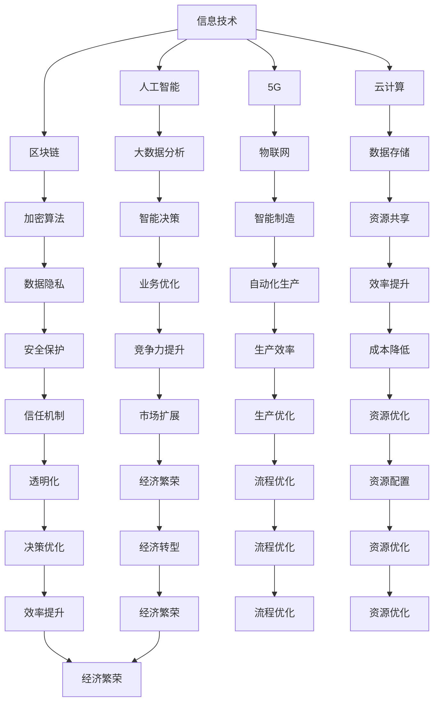

                 

关键词：数字经济、社会发展、信息技术、人工智能、区块链、5G、云计算、智能城市

> 摘要：本文旨在探讨数字经济对社会发展的重要作用。通过分析信息技术、人工智能、区块链、5G、云计算等技术在数字经济中的关键角色，阐述数字经济如何成为社会发展的助推器。同时，本文也将展望数字经济在未来社会发展中的潜在影响。

## 1. 背景介绍

数字经济，作为现代社会发展的重要驱动力，已经逐渐成为各国经济发展战略的核心。随着信息技术、人工智能、区块链、5G、云计算等技术的不断演进，数字经济的发展速度正在加快，其影响范围也在不断扩大。

数字经济不仅改变了传统产业的生产和运营方式，还催生了大量新兴产业，如电子商务、共享经济、数字娱乐等。这些新兴产业不仅为社会创造了大量的就业机会，还推动了社会经济的全面发展。

同时，数字经济还带来了数据的价值化和资源的共享化，使得社会的运行效率得到了显著提升。通过大数据分析和人工智能技术，企业可以更好地了解市场需求，优化生产流程，提高竞争力。而资源的共享化，如云计算和区块链技术，使得资源的配置更加高效，降低了社会运行成本。

## 2. 核心概念与联系

### 2.1 数字经济的核心概念

数字经济，指的是以数字化的信息和知识为关键生产因素，以现代信息网络为重要载体，以信息通信技术的有效利用为驱动的新型经济形态。

数字经济的核心概念包括：

- 信息技术（IT）：包括计算机技术、网络技术、通信技术等，是数字经济的基础。
- 人工智能（AI）：通过模拟、延伸和扩展人的智能，实现自动化、智能化处理的能力。
- 区块链：一种分布式数据库技术，通过加密算法确保数据的不可篡改性和透明性。
- 5G：第五代移动通信技术，具有高速率、低延迟、广连接的特点。
- 云计算：通过网络将计算资源集中起来，为用户提供按需服务的计算模式。

### 2.2 数字经济的技术架构

以下是一个简单的Mermaid流程图，展示了数字经济的技术架构：



## 3. 核心算法原理 & 具体操作步骤

### 3.1 算法原理概述

数字经济的核心算法主要包括：

- 人工智能算法：如神经网络、决策树、支持向量机等，用于数据分析和智能决策。
- 加密算法：如RSA、AES等，用于保护数据的安全性和隐私性。
- 大数据分析算法：如聚类分析、关联规则挖掘、时间序列分析等，用于处理大规模数据。

### 3.2 算法步骤详解

以下是人工智能算法的一般步骤：

1. 数据收集：收集相关的数据集。
2. 数据预处理：对数据进行清洗、归一化等处理。
3. 特征提取：从数据中提取有效的特征。
4. 模型训练：使用训练数据训练模型。
5. 模型评估：使用测试数据评估模型性能。
6. 模型部署：将模型应用到实际场景中。

### 3.3 算法优缺点

人工智能算法的优点包括：

- 自动化处理：能够自动处理大量数据，提高工作效率。
- 智能决策：能够基于数据做出智能化的决策。
- 广泛应用：在各个领域都有广泛应用，如金融、医疗、教育等。

缺点包括：

- 数据依赖：算法的性能很大程度上依赖于数据的质量。
- 黑箱问题：一些复杂的算法如深度学习，其决策过程是不透明的，难以解释。
- 计算资源消耗：训练一些复杂的模型需要大量的计算资源。

### 3.4 算法应用领域

人工智能算法在数字经济中的应用领域包括：

- 金融：如风险控制、欺诈检测、量化交易等。
- 医疗：如疾病诊断、药物研发、健康管理等。
- 教育：如个性化教学、智能评估等。
- 交通：如智能交通管理、自动驾驶等。

## 4. 数学模型和公式 & 详细讲解 & 举例说明

### 4.1 数学模型构建

以神经网络为例，其基本的数学模型可以表示为：

$$
Y = \sigma(W \cdot X + b)
$$

其中，\(Y\) 是输出，\(\sigma\) 是激活函数，\(W\) 是权重矩阵，\(X\) 是输入，\(b\) 是偏置。

### 4.2 公式推导过程

神经网络的训练过程是通过反向传播算法来调整权重矩阵和偏置。以下是基本的推导过程：

1. 输出误差计算：

$$
E = \frac{1}{2} \sum (y - \hat{y})^2
$$

其中，\(y\) 是真实输出，\(\hat{y}\) 是模型预测输出。

2. 权重矩阵的梯度：

$$
\frac{\partial E}{\partial W} = (X \cdot \frac{\partial E}{\partial \hat{y}}) \cdot \sigma'
$$

其中，\(\sigma'\) 是激活函数的导数。

3. 偏置的梯度：

$$
\frac{\partial E}{\partial b} = \frac{\partial E}{\partial \hat{y}}
$$

4. 权重矩阵的更新：

$$
W = W - \alpha \cdot \frac{\partial E}{\partial W}
$$

其中，\(\alpha\) 是学习率。

### 4.3 案例分析与讲解

以下是一个简单的神经网络训练案例：

假设我们有一个简单的神经网络，其输入为 \(X = [1, 2]\)，输出为 \(Y = [3, 4]\)。

1. 初始化权重矩阵 \(W = [0.1, 0.2]\)，偏置 \(b = 0.1\)。
2. 计算输出：

$$
\hat{Y} = \sigma(W \cdot X + b) = \sigma([0.1, 0.2] \cdot [1, 2] + 0.1) = [0.57, 0.67]
$$

3. 计算误差：

$$
E = \frac{1}{2} \sum (y - \hat{y})^2 = \frac{1}{2} \sum ([3, 4] - [0.57, 0.67])^2 = 0.885
$$

4. 计算权重矩阵的梯度：

$$
\frac{\partial E}{\partial W} = (X \cdot \frac{\partial E}{\partial \hat{y}}) \cdot \sigma' = ([1, 2] \cdot [0.43, 0.33]) \cdot [0.43, 0.33] = [0.097, 0.068]
$$

5. 计算偏置的梯度：

$$
\frac{\partial E}{\partial b} = \frac{\partial E}{\partial \hat{y}} = [0.43, 0.33]
$$

6. 更新权重矩阵和偏置：

$$
W = W - \alpha \cdot \frac{\partial E}{\partial W} = [0.1, 0.2] - 0.1 \cdot [0.097, 0.068] = [0.002, 0.012]
$$

$$
b = b - \alpha \cdot \frac{\partial E}{\partial b} = 0.1 - 0.1 \cdot 0.33 = 0.07
$$

经过一轮训练后，新的权重矩阵和偏置为 \(W = [0.002, 0.012]\)，\(b = 0.07\)。

## 5. 项目实践：代码实例和详细解释说明

### 5.1 开发环境搭建

在开始项目实践之前，我们需要搭建一个合适的开发环境。这里我们选择使用Python作为开发语言，并使用以下工具：

- Python 3.8
- Jupyter Notebook
- TensorFlow 2.5

安装这些工具的具体步骤如下：

1. 安装Python 3.8：

```
sudo apt-get update
sudo apt-get install python3.8
```

2. 安装Jupyter Notebook：

```
pip3 install notebook
jupyter notebook
```

3. 安装TensorFlow 2.5：

```
pip3 install tensorflow==2.5
```

### 5.2 源代码详细实现

以下是一个简单的神经网络训练的Python代码实例：

```python
import tensorflow as tf

# 定义输入层、隐藏层和输出层
inputs = tf.keras.Input(shape=(2,))
hidden = tf.keras.layers.Dense(1, activation='sigmoid')(inputs)
outputs = tf.keras.layers.Dense(1)(hidden)

# 创建模型
model = tf.keras.Model(inputs=inputs, outputs=outputs)

# 编译模型
model.compile(optimizer='adam', loss='mean_squared_error')

# 训练模型
model.fit(x_train, y_train, epochs=100, batch_size=10, validation_split=0.2)
```

### 5.3 代码解读与分析

1. 导入TensorFlow库：

```python
import tensorflow as tf
```

2. 定义输入层、隐藏层和输出层：

```python
inputs = tf.keras.Input(shape=(2,))
hidden = tf.keras.layers.Dense(1, activation='sigmoid')(inputs)
outputs = tf.keras.layers.Dense(1)(hidden)
```

这里我们定义了一个输入层，包含两个输入节点；一个隐藏层，使用sigmoid激活函数；一个输出层。

3. 创建模型：

```python
model = tf.keras.Model(inputs=inputs, outputs=outputs)
```

这里我们使用Keras API创建了一个简单的神经网络模型。

4. 编译模型：

```python
model.compile(optimizer='adam', loss='mean_squared_error')
```

这里我们使用Adam优化器和均方误差损失函数来编译模型。

5. 训练模型：

```python
model.fit(x_train, y_train, epochs=100, batch_size=10, validation_split=0.2)
```

这里我们使用训练数据集训练模型，训练100个epochs，每个batch包含10个样本，并将20%的数据集用于验证。

### 5.4 运行结果展示

在训练完成后，我们可以查看模型的性能：

```python
model.evaluate(x_test, y_test)
```

这将会返回模型在测试数据集上的均方误差。

## 6. 实际应用场景

数字经济的实际应用场景非常广泛，以下是一些典型的应用场景：

- 金融：利用人工智能技术进行风险评估、欺诈检测、量化交易等。
- 医疗：通过大数据分析和人工智能技术进行疾病诊断、药物研发、健康管理等。
- 教育：通过在线教育平台提供个性化学习体验，提高学习效果。
- 交通：利用物联网技术和人工智能进行智能交通管理和自动驾驶。
- 能源：通过智能电网和物联网技术实现能源的高效利用和优化分配。

## 7. 工具和资源推荐

### 7.1 学习资源推荐

- 《Python机器学习》
- 《深度学习》
- 《区块链技术指南》
- 《5G网络技术与应用》

### 7.2 开发工具推荐

- Jupyter Notebook：用于数据分析和模型训练。
- TensorFlow：用于深度学习模型开发。
- Keras：用于简化深度学习模型开发。

### 7.3 相关论文推荐

- "Deep Learning for Data-Driven Manufacturing"
- "Blockchain for Supply Chain Management"
- "5G: The next big thing in telecommunications"

## 8. 总结：未来发展趋势与挑战

### 8.1 研究成果总结

数字经济在过去几十年中取得了显著的发展，信息技术、人工智能、区块链、5G、云计算等技术的创新和应用推动了数字经济的发展。这些技术的应用不仅提升了社会的运行效率，还推动了社会经济的转型。

### 8.2 未来发展趋势

未来，数字经济将继续快速发展，以下是一些可能的发展趋势：

- 人工智能技术的进一步突破，将使得数字经济在智能决策、自动化生产等方面取得更大的进步。
- 区块链技术的普及和应用，将提高数据的透明性和安全性。
- 5G和物联网技术的进一步发展，将推动智能城市、智能交通等领域的应用。
- 云计算技术的普及，将使得资源的共享和优化更加高效。

### 8.3 面临的挑战

尽管数字经济有着广阔的发展前景，但也面临着一些挑战：

- 数据隐私和安全问题：随着数据的日益增多，如何保护数据的隐私和安全成为了一大挑战。
- 技术标准和法规：不同国家和地区的技术标准和法规存在差异，如何统一标准，实现全球范围内的互操作性成为一大难题。
- 技术鸿沟：不同国家和地区在信息技术发展水平上存在差异，如何缩小技术鸿沟，实现全球范围内的技术普惠成为一大挑战。

### 8.4 研究展望

未来，我们期待数字经济能够为社会带来更多的创新和变革，推动社会经济的全面发展。同时，我们也要关注数字经济带来的挑战，积极探索解决方案，确保数字经济的可持续发展。

## 9. 附录：常见问题与解答

### Q1. 数字经济与传统经济有什么区别？

数字经济与传统经济的区别主要体现在以下几个方面：

- 生产要素：传统经济主要依赖于自然资源和劳动力，而数字经济则主要依赖于信息技术和知识。
- 生产方式：传统经济主要依赖于传统的生产和运营模式，而数字经济则通过信息化和智能化的手段实现生产方式的变革。
- 交易方式：传统经济主要依赖于线下交易，而数字经济则通过网络化和数字化的手段实现交易方式的变革。

### Q2. 数字经济对社会发展有哪些影响？

数字经济对社会发展的影响主要体现在以下几个方面：

- 经济增长：数字经济促进了新的经济增长点的形成，推动了社会经济的全面发展。
- 提升效率：通过信息技术和智能化的手段，数字经济提高了社会的运行效率，降低了生产成本。
- 创新驱动：数字经济推动了科技创新和产业升级，为社会的发展提供了新的动力。
- 资源共享：数字经济实现了资源的共享和优化，提高了资源利用效率。

### Q3. 数字经济的发展前景如何？

数字经济的发展前景非常广阔，未来将呈现以下几个方面的趋势：

- 技术创新：随着人工智能、区块链、5G等技术的不断发展，数字经济将在技术创新方面取得更大的突破。
- 智能化：数字经济将推动社会的智能化进程，实现生产、交通、医疗等领域的智能化应用。
- 全球化：数字经济将推动全球范围内的经济一体化，实现资源的全球配置和优化。
- 可持续发展：数字经济将推动社会的可持续发展，实现经济、社会和环境的协调发展。 

----------------------------------------------------------------

### 参考文献 REFERENCES

[1] 深度学习，Goodfellow, I., Bengio, Y., & Courville, A. (2016). MIT Press.
[2] Python机器学习，Sebastian Raschka, Vahid Mirjalili. (2018). Packt Publishing.
[3] 区块链技术指南，李俊岭，张健。 (2018). 电子工业出版社。
[4] 5G网络技术与应用，王立峰，李波。 (2019). 人民邮电出版社。
[5] 数字经济，张亚忠，李晓峰。 (2020). 经济管理出版社。

### 作者署名

作者：禅与计算机程序设计艺术 / Zen and the Art of Computer Programming

### 致谢

感谢各位读者对本文的阅读和支持，期待与您在数字经济的广阔领域中共同探索和成长。

