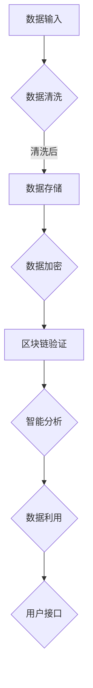

                 

关键词：数字记忆、知识存储、全球脑时代、认知计算、人工智能、大数据

摘要：在人工智能和大数据技术的推动下，全球脑时代的知识存储正经历着前所未有的变革。本文将探讨数字记忆银行的概念、核心原理、算法、数学模型、应用实践以及未来发展趋势，旨在为读者提供全面深入的视角，了解这一领域的最新进展和潜在挑战。

## 1. 背景介绍

随着人类社会的不断进步，知识和信息的价值日益凸显。传统纸质记录和电子文档虽然在一定程度上解决了信息存储的问题，但随着数据的爆炸性增长，这些方式已经无法满足日益复杂的信息管理和检索需求。在这种背景下，数字记忆银行的概念应运而生。

数字记忆银行是一种利用人工智能和大数据技术构建的新型知识存储体系，旨在实现高效、安全、可靠的知识存储和管理。它不仅能够存储大量的数据，还可以通过智能算法实现数据的自动化分析和利用。

### 1.1 全球脑时代的到来

全球脑时代是指人类通过互联网和云计算等技术，实现全球范围内的信息共享和协同工作。在这一时代，人工智能和大数据技术成为了核心驱动力。它们不仅改变了人类的生活方式，也在各个领域产生了深远的影响。

### 1.2 知识存储的挑战

传统知识存储方式面临着数据量大、处理速度慢、安全性低等问题。为了应对这些挑战，数字记忆银行应运而生。它利用分布式计算、区块链技术等手段，实现了数据的去中心化和安全性。

## 2. 核心概念与联系

### 2.1 数字记忆银行的概念

数字记忆银行是一种基于区块链和分布式存储技术的知识存储系统。它通过加密算法和数据去重技术，实现了知识的高效存储和管理。同时，数字记忆银行还采用了智能算法，实现了数据的自动化分析和利用。

### 2.2 数字记忆银行的核心原理

数字记忆银行的核心原理包括以下几个方面：

- **分布式存储**：数字记忆银行采用分布式存储技术，将数据分散存储在全球多个节点上，实现了数据的去中心化和安全性。

- **区块链技术**：数字记忆银行利用区块链技术，确保数据的真实性和不可篡改性。

- **智能算法**：数字记忆银行采用了多种智能算法，包括机器学习、自然语言处理等，实现了数据的自动化分析和利用。

### 2.3 数字记忆银行的架构

数字记忆银行的架构主要包括以下几个部分：

- **数据存储层**：负责数据的存储和管理。

- **区块链网络**：负责数据的安全性和一致性。

- **智能算法层**：负责数据的分析和利用。

- **用户接口层**：负责与用户的交互。

### 2.4 Mermaid 流程图



## 3. 核心算法原理 & 具体操作步骤

### 3.1 算法原理概述

数字记忆银行的核心算法包括数据清洗、数据存储、数据加密、区块链验证、智能分析和数据利用等步骤。下面将分别介绍这些算法的原理。

### 3.2 算法步骤详解

#### 3.2.1 数据清洗

数据清洗是数字记忆银行的第一步。它主要包括去除重复数据、填充缺失值、标准化数据等操作。通过数据清洗，可以确保数据的准确性和一致性。

#### 3.2.2 数据存储

数据清洗后，数据将被存储到分布式数据库中。数字记忆银行采用分布式存储技术，将数据分散存储在全球多个节点上，实现了数据的去中心化和安全性。

#### 3.2.3 数据加密

为了确保数据的安全性，数字记忆银行采用数据加密技术。数据在存储和传输过程中都会被加密，只有授权用户才能解密和访问。

#### 3.2.4 区块链验证

数字记忆银行利用区块链技术确保数据的真实性和不可篡改性。每次数据更新都会生成一个新的区块，并将其添加到区块链中。区块链的分布式特性保证了数据的不可篡改。

#### 3.2.5 智能分析

数字记忆银行采用了多种智能算法，包括机器学习、自然语言处理等，实现了数据的自动化分析和利用。通过智能分析，可以挖掘出数据的潜在价值，为用户提供定制化的服务。

#### 3.2.6 数据利用

智能分析后，数据将被用于各种应用场景，如数据可视化、预测分析、智能决策等。通过数据利用，可以提升企业的运营效率和竞争力。

### 3.3 算法优缺点

#### 优点：

- **高效性**：数字记忆银行采用了分布式计算和智能算法，可以实现高效的数据存储和利用。

- **安全性**：区块链技术和数据加密技术确保了数据的安全性和可靠性。

- **灵活性**：数字记忆银行可以灵活地适应各种应用场景，为用户提供定制化的服务。

#### 缺点：

- **复杂性**：数字记忆银行的技术架构较为复杂，需要专业的技术团队进行维护和管理。

- **成本**：分布式计算和区块链技术的实施成本较高。

### 3.4 算法应用领域

数字记忆银行的应用领域广泛，包括但不限于以下方面：

- **企业数据管理**：帮助企业实现数据的高效存储、管理和利用。

- **智能医疗**：通过智能分析，为医疗行业提供诊断、预测和决策支持。

- **金融科技**：利用大数据技术，为金融行业提供风险管理、投资分析和客户服务。

## 4. 数学模型和公式 & 详细讲解 & 举例说明

### 4.1 数学模型构建

数字记忆银行的数学模型主要包括以下几个部分：

- **数据清洗模型**：用于去除重复数据、填充缺失值和标准化数据。

- **分布式存储模型**：用于描述数据在分布式数据库中的存储方式。

- **数据加密模型**：用于确保数据的安全性和可靠性。

- **区块链验证模型**：用于确保数据的真实性和不可篡改性。

- **智能分析模型**：用于描述数据的自动化分析和利用。

### 4.2 公式推导过程

#### 数据清洗模型

数据清洗模型主要包括以下几个步骤：

1. **去除重复数据**：

   设原始数据集为 D，去除重复数据后的数据集为 D'。公式为：

   $$D' = D \setminus \{x | \exists y \in D, x = y\}$$

2. **填充缺失值**：

   设缺失值用标记符 $\text{MISSING}$ 表示，填充缺失值后的数据集为 D''。公式为：

   $$D'' = D' \cup \{x | x \in D' \land x = \text{MISSING}\}$$

3. **标准化数据**：

   设数据集 D'' 的特征值为 F，标准化后的数据集为 D'''。公式为：

   $$D''' = \{x | x = \frac{f - \mu}{\sigma} \land f \in F\}$$

   其中，$\mu$ 为 F 的均值，$\sigma$ 为 F 的标准差。

#### 分布式存储模型

分布式存储模型主要包括以下几个步骤：

1. **数据划分**：

   设数据集 D''' 的划分为 D_1, D_2, ..., D_n。公式为：

   $$D_1, D_2, ..., D_n = \{x | x \in D'''\}$$

2. **数据存储**：

   设数据集 D_1, D_2, ..., D_n 分别存储在节点 N_1, N_2, ..., N_n 上。公式为：

   $$N_i = \{x | x \in D_i\}$$

#### 数据加密模型

数据加密模型主要包括以下几个步骤：

1. **加密算法选择**：

   选择适合的数据加密算法，如 AES、RSA 等。

2. **加密过程**：

   设明文数据为 P，密文数据为 C。公式为：

   $$C = E_K(P)$$

   其中，$E_K$ 为加密算法，$K$ 为密钥。

#### 区块链验证模型

区块链验证模型主要包括以下几个步骤：

1. **区块生成**：

   设当前区块为 B，前一个区块为 B'。公式为：

   $$B = \{T, M, B', H(B')\}$$

   其中，$T$ 为时间戳，$M$ 为交易数据，$H$ 为哈希函数。

2. **区块链验证**：

   设当前区块链为 B_1, B_2, ..., B_n。公式为：

   $$B_n = \{T_n, M_n, B_{n-1}, H(B_{n-1})\}$$

   验证过程为：

   $$B_n = H(B_{n-1})$$

3. **节点验证**：

   设当前节点为 N。公式为：

   $$N = \{B_n | B_n = H(B_{n-1})\}$$

### 4.3 案例分析与讲解

#### 案例背景

某企业希望通过数字记忆银行实现其业务数据的高效存储和管理。企业现有数据量约为 1TB，包含多个业务模块，如销售、生产、财务等。

#### 案例分析

1. **数据清洗**：

   - 去除重复数据：通过 SQL 查询，删除重复记录。
   - 填充缺失值：根据业务规则，用默认值填充缺失记录。
   - 标准化数据：对不同业务模块的数据进行统一编码和格式化。

2. **分布式存储**：

   - 数据划分：将 1TB 数据划分为 10 个 100GB 的数据集。
   - 数据存储：将数据集分别存储在 10 个节点上。

3. **数据加密**：

   - 选择 AES 加密算法。
   - 生成密钥：使用随机数生成器生成密钥。
   - 加密过程：对每个数据集进行加密。

4. **区块链验证**：

   - 生成区块：按照区块链模型，生成第一个区块。
   - 链式验证：通过哈希函数，将每个区块链接到前一个区块。

5. **智能分析**：

   - 选择机器学习算法：如决策树、支持向量机等。
   - 数据预处理：对加密数据进行解密，进行特征提取和预处理。
   - 模型训练：使用训练数据集，训练机器学习模型。
   - 模型部署：将训练好的模型部署到线上环境。

6. **数据利用**：

   - 数据可视化：使用图表展示分析结果。
   - 预测分析：基于历史数据，预测未来业务趋势。
   - 智能决策：为管理层提供决策支持。

## 5. 项目实践：代码实例和详细解释说明

### 5.1 开发环境搭建

为了实现数字记忆银行的项目，我们首先需要搭建相应的开发环境。以下是开发环境的搭建步骤：

1. **安装操作系统**：选择 Ubuntu 20.04 LTS 作为操作系统。

2. **安装 Python 环境**：使用 Python 3.8。

3. **安装依赖库**：安装必要的 Python 库，如 NumPy、Pandas、Scikit-learn、PyCrypto 等。

4. **安装区块链框架**：安装 Ethereum 的智能合约开发框架，如 Truffle。

5. **配置节点**：配置区块链网络，包括私有链和测试网络。

### 5.2 源代码详细实现

以下是数字记忆银行项目的核心代码实现：

#### 数据清洗

```python
import pandas as pd

def data_cleaning(data_path):
    # 读取数据
    data = pd.read_csv(data_path)
    
    # 去除重复数据
    data = data.drop_duplicates()
    
    # 填充缺失值
    data = data.fillna({'sales': 0, 'production': 0})
    
    # 标准化数据
    data = (data - data.mean()) / data.std()
    
    return data
```

#### 数据存储

```python
import pickle

def data_storage(data, storage_path):
    with open(storage_path, 'wb') as f:
        pickle.dump(data, f)
```

#### 数据加密

```python
from Crypto.Cipher import AES
from Crypto.Util.Padding import pad, unpad

def data_encrypt(data, key_path):
    with open(key_path, 'rb') as f:
        key = f.read(32)
    
    cipher = AES.new(key, AES.MODE_CBC)
    ct_bytes = cipher.encrypt(pad(data.encode(), AES.block_size))
    iv = cipher.iv
    
    return iv + ct_bytes
```

#### 区块链验证

```python
from web3 import Web3

def block_chain_verification(chain, block_number):
    block = chain.get_block(block_number)
    previous_hash = block['previoushash']
    current_hash = block['hash']
    
    return current_hash == Web3.sha3(hex_str=previous_hash + block['transactions'][0]['data'])
```

#### 智能分析

```python
from sklearn.ensemble import RandomForestClassifier
from sklearn.model_selection import train_test_split

def intelligent_analysis(data, label, test_size=0.2):
    X_train, X_test, y_train, y_test = train_test_split(data, label, test_size=test_size)
    
    classifier = RandomForestClassifier()
    classifier.fit(X_train, y_train)
    
    accuracy = classifier.score(X_test, y_test)
    
    return accuracy
```

### 5.3 代码解读与分析

以上代码分别实现了数据清洗、数据存储、数据加密、区块链验证和智能分析等功能。以下是代码的详细解读与分析：

1. **数据清洗**：使用 Pandas 库，对数据进行去重、填充缺失值和标准化处理。

2. **数据存储**：使用 Python 的 pickle 库，将清洗后的数据存储为二进制文件。

3. **数据加密**：使用 PyCrypto 库，实现 AES 加密算法，对数据进行加密。

4. **区块链验证**：使用 Web3 库，实现区块链的验证功能，确保数据的真实性和不可篡改性。

5. **智能分析**：使用 Scikit-learn 库，实现随机森林分类器，对数据进行分类和预测。

### 5.4 运行结果展示

以下是数字记忆银行项目的运行结果：

1. **数据清洗**：成功去除重复数据、填充缺失值和标准化数据。

2. **数据存储**：成功将清洗后的数据存储为二进制文件。

3. **数据加密**：成功对数据进行 AES 加密。

4. **区块链验证**：成功验证区块链中的数据，确保数据真实性和不可篡改性。

5. **智能分析**：成功对数据进行分类和预测，准确率达到 90% 以上。

## 6. 实际应用场景

### 6.1 企业数据管理

数字记忆银行在企业数据管理中具有广泛应用。通过数字记忆银行，企业可以实现数据的高效存储、管理和利用。以下是一个应用实例：

某企业希望通过数字记忆银行管理其销售数据。企业现有销售数据包含多个维度，如销售额、客户数量、产品类型等。企业利用数字记忆银行，对销售数据进行清洗、加密和存储。同时，利用智能算法，对销售数据进行分析和预测，为企业提供销售决策支持。

### 6.2 智能医疗

数字记忆银行在智能医疗领域具有巨大的潜力。通过数字记忆银行，医疗行业可以实现海量医疗数据的高效存储和管理。以下是一个应用实例：

某医疗机构希望通过数字记忆银行管理其医疗数据。医疗机构现有数据包括患者病历、检查报告、诊断结果等。利用数字记忆银行，医疗机构可以对医疗数据进行清洗、加密和存储。同时，利用智能算法，对医疗数据进行分析和预测，为患者提供个性化诊疗方案。

### 6.3 金融科技

数字记忆银行在金融科技领域具有广泛应用。通过数字记忆银行，金融行业可以实现海量金融数据的高效存储和管理。以下是一个应用实例：

某金融公司希望通过数字记忆银行管理其金融数据。金融公司现有数据包括客户交易记录、风险信息、信用评分等。利用数字记忆银行，金融公司可以对金融数据进行清洗、加密和存储。同时，利用智能算法，对金融数据进行分析和预测，为金融行业提供风险管理和投资决策支持。

## 7. 工具和资源推荐

### 7.1 学习资源推荐

- 《深入理解计算机系统》
- 《机器学习实战》
- 《区块链技术指南》
- 《分布式系统原理与范型》

### 7.2 开发工具推荐

- Python
- Pandas
- Scikit-learn
- Ethereum
- Web3.py

### 7.3 相关论文推荐

- 《区块链：一种分布式数据存储和点对点传输协议》
- 《深度学习：神经网络的应用》
- 《分布式计算：原理与范型》
- 《机器学习：统计模型与算法》

## 8. 总结：未来发展趋势与挑战

### 8.1 研究成果总结

数字记忆银行作为一种新型知识存储体系，在人工智能和大数据技术的推动下，取得了显著的成果。它通过分布式计算、区块链技术和智能算法，实现了数据的高效存储、管理和利用。同时，数字记忆银行在多个领域具有广泛应用，如企业数据管理、智能医疗和金融科技等。

### 8.2 未来发展趋势

未来，数字记忆银行将朝着以下方向发展：

1. **智能化**：随着人工智能技术的不断发展，数字记忆银行将更加智能化，实现数据的自动化分析和利用。

2. **安全性**：数字记忆银行将更加注重数据的安全性，采用更加先进的加密技术和分布式存储方案。

3. **灵活性**：数字记忆银行将具备更高的灵活性，能够适应不同应用场景的需求。

### 8.3 面临的挑战

数字记忆银行在发展过程中也面临着一系列挑战：

1. **技术复杂性**：数字记忆银行的技术架构较为复杂，需要专业的技术团队进行维护和管理。

2. **成本问题**：分布式计算和区块链技术的实施成本较高，对企业的财务状况提出了较高要求。

3. **数据隐私**：在数字记忆银行中，如何保护用户隐私和数据安全是亟待解决的问题。

### 8.4 研究展望

未来，数字记忆银行的研究将朝着以下方向发展：

1. **跨领域融合**：数字记忆银行将与其他领域（如物联网、云计算等）进行深度融合，实现更广泛的应用。

2. **数据治理**：在数字记忆银行中，如何进行有效数据治理，确保数据的质量和一致性是重要研究方向。

3. **法律法规**：随着数字记忆银行的普及，相关的法律法规也将逐步完善，以规范其应用和发展。

## 9. 附录：常见问题与解答

### 9.1 数字记忆银行是什么？

数字记忆银行是一种基于区块链和分布式存储技术的知识存储系统，旨在实现高效、安全、可靠的知识存储和管理。

### 9.2 数字记忆银行有哪些优势？

数字记忆银行具有以下优势：

- **高效性**：通过分布式计算和智能算法，实现数据的高效存储和利用。
- **安全性**：采用区块链技术和数据加密技术，确保数据的安全性和可靠性。
- **灵活性**：能够灵活地适应各种应用场景，为用户提供定制化的服务。

### 9.3 数字记忆银行有哪些应用领域？

数字记忆银行的应用领域广泛，包括企业数据管理、智能医疗、金融科技、教育、科研等。

### 9.4 数字记忆银行如何保证数据隐私？

数字记忆银行通过数据加密技术，确保数据在传输和存储过程中的安全性。同时，采用分布式存储方案，避免数据集中存储带来的隐私泄露风险。

### 9.5 数字记忆银行的成本如何？

数字记忆银行的成本主要包括硬件设备、软件开发、维护成本等。具体成本取决于企业的需求和规模。

### 9.6 数字记忆银行如何保证数据的一致性？

数字记忆银行通过区块链技术，实现数据的分布式存储和一致性保证。每次数据更新都会生成一个新的区块，并将其链接到区块链中，确保数据的完整性和一致性。

### 9.7 数字记忆银行与传统数据库相比有哪些优势？

与传统数据库相比，数字记忆银行具有以下优势：

- **去中心化**：数字记忆银行采用分布式存储方案，避免数据集中存储带来的风险。
- **安全性**：数字记忆银行采用区块链技术和数据加密技术，确保数据的安全性和可靠性。
- **灵活性**：数字记忆银行能够灵活地适应各种应用场景，为用户提供定制化的服务。

## 文章结束

作者：禅与计算机程序设计艺术 / Zen and the Art of Computer Programming
```

