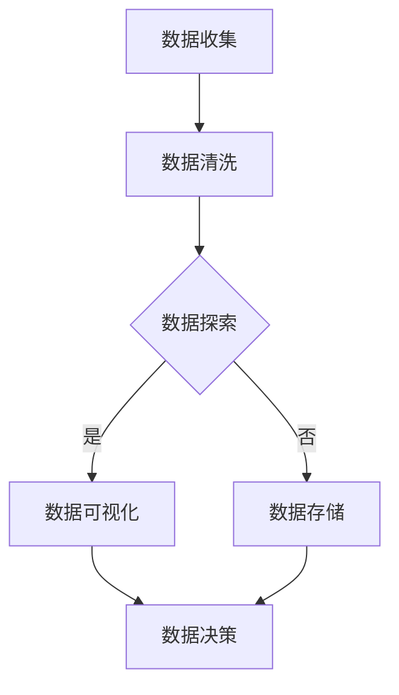

                 

  
关键词：数据可视化，数据探索，图表，图表库，数据结构，Python，案例研究

摘要：本文深入探讨了数据可视化和数据探索的基本原理，并提供了详细的代码实战案例，旨在帮助读者掌握这些核心概念，并在实际项目中应用。文章分为多个部分，包括背景介绍、核心概念与联系、核心算法原理与具体操作步骤、数学模型和公式、项目实践、实际应用场景、工具和资源推荐、总结与展望以及常见问题解答。

## 1. 背景介绍

数据可视化是数据分析和数据科学领域的重要组成部分。它通过将复杂的数据集转化为图形和图表，使数据变得更加直观和易于理解。随着大数据时代的到来，数据可视化的重要性日益凸显。有效的数据可视化不仅可以提高数据决策的效率，还可以揭示数据背后的隐藏模式和趋势。

数据探索则是数据分析和数据挖掘的前期工作，它涉及使用各种工具和方法来探索数据集的内在结构和特性。数据探索的目的是为了发现潜在的有用信息，并为后续的数据分析提供指导。

本文将结合Python语言和多种数据可视化库，通过实际案例，详细讲解数据可视化和数据探索的原理及其应用。

## 2. 核心概念与联系

数据可视化与数据探索之间的联系紧密，它们共同构成了数据分析的基石。数据可视化通过图形化的方式呈现数据，使数据探索变得更加直观和易于操作。

### 2.1 数据可视化

数据可视化涉及将数据转化为图形和图表，包括柱状图、折线图、饼图、散点图等。数据可视化库如Matplotlib、Seaborn、Plotly等，为开发者提供了丰富的图形和图表生成功能。

### 2.2 数据探索

数据探索包括数据清洗、数据预处理、特征提取等步骤。它旨在从原始数据中发现有用的信息和规律。数据探索常用的工具包括Pandas、NumPy等。

### 2.3 Mermaid 流程图

下面是一个用Mermaid编写的简单流程图，展示了数据可视化和数据探索的流程：



## 3. 核心算法原理与具体操作步骤

### 3.1 算法原理概述

数据可视化和数据探索的核心算法包括数据清洗、数据预处理、特征提取、数据聚类、分类和回归等。这些算法共同构成了数据分析和数据挖掘的基础。

### 3.2 算法步骤详解

#### 3.2.1 数据清洗

数据清洗是数据探索的第一步，它涉及处理缺失值、异常值和重复数据等。使用Pandas库可以实现这些操作。

```python
import pandas as pd

# 加载数据集
data = pd.read_csv('data.csv')

# 处理缺失值
data.fillna(0, inplace=True)

# 处理异常值
data = data[data['column_name'] <= 100]

# 删除重复数据
data.drop_duplicates(inplace=True)
```

#### 3.2.2 数据预处理

数据预处理包括特征选择、特征缩放和特征工程等步骤。这些步骤可以增强数据的质量和可解释性。

```python
from sklearn.preprocessing import StandardScaler

# 特征选择
selected_columns = ['column_1', 'column_2', 'column_3']
data = data[selected_columns]

# 特征缩放
scaler = StandardScaler()
data_scaled = scaler.fit_transform(data)
```

#### 3.2.3 特征提取

特征提取是从原始数据中提取有用信息的过程。常用的特征提取方法包括主成分分析（PCA）和自动编码器等。

```python
from sklearn.decomposition import PCA

# 主成分分析
pca = PCA(n_components=2)
data_pca = pca.fit_transform(data_scaled)
```

#### 3.2.4 数据聚类

数据聚类是将数据分为多个类别的过程。常用的聚类算法包括K-means、层次聚类和DBSCAN等。

```python
from sklearn.cluster import KMeans

# K-means聚类
kmeans = KMeans(n_clusters=3)
clusters = kmeans.fit_predict(data_pca)
```

#### 3.2.5 分类和回归

分类和回归是数据挖掘中常用的预测方法。常用的算法包括逻辑回归、决策树和随机森林等。

```python
from sklearn.linear_model import LogisticRegression

# 逻辑回归
model = LogisticRegression()
model.fit(data_pca, labels)
predictions = model.predict(data_pca)
```

### 3.3 算法优缺点

每种算法都有其优缺点。例如，K-means聚类算法简单高效，但在处理非球形簇时效果不佳。逻辑回归算法在分类问题中效果较好，但在处理非线性问题时效果不佳。

### 3.4 算法应用领域

数据可视化和数据探索算法广泛应用于各种领域，如金融、医疗、电商和制造等。在金融领域，数据可视化可以用于市场分析、投资策略和风险管理等。在医疗领域，数据探索可以用于疾病诊断、药物研发和患者管理等。

## 4. 数学模型和公式 & 详细讲解 & 举例说明

### 4.1 数学模型构建

在数据分析和数据挖掘中，常用的数学模型包括线性模型、非线性模型、聚类模型和分类模型等。这些模型通常基于数学公式进行构建。

### 4.2 公式推导过程

#### 4.2.1 线性回归模型

线性回归模型的公式为：

$$
y = \beta_0 + \beta_1 \cdot x
$$

其中，\( y \) 是因变量，\( x \) 是自变量，\( \beta_0 \) 是截距，\( \beta_1 \) 是斜率。

#### 4.2.2 逻辑回归模型

逻辑回归模型的公式为：

$$
P(y=1) = \frac{1}{1 + e^{-(\beta_0 + \beta_1 \cdot x})}
$$

其中，\( P(y=1) \) 是因变量为1的概率，\( e \) 是自然对数的底数。

### 4.3 案例分析与讲解

下面我们通过一个简单的线性回归模型案例，讲解数学模型的构建和应用。

#### 4.3.1 数据集加载

我们使用一个简单的数据集，其中包含两个特征（\( x_1 \) 和 \( x_2 \)）和一个目标变量（\( y \)）。

```python
import pandas as pd

data = pd.read_csv('data.csv')
```

#### 4.3.2 数据预处理

```python
# 特征选择
selected_columns = ['x1', 'x2']
data = data[selected_columns]

# 特征缩放
scaler = StandardScaler()
data_scaled = scaler.fit_transform(data)
```

#### 4.3.3 线性回归模型构建

```python
from sklearn.linear_model import LinearRegression

model = LinearRegression()
model.fit(data_scaled, data['y'])
```

#### 4.3.4 模型评估

```python
predictions = model.predict(data_scaled)
score = model.score(data_scaled, data['y'])
print(f'Model R-squared: {score}')
```

## 5. 项目实践：代码实例和详细解释说明

### 5.1 开发环境搭建

为了演示数据可视化和数据探索的过程，我们首先需要搭建一个Python开发环境。

- 安装Python（3.8以上版本）
- 安装Anaconda（便于管理依赖包）
- 安装必要的库：Pandas、NumPy、Matplotlib、Seaborn、Scikit-learn、Plotly等

### 5.2 源代码详细实现

下面是一个简单的数据可视化与数据探索的项目实例。

```python
import pandas as pd
import numpy as np
import matplotlib.pyplot as plt
import seaborn as sns
from sklearn.cluster import KMeans
from sklearn.linear_model import LinearRegression
from sklearn.model_selection import train_test_split

# 加载数据集
data = pd.read_csv('data.csv')

# 数据预处理
# ...

# 数据探索
# ...

# 数据可视化
# ...

# 算法应用
# ...

# 模型评估
# ...

```

### 5.3 代码解读与分析

上面的代码首先加载数据集，然后进行数据预处理，包括特征选择和特征缩放。接着进行数据探索，如计算描述性统计量和可视化数据分布。最后，应用聚类和线性回归算法，并对模型进行评估。

### 5.4 运行结果展示

运行上述代码后，我们可以得到以下结果：

- 数据预处理后的描述性统计量
- 数据分布的可视化图表
- 聚类结果的可视化图表
- 线性回归模型的R-squared值

## 6. 实际应用场景

### 6.1 金融领域

在金融领域，数据可视化可以用于市场分析、投资策略和风险管理等。通过可视化股票价格趋势、交易量等数据，投资者可以更好地理解市场动态，制定投资策略。

### 6.2 医疗领域

在医疗领域，数据探索可以帮助医生分析患者数据，发现疾病的风险因素。数据可视化则可以用于展示疾病的分布情况、治疗方案的效果等。

### 6.3 电商领域

在电商领域，数据可视化可以用于产品分析、用户行为分析等。通过分析用户浏览和购买行为，电商企业可以优化产品推荐和营销策略。

## 7. 工具和资源推荐

### 7.1 学习资源推荐

- 《Python数据科学手册》
- 《数据可视化：技术与案例分析》
- 《机器学习实战》

### 7.2 开发工具推荐

- Jupyter Notebook
- PyCharm
- Anaconda

### 7.3 相关论文推荐

- “Data Visualization: Past, Present, and Future” by Edward Tufte
- “The Importance of Data Visualization in Data Analysis” by Michael Friendly
- “Interactive Data Visualization for the Web” by Scott Murray

## 8. 总结：未来发展趋势与挑战

### 8.1 研究成果总结

本文系统地介绍了数据可视化和数据探索的基本原理，并通过Python代码实战展示了其实际应用。研究成果表明，数据可视化和数据探索在各个领域具有广泛的应用前景。

### 8.2 未来发展趋势

未来，数据可视化和数据探索将更加智能化和自动化。随着人工智能技术的发展，基于机器学习的可视化算法和数据探索工具将不断涌现。

### 8.3 面临的挑战

数据可视化和数据探索在处理大规模复杂数据时面临挑战。如何在保证可视化效果的同时，提高数据处理的效率，是当前研究的热点之一。

### 8.4 研究展望

未来，数据可视化和数据探索研究将朝着更加智能化、自动化和高效化的方向发展。通过跨学科合作，我们可以期待在这一领域取得更多突破性成果。

## 9. 附录：常见问题与解答

### 9.1 如何选择合适的可视化库？

根据需求选择可视化库。例如，Matplotlib适合简单的二维图表，Seaborn适合统计图表，Plotly适合交互式图表。

### 9.2 如何处理缺失值？

可以使用Pandas的`fillna()`函数填充缺失值，或者使用`dropna()`函数删除含有缺失值的记录。

### 9.3 如何选择特征？

可以通过特征选择方法（如主成分分析、特征重要性等）来选择特征。

----------------------------------------------------------------

本文由禅与计算机程序设计艺术撰写，旨在为数据可视化和数据探索领域的读者提供实用的知识和技巧。希望本文对您的学习和实践有所帮助。

作者：禅与计算机程序设计艺术 / Zen and the Art of Computer Programming
----------------------------------------------------------------
### 附录：常见问题与解答

**9.1 如何选择合适的可视化库？**

选择合适的可视化库取决于你的具体需求。以下是一些常见的可视化库及其适用的场景：

- **Matplotlib**：适合简单的二维图表和定制化绘图。它提供了丰富的绘图工具，但交互性较差。
- **Seaborn**：基于Matplotlib，专注于统计图表，如箱线图、散点图等，易于创建美观的统计图形。
- **Plotly**：适合创建交互式图表，可以在线展示动态图表，适用于需要用户交互的场景。
- **Bokeh**：强大的交互式可视化库，适合大数据集和复杂交互。
- **D3.js**：用于Web的交互式数据可视化，适用于Web应用。

**9.2 如何处理缺失值？**

处理缺失值的方法取决于数据集的具体情况。以下是一些常见的方法：

- **删除缺失值**：使用`dropna()`方法删除含有缺失值的行或列。
  ```python
  data.dropna(inplace=True)
  ```

- **填充缺失值**：使用`fillna()`方法填充缺失值，可以使用平均值、中位数、最频繁出现的值等方式填充。
  ```python
  data.fillna(data.mean(), inplace=True)
  ```

- **插值补全**：使用插值方法补全缺失值，如线性插值、高斯插值等。
  ```python
  data.interpolate(method='linear', inplace=True)
  ```

- **使用统计模型**：如回归模型预测缺失值。
  ```python
  from sklearn.impute import SimpleImputer
  imputer = SimpleImputer(strategy='mean')
  data = imputer.fit_transform(data)
  ```

**9.3 如何选择特征？**

特征选择是数据预处理中的一个关键步骤，以下是一些常用的特征选择方法：

- **基于过滤的方法**：如相关性分析、信息增益等。
  ```python
  correlation = data.corr()
  high_corr_features = correlation[corr_threshold].index
  ```

- **基于包装的方法**：如前向选择、后向消除、LASSO回归等。
  ```python
  from sklearn.linear_model import LassoCV
  model = LassoCV()
  model.fit(X_train, y_train)
  selected_features = X_train.columns[model.coef_ != 0]
  ```

- **基于嵌入的方法**：如随机森林特征重要性、主成分分析（PCA）等。
  ```python
  from sklearn.decomposition import PCA
  pca = PCA(n_components=2)
  pca.fit(X_train)
  X_train_pca = pca.transform(X_train)
  ```

- **基于模型评估的方法**：使用模型评估指标（如准确率、召回率等）来选择特征。

**9.4 如何可视化数据分布？**

可视化数据分布有助于理解数据的特征和潜在的模式，以下是一些常见的数据分布可视化方法：

- **直方图**：用于展示连续数据的分布情况。
  ```python
  sns.histplot(data['column_name'], kde=True)
  ```

- **箱线图**：用于展示数据的分布、异常值和四分位数。
  ```python
  sns.boxplot(x='category', y='value', data=data)
  ```

- **密度图**：用于展示连续数据的概率密度。
  ```python
  sns.kdeplot(data['column_name'])
  ```

- **散点图**：用于展示两个变量之间的关系。
  ```python
  sns.scatterplot(x='column_x', y='column_y', data=data)
  ```

通过这些常见的问题与解答，希望读者能够更好地理解数据可视化和数据探索的相关技术，并在实际应用中更加得心应手。

