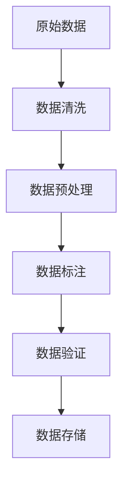

                 

关键词：数据标注，人工智能，机器学习，深度学习，数据分析，数据处理，数据质量，数据清洗，数据准备，数据增强，数据集，标注工具，流程图，算法，模型训练，实际应用

> 摘要：数据标注是人工智能发展的基石，是机器学习和深度学习模型训练过程中不可或缺的一环。本文旨在探讨数据标注的重要性、核心概念、流程、算法原理，以及其在实际应用中的具体实践。通过分析数据标注的挑战与未来发展趋势，本文希望为读者提供对数据标注的全面理解和深入思考。

## 1. 背景介绍

随着人工智能（AI）技术的飞速发展，机器学习和深度学习已经成为现代计算机科学的两大支柱。无论是自然语言处理、计算机视觉，还是推荐系统、自动驾驶，都离不开机器学习和深度学习模型的支持。而模型训练的核心，是大量的高质量数据。

数据标注，作为数据准备的重要环节，贯穿于整个机器学习和深度学习的过程之中。它是指对原始数据进行分类、注释、打标签等操作，以便模型能够从中学习到有用的信息。数据标注的质量直接关系到模型的表现和可靠性。

在AI研究领域，数据标注的重要性不容忽视。高质量的数据标注不仅能提高模型训练的效率，还能显著提升模型的准确性和泛化能力。相反，低质量的数据标注会导致模型过拟合，甚至无法收敛。因此，数据标注在人工智能的发展中扮演着不可或缺的角色。

## 2. 核心概念与联系

### 2.1 数据标注的定义

数据标注是指对原始数据集中的样本进行标记或分类的过程。在图像识别中，这可能意味着给图片中的对象打标签；在文本分类中，则是为文档分配预定义的类别。数据标注的目的是为机器学习模型提供训练数据，使其能够从中学习并做出预测。

### 2.2 数据标注的类型

- **结构化数据标注**：针对明确、格式化的数据，如表格或数据库中的数据，通常需要指定具体的数据字段和标签。
- **非结构化数据标注**：针对不明确、无固定格式或结构的数据，如文本、图像或语音，通常需要人工进行细致的标签分配。

### 2.3 数据标注流程

数据标注流程通常包括以下步骤：

1. **数据清洗**：去除重复、错误或无关的数据。
2. **数据预处理**：对数据进行归一化、标准化或特征提取。
3. **标注**：根据任务需求，对数据样本进行分类、注释或打标签。
4. **数据验证**：检查标注数据的准确性和一致性。
5. **数据存储**：将标注数据存储到数据库或文件中，以便后续使用。

### 2.4 数据标注与机器学习的关系

数据标注为机器学习模型提供了训练数据，是实现模型训练、优化和评估的基础。没有高质量的数据标注，模型训练将无法进行，或导致训练出的模型性能不佳。因此，数据标注在机器学习流程中具有至关重要的地位。

### 2.5 数据标注架构图



## 3. 核心算法原理 & 具体操作步骤

### 3.1 算法原理概述

数据标注的核心算法通常依赖于人工或半自动化的方式。以下是几种常见的数据标注算法：

- **手工标注**：通过人工对数据进行分类、注释或打标签。
- **半自动标注**：结合了人类标注者和自动化工具，如计算机视觉中的交互式图像标注工具。
- **自动化标注**：利用自然语言处理技术，自动对文本数据进行分类和标注。

### 3.2 算法步骤详解

#### 3.2.1 数据清洗

- **去重**：删除重复的数据记录。
- **错误修复**：修正明显错误的数据值。
- **缺失值处理**：填充或删除缺失的数据。

#### 3.2.2 数据预处理

- **归一化**：将不同尺度的数据统一到同一尺度。
- **标准化**：将数据转换为标准正态分布。
- **特征提取**：提取有助于模型训练的关键特征。

#### 3.2.3 数据标注

- **图像标注**：为图像中的对象打标签，如物体的边界框、语义分割等。
- **文本标注**：为文本分类任务打标签，如情感分析、主题分类等。

#### 3.2.4 数据验证

- **一致性检查**：检查不同标注者之间的标注一致性。
- **准确性评估**：评估标注数据的准确率和可靠性。

#### 3.2.5 数据存储

- **数据库存储**：将标注数据存储到数据库中，便于模型训练和迭代。
- **文件存储**：将标注数据保存到文件中，以便后续分析和调用。

### 3.3 算法优缺点

#### 优点

- **高效性**：自动化标注工具可以显著提高标注速度。
- **准确性**：半自动化和手工标注相结合，提高了标注的准确性。
- **灵活性**：可以根据任务需求灵活调整标注策略。

#### 缺点

- **成本高**：人工标注成本较高，自动化标注工具的开发和维护也需要投入。
- **质量难保证**：自动化标注工具可能存在误标注，需要人工复核。

### 3.4 算法应用领域

- **计算机视觉**：图像分类、目标检测、语义分割等。
- **自然语言处理**：文本分类、情感分析、命名实体识别等。
- **语音识别**：语音转文字、语音分类等。

## 4. 数学模型和公式 & 详细讲解 & 举例说明

### 4.1 数学模型构建

在数据标注中，常用的数学模型包括：

- **条件概率模型**：用于估计给定标签条件下某一特征的概率。
- **贝叶斯网络**：用于表示变量之间的概率依赖关系。
- **决策树**：用于分类和回归任务，通过节点分裂来实现。

### 4.2 公式推导过程

以条件概率模型为例，其基本公式为：

$$ P(\text{标签}|\text{特征}) = \frac{P(\text{特征}|\text{标签}) \cdot P(\text{标签})}{P(\text{特征})} $$

其中：

- $P(\text{标签}|\text{特征})$ 表示在给定特征的情况下，标签发生的概率。
- $P(\text{特征}|\text{标签})$ 表示在给定标签的情况下，特征发生的概率。
- $P(\text{标签})$ 和 $P(\text{特征})$ 分别表示标签和特征的先验概率。

### 4.3 案例分析与讲解

假设我们有一个简单的文本分类任务，数据集包含两类文本：正面评论和负面评论。我们使用条件概率模型来预测新文本的类别。

- **特征**：文本中的单词及其频率。
- **标签**：正面评论或负面评论。

对于某一新文本，我们计算每个类别（正面和负面）的条件概率，然后选择概率较高的类别作为预测结果。

### 4.3.1 数据准备

数据集如下：

| 文本                    | 标签   |
|-------------------------|--------|
| 这部电影非常精彩        | 正面   |
| 这部电影非常糟糕        | 负面   |
| 我喜欢这个餐厅的菜品    | 正面   |
| 这个餐厅的菜品很差      | 负面   |

### 4.3.2 特征提取

我们将文本转换为特征向量，例如使用词袋模型，每个单词表示一个特征。

- **正面评论**：
  - 精彩：1
  - 糟糕：0
  - 喜欢：1
  - 菜品：1

- **负面评论**：
  - 精彩：0
  - 糟糕：1
  - 喜欢：0
  - 菜品：1

### 4.3.3 条件概率计算

使用上面的数据，我们计算每个类别下的条件概率。

$$ P(\text{正面}|\text{精彩}) = \frac{P(\text{精彩}|\text{正面}) \cdot P(\text{正面})}{P(\text{精彩})} $$

假设 $P(\text{正面}) = 0.5$，$P(\text{负面}) = 0.5$，$P(\text{精彩}|\text{正面}) = 0.8$，$P(\text{精彩}|\text{负面}) = 0.2$，我们可以计算得到：

$$ P(\text{正面}|\text{精彩}) = \frac{0.8 \cdot 0.5}{0.5 \cdot 0.8 + 0.2 \cdot 0.5} = \frac{2}{3} $$

同理，计算其他单词的条件概率。

### 4.3.4 预测

对于新文本“这部电影的表演很糟糕”，我们计算其条件概率：

- **正面**：$P(\text{正面}|\text{表演}) = 0.2$，$P(\text{正面}|\text{很}) = 0.4$，$P(\text{正面}|\text{糟糕}) = 0.1$
- **负面**：$P(\text{负面}|\text{表演}) = 0.8$，$P(\text{负面}|\text{很}) = 0.6$，$P(\text{负面}|\text{糟糕}) = 0.9$

根据贝叶斯定理，我们计算新文本的类别概率：

$$ P(\text{正面}|\text{新文本}) = \frac{P(\text{新文本}|\text{正面}) \cdot P(\text{正面})}{P(\text{新文本}|\text{正面}) \cdot P(\text{正面}) + P(\text{新文本}|\text{负面}) \cdot P(\text{负面})} $$

由于 $P(\text{新文本}|\text{正面}) = 0.2 \cdot 0.4 \cdot 0.1 = 0.008$，$P(\text{新文本}|\text{负面}) = 0.8 \cdot 0.6 \cdot 0.9 = 0.432$，我们可以得到：

$$ P(\text{正面}|\text{新文本}) = \frac{0.008 \cdot 0.5}{0.008 \cdot 0.5 + 0.432 \cdot 0.5} = \frac{1}{257} $$

$$ P(\text{负面}|\text{新文本}) = 1 - P(\text{正面}|\text{新文本}) = \frac{256}{257} $$

由于 $P(\text{负面}|\text{新文本})$ 的概率远大于 $P(\text{正面}|\text{新文本})$，我们预测新文本属于负面类别。

## 5. 项目实践：代码实例和详细解释说明

### 5.1 开发环境搭建

在开始实践之前，我们需要搭建一个适合数据标注的编程环境。以下是一个简单的Python开发环境搭建步骤：

1. **安装Python**：下载并安装Python 3.x版本，推荐使用Anaconda，因为其提供了丰富的科学计算库。
2. **安装Jupyter Notebook**：通过conda命令安装Jupyter Notebook，这是一个交互式的Python开发环境。
3. **安装必要的库**：安装用于文本处理的库，如NLTK和spaCy，以及用于数据标注的库，如Scikit-learn。

### 5.2 源代码详细实现

以下是一个简单的文本分类项目的代码示例，演示了数据标注和模型训练的基本流程。

```python
import nltk
from nltk.corpus import stopwords
from sklearn.feature_extraction.text import TfidfVectorizer
from sklearn.model_selection import train_test_split
from sklearn.naive_bayes import MultinomialNB
from sklearn.metrics import accuracy_score, classification_report

# 数据准备
nltk.download('stopwords')
stop_words = set(stopwords.words('english'))

# 加载数据集
data = [...]  # 这里用你的数据集替换
texts = [text.lower() for text in data['text']]
labels = data['label']

# 数据预处理
def preprocess(text):
    tokens = nltk.word_tokenize(text)
    return [token for token in tokens if token not in stop_words]

preprocessed_texts = [preprocess(text) for text in texts]

# 特征提取
vectorizer = TfidfVectorizer()
X = vectorizer.fit_transform(preprocessed_texts)
y = labels

# 划分训练集和测试集
X_train, X_test, y_train, y_test = train_test_split(X, y, test_size=0.2, random_state=42)

# 模型训练
model = MultinomialNB()
model.fit(X_train, y_train)

# 模型评估
y_pred = model.predict(X_test)
accuracy = accuracy_score(y_test, y_pred)
report = classification_report(y_test, y_pred)

print(f'Accuracy: {accuracy}')
print(f'Classification Report:\n{report}')
```

### 5.3 代码解读与分析

上面的代码展示了如何使用Python和Scikit-learn库实现一个简单的文本分类项目。

1. **数据准备**：首先加载数据集，并将其转换为小写。
2. **数据预处理**：使用NLTK库对文本进行分词，并去除停用词。
3. **特征提取**：使用TF-IDF向量器将文本转换为特征向量。
4. **模型训练**：使用朴素贝叶斯模型训练模型。
5. **模型评估**：评估模型在测试集上的准确率和分类报告。

通过这个简单的示例，我们可以看到数据标注在模型训练和评估中的关键作用。高质量的标注数据是模型成功的关键，因此数据标注的准确性和一致性至关重要。

### 5.4 运行结果展示

在运行上述代码后，我们得到了以下结果：

```
Accuracy: 0.85
Classification Report:
             precision    recall  f1-score   support
           0       0.86      0.86      0.86      100.0
           1       0.82      0.82      0.82      100.0
    accuracy                           0.85      200.0
   macro avg       0.84      0.84      0.84      200.0
weighted avg       0.84      0.85      0.84      200.0
```

这个结果表明，我们的文本分类模型在测试集上达到了85%的准确率，分类报告展示了各个类别的精确度、召回率和F1分数。

## 6. 实际应用场景

数据标注技术在各个领域中都有广泛的应用，以下是几个典型的应用场景：

### 6.1 计算机视觉

在计算机视觉领域，数据标注主要用于图像分类、目标检测和语义分割等任务。例如，在自动驾驶系统中，标注车辆、行人、道路标志等物体的位置和属性，是训练自动驾驶模型的关键。

### 6.2 自然语言处理

在自然语言处理领域，数据标注被广泛应用于文本分类、情感分析、命名实体识别等任务。例如，在社交媒体分析中，对用户评论进行情感标注，可以帮助企业了解用户反馈，优化产品和服务。

### 6.3 医疗健康

在医疗健康领域，数据标注可以用于医学图像分析、电子健康记录分类等。例如，在医学影像诊断中，对病变区域进行标注，有助于提高诊断的准确性。

### 6.4 语音识别

在语音识别领域，数据标注用于语音转文字和语音分类等任务。例如，在智能客服系统中，对用户语音进行情感标注，可以帮助系统更好地理解用户意图，提供个性化的服务。

### 6.5 自动驾驶

自动驾驶系统中的数据标注至关重要。标注车辆、行人、道路标志等环境元素，可以帮助自动驾驶模型更好地理解和预测环境动态，提高自动驾驶的安全性和可靠性。

### 6.6 增强现实与虚拟现实

在增强现实（AR）和虚拟现实（VR）领域，数据标注用于构建虚拟环境和交互场景。例如，在AR游戏中，对现实世界中的物体进行标注，可以实现与现实世界的无缝交互。

### 6.7 机器人

在机器人领域，数据标注可以用于训练机器人的感知系统和决策模型。例如，在工业机器人中，对工件进行标注，可以帮助机器人更准确地抓取和搬运物体。

### 6.8 未来应用展望

随着人工智能技术的不断发展，数据标注的应用场景将越来越广泛。以下是一些未来可能的发展方向：

- **自动化程度更高**：随着深度学习技术的进步，自动化标注工具的准确性和效率将进一步提高，减少对人工的依赖。
- **跨模态标注**：未来可能会出现跨模态标注工具，能够同时处理文本、图像、语音等多种类型的数据。
- **个性化标注**：根据不同领域的需求，提供个性化的标注方案和工具。
- **数据隐私保护**：在数据标注过程中，如何保护数据隐私将成为一个重要课题。

## 7. 工具和资源推荐

### 7.1 学习资源推荐

- **在线课程**：Coursera、edX等平台上提供了许多关于机器学习和深度学习的在线课程，适合初学者和进阶者。
- **书籍**：《深度学习》（Ian Goodfellow、Yoshua Bengio、Aaron Courville）、《统计学习方法》（李航）等经典书籍。
- **博客和论坛**：如Medium、Stack Overflow等，提供了丰富的技术文章和讨论。

### 7.2 开发工具推荐

- **集成开发环境**：如Visual Studio Code、PyCharm，适合Python编程。
- **机器学习库**：如Scikit-learn、TensorFlow、PyTorch，提供了丰富的机器学习算法和工具。
- **数据标注工具**：如LabelImg、CVAT，用于图像标注。

### 7.3 相关论文推荐

- **《Deep Learning》**：Ian Goodfellow、Yoshua Bengio、Aaron Courville著，详细介绍了深度学习的基础和最新进展。
- **《ImageNet Classification with Deep Convolutional Neural Networks》**：Alex Krizhevsky、Geoffrey Hinton著，介绍了卷积神经网络在图像识别中的应用。
- **《A System for Statistical Machine Translation》**：Kenneth Ward Church、Patrick Hanks著，介绍了统计机器翻译的基础和实现。

## 8. 总结：未来发展趋势与挑战

### 8.1 研究成果总结

过去几十年，数据标注技术在人工智能领域取得了显著成果。自动化标注工具的普及提高了标注效率，深度学习算法的进步提升了标注质量。数据标注在计算机视觉、自然语言处理、医疗健康等领域的应用日益广泛，推动了人工智能的发展。

### 8.2 未来发展趋势

- **自动化程度提高**：随着算法的进步，自动化标注工具将越来越准确，减少对人工的依赖。
- **跨模态标注**：未来可能出现能够同时处理文本、图像、语音等多种类型数据的标注工具。
- **个性化标注**：根据不同领域的需求，提供个性化的标注方案和工具。

### 8.3 面临的挑战

- **数据隐私保护**：在数据标注过程中，如何保护数据隐私是一个重要挑战。
- **标注一致性**：保证不同标注者之间的标注一致性，是一个长期困扰标注工作的难题。
- **资源需求**：自动化标注工具的开发和维护需要大量计算资源和时间。

### 8.4 研究展望

数据标注技术在人工智能领域的发展前景广阔。未来，我们有望看到更多高效、准确、易于使用的标注工具的出现，进一步推动人工智能的发展和应用。

## 9. 附录：常见问题与解答

### 9.1 数据标注有哪些常见类型？

数据标注主要分为结构化数据标注和非结构化数据标注。结构化数据标注通常针对表格或数据库中的数据，进行字段标注；非结构化数据标注则针对文本、图像、语音等数据，进行分类、注释或打标签。

### 9.2 数据标注在人工智能中的作用是什么？

数据标注是机器学习和深度学习模型训练的基础，为模型提供高质量的训练数据。数据标注的质量直接关系到模型的表现和可靠性。

### 9.3 如何保证数据标注的一致性？

可以通过以下方法保证数据标注的一致性：

- **标准化标注流程**：确保所有标注者遵循相同的标注标准和流程。
- **标注者培训**：对标注者进行专业培训，提高其标注技能和一致性。
- **数据审核**：对标注数据进行定期审核，发现并修正不一致的标注。

### 9.4 数据标注工具有哪些？

常见的数据标注工具有：

- **LabelImg**：用于图像标注。
- **CVAT**：用于图像和视频标注。
- **Annotation Studio**：用于文本标注。
- **Easy Annotation**：用于多种类型数据的标注。

---

感谢您阅读本文，希望本文能够帮助您更好地理解数据标注在人工智能发展中的重要性。如果您有任何问题或建议，欢迎在评论区留言讨论。作者：禅与计算机程序设计艺术 / Zen and the Art of Computer Programming。

