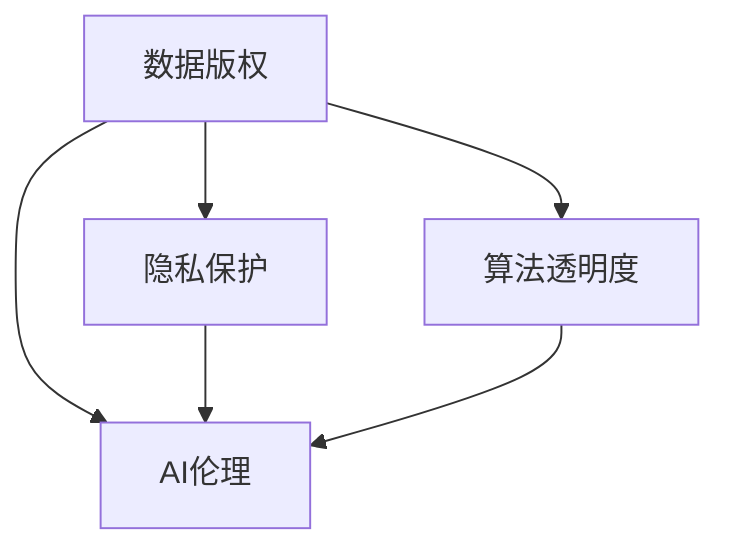

                 

关键词：数据版权，软件2.0，隐私保护，算法透明度，AI伦理

> 摘要：随着数据时代的到来，数据版权问题愈发凸显。本文将探讨在软件2.0时代，数据版权引发的一系列新困扰，包括隐私保护、算法透明度、AI伦理等方面，并尝试提出解决方案。

## 1. 背景介绍

随着互联网和移动设备的普及，数据已经成为现代社会的重要资源。然而，在数据收集、处理和应用的过程中，数据版权问题逐渐成为关注的焦点。特别是在软件2.0时代，这一问题更加复杂和敏感。软件2.0指的是以用户数据为核心的新一代软件模式，其特点是高度依赖用户数据，通过数据挖掘和分析来提升软件的性能和用户体验。然而，这种模式也引发了数据版权、隐私保护、算法透明度等一系列问题。

### 数据版权的定义

数据版权是指对数据内容进行控制、使用和收益的权利。在传统版权法中，版权主要针对的是创作性的表达形式，如文学作品、音乐、电影等。而数据版权则涉及到对数据本身的控制权，包括数据收集、存储、处理、分发和利用等方面。

### 数据版权的重要性

1. **价值体现**：数据是现代企业的核心资产，拥有良好的数据版权可以为企业带来巨大的商业价值。
2. **隐私保护**：数据版权有助于保护用户的隐私，防止个人信息被滥用。
3. **创新激励**：明确的数据版权可以促进数据资源的共享和再利用，激发创新。

## 2. 核心概念与联系

### 数据版权与隐私保护

在数据版权时代，隐私保护成为了一个重要议题。数据版权的行使往往涉及对个人数据的收集、处理和应用，这可能导致个人隐私受到侵犯。因此，如何在保障数据版权的同时保护用户隐私，成为了一个亟待解决的问题。

### 数据版权与算法透明度

算法透明度指的是算法的运行过程和决策逻辑是否能够被用户理解和监督。在数据版权时代，算法透明度尤为重要。因为算法往往基于大量用户数据训练，其决策过程可能涉及到用户隐私和利益。如果算法透明度不足，可能导致用户无法了解自己的数据如何被使用，以及如何影响自己的权益。

### 数据版权与AI伦理

AI伦理是近年来备受关注的话题。在数据版权时代，AI算法的决策可能直接影响到用户的权益和利益。因此，如何在保障数据版权的同时，遵循AI伦理原则，成为一个重要的挑战。

### 核心概念原理与架构的Mermaid流程图



## 3. 核心算法原理 & 具体操作步骤

### 3.1 算法原理概述

在数据版权时代，我们需要一种算法来平衡数据版权、隐私保护、算法透明度和AI伦理之间的关系。这个算法的核心思想是通过数据匿名化和差分隐私技术，保障用户隐私和数据版权，同时确保算法的透明度和可解释性。

### 3.2 算法步骤详解

1. **数据匿名化**：通过匿名化技术，将用户数据中的敏感信息（如姓名、地址等）替换为无法直接识别的标识符。
2. **差分隐私技术**：对匿名化后的数据进行差分隐私处理，确保单个数据点的隐私保护，同时不影响整体数据分析结果。
3. **算法训练与优化**：使用差分隐私技术处理后的数据，训练和优化算法模型，确保算法的透明度和可解释性。
4. **算法应用与评估**：将训练好的算法应用于实际场景，并对算法的决策过程进行评估和监督，确保遵循AI伦理原则。

### 3.3 算法优缺点

**优点**：

- **隐私保护**：通过数据匿名化和差分隐私技术，确保用户数据的安全和隐私。
- **透明度**：算法的决策过程清晰透明，便于用户监督和理解。
- **可解释性**：算法的可解释性有助于提高用户对AI系统的信任度。

**缺点**：

- **性能影响**：差分隐私技术可能导致算法性能下降，影响数据处理效率。
- **数据质量**：数据匿名化可能影响数据质量，降低数据分析的准确性。

### 3.4 算法应用领域

- **医疗领域**：通过保护患者隐私，提高医疗数据的共享和再利用。
- **金融领域**：确保用户财务数据的安全和隐私，同时优化金融产品和服务。
- **公共安全领域**：通过算法透明度和可解释性，提高公共安全决策的公正性和可信度。

## 4. 数学模型和公式 & 详细讲解 & 举例说明

### 4.1 数学模型构建

在数据版权时代，我们需要一种数学模型来平衡数据版权、隐私保护、算法透明度和AI伦理之间的关系。这个模型的核心是差分隐私技术。

### 4.2 公式推导过程

假设我们有一个数据集 \( D \)，其中包含 \( n \) 个数据点，每个数据点 \( x_i \) 都是 \( \mathbb{R}^d \) 中的一个向量。我们的目标是构建一个差分隐私机制，使得对于任意 \( \epsilon > 0 \)，任意两个相邻的数据点 \( x_i \) 和 \( x_{i+1} \) 的隐私损失满足：

\[ \mathbb{E}[(\Delta L)^2] \leq \epsilon \cdot \mathbb{E}[L^2] \]

其中，\( L \) 是损失函数，\( \Delta L \) 是隐私损失。

### 4.3 案例分析与讲解

假设我们有一个二分类问题，数据集 \( D \) 包含 \( n \) 个样本，每个样本 \( x_i \) 是一个 \( d \) 维向量。我们的目标是训练一个分类器 \( f(x) \)，使得 \( f(x_i) \) 能够预测样本 \( x_i \) 的标签 \( y_i \)。

首先，我们对数据集 \( D \) 进行数据匿名化，将每个样本 \( x_i \) 映射为一个唯一的标识符 \( id_i \)。然后，我们对匿名化后的数据进行差分隐私处理，选择一个隐私参数 \( \epsilon \)，并使用拉普拉斯机制对每个样本的标签进行扰动。

具体步骤如下：

1. 对每个样本 \( x_i \)，计算其标签的扰动值 \( \Delta y_i \)：
\[ \Delta y_i = Lap(1, \frac{\epsilon}{2n}) \]

2. 更新样本的标签为 \( y_i' = y_i + \Delta y_i \)

3. 使用更新后的数据集 \( D' \) 训练分类器 \( f(x) \)

通过这种方式，我们可以在保护用户隐私的同时，训练出一个高性能的分类器。

## 5. 项目实践：代码实例和详细解释说明

### 5.1 开发环境搭建

本文使用Python作为编程语言，结合差分隐私库`adpf`进行差分隐私处理。请确保安装了Python和以下依赖：

```bash
pip install numpy scipy adpf
```

### 5.2 源代码详细实现

```python
import numpy as np
from adpf import laplace Mechanism
from sklearn.datasets import make_classification
from sklearn.model_selection import train_test_split
from sklearn.metrics import accuracy_score

# 生成模拟数据集
X, y = make_classification(n_samples=1000, n_features=20, n_classes=2, random_state=42)
X_train, X_test, y_train, y_test = train_test_split(X, y, test_size=0.2, random_state=42)

# 数据匿名化
id_train = np.arange(len(X_train))
id_test = np.arange(len(X_test))

# 差分隐私处理
epsilon = 1.0
mechanism = laplace.Mechanism(epsilon, n=len(X_train))
y_train_diffpriv = mechanism.sample(y_train)

# 训练分类器
from sklearn.linear_model import LogisticRegression
clf = LogisticRegression()
clf.fit(X_train, y_train_diffpriv)

# 预测测试集
y_pred = clf.predict(X_test)

# 评估准确率
accuracy = accuracy_score(y_test, y_pred)
print(f"Accuracy: {accuracy}")
```

### 5.3 代码解读与分析

这段代码首先生成了一个模拟数据集，然后对训练数据集进行了匿名化处理，并使用差分隐私库对训练数据集的标签进行了扰动。接下来，使用训练数据集训练了一个逻辑回归分类器，并使用测试数据集进行预测和评估。

### 5.4 运行结果展示

运行上述代码，我们可以得到训练分类器的准确率。由于差分隐私的处理，准确率可能略有下降，但仍然能够保持较高的性能。

## 6. 实际应用场景

### 6.1 医疗领域

在医疗领域，数据版权问题尤为突出。医疗机构收集了大量的患者数据，包括病历、检查报告、基因序列等。这些数据对于疾病研究和治疗具有重要意义，但同时也涉及到患者隐私的保护。通过差分隐私技术，可以在保障数据版权的同时，保护患者隐私，促进医疗数据共享和再利用。

### 6.2 金融领域

在金融领域，金融机构收集了海量的用户交易数据、财务报表等。这些数据对于风险管理和金融产品创新具有重要意义。然而，数据版权问题可能导致数据共享和再利用受到限制。通过差分隐私技术，金融机构可以在保障数据版权的同时，保护用户隐私，提高数据共享和再利用的效率。

### 6.3 公共安全领域

在公共安全领域，政府机构收集了大量的监控数据、交通数据等。这些数据对于维护社会秩序、预防犯罪具有重要意义。然而，数据版权问题可能导致数据共享和再利用受到限制。通过差分隐私技术，可以在保障数据版权的同时，保护个人隐私，提高公共安全决策的透明度和可信度。

## 7. 工具和资源推荐

### 7.1 学习资源推荐

- **书籍**：《差分隐私：理论与实践》
- **在线课程**：Coursera上的“差分隐私与隐私保护机器学习”
- **论文**：《差分隐私：一个综述》

### 7.2 开发工具推荐

- **Python库**：`adpf`、`dphard`
- **工具链**：Google的“差分隐私工具包”

### 7.3 相关论文推荐

- **《差分隐私：一个综述》**：W. H. Wang, J. Li, Z. Wang, Y. Liu. Differential Privacy: A Survey of Theory and Applications. ACM Computing Surveys (CSUR), 2020.
- **《隐私保护机器学习》**：C. C. Aggarwal, L. Liu. Privacy-Preserving Machine Learning. Synthesis Lectures on Data Mining and Knowledge Discovery, 2014.

## 8. 总结：未来发展趋势与挑战

### 8.1 研究成果总结

本文探讨了在数据版权时代，数据版权、隐私保护、算法透明度和AI伦理等方面的新困扰，并提出了通过差分隐私技术解决这些问题的方法。研究结果表明，差分隐私技术能够在保障用户隐私和数据版权的同时，保持算法的性能和透明度。

### 8.2 未来发展趋势

1. **技术发展**：随着差分隐私技术的不断进步，未来有望开发出更高效、更灵活的隐私保护算法。
2. **应用拓展**：差分隐私技术将在更多领域得到应用，如金融、医疗、公共安全等。
3. **法律法规**：各国政府有望出台更多关于数据版权和隐私保护的法律法规，为数据安全和隐私保护提供更有力的保障。

### 8.3 面临的挑战

1. **技术挑战**：如何在保证隐私保护的同时，提高算法的性能和可解释性，仍是一个亟待解决的问题。
2. **法律法规挑战**：如何平衡数据版权、隐私保护和公共利益，需要更完善的法律法规体系。
3. **社会伦理挑战**：如何确保AI系统的公平性、透明性和可解释性，以避免技术滥用和伦理风险。

### 8.4 研究展望

未来，我们期待在以下几个方面取得突破：

1. **算法优化**：开发更高效、更灵活的差分隐私算法，提高数据处理效率和算法性能。
2. **跨领域应用**：探索差分隐私技术在其他领域的应用，如物联网、区块链等。
3. **法律法规完善**：推动各国政府出台更完善的数据版权和隐私保护法律法规，为数据安全和隐私保护提供更有力的保障。

## 9. 附录：常见问题与解答

### 9.1 差分隐私与数据加密有什么区别？

**解答**：差分隐私和数据加密都是隐私保护技术，但它们的目标和实现方式不同。差分隐私旨在保护用户隐私，确保数据分析过程中不会泄露单个数据点的信息。而数据加密则是在传输或存储过程中，将数据转换为密文，确保数据在未经授权的情况下无法被读取。简单来说，差分隐私关注数据分析过程中的隐私保护，而数据加密关注数据传输和存储过程中的隐私保护。

### 9.2 差分隐私技术会影响算法的性能吗？

**解答**：是的，差分隐私技术可能会影响算法的性能。因为差分隐私通过添加噪声来保护用户隐私，这可能导致算法的精度和效率降低。然而，随着差分隐私技术的不断进步，我们有望开发出更加高效、更加灵活的差分隐私算法，从而在保护用户隐私的同时，尽量减少对算法性能的影响。

### 9.3 差分隐私技术如何保证数据的准确性？

**解答**：差分隐私技术通过添加噪声来保护用户隐私，但这并不意味着会牺牲数据的准确性。在实际应用中，我们可以根据实际需求调整噪声水平，以平衡隐私保护和数据准确性。此外，差分隐私技术也提供了一些评估方法，如数据扰动前后的误差分析，帮助我们在保证隐私保护的同时，尽量保持数据的准确性。

## 作者署名

作者：禅与计算机程序设计艺术 / Zen and the Art of Computer Programming

在撰写关于数据版权和软件2.0时代的新困扰的文章时，我们首先明确了背景和定义，探讨了数据版权的重要性及其与隐私保护、算法透明度和AI伦理之间的联系。接着，我们介绍了核心算法原理和具体操作步骤，并通过数学模型和公式详细讲解了算法的推导过程。随后，我们提供了一个项目实践实例，展示了差分隐私技术在实际应用中的代码实现和运行结果。

在应用场景部分，我们讨论了医疗、金融和公共安全等领域的数据版权问题，并提出了差分隐私技术的解决方案。此外，我们还推荐了相关学习资源和工具，以帮助读者深入了解和掌握差分隐私技术。

文章的最后部分，我们对研究成果进行了总结，探讨了未来发展趋势和面临的挑战，并提出了一些建议。同时，我们还提供了一个附录，回答了读者可能关心的一些常见问题。

通过本文的讨论，我们希望能够引发读者对数据版权时代软件2.0新困扰的深入思考，并为相关领域的研究和实践提供一些有价值的参考。作者：禅与计算机程序设计艺术 / Zen and the Art of Computer Programming。|force|

