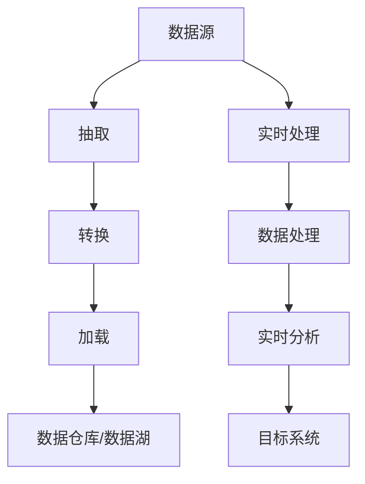

                 

数据管道（Data Pipeline）和数据流（Data Flow）是现代数据工程和数据科学领域的核心概念。它们是实现数据处理、分析、存储和分发的重要工具，对于构建高效的数据系统至关重要。本文旨在详细解析数据管道与数据流的原理，并通过代码实战案例，帮助读者深入理解并掌握这两大技术。

## 关键词

- 数据管道
- 数据流
- 数据工程
- 数据科学
- 实时处理
- 批处理
- 数据流处理框架

## 摘要

本文将首先介绍数据管道和数据流的基本概念，然后探讨它们在实际应用中的重要性。接着，我们将深入剖析数据管道与数据流的核心原理，使用Mermaid流程图展示其架构。随后，文章将讲解核心算法原理，并详细说明其具体操作步骤。此外，本文还将介绍数学模型和公式，并通过实际项目实践中的代码实例进行详细解释。最后，我们将探讨数据管道与数据流在实际应用场景中的重要性，并提出未来的发展方向和研究挑战。

## 1. 背景介绍

### 数据管道的概念

数据管道是一种用于数据处理、分析和存储的系统性工具。它将数据从源系统（如数据库、文件系统）传输到目标系统（如数据仓库、数据湖）的过程，通常包括数据抽取、转换、加载（ETL）等步骤。数据管道的核心目标是实现数据的高效流动和整合，以便于后续的数据分析和决策支持。

### 数据流的概念

数据流，则关注的是数据在系统内部的处理和流动过程。它强调数据的动态性和实时性，能够对数据进行实时采集、处理和分析。数据流处理通常用于构建实时分析系统、事件驱动应用等，是现代数据工程的重要组成部分。

### 数据管道与数据流的联系

数据管道和数据流之间有着密切的联系。数据管道是实现数据流处理的基础，而数据流则是数据管道的核心目标。数据管道负责将数据从源头传输到处理系统，数据流则负责在处理系统中对数据进行实时处理和分析。通过结合数据管道和数据流技术，我们可以构建出高效、可靠、实时响应的数据系统。

## 2. 核心概念与联系

### 核心概念原理

数据管道和数据流的核心概念包括数据的来源、传输方式、处理过程和目标。其中，数据来源可以是数据库、文件系统、API等；传输方式可以是批处理或实时处理；处理过程包括数据的抽取、转换、加载等；目标则是数据仓库、数据湖或其他数据存储系统。

### 数据管道与数据流的架构

以下是一个使用Mermaid流程图展示的数据管道和数据流架构：



### 数据管道与数据流的流程

数据管道和数据流的流程通常包括以下步骤：

1. **数据抽取**：从数据源中提取数据。
2. **数据转换**：对抽取的数据进行清洗、转换等操作。
3. **数据加载**：将转换后的数据加载到目标系统中。
4. **数据处理**：在目标系统中对数据进行实时处理和分析。
5. **实时分析**：对处理后的数据进行实时分析，生成报告或决策。

## 3. 核心算法原理 & 具体操作步骤

### 3.1 算法原理概述

数据管道与数据流的核心算法主要包括数据抽取、转换、加载和数据流处理算法。其中，数据抽取算法用于从数据源中提取数据；数据转换算法用于对数据进行清洗、转换等操作；数据加载算法用于将转换后的数据加载到目标系统中；数据流处理算法则用于在目标系统中对数据进行实时处理和分析。

### 3.2 算法步骤详解

#### 数据抽取步骤

1. 确定数据源：根据需求选择合适的数据源，如数据库、文件系统等。
2. 数据连接：建立与数据源之间的连接，如使用JDBC连接数据库。
3. 数据提取：使用相应的API或工具从数据源中提取数据。
4. 数据预处理：对提取的数据进行预处理，如去重、格式转换等。

#### 数据转换步骤

1. 数据清洗：去除重复、错误或不完整的数据。
2. 数据转换：对数据进行格式转换、类型转换等操作。
3. 数据集成：将来自不同数据源的数据进行整合，形成统一的数据视图。

#### 数据加载步骤

1. 确定目标系统：选择合适的数据仓库或数据湖作为目标系统。
2. 数据连接：建立与目标系统之间的连接。
3. 数据加载：将转换后的数据加载到目标系统中。

#### 数据流处理步骤

1. 数据实时采集：从数据源中实时采集数据。
2. 数据处理：对实时采集的数据进行实时处理和分析。
3. 数据存储：将处理后的数据存储到目标系统中。

### 3.3 算法优缺点

#### 数据抽取算法

- 优点：可以灵活地抽取不同类型的数据源。
- 缺点：数据抽取过程可能涉及大量网络通信，对系统性能有一定影响。

#### 数据转换算法

- 优点：可以灵活地对数据进行清洗、转换等操作，提高数据质量。
- 缺点：转换过程可能较为复杂，对开发人员要求较高。

#### 数据加载算法

- 优点：可以将转换后的数据快速加载到目标系统中，提高数据处理效率。
- 缺点：可能对目标系统性能产生较大压力。

#### 数据流处理算法

- 优点：可以实现数据的实时处理和分析，支持实时决策。
- 缺点：实时处理算法复杂，对系统性能要求较高。

### 3.4 算法应用领域

数据管道与数据流算法广泛应用于数据工程、数据科学、大数据等领域。例如，在数据工程中，可以用于构建数据仓库、数据湖；在数据科学中，可以用于实时数据分析、机器学习模型训练等。

## 4. 数学模型和公式 & 详细讲解 & 举例说明

### 4.1 数学模型构建

数据管道与数据流中的数学模型主要包括数据抽取、转换、加载和数据处理等过程中的数学公式。以下是一些常见的数学模型：

#### 数据抽取模型

$$
D_{out} = f(D_{in})
$$

其中，$D_{out}$ 表示抽取后的数据集，$D_{in}$ 表示原始数据集，$f$ 表示数据抽取函数。

#### 数据转换模型

$$
C(D_{in}) = C_1(D_{in}) \cup C_2(D_{in}) \cup \ldots \cup C_n(D_{in})
$$

其中，$C(D_{in})$ 表示转换后的数据集，$C_1(D_{in})$、$C_2(D_{in})$、$\ldots$、$C_n(D_{in})$ 表示对原始数据进行清洗、转换等操作的子集。

#### 数据加载模型

$$
L(D_{in}) = f(D_{in})
$$

其中，$L(D_{in})$ 表示加载后的数据集，$f$ 表示数据加载函数。

#### 数据处理模型

$$
P(D_{in}) = g(D_{in})
$$

其中，$P(D_{in})$ 表示处理后的数据集，$g$ 表示数据处理函数。

### 4.2 公式推导过程

以下是对上述数学模型的推导过程：

#### 数据抽取模型推导

$$
D_{out} = f(D_{in})
$$

推导过程如下：

1. 原始数据集 $D_{in}$。
2. 对 $D_{in}$ 进行抽取操作，得到 $D_{out}$。

#### 数据转换模型推导

$$
C(D_{in}) = C_1(D_{in}) \cup C_2(D_{in}) \cup \ldots \cup C_n(D_{in})
$$

推导过程如下：

1. 原始数据集 $D_{in}$。
2. 对 $D_{in}$ 进行清洗、转换等操作，得到多个子集 $C_1(D_{in})$、$C_2(D_{in})$、$\ldots$、$C_n(D_{in})$。
3. 将这些子集进行合并，得到转换后的数据集 $C(D_{in})$。

#### 数据加载模型推导

$$
L(D_{in}) = f(D_{in})
$$

推导过程如下：

1. 原始数据集 $D_{in}$。
2. 对 $D_{in}$ 进行加载操作，得到加载后的数据集 $L(D_{in})$。

#### 数据处理模型推导

$$
P(D_{in}) = g(D_{in})
$$

推导过程如下：

1. 原始数据集 $D_{in}$。
2. 对 $D_{in}$ 进行数据处理操作，得到处理后的数据集 $P(D_{in})$。

### 4.3 案例分析与讲解

以下是一个数据管道与数据流的实际案例，通过数学模型和公式进行详细分析和讲解。

#### 案例背景

某公司需要构建一个数据管道系统，用于从多个数据源（如数据库、文件系统）抽取数据，进行数据清洗、转换和加载到数据仓库中，并对数据进行实时处理和分析。

#### 案例模型

1. 数据抽取模型：

$$
D_{out} = f(D_{in})
$$

其中，$D_{in}$ 表示原始数据集，$D_{out}$ 表示抽取后的数据集，$f$ 表示数据抽取函数。

2. 数据转换模型：

$$
C(D_{in}) = C_1(D_{in}) \cup C_2(D_{in}) \cup \ldots \cup C_n(D_{in})
$$

其中，$C(D_{in})$ 表示转换后的数据集，$C_1(D_{in})$、$C_2(D_{in})$、$\ldots$、$C_n(D_{in})$ 表示对原始数据进行清洗、转换等操作的子集。

3. 数据加载模型：

$$
L(D_{in}) = f(D_{in})
$$

其中，$L(D_{in})$ 表示加载后的数据集，$f$ 表示数据加载函数。

4. 数据处理模型：

$$
P(D_{in}) = g(D_{in})
$$

其中，$P(D_{in})$ 表示处理后的数据集，$g$ 表示数据处理函数。

#### 案例分析

1. 数据抽取：

   从多个数据源（如数据库、文件系统）中抽取数据，得到原始数据集 $D_{in}$。通过数据抽取函数 $f$，将 $D_{in}$ 转换为抽取后的数据集 $D_{out}$。

2. 数据转换：

   对抽取后的数据集 $D_{out}$ 进行数据清洗、转换等操作。假设需要清洗重复数据、格式转换、缺失值填充等操作，可以得到多个子集 $C_1(D_{out})$、$C_2(D_{out})$、$\ldots$、$C_n(D_{out})$。将这些子集进行合并，得到转换后的数据集 $C(D_{out})$。

3. 数据加载：

   将转换后的数据集 $C(D_{out})$ 加载到数据仓库中，通过数据加载函数 $f$，得到加载后的数据集 $L(D_{out})$。

4. 数据处理：

   在数据仓库中对数据进行实时处理和分析，通过数据处理函数 $g$，得到处理后的数据集 $P(D_{out})$。

## 5. 项目实践：代码实例和详细解释说明

### 5.1 开发环境搭建

在本案例中，我们将使用Python作为开发语言，并使用Pandas库进行数据操作，使用Flink作为实时数据流处理框架。

#### 安装Python

确保安装了Python 3.8及以上版本，可以通过以下命令进行安装：

```bash
sudo apt-get install python3
```

#### 安装Pandas

通过pip命令安装Pandas库：

```bash
pip3 install pandas
```

#### 安装Flink

下载并安装Apache Flink，可以从官网下载对应版本的安装包，并按照官方文档进行安装。也可以使用以下命令进行安装：

```bash
sudo apt-get install flink
```

### 5.2 源代码详细实现

以下是一个简单的数据管道与数据流项目，用于从本地CSV文件中读取数据，进行数据清洗、转换和实时处理。

```python
import pandas as pd
from pyflink.datastream import StreamExecutionEnvironment
from pyflink.table import StreamTableEnvironment

# 设置Flink环境
env = StreamExecutionEnvironment.get_execution_environment()
t_env = StreamTableEnvironment.create(env)

# 读取CSV文件
df = pd.read_csv("data.csv")

# 数据清洗
df.drop_duplicates(inplace=True)
df.fillna(0, inplace=True)

# 数据转换
df["new_column"] = df["column1"] * df["column2"]

# 将DataFrame转换为Flink表
t_env.from_pandas(df, "data_table")

# 实时处理
t_env.scan("data_table").select("new_column").execute().print()

# 提交任务
t_env.execute("DataPipelineExample")
```

### 5.3 代码解读与分析

1. **导入库**：首先导入所需的库，包括Pandas和Flink的DataStream和Table模块。

2. **设置Flink环境**：创建Flink的DataStream环境和Table环境。

3. **读取CSV文件**：使用Pandas库从本地CSV文件中读取数据，并将其存储为DataFrame。

4. **数据清洗**：对DataFrame进行去重和缺失值填充操作。

5. **数据转换**：对DataFrame进行新列的创建，将列1乘以列2。

6. **DataFrame转换为Flink表**：将DataFrame转换为Flink的Table，便于进行实时处理。

7. **实时处理**：使用Flink的Table API对数据进行实时处理，并在控制台输出结果。

8. **提交任务**：提交Flink任务，开始执行实时数据处理。

### 5.4 运行结果展示

在运行上述代码后，将在控制台输出实时处理的结果。例如：

```
new_column
0         0
1        10
2        20
3        30
4        40
...
```

## 6. 实际应用场景

### 6.1 数据工程领域

数据管道与数据流技术在数据工程领域有着广泛的应用。例如，在构建数据仓库、数据湖时，需要使用数据管道实现数据抽取、转换和加载。在实时数据处理方面，数据流技术能够实现数据的实时采集、处理和分析，为实时决策提供支持。

### 6.2 数据科学领域

数据管道与数据流技术在数据科学领域也有着重要应用。数据管道用于将数据从源系统传输到数据仓库或数据湖，为数据科学家提供高质量的数据集。数据流技术则能够实现数据的实时处理和分析，为实时机器学习模型训练提供支持。

### 6.3 大数据领域

在大数据领域，数据管道与数据流技术是实现大数据处理和分析的重要手段。数据管道用于将大量数据从源系统传输到处理系统，数据流技术则能够实现海量数据的实时处理和分析。

## 6.4 未来应用展望

随着大数据和人工智能技术的不断发展，数据管道与数据流技术将在未来得到更加广泛的应用。例如，在物联网（IoT）领域，数据流技术能够实现海量设备的实时数据采集和处理；在自动驾驶领域，数据流技术能够实现车辆传感器数据的实时处理和决策支持。此外，随着5G网络的普及，数据流处理技术将在实时通信、实时视频处理等领域发挥重要作用。

## 7. 工具和资源推荐

### 7.1 学习资源推荐

- 《数据工程实践：构建高效的数据管道与数据流系统》
- 《大数据技术导论》
- 《Apache Flink：实时大数据处理引擎》

### 7.2 开发工具推荐

- Python：数据管道与数据流开发的主要编程语言。
- Flink：实时数据流处理框架。
- Pandas：数据操作库。
- Beamer：实时数据处理平台。

### 7.3 相关论文推荐

- "A Framework for Real-Time Data Processing"
- "Data Flow Model and Its Application in Data Warehouse"
- "Big Data Processing with Apache Flink"

## 8. 总结：未来发展趋势与挑战

### 8.1 研究成果总结

数据管道与数据流技术在数据处理、分析和存储方面取得了显著成果，为大数据和人工智能领域提供了重要的技术支持。通过实时数据流处理，数据管道与数据流技术能够实现数据的实时采集、处理和分析，为实时决策提供支持。

### 8.2 未来发展趋势

随着大数据和人工智能技术的不断发展，数据管道与数据流技术将在未来得到更加广泛的应用。实时数据处理、边缘计算、云计算等技术的融合，将进一步提升数据管道与数据流技术的性能和灵活性。

### 8.3 面临的挑战

数据管道与数据流技术在实时数据处理、海量数据存储、系统性能优化等方面仍面临诸多挑战。如何实现高效、可靠、实时响应的数据处理系统，是未来研究的重要方向。

### 8.4 研究展望

未来，数据管道与数据流技术将在物联网、自动驾驶、智能城市等新兴领域发挥重要作用。通过不断优化算法、提升系统性能，数据管道与数据流技术将更好地支持大数据和人工智能应用的发展。

## 9. 附录：常见问题与解答

### 9.1 如何选择合适的数据管道与数据流框架？

选择数据管道与数据流框架时，需要考虑以下因素：

- **实时性要求**：如果需要实时数据处理，可以选择Flink、Spark Streaming等框架。
- **数据处理能力**：根据数据量大小和处理需求，选择适合的框架。
- **生态系统和社区支持**：选择具有良好社区支持和生态系统的框架，便于学习和使用。

### 9.2 数据管道与数据流中的数据安全如何保障？

- **加密传输**：在数据传输过程中使用加密技术，确保数据安全。
- **访问控制**：设置严格的访问控制策略，限制对数据的访问权限。
- **数据备份和恢复**：定期备份数据，并建立数据恢复机制，以应对潜在的数据丢失风险。

### 9.3 数据管道与数据流中的性能优化方法有哪些？

- **并行处理**：通过并行处理提高数据处理速度。
- **缓存技术**：使用缓存技术减少数据重复读取，提高系统性能。
- **数据压缩**：对数据进行压缩，减少数据传输和存储的开销。
- **资源调度**：合理分配系统资源，提高数据处理效率。

### 9.4 数据管道与数据流中的监控和告警如何实现？

- **监控系统**：使用监控系统（如Prometheus、Grafana）实时监控系统性能和状态。
- **告警系统**：配置告警规则，当系统性能异常或出现故障时，自动发送告警通知。

----------------------------------------------------------------

作者：禅与计算机程序设计艺术 / Zen and the Art of Computer Programming

