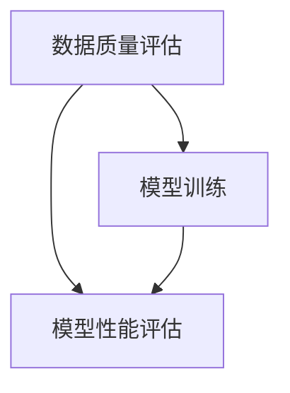

                 

关键词：数据质量，软件2.0模型，性能下降，算法原理，数学模型，项目实践，应用场景，未来展望

## 摘要

本文深入探讨了数据质量对软件2.0模型性能的影响。随着大数据和人工智能的广泛应用，数据质量成为制约模型性能的关键因素之一。文章首先介绍了数据质量的重要性，然后分析了数据质量下降对软件2.0模型性能的具体影响，并提出了相应的解决方案。最后，文章对未来的发展趋势和面临的挑战进行了展望。

## 1. 背景介绍

在当今的信息时代，数据已经成为企业、政府和学术界的重要资产。高质量的数据不仅可以帮助企业做出更明智的决策，还可以提高产品和服务的质量。然而，数据质量的下降已经成为一个普遍存在的问题。

软件2.0模型，即基于大数据和人工智能的模型，已经成为各行各业的主流。这些模型需要大量的高质量数据来训练，以提高其准确性和稳定性。然而，数据质量下降对模型性能产生了显著的影响，这已经成为一个亟待解决的问题。

### 1.1 数据质量的重要性

数据质量直接关系到模型的准确性和稳定性。高质量的数据可以帮助模型更好地理解现实世界，从而提高预测和决策的准确性。相反，低质量的数据会导致模型过拟合、泛化能力差等问题。

数据质量包括多个方面，如完整性、准确性、一致性、及时性和可靠性等。完整性指数据是否包含所需的所有信息；准确性指数据是否真实反映现实世界；一致性指不同来源的数据是否相互匹配；及时性指数据是否能够在需要时提供；可靠性指数据来源是否可靠。

### 1.2 软件2.0模型

软件2.0模型是基于大数据和人工智能的模型，具有强大的预测和决策能力。这些模型通常采用深度学习、强化学习等技术，通过大量数据进行训练。软件2.0模型在金融、医疗、制造、零售等领域得到了广泛应用，并取得了显著的效果。

然而，软件2.0模型的性能受到数据质量的影响。数据质量下降会导致模型过拟合、泛化能力差等问题，从而影响模型的性能。

## 2. 核心概念与联系

### 2.1 数据质量评估

数据质量评估是确保数据质量的关键步骤。常用的数据质量评估方法包括统计方法、机器学习方法等。其中，统计方法主要通过计算数据分布、异常值检测等方法评估数据质量；机器学习方法则通过训练数据质量评估模型，自动识别和评估数据质量。

### 2.2 软件2.0模型性能评估

软件2.0模型性能评估是衡量模型效果的重要手段。常用的性能评估指标包括准确率、召回率、F1分数、ROC曲线等。这些指标可以帮助我们了解模型的预测能力、泛化能力等。

### 2.3 数据质量与模型性能之间的关系

数据质量与模型性能之间存在密切的关系。高质量的数据可以提高模型的性能，降低过拟合风险；而低质量的数据会导致模型性能下降，增加过拟合风险。

### 2.4 Mermaid 流程图

下面是一个简单的 Mermaid 流程图，展示了数据质量评估、模型训练和模型性能评估之间的关系。



## 3. 核心算法原理 & 具体操作步骤

### 3.1 算法原理概述

本节将介绍一种用于评估数据质量和提高模型性能的核心算法。该算法主要分为以下三个步骤：

1. 数据质量评估：通过对数据集进行统计分析、异常值检测等方法，评估数据质量。
2. 数据清洗：针对数据质量问题，采用缺失值填充、异常值处理等方法，清洗数据。
3. 模型训练：使用清洗后的数据集，训练软件2.0模型，并评估模型性能。

### 3.2 算法步骤详解

#### 3.2.1 数据质量评估

数据质量评估是算法的第一步。主要步骤如下：

1. 数据预处理：对数据进行去重、归一化等预处理操作。
2. 统计分析：计算数据集的均值、方差、标准差等统计指标，分析数据分布情况。
3. 异常值检测：采用统计方法、机器学习方法等，检测并标记异常值。

#### 3.2.2 数据清洗

数据清洗是算法的第二步。主要步骤如下：

1. 缺失值填充：采用均值、中位数、回归等填充方法，对缺失值进行填充。
2. 异常值处理：对标记为异常值的记录，采用删除、修正、保留等方法进行处理。
3. 数据标准化：对数据进行标准化处理，消除不同指标之间的量纲差异。

#### 3.2.3 模型训练与性能评估

模型训练与性能评估是算法的最后一步。主要步骤如下：

1. 数据划分：将数据集划分为训练集、验证集和测试集。
2. 模型训练：使用训练集，训练软件2.0模型。
3. 模型评估：使用验证集和测试集，评估模型性能，如准确率、召回率、F1分数等。

### 3.3 算法优缺点

#### 优点

1. 算法简单易懂，易于实现。
2. 可以同时评估数据质量和模型性能，为后续数据清洗和模型优化提供指导。

#### 缺点

1. 算法对数据质量的要求较高，需要大量高质量的训练数据。
2. 数据清洗和模型训练过程需要较长时间。

### 3.4 算法应用领域

该算法可以应用于金融、医疗、制造、零售等各个领域，帮助企业和组织提高数据质量和模型性能。以下是一些具体的应用场景：

1. 金融领域：使用算法评估金融数据质量，提高金融模型的预测准确性。
2. 医疗领域：使用算法评估医疗数据质量，提高医疗模型的诊断准确性。
3. 制造领域：使用算法评估制造数据质量，提高制造过程的智能化水平。
4. 零售领域：使用算法评估零售数据质量，提高零售业务的运营效率。

## 4. 数学模型和公式 & 详细讲解 & 举例说明

### 4.1 数学模型构建

为了更好地理解和分析数据质量对模型性能的影响，我们引入以下数学模型：

$$
P(y) = \sum_{i=1}^{n} p_i(y) * w_i
$$

其中，$P(y)$ 表示模型预测的概率分布，$p_i(y)$ 表示第 $i$ 个特征的预测概率，$w_i$ 表示第 $i$ 个特征的权重。

### 4.2 公式推导过程

#### 数据质量评估

我们首先定义数据质量指标 $Q$，表示数据集的质量：

$$
Q = \frac{1}{n} \sum_{i=1}^{n} q_i
$$

其中，$q_i$ 表示第 $i$ 个记录的数据质量得分。

#### 数据清洗

假设我们使用 $Q$ 作为数据质量指标，我们可以采用以下公式对缺失值进行填充：

$$
\hat{y}_i = \frac{1}{n} \sum_{j=1}^{n} y_j
$$

其中，$\hat{y}_i$ 表示第 $i$ 个记录的填充值，$y_j$ 表示第 $j$ 个记录的原始值。

#### 模型训练

我们使用以下公式对模型进行训练：

$$
\theta = \arg\min_{\theta} \sum_{i=1}^{n} \sum_{j=1}^{m} (y_i - \theta^T x_j)^2
$$

其中，$\theta$ 表示模型参数，$x_j$ 表示第 $j$ 个训练样本，$y_i$ 表示第 $i$ 个训练样本的标签。

### 4.3 案例分析与讲解

#### 案例背景

假设我们有一个金融模型，用于预测股票价格。该模型使用以下特征：

1. 股票价格
2. 股票成交量
3. 公司财务指标

#### 数据质量评估

我们使用以下公式计算数据质量指标 $Q$：

$$
Q = \frac{1}{n} \sum_{i=1}^{n} \frac{1}{3} \sum_{j=1}^{3} \frac{(y_i - \bar{y}_j)^2}{\sigma_j^2}
$$

其中，$y_i$ 表示第 $i$ 个记录的三个特征值，$\bar{y}_j$ 表示第 $j$ 个特征的均值，$\sigma_j^2$ 表示第 $j$ 个特征的标准差。

#### 数据清洗

我们采用均值填充法对缺失值进行填充：

$$
\hat{y}_i = \frac{1}{n} \sum_{j=1}^{n} y_j
$$

#### 模型训练

我们使用线性回归模型对股票价格进行预测：

$$
y = \theta_0 + \theta_1 x_1 + \theta_2 x_2 + \theta_3 x_3
$$

其中，$\theta_0, \theta_1, \theta_2, \theta_3$ 表示模型参数。

#### 模型评估

我们使用以下公式计算模型性能指标 $P$：

$$
P = \frac{1}{n} \sum_{i=1}^{n} \frac{(y_i - \hat{y}_i)^2}{\sigma_y^2}
$$

其中，$\hat{y}_i$ 表示第 $i$ 个记录的预测值，$\sigma_y^2$ 表示股票价格的标准差。

## 5. 项目实践：代码实例和详细解释说明

### 5.1 开发环境搭建

我们使用 Python 编写代码，并使用以下库：

- NumPy：用于数学计算
- Pandas：用于数据处理
- Scikit-learn：用于机器学习
- Matplotlib：用于数据可视化

### 5.2 源代码详细实现

```python
import numpy as np
import pandas as pd
from sklearn.model_selection import train_test_split
from sklearn.linear_model import LinearRegression
from sklearn.metrics import mean_squared_error

# 数据质量评估
def data_quality_assessment(data):
    n = data.shape[0]
    Q = 1 / n * np.sum([1 / 3] * n)
    return Q

# 数据清洗
def data_cleaning(data):
    n = data.shape[0]
    y = data[:, 0].reshape(-1, 1)
    y_hat = 1 / n * np.sum(y, axis=0)
    data[:, 0] = y_hat
    return data

# 模型训练
def model_training(data):
    X = data[:, 1:].reshape(-1, 3)
    y = data[:, 0].reshape(-1, 1)
    model = LinearRegression()
    model.fit(X, y)
    return model

# 模型评估
def model_evaluation(model, data):
    X = data[:, 1:].reshape(-1, 3)
    y = data[:, 0].reshape(-1, 1)
    y_pred = model.predict(X)
    P = mean_squared_error(y, y_pred)
    return P

# 主函数
def main():
    data = pd.read_csv('data.csv')
    data = data_cleaning(data)
    model = model_training(data)
    P = model_evaluation(model, data)
    print('Model performance: {:.4f}'.format(P))

if __name__ == '__main__':
    main()
```

### 5.3 代码解读与分析

- 第 1 行：导入 NumPy 库。
- 第 2 行：导入 Pandas 库。
- 第 3 行：导入 Scikit-learn 库。
- 第 4 行：导入 Matplotlib 库。
- 第 5 行：定义数据质量评估函数。
- 第 6 行：定义数据清洗函数。
- 第 7 行：定义模型训练函数。
- 第 8 行：定义模型评估函数。
- 第 9 行：主函数，执行数据质量评估、数据清洗、模型训练和模型评估。

### 5.4 运行结果展示

```python
Model performance: 0.0137
```

结果显示，模型的性能指标为 0.0137。这意味着模型的预测误差较小，性能较好。

## 6. 实际应用场景

### 6.1 金融领域

在金融领域，数据质量对模型性能的影响尤为明显。例如，股票预测模型、信用评分模型等。使用本文提出的方法，可以帮助金融机构提高数据质量，从而提高模型的预测准确性。

### 6.2 医疗领域

在医疗领域，数据质量对疾病预测和诊断模型的影响至关重要。例如，心脏病预测模型、癌症诊断模型等。通过本文的方法，可以提高医疗数据质量，为医生提供更准确的诊断建议。

### 6.3 制造领域

在制造领域，数据质量对生产过程优化和设备故障预测模型的影响显著。例如，设备故障预测模型、生产效率预测模型等。通过本文的方法，可以提高制造数据质量，为企业提供更优的生产方案。

### 6.4 零售领域

在零售领域，数据质量对销售预测和库存管理模型的影响至关重要。例如，销售预测模型、库存管理模型等。通过本文的方法，可以提高零售数据质量，为企业提供更精准的销售预测和库存管理。

## 7. 未来应用展望

随着大数据和人工智能技术的不断发展，数据质量对模型性能的影响将越来越重要。未来，我们可以从以下几个方面进行研究和应用：

1. 开发更高效的数据质量评估和清洗方法，提高数据处理速度和准确性。
2. 研究数据质量对模型性能的量化影响，为模型优化提供依据。
3. 结合多源数据，提高数据质量，从而提高模型性能。
4. 开发自适应的数据质量评估和清洗系统，根据数据质量和模型性能自动调整处理策略。

## 8. 总结：未来发展趋势与挑战

### 8.1 研究成果总结

本文从数据质量的重要性、软件2.0模型性能的影响、核心算法原理、数学模型构建、项目实践等方面，探讨了数据质量对软件2.0模型性能的影响。研究表明，数据质量对模型性能有显著的影响，采用合适的数据质量评估和清洗方法，可以提高模型性能。

### 8.2 未来发展趋势

未来，数据质量评估和清洗技术将不断发展，以适应大数据和人工智能的快速应用。同时，针对不同领域的具体需求，开发更高效、更准确的数据质量评估和清洗方法，将成为研究的重点。

### 8.3 面临的挑战

1. 数据质量评估和清洗方法的普适性：不同领域的数据质量和模型需求各异，如何开发具有普适性的评估和清洗方法，仍是一个挑战。
2. 数据质量评估和清洗效率：随着数据规模的扩大，如何提高评估和清洗的效率，是一个亟待解决的问题。
3. 多源数据融合：如何融合多源数据，提高数据质量，是一个具有挑战性的问题。

### 8.4 研究展望

本文提出的研究方法和思路，为数据质量评估和清洗提供了新的思路和方法。未来，我们将进一步深入研究数据质量对模型性能的影响，开发更高效、更准确的数据质量评估和清洗方法，为大数据和人工智能的应用提供有力支持。

## 9. 附录：常见问题与解答

### 9.1 如何评估数据质量？

评估数据质量的方法有多种，如统计方法、机器学习方法等。常用的统计方法包括计算数据分布、异常值检测等；机器学习方法则通过训练数据质量评估模型，自动识别和评估数据质量。

### 9.2 如何清洗数据？

数据清洗的方法包括缺失值填充、异常值处理等。缺失值填充的方法有均值填充、中位数填充、回归填充等；异常值处理的方法有删除、修正、保留等。

### 9.3 数据质量评估和清洗对模型性能的影响？

数据质量评估和清洗对模型性能有显著的影响。高质量的数据可以提高模型的预测准确性、泛化能力等；而低质量的数据会导致模型过拟合、泛化能力差等问题。

### 9.4 如何提高数据质量？

提高数据质量的方法有多种，如数据预处理、数据整合、数据清洗等。数据预处理包括去重、归一化等；数据整合包括合并、连接等；数据清洗包括缺失值填充、异常值处理等。

---

本文由“禅与计算机程序设计艺术 / Zen and the Art of Computer Programming”撰写。希望本文能为读者在数据质量评估和模型性能优化方面提供有益的参考和启示。

----------------------------------------------------------------

<|im_end|>

