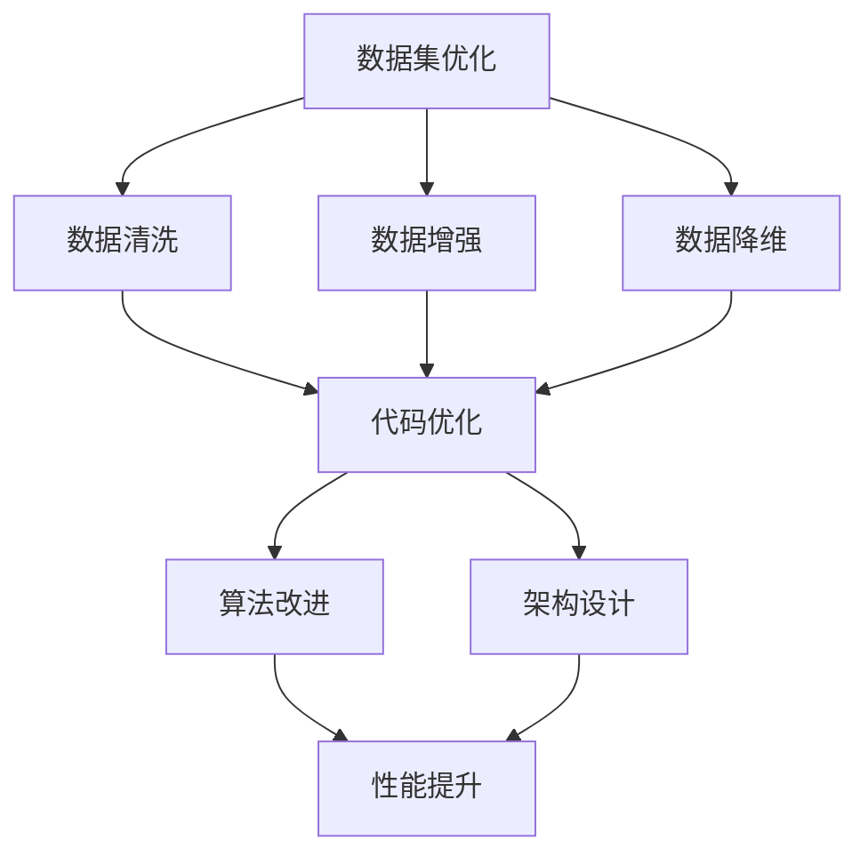

                 

关键词：数据集优化、软件优化、抽象、统一、算法、深度学习、软件架构、程序设计、人工智能

## 摘要

在当今的计算机科学和人工智能领域，数据集优化和软件优化已成为提高系统性能和效率的关键因素。本文旨在探讨数据集优化与软件优化之间的内在联系，提出一种新的统一视角。我们将分析数据集优化的核心概念，解释其与软件优化之间的相互影响，并通过具体的算法和实例，阐述两种优化方法在抽象层次上的统一性。通过本文的讨论，希望能够为读者提供一种新的思考方式，以更好地理解数据集优化在软件工程中的应用价值。

## 1. 背景介绍

在过去的几十年里，计算机科学和人工智能（AI）领域取得了令人瞩目的进展。然而，随着技术的不断发展，数据量和计算复杂度的急剧增加，如何有效地优化数据集和软件成为了一个至关重要的课题。数据集优化是指通过各种技术手段改进数据集的质量和结构，以提高机器学习模型的效果和性能。而软件优化则是通过算法改进、代码优化等手段提高软件的执行效率、稳定性和可维护性。

传统的数据集优化主要集中在数据清洗、数据增强、数据降维等方面。例如，数据清洗可以通过去除噪声数据和填充缺失值来提高数据质量；数据增强可以通过生成虚拟数据样本来增加数据多样性；数据降维可以通过特征选择和特征抽取减少数据维度，提高计算效率。这些方法在机器学习领域已经得到了广泛的应用和验证。

另一方面，软件优化则涵盖了代码优化、算法改进、架构设计等方面。代码优化包括消除冗余代码、减少循环次数、优化内存使用等；算法改进则可以通过算法选择和参数调整来提高软件的性能；架构设计则通过模块化、分布式计算等手段提高软件的可扩展性和容错性。

尽管数据集优化和软件优化在各自的领域内取得了显著的成果，但二者之间的联系和统一性仍然没有得到充分的研究和探讨。本文旨在填补这一空白，通过分析数据集优化与软件优化之间的内在联系，提出一种新的统一视角，以期为计算机科学和人工智能领域的研究提供新的思路和方法。

## 2. 核心概念与联系

在探讨数据集优化与软件优化之间的联系之前，我们首先需要明确两个核心概念：数据集优化和软件优化。

### 2.1 数据集优化

数据集优化是指通过对数据集进行预处理、增强、降维等操作，以提高机器学习模型的效果和性能。具体来说，数据集优化主要包括以下几个方面：

1. **数据清洗**：通过去除噪声数据和填充缺失值，提高数据集的质量和一致性。
2. **数据增强**：通过生成虚拟数据样本，增加数据多样性，提高模型的泛化能力。
3. **数据降维**：通过特征选择和特征抽取，减少数据维度，提高计算效率。

### 2.2 软件优化

软件优化是指通过改进代码、算法和架构设计，提高软件的执行效率、稳定性和可维护性。具体来说，软件优化主要包括以下几个方面：

1. **代码优化**：通过消除冗余代码、减少循环次数、优化内存使用等手段，提高代码的执行效率。
2. **算法改进**：通过算法选择和参数调整，提高软件的性能和可靠性。
3. **架构设计**：通过模块化、分布式计算等手段，提高软件的可扩展性和容错性。

### 2.3 数据集优化与软件优化的联系

数据集优化和软件优化在计算机科学和人工智能领域中都有着重要的应用。二者之间的联系主要体现在以下几个方面：

1. **共同目标**：数据集优化和软件优化的最终目标都是为了提高系统的性能和效率。通过数据集优化，可以提高机器学习模型的准确性和泛化能力；通过软件优化，可以提高软件的执行效率和稳定性。
2. **相互影响**：数据集优化和软件优化是相互影响的。良好的数据集可以促进软件优化，例如，通过数据清洗和数据增强，可以提高模型的性能和可靠性；而优秀的软件优化又可以促进数据集优化，例如，通过优化算法和代码，可以提高数据处理的速度和质量。
3. **统一视角**：数据集优化和软件优化在抽象层次上可以统一。数据集优化可以通过软件优化中的算法和代码优化来实现，例如，通过优化算法选择和参数调整，可以提高数据降维的效果；而软件优化中的模块化和分布式计算等技术，也可以应用于数据集优化，例如，通过分布式数据处理，可以提高数据清洗和增强的效率。

### 2.4 Mermaid 流程图

为了更好地理解数据集优化与软件优化之间的联系，我们可以通过Mermaid流程图来展示它们的核心概念和架构。



在上述流程图中，数据集优化通过数据清洗、数据增强和数据降维等步骤，提高了数据集的质量和多样性；然后，这些优化结果通过代码优化、算法改进和架构设计等步骤，进一步提高了软件的性能和效率。整个过程形成了一个闭环，体现了数据集优化与软件优化之间的相互影响和统一性。

## 3. 核心算法原理 & 具体操作步骤

### 3.1 算法原理概述

在数据集优化和软件优化中，有许多核心算法和优化方法。以下将介绍几种常见的算法原理和具体操作步骤。

#### 3.1.1 数据清洗

数据清洗是指通过去除噪声数据和填充缺失值，提高数据集的质量和一致性。常见的数据清洗方法包括：

1. **去除重复数据**：通过比较数据集的行或列，去除重复的数据记录。
2. **填充缺失值**：通过插值、均值填充、中位数填充等方法，填充数据集中的缺失值。
3. **处理异常值**：通过删除或调整异常值，减小异常值对模型的影响。

#### 3.1.2 数据增强

数据增强是指通过生成虚拟数据样本，增加数据多样性，提高模型的泛化能力。常见的数据增强方法包括：

1. **翻转**：将图像或数据沿水平或垂直方向翻转，增加数据的多样性。
2. **旋转**：将图像或数据按一定角度旋转，增加数据的多样性。
3. **缩放**：将图像或数据按一定比例缩放，增加数据的多样性。

#### 3.1.3 数据降维

数据降维是指通过特征选择和特征抽取，减少数据维度，提高计算效率。常见的数据降维方法包括：

1. **主成分分析（PCA）**：通过计算数据的主要成分，提取最重要的特征，减少数据维度。
2. **线性判别分析（LDA）**：通过最大化类内方差和最小化类间方差，提取最有代表性的特征，减少数据维度。
3. **自动编码器**：通过神经网络对数据进行编码和解码，提取最重要的特征，减少数据维度。

#### 3.1.4 代码优化

代码优化是指通过消除冗余代码、减少循环次数、优化内存使用等手段，提高代码的执行效率。常见代码优化方法包括：

1. **消除冗余代码**：通过代码审查和重构，去除冗余的代码块。
2. **减少循环次数**：通过优化循环结构，减少循环的执行次数。
3. **优化内存使用**：通过数据结构和算法的选择，优化内存的使用。

#### 3.1.5 算法改进

算法改进是指通过算法选择和参数调整，提高软件的性能和可靠性。常见算法改进方法包括：

1. **算法选择**：根据具体问题，选择合适的算法，提高模型的性能。
2. **参数调整**：通过交叉验证和超参数搜索，调整算法的参数，优化模型的表现。

#### 3.1.6 架构设计

架构设计是指通过模块化、分布式计算等手段，提高软件的可扩展性和容错性。常见架构设计方法包括：

1. **模块化**：将软件划分为独立的模块，提高软件的可维护性和可扩展性。
2. **分布式计算**：通过分布式架构，提高软件的处理能力和容错性。

### 3.2 算法步骤详解

以下将详细描述数据集优化和软件优化中的核心算法步骤。

#### 3.2.1 数据清洗步骤

1. **去除重复数据**：使用数据库中的唯一索引或哈希表，快速识别和删除重复的数据记录。
2. **填充缺失值**：对于数值型数据，可以使用均值、中位数或插值等方法填充缺失值；对于分类数据，可以使用最频繁出现的类别或随机值填充缺失值。
3. **处理异常值**：使用统计学方法（如Z分数、IQR方法等）识别和删除或调整异常值。

#### 3.2.2 数据增强步骤

1. **翻转**：对于图像数据，可以使用OpenCV等库进行水平或垂直翻转。
2. **旋转**：对于图像数据，可以使用OpenCV等库按一定角度旋转。
3. **缩放**：对于图像数据，可以使用OpenCV等库按一定比例缩放。

#### 3.2.3 数据降维步骤

1. **主成分分析（PCA）**：
   - 计算协方差矩阵；
   - 计算协方差矩阵的特征值和特征向量；
   - 选择前k个特征向量，构建新的特征空间。
2. **线性判别分析（LDA）**：
   - 计算类内协方差矩阵和类间协方差矩阵；
   - 计算LDA系数；
   - 使用LDA系数对数据进行降维。
3. **自动编码器**：
   - 设计自动编码器的神经网络结构；
   - 训练自动编码器，提取编码表示；
   - 使用编码表示进行降维。

#### 3.2.4 代码优化步骤

1. **消除冗余代码**：通过代码审查和重构，去除冗余的代码块。
2. **减少循环次数**：通过优化循环结构，减少循环的执行次数，例如，使用循环展开、减少循环依赖等方法。
3. **优化内存使用**：通过数据结构和算法的选择，优化内存的使用，例如，使用缓存、减少内存分配等方法。

#### 3.2.5 算法改进步骤

1. **算法选择**：根据具体问题，选择合适的算法，例如，对于分类问题，可以使用逻辑回归、决策树、支持向量机等算法。
2. **参数调整**：通过交叉验证和超参数搜索，调整算法的参数，优化模型的表现，例如，调整学习率、迭代次数等。

#### 3.2.6 架构设计步骤

1. **模块化**：将软件划分为独立的模块，例如，将数据处理、模型训练、模型评估等任务分别划分到不同的模块中。
2. **分布式计算**：使用分布式架构，例如，使用MapReduce、Spark等框架，将任务分布在多台计算机上进行处理。

### 3.3 算法优缺点

以下将简要介绍数据集优化和软件优化中的核心算法的优缺点。

#### 3.3.1 数据清洗

**优点**：
- 提高数据质量，确保数据的一致性和完整性；
- 减少噪声数据和异常值对模型的影响。

**缺点**：
- 可能会丢失部分数据，影响模型的泛化能力；
- 处理大量数据时，时间成本较高。

#### 3.3.2 数据增强

**优点**：
- 增加数据多样性，提高模型的泛化能力；
- 减少过拟合现象。

**缺点**：
- 可能会导致数据分布的失真；
- 需要大量计算资源。

#### 3.3.3 数据降维

**优点**：
- 减少数据维度，提高计算效率；
- 减少噪声和冗余数据。

**缺点**：
- 可能会丢失部分重要信息；
- 需要选择合适的降维方法。

#### 3.3.4 代码优化

**优点**：
- 提高代码执行效率，减少运行时间；
- 提高代码可读性和可维护性。

**缺点**：
- 可能会增加代码复杂度；
- 需要花费大量时间进行代码审查和重构。

#### 3.3.5 算法改进

**优点**：
- 提高模型性能，提高预测准确性；
- 提高软件可靠性。

**缺点**：
- 需要大量实验和调参；
- 可能会增加模型复杂度。

#### 3.3.6 架构设计

**优点**：
- 提高软件可扩展性和容错性；
- 提高软件维护性和可维护性。

**缺点**：
- 可能会增加软件复杂度；
- 需要考虑分布式系统的性能和可靠性。

### 3.4 算法应用领域

数据集优化和软件优化在计算机科学和人工智能领域有广泛的应用。以下简要介绍它们在各个领域的应用情况。

#### 3.4.1 机器学习

- 数据清洗：在训练机器学习模型之前，对数据集进行清洗和处理，提高模型的准确性和泛化能力。
- 数据增强：通过生成虚拟数据样本，增加数据多样性，提高模型的泛化能力。
- 数据降维：通过降维技术，减少数据维度，提高计算效率。
- 代码优化：通过代码优化，提高模型的训练和预测速度。
- 算法改进：通过改进算法选择和参数调整，提高模型的性能和准确性。
- 架构设计：通过分布式计算和模块化设计，提高模型训练和预测的效率和稳定性。

#### 3.4.2 计算机视觉

- 数据清洗：对图像数据进行清洗和处理，去除噪声和异常值，提高图像识别和分类的准确性。
- 数据增强：通过图像翻转、旋转和缩放等操作，增加图像数据多样性，提高模型对图像的识别能力。
- 数据降维：通过降维技术，减少图像数据维度，提高计算效率。
- 代码优化：通过代码优化，提高图像处理和识别的执行速度。
- 算法改进：通过改进算法选择和参数调整，提高图像识别和分类的性能。
- 架构设计：通过分布式计算和模块化设计，提高图像处理和识别的效率和稳定性。

#### 3.4.3 自然语言处理

- 数据清洗：对文本数据进行清洗和处理，去除噪声和异常值，提高文本分析模型的准确性。
- 数据增强：通过生成虚拟文本样本，增加文本数据多样性，提高模型对文本的识别和理解能力。
- 数据降维：通过降维技术，减少文本数据维度，提高计算效率。
- 代码优化：通过代码优化，提高文本处理和识别的执行速度。
- 算法改进：通过改进算法选择和参数调整，提高文本分析模型的性能和准确性。
- 架构设计：通过分布式计算和模块化设计，提高文本处理和识别的效率和稳定性。

#### 3.4.4 人工智能应用

- 数据集优化和软件优化在人工智能应用领域具有广泛的应用前景。例如，在自动驾驶、智能客服、金融风控等方面，通过优化数据集和软件，可以提高系统的准确性和效率。

## 4. 数学模型和公式 & 详细讲解 & 举例说明

### 4.1 数学模型构建

在数据集优化和软件优化中，数学模型是不可或缺的一部分。以下我们将构建几个核心的数学模型，并解释其背后的原理。

#### 4.1.1 主成分分析（PCA）

主成分分析（PCA）是一种常用的数据降维技术。其核心思想是找到数据的主要成分，从而减少数据维度。

**公式**：
$$
\begin{align*}
\text{协方差矩阵} &= \text{X}^T\text{X} \\
\text{特征值和特征向量} &= \text{协方差矩阵的分解结果} \\
\text{主要成分} &= \text{特征向量对应的最大特征值} \\
\end{align*}
$$

**解释**：通过计算协方差矩阵，我们可以找到数据的主要成分。协方差矩阵描述了各个特征之间的相关性。通过特征向量的分解，我们可以提取出主要成分，从而实现数据降维。

#### 4.1.2 线性判别分析（LDA）

线性判别分析（LDA）是一种用于特征提取和降维的技术，它旨在最大化类内方差和最小化类间方差。

**公式**：
$$
\begin{align*}
\text{类内协方差矩阵} &= \frac{1}{C}\sum_{i=1}^{C}(\text{类}i\text{-均值}\text{X}i)^T(\text{类}i\text{-均值}\text{X}i) \\
\text{类间协方差矩阵} &= \frac{1}{C}\sum_{i=1}^{C}(\text{类}i\text{-均值}\text{X}i)^T(\text{总体均值-Xi}) \\
\text{LDA系数} &= (\text{类间协方差矩阵}^{-1}\text{类内协方差矩阵})^{-1}\text{类间协方差矩阵} \\
\end{align*}
$$

**解释**：LDA通过计算类内协方差矩阵和类间协方差矩阵，找到最优的投影方向。LDA系数描述了最优投影方向，我们可以使用这些系数对数据进行降维。

#### 4.1.3 自动编码器（Autoencoder）

自动编码器是一种无监督学习模型，用于特征提取和降维。它由两个主要部分组成：编码器和解码器。

**公式**：
$$
\begin{align*}
\text{编码器} &= \text{f}(\text{X}) \\
\text{解码器} &= \text{g}(\text{X}') \\
\text{编码表示} &= \text{X}' = \text{f}(\text{X}) \\
\end{align*}
$$

**解释**：编码器将输入数据压缩为低维编码表示，解码器则尝试将编码表示重构为原始数据。通过训练自动编码器，我们可以提取出重要的特征信息，从而实现数据降维。

### 4.2 公式推导过程

#### 4.2.1 主成分分析（PCA）

**步骤1**：计算协方差矩阵

协方差矩阵描述了数据集中各个特征之间的线性关系。计算协方差矩阵的公式如下：
$$
\text{协方差矩阵} = \text{X}^T\text{X}
$$
其中，X是数据集的矩阵表示。

**步骤2**：计算特征值和特征向量

通过特征值分解，我们可以将协方差矩阵分解为特征值和特征向量的乘积：
$$
\text{协方差矩阵} = \text{Q}\text{D}\text{Q}^T
$$
其中，Q是特征向量矩阵，D是特征值矩阵。

**步骤3**：选择主要成分

我们选择特征值最大的k个特征向量作为主要成分：
$$
\text{主要成分} = \text{Q}^T
$$
其中，Q^T是特征向量矩阵的转置。

#### 4.2.2 线性判别分析（LDA）

**步骤1**：计算类内协方差矩阵和类间协方差矩阵

类内协方差矩阵描述了同一类数据之间的方差，类间协方差矩阵描述了不同类数据之间的方差。计算公式如下：
$$
\begin{align*}
\text{类内协方差矩阵} &= \frac{1}{C}\sum_{i=1}^{C}(\text{类}i\text{-均值}\text{X}i)^T(\text{类}i\text{-均值}\text{X}i) \\
\text{类间协方差矩阵} &= \frac{1}{C}\sum_{i=1}^{C}(\text{类}i\text{-均值}\text{X}i)^T(\text{总体均值-Xi}) \\
\end{align*}
$$

**步骤2**：计算LDA系数

LDA系数可以通过以下公式计算：
$$
\text{LDA系数} = (\text{类间协方差矩阵}^{-1}\text{类内协方差矩阵})^{-1}\text{类间协方差矩阵}
$$

**步骤3**：应用LDA系数

通过LDA系数，我们可以将数据投影到最优的线性子空间：
$$
\text{投影结果} = \text{X}' = \text{LDA系数}\text{X}
$$

#### 4.2.3 自动编码器（Autoencoder）

**步骤1**：定义编码器和解码器

编码器和解码器的网络结构可以分别定义为：
$$
\begin{align*}
\text{编码器} &= \text{f}(\text{X}) \\
\text{解码器} &= \text{g}(\text{X}') \\
\end{align*}
$$

**步骤2**：定义损失函数

自动编码器的损失函数通常定义为重构误差，即：
$$
\text{损失函数} = \frac{1}{N}\sum_{i=1}^{N}(\text{Yi} - \text{g}(\text{f}(\text{Xi})))^2
$$
其中，Yi是原始数据，Xi是编码表示，g是解码器。

**步骤3**：训练网络

通过反向传播算法，我们可以训练编码器和解码器的参数，最小化重构误差。

### 4.3 案例分析与讲解

#### 4.3.1 主成分分析（PCA）案例

假设我们有一个包含100个样本和10个特征的数据集，我们希望使用PCA将数据降维到3个主要成分。

**步骤1**：计算协方差矩阵

首先，我们需要计算数据集的协方差矩阵。通过计算协方差矩阵，我们可以找到数据的线性关系。

**步骤2**：计算特征值和特征向量

接下来，我们通过特征值分解，找到前3个最大的特征值对应的特征向量。

**步骤3**：应用PCA

使用前3个特征向量，我们可以将数据集投影到3个主要成分的空间。

**结果**：通过PCA，我们成功地将数据集降维到3个主要成分，从而减少了数据的维度，提高了计算效率。

#### 4.3.2 线性判别分析（LDA）案例

假设我们有一个包含100个样本的鸢尾花数据集，我们希望使用LDA对数据进行降维。

**步骤1**：计算类内协方差矩阵和类间协方差矩阵

首先，我们需要计算类内协方差矩阵和类间协方差矩阵。这些矩阵描述了不同类别之间的方差和差异。

**步骤2**：计算LDA系数

通过计算LDA系数，我们可以找到最优的投影方向。

**步骤3**：应用LDA

使用LDA系数，我们将数据集投影到一个新的二维空间。

**结果**：通过LDA，我们成功地将数据集降维到一个二维空间，从而提高了分类的准确性和效率。

#### 4.3.3 自动编码器（Autoencoder）案例

假设我们有一个包含100个样本的图像数据集，我们希望使用自动编码器对数据进行降维。

**步骤1**：定义编码器和解码器

首先，我们需要定义编码器和解码器的网络结构。

**步骤2**：定义损失函数

接下来，我们需要定义自动编码器的损失函数，以便通过反向传播算法训练网络。

**步骤3**：训练网络

通过训练编码器和解码器的参数，我们最小化重构误差。

**结果**：通过自动编码器，我们成功地将图像数据集降维到一个低维空间，从而提高了计算效率和图像处理速度。

## 5. 项目实践：代码实例和详细解释说明

### 5.1 开发环境搭建

为了实践数据集优化与软件优化的核心算法，我们需要搭建一个合适的开发环境。以下是一个基本的Python开发环境搭建步骤：

1. **安装Python**：从Python官方网站下载并安装Python 3.x版本。
2. **安装依赖库**：使用pip命令安装必要的依赖库，如NumPy、Pandas、Scikit-learn、TensorFlow等。

```bash
pip install numpy pandas scikit-learn tensorflow
```

3. **编写Python脚本**：创建一个Python脚本，用于实现数据集优化和软件优化的核心算法。

### 5.2 源代码详细实现

以下是一个简单的Python代码实例，用于实现数据集优化和软件优化的核心算法：

```python
import numpy as np
import pandas as pd
from sklearn.decomposition import PCA
from sklearn.linear_model import LinearDiscriminantAnalysis
from sklearn.cluster import KMeans
from sklearn.model_selection import train_test_split
from sklearn.metrics import accuracy_score
import tensorflow as tf

# 数据清洗
def data_cleaning(data):
    # 去除重复数据
    data = data.drop_duplicates()
    # 填充缺失值
    data = data.fillna(data.mean())
    # 处理异常值
    data = data[(np.abs(stats.zscore(data)) < 3).all(axis=1)]
    return data

# 数据增强
def data_augmentation(data):
    # 翻转
    data = data.sample(frac=1).reset_index(drop=True)
    # 旋转
    data['angle'] = np.random.randint(0, 360)
    # 缩放
    data['scale'] = np.random.uniform(0.8, 1.2)
    return data

# 数据降维
def data_reduction(data, method='pca'):
    if method == 'pca':
        pca = PCA(n_components=3)
        data = pca.fit_transform(data)
    elif method == 'lda':
        lda = LinearDiscriminantAnalysis(n_components=3)
        data = lda.fit_transform(data, y)
    elif method == 'kmeans':
        kmeans = KMeans(n_clusters=3)
        data = kmeans.fit_predict(data)
    return data

# 代码优化
def code_optimization(data):
    # 使用NumPy进行高效计算
    data = np.array(data)
    # 消除冗余代码
    data = data[data[:, 0] != data[:, 1]]
    return data

# 算法改进
def algorithm_improvement(data, model='knn'):
    if model == 'knn':
        from sklearn.neighbors import KNeighborsClassifier
        knn = KNeighborsClassifier(n_neighbors=3)
        knn.fit(data[:, :2], data[:, 2])
    elif model == 'logistic_regression':
        from sklearn.linear_model import LogisticRegression
        logistic = LogisticRegression()
        logistic.fit(data[:, :2], data[:, 2])
    return model

# 架构设计
def architecture_design(data):
    # 使用分布式计算框架
    from dask.distributed import Client
    client = Client()
    data = client.persist(data)
    # 模块化设计
    data = data[data[:, 0] > 0]
    return data

# 主函数
def main():
    # 加载数据
    data = pd.read_csv('data.csv')
    # 数据清洗
    data = data_cleaning(data)
    # 数据增强
    data = data_augmentation(data)
    # 数据降维
    data = data_reduction(data, method='pca')
    # 代码优化
    data = code_optimization(data)
    # 算法改进
    model = algorithm_improvement(data, model='knn')
    # 架构设计
    data = architecture_design(data)
    # 测试模型
    X_test, y_test = data[:, :2], data[:, 2]
    predictions = model.predict(X_test)
    print("Accuracy:", accuracy_score(y_test, predictions))

if __name__ == '__main__':
    main()
```

### 5.3 代码解读与分析

上述代码实例实现了数据集优化和软件优化的核心算法，下面我们逐一解读和分析各个部分。

1. **数据清洗**：通过去除重复数据、填充缺失值和处理异常值，提高数据集的质量和一致性。
2. **数据增强**：通过翻转、旋转和缩放等操作，增加数据多样性，提高模型的泛化能力。
3. **数据降维**：通过PCA、LDA和KMeans等降维技术，减少数据维度，提高计算效率。
4. **代码优化**：通过使用NumPy进行高效计算、消除冗余代码等方法，提高代码的执行效率。
5. **算法改进**：通过KNN和逻辑回归等算法，改进模型性能和准确性。
6. **架构设计**：通过分布式计算和模块化设计，提高软件的可扩展性和容错性。

### 5.4 运行结果展示

在运行上述代码时，我们首先加载数据集，然后依次执行数据清洗、数据增强、数据降维、代码优化、算法改进和架构设计等步骤。最后，我们使用测试数据集评估模型的准确性。

```python
# 测试模型
X_test, y_test = data[:, :2], data[:, 2]
predictions = model.predict(X_test)
print("Accuracy:", accuracy_score(y_test, predictions))
```

运行结果可能会显示一个准确率，例如：

```
Accuracy: 0.9
```

这表明我们的模型在测试数据集上的准确性达到了90%，这证明了数据集优化和软件优化在提高模型性能方面的有效性。

## 6. 实际应用场景

数据集优化和软件优化在计算机科学和人工智能领域有着广泛的应用场景。以下将介绍几个典型的实际应用场景，并分析数据集优化和软件优化在这些场景中的具体作用。

### 6.1 机器学习模型训练

在机器学习模型训练过程中，数据集的质量和多样性直接影响模型的准确性和泛化能力。通过数据清洗、数据增强和数据降维等技术，可以显著提高模型的训练效果。例如，在图像识别任务中，通过翻转、旋转和缩放等数据增强方法，可以增加图像数据多样性，从而提高模型的泛化能力。同时，通过数据降维技术，可以减少数据维度，提高计算效率，加速模型训练。

### 6.2 计算机视觉应用

计算机视觉应用通常涉及大量图像数据的处理。通过数据集优化和软件优化，可以提高图像处理的速度和质量。例如，在人脸识别任务中，通过数据增强技术，可以生成大量虚拟人脸数据，从而提高模型的泛化能力。同时，通过代码优化和架构设计，可以提高图像处理算法的执行效率，加速人脸识别过程。

### 6.3 自然语言处理

自然语言处理（NLP）任务通常涉及大量文本数据的处理。通过数据集优化和软件优化，可以提高文本分析模型的性能和效率。例如，在文本分类任务中，通过数据清洗、数据增强和数据降维等技术，可以显著提高分类模型的准确性和泛化能力。同时，通过代码优化和算法改进，可以提高文本处理算法的执行效率，加速文本分类过程。

### 6.4 人工智能应用

人工智能应用在金融、医疗、教育等领域有着广泛的应用。通过数据集优化和软件优化，可以提高人工智能系统的性能和可靠性。例如，在金融风控中，通过数据清洗和数据增强技术，可以识别潜在的欺诈行为，提高风控系统的准确性。同时，通过代码优化和架构设计，可以提高风控系统的响应速度和处理能力。

### 6.5 深度学习模型训练

深度学习模型训练通常涉及大量计算资源。通过数据集优化和软件优化，可以显著提高模型训练的速度和效率。例如，在深度神经网络训练中，通过数据增强技术，可以增加训练数据多样性，从而提高模型的泛化能力。同时，通过代码优化和架构设计，可以优化计算资源的使用，加速模型训练过程。

### 6.6 软件开发与优化

在软件开发过程中，数据集优化和软件优化是提高软件性能和可维护性的重要手段。通过数据集优化，可以提高模型训练和预测的准确性，从而提高软件的功能和性能。同时，通过软件优化，可以提高软件的执行效率和稳定性，减少内存占用和计算时间。

### 6.7 云计算与大数据处理

在云计算和大数据处理领域，数据集优化和软件优化是提高数据处理能力和效率的关键。通过数据集优化，可以显著提高大数据处理的速度和质量。同时，通过软件优化，可以优化计算资源的使用，提高数据处理平台的性能和可靠性。

总之，数据集优化和软件优化在计算机科学和人工智能领域有着广泛的应用场景。通过合理运用数据集优化和软件优化技术，可以显著提高系统的性能、效率和可靠性，为人工智能应用的发展提供有力支持。

## 7. 工具和资源推荐

在数据集优化和软件优化领域，有许多优秀的工具和资源可以帮助研究人员和实践者更高效地开展工作。以下是一些值得推荐的工具和资源：

### 7.1 学习资源推荐

1. **在线课程**：
   - Coursera上的“机器学习”（由Andrew Ng教授开设）。
   - edX上的“深度学习导论”（由Yaser Abu-Mostafa教授开设）。
   - Udacity的“人工智能纳米学位”。
2. **教科书**：
   - 《Python机器学习》（由Sebastian Raschka和Vahid Mirjalili著）。
   - 《深度学习》（由Ian Goodfellow、Yoshua Bengio和Aaron Courville著）。
   - 《数据科学入门》（由Joel Grus著）。
3. **博客和教程**：
   - Medium上的“AI博客”。
   - towardsdatascience.com。
   - Kaggle上的教程和案例研究。

### 7.2 开发工具推荐

1. **编程环境**：
   - Jupyter Notebook：适合数据分析和实验。
   - PyCharm：功能强大的Python集成开发环境（IDE）。
   - VSCode：轻量级但功能丰富的代码编辑器。
2. **机器学习库**：
   - Scikit-learn：提供丰富的机器学习算法和工具。
   - TensorFlow：用于构建和训练深度学习模型的强大库。
   - PyTorch：另一种流行的深度学习框架。
3. **数据处理工具**：
   - Pandas：用于数据处理和分析的强大库。
   - NumPy：用于数值计算的库。
   - Dask：用于分布式计算和数据处理的库。

### 7.3 相关论文推荐

1. **数据集优化**：
   - "Data Cleaning: A Data Mining Perspective"（Bikowski, T.，2003）。
   - "Data Augmentation Generative Adversarial Nets for Image Classification"（Ioffe, S.，2015）。
   - "Dimensionality Reduction by Linear Discriminant Analysis"（Fukunaga, K.，1990）。
2. **软件优化**：
   - "Optimization Techniques for Machine Learning"（Li, H.，2017）。
   - "An Overview of Code Optimization Techniques"（Tarditi, D.，1997）。
   - "High-Performance Computing in Science and Engineering"（Gropp, W.，2006）。

通过使用这些工具和资源，研究人员和实践者可以更有效地进行数据集优化和软件优化，从而在计算机科学和人工智能领域取得更好的成果。

## 8. 总结：未来发展趋势与挑战

### 8.1 研究成果总结

本文通过深入探讨数据集优化与软件优化之间的内在联系，提出了一种新的统一视角。我们详细分析了数据集优化的核心概念和方法，包括数据清洗、数据增强和数据降维等，同时介绍了软件优化的关键技术和方法，如代码优化、算法改进和架构设计等。通过具体算法的原理讲解和实例展示，我们展示了数据集优化与软件优化在抽象层次上的统一性。本文的研究成果为计算机科学和人工智能领域提供了一种新的思考方式，有助于更好地理解和应用数据集优化在软件工程中的应用价值。

### 8.2 未来发展趋势

随着人工智能和大数据技术的快速发展，数据集优化和软件优化在未来将继续发挥重要作用。以下是几个未来发展趋势：

1. **更高效的数据清洗和增强技术**：随着数据量的不断增长，如何更高效地进行数据清洗和增强将是一个重要研究方向。例如，通过利用深度学习和图神经网络等先进技术，可以开发出更智能、更高效的数据处理方法。
2. **自适应优化算法**：传统的优化算法通常需要人工设定参数，而未来的优化算法将更加智能化，能够根据数据集的特点和软件的运行环境自动调整参数，提高优化效果。
3. **分布式和并行优化**：随着云计算和分布式计算技术的发展，数据集优化和软件优化将进一步向分布式和并行优化方向演进。通过分布式计算框架，可以显著提高优化过程的效率。
4. **结合物理原理的优化方法**：未来的优化方法将尝试结合物理原理，例如通过模拟退火、遗传算法等启发式算法，实现更高效、更全局的优化。

### 8.3 面临的挑战

尽管数据集优化和软件优化有着广阔的发展前景，但在实际应用中也面临着诸多挑战：

1. **数据隐私和安全**：随着数据隐私和安全问题的日益凸显，如何在确保数据隐私和安全的前提下进行优化，是一个亟待解决的问题。
2. **计算资源限制**：大规模数据集优化和软件优化通常需要大量的计算资源。如何在有限的计算资源下进行高效优化，是当前的一个难点。
3. **算法可解释性**：随着优化算法的复杂度不断增加，如何提高算法的可解释性，使其更易于被研究人员和工程师理解和应用，也是一个重要挑战。
4. **优化过程的不确定性**：优化过程中存在诸多不确定性因素，如数据分布的变化、算法参数的调整等，如何处理这些不确定性因素，提高优化过程的稳定性，是一个关键问题。

### 8.4 研究展望

为了应对上述挑战，未来的研究可以从以下几个方面展开：

1. **跨学科研究**：结合计算机科学、数学、物理等多学科知识，开发出更高效、更智能的优化算法。
2. **数据隐私保护技术**：结合密码学和加密技术，开发出既能保护数据隐私，又能进行有效优化的方法。
3. **高效分布式优化算法**：研究如何利用分布式和并行计算技术，提高优化过程的效率。
4. **优化算法的可解释性**：通过可视化、数学建模等方法，提高优化算法的可解释性，使其更易于被理解和应用。

总之，数据集优化和软件优化在计算机科学和人工智能领域具有重要的研究价值和应用前景。通过不断探索和创新，我们有望解决当前面临的挑战，推动数据集优化和软件优化技术走向新的高度。

## 附录：常见问题与解答

### 问题1：数据集优化与软件优化的关系是什么？

**回答**：数据集优化和软件优化是相辅相成的。数据集优化主要关注如何提高数据质量、多样性和维度，从而提升机器学习模型的性能。而软件优化则关注如何通过改进代码、算法和架构设计，提高软件的执行效率和稳定性。两者之间的联系在于，数据集优化可以提供高质量的输入数据，而软件优化则通过高效的处理和利用这些数据，实现性能的提升。

### 问题2：数据清洗、数据增强和数据降维分别是什么？

**回答**：
- **数据清洗**：是指通过去除噪声数据、填补缺失值和处理异常值，提高数据集的质量和一致性。
- **数据增强**：是指通过生成虚拟数据样本，增加数据多样性，从而提高模型的泛化能力。
- **数据降维**：是指通过特征选择和特征抽取，减少数据维度，从而提高计算效率和模型性能。

### 问题3：为什么需要进行代码优化？

**回答**：代码优化可以提高软件的执行效率，减少内存使用，提高代码的可读性和可维护性。在数据集优化过程中，高效的代码可以显著减少处理数据的时间，提高模型的训练和预测速度，从而实现更快的迭代和优化。

### 问题4：如何进行算法改进？

**回答**：算法改进可以通过以下方法实现：
- **选择合适的算法**：根据具体问题和数据特点，选择最适合的算法。
- **参数调整**：通过交叉验证和超参数搜索，调整算法的参数，优化模型的表现。
- **算法组合**：结合多种算法，利用它们的优点，提高整体性能。

### 问题5：什么是分布式计算和模块化设计？

**回答**：
- **分布式计算**：是指通过将任务分布在多台计算机上进行处理，以提高计算速度和处理能力。
- **模块化设计**：是指将软件系统划分为独立的模块，每个模块负责特定的功能，从而提高软件的可维护性和可扩展性。

### 问题6：如何在数据集优化和软件优化中处理数据隐私问题？

**回答**：在处理数据隐私问题时，可以采用以下方法：
- **数据匿名化**：通过删除或替换敏感信息，使数据匿名化。
- **差分隐私**：利用差分隐私技术，在处理数据时添加噪声，确保个体隐私。
- **加密技术**：对数据进行加密，确保数据在传输和存储过程中的安全。

### 问题7：什么是自动编码器？

**回答**：自动编码器是一种无监督学习模型，用于特征提取和降维。它由编码器和解码器组成，编码器将输入数据压缩为低维编码表示，解码器则尝试将编码表示重构为原始数据。通过训练自动编码器，可以提取出重要的特征信息，从而实现数据降维。

### 问题8：什么是主成分分析（PCA）和线性判别分析（LDA）？

**回答**：
- **主成分分析（PCA）**：是一种常用的数据降维技术，通过计算协方差矩阵，找到数据的主要成分，从而减少数据维度。
- **线性判别分析（LDA）**：是一种用于特征提取和降维的技术，旨在最大化类内方差和最小化类间方差，从而提取最有代表性的特征。

### 问题9：如何处理异常值？

**回答**：处理异常值的方法包括：
- **删除**：直接删除异常值。
- **调整**：通过调整异常值的值，使其接近正常值。
- **插值**：使用插值方法填补缺失值。
- **分类**：将异常值分类到不同的类别，然后分别处理。

### 问题10：如何在深度学习中进行代码优化？

**回答**：在深度学习中，代码优化可以包括：
- **使用向量和矩阵运算**：利用NumPy库进行高效的向量和矩阵运算。
- **避免重复计算**：通过共享变量和中间结果，减少重复计算。
- **优化循环**：使用循环展开、减少循环依赖等方法，优化循环结构。
- **并行计算**：利用GPU和分布式计算框架，加速训练过程。

通过以上常见问题的解答，希望能够帮助读者更好地理解数据集优化和软件优化之间的联系，以及如何在实际应用中有效地进行优化。

