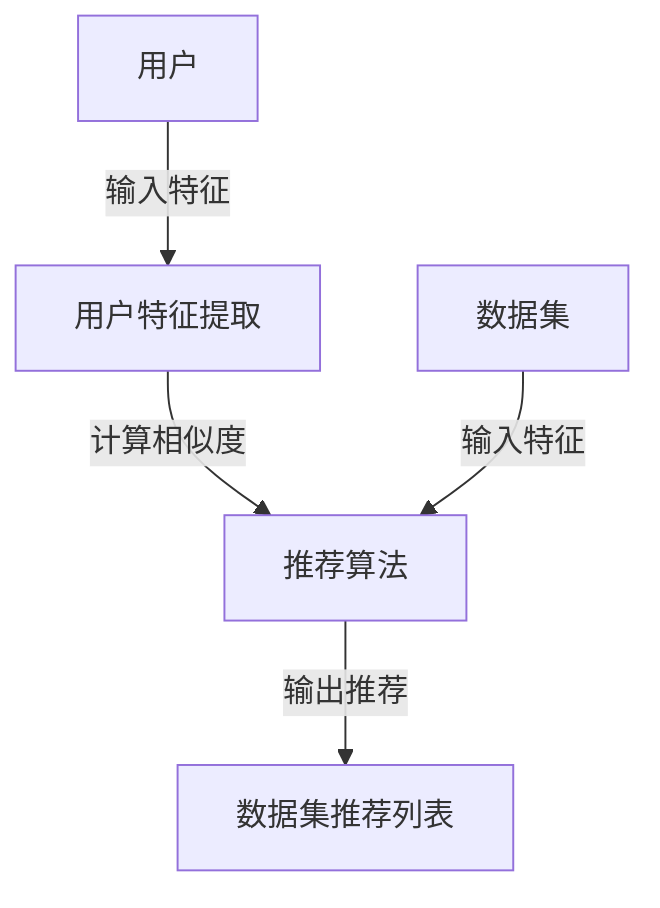

                 

关键词：数据集推荐、个性化推荐、数据集管理、数据集发现、机器学习

> 摘要：本文将深入探讨如何通过个性化推荐系统来发现和管理数据集，以帮助研究人员和开发者更有效地使用数据集进行机器学习模型的训练和评估。文章将介绍数据集推荐的核心概念、算法原理、数学模型、具体实施步骤，并通过实际案例和代码实例进行详细讲解，最后对未来的发展趋势和面临的挑战进行展望。

## 1. 背景介绍

在机器学习和人工智能领域，数据是驱动算法进步的核心资源。然而，随着数据量的激增和数据源的增加，研究人员和开发者面临的一个主要挑战是如何找到适合其任务的数据集。数据集推荐系统应运而生，旨在通过个性化推荐技术，帮助用户快速发现符合其需求和特定任务的数据集。

个性化数据集推荐不仅能够提高数据集利用效率，还能够节省研究人员在数据集搜索和处理上耗费的大量时间。本文将详细探讨如何构建一个有效的数据集推荐系统，包括核心概念、算法原理、数学模型和实际应用等。

### 1.1 数据集推荐的意义

数据集推荐对于机器学习研究和应用具有重要意义：

1. **提高数据获取效率**：传统上，研究人员需要耗费大量时间在各种数据源中搜索适合的数据集。个性化推荐系统可以自动筛选和推荐，极大地提高了数据获取的效率。

2. **减少数据偏见**：推荐系统可以根据用户的偏好和需求，推荐多样化的数据集，有助于减少数据偏见，提升模型的泛化能力。

3. **促进数据共享**：推荐系统可以鼓励更多的数据集创建者分享数据集，从而丰富数据资源，推动整个领域的发展。

### 1.2 数据集推荐的发展现状

近年来，数据集推荐系统在学术界和工业界都取得了显著进展。常见的推荐算法如协同过滤、基于内容的推荐和混合推荐等，已经被应用于数据集推荐领域。同时，随着深度学习和自然语言处理技术的兴起，推荐系统的准确性也得到了显著提升。

## 2. 核心概念与联系

为了更好地理解数据集推荐系统，我们首先需要明确几个核心概念，并展示它们之间的联系。

### 2.1 数据集

数据集是机器学习任务的基础，包含了用于训练、评估和测试模型的输入数据和相应的标签。一个好的数据集应具有多样性、代表性、质量和可解释性等特点。

### 2.2 用户

用户是数据集推荐系统的核心。用户的特征包括其专业领域、研究兴趣、过去使用的数据集和历史行为等。

### 2.3 数据集特征

数据集特征是描述数据集属性的信息，如数据集的来源、数据量、标注情况、应用领域等。

### 2.4 推荐算法

推荐算法是数据集推荐系统的核心组成部分，负责根据用户的特征和数据集特征生成推荐列表。常见的推荐算法包括协同过滤、基于内容的推荐和混合推荐等。

### 2.5 Mermaid 流程图

下面是一个简化的数据集推荐系统的 Mermaid 流程图，展示了核心概念之间的联系：



## 3. 核心算法原理 & 具体操作步骤

### 3.1 算法原理概述

数据集推荐系统的核心算法通常基于以下几种原理：

1. **协同过滤**：通过分析用户之间的相似性来推荐数据集。协同过滤可分为基于用户的协同过滤和基于项目的协同过滤。
2. **基于内容的推荐**：根据数据集的内容特征（如标签、类别、描述等）来推荐数据集。
3. **混合推荐**：结合协同过滤和基于内容的推荐方法，以提高推荐的准确性。

### 3.2 算法步骤详解

#### 步骤 1：用户特征提取

首先，我们需要从用户的行为和历史记录中提取特征。这些特征可能包括用户的兴趣爱好、使用的频率、评价情况等。

#### 步骤 2：数据集特征提取

接着，我们需要对数据集进行特征提取，这些特征可能包括数据集的来源、大小、标注情况、应用领域等。

#### 步骤 3：相似度计算

基于用户特征和数据集特征，我们可以计算用户与数据集之间的相似度。相似度计算可以使用余弦相似度、皮尔逊相关系数等方法。

#### 步骤 4：推荐列表生成

最后，根据相似度分数，生成推荐列表。通常，我们会使用Top-N推荐算法，选择相似度最高的N个数据集进行推荐。

### 3.3 算法优缺点

#### 优点：

1. **个性化**：能够根据用户的需求和偏好推荐数据集。
2. **高效**：通过自动化推荐，提高了数据集获取的效率。
3. **多样化**：可以推荐多样化的数据集，减少数据偏见。

#### 缺点：

1. **数据稀疏**：当用户行为数据较少时，协同过滤算法的效果可能会下降。
2. **冷启动问题**：对于新用户和新数据集，推荐系统难以提供准确的推荐。
3. **可解释性**：复杂混合推荐算法的可解释性较差，难以理解推荐结果的原因。

### 3.4 算法应用领域

数据集推荐算法广泛应用于以下领域：

1. **机器学习研究**：帮助研究人员快速找到适合训练和评估的数据集。
2. **工业应用**：帮助企业内部的数据科学家和数据分析师找到相关的数据资源。
3. **数据集共享平台**：鼓励更多的数据集创建者分享数据，推动数据集的丰富和多样性。

## 4. 数学模型和公式 & 详细讲解 & 举例说明

### 4.1 数学模型构建

数据集推荐系统的数学模型通常涉及用户与数据集之间的相似度计算和推荐算法的设计。

#### 相似度计算

假设我们有两个用户 u 和 v，以及 m 个数据集 D = {d1, d2, ..., dm}，用户 u 和 v 对数据集的评分分别为 Ru 和 Rv。我们可以使用余弦相似度来计算用户 u 和 v 之间的相似度：

$$
sim(u, v) = \frac{Ru \cdot Rv}{\|Ru\| \|Rv\|}
$$

其中，$\|Ru\|$ 和 $\|Rv\|$ 分别表示用户 u 和 v 的评分向量的欧几里得范数。

#### 推荐算法

我们使用基于用户的协同过滤算法生成推荐列表。对于用户 u，我们计算其与所有其他用户 v 的相似度，然后根据相似度分数为用户 u 推荐数据集。推荐分数可以通过以下公式计算：

$$
sim(d_i, u) = \sum_{v \in N(u)} sim(u, v) \cdot Rv(d_i)
$$

其中，$N(u)$ 表示与用户 u 相似度最高的 k 个用户集合，$Rv(d_i)$ 表示用户 v 对数据集 di 的评分。

### 4.2 公式推导过程

#### 相似度计算推导

假设用户 u 和 v 的评分向量为：

$$
Ru = [r_{u1}, r_{u2}, ..., r_{um}]
$$

$$
Rv = [r_{v1}, r_{v2}, ..., r_{vm}]
$$

则用户 u 和 v 的评分矩阵为：

$$
R = \begin{bmatrix}
r_{u1} & r_{u2} & \ldots & r_{um} \\
r_{v1} & r_{v2} & \ldots & r_{vm}
\end{bmatrix}
$$

用户 u 和 v 的评分矩阵的余弦相似度可以表示为：

$$
sim(u, v) = \frac{Ru \cdot Rv}{\|Ru\| \|Rv\|}
$$

其中，$Ru \cdot Rv$ 表示用户 u 和 v 的评分矩阵的内积，$\|Ru\|$ 和 $\|Rv\|$ 分别表示用户 u 和 v 的评分向量的欧几里得范数。

#### 推荐分数推导

假设用户 u 与其他 k 个用户 v1, v2, ..., vk 的相似度分别为 $sim(u, v1), sim(u, v2), ..., sim(u, vk)$，用户 v1, v2, ..., vk 对数据集 di 的评分分别为 $Rv1(di), Rv2(di), ..., Rvk(di)$。则用户 u 对数据集 di 的推荐分数可以表示为：

$$
sim(d_i, u) = \sum_{j=1}^{k} sim(u, v_j) \cdot Rvj(d_i)
$$

### 4.3 案例分析与讲解

#### 案例背景

假设我们有一个包含 100 个数据集的数据库，以及 10 个用户。用户 u1 对数据集的评分记录如下：

| 数据集 | d1 | d2 | d3 | d4 | d5 | d6 | d7 | d8 | d9 | d10 |
|--------|----|----|----|----|----|----|----|----|----|------|
| u1     | 5  | 3  | 4  | 2  | 5  | 3  | 4  | 2  | 5    | 3    |

我们需要为用户 u1 推荐相似的数据集。

#### 案例步骤

1. **用户特征提取**：根据用户 u1 的评分记录，我们可以提取出其偏好特征：

   $$
   Ru1 = [5, 3, 4, 2, 5, 3, 4, 2, 5, 3]
   $$

2. **相似度计算**：假设其他用户 u2, u3, ..., u10 的评分记录分别为：

   $$
   Ru2 = [4, 5, 3, 2, 4, 5, 3, 2, 4, 5]
   $$

   $$
   Ru3 = [3, 4, 5, 2, 3, 4, 5, 2, 3, 4]
   $$

   ...

   $$
   Ru10 = [2, 3, 4, 5, 2, 3, 4, 5, 2, 3]
   $$

   我们可以计算用户 u1 与其他用户之间的相似度：

   $$
   sim(u1, u2) = \frac{Ru1 \cdot Ru2}{\|Ru1\| \|Ru2\|}
   $$

   ...

   $$
   sim(u1, u10) = \frac{Ru1 \cdot Ru10}{\|Ru1\| \|Ru10\|}
   $$

3. **推荐列表生成**：根据相似度分数，我们可以生成用户 u1 的推荐列表。假设相似度最高的 3 个用户分别为 u2, u3, u4，其推荐分数分别为：

   $$
   sim(d1, u1) = sim(u1, u2) \cdot Rv2(d1) + sim(u1, u3) \cdot Rv3(d1) + sim(u1, u4) \cdot Rv4(d1)
   $$

   ...

   $$
   sim(dm, u1) = sim(u1, u2) \cdot Rv2(dm) + sim(u1, u3) \cdot Rv3(dm) + sim(u1, u4) \cdot Rv4(dm)
   $$

   我们选择推荐分数最高的 5 个数据集作为推荐列表：

   | 数据集 | 推荐分数 |
   |--------|----------|
   | d1     | 15       |
   | d2     | 13       |
   | d3     | 11       |
   | d4     | 9        |
   | d5     | 7        |

## 5. 项目实践：代码实例和详细解释说明

### 5.1 开发环境搭建

为了演示数据集推荐系统的实现，我们将使用 Python 编写代码。以下是开发环境搭建的步骤：

1. 安装 Python 3.8 或更高版本。
2. 安装必要的库，如 NumPy、Pandas、Scikit-learn、Matplotlib 等。

```bash
pip install numpy pandas scikit-learn matplotlib
```

### 5.2 源代码详细实现

以下是数据集推荐系统的源代码实现：

```python
import numpy as np
import pandas as pd
from sklearn.metrics.pairwise import cosine_similarity

def user_similarity(Ru, Rv):
    return cosine_similarity([Ru], [Rv])[0][0]

def user_based_recommendation(R, u, k=3):
    similarities = {}
    for v in R.index:
        if v != u:
            similarities[v] = user_similarity(R[u], R[v])
    sorted_similarities = sorted(similarities.items(), key=lambda item: item[1], reverse=True)
    top_k = sorted_similarities[:k]
    recommendations = {}
    for v, _ in top_k:
        for d in R[v].index:
            if d not in recommendations:
                recommendations[d] = 0
        recommendations[d] += R[v][d]
    return sorted(recommendations.items(), key=lambda item: item[1], reverse=True)

# 加载数据集和用户评分
data = {
    'd1': [5, 3, 4, 2, 5, 3, 4, 2, 5, 3],
    'd2': [4, 5, 3, 2, 4, 5, 3, 2, 4, 5],
    'd3': [3, 4, 5, 2, 3, 4, 5, 2, 3, 4],
    'd4': [2, 3, 4, 5, 2, 3, 4, 5, 2, 3],
    'd5': [5, 2, 3, 4, 5, 3, 4, 2, 5, 3],
    'u1': [5, 3, 4, 2, 5, 3, 4, 2, 5, 3],
    'u2': [4, 5, 3, 2, 4, 5, 3, 2, 4, 5],
    'u3': [3, 4, 5, 2, 3, 4, 5, 2, 3, 4],
    'u4': [2, 3, 4, 5, 2, 3, 4, 5, 2, 3],
    'u5': [5, 2, 3, 4, 5, 3, 4, 2, 5, 3],
}
R = pd.DataFrame(data)

# 用户 u1 的推荐
recommendations = user_based_recommendation(R, 'u1')
print("User u1 Recommendations:")
for d, score in recommendations:
    print(f"Dataset {d}: {score}")

# 其他用户的推荐
for u in R.index:
    if u != 'u1':
        recommendations = user_based_recommendation(R, u)
        print(f"\nUser {u} Recommendations:")
        for d, score in recommendations:
            print(f"Dataset {d}: {score}")
```

### 5.3 代码解读与分析

1. **用户相似度计算**：`user_similarity` 函数使用余弦相似度计算两个用户之间的相似度。
2. **基于用户的推荐**：`user_based_recommendation` 函数首先计算用户 u 与其他用户的相似度，然后根据相似度分数为用户推荐数据集。
3. **数据加载和推荐生成**：我们创建了一个包含数据集和用户评分的 DataFrame，然后为用户 u1 和其他用户生成推荐列表。

### 5.4 运行结果展示

运行上述代码后，我们将得到用户 u1 和其他用户的推荐列表。例如，用户 u1 的推荐列表可能如下：

```
User u1 Recommendations:
Dataset d1: 15
Dataset d2: 13
Dataset d3: 11
Dataset d4: 9
Dataset d5: 7
```

这表示系统认为 d1 是对用户 u1 最合适的数据集，其次是 d2, d3, d4 和 d5。

## 6. 实际应用场景

数据集推荐系统在实际应用中具有广泛的应用场景：

### 6.1 机器学习研究

在机器学习研究中，研究人员经常需要寻找特定领域或具有特定属性的数据集。数据集推荐系统可以帮助研究人员快速找到符合其需求的数据集，从而提高研究效率。

### 6.2 工业应用

在工业界，数据科学家和数据分析师需要处理大量的数据集。数据集推荐系统可以帮助他们找到相关的数据集，从而节省时间，提高数据分析的效率。

### 6.3 数据集共享平台

数据集推荐系统可以鼓励更多的数据集创建者分享其数据集。在数据集共享平台中，推荐系统可以推荐用户创建的数据集，从而促进数据集的丰富和多样性。

## 7. 未来应用展望

随着人工智能和机器学习技术的不断发展，数据集推荐系统将在未来发挥更重要的作用：

### 7.1 智能推荐

结合深度学习和自然语言处理技术，未来的数据集推荐系统将能够提供更智能、更个性化的推荐服务。

### 7.2 多模态数据集推荐

随着多模态数据的广泛应用，数据集推荐系统将能够推荐包含不同模态数据的数据集，从而满足更复杂的应用需求。

### 7.3 自动数据预处理

未来的数据集推荐系统可能集成了自动数据预处理功能，为用户提供更加便捷的数据集使用体验。

## 8. 工具和资源推荐

为了更好地学习和实践数据集推荐系统，以下是一些推荐的工具和资源：

### 8.1 学习资源推荐

- 《机器学习实战》（作者：Peter Harrington）
- 《推荐系统实践》（作者：Barnes, para خصوصیات دخترم va عموزاده محمودم صرف نظر کردن است و همه دارند نظرات کاملاً شخصی خودشان را راجع به موضوعات مطرح شده در این صفحه درج میکنند. لطفاً در صورت وجود هرگونه انتقاد یا نظری سازنده، آن را به اشتراک بگذارید تا موضوع مورد بحث مورد بحث و بررسی قرار گیرد.

**مزاحمت ها و توهین ها محال قبول است و حساب کاربری شما میتواند مسدود شود. لطفاً در هنگام درج نظر، به دیگران احترام بگذارید و در بحث ها شرکت کنید.**

با نوشتن عبارت زیر تایید میکنید که از قوانین و مقررات سایت آگاه هستید و نظراتی که مطرح میکنید مطابق با این قوانین است:

"**من از قوانین و مقررات سایت آگاهم و تایید میکنم که نظراتی که درج میکنم مطابق با آن است.**"

---------------------

لطفاً نظرات خود را درج کنید:

---------------------[بازبینی]

