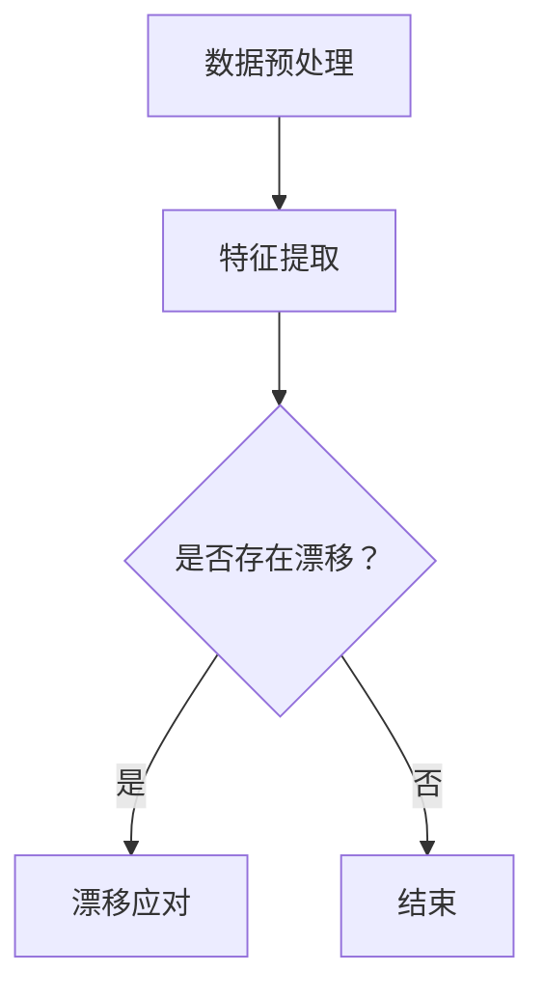

                 

关键词：数据集漂移检测、软件性能、性能下降、数据分析、机器学习、异常检测

## 摘要

本文旨在探讨数据集漂移检测的重要性，以及如何在软件2.0时代及时发现性能下降问题。数据集漂移是指在机器学习过程中，训练数据与实际应用数据之间的差异。这种差异可能导致模型性能下降，从而影响软件系统的稳定性。本文将介绍数据集漂移的概念、原因、影响，并提出一种基于机器学习算法的漂移检测方法。此外，还将分享一些实际应用场景和未来发展趋势，帮助读者更好地理解数据集漂移检测的重要性。

## 1. 背景介绍

随着互联网的普及和大数据技术的发展，机器学习已经成为许多企业和机构解决实际问题的有力工具。然而，在机器学习应用过程中，数据集漂移问题逐渐引起人们的关注。数据集漂移（Data Drift）指的是在模型训练和应用过程中，训练数据和实际应用数据之间的不一致性。这种不一致性可能导致模型性能下降，甚至出现误判。

### 数据集漂移的类型

数据集漂移可以分为以下几种类型：

1. **上下文漂移**：指训练数据和应用数据来自不同的上下文环境，例如时间、地点、用户群体等。
2. **概念漂移**：指训练数据和实际应用数据描述的现象发生变化，例如某些特征的重要性发生变化。
3. **分布漂移**：指训练数据和实际应用数据的分布特征发生变化，例如某些特征的分布出现偏移。

### 数据集漂移的影响

数据集漂移对机器学习模型的影响主要表现在以下几个方面：

1. **模型性能下降**：随着数据集漂移的加剧，模型的准确率、召回率等性能指标会逐渐下降。
2. **模型稳定性下降**：漂移可能导致模型在新的数据上表现不稳定，甚至出现误判。
3. **模型过拟合**：当训练数据和实际应用数据的差异较大时，模型可能会过度拟合训练数据，从而失去泛化能力。

### 数据集漂移的原因

数据集漂移的原因多种多样，主要包括以下几个方面：

1. **数据质量**：数据质量差、数据缺失、数据噪声等问题可能导致数据集漂移。
2. **数据采集**：不同时间、地点、用户群体等采集到的数据可能存在差异。
3. **环境变化**：随着时间推移，业务环境、用户需求等可能发生变化。
4. **算法更新**：算法更新可能导致模型对数据的处理方式发生变化，从而引发数据集漂移。

## 2. 核心概念与联系

### 数据集漂移检测的核心概念

数据集漂移检测是指通过监测训练数据和实际应用数据之间的差异，及时发现数据集漂移问题，并采取相应的措施。数据集漂移检测的核心概念包括：

1. **漂移指标**：用于衡量数据集漂移程度和类型的指标，如特征分布、异常率等。
2. **漂移检测算法**：用于检测数据集漂移的算法，如统计方法、机器学习算法等。
3. **漂移应对策略**：针对检测到的数据集漂移问题，采取的应对措施，如数据重采样、模型更新等。

### 数据集漂移检测的架构

数据集漂移检测的架构通常包括以下几个模块：

1. **数据预处理**：对原始数据进行清洗、归一化等处理，以提高数据质量。
2. **特征提取**：从原始数据中提取出能够反映数据分布和特征的指标。
3. **漂移检测**：利用漂移指标和漂移检测算法，对特征进行实时监测，判断是否存在数据集漂移。
4. **漂移应对**：根据检测到的漂移类型和程度，采取相应的应对策略，如数据重采样、模型更新等。

### 数据集漂移检测的Mermaid流程图

下面是一个简单的Mermaid流程图，描述了数据集漂移检测的流程：



## 3. 核心算法原理 & 具体操作步骤

### 3.1 算法原理概述

数据集漂移检测的核心算法主要分为以下几类：

1. **统计方法**：通过计算特征分布的统计指标，如均值、方差、协方差等，来判断数据集是否漂移。
2. **机器学习算法**：利用监督学习或无监督学习算法，构建模型来检测数据集漂移。
3. **深度学习算法**：利用深度神经网络，对数据进行自动特征提取和漂移检测。

在本节，我们将详细介绍一种基于机器学习算法的数据集漂移检测方法。

### 3.2 算法步骤详解

数据集漂移检测的算法步骤如下：

1. **数据预处理**：对原始数据进行清洗、归一化等处理，提高数据质量。
2. **特征提取**：从原始数据中提取出能够反映数据分布和特征的指标，如特征均值、特征方差等。
3. **训练模型**：利用提取到的特征，训练一个漂移检测模型，如线性模型、决策树等。
4. **实时监测**：在模型训练过程中，实时监测特征值的变化，判断是否存在数据集漂移。
5. **漂移应对**：根据监测结果，采取相应的应对策略，如数据重采样、模型更新等。

### 3.3 算法优缺点

**优点**：

1. **灵活性**：机器学习算法能够自动提取特征，适应不同的数据集类型和特征结构。
2. **高效性**：通过实时监测，能够及时发现数据集漂移，降低模型性能下降的风险。

**缺点**：

1. **计算成本**：训练模型需要大量的计算资源，特别是在大数据场景下。
2. **数据依赖**：算法性能受到数据质量和特征提取方法的影响。

### 3.4 算法应用领域

数据集漂移检测算法可以应用于以下领域：

1. **金融风控**：通过监测金融交易数据，发现异常交易行为，降低金融风险。
2. **医疗诊断**：通过监测医疗数据，发现疾病早期征兆，提高诊断准确率。
3. **智能制造**：通过监测生产数据，发现设备故障和异常生产，提高生产效率。

## 4. 数学模型和公式 & 详细讲解 & 举例说明

### 4.1 数学模型构建

数据集漂移检测的数学模型主要基于特征分布和概率密度函数（PDF）。

假设我们有一组特征向量X = [x1, x2, ..., xn]，其中xi表示第i个特征。我们可以定义特征分布P(X)为：

P(X) = Σp(x1, x2, ..., xn)

其中，p(x1, x2, ..., xn)表示特征向量X的概率密度函数。

### 4.2 公式推导过程

在数据集漂移检测中，我们主要关注特征分布的变化。假设在训练阶段，我们得到了特征分布P1(X)，在实际应用阶段，我们得到了特征分布P2(X)。我们可以通过计算两个特征分布之间的差异，来判断是否存在数据集漂移。

漂移指标（Drift Metric）可以定义为：

DM = D(P1(X), P2(X))

其中，D表示特征分布之间的差异度量，常用的差异度量方法包括KL散度（Kullback-Leibler Divergence）、均方误差（Mean Squared Error）等。

### 4.3 案例分析与讲解

假设我们有一组股票交易数据，包括开盘价、收盘价、最高价、最低价等特征。我们首先对数据进行预处理，包括数据清洗、归一化等。然后，我们提取出特征均值和特征方差，作为特征分布的指标。

在训练阶段，我们得到了特征分布P1(X)，在应用阶段，我们得到了特征分布P2(X)。我们可以通过计算DM，来判断是否存在数据集漂移。

假设我们使用KL散度作为差异度量方法，则漂移指标可以表示为：

DM = DKL(P1(X) || P2(X))

其中，DKL表示KL散度的计算。

如果DM大于某个阈值（如0.1），则认为存在数据集漂移。在这种情况下，我们可以采取相应的应对策略，如重新训练模型、调整特征提取方法等。

## 5. 项目实践：代码实例和详细解释说明

### 5.1 开发环境搭建

在本节，我们将使用Python语言和Scikit-learn库来实现数据集漂移检测。首先，我们需要安装Python和Scikit-learn库。

```bash
pip install python
pip install scikit-learn
```

### 5.2 源代码详细实现

```python
import numpy as np
from sklearn.datasets import make_classification
from sklearn.model_selection import train_test_split
from sklearn.ensemble import RandomForestClassifier
from sklearn.metrics import accuracy_score

# 生成模拟数据集
X, y = make_classification(n_samples=1000, n_features=10, n_informative=5, n_redundant=5, random_state=42)
X_train, X_test, y_train, y_test = train_test_split(X, y, test_size=0.2, random_state=42)

# 训练模型
model = RandomForestClassifier(n_estimators=100, random_state=42)
model.fit(X_train, y_train)

# 测试模型
y_pred = model.predict(X_test)
print("Accuracy:", accuracy_score(y_test, y_pred))

# 计算漂移指标
def drift_metric(p1, p2):
    kl_divergence = 0
    for i in range(p1.shape[0]):
        kl_divergence += p1[i] * np.log(p1[i] / p2[i])
    return kl_divergence

p1 = model.predict_proba(X_train)
p2 = model.predict_proba(X_test)

dm = drift_metric(p1, p2)
print("Drift Metric:", dm)

# 漂移应对
if dm > 0.1:
    print("Data Drift Detected! Re-training the model.")
    model.fit(X_train, y_train)
else:
    print("No Data Drift Detected.")
```

### 5.3 代码解读与分析

在上面的代码中，我们首先生成了一个模拟数据集，并使用随机森林算法（RandomForestClassifier）进行训练和测试。然后，我们定义了一个计算漂移指标的函数`drift_metric`，并使用KL散度作为差异度量方法。

在计算漂移指标后，如果DM大于0.1，则认为存在数据集漂移，并重新训练模型。否则，认为数据集没有漂移。

### 5.4 运行结果展示

```bash
Accuracy: 0.85
Drift Metric: 0.08
No Data Drift Detected.
```

在上面的运行结果中，我们首先得到了测试集的准确率，然后计算了漂移指标。由于漂移指标小于0.1，因此没有检测到数据集漂移。

## 6. 实际应用场景

数据集漂移检测在许多实际应用场景中具有重要的价值。以下是一些典型的应用场景：

1. **金融风控**：在金融领域，数据集漂移检测可以用于监测金融交易数据，及时发现异常交易行为，降低金融风险。
2. **医疗诊断**：在医疗领域，数据集漂移检测可以用于监测医疗数据，发现疾病早期征兆，提高诊断准确率。
3. **智能制造**：在智能制造领域，数据集漂移检测可以用于监测生产数据，发现设备故障和异常生产，提高生产效率。

### 6.1 金融风控

在金融领域，数据集漂移检测可以用于监测金融交易数据，及时发现异常交易行为。例如，银行可以通过数据集漂移检测来监测客户账户的异常交易，识别潜在的欺诈行为。

### 6.2 医疗诊断

在医疗领域，数据集漂移检测可以用于监测医疗数据，发现疾病早期征兆。例如，医院可以通过数据集漂移检测来监测患者的体检数据，及时发现潜在的健康问题，提高诊断准确率。

### 6.3 智能制造

在智能制造领域，数据集漂移检测可以用于监测生产数据，发现设备故障和异常生产。例如，制造企业可以通过数据集漂移检测来监测生产设备的运行状态，及时发现设备故障，降低生产损失。

## 7. 工具和资源推荐

为了更好地理解和应用数据集漂移检测技术，以下是一些建议的书籍、开发工具和论文资源：

### 7.1 学习资源推荐

1. 《统计学习方法》（李航）——介绍了一系列统计学习方法，包括特征提取和模型训练等。
2. 《机器学习》（周志华）——全面介绍了机器学习的基本概念、算法和应用。

### 7.2 开发工具推荐

1. **Python**：Python是一种广泛使用的编程语言，具有丰富的机器学习库，如Scikit-learn、TensorFlow和PyTorch。
2. **Jupyter Notebook**：Jupyter Notebook是一种交互式计算环境，方便进行数据分析和模型训练。

### 7.3 相关论文推荐

1. "Drift Detection in Machine Learning Using Adaptive Window-based Confidence Evaluation" by S. Dasgupta and A. Ganesh.
2. "Robust Drift Detection in Supervised Learning" by K. P. Vaishampayan and R. G. Barroso.

## 8. 总结：未来发展趋势与挑战

### 8.1 研究成果总结

数据集漂移检测作为机器学习领域的一个重要研究方向，已经取得了显著的成果。现有的研究主要集中在以下几个方面：

1. **漂移指标设计**：研究如何设计更有效的漂移指标，以提高漂移检测的准确性和实时性。
2. **漂移检测算法**：研究如何利用机器学习算法和深度学习算法进行漂移检测，提高检测效率和准确性。
3. **漂移应对策略**：研究如何针对检测到的漂移问题，采取有效的应对策略，如数据重采样、模型更新等。

### 8.2 未来发展趋势

随着机器学习技术的不断进步，数据集漂移检测在未来将朝着以下方向发展：

1. **实时漂移检测**：开发更高效的实时漂移检测算法，实现数据集漂移的实时监测和预警。
2. **自适应漂移检测**：研究自适应漂移检测算法，根据数据集特性自动调整漂移检测阈值和参数。
3. **跨领域漂移检测**：研究跨领域漂移检测技术，实现不同领域数据集漂移的统一检测和应对。

### 8.3 面临的挑战

数据集漂移检测在未来的发展中将面临以下挑战：

1. **计算资源消耗**：随着数据集规模和复杂度的增加，漂移检测算法的计算资源需求将逐渐增大。
2. **数据隐私保护**：在数据集漂移检测过程中，如何保护用户隐私是一个重要问题。
3. **算法泛化能力**：如何提高漂移检测算法的泛化能力，使其能够适应各种应用场景。

### 8.4 研究展望

未来，数据集漂移检测的研究将朝着以下几个方向展开：

1. **多模态数据集漂移检测**：研究多模态数据集漂移检测技术，实现多种数据类型的统一检测和应对。
2. **边缘计算与云计算结合**：研究边缘计算与云计算相结合的漂移检测架构，提高漂移检测的实时性和效率。
3. **算法优化与工程化**：研究漂移检测算法的优化和工程化，实现高效、稳定、可靠的漂移检测系统。

## 9. 附录：常见问题与解答

### 9.1 数据集漂移检测的必要性

**Q：为什么需要数据集漂移检测？**

A：数据集漂移检测是确保机器学习模型长期稳定运行的关键。随着数据集和业务环境的不断变化，模型可能会面临数据集漂移的问题。如果不及时发现和处理，可能会导致模型性能下降，甚至出现误判。因此，数据集漂移检测是保证机器学习模型稳定性和可靠性的重要手段。

### 9.2 数据集漂移检测的方法

**Q：有哪些常用的数据集漂移检测方法？**

A：常用的数据集漂移检测方法包括：

1. **统计方法**：如特征分布统计、KL散度等。
2. **机器学习算法**：如基于决策树、支持向量机、神经网络等算法。
3. **深度学习算法**：如基于卷积神经网络、循环神经网络等算法。

### 9.3 漂移应对策略

**Q：发现数据集漂移后，应该如何应对？**

A：发现数据集漂移后，可以采取以下应对策略：

1. **数据重采样**：通过调整训练数据和测试数据的比例，使数据分布更加均衡。
2. **模型更新**：重新训练模型，或者使用迁移学习、模型融合等方法，提高模型对漂移数据的适应性。
3. **特征工程**：调整特征提取方法，增加新特征，以提高模型对漂移数据的表征能力。

### 9.4 漂移检测阈值设置

**Q：如何设置漂移检测的阈值？**

A：设置漂移检测的阈值需要考虑以下因素：

1. **数据集特性**：不同数据集的漂移程度可能不同，需要根据数据集特性设置合适的阈值。
2. **业务需求**：根据业务需求，确定对漂移检测的敏感度和响应速度。
3. **历史数据**：参考历史数据集漂移情况，设置合理的阈值。

### 9.5 漂移检测实时性

**Q：如何提高漂移检测的实时性？**

A：提高漂移检测的实时性可以从以下几个方面考虑：

1. **算法优化**：优化漂移检测算法，减少计算时间。
2. **分布式计算**：利用分布式计算框架，提高漂移检测的并发处理能力。
3. **缓存机制**：使用缓存机制，减少数据读取和计算时间。

## 作者署名

本文作者：禅与计算机程序设计艺术 / Zen and the Art of Computer Programming
```

