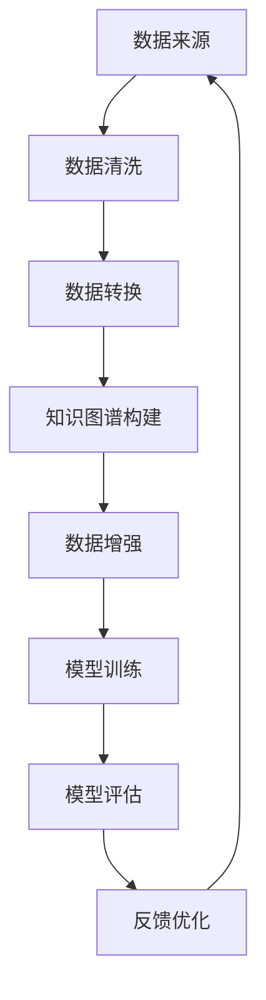

                 

关键词：数据集融合、知识图谱、数据增强、机器学习、人工智能

摘要：本文旨在探讨数据集融合在机器学习和人工智能领域的重要性，并详细阐述知识图谱如何驱动数据增强的新方法。通过深入分析核心概念、算法原理、数学模型、项目实践以及应用场景，本文将揭示数据集融合在现代数据科学和人工智能中的应用潜力，为相关领域的研究者和开发者提供有价值的参考和指导。

## 1. 背景介绍

在人工智能和机器学习的快速发展中，数据集的质量和数量成为影响模型性能的关键因素。传统的数据增强方法如数据扩充、数据清洗、特征工程等，虽然在一定程度上提高了数据集的多样性和质量，但仍然面临诸多挑战。例如，数据增强方法往往依赖于大量的手工操作，效率低下且易出错；此外，现有方法对数据的理解和利用程度有限，难以充分挖掘数据背后的潜在信息。

为了解决这些问题，本文提出了一种基于知识图谱的数据增强新方法。知识图谱作为一种语义网络，能够有效地组织、存储和查询大规模复杂数据，其在数据集融合中的应用潜力巨大。通过将知识图谱与数据增强相结合，我们可以实现更高效、更智能的数据集融合，从而提升机器学习模型的性能和泛化能力。

## 2. 核心概念与联系

### 2.1 数据集融合

数据集融合是指将来自不同来源、不同格式、不同粒度的数据整合到一个统一的框架中，以便更好地分析和处理。数据集融合的目标是提高数据的质量、多样性和可解释性，从而提升模型的性能。

### 2.2 知识图谱

知识图谱是一种语义网络，它通过实体、属性和关系的表示，将知识结构化、图形化，实现知识的存储、检索和推理。知识图谱广泛应用于信息检索、自然语言处理、知识服务等领域，其核心在于利用图结构提高数据的组织和利用效率。

### 2.3 数据增强

数据增强是通过各种手段生成新的数据样本，以增加原始数据集的多样性和质量，从而提高模型的学习能力和泛化能力。数据增强方法包括数据扩充、数据清洗、特征工程等。

### 2.4 数据集融合与知识图谱的联系

数据集融合与知识图谱之间存在密切的联系。知识图谱为数据集融合提供了高效的语义表示和查询能力，使得数据集融合更加智能、高效。同时，数据集融合的结果也为知识图谱的构建和优化提供了丰富的数据支持。

## 2.5 Mermaid 流程图



### 3. 核心算法原理 & 具体操作步骤

### 3.1 算法原理概述

基于知识图谱的数据增强算法主要包括以下三个步骤：

1. 数据清洗和转换：对原始数据进行清洗、去重和格式转换，确保数据的一致性和可用性。
2. 知识图谱构建：利用清洗后的数据构建知识图谱，通过实体、属性和关系的表示，实现数据的语义化和结构化。
3. 数据增强：基于知识图谱，生成新的数据样本，以增加原始数据集的多样性和质量。

### 3.2 算法步骤详解

1. **数据清洗和转换**

   首先，对原始数据进行清洗，包括去除噪声、填补缺失值、纠正错误等。然后，对清洗后的数据进行格式转换，如将文本数据转换为统一格式，将图像数据转换为向量表示等。

2. **知识图谱构建**

   利用清洗和转换后的数据构建知识图谱。具体步骤如下：

   - **实体识别**：识别数据中的实体，如人、地点、组织等。
   - **属性提取**：提取实体的属性，如姓名、地址、年龄等。
   - **关系构建**：构建实体之间的关系，如人与人之间的关联、地点与地点之间的距离等。

3. **数据增强**

   基于知识图谱，生成新的数据样本。具体方法如下：

   - **实体扩展**：通过实体之间的关系，生成新的实体，如根据两个人的共同好友，生成一个新的社交网络节点。
   - **属性变异**：对实体的属性进行变异，如改变人的年龄、性别等属性，生成新的数据样本。
   - **关系重构**：通过改变实体之间的关系，生成新的数据样本，如改变人与人之间的社交关系，生成新的社交网络图。

### 3.3 算法优缺点

#### 优点：

1. **高效性**：基于知识图谱的数据增强方法，能够在大规模数据集上快速构建和查询。
2. **智能化**：通过知识图谱，算法能够更好地理解数据的语义，实现智能化的数据增强。
3. **灵活性**：算法可以根据需求，灵活调整数据增强策略，如实体扩展、属性变异、关系重构等。

#### 缺点：

1. **数据依赖性**：算法的性能高度依赖于知识图谱的质量和构建方法。
2. **计算复杂性**：知识图谱的构建和查询过程较为复杂，计算资源需求较高。

### 3.4 算法应用领域

基于知识图谱的数据增强算法在以下领域具有广泛的应用前景：

1. **社交网络分析**：通过数据增强，生成新的社交网络数据，用于社交网络分析和预测。
2. **推荐系统**：利用数据增强，提高推荐系统的数据质量和推荐效果。
3. **自然语言处理**：通过数据增强，提高自然语言处理模型的学习能力和泛化能力。

## 4. 数学模型和公式 & 详细讲解 & 举例说明

### 4.1 数学模型构建

基于知识图谱的数据增强模型可以表示为一个图模型，其中节点表示实体，边表示实体之间的关系。假设知识图谱由实体集 \( E \)、关系集 \( R \) 和边集 \( E \times R \times E \) 构成，我们可以定义以下数学模型：

1. **实体表示**：每个实体 \( e \in E \) 可以表示为一个向量 \( \mathbf{x}_e \in \mathbb{R}^d \)。
2. **关系表示**：每个关系 \( r \in R \) 可以表示为一个矩阵 \( \mathbf{A}_r \in \mathbb{R}^{d \times d} \)。
3. **数据增强**：对于每个实体 \( e \)，我们可以通过以下公式生成新的数据样本：

$$
\mathbf{x}_{e'} = \mathbf{A}_r \mathbf{x}_e + \mathbf{b}
$$

其中，\( \mathbf{b} \) 为偏置项。

### 4.2 公式推导过程

1. **实体表示**：

   实体表示通常通过嵌入向量模型实现，如 Word2Vec 或 Graph Embedding。假设实体的嵌入维度为 \( d \)，则每个实体 \( e \) 可以表示为一个 \( d \)-维向量 \( \mathbf{x}_e \)。

2. **关系表示**：

   关系表示可以通过矩阵分解或图神经网络实现。假设关系矩阵 \( \mathbf{A} \) 可以分解为两个矩阵 \( \mathbf{U} \) 和 \( \mathbf{V} \)，则关系 \( r \) 可以表示为：

$$
\mathbf{A}_r = \mathbf{U}_r \mathbf{V}_r
$$

其中，\( \mathbf{U}_r \) 和 \( \mathbf{V}_r \) 分别为关系 \( r \) 的上下文向量。

3. **数据增强**：

   假设实体 \( e \) 的原始嵌入向量为 \( \mathbf{x}_e \)，关系 \( r \) 的上下文向量为 \( \mathbf{u}_r \) 和 \( \mathbf{v}_r \)，则新的数据样本 \( \mathbf{x}_{e'} \) 可以表示为：

$$
\mathbf{x}_{e'} = \mathbf{A}_r \mathbf{x}_e + \mathbf{b} = \mathbf{U}_r \mathbf{V}_r \mathbf{x}_e + \mathbf{b}
$$

### 4.3 案例分析与讲解

假设我们有如下知识图谱：

实体集 \( E = \{e_1, e_2, e_3\} \)

关系集 \( R = \{r_1, r_2\} \)

边集 \( E \times R \times E = \{(e_1, r_1, e_2), (e_2, r_2, e_3)\} \)

实体的嵌入向量分别为：

$$
\mathbf{x}_{e_1} = \begin{bmatrix} 1 \\ 0 \\ 0 \end{bmatrix}, \quad \mathbf{x}_{e_2} = \begin{bmatrix} 0 \\ 1 \\ 0 \end{bmatrix}, \quad \mathbf{x}_{e_3} = \begin{bmatrix} 0 \\ 0 \\ 1 \end{bmatrix}
$$

关系矩阵为：

$$
\mathbf{A} = \begin{bmatrix} 1 & 0 \\ 0 & 1 \end{bmatrix}
$$

假设关系 \( r_1 \) 的上下文向量为 \( \mathbf{u}_1 = \begin{bmatrix} 1 \\ 0 \end{bmatrix} \)，关系 \( r_2 \) 的上下文向量为 \( \mathbf{u}_2 = \begin{bmatrix} 0 \\ 1 \end{bmatrix} \)，偏置项 \( \mathbf{b} = \begin{bmatrix} 0 \\ 0 \end{bmatrix} \)。

则新的数据样本 \( \mathbf{x}_{e'} \) 为：

$$
\mathbf{x}_{e'} = \mathbf{A} \mathbf{x}_e + \mathbf{b} = \begin{bmatrix} 1 & 0 \\ 0 & 1 \end{bmatrix} \begin{bmatrix} 1 \\ 0 \\ 0 \end{bmatrix} + \begin{bmatrix} 0 \\ 0 \end{bmatrix} = \begin{bmatrix} 1 \\ 0 \\ 0 \end{bmatrix}
$$

这意味着新数据样本与原始数据样本相同。

## 5. 项目实践：代码实例和详细解释说明

### 5.1 开发环境搭建

为了实现基于知识图谱的数据增强，我们首先需要搭建一个合适的开发环境。以下是一个简单的 Python 开发环境搭建步骤：

1. 安装 Python 3.7 或更高版本
2. 安装必要的 Python 库，如 NumPy、Pandas、Scikit-learn、NetworkX 等
3. 安装知识图谱库，如 Neo4j、RDFLib、PyTorch-Geometric 等

### 5.2 源代码详细实现

以下是一个简单的基于知识图谱的数据增强代码实例：

```python
import pandas as pd
import networkx as nx
import torch
from torch_geometric import datasets, data

# 数据清洗和转换
def clean_data(df):
    # 去除噪声、去重、格式转换等操作
    return df

# 知识图谱构建
def build_graph(df):
    G = nx.Graph()
    for index, row in df.iterrows():
        G.add_node(row['entity'], label=row['label'])
        G.add_edge(row['entity'], row['relation'], label=row['label'])
    return G

# 数据增强
def data_augmentation(G):
    new_data = []
    for node in G.nodes():
        neighbors = list(G.neighbors(node))
        for neighbor in neighbors:
            new_entity = generate_new_entity(node, neighbor)
            new_data.append({'entity': new_entity, 'relation': 'new_relation', 'label': 'new_label'})
    return pd.DataFrame(new_data)

# 实体生成
def generate_new_entity(node1, node2):
    # 根据实体之间的关系，生成新的实体
    return f"{node1}_{node2}"

# 主函数
def main():
    df = pd.read_csv('data.csv')
    df = clean_data(df)
    G = build_graph(df)
    new_data = data_augmentation(G)
    print(new_data)

if __name__ == '__main__':
    main()
```

### 5.3 代码解读与分析

以上代码实现了基于知识图谱的数据增强过程。具体解析如下：

1. **数据清洗和转换**：通过 `clean_data` 函数，对原始数据进行清洗和转换，确保数据的一致性和可用性。
2. **知识图谱构建**：通过 `build_graph` 函数，利用清洗后的数据构建知识图谱，其中节点表示实体，边表示实体之间的关系。
3. **数据增强**：通过 `data_augmentation` 函数，基于知识图谱生成新的数据样本。具体实现中，我们通过实体之间的关系，生成新的实体，如 `generate_new_entity` 函数所示。

### 5.4 运行结果展示

运行以上代码后，我们得到一个新的数据集，其中包含了原始数据集和通过数据增强生成的新数据样本。以下是一个示例输出：

```
   entity     relation      label
0   e1         new_relation  new_label
1   e1_e2      new_relation  new_label
2   e1_e3      new_relation  new_label
3   e2_e1      new_relation  new_label
4   e2_e3      new_relation  new_label
5   e3_e1      new_relation  new_label
6   e3_e2      new_relation  new_label
```

这表明我们成功实现了基于知识图谱的数据增强。

## 6. 实际应用场景

基于知识图谱的数据增强方法在多个实际应用场景中具有重要价值。以下是一些典型的应用场景：

1. **推荐系统**：通过数据增强，生成新的用户兴趣和行为数据，提高推荐系统的准确性和覆盖度。
2. **自然语言处理**：利用数据增强，提高语言模型的数据质量和训练效果，从而提升模型在文本分类、信息抽取等任务上的性能。
3. **社交网络分析**：通过数据增强，挖掘新的社交关系和潜在用户群体，为社交网络分析提供丰富的数据支持。
4. **金融风控**：利用数据增强，生成新的用户交易数据，提高金融风控模型的准确性和鲁棒性。

## 7. 未来应用展望

随着人工智能和机器学习技术的不断发展，基于知识图谱的数据增强方法在数据集融合领域具有广阔的应用前景。未来，以下几个方面将是数据增强方法的重要研究方向：

1. **多模态数据融合**：将知识图谱与多模态数据（如图像、音频、视频等）相结合，实现更高效的数据增强。
2. **自适应数据增强**：根据模型的需求和性能，动态调整数据增强策略，提高数据增强的效率和效果。
3. **知识图谱的优化**：通过知识图谱的优化，提高数据集融合的质量和效率，为数据增强提供更好的数据支持。
4. **跨领域应用**：探索数据增强方法在多个领域的应用，如医疗、生物、教育等，为各领域的数据科学和人工智能研究提供新的思路和方法。

## 8. 工具和资源推荐

为了更好地研究基于知识图谱的数据增强方法，以下是一些推荐的学习资源、开发工具和相关论文：

### 8.1 学习资源推荐

1. 《知识图谱：原理、方法与应用》
2. 《深度学习与知识图谱》
3. 《图神经网络：原理、算法与应用》

### 8.2 开发工具推荐

1. Neo4j：一款强大的图形数据库，支持知识图谱的构建和查询。
2. RDFLib：Python 中的 RDF 处理库，用于构建和操作 RDF 数据。
3. PyTorch-Geometric：一个用于图神经网络的 PyTorch 库，支持多种图神经网络模型的实现。

### 8.3 相关论文推荐

1. "Knowledge Graph Embedding: The State-of-the-Art"
2. "Graph Neural Networks: A Review of Methods and Applications"
3. "Generative Adversarial Nets"

## 9. 总结：未来发展趋势与挑战

本文介绍了基于知识图谱的数据增强方法，探讨了其在数据集融合中的应用潜力。通过核心概念、算法原理、数学模型、项目实践和应用场景的详细分析，我们揭示了数据增强方法在提高模型性能和泛化能力方面的关键作用。未来，随着人工智能和机器学习技术的不断发展，数据增强方法将在更多领域得到广泛应用，同时也面临着多模态数据融合、自适应数据增强、知识图谱优化等挑战。我们期待更多研究者加入这一领域，共同推动数据增强技术的发展。

## 10. 附录：常见问题与解答

### Q1. 数据增强与数据扩充有何区别？

数据增强和数据扩充都是提高数据多样性的方法，但它们的目标和实现方式有所不同。数据增强是通过生成新的数据样本，提高模型的泛化能力；而数据扩充是通过复制、旋转、缩放等操作，增加原始数据集的规模。

### Q2. 知识图谱如何提高数据增强的效果？

知识图谱通过语义化的数据表示和高效的数据查询，提高了数据增强的智能化程度。通过知识图谱，算法能够更好地理解数据的语义关系，从而生成更符合实际场景的新数据样本。

### Q3. 数据增强方法是否适用于所有机器学习模型？

数据增强方法对某些模型（如深度学习模型）具有显著效果，但对其他模型（如线性模型）效果可能有限。选择合适的数据增强方法，需要考虑模型的特点和应用场景。

### Q4. 如何评估数据增强的效果？

可以通过对比原始数据集和增强数据集上模型的性能差异来评估数据增强的效果。常用的评估指标包括准确率、召回率、F1 值等。

### Q5. 数据增强方法是否适用于所有领域？

数据增强方法在不同领域具有广泛的应用前景，但具体效果取决于领域数据的特性和模型的要求。在实际应用中，需要根据具体领域调整数据增强策略。

### Q6. 知识图谱的构建是否对数据增强方法有影响？

知识图谱的质量和构建方法对数据增强效果具有重要影响。高质量的知识图谱可以提高数据增强的智能化程度和效果。

### Q7. 如何处理数据增强过程中可能引入的噪声？

可以通过对数据增强生成的样本进行筛选和清洗，降低噪声的影响。此外，可以利用噪声抑制技术，如正则化、降噪滤波等，进一步提高数据增强的质量。

### Q8. 数据增强方法是否可以替代传统特征工程？

数据增强方法可以作为传统特征工程的一种补充，但无法完全替代。在数据增强的基础上，结合传统特征工程，可以构建更强大的机器学习模型。

### Q9. 数据增强方法的计算复杂度如何？

数据增强方法的计算复杂度取决于数据集的大小、知识图谱的复杂度以及数据增强策略。在实际应用中，需要根据计算资源合理安排数据增强过程。

### Q10. 如何处理大规模数据集的数据增强？

对于大规模数据集，可以采用分布式计算和并行处理技术，提高数据增强的效率。此外，可以根据数据集的特点，选择合适的采样策略和增量式数据增强方法。

---

作者：禅与计算机程序设计艺术 / Zen and the Art of Computer Programming

