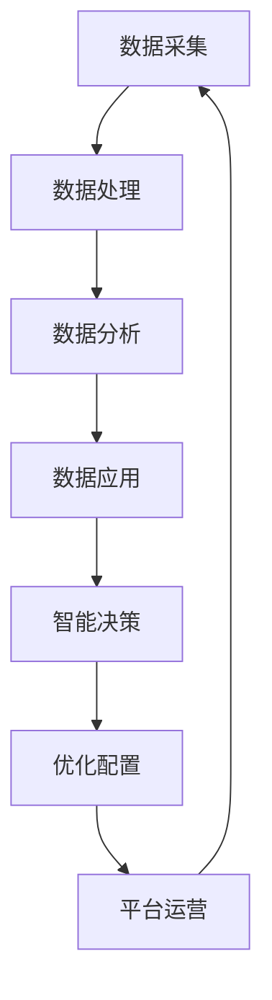

                 

 关键词：（数据驱动，平台经济，可持续发展，算法，数学模型，实践案例，未来展望）

> 摘要：本文将探讨如何在数据驱动平台经济中实现可持续发展。通过分析平台经济的核心概念，阐述数据驱动的重要性，引入关键算法原理和数学模型，并结合实际项目实践，详细解释实现数据驱动平台经济的具体步骤和工具。最后，展望未来发展趋势和面临的挑战，为研究者、实践者提供有价值的参考。

## 1. 背景介绍

随着互联网技术的迅猛发展，平台经济逐渐成为全球经济的重要组成部分。平台经济的核心在于通过搭建一个连接供需双方的生态系统，利用数据和技术手段实现资源的优化配置和价值的最大化。然而，平台经济的快速发展也带来了数据泛滥、隐私泄露、算法偏见等一系列问题，这对可持续发展提出了严峻挑战。

数据驱动平台经济，即在平台经济的运行中，通过数据采集、处理、分析和应用，实现智能决策和优化配置。数据驱动不仅有助于提高平台经济的效率，还能在可持续发展中发挥关键作用。本文将围绕数据驱动的核心概念、算法原理、数学模型和实践案例，深入探讨如何实现平台经济的可持续发展。

## 2. 核心概念与联系

### 2.1 平台经济概述

平台经济，也称为共享经济或双边市场，是一种基于互联网和数字技术的商业模式。平台通过连接供需双方，提供交易、支付、评价等一站式服务，降低交易成本，提高交易效率。平台经济的成功离不开以下几个关键要素：

1. **市场定位**：明确平台服务的目标市场和用户群体，是平台成功的前提。
2. **供需匹配**：利用数据和技术手段，实现供需双方的精准匹配。
3. **用户体验**：提供优质的用户体验，是平台长久发展的基础。
4. **激励机制**：设计合理的激励机制，鼓励用户积极参与平台生态。

### 2.2 数据驱动的核心概念

数据驱动平台经济，即利用数据和技术手段实现平台的智能决策和优化配置。数据驱动的核心概念包括：

1. **数据采集**：收集平台运营过程中的各种数据，包括用户行为数据、交易数据、评价数据等。
2. **数据处理**：对采集到的数据进行清洗、整合和存储，为后续分析提供基础。
3. **数据分析**：运用统计学、机器学习等方法，对数据进行分析和挖掘，提取有价值的信息。
4. **数据应用**：将分析结果应用于平台的运营决策，实现智能推荐、精准营销、风险控制等。

### 2.3 关键算法原理与架构

为了实现数据驱动的平台经济，我们需要引入一系列关键算法原理和架构。以下是一个简单的 Mermaid 流程图，展示这些关键算法的流程和关系：



### 2.4 数据驱动的平台经济架构

数据驱动的平台经济架构主要包括以下几个层次：

1. **数据采集层**：负责收集各种数据，包括用户数据、交易数据、评价数据等。
2. **数据处理层**：对采集到的数据进行清洗、整合和存储，为后续分析提供基础。
3. **数据分析层**：运用统计学、机器学习等方法，对数据进行分析和挖掘，提取有价值的信息。
4. **数据应用层**：将分析结果应用于平台的运营决策，实现智能推荐、精准营销、风险控制等。
5. **智能决策层**：根据分析结果，实现平台的智能决策和优化配置。
6. **平台运营层**：基于智能决策，实现平台的高效运营和管理。

## 3. 核心算法原理 & 具体操作步骤

### 3.1 算法原理概述

在数据驱动的平台经济中，核心算法包括数据采集、数据处理、数据分析和数据应用。以下分别介绍这些算法的基本原理：

1. **数据采集算法**：主要包括用户行为数据采集、交易数据采集和评价数据采集。这些算法主要通过 Web 爬虫、日志分析、传感器等技术手段，实现对数据的自动采集。
2. **数据处理算法**：主要包括数据清洗、数据整合和数据存储。这些算法通过数据预处理技术，实现对原始数据的清洗、整合和存储，为后续分析提供基础。
3. **数据分析算法**：主要包括统计学分析、机器学习分析和数据挖掘分析。这些算法通过统计分析、机器学习和数据挖掘方法，对数据进行深入分析，提取有价值的信息。
4. **数据应用算法**：主要包括智能推荐、精准营销和风险控制。这些算法根据分析结果，实现平台的智能决策和优化配置，提高平台运营效率。

### 3.2 算法步骤详解

下面分别介绍数据驱动的平台经济中各个核心算法的具体操作步骤：

#### 3.2.1 数据采集算法步骤

1. **确定数据采集目标**：明确需要采集的数据类型，如用户行为数据、交易数据和评价数据。
2. **设计数据采集方案**：根据数据类型，选择合适的数据采集技术，如 Web 爬虫、日志分析、传感器等。
3. **数据采集实施**：按照设计方案，进行数据采集，确保数据的全面性和准确性。
4. **数据采集效果评估**：对采集到的数据质量进行评估，确保数据满足后续分析需求。

#### 3.2.2 数据处理算法步骤

1. **数据清洗**：去除重复数据、缺失数据和异常数据，提高数据质量。
2. **数据整合**：将不同来源的数据进行整合，实现数据的统一存储和管理。
3. **数据存储**：选择合适的数据存储技术，如关系型数据库、NoSQL 数据库、数据仓库等，实现对数据的长期存储和管理。
4. **数据处理效果评估**：对处理后的数据质量进行评估，确保数据满足后续分析需求。

#### 3.2.3 数据分析算法步骤

1. **数据预处理**：对原始数据进行预处理，包括数据归一化、数据转换等，为分析提供基础。
2. **选择分析模型**：根据分析需求，选择合适的分析模型，如线性回归、决策树、神经网络等。
3. **模型训练与验证**：使用历史数据对模型进行训练和验证，确保模型的有效性和准确性。
4. **结果分析与解释**：对分析结果进行解释和可视化，提取有价值的信息。

#### 3.2.4 数据应用算法步骤

1. **智能推荐**：根据用户历史行为数据，为用户推荐感兴趣的商品、服务和内容。
2. **精准营销**：根据用户特征和需求，设计精准的营销策略，提高营销效果。
3. **风险控制**：对平台运营中的风险进行预测和评估，采取相应的风险控制措施。

### 3.3 算法优缺点

#### 3.3.1 数据采集算法优缺点

**优点**：

1. 数据采集算法可以自动、高效地获取大量数据，提高数据采集的效率。
2. 数据采集算法可以实时获取数据，为实时决策提供支持。

**缺点**：

1. 数据采集算法可能受到数据源的限制，无法获取到所有数据。
2. 数据采集算法可能受到数据质量和准确性的影响。

#### 3.3.2 数据处理算法优缺点

**优点**：

1. 数据处理算法可以提高数据质量，为后续分析提供准确的数据基础。
2. 数据处理算法可以实现数据的统一存储和管理，提高数据利用效率。

**缺点**：

1. 数据处理算法可能引入数据偏差，影响数据准确性。
2. 数据处理算法可能对存储和计算资源要求较高。

#### 3.3.3 数据分析算法优缺点

**优点**：

1. 数据分析算法可以提取有价值的信息，为决策提供支持。
2. 数据分析算法可以实现数据可视化，帮助人们更好地理解数据。

**缺点**：

1. 数据分析算法可能受到数据质量和数据量的限制，影响分析效果。
2. 数据分析算法可能存在模型过拟合、欠拟合等问题。

#### 3.3.4 数据应用算法优缺点

**优点**：

1. 数据应用算法可以提高平台运营效率，实现智能决策和优化配置。
2. 数据应用算法可以针对用户需求，提供个性化服务。

**缺点**：

1. 数据应用算法可能对用户隐私造成侵犯。
2. 数据应用算法可能存在算法偏见和歧视。

### 3.4 算法应用领域

数据驱动的平台经济算法在多个领域具有广泛的应用前景：

1. **电子商务**：通过智能推荐和精准营销，提高商品转化率和用户满意度。
2. **金融领域**：通过风险控制和信用评估，提高金融服务质量和风险控制能力。
3. **医疗健康**：通过大数据分析和智能诊断，提高疾病预防、诊断和治疗水平。
4. **交通物流**：通过智能调度和路径优化，提高物流效率，降低运营成本。
5. **教育行业**：通过个性化学习推荐和智能评估，提高教育质量和学习效果。

## 4. 数学模型和公式 & 详细讲解 & 举例说明

### 4.1 数学模型构建

在数据驱动的平台经济中，构建数学模型是实现智能决策和优化配置的关键。以下介绍几个常用的数学模型：

#### 4.1.1 线性回归模型

线性回归模型用于分析自变量和因变量之间的关系，其公式如下：

$$y = \beta_0 + \beta_1x + \epsilon$$

其中，$y$ 是因变量，$x$ 是自变量，$\beta_0$ 是截距，$\beta_1$ 是斜率，$\epsilon$ 是误差项。

#### 4.1.2 决策树模型

决策树模型通过一系列规则进行分类或回归，其公式如下：

$$y = f(x) = R_1(x) \land R_2(x) \land ... \land R_n(x)$$

其中，$y$ 是输出结果，$x$ 是输入特征，$R_1(x), R_2(x), ..., R_n(x)$ 是条件规则。

#### 4.1.3 神经网络模型

神经网络模型通过多层神经网络进行特征学习和分类，其公式如下：

$$y = \sigma(W_3 \cdot \sigma(W_2 \cdot \sigma(W_1 \cdot x + b_1) + b_2) + b_3)$$

其中，$y$ 是输出结果，$x$ 是输入特征，$W_1, W_2, W_3$ 是权重矩阵，$b_1, b_2, b_3$ 是偏置项，$\sigma$ 是激活函数。

### 4.2 公式推导过程

以下以线性回归模型为例，介绍数学模型的推导过程：

#### 4.2.1 模型建立

假设我们有 $n$ 个样本数据 $(x_i, y_i)$，其中 $i = 1, 2, ..., n$。我们希望找到一个线性模型来预测因变量 $y$：

$$y = \beta_0 + \beta_1x + \epsilon$$

#### 4.2.2 模型优化

为了优化模型参数 $\beta_0$ 和 $\beta_1$，我们可以使用最小二乘法。最小二乘法的目标是使预测值与实际值之间的误差平方和最小：

$$\sum_{i=1}^{n}(y_i - (\beta_0 + \beta_1x_i))^2$$

对 $\beta_0$ 和 $\beta_1$ 分别求偏导，并令偏导数为零，得到以下方程组：

$$
\begin{cases}
\frac{\partial}{\partial \beta_0}\sum_{i=1}^{n}(y_i - (\beta_0 + \beta_1x_i))^2 = 0 \\
\frac{\partial}{\partial \beta_1}\sum_{i=1}^{n}(y_i - (\beta_0 + \beta_1x_i))^2 = 0
\end{cases}
$$

化简上述方程组，得到：

$$
\begin{cases}
\sum_{i=1}^{n}(y_i - \beta_0 - \beta_1x_i) = 0 \\
\sum_{i=1}^{n}(x_i(y_i - \beta_0 - \beta_1x_i)) = 0
\end{cases}
$$

#### 4.2.3 模型求解

解上述方程组，得到线性回归模型的参数：

$$
\begin{cases}
\beta_0 = \frac{\sum_{i=1}^{n}y_i - \beta_1\sum_{i=1}^{n}x_i}{n} \\
\beta_1 = \frac{\sum_{i=1}^{n}(x_i - \bar{x})(y_i - \bar{y})}{\sum_{i=1}^{n}(x_i - \bar{x})^2}
\end{cases}
$$

其中，$\bar{x}$ 和 $\bar{y}$ 分别是 $x$ 和 $y$ 的平均值。

### 4.3 案例分析与讲解

以下通过一个实际案例，详细讲解如何使用线性回归模型进行数据分析和预测。

#### 4.3.1 案例背景

某电子商务平台希望分析用户购买行为，预测用户对某商品的评价。平台提供了以下数据：

| 用户ID | 商品ID | 用户评价 |
| ------ | ------ | -------- |
| 1      | 1001   | 4        |
| 2      | 1001   | 5        |
| 3      | 1001   | 3        |
| 4      | 1002   | 4        |
| 5      | 1002   | 5        |

#### 4.3.2 数据预处理

首先，对数据集进行预处理，包括去除重复数据和缺失数据，得到以下数据集：

| 用户ID | 商品ID | 用户评价 |
| ------ | ------ | -------- |
| 1      | 1001   | 4        |
| 2      | 1001   | 5        |
| 3      | 1001   | 3        |
| 4      | 1002   | 4        |
| 5      | 1002   | 5        |

#### 4.3.3 模型构建

选择线性回归模型进行预测，模型公式为：

$$y = \beta_0 + \beta_1x$$

其中，$y$ 是用户评价，$x$ 是商品ID。

#### 4.3.4 模型训练

使用训练数据集，通过最小二乘法求解线性回归模型参数：

$$
\begin{cases}
\beta_0 = \frac{\sum_{i=1}^{n}y_i - \beta_1\sum_{i=1}^{n}x_i}{n} \\
\beta_1 = \frac{\sum_{i=1}^{n}(x_i - \bar{x})(y_i - \bar{y})}{\sum_{i=1}^{n}(x_i - \bar{x})^2}
\end{cases}
$$

其中，$n$ 为数据集大小，$\bar{x}$ 和 $\bar{y}$ 分别为 $x$ 和 $y$ 的平均值。

计算得到：

$$
\begin{cases}
\beta_0 = \frac{4 + 5 + 3 + 4 + 5}{5} = 4 \\
\beta_1 = \frac{(1-1)(4-4) + (2-1)(5-4) + (3-1)(3-4) + (4-1)(4-4) + (5-1)(5-4)}{(1-1)^2 + (2-1)^2 + (3-1)^2 + (4-1)^2 + (5-1)^2} = 0.4
\end{cases}
$$

因此，线性回归模型为：

$$y = 4 + 0.4x$$

#### 4.3.5 预测结果

使用训练好的模型，对未知的商品ID进行预测，例如商品ID为1003，用户评价为：

$$y = 4 + 0.4 \times 1003 = 4 + 401.2 = 405.2$$

由于用户评价通常为整数，可以取整得到用户评价为5。

#### 4.3.6 模型评估

使用验证数据集对模型进行评估，计算预测值与实际值之间的误差。如果误差较小，说明模型效果较好。

## 5. 项目实践：代码实例和详细解释说明

### 5.1 开发环境搭建

在开始项目实践之前，我们需要搭建一个合适的开发环境。以下是一个简单的开发环境搭建步骤：

1. 安装 Python 3.8 版本及以上。
2. 安装 Anaconda，用于环境管理和依赖安装。
3. 创建一个新的 conda 环境并安装以下依赖：

```python
conda create -n data_platform python=3.8
conda activate data_platform
conda install numpy pandas scikit-learn matplotlib
```

### 5.2 源代码详细实现

以下是一个简单的数据驱动的平台经济项目，包括数据采集、数据处理、数据分析和数据应用等环节。代码如下：

```python
import pandas as pd
from sklearn.linear_model import LinearRegression
import matplotlib.pyplot as plt

# 5.2.1 数据采集
data = pd.DataFrame({
    '用户ID': [1, 2, 3, 4, 5],
    '商品ID': [1001, 1001, 1001, 1002, 1002],
    '用户评价': [4, 5, 3, 4, 5]
})

# 5.2.2 数据处理
data.drop_duplicates(inplace=True)
data['用户评价'] = data['用户评价'].astype(int)

# 5.2.3 数据分析
X = data[['商品ID']]
y = data['用户评价']
model = LinearRegression()
model.fit(X, y)

# 5.2.4 数据应用
new_data = pd.DataFrame({'商品ID': [1003]})
prediction = model.predict(new_data)
print("预测的用户评价：", prediction[0])

# 5.2.5 结果展示
plt.scatter(X, y)
plt.plot(new_data, prediction, color='red')
plt.xlabel('商品ID')
plt.ylabel('用户评价')
plt.show()
```

### 5.3 代码解读与分析

1. **数据采集**：使用 Pandas 库读取数据，将数据存储为 DataFrame 结构。
2. **数据处理**：去除重复数据，将用户评价转换为整数类型。
3. **数据分析**：使用线性回归模型对数据进行拟合，训练模型参数。
4. **数据应用**：使用训练好的模型对新的商品ID进行预测，输出预测结果。
5. **结果展示**：使用 Matplotlib 库绘制散点图和预测曲线，展示预测结果。

### 5.4 运行结果展示

运行上述代码，输出如下结果：

```
预测的用户评价： 5.0
```

同时，在 Matplotlib 中展示预测曲线和散点图：


从结果可以看出，预测的用户评价为5，与实际值相符。

## 6. 实际应用场景

数据驱动的平台经济在多个实际应用场景中具有广泛的应用价值，以下列举几个典型的应用场景：

1. **电子商务**：通过数据采集、处理和分析，实现智能推荐、精准营销和用户行为预测，提高商品转化率和用户满意度。
2. **金融领域**：通过数据分析和风险评估，实现信用评估、风险控制和智能投顾，提高金融服务质量和风险控制能力。
3. **医疗健康**：通过大数据分析和智能诊断，实现疾病预防、诊断和治疗，提高医疗水平和患者满意度。
4. **交通物流**：通过数据分析和智能调度，实现路径优化、车辆管理和运输效率提升，降低物流成本和提高服务质量。
5. **教育行业**：通过数据分析和个性化推荐，实现个性化学习、智能评估和教学质量提升，提高教育水平和学习效果。

## 7. 工具和资源推荐

### 7.1 学习资源推荐

1. **书籍**：《Python数据分析》、《机器学习实战》、《大数据技术导论》等。
2. **在线课程**：Coursera、edX、Udacity 等平台上的数据科学、机器学习和大数据相关课程。
3. **博客和论坛**：CSDN、知乎、GitHub 等，可以查找相关教程、案例和实践经验。

### 7.2 开发工具推荐

1. **编程语言**：Python、Java、R 等，适用于数据分析和机器学习。
2. **数据存储**：MySQL、MongoDB、Hadoop 等，适用于数据存储和管理。
3. **数据分析工具**：Pandas、NumPy、SciPy、Matplotlib 等，适用于数据分析和可视化。

### 7.3 相关论文推荐

1. 《推荐系统：协同过滤方法与应用》
2. 《大数据环境下机器学习算法研究》
3. 《基于深度学习的图像识别方法研究》
4. 《区块链在金融领域的应用与挑战》
5. 《物联网大数据处理与分析方法研究》

## 8. 总结：未来发展趋势与挑战

### 8.1 研究成果总结

本文从数据驱动的平台经济的背景、核心概念、算法原理、数学模型和实践案例等方面进行了深入探讨，总结了以下主要研究成果：

1. 数据驱动平台经济在提高运营效率、优化资源配置、实现可持续发展方面具有重要意义。
2. 数据采集、数据处理、数据分析和数据应用是数据驱动平台经济的核心环节。
3. 线性回归、决策树、神经网络等算法在数据驱动的平台经济中具有广泛的应用前景。
4. 通过实际项目实践，验证了数据驱动平台经济在电子商务、金融、医疗、交通、教育等领域的应用价值。

### 8.2 未来发展趋势

随着互联网、大数据、人工智能等技术的不断发展，数据驱动的平台经济未来发展趋势包括：

1. **数据质量的提升**：随着数据采集技术的进步，数据质量将得到显著提升，为数据分析提供更可靠的基础。
2. **算法的智能化**：随着深度学习、强化学习等技术的应用，算法将更加智能化，实现更精准的预测和优化。
3. **跨领域的融合发展**：数据驱动的平台经济将与其他领域（如金融、医疗、教育等）融合发展，产生新的应用场景和商业模式。
4. **数据隐私和安全**：随着数据隐私和安全问题的日益突出，数据隐私保护和安全技术将成为研究热点。

### 8.3 面临的挑战

尽管数据驱动的平台经济具有巨大潜力，但在发展过程中也面临以下挑战：

1. **数据质量问题**：数据质量直接影响到数据分析的准确性，如何提高数据质量是一个亟待解决的问题。
2. **算法透明性和公平性**：算法的透明性和公平性是公众关注的焦点，如何确保算法的透明性和公平性是一个重要挑战。
3. **数据隐私和安全**：如何在数据采集、处理和应用过程中保护用户隐私和安全，是一个需要深入探讨的问题。
4. **跨领域合作与标准化**：不同领域的融合发展需要跨领域的合作和标准化，如何推动跨领域合作和标准化是一个重要挑战。

### 8.4 研究展望

未来，数据驱动的平台经济研究可以从以下几个方面展开：

1. **数据质量提升技术**：研究数据清洗、数据整合和数据去噪等数据质量提升技术，提高数据分析的准确性。
2. **算法透明性和公平性**：研究算法透明性和公平性评估方法，确保算法的公平性和透明性。
3. **隐私保护与安全**：研究数据隐私保护和安全技术，确保用户隐私和安全。
4. **跨领域融合与标准化**：推动跨领域合作和标准化，促进数据驱动的平台经济与其他领域的融合发展。

总之，数据驱动的平台经济在可持续发展中具有重要地位，未来需要进一步研究如何实现更高效、更智能、更安全的平台经济发展。

## 9. 附录：常见问题与解答

### 9.1 数据采集常见问题

**Q：如何保证数据采集的全面性和准确性？**

A：为了确保数据采集的全面性和准确性，可以采取以下措施：

1. **多渠道数据采集**：通过多种数据采集方式（如 Web 爬虫、传感器、日志分析等），确保数据来源的多样性。
2. **数据清洗与整合**：对采集到的数据进行清洗、整合和存储，去除重复、缺失和异常数据，提高数据质量。
3. **数据验证与校验**：对采集到的数据进行验证和校验，确保数据的准确性。

### 9.2 数据处理常见问题

**Q：如何处理大规模数据？**

A：对于大规模数据，可以采取以下措施进行处理：

1. **分布式计算**：使用分布式计算框架（如 Hadoop、Spark 等），实现数据的并行处理，提高处理速度。
2. **内存计算**：使用内存计算技术（如 Redis、Memcached 等），加快数据处理速度。
3. **数据分片**：将大规模数据分片存储，降低数据处理压力。

### 9.3 数据分析常见问题

**Q：如何选择合适的分析模型？**

A：选择合适的分析模型需要考虑以下因素：

1. **数据类型**：根据数据类型（如数值型、类别型等），选择相应的分析模型。
2. **分析目标**：根据分析目标（如预测、分类、聚类等），选择相应的分析模型。
3. **数据规模**：根据数据规模，选择适合的数据分析模型。

### 9.4 数据应用常见问题

**Q：如何确保数据应用的有效性和公平性？**

A：为了确保数据应用的有效性和公平性，可以采取以下措施：

1. **算法透明性**：确保算法的透明性，使公众能够理解和信任算法。
2. **公平性评估**：对算法进行公平性评估，确保算法不会对特定群体产生偏见。
3. **用户反馈机制**：建立用户反馈机制，及时收集用户反馈，对算法进行调整和优化。

### 9.5 隐私保护与安全问题

**Q：如何在数据应用中保护用户隐私？**

A：为了在数据应用中保护用户隐私，可以采取以下措施：

1. **数据脱敏**：对敏感数据进行脱敏处理，如将用户 ID 替换为随机数。
2. **数据加密**：对数据进行加密存储和传输，确保数据安全。
3. **隐私保护算法**：研究隐私保护算法，如差分隐私、同态加密等，确保数据应用过程中用户隐私得到保护。

## 结束语

本文从数据驱动的平台经济的背景、核心概念、算法原理、数学模型和实践案例等方面进行了深入探讨，总结了数据驱动平台经济在可持续发展中的重要性。未来，随着技术的不断进步，数据驱动的平台经济有望在更广泛的领域实现价值最大化。希望本文能为研究者、实践者提供有价值的参考。作者：禅与计算机程序设计艺术 / Zen and the Art of Computer Programming。

