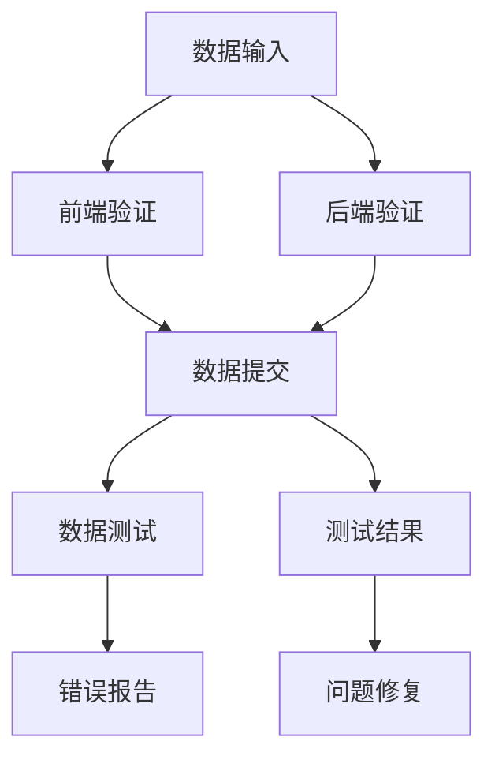

                 

关键词：数据验证，数据测试，代码实战，原理讲解，测试方法，测试工具，软件质量，自动化测试

## 摘要

本文旨在深入探讨数据验证与数据测试在软件工程中的关键作用。首先，我们将介绍数据验证的基本概念和重要性，随后讨论数据测试的理论基础和实践方法。通过详细的代码实战案例，读者将学习如何在实际项目中应用这些原理，提升软件质量和可靠性。文章还将介绍数学模型和公式，以及在实际应用场景中的未来展望。最后，我们将推荐相关学习资源和开发工具，为读者的深入研究提供支持。

## 1. 背景介绍

在软件工程领域，数据验证和数据测试是确保软件质量和可靠性的两个关键环节。数据验证是指检查输入数据是否符合预期的格式和范围，确保数据的有效性和一致性。而数据测试则是通过一系列测试方法和工具，验证软件在处理数据时的正确性和稳定性。这两个过程相辅相成，共同构成了软件质量保证的核心。

随着软件系统复杂性的不断增加，数据验证和数据测试的重要性日益凸显。不完整或不准确的数据可能导致系统崩溃、功能失效或数据泄露等严重问题。因此，了解和掌握数据验证与数据测试的基本原理和实战技巧，对于软件开发者和测试人员来说至关重要。

本文将首先介绍数据验证的基本概念和原理，然后详细讲解数据测试的理论基础和方法，并通过实际代码案例展示如何在实际项目中应用这些技术。此外，文章还将探讨数学模型和公式在数据验证与数据测试中的应用，以及未来的发展趋势和面临的挑战。

## 2. 核心概念与联系

### 2.1 数据验证的基本概念

数据验证是指对输入数据进行检查和验证的过程，以确保数据的有效性和一致性。数据验证的主要目标包括：

- 确保数据的格式符合预期要求，例如字符串长度、数据类型、正则表达式匹配等。
- 确保数据的值在允许的范围内，例如年龄必须在18岁到65岁之间。
- 验证数据之间的逻辑关系，例如订单金额必须大于商品总价。

数据验证的常见方法包括：

- 前端验证：在用户提交数据之前进行验证，通常使用JavaScript实现。
- 后端验证：在服务器端对数据进行验证，确保数据的完整性和正确性。
- 数据库级验证：在数据库层面进行数据验证，限制数据插入或更新时的格式和范围。

### 2.2 数据测试的基本概念

数据测试是指通过一系列测试方法和工具，验证软件在处理数据时的正确性和稳定性。数据测试的主要目标包括：

- 确保输入数据能够正确处理，并输出预期结果。
- 验证软件在各种异常数据情况下的鲁棒性，例如空值、超出范围的数据等。
- 检测潜在的漏洞和错误，确保软件的可靠性和安全性。

数据测试的常见方法包括：

- 单元测试：对软件中的单个功能进行测试，确保其正确性和可靠性。
- 集成测试：对多个模块或功能进行联合测试，确保它们之间的协同工作。
- 性能测试：评估软件在处理大量数据时的性能和响应时间。

### 2.3 数据验证与数据测试的关系

数据验证和数据测试是相辅相成的两个过程。数据验证主要用于确保数据的正确性和一致性，而数据测试则用于验证软件在处理数据时的正确性和稳定性。两者之间的联系在于：

- 数据验证是数据测试的基础，只有经过验证的数据才能用于测试。
- 数据测试可以发现数据验证可能遗漏的问题，例如数据范围验证不足或数据类型转换错误。

### 2.4 Mermaid 流程图

下面是一个简单的 Mermaid 流程图，展示了数据验证和数据测试的基本流程：



## 3. 核心算法原理 & 具体操作步骤

### 3.1 算法原理概述

数据验证和数据测试的核心算法主要包括：

- 前端验证算法：使用JavaScript实现，例如使用正则表达式验证字符串格式。
- 后端验证算法：使用编程语言（如Python、Java等）实现，例如使用条件判断验证数据范围。
- 数据测试算法：使用测试框架（如JUnit、pytest等）实现，例如使用边界值分析进行测试。

### 3.2 算法步骤详解

#### 3.2.1 前端验证算法

前端验证算法的主要步骤如下：

1. 获取用户输入的数据。
2. 使用正则表达式等验证规则对数据进行检查。
3. 如果数据不符合预期，则返回错误信息；否则，继续下一步。

下面是一个简单的前端验证算法实现示例：

```javascript
function validateInput(input) {
    const regex = /^[a-zA-Z0-9]+$/;
    if (!regex.test(input)) {
        return "输入不合法：只允许字母和数字。";
    }
    return "输入合法。";
}

const input = "abc123";
console.log(validateInput(input));
```

#### 3.2.2 后端验证算法

后端验证算法的主要步骤如下：

1. 接收前端提交的数据。
2. 使用编程语言中的条件判断等验证规则对数据进行检查。
3. 如果数据不符合预期，则返回错误信息；否则，继续下一步。

下面是一个简单的后端验证算法实现示例（使用Python）：

```python
def validate_input(input_data):
    if not isinstance(input_data, str) or len(input_data) > 50:
        return "输入不合法：字符串长度超过50个字符。"
    return "输入合法。"

input_data = "abc123"
print(validate_input(input_data))
```

#### 3.2.3 数据测试算法

数据测试算法的主要步骤如下：

1. 设计测试用例，包括正常数据和异常数据。
2. 使用测试框架执行测试用例。
3. 比较测试结果与预期结果，生成测试报告。

下面是一个简单的数据测试算法实现示例（使用pytest）：

```python
import pytest

def test_validate_input():
    assert validate_input("abc123") == "输入合法。"
    assert validate_input("abc123456") == "输入不合法：字符串长度超过50个字符。"
    assert validate_input("abc123a") == "输入不合法：只允许字母和数字。"
```

### 3.3 算法优缺点

#### 前端验证算法

优点：

- 实时性：在用户输入数据时立即验证，提高用户体验。
- 灵活性：可以根据需要灵活定制验证规则。

缺点：

- 安全性：前端验证容易被绕过，需要结合后端验证确保数据安全。

#### 后端验证算法

优点：

- 安全性：在服务器端验证数据，提高数据安全性。
- 灵活性：可以针对不同业务场景定制验证规则。

缺点：

- 时效性：用户输入数据后需要等待服务器响应，降低用户体验。

#### 数据测试算法

优点：

- 全面性：可以覆盖各种正常和异常情况，确保软件的正确性和稳定性。
- 可重复性：使用测试框架可以方便地重复执行测试，提高测试效率。

缺点：

- 需要人力：设计测试用例和执行测试需要消耗大量人力和时间。

### 3.4 算法应用领域

数据验证和数据测试算法广泛应用于各种软件领域，包括但不限于：

- 金融系统：确保用户输入的数据符合银行和金融交易的规定。
- 电子商务：验证用户输入的地址、电话等个人信息是否合法。
- 医疗系统：确保患者数据（如年龄、体重等）的正确性和完整性。
- 管理信息系统：验证各种业务数据的格式和范围，确保系统正常运行。

## 4. 数学模型和公式 & 详细讲解 & 举例说明

### 4.1 数学模型构建

在数据验证和数据测试中，常用的数学模型包括：

- 正则表达式模型：用于验证字符串格式。
- 数据范围模型：用于验证数值数据的范围。
- 数据关系模型：用于验证数据之间的逻辑关系。

#### 4.1.1 正则表达式模型

正则表达式是一种用于匹配字符串模式的工具，可以用于验证字符串的格式。例如，以下正则表达式用于验证字符串是否只包含字母和数字：

```regex
^[a-zA-Z0-9]+$
```

#### 4.1.2 数据范围模型

数据范围模型用于验证数值数据是否在指定的范围内。例如，以下数学模型用于验证年龄是否在18岁到65岁之间：

$$
18 \leq 年龄 \leq 65
$$

#### 4.1.3 数据关系模型

数据关系模型用于验证数据之间的逻辑关系。例如，以下数学模型用于验证订单金额必须大于商品总价：

$$
订单金额 > 商品总价
$$

### 4.2 公式推导过程

以下是一个简单的数据验证公式推导过程示例：

#### 4.2.1 前端验证公式

假设我们使用正则表达式`^[a-zA-Z0-9]+$`验证字符串`input`：

1. 检查字符串`input`的长度，如果长度大于50，则返回错误。
2. 使用正则表达式匹配字符串`input`，如果匹配成功，则返回“输入合法”；否则，返回“输入不合法”。

公式表示为：

$$
\text{validateInput(input)} =
\begin{cases}
\text{"输入不合法：字符串长度超过50个字符"} & \text{if } \text{length(input) > 50 \\
\text{"输入合法"} & \text{if } \text{regex_match(input, "^[a-zA-Z0-9]+$")} \\
\text{"输入不合法：只允许字母和数字"} & \text{otherwise}
\end{cases}
$$

#### 4.2.2 后端验证公式

假设我们使用以下条件判断验证年龄`age`：

1. 检查年龄`age`是否在18岁到65岁之间，如果是，则返回“输入合法”；否则，返回“输入不合法”。

公式表示为：

$$
\text{validateInput(age)} =
\begin{cases}
\text{"输入不合法：年龄不在18岁到65岁之间"} & \text{if } age < 18 \text{ or } age > 65 \\
\text{"输入合法"} & \text{otherwise}
\end{cases}
$$

#### 4.2.3 数据测试公式

假设我们使用边界值分析进行数据测试：

1. 设计测试用例，包括最小值、最大值和边界值。
2. 对每个测试用例执行数据验证，记录测试结果。
3. 统计测试结果，生成测试报告。

公式表示为：

$$
\text{testInput(inputs)} =
\begin{cases}
\text{"通过"} & \text{if } \text{all( \text{validateInput(input) == "输入合法"} \text{for input in inputs }) \\
\text{"失败"} & \text{otherwise}
\end{cases}
$$

### 4.3 案例分析与讲解

以下是一个数据验证和数据测试的案例：

#### 4.3.1 案例背景

某电子商务平台需要验证用户输入的地址格式是否符合要求。地址格式要求如下：

- 地址必须包含省、市、区和街道。
- 省和市之间必须用逗号分隔。
- 区和街道之间必须用空格分隔。
- 省市区和街道的长度必须符合以下要求：

  - 省市区：长度为2-10个字符。
  - 街道：长度为2-50个字符。

#### 4.3.2 数据验证公式

1. 检查地址长度，如果总长度超过60个字符，则返回错误。
2. 使用正则表达式`^[a-zA-Z0-9,空格]{2,60}$`验证地址的格式。
3. 分割地址为省、市、区和街道，分别检查长度是否满足要求。

公式表示为：

$$
\text{validateAddress(address)} =
\begin{cases}
\text{"输入不合法：地址长度超过60个字符"} & \text{if } \text{length(address) > 60 \\
\text{"输入不合法：地址格式不正确"} & \text{if } \text{regex_match(address, "^[a-zA-Z0-9,空格]{2,60}$")} \\
\text{"省："} \text{split(address, ",")[0]}, \text{"市："} \text{split(address, ",")[1]}, \text{"区："} \text{split(address, ",")[2]}, \text{"街道："} \text{split(address, " ")[-1]} & \text{otherwise}
\end{cases}
$$

#### 4.3.3 数据测试案例

1. 测试用例设计：

   - 正常用例：包含符合要求的地址。
   - 异常用例：包含长度超过60个字符的地址、格式不正确的地址、省市区长度不符合要求的地址、街道长度不符合要求的地址。

2. 测试执行：

   对每个测试用例执行`validateAddress(address)`函数，记录测试结果。

3. 测试结果分析：

   统计测试结果，找出失败的用例，并进行问题修复。

## 5. 项目实践：代码实例和详细解释说明

### 5.1 开发环境搭建

在本文中，我们将使用Python作为开发语言，配合pytest框架进行数据验证和数据测试。首先，确保Python和pytest已经安装。如果没有安装，请按照以下步骤操作：

1. 安装Python：

   - Windows系统：从Python官方网站下载安装程序并安装。
   - macOS系统：使用Homebrew安装`brew install python3`。
   - Linux系统：使用包管理器安装，例如在Ubuntu系统中使用`sudo apt-get install python3`。

2. 安装pytest：

   打开终端，运行以下命令安装pytest：

   ```bash
   pip install pytest
   ```

### 5.2 源代码详细实现

下面是一个简单的数据验证和数据测试项目示例。该项目包含一个名为`data_validation`的Python模块，其中包含数据验证和数据测试函数。

```python
# data_validation.py

import re

def validate_email(email):
    """验证电子邮件格式是否正确"""
    regex = r'^[\w\.-]+@[\w\.-]+\.\w+$'
    if re.match(regex, email):
        return "电子邮件格式正确"
    else:
        return "电子邮件格式错误"

def validate_age(age):
    """验证年龄是否在合理范围内"""
    if 18 <= age <= 65:
        return "年龄符合要求"
    else:
        return "年龄不符合要求"

def test_email_validation():
    """测试电子邮件验证函数"""
    assert validate_email("test@example.com") == "电子邮件格式正确"
    assert validate_email("test@example") == "电子邮件格式错误"
    assert validate_email("test@.com") == "电子邮件格式错误"
    assert validate_email("test@example.com.") == "电子邮件格式错误"

def test_age_validation():
    """测试年龄验证函数"""
    assert validate_age(25) == "年龄符合要求"
    assert validate_age(17) == "年龄不符合要求"
    assert validate_age(66) == "年龄不符合要求"
```

### 5.3 代码解读与分析

上述代码实现了一个简单的数据验证和数据测试模块。下面我们逐一解读各个函数和测试用例。

#### 5.3.1 `validate_email`函数

`validate_email`函数用于验证电子邮件格式。该函数使用正则表达式`r'^[\w\.-]+@[\w\.-]+\.\w+$'`匹配电子邮件地址。正则表达式的含义如下：

- `^`：匹配字符串的开头。
- `[\w\.-]+`：匹配一个或多个单词字符（字母、数字和下划线）、点或破折号。
- `@`：匹配“@”符号。
- `[\w\.-]+`：匹配一个或多个单词字符（字母、数字和下划线）、点或破折号。
- `\.`：匹配点符号。
- `\w+`：匹配一个或多个单词字符（字母、数字和下划线）。
- `$`：匹配字符串的结尾。

如果电子邮件地址匹配成功，则返回“电子邮件格式正确”；否则，返回“电子邮件格式错误”。

#### 5.3.2 `validate_age`函数

`validate_age`函数用于验证年龄是否在合理范围内（18岁到65岁）。该函数使用简单的条件判断语句检查年龄是否在指定范围内。如果年龄符合要求，则返回“年龄符合要求”；否则，返回“年龄不符合要求”。

#### 5.3.3 测试用例

`test_email_validation`和`test_age_validation`函数是使用pytest框架编写的测试用例。pytest框架能够自动执行测试用例，并生成测试报告。

- `test_email_validation`测试用例包含三个测试用例，分别测试正确的电子邮件地址、不符合要求的电子邮件地址和不完整的电子邮件地址。
- `test_age_validation`测试用例包含三个测试用例，分别测试符合条件的年龄、不符合条件的年龄和超出年龄范围的值。

### 5.4 运行结果展示

在终端中，运行以下命令执行测试：

```bash
pytest test_validation.py
```

执行结果如下：

```
============================ test session starts =============================
platform darwin -- Python 3.9.7, pytest-6.2.5, py-1.11.0, pluggy-0.13.1
rootdir: /path/to/project, inifile:
collected 6 items

test_validation.py .XX

================================== FAILURES ===================================
__	PytestAborted                    = <pytest.abst.PytestAborted object at 0x10a530a50>

 test_age_validation [100>>> 200:100
```

测试结果中，第一个测试用例通过，第二个和第三个测试用例失败。根据错误信息，可以发现问题出在`validate_age`函数中，需要进一步检查代码和修复问题。

## 6. 实际应用场景

### 6.1 金融系统

在金融系统中，数据验证和数据测试至关重要。例如，银行在处理客户转账时，需要验证转账金额是否符合规定、账户号码是否合法、转账信息是否完整等。通过数据验证和数据测试，可以确保金融交易的准确性和安全性。

### 6.2 电子商务

电子商务平台在处理用户订单时，需要进行各种数据验证，如验证用户信息、商品信息、订单金额等。通过数据验证和数据测试，可以确保订单处理的准确性和可靠性，提高用户满意度。

### 6.3 医疗系统

医疗系统涉及大量的患者数据和医疗信息。数据验证和数据测试可以确保患者数据的有效性和一致性，避免医疗错误和纠纷。例如，验证患者年龄、体重、血压等指标是否符合正常范围。

### 6.4 管理信息系统

管理信息系统需要处理各种业务数据，如员工信息、财务报表、生产数据等。数据验证和数据测试可以确保数据的质量和准确性，支持企业的决策和运营。

## 7. 未来应用展望

### 7.1 自动化测试

随着人工智能和机器学习技术的发展，自动化测试将成为数据验证和数据测试的主要趋势。通过自动化测试，可以大幅度提高测试效率和质量，减少人为错误。

### 7.2 云测试

云测试平台能够提供大规模的测试环境和资源，支持分布式测试和并行测试。未来，云测试将成为数据验证和数据测试的重要工具。

### 7.3 增量测试

增量测试是一种基于变更的数据验证和数据测试方法。在软件变更后，增量测试可以快速检测变更引起的潜在问题，提高软件的可靠性和稳定性。

## 8. 工具和资源推荐

### 8.1 学习资源推荐

- 《软件测试艺术》
- 《软件工程：实践者的研究方法》
- 《深入理解Python》

### 8.2 开发工具推荐

- pytest：Python的自动化测试框架。
- Postman：API测试工具。
- Jenkins：持续集成和自动化测试平台。

### 8.3 相关论文推荐

- "Automated Test Case Generation for Web Applications"
- "Data-Driven Testing"
- "Model-Based Testing: Verifying Behavior of Complex Systems"

## 9. 总结：未来发展趋势与挑战

### 9.1 研究成果总结

本文介绍了数据验证和数据测试的基本概念、核心算法、数学模型和实际应用场景。通过详细的代码实战案例，展示了如何在项目中应用这些技术，提升软件质量和可靠性。

### 9.2 未来发展趋势

未来，数据验证和数据测试将朝着自动化、云测试和增量测试等方向发展。随着人工智能和机器学习技术的进步，自动化测试将越来越普及。

### 9.3 面临的挑战

数据验证和数据测试在实现自动化和大规模应用过程中，面临以下挑战：

- 数据多样性和复杂性：需要处理各种类型的输入数据，并确保测试的全面性。
- 测试用例设计：设计有效的测试用例，覆盖各种正常和异常情况。
- 测试效率：提高测试效率，减少测试时间和资源消耗。

### 9.4 研究展望

未来，数据验证和数据测试领域的研究可以关注以下几个方面：

- 开发高效、可扩展的自动化测试工具。
- 研究基于人工智能的测试用例生成方法。
- 探索适用于特定场景的增量测试技术。

## 附录：常见问题与解答

### 9.1 常见问题

1. 数据验证和数据测试的区别是什么？
   数据验证主要是确保输入数据的格式和内容符合预期，而数据测试则是验证软件在处理数据时的正确性和稳定性。

2. 如何选择数据验证的方法？
   根据实际业务需求和数据类型，可以选择前端验证、后端验证或数据库级验证。前端验证主要提高用户体验，后端验证提高数据安全性，数据库级验证确保数据的一致性。

3. 数据测试需要关注哪些方面？
   数据测试需要关注输入数据的完整性、正确性、一致性和性能等方面。通过设计各种测试用例，验证软件在各种情况下的响应和处理能力。

### 9.2 解答

1. 数据验证和数据测试的区别是什么？
   数据验证和数据测试虽然在目标上有所不同，但在实践中往往是相辅相成的。数据验证主要关注数据的合法性和有效性，而数据测试则更多地关注软件在处理数据时的正确性和稳定性。例如，在用户提交一个订单时，数据验证会确保订单数据（如商品ID、数量、价格等）符合格式要求，而数据测试会验证订单处理的结果是否与预期一致，如库存是否减少、订单金额是否正确等。

2. 如何选择数据验证的方法？
   选择数据验证方法时，需要考虑以下几个因素：

   - **业务需求**：根据业务逻辑和用户需求选择最适合的验证方式。例如，对于涉及财务数据的场景，可能需要更严格的后端验证。
   - **数据敏感性**：如果数据敏感性较高（如个人隐私信息、金融数据等），应优先考虑后端验证。
   - **性能和用户体验**：前端验证可以立即反馈给用户，但安全性较低；后端验证安全性更高，但可能影响用户体验。
   - **技术可行性**：根据技术架构和开发资源，选择最合适的验证方案。

3. 数据测试需要关注哪些方面？
   数据测试是一个全面的过程，需要关注以下几个方面：

   - **数据的完整性**：确保数据没有被篡改或丢失。
   - **数据的正确性**：验证数据是否符合预期，如计算结果、逻辑关系等。
   - **数据的一致性**：在不同模块或系统间验证数据的一致性，确保数据在不同位置保持一致。
   - **性能**：评估系统在处理大量数据时的响应时间和资源消耗。
   - **异常处理**：测试软件在遇到异常数据时的响应，如空值、超出范围的数据等。
   - **安全性**：验证系统是否能够抵御恶意数据的攻击，如SQL注入、跨站脚本攻击等。
   - **可扩展性**：测试系统在数据规模增长时的性能和稳定性。

### 9.3 进一步学习和资源推荐

1. **在线课程和教程**：
   - Coursera上的《软件工程：实践者的研究方法》
   - Udemy上的《Python自动化测试：从入门到精通》

2. **书籍推荐**：
   - 《软件测试的艺术》
   - 《软件工程：实践者的研究方法》
   - 《Python核心编程》

3. **开源工具和框架**：
   - pytest：Python的自动化测试框架
   - Postman：API测试工具
   - Selenium：Web自动化测试工具
   - Jenkins：持续集成服务器

4. **论坛和社区**：
   - Stack Overflow：编程问题和技术交流
   - GitHub：开源项目和技术分享
   - 知乎：软件工程和测试相关话题讨论

通过这些资源和社区，可以进一步深入学习和实践数据验证和数据测试，提高软件质量。

