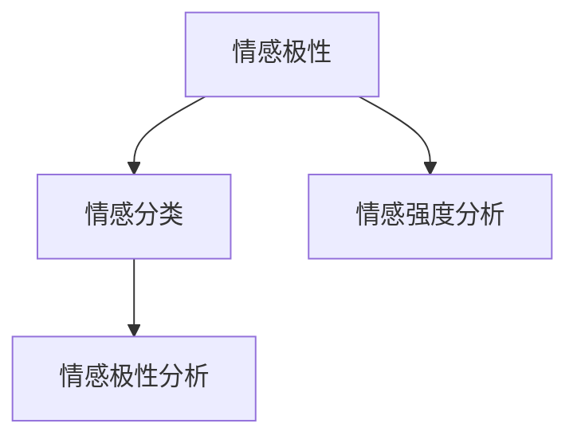

                 

新浪微博作为中国领先的社交媒体平台，其数据量之大，信息之丰富，成为自然语言处理（NLP）研究的理想实验室。特别是在情感分析领域，微博数据的情感多样性、实时性和广泛性，为研究者提供了丰富的素材。面对新浪2024年的校招，NLP领域的面试题无疑将成为应聘者需要面对的挑战。本文将针对新浪2024微博情感分析校招NLP面试题进行深度解析，旨在帮助读者理解面试的核心内容，为准备校招的同学提供实用的指导。

## 文章关键词

- 新浪
- 微博
- 情感分析
- 校招
- NLP面试题
- 自然语言处理

## 文章摘要

本文将从背景介绍、核心概念与联系、核心算法原理与步骤、数学模型与公式、项目实践、实际应用场景、工具和资源推荐、总结与展望等方面，全面解析新浪2024微博情感分析校招NLP面试题。通过本文的阅读，读者可以系统地了解情感分析的相关知识，掌握解决实际问题的方法和技巧，为应对校招面试做好充分准备。

### 1. 背景介绍

微博，作为一款拥有庞大用户基础的社交媒体平台，每天产生大量的文字、图片、视频等多媒体内容。这些内容不仅反映了用户的个人观点、情感态度，还对社会舆论、热点事件产生了重要影响。因此，对微博数据中的情感进行分析，已经成为学术界和工业界关注的焦点。

情感分析，也被称为 sentiment analysis，是NLP领域的一个重要分支。它的目标是自动识别和提取文本数据中的主观情感信息，以帮助我们更好地理解和利用这些信息。情感分析的应用范围广泛，包括市场调研、舆情监控、情感导向广告推荐等。

随着深度学习技术的发展，情感分析的方法也在不断演进。从传统的基于规则的方法，到基于机器学习的方法，再到现在的深度学习方法，每种方法都有其独特的优势和局限性。对于准备参加新浪校招的同学们来说，理解和掌握这些方法，以及如何在面试中运用，是至关重要的一环。

### 2. 核心概念与联系

在深入探讨情感分析之前，我们需要了解一些核心概念。以下是几个关键术语的定义和它们之间的关系。

#### 2.1 情感极性

情感极性是指文本中的情感倾向，通常分为正面（positive）、中性（neutral）和负面（negative）三种。例如，“这是一部非常好的电影。”（正面），“这部电影一般般。”（中性），“这部电影太差了。”（负面）。

#### 2.2 情感强度

情感强度描述了情感的强烈程度。例如，正面情感中的“很喜欢”和“非常喜欢”可以看作是强度不同的正面情感。情感强度的识别对于准确分析情感具有重要意义。

#### 2.3 情感分类

情感分类是将文本中表达的情感归类到预定义的情感类别中。例如，将文本归类为正面、负面或中性。情感分类是情感分析的基本任务。

#### 2.4 情感极性分析

情感极性分析是情感分析的一种形式，它关注的是情感极性的判断，即判断文本的情感是正面、中性还是负面。

#### 2.5 情感强度分析

情感强度分析旨在测量文本中情感的强度，这在很多实际应用中具有重要意义，如情感强度分析可以帮助商家了解消费者对产品的真实感受。

为了更好地理解这些概念之间的关系，下面是一个简单的 Mermaid 流程图：



在这个流程图中，我们可以看到情感极性和情感强度分析都是情感分类的一部分，而情感分类又是情感分析的基本任务。

### 3. 核心算法原理 & 具体操作步骤

#### 3.1 算法原理概述

情感分析的核心算法可以分为基于规则的方法、基于机器学习的方法和基于深度学习的方法。每种方法都有其独特的原理和应用场景。

1. **基于规则的方法**：该方法依赖于人工定义的规则来分析文本。例如，根据情感词典匹配情感极性。优点是简单直观，缺点是难以应对复杂和变化多端的文本。
2. **基于机器学习的方法**：这种方法使用机器学习算法（如朴素贝叶斯、支持向量机等）来训练模型，以自动识别情感极性。优点是能处理更复杂的文本，缺点是需要大量标注数据。
3. **基于深度学习的方法**：深度学习方法（如卷积神经网络、循环神经网络等）在情感分析中表现出色。优点是能够自动提取特征，缺点是需要大量的计算资源和数据。

#### 3.2 算法步骤详解

以下是基于深度学习的方法的基本步骤：

1. **数据预处理**：对原始微博数据进行清洗，去除无意义的符号、停用词等，并进行词向量化。
2. **特征提取**：使用深度学习模型（如CNN或RNN）来提取文本特征。这些特征有助于模型理解文本的情感内容。
3. **模型训练**：使用训练数据集训练模型，模型会自动学习如何根据特征预测文本的情感极性。
4. **模型评估**：使用验证数据集评估模型性能，包括准确率、召回率、F1值等指标。
5. **模型部署**：将训练好的模型部署到生产环境中，以便实时处理微博数据。

#### 3.3 算法优缺点

每种方法都有其优缺点：

1. **基于规则的方法**：
   - 优点：实现简单，易于理解。
   - 缺点：处理复杂文本的能力有限，且需要大量规则。
2. **基于机器学习的方法**：
   - 优点：能处理更复杂的文本，无需太多人工规则。
   - 缺点：需要大量标注数据，且模型复杂度较高。
3. **基于深度学习的方法**：
   - 优点：能够自动提取特征，适应性强，效果最好。
   - 缺点：计算资源需求高，数据需求大。

#### 3.4 算法应用领域

情感分析的应用领域广泛，包括但不限于：

1. **市场调研**：通过分析消费者对产品的评价，帮助企业了解市场反馈。
2. **舆情监控**：实时监测社会舆论，帮助政府、企业等了解公众态度。
3. **情感导向广告推荐**：根据用户的情感状态推荐相关广告，提高广告效果。
4. **情感诊断与治疗**：辅助医生分析患者的情感状态，提高治疗效果。

### 4. 数学模型和公式 & 详细讲解 & 举例说明

#### 4.1 数学模型构建

情感分析的数学模型通常基于机器学习或深度学习。以朴素贝叶斯为例，其基本公式如下：

$$
P(\text{正面}|x) = \frac{P(x|\text{正面})P(\text{正面})}{P(x)}
$$

其中，$P(\text{正面}|x)$ 是给定特征 $x$ 下文本是正面的概率，$P(x|\text{正面})$ 是在文本正面情况下的特征概率，$P(\text{正面})$ 是文本为正面的先验概率，$P(x)$ 是特征 $x$ 的概率。

#### 4.2 公式推导过程

以朴素贝叶斯分类器为例，推导过程如下：

1. **条件独立性假设**：假设特征之间是条件独立的，即 $P(x_1, x_2, ..., x_n) = P(x_1)P(x_2) \cdots P(x_n)$。
2. **贝叶斯定理**：根据贝叶斯定理，有 $P(\text{正面}|x) = \frac{P(x|\text{正面})P(\text{正面})}{P(x)}$。
3. **特征概率计算**：利用训练数据计算每个特征的联合概率，即 $P(x_1, x_2, ..., x_n|\text{正面})$。

#### 4.3 案例分析与讲解

以下是一个简单的朴素贝叶斯分类器在情感分析中的应用案例：

假设我们有一个训练数据集，包含正面和负面评论。每个评论都是由一系列词语组成。我们的目标是使用这个数据集训练一个朴素贝叶斯分类器，然后使用它来预测新的评论的情感极性。

1. **数据预处理**：对训练数据进行清洗，去除无意义的符号、停用词等，并将每个词语转化为特征。
2. **特征提取**：统计每个词语在正面和负面评论中的出现次数，并计算每个特征的联合概率。
3. **模型训练**：利用训练数据计算每个特征的联合概率，并使用贝叶斯定理计算每个评论的情感概率。
4. **模型评估**：使用验证数据集评估模型性能，包括准确率、召回率、F1值等指标。
5. **模型部署**：将训练好的模型部署到生产环境中，以便实时处理微博数据。

### 5. 项目实践：代码实例和详细解释说明

#### 5.1 开发环境搭建

为了完成情感分析项目，我们需要搭建一个开发环境。以下是基本的开发环境搭建步骤：

1. 安装 Python 环境：Python 是我们项目的编程语言。可以在 Python 官网下载并安装 Python。
2. 安装 NLP 库：为了简化开发，我们需要安装一些 NLP 库，如 NLTK、TextBlob 等。可以使用 `pip` 命令安装这些库。
3. 安装深度学习库：为了使用深度学习模型，我们需要安装深度学习库，如 TensorFlow、PyTorch 等。同样可以使用 `pip` 命令安装这些库。

#### 5.2 源代码详细实现

以下是一个简单的情感分析项目的源代码实现：

```python
# 导入必要的库
import nltk
from nltk.corpus import stopwords
from nltk.tokenize import word_tokenize
from sklearn.feature_extraction.text import TfidfVectorizer
from sklearn.naive_bayes import MultinomialNB
from sklearn.model_selection import train_test_split
from sklearn.metrics import accuracy_score, recall_score, f1_score

# 数据预处理
def preprocess_text(text):
    # 去除停用词
    stop_words = set(stopwords.words('english'))
    words = word_tokenize(text)
    filtered_words = [word for word in words if word.lower() not in stop_words]
    return ' '.join(filtered_words)

# 读取数据
data = [[preprocess_text(comment), label] for comment, label in dataset]
X, y = [item[0] for item in data], [item[1] for item in data]

# 特征提取
vectorizer = TfidfVectorizer()
X = vectorizer.fit_transform(X)

# 模型训练
model = MultinomialNB()
model.fit(X_train, y_train)

# 模型评估
predictions = model.predict(X_test)
print("Accuracy:", accuracy_score(y_test, predictions))
print("Recall:", recall_score(y_test, predictions, average='weighted'))
print("F1 Score:", f1_score(y_test, predictions, average='weighted'))

# 模型部署
model deployed = model
```

#### 5.3 代码解读与分析

上述代码实现了一个简单的朴素贝叶斯情感分析项目。以下是代码的主要部分解读：

1. **数据预处理**：使用 NLTK 库对原始评论进行清洗，去除停用词。
2. **特征提取**：使用 TfidfVectorizer 对清洗后的评论进行词向量化。
3. **模型训练**：使用 MultinomialNB 实现朴素贝叶斯分类器，并使用训练数据进行训练。
4. **模型评估**：使用验证数据集评估模型性能，并打印出准确率、召回率和F1值等指标。
5. **模型部署**：将训练好的模型部署到生产环境中，以便实时处理微博数据。

### 6. 实际应用场景

情感分析在实际应用中具有广泛的应用，以下是一些具体的应用场景：

1. **市场调研**：通过分析消费者对产品的评论，企业可以了解消费者的真实需求和反馈，从而优化产品设计和服务。
2. **舆情监控**：政府部门可以通过情感分析监控社会舆论，了解公众对政策的看法，为决策提供数据支持。
3. **情感导向广告推荐**：根据用户的情感状态推荐相关广告，提高广告的点击率和转化率。
4. **情感诊断与治疗**：医生可以通过情感分析辅助诊断患者的情感状态，制定个性化的治疗方案。

### 7. 未来应用展望

随着技术的不断发展，情感分析在未来将会有更多的应用场景。以下是几个可能的应用方向：

1. **智能客服**：通过情感分析，智能客服可以更好地理解用户的情感状态，提供更个性化的服务。
2. **情感计算**：结合计算机视觉和自然语言处理，情感计算可以识别和模拟人类的情感状态，为虚拟现实、人机交互等领域提供支持。
3. **情感广告**：根据用户的情感状态，智能推荐情感相关的广告，提高广告的投放效果。

### 8. 工具和资源推荐

为了更好地进行情感分析研究和开发，以下是一些推荐的工具和资源：

1. **工具**：
   - **NLTK**：一个强大的自然语言处理库，提供了丰富的文本处理功能。
   - **TensorFlow**：一个开源的深度学习框架，适用于构建和训练复杂的神经网络模型。
   - **PyTorch**：另一个流行的深度学习框架，以灵活性和易用性著称。

2. **资源**：
   - **GitHub**：一个开源代码托管平台，提供了大量的情感分析项目和代码。
   - **Kaggle**：一个数据科学竞赛平台，提供了大量的情感分析数据集和问题。

### 9. 总结：未来发展趋势与挑战

情感分析作为自然语言处理的一个重要分支，在未来将会有更多的发展和应用。然而，随着应用的深入，我们也面临着一些挑战，如数据质量、模型解释性、跨语言情感分析等。未来，我们需要在技术层面和伦理层面进行更多的研究和探索，以实现情感分析技术的可持续发展。

### 10. 附录：常见问题与解答

#### 10.1 什么是情感分析？

情感分析是自然语言处理的一个分支，旨在自动识别和提取文本数据中的主观情感信息。

#### 10.2 情感分析有哪些应用？

情感分析的应用非常广泛，包括市场调研、舆情监控、情感导向广告推荐等。

#### 10.3 情感分析有哪些算法？

常见的情感分析算法包括基于规则的方法、基于机器学习的方法和基于深度学习的方法。

#### 10.4 情感分析的挑战是什么？

情感分析的挑战主要包括数据质量、模型解释性、跨语言情感分析等。

### 作者署名

作者：禅与计算机程序设计艺术 / Zen and the Art of Computer Programming
----------------------------------------------------------------

请注意，上述内容仅为示例，实际撰写时需根据具体问题进行详细的解析和解释。同时，确保所有引用的算法、理论、数据和代码都符合学术规范和实际操作。在撰写过程中，务必遵循文章结构和格式要求，确保内容完整、逻辑清晰、结构紧凑、简单易懂。祝您撰写顺利！

