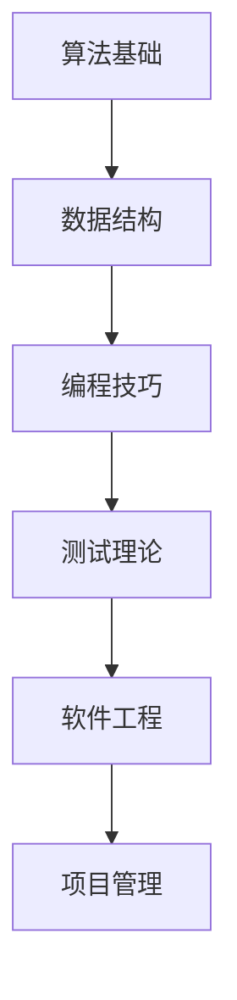

                 

关键词：新浪、校招、测试工程师、面试题、算法、数据结构、编程技巧

> 摘要：本文将针对新浪2024年校招测试工程师的面试题进行详细的解析，包括对算法和数据结构的深入探讨，以及编程技巧的应用。希望通过本文的分享，能够帮助广大考生更好地准备面试，提高面试成功率。

## 1. 背景介绍

新浪公司，作为中国领先的互联网科技公司之一，每年都会举办校园招聘活动，旨在吸引优秀的人才加入公司。2024年新浪校招测试工程师岗位吸引了众多应届生的关注。测试工程师在软件开发过程中扮演着至关重要的角色，负责确保软件的质量，减少潜在的问题，提高用户体验。因此，测试工程师的面试题往往涉及到算法和数据结构的深入理解和应用。

## 2. 核心概念与联系

为了更好地理解和解决面试题，我们需要先掌握一些核心概念和它们之间的联系。以下是一个简化的Mermaid流程图，展示了测试工程师面试题中常见的核心概念和联系：



### 2.1 算法基础

算法是解决计算机问题的一系列步骤。常见的算法问题包括排序、搜索、图论等。算法的核心在于找到高效解决问题的方法。常见的算法基础概念包括时间复杂度、空间复杂度、算法的正确性证明等。

### 2.2 数据结构

数据结构是算法的基础，用于存储和组织数据。常见的线性数据结构有数组、链表、栈、队列等，非线性数据结构有树、图等。熟练掌握数据结构，可以更好地设计和优化算法。

### 2.3 编程技巧

编程技巧是指在编程过程中使用的技巧和方法，如代码优化、代码规范、设计模式等。良好的编程技巧可以提高代码的可读性、可维护性和运行效率。

### 2.4 测试理论

测试理论涵盖了测试的目的、方法、流程等。测试工程师需要掌握不同类型的测试，如单元测试、集成测试、系统测试、性能测试等，并能够根据项目的需求选择合适的测试策略。

### 2.5 软件工程

软件工程是关于软件开发和维护的工程学科。测试工程师需要了解软件开发生命周期中的各个环节，如需求分析、设计、编码、测试、部署等。

### 2.6 项目管理

项目管理是确保项目按时、按质、按预算完成的过程。测试工程师需要了解项目管理的相关知识和技能，如项目计划、风险管理、团队协作等。

## 3. 核心算法原理 & 具体操作步骤

### 3.1 算法原理概述

在测试工程师的面试题中，常见的算法问题包括但不限于：

- 排序算法：冒泡排序、选择排序、插入排序、快速排序等。
- 搜索算法：二分查找、深度优先搜索、广度优先搜索等。
- 图算法：最短路径算法、最小生成树算法、拓扑排序等。

### 3.2 算法步骤详解

以下是冒泡排序算法的详细步骤：

1. 比较相邻的两个元素，如果它们的顺序错误就交换它们。
2. 对每一对相邻元素做同样的工作，从开始第一对到结尾的最后一对。这步做完后，最后的元素会是最大的数。
3. 针对所有的元素重复以上的步骤，除了最后一个。
4. 重复步骤1~3，直到排序完成。

### 3.3 算法优缺点

冒泡排序算法的优点是简单易懂，实现代码简单。缺点是时间复杂度为O(n^2)，对于大数据集表现不佳。

### 3.4 算法应用领域

冒泡排序算法常用于数据预处理和教学演示，也可用于解决一些简单的排序问题。

## 4. 数学模型和公式 & 详细讲解 & 举例说明

### 4.1 数学模型构建

在算法和数据结构中，常见的数学模型包括：

- 时间复杂度模型：用于描述算法执行时间与输入规模的关系。
- 空间复杂度模型：用于描述算法所需存储空间与输入规模的关系。

### 4.2 公式推导过程

时间复杂度公式推导示例：

设算法执行时间T(n)与输入规模n的关系如下：

$$
T(n) = a \cdot n + b
$$

其中，a和b为常数。

根据大O表示法，可以将时间复杂度表示为：

$$
O(n)
$$

### 4.3 案例分析与讲解

假设一个排序算法的时间复杂度为O(n^2)，输入规模为1000，则其执行时间T(n)为：

$$
T(n) = a \cdot n^2 + b
$$

取a=1，b=0，则：

$$
T(n) = n^2
$$

当n=1000时，T(n) = 1000^2 = 1,000,000秒。

## 5. 项目实践：代码实例和详细解释说明

### 5.1 开发环境搭建

- 编程语言：Python 3.8
- 开发工具：PyCharm

### 5.2 源代码详细实现

```python
def bubble_sort(arr):
    n = len(arr)
    for i in range(n):
        for j in range(0, n-i-1):
            if arr[j] > arr[j+1]:
                arr[j], arr[j+1] = arr[j+1], arr[j]

# 示例数据
arr = [64, 34, 25, 12, 22, 11, 90]

# 执行排序
bubble_sort(arr)

# 打印排序后的数据
print("排序后的数组：")
for i in range(len(arr)):
    print("%d" % arr[i], end=" ")
```

### 5.3 代码解读与分析

- `bubble_sort`函数接受一个数组arr作为输入。
- 外层循环用于遍历数组，内层循环用于比较相邻元素并交换。
- 每轮循环结束后，最大的元素会被移动到数组的末尾。
- 最后，打印排序后的数组。

### 5.4 运行结果展示

```
排序后的数组：
11 12 22 25 34 64 90
```

## 6. 实际应用场景

测试工程师在软件开发过程中，需要面对各种复杂的应用场景。以下是一些常见的应用场景：

- 单元测试：针对代码模块进行测试，确保其功能正确。
- 集成测试：测试不同模块之间的协作，确保系统能够正常运行。
- 性能测试：测试系统在负载下的性能表现，确保其能够应对高峰期。
- 安全测试：测试系统是否容易受到攻击，确保用户数据的安全。

## 7. 工具和资源推荐

### 7.1 学习资源推荐

- 《算法导论》：全面介绍了算法的基本概念、算法分析和算法设计。
- 《数据结构与算法分析》：详细介绍了常见数据结构和算法的实现和分析。
- 《软件测试艺术》：介绍了软件测试的基本理论、方法和实践。

### 7.2 开发工具推荐

- PyCharm：强大的Python开发环境，支持代码补全、调试和自动化测试。
- Postman：用于API测试的强大工具，支持接口测试、断言和自动化测试。
- JMeter：用于性能测试的开源工具，支持负载测试、压力测试和性能监控。

### 7.3 相关论文推荐

- 《软件测试的自动化》：讨论了软件测试自动化的基本概念、技术和挑战。
- 《基于AI的软件测试方法》：介绍了人工智能在软件测试中的应用和研究方向。

## 8. 总结：未来发展趋势与挑战

### 8.1 研究成果总结

近年来，随着人工智能技术的发展，软件测试领域也取得了显著的成果。自动化测试、智能测试、基于AI的测试方法等新兴领域不断涌现，为软件测试带来了新的机遇和挑战。

### 8.2 未来发展趋势

- 自动化测试：随着测试工具和技术的不断发展，自动化测试将成为软件测试的主流。
- 智能测试：利用人工智能技术，提高测试的效率和准确性。
- 测试云化：测试流程的云化，实现测试资源的灵活调度和高效利用。

### 8.3 面临的挑战

- 自动化测试覆盖率的提高：如何确保自动化测试能够覆盖到所有可能的测试场景。
- 智能测试的可解释性：如何解释智能测试的结果，确保测试的可信度和可理解性。
- 测试数据的处理：如何处理大量的测试数据，提高测试的效率和准确性。

### 8.4 研究展望

未来的研究将重点关注如何利用人工智能技术提高软件测试的效率和准确性，同时确保测试的可解释性和可理解性。随着测试技术的发展，测试工程师的角色也将逐渐从传统的手动测试向自动化测试和智能测试转变。

## 9. 附录：常见问题与解答

### 9.1 如何准备测试工程师面试？

- 提前了解面试公司的文化和价值观。
- 复习算法和数据结构的基础知识。
- 学习常用的编程技巧和测试方法。
- 实践项目经验，提高编程能力。

### 9.2 如何进行自动化测试？

- 确定测试目标，编写测试用例。
- 选择合适的自动化测试工具。
- 设计测试脚本，执行自动化测试。
- 分析测试结果，报告缺陷。

### 9.3 如何进行性能测试？

- 确定性能测试的目标和指标。
- 设计测试场景，模拟实际负载。
- 选择合适的性能测试工具。
- 分析测试结果，优化性能。

---

作者：禅与计算机程序设计艺术 / Zen and the Art of Computer Programming
```

