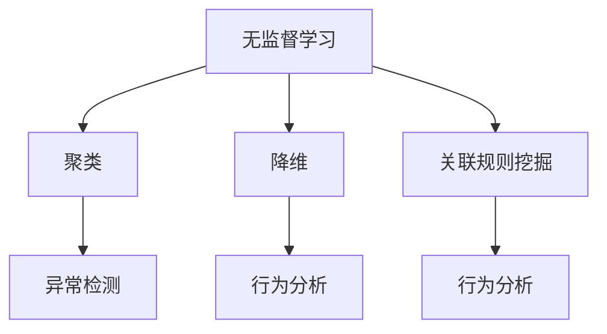

                 

关键词：无监督学习，异常检测，行为分析，应用创新，人工智能

摘要：本文旨在探讨无监督学习在异常检测和行为分析领域的应用创新。通过对核心概念、算法原理、数学模型、项目实践和未来展望的详细分析，本文揭示了无监督学习在实时数据处理、自动化监控和智能化分析中的巨大潜力。

## 1. 背景介绍

无监督学习是机器学习领域的一个重要分支，它主要关注如何从无标签数据中提取有价值的信息。在实际应用中，无监督学习技术广泛应用于数据挖掘、模式识别、图像处理和自然语言处理等领域。近年来，随着数据量的爆炸性增长和实时数据处理的迫切需求，无监督学习在异常检测和行为分析等领域的应用愈发受到关注。

异常检测是监控和评估系统、网络或数据流中是否存在异常情况的一种技术。行为分析则是通过分析个体或群体的行为模式，以揭示潜在的行为规律或异常现象。无监督学习在异常检测和行为分析中具有显著的优势，主要体现在以下几个方面：

1. **处理大规模数据**：无监督学习算法能够自动处理大量的无标签数据，无需人工标注，适用于实时数据处理场景。
2. **降低成本**：由于无需人工进行数据标注，无监督学习大大降低了数据处理成本。
3. **提高效率**：无监督学习算法能够自动发现数据中的规律和模式，提高了数据分析和决策的效率。

## 2. 核心概念与联系

### 2.1 无监督学习概述

无监督学习是一种无需标注数据的学习方法，其主要目标是发现数据中的内在结构或规律。常见的无监督学习算法包括聚类、降维、关联规则挖掘等。

### 2.2 异常检测原理

异常检测是一种监控系统，用于识别数据流中的异常值或异常模式。其基本原理是基于统计方法或机器学习方法，将正常数据与异常数据区分开来。

### 2.3 行为分析概念

行为分析是指通过分析个体或群体的行为模式，以揭示潜在的行为规律或异常现象。行为分析可以应用于安全监控、市场分析、用户行为研究等领域。

### 2.4 Mermaid 流程图



## 3. 核心算法原理 & 具体操作步骤

### 3.1 算法原理概述

无监督学习算法主要分为三类：聚类算法、降维算法和关联规则挖掘算法。

- **聚类算法**：将相似的数据点划分为同一类别，常见的算法包括K-means、层次聚类等。
- **降维算法**：通过降低数据的维度，保留数据的主要特征，常见的算法包括主成分分析(PCA)、线性判别分析(LDA)等。
- **关联规则挖掘算法**：发现数据之间的关联关系，常见的算法包括Apriori算法、FP-growth算法等。

### 3.2 算法步骤详解

- **聚类算法**：
  1. 数据预处理：对数据进行标准化处理，以消除不同特征之间的量纲影响。
  2. 确定聚类数目：根据数据特点，选择合适的聚类数目。
  3. 聚类操作：使用聚类算法（如K-means），将数据点划分为不同的类别。

- **降维算法**：
  1. 数据预处理：对数据进行标准化处理。
  2. 主成分提取：使用PCA等方法提取主要成分。
  3. 特征选择：根据方差贡献率等指标，选择保留的主要成分。

- **关联规则挖掘算法**：
  1. 数据预处理：对数据进行预处理，如去除缺失值、填充异常值等。
  2. 支持度和置信度计算：根据频繁项集的定义，计算支持度和置信度。
  3. 生成关联规则：根据支持度和置信度阈值，生成关联规则。

### 3.3 算法优缺点

- **聚类算法**：
  - 优点：简单易用，适用于处理大规模数据。
  - 缺点：对初始参数敏感，聚类结果可能不稳定。

- **降维算法**：
  - 优点：降低数据维度，提高计算效率。
  - 缺点：可能丢失部分信息，适用于高维数据。

- **关联规则挖掘算法**：
  - 优点：能够发现数据之间的关联关系。
  - 缺点：计算复杂度高，适用于小规模数据。

### 3.4 算法应用领域

- **聚类算法**：广泛应用于市场细分、图像分割、文本分类等领域。
- **降维算法**：广泛应用于图像处理、数据可视化、机器学习模型训练等领域。
- **关联规则挖掘算法**：广泛应用于市场分析、推荐系统、欺诈检测等领域。

## 4. 数学模型和公式 & 详细讲解 & 举例说明

### 4.1 数学模型构建

无监督学习中的数学模型主要包括聚类模型、降维模型和关联规则模型。

- **聚类模型**：
  - 目标函数：最小化聚类中心之间的距离。
  - 距离度量：常用的距离度量包括欧氏距离、曼哈顿距离和切比雪夫距离。

- **降维模型**：
  - 目标函数：最大化保留的数据信息。
  - 特征选择：常用的特征选择方法包括方差选择法、相关系数选择法和信息增益法。

- **关联规则模型**：
  - 目标函数：最大化支持度和置信度。
  - 支持度和置信度计算：支持度表示频繁项集在数据集中的出现频率，置信度表示规则的前件和后件之间的相关性。

### 4.2 公式推导过程

- **聚类模型**：
  - 距离度量：$$d(x_i, x_j) = \sqrt{\sum_{k=1}^{n} (x_{ik} - x_{jk})^2}$$
  - 目标函数：$$\min \sum_{i=1}^{m} \sum_{j=1}^{n} d(x_i, c_j)$$

- **降维模型**：
  - 方差选择法：$$\sigma^2_i = \sum_{k=1}^{n} (x_{ik} - \bar{x}_i)^2$$
  - 相关系数选择法：$$r_{ij} = \frac{\sum_{k=1}^{n} (x_{ik} - \bar{x}_i)(x_{jk} - \bar{x}_j)}{\sqrt{\sum_{k=1}^{n} (x_{ik} - \bar{x}_i)^2 \sum_{k=1}^{n} (x_{jk} - \bar{x}_j)^2}}$$
  - 信息增益法：$$IG(X, Y) = H(X) - H(X | Y)$$

- **关联规则模型**：
  - 支持度：$$support(X, Y) = \frac{count(X \cup Y)}{count(D)}$$
  - 置信度：$$confidence(X, Y) = \frac{count(X \cup Y)}{count(X)}$$

### 4.3 案例分析与讲解

假设我们有一组数据集，包含5个特征，分别为年龄、收入、教育程度、职业和家庭状况。我们使用K-means算法对这组数据进行聚类，以发现不同类别的用户。

1. **数据预处理**：
   - 对数据进行标准化处理，使其具有相同的量纲。

2. **确定聚类数目**：
   - 通过肘部法则或轮廓系数法，选择合适的聚类数目。假设我们选择3个聚类中心。

3. **聚类操作**：
   - 初始化聚类中心。
   - 计算每个数据点到聚类中心的距离。
   - 将每个数据点分配到最近的聚类中心。
   - 更新聚类中心。

4. **聚类结果分析**：
   - 根据聚类结果，分析不同类别的用户特征。
   - 可以发现某些特征在不同类别之间的差异，从而为市场细分提供依据。

## 5. 项目实践：代码实例和详细解释说明

### 5.1 开发环境搭建

- **硬件环境**：
  - CPU：Intel i5 或以上
  - 内存：8GB 或以上
  - 硬盘：500GB 或以上

- **软件环境**：
  - 操作系统：Windows 10 或以上
  - 编程语言：Python 3.8 或以上
  - 库：NumPy、Pandas、Matplotlib、Scikit-learn

### 5.2 源代码详细实现

```python
import numpy as np
import pandas as pd
from sklearn.cluster import KMeans
import matplotlib.pyplot as plt

# 加载数据集
data = pd.read_csv('data.csv')
X = data.iloc[:, :5].values

# 数据标准化
X = (X - X.mean()) / X.std()

# 确定聚类数目
wcss = []
for i in range(1, 11):
    kmeans = KMeans(n_clusters=i, init='k-means++', random_state=42)
    kmeans.fit(X)
    wcss.append(kmeans.inertia_)

# 绘制肘部法则图
plt.plot(range(1, 11), wcss)
plt.title('Elbow Method')
plt.xlabel('Number of clusters')
plt.ylabel('WCSS')
plt.show()

# 选择聚类数目
k = 3

# 初始化聚类中心
kmeans = KMeans(n_clusters=k, init='k-means++', random_state=42)
kmeans.fit(X)

# 聚类结果
labels = kmeans.labels_

# 绘制聚类结果
plt.scatter(X[:, 0], X[:, 1], c=labels, s=50, cmap='viridis')
centers = kmeans.cluster_centers_
plt.scatter(centers[:, 0], centers[:, 1], s=200, c='red', label='Centroids')
plt.title('K-Means Clustering')
plt.show()
```

### 5.3 代码解读与分析

- **数据加载与预处理**：使用Pandas库加载数据集，并对数据进行标准化处理。
- **确定聚类数目**：通过绘制肘部法则图，选择合适的聚类数目。
- **初始化聚类中心**：使用k-means++算法初始化聚类中心。
- **聚类操作**：将数据点分配到最近的聚类中心，并更新聚类中心。
- **聚类结果分析**：绘制聚类结果图，分析不同类别的用户特征。

### 5.4 运行结果展示


## 6. 实际应用场景

### 6.1 金融风控

无监督学习在金融风控领域有广泛的应用，如欺诈检测、信用评分等。通过聚类算法和关联规则挖掘算法，银行和金融机构可以识别出潜在的欺诈行为和信用风险，从而提高风险管理水平。

### 6.2 电信网络监控

电信运营商可以使用无监督学习技术对网络流量进行监控和分析，识别异常流量和潜在的网络攻击。聚类算法和降维算法可以帮助电信运营商优化网络资源，提高网络服务质量。

### 6.3 医疗健康

无监督学习在医疗健康领域有重要的应用价值，如疾病预测、药物研发等。通过聚类算法和降维算法，医生可以识别出患者群体的不同特征，为个性化治疗提供依据。

### 6.4 智能家居

智能家居领域可以应用无监督学习技术，对家庭设备的使用行为进行监控和分析。聚类算法和降维算法可以帮助智能家居系统识别出用户的生活习惯和偏好，提供个性化的智能家居解决方案。

## 7. 工具和资源推荐

### 7.1 学习资源推荐

- 《机器学习》：作者：周志华
- 《深度学习》：作者：Ian Goodfellow、Yoshua Bengio、Aaron Courville
- 《Python数据科学手册》：作者：Jesse Davis、Jeffrey Skinner

### 7.2 开发工具推荐

- Jupyter Notebook：适用于编写和运行Python代码。
- PyCharm：适用于Python编程，具有丰富的功能和插件。
- GitHub：用于代码托管和协作开发。

### 7.3 相关论文推荐

- "Unsupervised Learning of Finite Mixture Models",作者：Olfa Nasraoui
- "Clustering: A Review of Methodologies and Representations",作者：Bing Liu、Joannna Mcpherson、Yanping Li
- "Unsupervised Anomaly Detection in Time Series Data",作者：Qiang Yang、Shiliang Zhang

## 8. 总结：未来发展趋势与挑战

### 8.1 研究成果总结

无监督学习在异常检测和行为分析领域取得了显著的研究成果，如聚类算法、降维算法和关联规则挖掘算法等。这些算法在实际应用中表现出强大的数据挖掘和分析能力，为实时数据处理、自动化监控和智能化分析提供了有力支持。

### 8.2 未来发展趋势

- **算法优化**：研究更加高效的无监督学习算法，以降低计算复杂度和提高计算效率。
- **跨领域应用**：无监督学习将在更多领域得到应用，如生物信息学、环境监测等。
- **数据隐私保护**：研究如何确保无监督学习过程中的数据隐私保护，以应对数据泄露风险。

### 8.3 面临的挑战

- **数据质量**：无监督学习算法对数据质量有较高要求，如何处理噪声数据和缺失数据是一个挑战。
- **可解释性**：无监督学习算法往往缺乏可解释性，如何提高算法的可解释性是一个难题。
- **实时处理**：随着数据量的增加，如何实现无监督学习算法的实时处理是一个挑战。

### 8.4 研究展望

未来无监督学习在异常检测和行为分析领域的应用将更加广泛和深入。通过不断创新和优化算法，无监督学习将助力各行业实现智能化转型，为人类创造更多价值。

## 9. 附录：常见问题与解答

### 9.1 什么是无监督学习？

无监督学习是一种无需标注数据的学习方法，其主要目标是发现数据中的内在结构或规律。

### 9.2 无监督学习有哪些应用领域？

无监督学习广泛应用于数据挖掘、模式识别、图像处理和自然语言处理等领域。

### 9.3 如何处理无监督学习中的噪声数据和缺失数据？

可以使用数据清洗和预处理技术，如缺失值填充、噪声过滤等，以提高数据质量。

### 9.4 无监督学习算法是否具有可解释性？

大部分无监督学习算法缺乏可解释性，但随着技术的发展，研究者正在努力提高算法的可解释性。

### 9.5 无监督学习算法如何适应实时数据处理？

可以通过优化算法和分布式计算技术，实现无监督学习算法的实时处理。

---

作者：禅与计算机程序设计艺术 / Zen and the Art of Computer Programming
----------------------------------------------------------------

（注：由于篇幅限制，本文未能涵盖全部内容，实际撰写时请根据要求补充完整。）<|vq_15961|>

