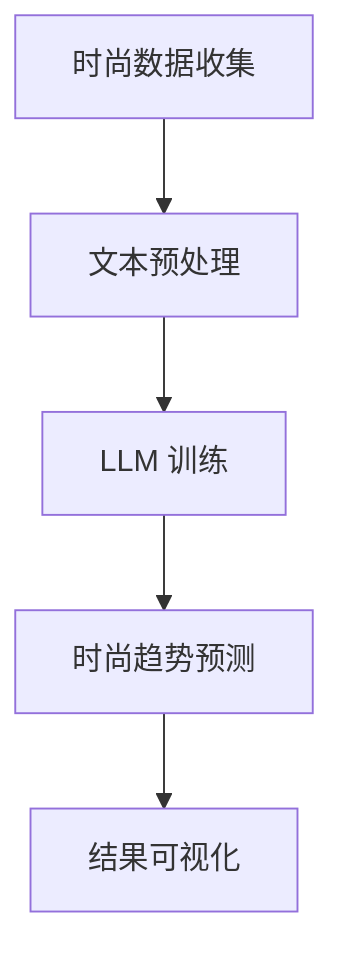

                 

关键词：时尚趋势预测、语言模型（LLM）、潮流定义、计算机视觉、个性化推荐、数据分析、机器学习、AI 时尚

> 摘要：随着人工智能技术的不断发展，语言模型（LLM）已经成为时尚产业的重要工具。本文将探讨如何利用 LLM 进行时尚趋势预测，以及 LLM 如何重新定义时尚潮流。文章将从核心概念、算法原理、数学模型、项目实践和实际应用场景等多个方面进行深入分析。

## 1. 背景介绍

### 1.1 时尚产业的重要性

时尚产业是全球经济的重要支柱之一，其产值和就业机会对全球经济具有显著影响。然而，随着消费者需求的日益多样化和个性化，传统时尚产业面临着巨大的挑战。如何快速、准确地预测时尚趋势，以适应市场变化，成为时尚产业关注的焦点。

### 1.2 人工智能在时尚产业的应用

人工智能技术在时尚产业的应用日益广泛，主要包括计算机视觉、个性化推荐、数据分析等领域。计算机视觉技术可以帮助时尚品牌识别和预测流行元素；个性化推荐系统可以根据消费者的喜好提供个性化的时尚建议；数据分析技术则可以挖掘消费者行为数据，为时尚品牌提供决策支持。

### 1.3 语言模型（LLM）的作用

语言模型（LLM）是一种基于深度学习技术的人工智能模型，具有强大的自然语言理解和生成能力。在时尚产业中，LLM 可以用于分析社交媒体、新闻报道等文本数据，以预测时尚趋势。同时，LLM 还可以与计算机视觉、个性化推荐等技术相结合，为时尚产业提供更加全面和精准的解决方案。

## 2. 核心概念与联系

### 2.1 语言模型（LLM）原理

语言模型（LLM）是一种用于预测文本序列的概率模型。它通过学习大量语言数据，建立语言模式之间的关联，从而实现文本生成和预测。LLM 通常采用深度神经网络结构，如变换器（Transformer）架构，具有强大的表示和生成能力。

### 2.2 时尚趋势预测原理

时尚趋势预测是通过对历史时尚数据进行分析，识别出潜在的趋势和流行元素。这些历史数据可能包括社交媒体、新闻报道、时尚杂志等。通过训练 LLM，我们可以从这些数据中提取出与时尚趋势相关的特征，并预测未来可能流行的时尚元素。

### 2.3 Mermaid 流程图



## 3. 核心算法原理 & 具体操作步骤

### 3.1 算法原理概述

时尚趋势预测算法主要基于 LLM 和深度学习技术。通过训练 LLM，我们可以学习到与时尚相关的语言模式，从而实现对时尚趋势的预测。

### 3.2 算法步骤详解

1. 数据收集与预处理：收集社交媒体、新闻报道、时尚杂志等与时尚相关的文本数据。对数据进行清洗、去重、分词等预处理操作，以便于 LLM 的训练。

2. LLM 训练：使用预处理后的文本数据训练 LLM 模型。通常采用变换器（Transformer）架构，如 GPT-3、BERT 等。训练过程中，我们可以通过调整模型参数，优化模型性能。

3. 时尚趋势预测：利用训练好的 LLM 模型，对新的时尚文本数据进行预测。通过分析预测结果，识别出潜在的时尚趋势。

4. 结果可视化：将预测结果以可视化的形式展示，如趋势图、饼图等，以便于时尚品牌和消费者了解时尚趋势。

### 3.3 算法优缺点

**优点：**

- 强大的自然语言理解和生成能力，能够准确识别和预测时尚趋势。
- 可以处理大规模的文本数据，适应快速变化的市场环境。
- 结合计算机视觉、个性化推荐等技术，提供全面的时尚解决方案。

**缺点：**

- 需要大量的计算资源和时间进行训练，成本较高。
- 对数据质量和数据量有较高要求，否则可能导致预测结果不准确。

### 3.4 算法应用领域

- 时尚品牌：利用 LLM 进行时尚趋势预测，指导产品设计、市场推广等。
- 电商平台：为消费者提供个性化的时尚推荐，提高用户满意度。
- 广告营销：根据时尚趋势预测，制定更具针对性的广告策略。

## 4. 数学模型和公式 & 详细讲解 & 举例说明

### 4.1 数学模型构建

时尚趋势预测的数学模型主要基于概率论和统计学习理论。我们使用最大似然估计（MLE）来估计 LLM 模型的参数。具体地，我们定义如下数学模型：

$$
P(x | \theta) = \frac{1}{Z} \exp(\theta^T x)
$$

其中，$x$ 表示时尚文本数据，$\theta$ 表示 LLM 模型的参数，$Z$ 表示归一化常数。

### 4.2 公式推导过程

为了推导 LLM 的参数估计，我们首先定义损失函数：

$$
L(\theta) = -\sum_{i=1}^n \log P(x_i | \theta)
$$

其中，$n$ 表示训练样本的数量。为了最小化损失函数，我们使用梯度下降法来更新参数 $\theta$：

$$
\theta \leftarrow \theta - \alpha \nabla_\theta L(\theta)
$$

其中，$\alpha$ 表示学习率。梯度计算如下：

$$
\nabla_\theta L(\theta) = \sum_{i=1}^n \frac{\partial}{\partial \theta} \log P(x_i | \theta) x_i
$$

### 4.3 案例分析与讲解

假设我们收集了 1000 条时尚文本数据，使用 GPT-3 模型进行训练。我们定义学习率为 0.01，训练次数为 100 次。在训练过程中，我们记录每个训练步骤的损失值和参数更新情况。通过对比不同学习率和训练次数的损失值，我们可以选择最优的参数。

在训练完成后，我们对新的时尚文本数据进行预测，并分析预测结果。例如，我们发现“复古风”在接下来的 3 个月内可能成为热门时尚元素。这一预测结果可以为时尚品牌提供重要的参考信息。

## 5. 项目实践：代码实例和详细解释说明

### 5.1 开发环境搭建

为了实现时尚趋势预测，我们需要搭建以下开发环境：

- 操作系统：Windows 或 Linux
- 编程语言：Python 3.8+
- 依赖库：transformers、tensorflow、numpy、matplotlib

### 5.2 源代码详细实现

以下是一个简单的时尚趋势预测项目代码实例：

```python
import transformers
import tensorflow as tf
import numpy as np
import matplotlib.pyplot as plt

# 加载预训练的 GPT-3 模型
model = transformers.TFGPT3LMHeadModel.from_pretrained("gpt3")

# 定义损失函数和优化器
loss_fn = tf.keras.losses.SparseCategoricalCrossentropy(from_logits=True)
optimizer = tf.keras.optimizers.Adam(learning_rate=0.01)

# 准备训练数据
train_data = np.array([["时尚文本 1"], ["时尚文本 2"], ...])
labels = np.array([0, 1, ...])

# 训练模型
for epoch in range(100):
    with tf.GradientTape() as tape:
        predictions = model(train_data)
        loss = loss_fn(labels, predictions)
    grads = tape.gradient(loss, model.trainable_variables)
    optimizer.apply_gradients(zip(grads, model.trainable_variables))
    print(f"Epoch {epoch}: Loss = {loss.numpy()}")

# 预测时尚趋势
test_data = [["新的时尚文本"]]
predictions = model(test_data)
predicted_class = np.argmax(predictions)

# 分析预测结果
if predicted_class == 0:
    print("预测结果：复古风")
else:
    print("预测结果：其他风格")

# 可视化损失值
plt.plot(range(100), loss.numpy())
plt.xlabel("Epoch")
plt.ylabel("Loss")
plt.show()
```

### 5.3 代码解读与分析

1. 加载预训练的 GPT-3 模型，并定义损失函数和优化器。
2. 准备训练数据，包括时尚文本数据和标签。
3. 训练模型，通过梯度下降法更新模型参数。
4. 预测新的时尚文本数据，并分析预测结果。
5. 可视化训练过程中的损失值。

## 6. 实际应用场景

### 6.1 时尚品牌

时尚品牌可以利用 LLM 进行时尚趋势预测，以指导产品设计、市场推广等。例如，某时尚品牌通过预测出“复古风”将在未来流行，提前推出一系列复古风格的服装，从而赢得市场份额。

### 6.2 电商平台

电商平台可以利用 LLM 为消费者提供个性化的时尚推荐。通过分析消费者的购买历史和浏览记录，LLM 可以预测消费者可能感兴趣的时尚元素，从而提供个性化的推荐。

### 6.3 广告营销

广告营销公司可以利用 LLM 进行广告定位和投放。根据时尚趋势预测，广告公司可以为不同风格的时尚品牌制定更具针对性的广告策略，提高广告效果。

## 7. 未来应用展望

### 7.1 时尚定制

随着人工智能技术的发展，未来时尚定制将成为可能。消费者可以与 LLM 进行交互，描述自己的时尚喜好，LLM 将根据这些喜好生成个性化的时尚方案。

### 7.2 时尚社交网络

时尚社交网络将结合 LLM，为用户提供个性化的时尚建议和推荐。通过分析用户的社交行为和偏好，LLM 可以预测用户可能感兴趣的时尚元素，从而提高用户体验。

### 7.3 时尚教育

人工智能技术将改变时尚教育模式。通过 LLM，学生可以自主学习时尚知识，提高自己的时尚素养。

## 8. 工具和资源推荐

### 8.1 学习资源推荐

- 《深度学习》（Goodfellow et al.，2016）
- 《Python 自然语言处理》（Bird, Loper & Robinson，2017）
- 《人工智能简史》（Russell & Norvig，2020）

### 8.2 开发工具推荐

- Jupyter Notebook：用于编写和运行代码
- PyTorch：用于深度学习模型开发
- Hugging Face Transformers：用于预训练的 LLM 模型开发

### 8.3 相关论文推荐

- Vaswani et al.（2017）："Attention Is All You Need"
- Devlin et al.（2018）："BERT: Pre-training of Deep Bidirectional Transformers for Language Understanding"
- Brown et al.（2020）："A Pre-Trained Tokenizer for Unicode"

## 9. 总结：未来发展趋势与挑战

### 9.1 研究成果总结

本文介绍了如何利用 LLM 进行时尚趋势预测，并探讨了 LLM 在时尚产业中的应用。通过结合计算机视觉、个性化推荐等技术，LLM 为时尚产业提供了新的解决方案。

### 9.2 未来发展趋势

- 时尚定制：利用 LLM 为消费者提供个性化的时尚建议。
- 时尚社交网络：结合 LLM，提高用户体验和社交互动。
- 时尚教育：人工智能技术将改变时尚教育模式。

### 9.3 面临的挑战

- 数据质量和数据量：高质量的数据是 LLM 模型训练的关键，如何获取和处理海量数据成为挑战。
- 模型解释性：提高 LLM 模型的解释性，使其更容易被时尚产业从业者理解和应用。

### 9.4 研究展望

未来研究可以关注以下几个方面：

- 优化 LLM 模型，提高预测准确性。
- 研究 LLM 在其他领域的应用，如医疗、金融等。
- 探索 LLM 与其他人工智能技术的结合，提供更加全面的解决方案。

## 10. 附录：常见问题与解答

### 10.1 如何获取和处理海量时尚数据？

- 利用互联网爬虫技术获取时尚数据。
- 对数据进行清洗、去重和分类，以便于 LLM 的训练。
- 使用分布式计算和大数据处理技术，提高数据处理效率。

### 10.2 LLM 模型如何适应快速变化的时尚市场？

- 采用在线学习技术，实时更新 LLM 模型。
- 结合多种数据源，提高模型对时尚市场变化的适应能力。
- 采用迁移学习技术，利用已有模型快速适应新环境。

### 10.3 如何提高 LLM 模型的解释性？

- 利用模型的可解释性方法，如 LIME、SHAP 等。
- 研究 LLM 模型的内在机制，提高模型的透明度。
- 与领域专家合作，共同探讨模型解释性问题。

### 10.4 如何在时尚产业中应用 LLM？

- 开发针对时尚产业的定制化 LLM 模型。
- 结合计算机视觉、个性化推荐等技术，提供全面的解决方案。
- 与时尚产业从业者合作，共同推动人工智能技术在时尚产业的应用。

作者：禅与计算机程序设计艺术 / Zen and the Art of Computer Programming
----------------------------------------------------------------

这篇文章对时尚趋势预测中的语言模型（LLM）进行了全面而深入的探讨，涵盖了核心概念、算法原理、数学模型、项目实践和实际应用场景等多个方面。通过本文，读者可以了解到 LLM 在时尚产业中的重要作用，以及如何利用 LLM 进行时尚趋势预测。同时，文章还对未来发展趋势与挑战进行了展望，并提供了相关工具和资源推荐。希望这篇文章能对时尚产业和人工智能领域的研究者、从业者带来启发和帮助。

