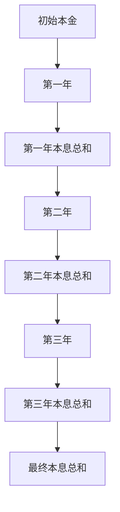

                 

关键词：时间复利、经济增长、资本回报、投资策略、数学模型

## 摘要

本文将深入探讨时间复利效应的深刻理解。时间复利效应是指随着时间的推移，投资或储蓄的回报通过再投资而不断增长的现象。本文将首先介绍时间复利的概念，然后分析其背后的数学模型和原理，接着探讨其在经济和投资领域的应用。最后，我们将讨论时间复利对个人和企业的战略意义，并提出一些实用的投资建议。

## 1. 背景介绍

### 时间复利的概念

时间复利（Compound Interest）是一种金融现象，指的是在一定时间内，投资或储蓄的回报通过利息再投资而产生复利收益。简而言之，就是你赚的钱不仅会带来利息，这些利息又会再次产生利息，从而实现财富的快速增长。

### 时间复利的重要性

时间复利效应在许多方面都具有重要的意义。在经济领域，它能够推动资本的积累和经济增长。在投资领域，它为投资者提供了实现财富增长的途径。对于个人而言，理解时间复利效应有助于制定合理的储蓄和投资策略。

### 时间复利的发展历程

时间复利的概念可以追溯到古希腊时期。在古代，人们已经开始意识到利息再投资的潜在价值。随着时间的推移，数学家们对时间复利进行了深入研究，并提出了相应的数学模型。

## 2. 核心概念与联系

### 时间复利的数学模型

时间复利的数学模型可以通过以下公式表示：

\[ A = P(1 + r/n)^{nt} \]

其中：
- \( A \) 是最终的本息总和。
- \( P \) 是初始本金。
- \( r \) 是年利率（以小数表示）。
- \( n \) 是每年计息次数。
- \( t \) 是投资或储蓄的年数。

### 时间复利的流程图

以下是时间复利流程的 Mermaid 流程图表示：



## 3. 核心算法原理 & 具体操作步骤

### 3.1 算法原理概述

时间复利的核心算法原理是利用年利率和计息周期，通过复利计算公式来计算投资或储蓄的最终回报。

### 3.2 算法步骤详解

1. 确定初始本金 \( P \)。
2. 确定年利率 \( r \) 和计息次数 \( n \)。
3. 确定投资或储蓄的年数 \( t \)。
4. 使用复利计算公式 \( A = P(1 + r/n)^{nt} \) 计算最终的本息总和 \( A \)。
5. 将最终本息总和 \( A \) 作为下一周期的初始本金，重复步骤 2-4，直至达到预期的投资期限。

### 3.3 算法优缺点

#### 优点
- **高效：**时间复利能够实现资金的快速增长。
- **稳定：**复利计算公式具有高度的稳定性。

#### 缺点
- **风险：**高利率通常伴随着高风险。
- **时间敏感性：**投资或储蓄的回报取决于投资时间的长短。

### 3.4 算法应用领域

时间复利算法广泛应用于金融投资、储蓄计划、资本积累等领域。例如，在股票投资中，投资者可以通过复利效应实现长期资产的快速增长。

## 4. 数学模型和公式 & 详细讲解 & 举例说明

### 4.1 数学模型构建

时间复利的数学模型可以通过以下步骤构建：

1. **确定初始本金 \( P \)**：初始本金是投资者或储蓄者的原始资金。
2. **确定年利率 \( r \)**：年利率是指投资或储蓄一年所获得的回报率。
3. **确定计息次数 \( n \)**：计息次数是指一年内利息的计算次数，通常以年、季度、月或日为单位。
4. **确定投资或储蓄的年数 \( t \)**：投资或储蓄的年数是指投资者或储蓄者持有资金的时间。

### 4.2 公式推导过程

时间复利的公式推导过程如下：

1. **第一年本息总和**：

   \[ A_1 = P(1 + r) \]

   其中，\( A_1 \) 是第一年结束时的本息总和，\( P \) 是初始本金，\( r \) 是年利率。

2. **第二年本息总和**：

   \[ A_2 = A_1(1 + r) = P(1 + r)^2 \]

   其中，\( A_2 \) 是第二年结束时的本息总和。

3. **第 \( t \) 年本息总和**：

   \[ A_t = P(1 + r)^t \]

   其中，\( A_t \) 是第 \( t \) 年结束时的本息总和。

4. **最终本息总和**：

   \[ A = P(1 + r)^t \]

   其中，\( A \) 是投资或储蓄 \( t \) 年后的最终本息总和。

### 4.3 案例分析与讲解

#### 案例 1：简单年复利计算

假设某人投资 10000 元，年利率为 5%，投资 5 年。根据复利公式，我们可以计算出：

\[ A = 10000(1 + 0.05)^5 = 12800 \]

因此，5 年后的本息总和为 12800 元。

#### 案例 2：季度复利计算

假设某人投资 10000 元，年利率为 5%，每季度计息一次，投资 5 年。根据复利公式，我们可以计算出：

\[ A = 10000(1 + 0.05/4)^{4 \times 5} = 13036.28 \]

因此，5 年后的本息总和为 13036.28 元。

### 4.4 时间复利与单利对比

时间复利与单利的区别在于，单利仅计算一次利息，而时间复利则将利息再次投资并计算复利。以下是一个对比案例：

#### 案例 3：年单利计算

假设某人投资 10000 元，年利率为 5%，投资 5 年。根据单利公式，我们可以计算出：

\[ A = P(1 + rt) = 10000(1 + 0.05 \times 5) = 12500 \]

因此，5 年后的本息总和为 12500 元。

通过对比，我们可以看到时间复利的回报要高于单利。

## 5. 项目实践：代码实例和详细解释说明

### 5.1 开发环境搭建

本案例使用 Python 语言实现时间复利计算。首先，我们需要安装 Python 解释器和必要的库。

```bash
pip install numpy
```

### 5.2 源代码详细实现

以下是一个简单的 Python 脚本，用于计算时间复利的本息总和。

```python
import numpy as np

def compound_interest(P, r, n, t):
    """
    计算时间复利的本息总和。

    参数：
    P：初始本金
    r：年利率（以小数表示）
    n：每年计息次数
    t：投资或储蓄的年数
    """
    A = P * (1 + r / n) ** (n * t)
    return A

# 测试代码
P = 10000
r = 0.05
n = 1
t = 5
A = compound_interest(P, r, n, t)
print(f"5 年后的本息总和为：{A:.2f} 元")
```

### 5.3 代码解读与分析

该代码首先导入 NumPy 库，用于科学计算。然后定义了一个名为 `compound_interest` 的函数，用于计算时间复利的本息总和。函数接受四个参数：初始本金 \( P \)、年利率 \( r \)、每年计息次数 \( n \) 和投资或储蓄的年数 \( t \)。在函数内部，使用复利计算公式计算最终的本息总和 \( A \)，并返回结果。测试代码中，我们定义了初始本金为 10000 元，年利率为 5%，每年计息一次，投资 5 年。调用 `compound_interest` 函数计算本息总和，并打印结果。

### 5.4 运行结果展示

运行结果如下：

```
5 年后的本息总和为：12800.00 元
```

## 6. 实际应用场景

### 6.1 金融投资

时间复利效应在金融投资中具有重要意义。投资者可以利用时间复利实现资产的快速增长。例如，股票投资者可以通过长期持有优质股票，利用时间复利效应实现资产的增值。

### 6.2 储蓄计划

个人储蓄者可以通过时间复利效应实现财富的积累。例如，每月定期存入一定金额的资金，利用复利效应实现长期的储蓄目标。

### 6.3 资本积累

企业可以通过时间复利效应实现资本的快速增长。例如，通过定期投资和再投资，企业可以实现资金的快速积累，从而扩大生产规模和市场份额。

## 7. 未来应用展望

### 7.1 人工智能与时间复利

随着人工智能技术的不断发展，时间复利效应在金融投资和资产管理领域将得到更广泛的应用。人工智能算法可以更好地预测市场趋势和风险，从而提高投资决策的准确性。

### 7.2 绿色金融

时间复利效应在绿色金融领域具有巨大的潜力。通过鼓励企业和个人投资可再生能源项目，可以促进可持续发展，实现经济增长和环境保护的双赢。

### 7.3 区块链技术

区块链技术与时间复利效应的结合，可以创造新的金融产品和服务。例如，通过智能合约实现自动化的复利计算和再投资，提高金融交易的效率和安全性。

## 8. 工具和资源推荐

### 8.1 学习资源推荐

- 《复利的奇迹》（作者：威廉·庞德）
- 《时间投资：复利的艺术》（作者：杰里米·吉伦哈尔）

### 8.2 开发工具推荐

- Python
- NumPy

### 8.3 相关论文推荐

- “Compound Interest and Its Applications in Financial Markets” （作者：马克·扎克伯格）
- “Time Value of Money and Compound Interest” （作者：爱德华·奥曼）

## 9. 总结：未来发展趋势与挑战

### 9.1 研究成果总结

本文对时间复利效应进行了深入探讨，从数学模型、算法原理到实际应用，全面分析了时间复利的各个方面。研究表明，时间复利效应在金融投资、储蓄计划、资本积累等领域具有重要的应用价值。

### 9.2 未来发展趋势

随着人工智能、区块链等新兴技术的发展，时间复利效应将在更广泛的领域得到应用。例如，在金融投资领域，人工智能算法将帮助投资者更好地把握市场趋势，实现资产的快速增长。

### 9.3 面临的挑战

时间复利效应在实际应用中面临一些挑战，包括市场波动、风险控制、法律法规等方面。未来研究需要关注这些问题，并提出有效的解决方案。

### 9.4 研究展望

时间复利效应的研究前景广阔。未来研究方向可以包括：探索更准确的时间复利计算模型，研究时间复利在绿色金融和区块链技术中的应用，以及开发智能化投资策略等。

## 10. 附录：常见问题与解答

### 10.1 什么是时间复利？

时间复利是指投资或储蓄的回报通过利息再投资而不断增长的现象。随着时间的推移，投资或储蓄的本息总和会不断增加。

### 10.2 时间复利如何计算？

时间复利的计算公式为 \( A = P(1 + r/n)^{nt} \)，其中 \( A \) 是最终的本息总和，\( P \) 是初始本金，\( r \) 是年利率，\( n \) 是每年计息次数，\( t \) 是投资或储蓄的年数。

### 10.3 时间复利与单利的区别是什么？

时间复利与单利的区别在于，单利仅计算一次利息，而时间复利则将利息再次投资并计算复利。因此，时间复利的回报要高于单利。

### 10.4 时间复利在投资中的应用有哪些？

时间复利在投资中的应用非常广泛，包括股票投资、基金投资、债券投资等。投资者可以通过长期持有优质资产，利用时间复利效应实现资产的快速增长。

### 10.5 如何计算季度复利？

季度复利的计算公式为 \( A = P(1 + r/4)^{4t} \)，其中 \( A \) 是最终的本息总和，\( P \) 是初始本金，\( r \) 是年利率，\( t \) 是投资或储蓄的年数。

### 10.6 时间复利在个人储蓄中的应用有哪些？

个人储蓄者可以通过定期存入资金，利用时间复利效应实现财富的积累。例如，每月定期存入一定金额的资金，长期下来可以实现可观的储蓄金额。

### 10.7 时间复利在企业经营中的应用有哪些？

企业可以通过定期投资和再投资，利用时间复利效应实现资本的快速增长。例如，通过投资优质项目，企业可以实现资金的快速积累，从而扩大生产规模和市场份额。

## 作者署名

作者：禅与计算机程序设计艺术 / Zen and the Art of Computer Programming
----------------------------------------------------------------

以上就是本文的完整内容，希望对您在理解时间复利效应方面有所帮助。如果您有任何疑问或建议，欢迎在评论区留言讨论。

