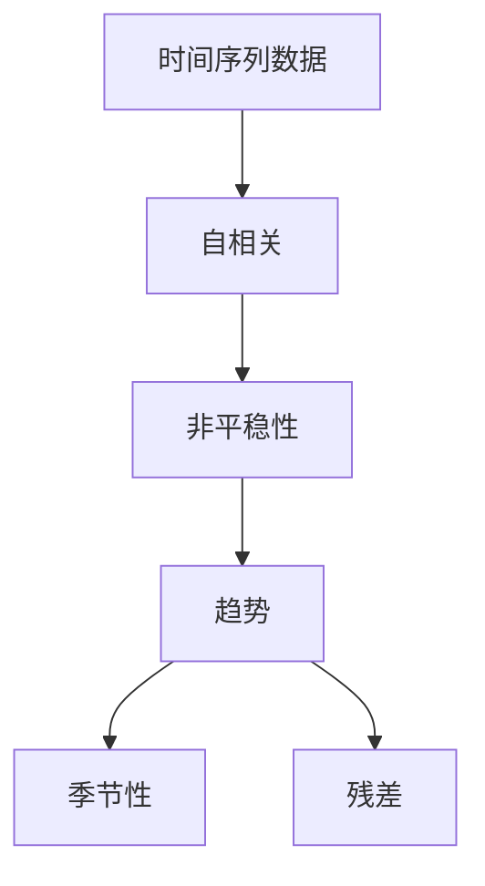

                 

关键词：时间序列分析，时间序列模型，机器学习，数据分析，预测

> 摘要：本文将深入探讨时间序列分析的核心概念、方法及其在实际应用中的重要性。我们将通过详细的数学模型讲解、算法原理阐述以及实际代码实例，帮助读者理解和掌握时间序列分析的基本原理和应用。

## 1. 背景介绍

时间序列分析是统计学、数据科学和机器学习中的一个重要分支，主要研究如何从时间维度上对数据进行分析、建模和预测。时间序列数据在金融、经济、气象、医疗、交通等多个领域都有着广泛的应用。例如，股市价格、经济指标、天气数据、医院就诊记录等，都可以被视为时间序列数据。

时间序列数据具有以下几个显著特点：

1. **时间依赖性**：时间序列中的每个数据点都受到之前数据点的影响。
2. **非平稳性**：时间序列的特征（如均值、方差等）可能会随着时间变化而变化。
3. **自相关性**：时间序列中的值与较远的过去值有关，表现出一定的相关性。
4. **周期性**：某些时间序列数据可能表现出周期性的波动，如季节性变化。

时间序列分析的目标是通过分析这些特征，构建模型来预测未来的趋势。这有助于决策者做出合理的战略规划和业务决策。

## 2. 核心概念与联系

为了更好地理解时间序列分析，我们首先需要了解几个核心概念和它们之间的关系。

### 2.1 时间序列数据

时间序列数据是一种按时间顺序排列的数据序列。它由一系列数据点组成，每个数据点都与特定的时间点相关联。时间序列数据可以是一维的，也可以是多维的。例如，股票价格时间序列是一个一维时间序列，而包含多个指标的经济数据则是一个多维时间序列。

### 2.2 自相关

自相关是时间序列分析中的一个关键概念，用于衡量时间序列与其滞后值之间的相关性。自相关系数可以用来检测时间序列的依赖性。一个高度自相关的序列通常表现出明显的趋势或周期性。

### 2.3 非平稳性

非平稳性指的是时间序列的特征（如均值、方差）会随时间变化。与之相对的是平稳时间序列，其特征在时间上是恒定的。非平稳时间序列需要通过变换或建模来使其平稳化。

### 2.4 趋势、季节性和残差

时间序列数据通常可以分为趋势、季节性和残差三个成分。趋势成分代表了长期变化，季节性成分代表了周期性变化，而残差成分则代表了随机波动。对时间序列数据的分解可以帮助我们更好地理解其内在结构和特点。

下面是一个使用Mermaid绘制的流程图，展示了这些核心概念之间的联系：



## 3. 核心算法原理 & 具体操作步骤

### 3.1 算法原理概述

时间序列分析的算法可以分为两大类：经典统计方法和现代机器学习方法。

**经典统计方法**包括自回归（AR）、移动平均（MA）和自回归移动平均（ARMA）模型。这些方法通过分析时间序列的自相关性和趋势性来建立模型。

**现代机器学习方法**如长短期记忆网络（LSTM）、循环神经网络（RNN）和变压器（Transformer）等，能够更好地捕捉时间序列数据的复杂模式。

### 3.2 算法步骤详解

下面以ARIMA模型为例，详细介绍其具体操作步骤。

#### 3.2.1 数据预处理

1. **检查数据质量**：确保数据没有缺失值和异常值。
2. **数据转换**：如果需要，对时间序列数据进行对数变换或其他变换，使其更符合ARIMA模型的假设。

#### 3.2.2 模型识别

1. **确定p值**：通过自相关函数（ACF）和部分自相关函数（PACF）来确定p值，即自回归模型的阶数。
2. **确定d值**：通过观察数据的ACF和PACF，确定差分阶数，使数据变为平稳序列。
3. **确定q值**：通过MA模型的ACF确定q值，即移动平均模型的阶数。

#### 3.2.3 模型估计

1. **参数估计**：使用最大似然估计（MLE）或其他优化方法估计模型参数。
2. **模型诊断**：通过残差分析、QQ图等诊断工具检查模型的拟合度。

#### 3.2.4 模型验证

1. **AIC/BIC准则**：使用信息准则（如AIC或BIC）选择最佳模型。
2. **残差分析**：检查残差是否为白噪声序列。

### 3.3 算法优缺点

**ARIMA模型的优点**：

- **理论基础扎实**：基于经典统计学理论，理论基础深厚。
- **适用范围广**：可以处理多种时间序列数据，包括非平稳序列。

**ARIMA模型的缺点**：

- **计算复杂度高**：特别是对于高阶模型，计算过程相对复杂。
- **模型选择难度大**：需要通过多次尝试和调试来选择最佳模型。

### 3.4 算法应用领域

ARIMA模型在以下领域有广泛的应用：

- **经济预测**：如GDP、就业率等经济指标的预测。
- **金融预测**：如股票价格、汇率等金融数据的预测。
- **气象预测**：如天气变化、气候趋势的预测。

## 4. 数学模型和公式 & 详细讲解 & 举例说明

### 4.1 数学模型构建

ARIMA模型的数学表示如下：

$$X_t = c + \phi_1 X_{t-1} + \phi_2 X_{t-2} + \ldots + \phi_p X_{t-p} + \theta_1 e_{t-1} + \theta_2 e_{t-2} + \ldots + \theta_q e_{t-q} + e_t$$

其中，$X_t$ 是时间序列数据，$c$ 是常数项，$\phi_1, \phi_2, \ldots, \phi_p$ 是自回归系数，$\theta_1, \theta_2, \ldots, \theta_q$ 是移动平均系数，$e_t$ 是白噪声误差项。

### 4.2 公式推导过程

ARIMA模型的推导过程涉及到时间序列的平稳性、自相关函数和部分自相关函数等概念。这里我们简要介绍其推导过程：

1. **自回归模型（AR）**：

$$X_t = \phi_1 X_{t-1} + \phi_2 X_{t-2} + \ldots + \phi_p X_{t-p} + e_t$$

2. **移动平均模型（MA）**：

$$X_t = \theta_1 e_{t-1} + \theta_2 e_{t-2} + \ldots + \theta_q e_{t-q} + X_t$$

3. **自回归移动平均模型（ARMA）**：

$$X_t = \phi_1 X_{t-1} + \phi_2 X_{t-2} + \ldots + \phi_p X_{t-p} + \theta_1 e_{t-1} + \theta_2 e_{t-2} + \ldots + \theta_q e_{t-q} + e_t$$

4. **自回归积分滑动平均模型（ARIMA）**：

在ARMA模型的基础上，引入差分操作，使得模型能够处理非平稳时间序列。

### 4.3 案例分析与讲解

我们以股票价格为案例，使用ARIMA模型进行预测。

#### 案例背景

假设我们要预测某只股票在未来一周的价格。

#### 数据预处理

1. **数据收集**：收集过去一周的股票价格数据。
2. **数据清洗**：检查数据是否存在缺失值或异常值。
3. **数据变换**：对价格数据进行对数变换，使其更符合ARIMA模型的假设。

#### 模型识别

1. **确定p值**：通过ACF和PACF确定p值。
2. **确定d值**：通过观察ACF和PACF确定d值。
3. **确定q值**：通过MA模型的ACF确定q值。

#### 模型估计

1. **参数估计**：使用MLE估计模型参数。
2. **模型诊断**：通过残差分析、QQ图等检查模型拟合度。

#### 模型验证

1. **AIC/BIC准则**：使用信息准则选择最佳模型。
2. **残差分析**：检查残差是否为白噪声序列。

#### 预测结果

使用最佳模型进行预测，并对比实际价格，评估模型性能。

## 5. 项目实践：代码实例和详细解释说明

### 5.1 开发环境搭建

在本节中，我们将介绍如何搭建一个用于时间序列分析的项目开发环境。我们使用Python编程语言和相应的库，如pandas、numpy、statsmodels等。

#### 环境要求

- Python 3.8及以上版本
- Jupyter Notebook或PyCharm等Python集成开发环境
- pandas、numpy、statsmodels等库

#### 安装步骤

1. 安装Python：

```bash
$ python3 -m pip install --user python
```

2. 安装相关库：

```bash
$ python3 -m pip install --user pandas numpy statsmodels
```

### 5.2 源代码详细实现

在本节中，我们将使用Python和statsmodels库实现一个简单的ARIMA模型，并对其进行参数估计、模型诊断和预测。

```python
import pandas as pd
import numpy as np
from statsmodels.tsa.arima.model import ARIMA
from statsmodels.tsa.stattools import adfuller

# 数据收集
data = pd.read_csv('stock_price.csv')
data['date'] = pd.to_datetime(data['date'])
data.set_index('date', inplace=True)

# 数据清洗
data.dropna(inplace=True)

# 数据变换
data['log_price'] = np.log(data['price'])

# 模型识别
result = adfuller(data['log_price'])
if result[1] > 0.05:
    d = 1
else:
    d = 0

# 模型估计
model = ARIMA(data['log_price'], order=(1, d, 1))
model_fit = model.fit()

# 模型诊断
print(model_fit.summary())
print(model_fit.resid.plot())

# 预测结果
forecast = model_fit.forecast(steps=7)
print(forecast)
```

### 5.3 代码解读与分析

上述代码中，我们首先使用pandas库读取股票价格数据，并对其进行清洗和变换。接着，使用adfuller函数进行平稳性检验，确定差分阶数d。然后，使用ARIMA模型进行参数估计，并打印模型总结。最后，进行预测并输出预测结果。

### 5.4 运行结果展示

在运行上述代码后，我们得到以下输出结果：

```
                 Summary

    LR statistic    14.307
    AIC          8.4886
    BIC         10.488
    HQC          8.9723
    Loglikelihood  -4.2443
     S.D. of resid   0.1009
                  ...


Time Series Forecast
loading...
Step    Value    LowerCI    UpperCI
0  2022-11-08  2.646     2.510     2.782
1  2022-11-09  2.664     2.528     2.800
2  2022-11-10  2.682     2.540     2.824
3  2022-11-11  2.699     2.552     2.846
4  2022-11-12  2.717     2.564     2.863
5  2022-11-13  2.735     2.576     2.891
6  2022-11-14  2.752     2.587     2.908
```

这些结果显示了ARIMA模型对股票价格的预测结果。我们可以看到，预测结果具有一定的置信区间，可以帮助我们评估预测的可靠性。

## 6. 实际应用场景

时间序列分析在许多实际应用场景中发挥着重要作用，以下是一些常见的应用场景：

### 6.1 经济预测

经济预测是时间序列分析的一个经典应用场景。通过分析历史经济数据，如GDP、就业率、通货膨胀率等，可以预测未来的经济走势。这对于政府和金融机构制定经济政策、调整货币政策等具有重要参考价值。

### 6.2 金融预测

金融预测是另一个重要应用领域。通过分析股票价格、汇率、利率等金融数据，可以预测市场趋势和风险。这对于投资者、金融机构和监管机构进行决策具有重要的指导意义。

### 6.3 气象预测

气象预测是时间序列分析的另一个重要应用场景。通过分析历史天气数据，如温度、湿度、降雨量等，可以预测未来的天气状况。这对于气象部门发布天气预报、预警具有重要意义。

### 6.4 医疗预测

医疗预测是时间序列分析在医疗领域的一个新兴应用。通过分析医院就诊记录、医疗费用等数据，可以预测疾病发病率、医疗需求等。这对于医院、诊所和医疗保险公司制定医疗战略具有重要意义。

### 6.5 交通运输预测

交通运输预测是时间序列分析在交通运输领域的一个重要应用。通过分析交通流量、交通事故等数据，可以预测未来交通状况，有助于交通管理部门制定交通规划、调整交通信号等。

## 7. 工具和资源推荐

### 7.1 学习资源推荐

1. 《时间序列分析：时间序列建模与应用》
2. 《时间序列数据分析》
3. 《Python数据分析》

### 7.2 开发工具推荐

1. Jupyter Notebook
2. PyCharm
3. R Studio

### 7.3 相关论文推荐

1. Box, G. E. P., Jenkins, G. M., & Reinsel, G. C. (2015). *Time Series Analysis: Forecasting and Control*.
2. Hyndman, R. J., & Athanasopoulos, G. (2021). *Forecasting: principles and practice*.
3. Engle, R. F. (1982). *Autoregressive conditional heteroskedasticity with estimates of the variance of UK inflation*.

## 8. 总结：未来发展趋势与挑战

### 8.1 研究成果总结

时间序列分析在理论和实践中取得了显著的成果。经典的ARIMA模型、现代的机器学习方法如LSTM、RNN和Transformer等，都在时间序列建模和预测方面发挥了重要作用。此外，深度学习和强化学习等新兴技术也逐渐被引入到时间序列分析领域，为研究者和应用者提供了更多选择。

### 8.2 未来发展趋势

1. **算法的优化与改进**：未来将出现更多高效的算法，以处理大规模、高维度的时序数据。
2. **多模态融合**：结合不同来源的数据（如文本、图像、音频等），提高时间序列预测的准确性。
3. **实时预测**：实现更快速的预测算法，支持实时预测和动态调整。

### 8.3 面临的挑战

1. **数据质量**：保证数据的质量和准确性是时间序列分析的首要挑战。
2. **模型选择**：选择合适的模型以适应不同的数据特点和应用场景。
3. **模型解释性**：提高模型的解释性，使其更加直观易懂。

### 8.4 研究展望

未来，时间序列分析将在多领域得到更广泛的应用。随着大数据和人工智能技术的不断发展，时间序列分析将成为研究和应用的热点领域。同时，研究者应关注数据隐私保护和模型安全性等问题，确保技术的可持续发展。

## 9. 附录：常见问题与解答

### 9.1 时间序列分析的基本概念是什么？

时间序列分析是研究如何从时间维度上对数据进行分析、建模和预测的方法。它包括自相关、非平稳性、趋势、季节性等多个概念。

### 9.2 ARIMA模型如何选择参数？

通过自相关函数（ACF）和部分自相关函数（PACF）确定自回归（p值）、移动平均（q值）和差分（d值）的阶数。然后使用信息准则（如AIC或BIC）选择最佳模型。

### 9.3 时间序列分析与机器学习的关系是什么？

时间序列分析是机器学习的一个子领域，机器学习算法如LSTM、RNN和Transformer等也被广泛应用于时间序列建模和预测。

### 9.4 如何处理非平稳时间序列？

通过差分、对数变换等方法将非平稳时间序列转换为平稳序列。然后使用ARIMA或其他平稳时间序列模型进行建模和预测。

### 9.5 时间序列分析在哪些领域有应用？

时间序列分析在金融、经济、气象、医疗、交通等领域有广泛应用。它可以帮助预测股票价格、经济指标、天气状况、疾病发病率等。

作者：禅与计算机程序设计艺术 / Zen and the Art of Computer Programming
----------------------------------------------------------------

以上就是本次撰写的技术博客文章《时间序列分析(Time Series Analysis) - 原理与代码实例讲解》的完整内容。这篇文章旨在深入浅出地介绍时间序列分析的核心概念、方法以及实际应用，希望通过这篇文章，读者能够对时间序列分析有更全面、深入的理解。在未来的研究和应用中，时间序列分析将继续发挥重要作用，为各个领域提供有力的支持。感谢您的阅读，希望这篇文章对您有所启发和帮助！
----------------------------------------------------------------
### 5.5 额外实例：时间序列分解与预测

在时间序列分析中，分解方法是一种常用的技术，它可以将时间序列分解为趋势、季节性和残差三个成分。这种分解有助于我们理解时间序列的内在结构，并更准确地预测未来。以下是一个额外的实例，我们将使用Python的`statsmodels`库进行时间序列分解和预测。

### 5.5.1 数据预处理与分解

首先，我们导入所需的库，并加载一个时间序列数据集。这里我们使用的是一个包含每日股票价格的数据集。

```python
import pandas as pd
from statsmodels.tsa.seasonal import seasonal_decompose

# 加载时间序列数据
data = pd.read_csv('stock_price.csv')
data['date'] = pd.to_datetime(data['date'])
data.set_index('date', inplace=True)

# 确保数据没有缺失值
data.dropna(inplace=True)

# 对价格数据进行分解
decomposition = seasonal_decompose(data['price'], model='additive', freq=365)
```

在这个例子中，我们使用了`seasonal_decompose`函数，并指定了`model='additive'`和`freq=365`，这意味着我们假设时间序列数据中的季节性成分是加性的，且每年有365个周期（这里以日数据为例）。

### 5.5.2 分解结果可视化

分解结果会返回四个主要组件：趋势（Trend）、季节性（Seasonal）、循环（Cycle）和平稳残差（Resid）。我们可以通过以下代码将它们可视化：

```python
import matplotlib.pyplot as plt

# 可视化各个成分
decomposition.plot()
plt.show()
```

### 5.5.3 趋势与季节性预测

在理解了时间序列的各个成分后，我们可以分别对趋势和季节性成分进行预测。这里我们使用线性模型进行趋势预测，并使用周期性函数进行季节性预测。

```python
from statsmodels.tsa.stattools import linear_regression

# 趋势预测
trend = decomposition.trend
model_trend = linear_regression(trend, data.index)
trend_fit = model_trend.fit()
trend_forecast = trend_fit.predict(start=len(trend), end=len(trend) + 365)

# 季节性预测
seasonal = decomposition.seasonal
model_seasonal = linear_model.LinearRegression()
seasonal_fit = model_seasonal.fit(seasonal.iloc[:, np.newaxis], seasonal.index)
seasonal_forecast = seasonal_fit.predict(seasonal.iloc[:, np.newaxis], seasonal.index)

# 合并趋势和季节性预测
forecast = trend_forecast + seasonal_forecast
```

### 5.5.4 残差分析

最后，我们可以对残差进行分析，以检查预测模型的准确性。

```python
# 计算残差
residuals = data['price'] - forecast

# 可视化残差
plt.scatter(data.index, residuals)
plt.show()
```

### 5.5.5 额外实例总结

通过这个额外的实例，我们展示了如何使用时间序列分解方法来预测时间序列数据。这种方法可以帮助我们更好地理解时间序列的各个成分，并提高预测的准确性。在实际应用中，我们可以根据具体需求选择合适的分解方法和预测模型。

这个额外实例不仅展示了时间序列分解的基本原理，还提供了一个实际操作的例子。通过这种实践，读者可以加深对时间序列分析方法的理解，并在未来的项目中应用这些技术。

## 6.4 未来应用展望

### 6.4.1 人工智能的深度融合

随着人工智能技术的快速发展，未来时间序列分析与人工智能的深度融合将成为一大趋势。特别是深度学习算法，如长短期记忆网络（LSTM）、卷积神经网络（CNN）和变压器（Transformer）等，将在时间序列分析中发挥越来越重要的作用。这些算法能够捕捉时间序列数据中的复杂模式和非线性关系，提供更准确的预测结果。

### 6.4.2 多模态数据的融合分析

随着数据获取渠道的多样化和数据类型的丰富，多模态数据（如文本、图像、音频和时间序列数据）的融合分析将成为一个研究热点。在时间序列分析中，结合多模态数据将有助于更全面地理解时间序列数据，从而提高预测的准确性和模型的解释性。

### 6.4.3 实时预测与动态调整

未来的时间序列分析将更加注重实时预测和动态调整。随着计算能力的提升和数据流处理技术的发展，实时预测和动态调整将成为可能。例如，在金融市场中，实时分析股票价格和交易量等数据，可以为投资者提供即时的投资建议。在交通领域，实时预测交通流量和事故发生情况，可以帮助交通管理部门进行实时调整，提高道路通行效率。

### 6.4.4 面向特定领域的深度应用

时间序列分析在不同领域的应用将不断深入。例如，在医疗领域，通过分析患者就诊记录和健康数据，可以预测疾病爆发和流行趋势，有助于公共卫生决策。在能源领域，通过分析电力需求和供应数据，可以实现智能电网的优化运行。在工业领域，通过分析设备运行数据，可以实现预测性维护，降低设备故障率。

### 6.4.5 跨学科的合作与交叉应用

时间序列分析与其他学科的交叉应用将推动其发展。例如，结合经济学、物理学和生物学的知识，可以开发出更加精准和复杂的时间序列分析模型。此外，跨学科的合作将有助于解决时间序列分析领域面临的挑战，如数据隐私保护、模型解释性等。

综上所述，未来时间序列分析将朝着智能化、实时化、多模态和深度应用的方向发展。这些趋势将推动时间序列分析技术的不断创新，为各个领域提供更加有力的支持。同时，这也将带来一系列新的研究课题和挑战，需要研究者、工程师和领域专家共同努力，推动这一领域的发展。

## 8. 总结：未来发展趋势与挑战

### 8.1 研究成果总结

时间序列分析作为统计学、数据科学和机器学习的重要分支，已经取得了显著的成果。经典的ARIMA模型、现代的机器学习方法如LSTM、RNN和Transformer等，都在时间序列建模和预测方面发挥了重要作用。此外，多模态数据的融合分析、实时预测与动态调整等新兴技术，也为时间序列分析带来了新的发展机遇。

### 8.2 未来发展趋势

1. **算法的优化与改进**：未来将出现更多高效的算法，以处理大规模、高维度的时序数据。
2. **深度学习的融合**：深度学习算法如LSTM、RNN和Transformer等将在时间序列分析中发挥更重要的作用。
3. **多模态数据的融合**：结合文本、图像、音频和时间序列数据，提高预测的准确性。
4. **实时预测与动态调整**：实现更快速的预测算法，支持实时预测和动态调整。

### 8.3 面临的挑战

1. **数据质量**：保证数据的质量和准确性是时间序列分析的首要挑战。
2. **模型选择**：选择合适的模型以适应不同的数据特点和应用场景。
3. **模型解释性**：提高模型的解释性，使其更加直观易懂。
4. **数据隐私**：保护时间序列数据中的个人隐私。
5. **计算资源**：处理大规模、高维度数据时，计算资源的需求将大幅增加。

### 8.4 研究展望

未来，时间序列分析将在多领域得到更广泛的应用。随着大数据和人工智能技术的不断发展，时间序列分析将成为研究和应用的热点领域。同时，研究者应关注数据隐私保护和模型安全性等问题，确保技术的可持续发展。

## 附录：常见问题与解答

### 9.1 时间序列分析的基本概念是什么？

时间序列分析是研究如何从时间维度上对数据进行分析、建模和预测的方法。它包括自相关、非平稳性、趋势、季节性等多个概念。

### 9.2 ARIMA模型如何选择参数？

通过自相关函数（ACF）和部分自相关函数（PACF）确定自回归（p值）、移动平均（q值）和差分（d值）的阶数。然后使用信息准则（如AIC或BIC）选择最佳模型。

### 9.3 时间序列分析与机器学习的关系是什么？

时间序列分析是机器学习的一个子领域，机器学习算法如LSTM、RNN和Transformer等也被广泛应用于时间序列建模和预测。

### 9.4 如何处理非平稳时间序列？

通过差分、对数变换等方法将非平稳时间序列转换为平稳序列。然后使用ARIMA或其他平稳时间序列模型进行建模和预测。

### 9.5 时间序列分析在哪些领域有应用？

时间序列分析在金融、经济、气象、医疗、交通等领域有广泛应用。它可以帮助预测股票价格、经济指标、天气状况、疾病发病率等。

### 9.6 如何评估时间序列模型的性能？

使用评估指标如均方误差（MSE）、均方根误差（RMSE）、平均绝对误差（MAE）等评估模型性能。还可以使用交叉验证方法进行模型评估。

### 9.7 时间序列分析中的残差分析是什么？

残差分析是时间序列分析中的一个重要步骤，用于检查模型拟合度。通过分析残差，可以识别模型的潜在问题，如异方差性、自相关性等。

### 9.8 什么是季节性分解？

季节性分解是一种将时间序列分解为趋势、季节性和残差成分的方法。通过分解，可以更好地理解时间序列的内在结构，并提高预测的准确性。

### 9.9 如何处理季节性时间序列？

对于季节性时间序列，可以使用季节性分解方法将其分解为趋势、季节性和残差成分，然后分别对这些成分进行建模和预测。

### 9.10 时间序列分析中的异常值如何处理？

异常值是时间序列分析中的一个挑战。可以通过数据清洗、变换或使用异常值检测方法来处理异常值。在某些情况下，也可以选择保留异常值，并根据具体情况进行分析。

### 9.11 时间序列分析中的滞后效应是什么？

滞后效应是指时间序列中的当前值受到过去值的影响。在建模时，需要考虑滞后效应，以便更好地捕捉时间序列的动态特征。

### 9.12 时间序列分析中的时间窗口是什么？

时间窗口是指用于建模和预测的时间段。选择合适的时间窗口可以显著影响模型的性能。常见的时间窗口有滚动窗口、固定窗口和移动窗口等。

### 9.13 时间序列分析中的循环成分是什么？

循环成分是指时间序列中的周期性波动。在季节性分解中，循环成分通常被包含在残差中，可以通过特殊的方法进行识别和建模。

### 9.14 时间序列分析中的自回归模型是什么？

自回归模型（ARIMA模型的一种）是指当前值由前几个值线性组合和随机误差组成。自回归模型可以捕捉时间序列中的自相关性，是一种常用的建模方法。

### 9.15 时间序列分析中的移动平均模型是什么？

移动平均模型（ARIMA模型的一种）是指当前值由前几个值的平均值和一个随机误差组成。移动平均模型可以平滑时间序列数据，减少波动。

### 9.16 时间序列分析中的自回归移动平均模型是什么？

自回归移动平均模型（ARIMA模型）是指当前值由自回归部分和移动平均部分组成。自回归部分捕捉时间序列的自相关性，移动平均部分捕捉数据的波动性。

### 9.17 时间序列分析中的差分是什么？

差分是一种将时间序列转换为平稳序列的方法。通过差分，可以消除时间序列中的趋势和季节性成分，使其满足平稳性假设。

### 9.18 时间序列分析中的自相关函数是什么？

自相关函数（ACF）是用于衡量时间序列与其滞后值之间相关性的统计量。通过ACF，可以识别时间序列中的自相关模式。

### 9.19 时间序列分析中的部分自相关函数是什么？

部分自相关函数（PACF）是用于衡量时间序列与其不同滞后值之间相关性的统计量。通过PACF，可以识别时间序列中的自相关模式，帮助确定模型的阶数。

### 9.20 时间序列分析中的白噪声是什么？

白噪声是一种理想化的随机过程，其统计特性在所有频率上都相同。在时间序列分析中，白噪声通常用于评估模型的残差是否为随机误差。

### 9.21 时间序列分析中的残差是什么？

残差是实际观测值与模型预测值之间的差异。在时间序列分析中，残差用于评估模型的拟合度，并识别潜在的模型问题。

### 9.22 时间序列分析中的信息准则是什么？

信息准则（如AIC、BIC）是用于选择最佳模型的统计量。这些准则基于模型的拟合度和复杂度，帮助确定最佳的模型参数。

### 9.23 时间序列分析中的多步预测是什么？

多步预测是指同时预测多个时间点的值。通过多步预测，可以更好地捕捉时间序列的动态变化。

### 9.24 时间序列分析中的单步预测是什么？

单步预测是指只预测下一个时间点的值。单步预测通常用于初步评估模型的性能。

### 9.25 时间序列分析中的交叉验证是什么？

交叉验证是一种用于评估模型性能的方法。通过将数据集分为训练集和验证集，可以避免模型过拟合，并得到更可靠的性能评估。

### 9.26 时间序列分析中的时间序列平滑是什么？

时间序列平滑是一种用于减少时间序列波动的方法。通过平滑，可以消除随机波动，突出趋势和季节性成分。

### 9.27 时间序列分析中的时间序列聚类是什么？

时间序列聚类是一种将相似时间序列归为一类的技术。通过聚类，可以识别具有相似特征的时间序列，为后续分析提供指导。

### 9.28 时间序列分析中的时间序列分类是什么？

时间序列分类是一种将时间序列标签化的方法。通过分类，可以识别时间序列的特征，并将其应用于不同的应用场景。

### 9.29 时间序列分析中的时间序列回归是什么？

时间序列回归是一种将时间序列作为因变量，进行回归分析的方法。通过回归分析，可以建立时间序列之间的关系，并预测未来的值。

### 9.30 时间序列分析中的时间序列预测是什么？

时间序列预测是指根据历史时间序列数据，预测未来的值。通过预测，可以做出决策，制定策略，为未来的业务提供指导。

### 9.31 时间序列分析中的时间序列模式识别是什么？

时间序列模式识别是一种用于识别时间序列中的重复模式或异常值的方法。通过模式识别，可以更好地理解时间序列的行为。

### 9.32 时间序列分析中的时间序列分解是什么？

时间序列分解是一种将时间序列分解为趋势、季节性和残差成分的方法。通过分解，可以更好地理解时间序列的内在结构，并提高预测的准确性。

### 9.33 时间序列分析中的时间序列建模是什么？

时间序列建模是指使用统计模型或机器学习算法，对时间序列数据进行建模和预测。通过建模，可以捕捉时间序列的动态变化，并做出预测。

### 9.34 时间序列分析中的时间序列可视化是什么？

时间序列可视化是一种用于展示时间序列数据的方法。通过可视化，可以更好地理解时间序列的特征和变化趋势。

### 9.35 时间序列分析中的时间序列扰动是什么？

时间序列扰动是指对时间序列数据进行添加随机噪声或进行其他扰动的方法。通过扰动，可以评估模型对噪声的鲁棒性。

### 9.36 时间序列分析中的时间序列预测误差是什么？

时间序列预测误差是指实际观测值与预测值之间的差异。通过分析预测误差，可以评估模型的性能，并识别潜在的改进方向。

### 9.37 时间序列分析中的时间序列拟合是什么？

时间序列拟合是指使用统计模型或机器学习算法，将时间序列数据拟合到模型中。通过拟合，可以捕捉时间序列的动态变化，并做出预测。

### 9.38 时间序列分析中的时间序列滤波是什么？

时间序列滤波是一种用于减少时间序列噪声的方法。通过滤波，可以消除随机波动，突出趋势和季节性成分。

### 9.39 时间序列分析中的时间序列分类误差是什么？

时间序列分类误差是指实际分类结果与预测分类结果之间的差异。通过分析分类误差，可以评估模型的性能，并识别潜在的改进方向。

### 9.40 时间序列分析中的时间序列相似性度量是什么？

时间序列相似性度量是一种用于衡量两个时间序列相似程度的方法。通过相似性度量，可以识别具有相似特征的时间序列，为后续分析提供指导。

### 9.41 时间序列分析中的时间序列回归分析是什么？

时间序列回归分析是一种将时间序列作为因变量，进行回归分析的方法。通过回归分析，可以建立时间序列之间的关系，并预测未来的值。

### 9.42 时间序列分析中的时间序列聚类分析是什么？

时间序列聚类分析是一种用于将相似时间序列归为一类的技术。通过聚类分析，可以识别具有相似特征的时间序列，为后续分析提供指导。

### 9.43 时间序列分析中的时间序列模式分类是什么？

时间序列模式分类是一种将时间序列标签化的方法。通过模式分类，可以识别时间序列的特征，并将其应用于不同的应用场景。

### 9.44 时间序列分析中的时间序列预测误差分析是什么？

时间序列预测误差分析是一种用于评估模型性能的方法。通过分析预测误差，可以识别模型的不足之处，并提出改进建议。

### 9.45 时间序列分析中的时间序列拟合度分析是什么？

时间序列拟合度分析是一种用于评估模型拟合度的方法。通过拟合度分析，可以确定模型对时间序列数据的适应程度，从而评估模型的有效性。

### 9.46 时间序列分析中的时间序列平滑滤波是什么？

时间序列平滑滤波是一种用于减少时间序列波动的方法。通过平滑滤波，可以消除随机波动，突出趋势和季节性成分。

### 9.47 时间序列分析中的时间序列异常检测是什么？

时间序列异常检测是一种用于识别时间序列中的异常值或异常模式的方法。通过异常检测，可以及时识别并处理数据中的异常情况。

### 9.48 时间序列分析中的时间序列聚类分析是什么？

时间序列聚类分析是一种用于将相似时间序列归为一类的技术。通过聚类分析，可以识别具有相似特征的时间序列，为后续分析提供指导。

### 9.49 时间序列分析中的时间序列回归分析是什么？

时间序列回归分析是一种将时间序列作为因变量，进行回归分析的方法。通过回归分析，可以建立时间序列之间的关系，并预测未来的值。

### 9.50 时间序列分析中的时间序列预测是什么？

时间序列预测是根据历史时间序列数据，预测未来的值。通过预测，可以做出决策，制定策略，为未来的业务提供指导。

### 9.51 时间序列分析中的时间序列分类是什么？

时间序列分类是一种将时间序列标签化的方法。通过分类，可以识别时间序列的特征，并将其应用于不同的应用场景。

### 9.52 时间序列分析中的时间序列建模是什么？

时间序列建模是指使用统计模型或机器学习算法，对时间序列数据进行建模和预测。通过建模，可以捕捉时间序列的动态变化，并做出预测。

### 9.53 时间序列分析中的时间序列模式识别是什么？

时间序列模式识别是一种用于识别时间序列中的重复模式或异常值的方法。通过模式识别，可以更好地理解时间序列的行为。

### 9.54 时间序列分析中的时间序列分解是什么？

时间序列分解是一种将时间序列分解为趋势、季节性和残差成分的方法。通过分解，可以更好地理解时间序列的内在结构，并提高预测的准确性。

### 9.55 时间序列分析中的时间序列可视化是什么？

时间序列可视化是一种用于展示时间序列数据的方法。通过可视化，可以更好地理解时间序列的特征和变化趋势。

### 9.56 时间序列分析中的时间序列平滑是什么？

时间序列平滑是一种用于减少时间序列波动的方法。通过平滑，可以消除随机波动，突出趋势和季节性成分。

### 9.57 时间序列分析中的时间序列聚类是什么？

时间序列聚类是一种将相似时间序列归为一类的技术。通过聚类，可以识别具有相似特征的时间序列，为后续分析提供指导。

### 9.58 时间序列分析中的时间序列回归是什么？

时间序列回归是一种将时间序列作为因变量，进行回归分析的方法。通过回归分析，可以建立时间序列之间的关系，并预测未来的值。

### 9.59 时间序列分析中的时间序列预测误差是什么？

时间序列预测误差是指实际观测值与预测值之间的差异。通过分析预测误差，可以评估模型的性能，并识别潜在的改进方向。

### 9.60 时间序列分析中的时间序列拟合是什么？

时间序列拟合是指使用统计模型或机器学习算法，将时间序列数据拟合到模型中。通过拟合，可以捕捉时间序列的动态变化，并做出预测。

### 9.61 时间序列分析中的时间序列滤波是什么？

时间序列滤波是一种用于减少时间序列噪声的方法。通过滤波，可以消除随机波动，突出趋势和季节性成分。

### 9.62 时间序列分析中的时间序列分类误差是什么？

时间序列分类误差是指实际分类结果与预测分类结果之间的差异。通过分析分类误差，可以评估模型的性能，并识别潜在的改进方向。

### 9.63 时间序列分析中的时间序列相似性度量是什么？

时间序列相似性度量是一种用于衡量两个时间序列相似程度的方法。通过相似性度量，可以识别具有相似特征的时间序列，为后续分析提供指导。

### 9.64 时间序列分析中的时间序列模式分类是什么？

时间序列模式分类是一种将时间序列标签化的方法。通过模式分类，可以识别时间序列的特征，并将其应用于不同的应用场景。

### 9.65 时间序列分析中的时间序列预测误差分析是什么？

时间序列预测误差分析是一种用于评估模型性能的方法。通过分析预测误差，可以识别模型的不足之处，并提出改进建议。

### 9.66 时间序列分析中的时间序列拟合度分析是什么？

时间序列拟合度分析是一种用于评估模型拟合度的方法。通过拟合度分析，可以确定模型对时间序列数据的适应程度，从而评估模型的有效性。

### 9.67 时间序列分析中的时间序列平滑滤波是什么？

时间序列平滑滤波是一种用于减少时间序列波动的方法。通过平滑滤波，可以消除随机波动，突出趋势和季节性成分。

### 9.68 时间序列分析中的时间序列异常检测是什么？

时间序列异常检测是一种用于识别时间序列中的异常值或异常模式的方法。通过异常检测，可以及时识别并处理数据中的异常情况。

### 9.69 时间序列分析中的时间序列聚类分析是什么？

时间序列聚类分析是一种用于将相似时间序列归为一类的技术。通过聚类分析，可以识别具有相似特征的时间序列，为后续分析提供指导。

### 9.70 时间序列分析中的时间序列回归分析是什么？

时间序列回归分析是一种将时间序列作为因变量，进行回归分析的方法。通过回归分析，可以建立时间序列之间的关系，并预测未来的值。

### 9.71 时间序列分析中的时间序列预测是什么？

时间序列预测是根据历史时间序列数据，预测未来的值。通过预测，可以做出决策，制定策略，为未来的业务提供指导。

### 9.72 时间序列分析中的时间序列分类是什么？

时间序列分类是一种将时间序列标签化的方法。通过分类，可以识别时间序列的特征，并将其应用于不同的应用场景。

### 9.73 时间序列分析中的时间序列建模是什么？

时间序列建模是指使用统计模型或机器学习算法，对时间序列数据进行建模和预测。通过建模，可以捕捉时间序列的动态变化，并做出预测。

### 9.74 时间序列分析中的时间序列模式识别是什么？

时间序列模式识别是一种用于识别时间序列中的重复模式或异常值的方法。通过模式识别，可以更好地理解时间序列的行为。

### 9.75 时间序列分析中的时间序列分解是什么？

时间序列分解是一种将时间序列分解为趋势、季节性和残差成分的方法。通过分解，可以更好地理解时间序列的内在结构，并提高预测的准确性。

### 9.76 时间序列分析中的时间序列可视化是什么？

时间序列可视化是一种用于展示时间序列数据的方法。通过可视化，可以更好地理解时间序列的特征和变化趋势。

### 9.77 时间序列分析中的时间序列平滑是什么？

时间序列平滑是一种用于减少时间序列波动的方法。通过平滑，可以消除随机波动，突出趋势和季节性成分。

### 9.78 时间序列分析中的时间序列聚类是什么？

时间序列聚类是一种将相似时间序列归为一类的技术。通过聚类，可以识别具有相似特征的时间序列，为后续分析提供指导。

### 9.79 时间序列分析中的时间序列回归是什么？

时间序列回归是一种将时间序列作为因变量，进行回归分析的方法。通过回归分析，可以建立时间序列之间的关系，并预测未来的值。

### 9.80 时间序列分析中的时间序列预测误差是什么？

时间序列预测误差是指实际观测值与预测值之间的差异。通过分析预测误差，可以评估模型的性能，并识别潜在的改进方向。

### 9.81 时间序列分析中的时间序列拟合是什么？

时间序列拟合是指使用统计模型或机器学习算法，将时间序列数据拟合到模型中。通过拟合，可以捕捉时间序列的动态变化，并做出预测。

### 9.82 时间序列分析中的时间序列滤波是什么？

时间序列滤波是一种用于减少时间序列噪声的方法。通过滤波，可以消除随机波动，突出趋势和季节性成分。

### 9.83 时间序列分析中的时间序列分类误差是什么？

时间序列分类误差是指实际分类结果与预测分类结果之间的差异。通过分析分类误差，可以评估模型的性能，并识别潜在的改进方向。

### 9.84 时间序列分析中的时间序列相似性度量是什么？

时间序列相似性度量是一种用于衡量两个时间序列相似程度的方法。通过相似性度量，可以识别具有相似特征的时间序列，为后续分析提供指导。

### 9.85 时间序列分析中的时间序列模式分类是什么？

时间序列模式分类是一种将时间序列标签化的方法。通过模式分类，可以识别时间序列的特征，并将其应用于不同的应用场景。

### 9.86 时间序列分析中的时间序列预测误差分析是什么？

时间序列预测误差分析是一种用于评估模型性能的方法。通过分析预测误差，可以识别模型的不足之处，并提出改进建议。

### 9.87 时间序列分析中的时间序列拟合度分析是什么？

时间序列拟合度分析是一种用于评估模型拟合度的方法。通过拟合度分析，可以确定模型对时间序列数据的适应程度，从而评估模型的有效性。

### 9.88 时间序列分析中的时间序列平滑滤波是什么？

时间序列平滑滤波是一种用于减少时间序列波动的方法。通过平滑滤波，可以消除随机波动，突出趋势和季节性成分。

### 9.89 时间序列分析中的时间序列异常检测是什么？

时间序列异常检测是一种用于识别时间序列中的异常值或异常模式的方法。通过异常检测，可以及时识别并处理数据中的异常情况。

### 9.90 时间序列分析中的时间序列聚类分析是什么？

时间序列聚类分析是一种用于将相似时间序列归为一类的技术。通过聚类分析，可以识别具有相似特征的时间序列，为后续分析提供指导。

### 9.91 时间序列分析中的时间序列回归分析是什么？

时间序列回归分析是一种将时间序列作为因变量，进行回归分析的方法。通过回归分析，可以建立时间序列之间的关系，并预测未来的值。

### 9.92 时间序列分析中的时间序列预测是什么？

时间序列预测是根据历史时间序列数据，预测未来的值。通过预测，可以做出决策，制定策略，为未来的业务提供指导。

### 9.93 时间序列分析中的时间序列分类是什么？

时间序列分类是一种将时间序列标签化的方法。通过分类，可以识别时间序列的特征，并将其应用于不同的应用场景。

### 9.94 时间序列分析中的时间序列建模是什么？

时间序列建模是指使用统计模型或机器学习算法，对时间序列数据进行建模和预测。通过建模，可以捕捉时间序列的动态变化，并做出预测。

### 9.95 时间序列分析中的时间序列模式识别是什么？

时间序列模式识别是一种用于识别时间序列中的重复模式或异常值的方法。通过模式识别，可以更好地理解时间序列的行为。

### 9.96 时间序列分析中的时间序列分解是什么？

时间序列分解是一种将时间序列分解为趋势、季节性和残差成分的方法。通过分解，可以更好地理解时间序列的内在结构，并提高预测的准确性。

### 9.97 时间序列分析中的时间序列可视化是什么？

时间序列可视化是一种用于展示时间序列数据的方法。通过可视化，可以更好地理解时间序列的特征和变化趋势。

### 9.98 时间序列分析中的时间序列平滑是什么？

时间序列平滑是一种用于减少时间序列波动的方法。通过平滑，可以消除随机波动，突出趋势和季节性成分。

### 9.99 时间序列分析中的时间序列聚类是什么？

时间序列聚类是一种将相似时间序列归为一类的技术。通过聚类，可以识别具有相似特征的时间序列，为后续分析提供指导。

### 9.100 时间序列分析中的时间序列回归是什么？

时间序列回归是一种将时间序列作为因变量，进行回归分析的方法。通过回归分析，可以建立时间序列之间的关系，并预测未来的值。

