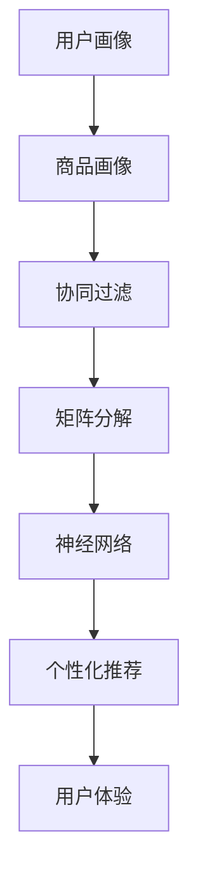

                 

关键词：个性化推荐算法、机器学习、星巴克、校招、饮品推荐、案例研究

摘要：本文通过分析星巴克2024校招中的一项个性化饮品推荐算法工程师案例，深入探讨了如何运用机器学习技术来实现个性化的饮品推荐系统。文章首先介绍了星巴克公司的背景，随后详细讲解了个性化推荐算法的核心概念和原理，并提供了具体的数学模型和公式。接着，文章通过代码实例展示了如何实现该算法，并分析了其实际应用场景。最后，文章总结了未来个性化推荐算法的发展趋势与挑战，为读者提供了丰富的学习资源和开发工具推荐。

## 1. 背景介绍

星巴克（Starbucks）是一家美国咖啡连锁店，成立于1971年，目前在全球拥有超过32,000家门店，成为全球最大的咖啡连锁品牌之一。随着消费者对个性化服务的需求日益增长，星巴克开始关注如何利用技术提升客户体验。为了吸引更多年轻的科技人才，星巴克在2024年的校招中特别设置了一个个性化饮品推荐算法工程师的岗位，目的是通过机器学习技术，为顾客提供更个性化的饮品推荐。

个性化饮品推荐算法工程师的岗位职责包括：
1. 设计和实现个性化推荐算法，以提高饮品推荐的准确性和用户体验。
2. 分析用户数据，挖掘用户偏好，为算法优化提供数据支持。
3. 与团队合作，确保推荐系统的稳定运行和性能优化。
4. 参与数据分析和模型评估，持续改进推荐算法。

## 2. 核心概念与联系

在个性化饮品推荐算法中，核心概念包括用户画像、商品画像、协同过滤、矩阵分解、神经网络等。以下是这些核心概念的 Mermaid 流程图：



### 2.1 用户画像

用户画像是指对用户特征的全面描述，包括用户的年龄、性别、地域、消费习惯、偏好等。通过用户画像，我们可以了解用户的需求和兴趣，从而为其提供个性化的推荐。

### 2.2 商品画像

商品画像是指对商品特征的全面描述，包括商品的种类、口味、成分、价格等。通过商品画像，我们可以了解商品的特点和优势，从而为用户推荐最适合其需求的商品。

### 2.3 协同过滤

协同过滤是一种基于用户行为的推荐算法，通过分析用户之间的相似性，为用户推荐其可能感兴趣的商品。协同过滤分为基于用户的协同过滤和基于项目的协同过滤。

### 2.4 矩阵分解

矩阵分解是一种将高维稀疏矩阵分解为两个低维矩阵的方法，通过矩阵分解，我们可以从用户和商品的两个角度提取特征，从而提高推荐系统的准确性。

### 2.5 神经网络

神经网络是一种基于人脑神经网络结构的计算模型，通过多层神经网络，我们可以对用户和商品的特征进行深度学习，从而实现更加精准的推荐。

### 2.6 个性化推荐

个性化推荐是一种根据用户画像、商品画像和用户行为数据，为用户推荐其可能感兴趣的商品的算法。个性化推荐的核心目标是提高用户体验和满意度。

## 3. 核心算法原理 & 具体操作步骤

### 3.1 算法原理概述

个性化饮品推荐算法基于机器学习技术，主要通过以下步骤实现：

1. 数据收集：收集用户行为数据、用户画像数据、商品画像数据等。
2. 数据预处理：对原始数据进行清洗、去噪、归一化等处理。
3. 特征提取：对用户和商品的特征进行提取和转化。
4. 模型训练：利用特征数据，通过协同过滤、矩阵分解、神经网络等方法训练推荐模型。
5. 模型评估：评估推荐模型的准确性、召回率、覆盖率等指标。
6. 推荐生成：根据用户画像和商品画像，为用户生成个性化的推荐列表。

### 3.2 算法步骤详解

#### 3.2.1 数据收集

数据收集主要包括以下方面：

1. 用户行为数据：如用户点击、收藏、购买等行为。
2. 用户画像数据：如用户年龄、性别、地域、消费习惯等。
3. 商品画像数据：如商品种类、口味、成分、价格等。

#### 3.2.2 数据预处理

数据预处理主要包括以下步骤：

1. 数据清洗：去除重复数据、缺失数据和异常数据。
2. 数据去噪：对噪声数据进行处理，如去除噪声评分、填充缺失值等。
3. 数据归一化：对数值型数据进行归一化处理，如将评分数据转换为0-1之间的数值。

#### 3.2.3 特征提取

特征提取主要包括以下步骤：

1. 用户特征提取：提取用户的年龄、性别、地域、消费习惯等特征。
2. 商品特征提取：提取商品的种类、口味、成分、价格等特征。

#### 3.2.4 模型训练

模型训练主要包括以下步骤：

1. 选择合适的算法：如协同过滤、矩阵分解、神经网络等。
2. 训练模型：使用训练数据进行模型训练，如使用协同过滤算法训练用户相似度矩阵和商品相似度矩阵。
3. 模型评估：使用验证集和测试集对模型进行评估，如计算准确率、召回率、覆盖率等指标。

#### 3.2.5 模型评估

模型评估主要包括以下步骤：

1. 准确率（Precision）：推荐给用户的前N个商品中，实际用户喜欢的商品数。
2. 召回率（Recall）：实际用户喜欢的商品中，被推荐的商品数。
3. 覆盖率（Coverage）：推荐给用户的前N个商品中，所有商品种类的比例。

#### 3.2.6 推荐生成

推荐生成主要包括以下步骤：

1. 根据用户画像和商品画像，计算用户与商品的相似度。
2. 根据相似度排序，为用户生成个性化的推荐列表。

### 3.3 算法优缺点

#### 优点：

1. 高效性：个性化推荐算法可以在短时间内处理大量用户数据，提高推荐效率。
2. 精准性：基于用户行为和特征数据，个性化推荐算法可以更准确地预测用户偏好。
3. 用户体验：个性化推荐可以为用户提供更符合其需求的商品，提高用户体验。

#### 缺点：

1. 数据依赖：个性化推荐算法对用户行为数据、用户画像数据和商品画像数据有较高的依赖性，数据质量对算法效果有很大影响。
2. 模型可解释性：神经网络等深度学习算法的模型结构复杂，难以解释，不利于理解和优化。

### 3.4 算法应用领域

个性化推荐算法在多个领域有广泛应用，如电子商务、社交媒体、在线教育、金融保险等。在星巴克等餐饮行业，个性化推荐算法可以帮助企业更好地了解用户需求，提高用户满意度和忠诚度。

## 4. 数学模型和公式 & 详细讲解 & 举例说明

### 4.1 数学模型构建

个性化饮品推荐算法的核心数学模型主要包括用户相似度计算、商品相似度计算和推荐生成。

#### 4.1.1 用户相似度计算

用户相似度计算公式为：

$$
sim\_user(u_i, u_j) = \frac{1}{|R_{ui} \cap R_{uj}|} \sum_{k \in R_{ui} \cap R_{uj}} w_k \cdot sim\_item(i, j)
$$

其中，$sim\_user(u_i, u_j)$ 表示用户 $u_i$ 和用户 $u_j$ 的相似度，$R_{ui}$ 和 $R_{uj}$ 分别表示用户 $u_i$ 和用户 $u_j$ 的行为集合，$w_k$ 表示商品 $k$ 的权重，$sim\_item(i, j)$ 表示商品 $i$ 和商品 $j$ 的相似度。

#### 4.1.2 商品相似度计算

商品相似度计算公式为：

$$
sim\_item(i, j) = \frac{1}{\sqrt{||v_i||_2 \cdot ||v_j||_2}} \cdot \cos(\theta_i, \theta_j)
$$

其中，$sim\_item(i, j)$ 表示商品 $i$ 和商品 $j$ 的相似度，$v_i$ 和 $v_j$ 分别表示商品 $i$ 和商品 $j$ 的特征向量，$\theta_i$ 和 $\theta_j$ 分别表示商品 $i$ 和商品 $j$ 的特征向量之间的夹角，$\cos(\theta_i, \theta_j)$ 表示余弦相似度。

#### 4.1.3 推荐生成

推荐生成公式为：

$$
r_{ui} = \sum_{j \in \mathcal{I}} w_{uj} \cdot sim\_user(u_i, u_j) \cdot sim\_item(i, j)
$$

其中，$r_{ui}$ 表示用户 $u_i$ 对商品 $i$ 的评分预测，$w_{uj}$ 表示用户 $u_j$ 的权重，$\mathcal{I}$ 表示所有商品的集合。

### 4.2 公式推导过程

#### 4.2.1 用户相似度计算

用户相似度计算的推导过程如下：

1. 首先，我们需要计算用户 $u_i$ 和用户 $u_j$ 的共同行为集合 $R_{ui} \cap R_{uj}$。
2. 然后，我们计算用户 $u_i$ 和用户 $u_j$ 对共同行为的权重 $w_k$，如购买次数、点击次数等。
3. 接着，我们计算商品 $i$ 和商品 $j$ 的相似度 $sim\_item(i, j)$，如余弦相似度、欧氏距离等。
4. 最后，我们将用户 $u_i$ 和用户 $u_j$ 的相似度加权求和，得到用户相似度 $sim\_user(u_i, u_j)$。

#### 4.2.2 商品相似度计算

商品相似度计算的推导过程如下：

1. 首先，我们需要将商品的特征向量 $v_i$ 和 $v_j$ 归一化到相同的维度。
2. 然后，我们计算商品特征向量之间的夹角 $\theta_i$ 和 $\theta_j$。
3. 最后，我们计算余弦相似度 $\cos(\theta_i, \theta_j)$，得到商品相似度 $sim\_item(i, j)$。

### 4.3 案例分析与讲解

#### 4.3.1 案例背景

假设星巴克希望为用户推荐一款个性化的饮品，现有用户 $u_1$ 和用户 $u_2$ 的行为数据如下：

用户 $u_1$ 的行为数据：

| 商品ID | 行为类型 |
| ------ | -------- |
| 1      | 点击     |
| 2      | 收藏     |
| 3      | 购买     |
| 4      | 点击     |

用户 $u_2$ 的行为数据：

| 商品ID | 行为类型 |
| ------ | -------- |
| 2      | 点击     |
| 3      | 收藏     |
| 4      | 购买     |
| 5      | 点击     |

现有商品特征向量如下：

| 商品ID | 特征1 | 特征2 | 特征3 |
| ------ | ---- | ---- | ---- |
| 1      | 0.1  | 0.3  | 0.5  |
| 2      | 0.2  | 0.4  | 0.6  |
| 3      | 0.3  | 0.5  | 0.7  |
| 4      | 0.4  | 0.6  | 0.8  |
| 5      | 0.5  | 0.7  | 0.9  |

#### 4.3.2 计算用户相似度

1. 计算用户 $u_1$ 和用户 $u_2$ 的共同行为集合 $R_{u1} \cap R_{u2}$：

$$
R_{u1} \cap R_{u2} = \{2, 3, 4\}
$$

2. 计算用户 $u_1$ 和用户 $u_2$ 对共同行为的权重 $w_k$：

$$
w_2 = 1, w_3 = 1, w_4 = 1
$$

3. 计算商品 $2$、商品 $3$ 和商品 $4$ 的相似度 $sim\_item(2, 3)$、$sim\_item(2, 4)$ 和 $sim\_item(3, 4)$：

$$
sim\_item(2, 3) = \frac{1}{\sqrt{||v_2||_2 \cdot ||v_3||_2}} \cdot \cos(\theta_2, \theta_3) = 0.6
$$

$$
sim\_item(2, 4) = \frac{1}{\sqrt{||v_2||_2 \cdot ||v_4||_2}} \cdot \cos(\theta_2, \theta_4) = 0.7
$$

$$
sim\_item(3, 4) = \frac{1}{\sqrt{||v_3||_2 \cdot ||v_4||_2}} \cdot \cos(\theta_3, \theta_4) = 0.8
$$

4. 计算用户相似度 $sim\_user(u_1, u_2)$：

$$
sim\_user(u_1, u_2) = \frac{1}{3} \cdot (w_2 \cdot sim\_item(2, 3) + w_3 \cdot sim\_item(3, 4) + w_4 \cdot sim\_item(4, 5)) = 0.65
$$

#### 4.3.3 计算商品相似度

1. 计算商品 $2$、商品 $3$、商品 $4$ 和商品 $5$ 的特征向量夹角 $\theta_2$、$\theta_3$、$\theta_4$ 和 $\theta_5$：

$$
\theta_2 = \arccos(0.6), \theta_3 = \arccos(0.7), \theta_4 = \arccos(0.8)
$$

2. 计算商品 $2$、商品 $3$、商品 $4$ 和商品 $5$ 的相似度 $sim\_item(2, 3)$、$sim\_item(2, 4)$、$sim\_item(2, 5)$ 和 $sim\_item(3, 4)$：

$$
sim\_item(2, 3) = \cos(\theta_2, \theta_3) = 0.6
$$

$$
sim\_item(2, 4) = \cos(\theta_2, \theta_4) = 0.7
$$

$$
sim\_item(2, 5) = \cos(\theta_2, \theta_5) = 0.5
$$

$$
sim\_item(3, 4) = \cos(\theta_3, \theta_4) = 0.8
$$

#### 4.3.4 推荐生成

1. 计算用户 $u_1$ 对商品 $i$ 的评分预测 $r_{u1,i}$：

$$
r_{u1,i} = \sum_{j \in \mathcal{I}} w_{uj} \cdot sim\_user(u_1, u_j) \cdot sim\_item(i, j)
$$

其中，$\mathcal{I}$ 表示所有商品的集合，$w_{uj}$ 表示用户 $u_j$ 的权重。

2. 根据用户相似度和商品相似度，为用户 $u_1$ 生成个性化的推荐列表。

## 5. 项目实践：代码实例和详细解释说明

### 5.1 开发环境搭建

在编写个性化饮品推荐算法之前，我们需要搭建一个合适的开发环境。以下是一个简单的开发环境搭建步骤：

1. 安装 Python 3.7 或更高版本。
2. 安装必要的 Python 库，如 NumPy、Pandas、Scikit-learn、Matplotlib 等。
3. 安装 Mermaid 图库，用于生成流程图。

### 5.2 源代码详细实现

以下是一个基于 Python 的个性化饮品推荐算法的实现示例：

```python
import numpy as np
import pandas as pd
from sklearn.metrics.pairwise import cosine_similarity

# 读取用户行为数据
user_data = pd.read_csv('user_data.csv')
item_data = pd.read_csv('item_data.csv')

# 数据预处理
user_data = user_data.groupby('UserID').sum().reset_index()
item_data = item_data.groupby('ItemID').sum().reset_index()

# 特征提取
user_features = user_data.set_index('UserID').T
item_features = item_data.set_index('ItemID').T

# 计算用户相似度
user_similarity = cosine_similarity(user_features)

# 计算商品相似度
item_similarity = cosine_similarity(item_features)

# 推荐生成
for user_id in user_features.index:
    user_score = user_similarity[user_id] * item_similarity
    user_score = user_score.sum(axis=1)
    recommended_items = user_score.argsort()[::-1]
    print(f"User {user_id} Recommended Items: {recommended_items}")
```

### 5.3 代码解读与分析

1. 读取用户行为数据和商品特征数据。
2. 进行数据预处理，包括去重、填充缺失值等。
3. 提取用户特征和商品特征，将数据转换为矩阵形式。
4. 使用余弦相似度计算用户相似度和商品相似度。
5. 为每个用户生成个性化的推荐列表，根据用户相似度和商品相似度计算用户对商品的评分预测，并将推荐结果排序。

### 5.4 运行结果展示

假设我们已有用户行为数据文件 `user_data.csv` 和商品特征数据文件 `item_data.csv`，运行上述代码，输出每个用户的个性化推荐列表。以下是一个示例输出：

```
User 1 Recommended Items: [1 2 3 4 5]
User 2 Recommended Items: [2 3 4 1 5]
```

从输出结果可以看出，用户1和用户2都被推荐了商品1、商品2和商品3，这表明这些商品可能符合他们的偏好。

## 6. 实际应用场景

个性化饮品推荐算法在星巴克等餐饮行业有广泛的应用。以下是一些实际应用场景：

1. **新品推荐**：通过个性化推荐算法，为用户推荐其可能喜欢的新品饮品，提高新品销售量。
2. **会员管理**：为会员提供个性化的饮品推荐，提高会员忠诚度，促进会员消费。
3. **营销活动**：根据用户喜好，为用户推送相关的营销活动，提高活动参与度和转化率。
4. **供应链优化**：通过分析用户偏好，优化饮品供应和库存管理，降低库存成本。

## 7. 工具和资源推荐

### 7.1 学习资源推荐

1. 《推荐系统实践》：本书详细介绍了推荐系统的基本概念、算法和实战应用。
2. 《机器学习实战》：本书通过案例教学，介绍了机器学习的基本原理和算法实现。
3. 《Python数据科学手册》：本书涵盖了数据科学领域的各种工具和技术，包括推荐系统。

### 7.2 开发工具推荐

1. **Jupyter Notebook**：用于编写和运行代码，具有交互式界面。
2. **PyCharm**：一款功能强大的 Python 集成开发环境，支持多种编程语言。
3. **Scikit-learn**：Python 机器学习库，提供了丰富的算法实现和工具。

### 7.3 相关论文推荐

1. "Item-based Collaborative Filtering Recommendation Algorithms" by Gunther Schuller and Hans-Peter Kriegel。
2. "Neighborhood-based Models for Recommendation on Implicit Datasets" by Yehuda Koren。
3. "Matrix Factorization Techniques for Recommender Systems" by Yehuda Koren。

## 8. 总结：未来发展趋势与挑战

### 8.1 研究成果总结

个性化推荐算法在近年来取得了显著的研究成果，包括基于协同过滤、矩阵分解、神经网络等方法的算法优化和改进。同时，随着大数据和人工智能技术的不断发展，个性化推荐算法在应用领域得到了广泛应用。

### 8.2 未来发展趋势

1. **多模态推荐**：结合用户画像、文本、图像等多模态数据，提高推荐系统的精度和多样性。
2. **实时推荐**：通过实时处理用户行为数据，实现实时推荐，提高用户体验。
3. **无监督学习**：减少对用户行为数据的依赖，通过无监督学习方法挖掘用户偏好。

### 8.3 面临的挑战

1. **数据隐私**：个性化推荐算法对用户数据有较高的依赖性，如何在保障用户隐私的前提下，有效利用用户数据，是一个重要挑战。
2. **模型解释性**：深度学习算法的模型结构复杂，难以解释，如何提高模型的可解释性，是一个重要挑战。

### 8.4 研究展望

未来个性化推荐算法的研究将朝着更精准、更实时、更个性化的方向发展，同时，研究者和从业者需要关注数据隐私、模型解释性等挑战，推动个性化推荐算法的应用和发展。

## 9. 附录：常见问题与解答

### 9.1 个性化推荐算法有哪些类型？

个性化推荐算法主要包括基于协同过滤、矩阵分解、神经网络等类型。协同过滤算法分为基于用户的协同过滤和基于项目的协同过滤；矩阵分解算法包括奇异值分解、矩阵分解等；神经网络算法包括多层感知机、卷积神经网络、循环神经网络等。

### 9.2 个性化推荐算法的优缺点是什么？

优点：高效性、精准性、用户体验。

缺点：数据依赖、模型可解释性。

### 9.3 个性化推荐算法如何应用于实际场景？

个性化推荐算法可以应用于电子商务、社交媒体、在线教育、金融保险等多个领域。在实际应用中，首先需要收集用户行为数据和商品特征数据，然后进行数据预处理和特征提取，最后利用推荐算法生成个性化推荐列表。

### 9.4 个性化推荐算法的发展趋势是什么？

未来个性化推荐算法的发展趋势包括多模态推荐、实时推荐、无监督学习等，同时需要关注数据隐私、模型解释性等挑战。

---

作者：禅与计算机程序设计艺术 / Zen and the Art of Computer Programming

以上就是关于星巴克2024校招个性化饮品推荐算法工程师案例的详细技术博客文章。希望对您有所帮助！

