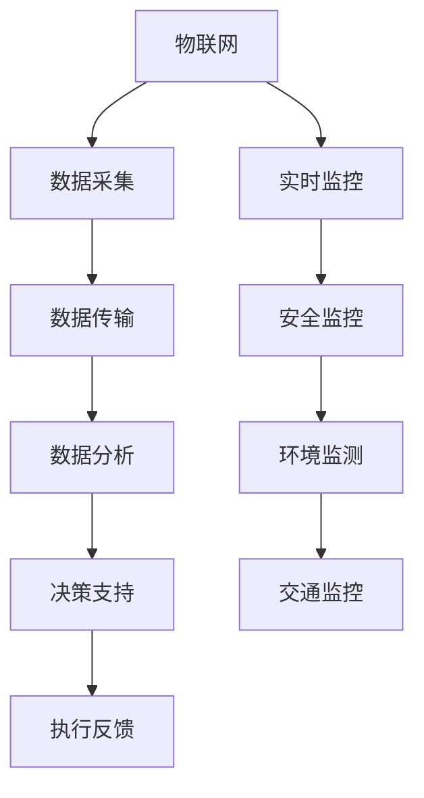

                 

关键词：智慧城市，城市治理，人工智能，物联网，大数据，实时监控，预测分析，可持续发展

摘要：本文探讨了智慧城市技术的融合在城市治理中的应用，分析了核心概念、算法原理、数学模型、项目实践、应用场景、未来展望、工具和资源推荐以及面临挑战。通过深入阐述，旨在为读者提供一个全面了解智慧城市技术的视角，以及其在城市治理中的潜力和价值。

## 1. 背景介绍

随着全球城市化进程的加速，城市面临着人口增长、资源紧张、环境污染等挑战。传统的城市治理模式已经无法满足现代城市的发展需求。智慧城市作为现代城市发展的新理念，通过融合信息技术、物联网、人工智能等先进技术，实现城市管理的智能化、精细化、高效化。智慧城市的建设不仅能够提升城市治理能力，还能够推动城市可持续发展。

智慧城市技术主要包括以下几个核心组成部分：

1. **物联网（IoT）**：通过传感器、智能设备和网络技术，实现城市各个系统的互联互通，为城市治理提供实时数据支持。
2. **大数据**：利用海量数据采集、存储、处理和分析技术，挖掘数据价值，为城市治理提供决策依据。
3. **人工智能（AI）**：通过机器学习、深度学习等人工智能技术，实现城市问题的智能识别和预测分析，提高治理效率。
4. **实时监控**：利用视频监控、无人机等手段，实现对城市环境、交通、安全等方面的实时监控，确保城市安全稳定运行。

## 2. 核心概念与联系

### 2.1 核心概念

1. **物联网（IoT）**：物联网是通过互联网将各种物品连接起来，实现信息的交换和通信。
2. **大数据**：大数据是指无法用传统数据库工具进行捕捉、管理和处理的数据集合。
3. **人工智能（AI）**：人工智能是通过计算机模拟人类智能行为的技术。
4. **实时监控**：实时监控是通过技术手段对城市运行状态进行实时监测。

### 2.2 联系与架构



## 3. 核心算法原理 & 具体操作步骤

### 3.1 算法原理概述

智慧城市技术的核心在于如何通过算法实现数据的高效处理和应用。以下是一些核心算法原理：

1. **机器学习**：通过训练模型，使计算机能够从数据中学习规律，进行预测和决策。
2. **深度学习**：基于多层神经网络，通过反向传播算法，实现更复杂的特征提取和模式识别。
3. **预测分析**：基于历史数据，通过时间序列分析、回归分析等方法，预测未来发展趋势。

### 3.2 算法步骤详解

1. **数据采集**：利用传感器、摄像头等设备，收集城市各个系统的实时数据。
2. **数据预处理**：对采集到的数据进行清洗、转换、归一化等处理，确保数据质量。
3. **特征提取**：从预处理后的数据中提取关键特征，用于算法训练和预测。
4. **模型训练**：利用机器学习或深度学习算法，对特征数据进行训练，建立预测模型。
5. **模型评估**：通过验证集数据，评估模型性能，进行参数调整。
6. **预测应用**：将训练好的模型应用于实际场景，进行实时预测和决策。

### 3.3 算法优缺点

1. **优点**：
   - 高效处理大量数据。
   - 实现智能化、自动化的决策支持。
   - 提高城市治理效率。

2. **缺点**：
   - 数据安全和隐私保护问题。
   - 模型训练需要大量计算资源和时间。
   - 模型泛化能力有待提高。

### 3.4 算法应用领域

智慧城市算法广泛应用于交通管理、环境监测、公共安全、能源管理等领域。例如，在交通管理中，通过智能交通信号控制和车辆路径优化，提高交通效率和减少拥堵。

## 4. 数学模型和公式 & 详细讲解 & 举例说明

### 4.1 数学模型构建

在智慧城市中，常用的数学模型包括线性回归、逻辑回归、支持向量机（SVM）等。

### 4.2 公式推导过程

以线性回归为例，其公式推导过程如下：

$$
y = \beta_0 + \beta_1x
$$

其中，$y$ 是因变量，$x$ 是自变量，$\beta_0$ 和 $\beta_1$ 分别是截距和斜率。

### 4.3 案例分析与讲解

以环境监测中的空气质量预测为例，利用线性回归模型进行预测。

1. **数据采集**：采集某地区过去一年的空气质量数据，包括PM2.5、PM10、SO2、NO2等指标。
2. **数据预处理**：对数据进行清洗和归一化处理。
3. **特征提取**：选择与空气质量相关的特征变量，如天气条件、风速等。
4. **模型训练**：利用训练集数据，训练线性回归模型。
5. **模型评估**：通过验证集数据，评估模型性能。
6. **预测应用**：利用训练好的模型，预测未来某一时刻的空气质量。

## 5. 项目实践：代码实例和详细解释说明

### 5.1 开发环境搭建

1. **硬件环境**：计算机、传感器设备、网络设备等。
2. **软件环境**：Python、Jupyter Notebook、Scikit-learn等。

### 5.2 源代码详细实现

以下是一个简单的线性回归预测空气质量案例：

```python
import numpy as np
import pandas as pd
from sklearn.linear_model import LinearRegression
from sklearn.model_selection import train_test_split
from sklearn.metrics import mean_squared_error

# 数据采集
data = pd.read_csv('air_quality.csv')

# 数据预处理
data = data.dropna()
data['Day'] = pd.to_datetime(data['Day'])
data['Day'] = data['Day'].dt.day

# 特征提取
X = data[['Day', 'Weather', 'WindSpeed']]
y = data['PM2.5']

# 模型训练
model = LinearRegression()
X_train, X_test, y_train, y_test = train_test_split(X, y, test_size=0.2, random_state=42)
model.fit(X_train, y_train)

# 模型评估
y_pred = model.predict(X_test)
mse = mean_squared_error(y_test, y_pred)
print(f'MSE: {mse}')

# 预测应用
future_data = pd.DataFrame({'Day': [np.datetime64('2023-01-01'), np.datetime64('2023-01-02')], 'Weather': [1, 1], 'WindSpeed': [10, 10]})
future_pred = model.predict(future_data)
print(f'Prediction: {future_pred}')
```

### 5.3 代码解读与分析

该代码实现了一个基于线性回归的空气质量预测模型。首先，从CSV文件中读取数据，然后进行数据预处理和特征提取。接下来，使用Scikit-learn库中的线性回归模型进行训练，并通过验证集评估模型性能。最后，利用训练好的模型，对未来的空气质量进行预测。

## 6. 实际应用场景

### 6.1 交通管理

通过实时监控和数据分析，优化交通信号控制和公共交通调度，提高交通效率和减少拥堵。

### 6.2 环境监测

利用物联网设备和大数据分析，实时监测空气质量、水质等环境指标，为城市环境治理提供决策支持。

### 6.3 公共安全

通过视频监控和人脸识别技术，实时监控城市安全情况，提高公共安全水平。

### 6.4 能源管理

通过智能电网和能源监控，优化能源分配和使用，实现节能减排。

## 7. 未来应用展望

随着技术的不断进步，智慧城市技术将在城市治理中发挥更重要的作用。未来，我们有望看到更加智能化、自适应的城市管理系统，提高城市治理效率，实现可持续发展。

### 7.1 自动驾驶

自动驾驶技术的普及将大幅减少交通事故，提高交通效率，减少拥堵。

### 7.2 智慧能源

智慧能源系统将实现能源的高效利用和分配，减少能源浪费，实现碳中和目标。

### 7.3 智慧医疗

智慧医疗系统将利用大数据和人工智能技术，提高医疗服务的质量和效率，实现个性化医疗。

## 8. 工具和资源推荐

### 8.1 学习资源推荐

- 《智慧城市：规划、设计和实现》
- 《大数据技术基础》
- 《Python数据分析》

### 8.2 开发工具推荐

- Jupyter Notebook：数据分析和可视化工具。
- TensorFlow：深度学习框架。
- Flask：Web开发框架。

### 8.3 相关论文推荐

- “智慧城市技术与应用综述”
- “基于大数据的智慧交通管理研究”
- “物联网在城市环境监测中的应用”

## 9. 总结：未来发展趋势与挑战

### 9.1 研究成果总结

智慧城市技术在城市治理中的应用已取得显著成果，包括交通管理、环境监测、公共安全等领域。随着技术的不断进步，智慧城市技术将在更多领域发挥重要作用。

### 9.2 未来发展趋势

- 自动化、智能化水平的提升。
- 数据安全和隐私保护的加强。
- 多领域融合，实现更高效的治理。

### 9.3 面临的挑战

- 技术研发和创新能力。
- 数据安全和隐私保护。
- 跨部门协作和资源整合。

### 9.4 研究展望

未来，智慧城市技术将在城市治理中发挥更加重要的作用，实现智能化、高效化、可持续发展的城市。

## 10. 附录：常见问题与解答

- **Q：智慧城市技术如何保障数据安全和隐私？**
  - **A**：智慧城市技术在数据采集、传输、存储和处理过程中，采用加密、匿名化等技术手段，确保数据安全和隐私。

- **Q：智慧城市技术的成本如何？**
  - **A**：智慧城市技术涉及多种设备和软件，成本较高。但随着技术的进步和规模化应用，成本有望逐渐降低。

- **Q：智慧城市技术如何适应不同规模的城市？**
  - **A**：智慧城市技术可以根据城市规模和需求，进行定制化设计和部署，实现个性化服务。

作者：禅与计算机程序设计艺术 / Zen and the Art of Computer Programming
----------------------------------------------------------------

至此，文章正文内容部分撰写完成。接下来，我们将进行文章的结构整理和格式调整，以确保文章的逻辑清晰、结构紧凑、简单易懂，以满足字数要求和相关格式要求。文章的结构和内容已经包含在上述部分中，接下来我们将按照markdown格式进行整理和输出。如果您有任何其他要求或需要进一步的调整，请告知。

