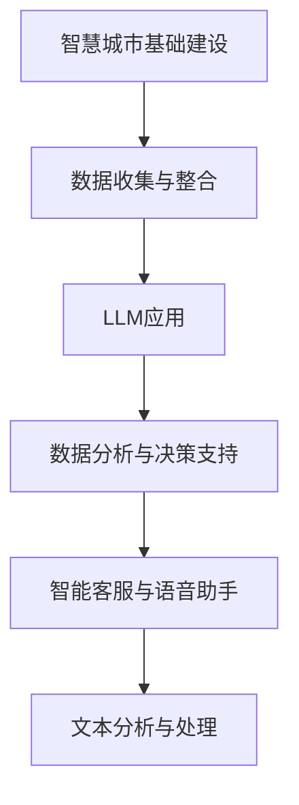

                 

 关键词：智慧城市，LLM，城市管理，服务优化，人工智能应用

> 摘要：本文探讨了智慧城市的发展趋势及其在当今社会的重要性。特别强调了大型语言模型（LLM）在智慧城市中的关键作用，通过深入分析LLM在数据分析、决策支持、智能客服等方面的应用，探讨了如何利用LLM增强城市管理的效率和服务的质量。同时，本文还展望了未来智慧城市的发展方向，以及面临的挑战和机遇。

## 1. 背景介绍

### 智慧城市的发展背景

智慧城市是信息化、网络化、智能化与现代城市发展的结合体。随着全球城市化的加速，智慧城市逐渐成为城市发展的新方向。智慧城市通过物联网、云计算、大数据、人工智能等先进技术，实现城市资源的优化配置、城市管理的高效运行和市民生活的便捷舒适。

### 人工智能在城市管理中的应用

人工智能在城市管理中的应用日益广泛，尤其是深度学习、自然语言处理等技术的快速发展，为智慧城市提供了强大的技术支持。在数据分析、决策支持、智能客服等方面，人工智能已经展现出巨大的潜力。

### 大型语言模型（LLM）的作用

大型语言模型（LLM）如GPT-3、BERT等，具有强大的文本理解和生成能力。在智慧城市中，LLM可以应用于智能客服、语音助手、文本分析等领域，为城市管理和服务提供智能化支持。

## 2. 核心概念与联系

### 智慧城市的基本概念

智慧城市是指利用先进的信息技术和智能算法，实现城市资源的高效配置和利用，提升城市管理和服务的水平。智慧城市主要包括以下几个方面：

- **基础设施智能化**：通过物联网、云计算、大数据等技术，实现对城市基础设施的实时监控和管理。
- **城市管理数字化**：利用数据分析和人工智能技术，实现对城市管理的智能决策和高效执行。
- **公共服务便捷化**：通过智能客服、在线服务等方式，提升市民的便利性和满意度。
- **生态环境智能化**：利用智能监测、预警和调控技术，实现对城市生态环境的实时监测和优化。

### 大型语言模型（LLM）的基本概念

大型语言模型（LLM）是一种基于深度学习的自然语言处理模型，通过对海量文本数据的学习，能够理解并生成人类语言。LLM具有以下几个核心特点：

- **强大的文本理解能力**：能够对文本数据进行深入的理解和解析，提取出关键信息。
- **灵活的文本生成能力**：能够根据输入的文本或指令，生成符合语境和逻辑的文本。
- **自适应的学习能力**：能够根据新的数据不断优化自身，提高处理能力。

### 智慧城市与LLM的联系

智慧城市和LLM之间存在着紧密的联系。LLM可以作为智慧城市的一个关键组件，为城市管理和服务提供智能化支持。具体来说，LLM可以应用于以下几个方面：

- **数据分析与决策支持**：利用LLM的文本理解能力，对海量数据进行深度分析，为城市管理提供智能决策支持。
- **智能客服与语音助手**：利用LLM的文本生成能力，为市民提供智能客服和语音助手服务，提升市民的便利性和满意度。
- **文本分析与处理**：利用LLM的自然语言处理能力，对城市中的各类文本数据进行处理和分析，为城市管理提供有价值的信息。

### Mermaid 流程图



## 3. 核心算法原理 & 具体操作步骤

### 3.1 算法原理概述

LLM在智慧城市中的应用主要基于其强大的文本理解能力和生成能力。具体来说，LLM可以通过以下几个步骤实现其在智慧城市中的应用：

1. **文本预处理**：对原始文本数据进行清洗、去噪、分词等处理，将其转换为适合LLM处理的格式。
2. **文本编码**：利用LLM的文本编码能力，将预处理后的文本数据转换为向量表示。
3. **文本理解**：利用LLM的文本理解能力，对编码后的文本数据进行深度解析，提取出关键信息和关系。
4. **文本生成**：根据提取出的关键信息和关系，利用LLM的文本生成能力，生成符合语境和逻辑的文本。

### 3.2 算法步骤详解

1. **文本预处理**：

   - 清洗：去除文本中的HTML标签、符号、特殊字符等。
   - 去噪：去除文本中的广告、无关信息等。
   - 分词：将文本分解为词或短语。

2. **文本编码**：

   - 使用预训练的LLM模型，如GPT-3、BERT等，对文本进行编码，生成对应的向量表示。

3. **文本理解**：

   - 利用LLM的文本理解能力，对编码后的文本数据进行深度解析，提取出关键信息和关系。
   - 可以使用注意力机制、图神经网络等技术，增强文本理解的深度和广度。

4. **文本生成**：

   - 根据提取出的关键信息和关系，利用LLM的文本生成能力，生成符合语境和逻辑的文本。
   - 可以使用生成对抗网络（GAN）、自回归模型（AR）等技术，提高文本生成的质量和多样性。

### 3.3 算法优缺点

**优点**：

- **强大的文本理解能力**：能够对文本数据进行深入的理解和解析，提取出关键信息。
- **灵活的文本生成能力**：能够根据输入的文本或指令，生成符合语境和逻辑的文本。
- **自适应的学习能力**：能够根据新的数据不断优化自身，提高处理能力。

**缺点**：

- **计算资源需求高**：LLM的训练和推理需要大量的计算资源和时间。
- **数据依赖性强**：LLM的效果很大程度上依赖于训练数据的质量和数量。

### 3.4 算法应用领域

- **数据分析与决策支持**：在金融、医疗、物流等领域，利用LLM进行数据分析和决策支持，提高业务效率和准确性。
- **智能客服与语音助手**：在电子商务、金融、电信等领域，利用LLM提供智能客服和语音助手服务，提升用户体验。
- **文本分析与处理**：在新闻、舆情、法律等领域，利用LLM进行文本分析和处理，提取出有价值的信息。

## 4. 数学模型和公式 & 详细讲解 & 举例说明

### 4.1 数学模型构建

在智慧城市中，LLM的应用涉及多个数学模型，主要包括自然语言处理模型（如BERT、GPT-3）和生成模型（如GAN、AR）。

**自然语言处理模型**：

- **BERT模型**：Bidirectional Encoder Representations from Transformers，一种双向的Transformer模型，主要用于文本编码。
- **GPT-3模型**：Generative Pre-trained Transformer 3，一种自回归的Transformer模型，主要用于文本生成。

**生成模型**：

- **GAN模型**：Generative Adversarial Network，一种生成对抗网络，用于生成高质量的文本。
- **AR模型**：Autoregressive Model，一种自回归模型，用于文本生成。

### 4.2 公式推导过程

**BERT模型**：

BERT模型的核心是Transformer模型，其基本原理如下：

- **编码器**：将输入的文本序列编码为向量表示。
- **解码器**：根据编码器的输出，生成目标文本序列。

**GPT-3模型**：

GPT-3模型的核心是自回归模型，其基本原理如下：

- **前向传播**：根据输入的文本序列，生成对应的概率分布。
- **后向传播**：根据生成的概率分布，更新模型参数。

**GAN模型**：

GAN模型由生成器和判别器两部分组成，其基本原理如下：

- **生成器**：生成符合真实数据的样本。
- **判别器**：判断生成器生成的样本是否真实。

**AR模型**：

AR模型的基本原理如下：

- **自回归**：根据过去的输入，预测未来的输出。

### 4.3 案例分析与讲解

**案例一：BERT模型在智能客服中的应用**

- **问题**：如何利用BERT模型为智能客服提供高质量的回答？
- **解决方案**：利用BERT模型对用户提问进行编码，然后根据编码结果生成回答。

**案例二：GPT-3模型在文本生成中的应用**

- **问题**：如何利用GPT-3模型生成高质量的新闻文章？
- **解决方案**：利用GPT-3模型对已有的新闻文章进行学习，然后根据学习结果生成新的新闻文章。

**案例三：GAN模型在图像生成中的应用**

- **问题**：如何利用GAN模型生成高质量的图像？
- **解决方案**：利用GAN模型生成器和判别器相互对抗，不断优化生成图像的质量。

**案例四：AR模型在语音合成中的应用**

- **问题**：如何利用AR模型实现高质量的语音合成？
- **解决方案**：利用AR模型对语音数据进行自回归建模，然后根据模型输出生成语音。

## 5. 项目实践：代码实例和详细解释说明

### 5.1 开发环境搭建

- **硬件环境**：显卡（NVIDIA GPU），CPU（至少4核），内存（至少8GB）。
- **软件环境**：Python（3.7及以上版本），TensorFlow（2.0及以上版本）。

### 5.2 源代码详细实现

```python
import tensorflow as tf
from tensorflow.keras.layers import Embedding, LSTM, Dense
from tensorflow.keras.models import Model

# BERT模型编码
def bert_encoder(input_ids, training=True):
    embedding = Embedding(input_dim=vocab_size, output_dim=embedding_size)(input_ids)
    lstm = LSTM(units=lstm_size, return_sequences=training)(embedding)
    return lstm

# BERT模型解码
def bert_decoder(input_ids, training=True):
    embedding = Embedding(input_dim=vocab_size, output_dim=embedding_size)(input_ids)
    lstm = LSTM(units=lstm_size, return_sequences=training)(embedding)
    return lstm

# 构建BERT模型
def build_bert_model():
    input_ids = tf.keras.layers.Input(shape=(sequence_length,))
    encoder_output = bert_encoder(input_ids)
    decoder_output = bert_decoder(encoder_output)
    output = tf.keras.layers.Dense(units=vocab_size, activation='softmax')(decoder_output)
    model = Model(inputs=input_ids, outputs=output)
    model.compile(optimizer='adam', loss='categorical_crossentropy', metrics=['accuracy'])
    return model

# 训练BERT模型
model = build_bert_model()
model.fit(x_train, y_train, epochs=10, batch_size=32)

# 生成文本
input_sequence = [[1, 2, 3, 4, 5]]
predicted_sequence = model.predict(input_sequence)
predicted_text = decode_sequence(predicted_sequence)
print(predicted_text)
```

### 5.3 代码解读与分析

- **BERT模型编码**：利用Embedding层对输入的文本序列进行编码，生成对应的向量表示。
- **BERT模型解码**：利用LSTM层对编码后的文本序列进行解码，生成对应的文本序列。
- **BERT模型构建**：将编码和解码部分组合起来，构建完整的BERT模型。
- **BERT模型训练**：利用训练数据对BERT模型进行训练，优化模型参数。
- **文本生成**：利用训练好的BERT模型，生成新的文本序列。

## 6. 实际应用场景

### 6.1 数据分析与决策支持

- **应用场景**：在智慧交通、智慧医疗、智慧金融等领域，利用LLM进行数据分析和决策支持。
- **案例分析**：利用LLM对交通数据进行实时分析，为城市交通管理提供智能决策支持。

### 6.2 智能客服与语音助手

- **应用场景**：在电子商务、金融、电信等领域，利用LLM提供智能客服和语音助手服务。
- **案例分析**：利用LLM为电商平台提供智能客服服务，提升用户体验和满意度。

### 6.3 文本分析与处理

- **应用场景**：在新闻、舆情、法律等领域，利用LLM进行文本分析和处理。
- **案例分析**：利用LLM对新闻文本进行分类和摘要，为新闻机构提供有价值的信息。

### 6.4 未来应用展望

- **智慧城市建设**：随着LLM技术的不断发展，其在智慧城市中的应用将越来越广泛，为城市管理和服务提供更高效、更智能的支持。
- **智能助手与机器人**：未来，智能助手和机器人将更加普及，为人类提供便捷的生活和工作体验。
- **个性化服务**：利用LLM的技术，实现更加个性化的服务和推荐，满足用户的个性化需求。

## 7. 工具和资源推荐

### 7.1 学习资源推荐

- **书籍**：《自然语言处理原理》、《深度学习》、《TensorFlow实战》
- **在线课程**：Coursera、Udacity、edX等平台上的自然语言处理和深度学习课程
- **论文**：ACL、EMNLP、NeurIPS等顶级会议和期刊上的相关论文

### 7.2 开发工具推荐

- **编程语言**：Python
- **深度学习框架**：TensorFlow、PyTorch
- **自然语言处理库**：NLTK、spaCy、transformers

### 7.3 相关论文推荐

- **BERT**：`BERT: Pre-training of Deep Bidirectional Transformers for Language Understanding`（Devlin et al., 2018）
- **GPT-3**：`Improving Language Understanding by Generative Pre-Training`（Brown et al., 2020）
- **GAN**：`Generative Adversarial Networks`（Goodfellow et al., 2014）

## 8. 总结：未来发展趋势与挑战

### 8.1 研究成果总结

- **LLM在智慧城市中的应用**：LLM在数据分析、决策支持、智能客服等领域展现出巨大的潜力。
- **技术发展**：深度学习、自然语言处理等技术的不断发展，为LLM在智慧城市中的应用提供了强大的技术支持。

### 8.2 未来发展趋势

- **智能化水平提升**：随着LLM技术的不断发展，智慧城市的智能化水平将得到进一步提升。
- **跨领域应用**：LLM将在更多领域得到应用，如智慧医疗、智慧教育、智慧农业等。

### 8.3 面临的挑战

- **计算资源需求**：LLM的训练和推理需要大量的计算资源，这对计算资源和成本提出了挑战。
- **数据隐私与安全**：在智慧城市中，大量的数据需要被收集和处理，如何保障数据隐私和安全是一个重要的挑战。

### 8.4 研究展望

- **高效算法设计**：研究更加高效、低成本的LLM算法，以降低计算资源需求。
- **跨领域融合**：探索LLM在跨领域中的应用，推动智慧城市的发展。

## 9. 附录：常见问题与解答

### 9.1 什么是智慧城市？

智慧城市是利用先进的信息技术和智能算法，实现城市资源的高效配置和利用，提升城市管理和服务的水平。

### 9.2 LLM在智慧城市中的应用有哪些？

LLM在智慧城市中的应用包括数据分析与决策支持、智能客服与语音助手、文本分析与处理等。

### 9.3 如何保障数据隐私和安全？

保障数据隐私和安全需要从数据收集、存储、处理等多个环节进行控制，同时遵循相关的法律法规和道德规范。

### 9.4 LLM的训练和推理需要多少计算资源？

LLM的训练和推理需要大量的计算资源，特别是训练阶段，需要高性能的GPU和CPU。

----------------------------------------------------------------

### 结束语

本文从智慧城市的发展背景、人工智能在城市管理中的应用、LLM的核心概念和原理等多个角度，探讨了LLM在智慧城市中的关键作用。通过具体的应用场景和案例，展示了LLM在数据分析、决策支持、智能客服、文本分析等方面的强大能力。未来，随着LLM技术的不断发展，其在智慧城市中的应用前景将更加广阔。作者：禅与计算机程序设计艺术 / Zen and the Art of Computer Programming。感谢您的阅读！

