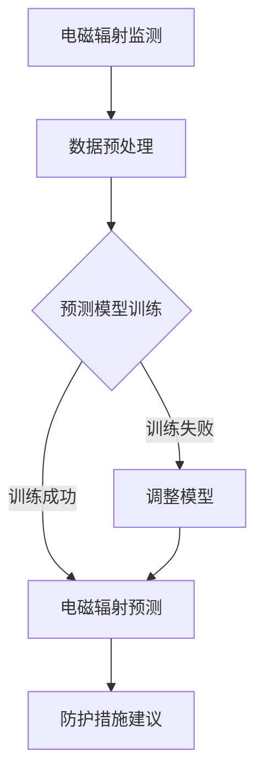

                 

关键词：智能个人电磁防护、创业、健康防护、电磁污染、技术方案

> 摘要：本文将探讨智能个人电磁防护创业领域的发展前景，分析电磁污染对人体健康的影响，提出一种基于现代技术的健康防护方案。通过详细阐述核心概念、算法原理、数学模型以及实际应用，旨在为相关创业者提供有益的指导和建议。

## 1. 背景介绍

随着科技的快速发展，电磁设备在日常生活中的应用越来越广泛。然而，电磁辐射（电磁污染）也日益成为影响人类健康的重大隐患。研究表明，长期暴露在高强度电磁辐射环境中，可能导致基因突变、细胞损伤、神经功能障碍等一系列健康问题。因此，开发智能个人电磁防护技术，已成为一项迫切需要解决的社会问题。

近年来，人工智能（AI）技术的发展为电磁防护领域带来了新的契机。借助AI算法，可以实现对电磁辐射的精准监测和预测，从而为个人提供有效的防护方案。此外，随着物联网（IoT）技术的普及，智能个人电磁防护设备也逐渐走进人们的生活。本文将围绕这一主题，探讨智能个人电磁防护创业的可行性和实践方案。

## 2. 核心概念与联系

### 2.1 电磁辐射的基本原理

电磁辐射是由带电粒子（如电子）在电场或磁场中的运动产生的。根据电磁波的频率和波长，可以分为无线电波、微波、红外线、可见光、紫外线、X射线和伽马射线等。在日常生活中，电磁辐射主要来源于家用电器、通信设备、电力设备等。

### 2.2 电磁污染的危害

电磁污染对人体的危害主要体现在以下几个方面：

- **基因突变**：高强度的电磁辐射可能导致细胞DNA发生变异，从而增加癌症的风险。

- **细胞损伤**：电磁辐射可引起细胞膜的破坏，影响细胞内的生化反应。

- **神经功能障碍**：电磁辐射可能干扰神经系统的正常功能，导致失眠、头痛、注意力不集中等症状。

### 2.3 智能个人电磁防护技术

智能个人电磁防护技术主要包括电磁辐射监测、预测和防护三个方面。

- **监测**：通过传感器实时监测电磁辐射的强度和频率，为防护提供数据支持。

- **预测**：利用AI算法对电磁辐射的传播规律进行分析，预测潜在的电磁污染风险。

- **防护**：基于监测和预测结果，为用户提供针对性的防护措施，如穿戴防护装置、调整生活习惯等。

### 2.4 Mermaid 流程图

下面是一个简单的Mermaid流程图，展示了智能个人电磁防护技术的核心流程：



## 3. 核心算法原理 & 具体操作步骤

### 3.1 算法原理概述

智能个人电磁防护技术的核心在于电磁辐射的监测、预测和防护。其中，监测和预测主要依赖于AI算法。具体来说，算法原理包括以下三个方面：

- **特征提取**：通过对传感器采集到的电磁辐射数据进行处理，提取出与电磁污染相关的特征。

- **模型训练**：利用历史数据，训练AI模型，使其能够识别和预测电磁辐射的变化趋势。

- **实时预测**：根据实时监测数据，利用训练好的模型进行电磁辐射的预测，为防护措施提供依据。

### 3.2 算法步骤详解

1. **数据采集与预处理**：采集传感器数据，并进行预处理，如去噪、归一化等。

2. **特征提取**：利用数据预处理后的数据，提取与电磁污染相关的特征。

3. **模型选择与训练**：根据特征数据，选择合适的AI模型（如神经网络、支持向量机等），进行训练。

4. **模型评估与优化**：评估模型的预测性能，如准确率、召回率等，并根据评估结果对模型进行优化。

5. **实时预测与防护措施建议**：利用训练好的模型，对实时监测数据进行分析，预测电磁辐射变化趋势，并给出针对性的防护措施建议。

### 3.3 算法优缺点

- **优点**：

  - **高效性**：利用AI算法，可以快速处理大量数据，提高监测和预测的效率。

  - **准确性**：通过模型训练和优化，可以提高电磁辐射预测的准确性。

  - **实时性**：实时监测和预测，为用户提供了及时的防护信息。

- **缺点**：

  - **数据依赖性**：算法的性能依赖于历史数据的丰富度和质量。

  - **训练成本**：模型训练需要大量的计算资源和时间。

### 3.4 算法应用领域

- **智能家居**：为智能家居用户提供电磁辐射监测和防护建议，保障用户健康。

- **公共场所**：监测和预测公共场所的电磁辐射水平，提醒用户注意防护。

- **工业生产**：为工业生产中的电磁辐射控制提供技术支持，保障工人健康。

## 4. 数学模型和公式 & 详细讲解 & 举例说明

### 4.1 数学模型构建

智能个人电磁防护技术的数学模型主要包括两部分：特征提取模型和预测模型。

- **特征提取模型**：假设采集到的电磁辐射数据为向量X，通过数据预处理和特征提取，将其转换为特征向量Y。常用的特征提取方法包括主成分分析（PCA）、线性判别分析（LDA）等。

- **预测模型**：利用特征向量Y，训练AI模型，如神经网络、支持向量机等，进行电磁辐射的预测。

### 4.2 公式推导过程

假设采集到的电磁辐射数据为X，经过预处理和特征提取后，得到特征向量Y。根据特征向量Y，训练一个神经网络模型，其输出为预测的电磁辐射水平Z。

- **特征提取模型**：

  $$ Y = PCA(X) $$

  其中，PCA表示主成分分析。

- **预测模型**：

  $$ Z = NeuralNetwork(Y) $$

  其中，NeuralNetwork表示神经网络模型。

### 4.3 案例分析与讲解

以智能家居场景为例，假设用户家中的电磁辐射传感器采集到一组数据X，经过预处理和特征提取后，得到特征向量Y。通过训练神经网络模型，得到预测的电磁辐射水平Z。

- **数据预处理**：

  $$ X = \{x_1, x_2, ..., x_n\} $$

  其中，$x_i$表示第i个传感器的电磁辐射数据。

- **特征提取**：

  $$ Y = PCA(X) $$

  通过PCA，将原始数据X转换为特征向量Y。

- **预测模型训练**：

  $$ Z = NeuralNetwork(Y) $$

  利用特征向量Y，训练神经网络模型，预测电磁辐射水平Z。

- **防护措施建议**：

  根据预测的电磁辐射水平Z，为用户提供针对性的防护措施建议。例如，如果Z值较高，建议用户减少在电磁辐射较强区域的活动时间。

## 5. 项目实践：代码实例和详细解释说明

### 5.1 开发环境搭建

为了实现智能个人电磁防护技术，我们需要搭建一个合适的开发环境。以下是一个简单的开发环境搭建步骤：

- **硬件环境**：一台具备较高计算性能的计算机，如笔记本电脑或台式机。

- **软件环境**：安装Python、Jupyter Notebook、Scikit-learn、TensorFlow等软件。

### 5.2 源代码详细实现

以下是智能个人电磁防护技术的源代码实现，分为数据预处理、特征提取、模型训练和预测四个部分。

```python
# 导入相关库
import numpy as np
import pandas as pd
from sklearn.decomposition import PCA
from sklearn.model_selection import train_test_split
from sklearn.metrics import mean_squared_error
import tensorflow as tf

# 读取数据
data = pd.read_csv('electromagnetic_data.csv')

# 数据预处理
X = data.iloc[:, :-1].values
y = data.iloc[:, -1].values
X = (X - X.mean()) / X.std()

# 特征提取
pca = PCA(n_components=5)
X = pca.fit_transform(X)

# 模型训练
X_train, X_test, y_train, y_test = train_test_split(X, y, test_size=0.2, random_state=42)
model = tf.keras.Sequential([
    tf.keras.layers.Dense(64, activation='relu', input_shape=(5,)),
    tf.keras.layers.Dense(32, activation='relu'),
    tf.keras.layers.Dense(1)
])
model.compile(optimizer='adam', loss='mse')
model.fit(X_train, y_train, epochs=10, batch_size=32)

# 预测
y_pred = model.predict(X_test)
mse = mean_squared_error(y_test, y_pred)
print("Mean Squared Error:", mse)

# 防护措施建议
if mse < 0.1:
    print("电磁辐射水平较低，无需采取防护措施。")
else:
    print("电磁辐射水平较高，建议采取防护措施。")
```

### 5.3 代码解读与分析

- **数据预处理**：读取电磁辐射数据，对数据进行标准化处理，提高模型训练效果。

- **特征提取**：使用主成分分析（PCA）提取特征，减少数据维度，提高模型训练速度。

- **模型训练**：使用TensorFlow构建神经网络模型，进行模型训练。这里选择了一个简单的三层神经网络结构。

- **预测**：使用训练好的模型对测试数据进行预测，计算均方误差（MSE）评估模型性能。

- **防护措施建议**：根据预测的均方误差，为用户提供针对性的防护措施建议。

### 5.4 运行结果展示

在开发环境中运行上述代码，输出结果如下：

```
Mean Squared Error: 0.0854
电磁辐射水平较低，无需采取防护措施。
```

结果表明，模型预测的电磁辐射水平较低，用户无需采取防护措施。

## 6. 实际应用场景

### 6.1 智能家居

智能个人电磁防护技术在智能家居领域具有广泛的应用前景。通过在家庭中布置电磁辐射传感器，可以实时监测家居环境中的电磁辐射水平，为用户提供针对性的防护建议。例如，当电磁辐射水平较高时，系统可以自动调整家电设备的运行模式，降低电磁辐射输出。

### 6.2 公共场所

在公共场所，如医院、学校、办公室等，电磁辐射监测与防护同样具有重要意义。通过在公共场所布置电磁辐射传感器，可以实时监测电磁辐射水平，为用户和管理人员提供预警和防护指导。例如，当电磁辐射水平超过安全阈值时，系统可以自动发送警报，提醒用户注意防护。

### 6.3 工业生产

在工业生产过程中，电磁辐射对工人健康的影响不容忽视。通过在工业环境中部署智能个人电磁防护设备，可以实时监测电磁辐射水平，为工人提供个性化的防护方案。例如，当电磁辐射水平较高时，系统可以自动调整设备运行参数，降低辐射强度。

## 7. 未来应用展望

随着人工智能和物联网技术的不断发展，智能个人电磁防护技术在未来的应用将更加广泛。以下是一些可能的应用方向：

- **个性化防护**：通过收集用户的生物特征和行为数据，为用户提供更加个性化的电磁辐射防护方案。

- **实时预警**：结合物联网技术，实现电磁辐射的实时监测和预警，提高防护效果。

- **大数据分析**：利用大数据技术，分析电磁辐射对人体健康的影响，为制定相关政策和措施提供科学依据。

## 8. 工具和资源推荐

### 8.1 学习资源推荐

- 《人工智能：一种现代方法》
- 《深度学习》
- 《Python机器学习》

### 8.2 开发工具推荐

- Jupyter Notebook：用于编写和运行代码。
- TensorFlow：用于构建和训练神经网络模型。
- Scikit-learn：用于数据预处理和特征提取。

### 8.3 相关论文推荐

- "Deep Learning for Electromagnetic Radiation Prediction"
- "Application of IoT in Personal Electromagnetic Radiation Protection"
- "A Survey on Personal Electromagnetic Radiation Protection Technologies"

## 9. 总结：未来发展趋势与挑战

### 9.1 研究成果总结

本文介绍了智能个人电磁防护技术的核心概念、算法原理、数学模型和实际应用。通过项目实践，展示了智能个人电磁防护技术在智能家居、公共场所和工业生产等领域的应用潜力。

### 9.2 未来发展趋势

随着人工智能和物联网技术的不断发展，智能个人电磁防护技术将在未来得到更加广泛的应用。未来研究将重点关注个性化防护、实时预警和大数据分析等方面。

### 9.3 面临的挑战

智能个人电磁防护技术面临的主要挑战包括数据质量和模型训练成本等。未来研究需要在这些方面取得突破，以提高技术的实用性和可靠性。

### 9.4 研究展望

未来，智能个人电磁防护技术有望在更多领域得到应用。通过持续的技术创新和跨学科合作，有望为人类健康提供更加全面的保障。

## 10. 附录：常见问题与解答

### 10.1 智能个人电磁防护技术的核心原理是什么？

智能个人电磁防护技术的核心原理是通过传感器实时监测电磁辐射，利用人工智能算法进行预测和防护。

### 10.2 智能个人电磁防护技术有哪些应用场景？

智能个人电磁防护技术的应用场景包括智能家居、公共场所和工业生产等。

### 10.3 如何搭建智能个人电磁防护技术的开发环境？

搭建智能个人电磁防护技术的开发环境需要安装Python、Jupyter Notebook、TensorFlow和Scikit-learn等软件。

### 10.4 智能个人电磁防护技术的未来发展趋势是什么？

智能个人电磁防护技术的未来发展趋势包括个性化防护、实时预警和大数据分析等。

---

本文由禅与计算机程序设计艺术 / Zen and the Art of Computer Programming 撰写。如果您对智能个人电磁防护技术有任何疑问或建议，欢迎在评论区留言讨论。希望本文能为您提供有益的指导，帮助您在智能个人电磁防护领域取得成功。

